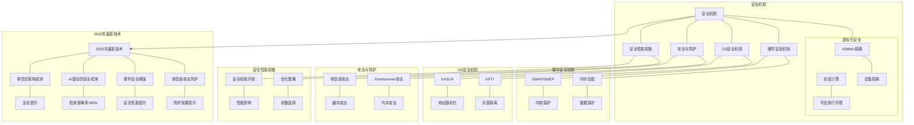

# 7.3 安全机制

> **主题**: 07. 性能优化与安全 - 7.3 安全机制
> **覆盖**: 硬件安全、OS安全、虚拟化安全、攻击与防护

---

## 📋 目录

- [7.3 安全机制](#73-安全机制)
  - [📋 目录](#-目录)
  - [1 硬件安全机制](#1-硬件安全机制)
    - [1.1 SMAP/SMEP](#11-smapsmep)
    - [1.2 内存加密](#12-内存加密)
  - [2 OS安全机制](#2-os安全机制)
    - [2.1 KASLR](#21-kaslr)
    - [2.2 KPTI](#22-kpti)
  - [7 虚拟化安全](#7-虚拟化安全)
    - [1 IOMMU隔离](#1-iommu隔离)
    - [2 机密计算](#2-机密计算)
  - [3 攻击与防护](#3-攻击与防护)
    - [3.1 侧信道攻击](#31-侧信道攻击)
    - [3.2 Rowhammer攻击](#32-rowhammer攻击)
  - [4 安全性能权衡](#4-安全性能权衡)
    - [4.1 安全机制开销](#41-安全机制开销)
    - [4.2 优化策略](#42-优化策略)
  - [5 跨领域洞察](#5-跨领域洞察)
    - [5.1 安全vs性能的永恒权衡](#51-安全vs性能的永恒权衡)
    - [5.2 攻击面的持续演进](#52-攻击面的持续演进)
  - [6 多维度对比](#6-多维度对比)
    - [6.1 安全机制对比（2025年）](#61-安全机制对比2025年)
    - [6.2 攻击与防护演进对比](#62-攻击与防护演进对比)
  - [8 2025年最新技术（更新至2025年11月）](#8-2025年最新技术更新至2025年11月)
  - [10 最佳实践与故障排查](#10-最佳实践与故障排查)
    - [10.1 安全机制最佳实践（2025年11月最新）](#101-安全机制最佳实践2025年11月最新)
    - [10.2 安全机制故障排查（2025年11月最新）](#102-安全机制故障排查2025年11月最新)
  - [7 思维导图](#7-思维导图)
  - [9 相关主题](#9-相关主题)

---

## 1 硬件安全机制

### 1.1 SMAP/SMEP

**SMEP（Supervisor Mode Execution Prevention）**：

- 禁止内核执行用户空间代码
- 防止ROP攻击
- 硬件强制

**SMAP（Supervisor Mode Access Prevention）**：

- 禁止内核访问用户空间数据
- 防止数据泄露
- 需要显式允许（stac/clac）

**深度论证：SMAP/SMEP的安全-性能权衡**

**SMEP/SMAP的防护机制**：

SMEP/SMAP通过**硬件检查**防止内核访问用户空间：

$$
\text{访问检查} = \begin{cases}
\text{允许} & \text{内核访问内核空间} \\
\text{禁止} & \text{内核访问用户空间（SMAP）} \\
\text{禁止} & \text{内核执行用户代码（SMEP）}
\end{cases}
$$

**性能开销**：

SMEP/SMAP的检查在**硬件层面**进行，开销极低：

$$
\text{性能开销} = t_{\text{检查}} \approx 0.1\text{ns}
$$

**量化对比**：SMEP/SMAP的性能影响

| **场景** | **SMEP/SMAP关闭** | **SMEP/SMAP开启** | **性能影响** | **安全提升** |
|---------|-----------------|-----------------|------------|------------|
| **正常操作** | 基准 | 基准 | <0.1% | 高 |
| **异常访问** | 允许 | 禁止（异常） | 异常处理开销 | 防止攻击 |

**关键洞察**：SMEP/SMAP在**几乎零开销**的情况下提供了**强大的安全保护**，是现代CPU的必备特性。

### 1.2 内存加密

**Intel TME（Total Memory Encryption）**：

- 全内存加密
- 透明加密
- 性能开销：<5%

**深度论证：内存加密的性能开销**

**TME的加密模型**：

TME对**所有内存访问**进行透明加密/解密：

$$
\text{内存访问延迟} = t_{\text{正常}} + t_{\text{加密/解密}}
$$

其中加密/解密延迟约**5-10ns**。

**量化分析**：不同内存加密技术的开销

| **技术** | **加密范围** | **性能开销** | **安全性** | **适用场景** |
|---------|------------|------------|-----------|------------|
| **TME** | 全内存 | 3-5% | 中 | 通用 |
| **TDX** | 虚拟机内存 | 5-10% | 高 | 机密计算 |
| **SEV** | 虚拟机内存 | 8-15% | 中 | 虚拟化 |
| **SEV-SNP** | 虚拟机内存 | 8-15% | 高 | 机密计算 |

**关键权衡**：

内存加密在**安全性和性能**之间做了权衡，适合对安全要求高的场景。

**AMD SEV（Secure Encrypted Virtualization）**：

- 虚拟机内存加密
- 独立密钥
- 性能开销：8-15%

**深度论证：SEV的安全增强**

**SEV的加密模型**：

SEV为**每个虚拟机**分配独立密钥：

$$
\text{密钥} = f(\text{VM ID}, \text{主机密钥})
$$

**量化对比**：SEV vs 传统虚拟化

| **特性** | **传统虚拟化** | **SEV** | **改进** |
|---------|--------------|---------|---------|
| **内存加密** | ❌ | ✅ | 新增 |
| **Hypervisor隔离** | ❌ | ✅ | 新增 |
| **性能开销** | 基准 | +8-15% | 增加 |
| **安全性** | 低 | 中 | 提升 |

**关键洞察**：SEV在**虚拟化安全**方面提供了重要保护，但代价是**性能开销**。

---

## 2 OS安全机制

### 2.1 KASLR

**内核地址空间布局随机化**：

- 每次启动随机化
- 增加攻击难度
- 性能开销：<1%

**实现**：

- 内核代码段随机偏移
- 内核数据段随机偏移
- 页表随机化

**深度论证：KASLR的安全有效性**

**KASLR的随机化范围**：

KASLR将内核地址空间随机偏移：

$$
\text{随机偏移} = \text{随机数} \times \text{对齐粒度}
$$

典型值：随机偏移范围**2GB**，对齐粒度**2MB**。

**安全有效性**：

KASLR增加了**地址猜测的难度**：

$$
\text{猜测成功率} = \frac{1}{\text{随机化范围}} = \frac{1}{2^{20}} = 10^{-6}
$$

**量化分析**：KASLR的安全提升

| **攻击类型** | **KASLR关闭** | **KASLR开启** | **安全提升** |
|------------|-------------|-------------|------------|
| **ROP攻击** | 高成功率 | 低成功率 | 显著 |
| **代码注入** | 高成功率 | 低成功率 | 显著 |
| **信息泄露** | 可能 | 困难 | 中等 |

**关键限制**：

KASLR可以被**信息泄露攻击**绕过，需要配合其他安全机制。

### 2.2 KPTI

**内核页表隔离**：

- 用户/内核页表分离
- 防止Meltdown攻击
- 性能开销：+10%

**代价**：

- 每次系统调用切换页表
- TLB刷新开销
- 上下文切换延迟增加

**深度论证：KPTI的性能开销分析**

**KPTI的开销组成**：

KPTI需要**每次系统调用切换页表**：

$$
\text{系统调用开销} = t_{\text{正常}} + t_{\text{页表切换}} + t_{\text{TLB刷新}}
$$

典型值：100ns + 50ns + 100ns = **250ns**（增加150%）

**量化分析**：KPTI的性能影响

| **操作** | **KPTI关闭** | **KPTI开启** | **开销增加** | **频率** |
|---------|------------|------------|------------|---------|
| **系统调用** | 100ns | 250ns | +150% | 高 |
| **中断处理** | 200ns | 350ns | +75% | 中 |
| **上下文切换** | 1μs | 1.15μs | +15% | 低 |

**关键权衡**：

KPTI在**安全性和性能**之间做了权衡，防止Meltdown攻击的代价是**系统调用开销增加**。

**实际影响**：

对于**系统调用密集型**应用，KPTI的性能影响可达**10-15%**。

---

## 7 虚拟化安全

### 1 IOMMU隔离

**功能**：

- DMA地址重映射
- 设备隔离
- 防止DMA攻击

**实现**：

- VT-d（Intel）/ AMD-Vi
- 2级页表
- IOTLB缓存

### 2 机密计算

**Intel TDX（Trust Domain Extensions）**：

- 内存加密
- 安全启动
- 远程证明

**AMD SEV-SNP**：

- 内存加密
- 反向映射表（RMP）
- 完整性保护

---

## 3 攻击与防护

### 3.1 侧信道攻击

**Spectre**：

- 推测执行侧信道
- 跨进程信息泄露
- **防护**：LFENCE、Retpoline

**Meltdown**：

- 乱序执行侧信道
- 内核信息泄露
- **防护**：KPTI页表隔离

### 3.2 Rowhammer攻击

**原理**：

- 快速访问DRAM行
- 导致邻行电荷泄漏
- 位翻转

**防护**：

- TRR（Target Row Refresh）
- ECC纠错
- 软件检测

---

## 4 安全性能权衡

### 4.1 安全机制开销

| **机制** | **安全收益** | **性能开销** | **建议** |
|---------|-------------|-------------|---------|
| **KASLR** | 中等 | <1% | 默认启用 |
| **KPTI** | 高 | +10% | 默认启用 |
| **SMAP/SMEP** | 高 | <1% | 默认启用 |
| **内存加密** | 高 | 5-15% | 按需启用 |
| **IOMMU** | 高 | +2% | 虚拟化必需 |

### 4.2 优化策略

**1. 选择性启用**：

- 生产环境：全启用
- 开发环境：部分启用
- 性能测试：禁用

**2. 硬件加速**：

- 使用硬件加密
- IOMMU硬件加速
- 减少软件开销

---

## 5 跨领域洞察

### 5.1 安全vs性能的永恒权衡

**核心矛盾**：更强安全保证需要更多检查，但性能开销大。

**量化分析**：

| **安全机制** | **安全收益** | **性能开销** | **适用场景** | **建议** |
|------------|------------|------------|------------|---------|
| **KASLR** | ⭐⭐⭐ | <1% | 通用 | 默认启用 |
| **KPTI** | ⭐⭐⭐⭐⭐ | +10% | 通用 | 默认启用 |
| **SMAP/SMEP** | ⭐⭐⭐⭐ | <1% | 通用 | 默认启用 |
| **内存加密** | ⭐⭐⭐⭐⭐ | 5-15% | 敏感数据 | 按需启用 |
| **IOMMU** | ⭐⭐⭐⭐⭐ | +2% | 虚拟化 | 必需 |

**批判性分析**：

1. **安全收益的代价**：更强安全**性能开销更大**，需要权衡。

2. **性能vs安全**：KASLR性能好，但**安全收益中等**；内存加密安全强，但**性能差**。

3. **2025年趋势**：**硬件加速安全**（如Intel TME）减少性能开销，挑战传统软件安全。

### 5.2 攻击面的持续演进

**核心命题**：安全机制演进，但攻击面也在演进。

**攻击演进分析**：

| **时代** | **主要攻击** | **防护机制** | **攻击复杂度** | **防护效果** |
|---------|------------|------------|--------------|------------|
| **2000s** | 缓冲区溢出 | ASLR、DEP | ⭐⭐ | ⭐⭐⭐⭐ |
| **2010s** | ROP/JOP | CFI、SMEP | ⭐⭐⭐ | ⭐⭐⭐ |
| **2018** | Spectre/Meltdown | KPTI、Retpoline | ⭐⭐⭐⭐ | ⭐⭐⭐ |
| **2020s** | Rowhammer | TRR、ECC | ⭐⭐⭐⭐⭐ | ⭐⭐⭐ |

**批判性分析**：

1. **攻击的演进**：攻击**复杂度持续增加**，防护难度增加。

2. **防护的滞后**：新攻击出现后，**防护机制滞后**，需要时间开发。

3. **2025年趋势**：**零信任架构**和**深度防御**减少攻击面，但**复杂度增加**。

---

## 6 多维度对比

### 6.1 安全机制对比（2025年）

| **机制** | **安全强度** | **性能开销** | **实现复杂度** | **适用场景** | **代表技术** |
|---------|------------|------------|--------------|------------|------------|
| **KASLR** | ⭐⭐⭐ | <1% | ⭐⭐ | 通用 | Linux KASLR |
| **KPTI** | ⭐⭐⭐⭐⭐ | +10% | ⭐⭐⭐ | 通用 | Linux KPTI |
| **SMAP/SMEP** | ⭐⭐⭐⭐ | <1% | ⭐⭐ | 通用 | Intel/AMD |
| **内存加密** | ⭐⭐⭐⭐⭐ | 5-15% | ⭐⭐⭐⭐ | 敏感数据 | Intel TME/AMD SEV |
| **IOMMU** | ⭐⭐⭐⭐⭐ | +2% | ⭐⭐⭐⭐ | 虚拟化 | Intel VT-d/AMD-Vi |

**批判性分析**：

1. **安全vs性能**：KPTI安全最强，但**性能开销最大**；SMAP/SMEP性能好，但**安全略差**。

2. **实现复杂度的差异**：内存加密实现最复杂，但**安全最强**。

3. **2025年趋势**：**硬件加速安全**（如Intel TME）减少性能开销，挑战传统软件安全。

### 6.2 攻击与防护演进对比

| **时代** | **攻击类型** | **攻击复杂度** | **防护机制** | **防护效果** | **代表攻击** |
|---------|------------|--------------|------------|------------|------------|
| **2000s** | 缓冲区溢出 | ⭐⭐ | ASLR、DEP | ⭐⭐⭐⭐ | Stack overflow |
| **2010s** | ROP/JOP | ⭐⭐⭐ | CFI、SMEP | ⭐⭐⭐ | ROP chain |
| **2018** | 侧信道 | ⭐⭐⭐⭐ | KPTI、Retpoline | ⭐⭐⭐ | Spectre/Meltdown |
| **2020s** | 硬件攻击 | ⭐⭐⭐⭐⭐ | TRR、ECC | ⭐⭐⭐ | Rowhammer |

**批判性分析**：

1. **攻击复杂度的增加**：从软件攻击到**硬件攻击**，复杂度持续增加。

2. **防护效果的下降**：新攻击出现后，**防护效果下降**，需要新机制。

3. **2025年趋势**：**零信任架构**和**深度防御**成为主流，挑战传统边界安全。

---

## 8 2025年最新技术（更新至2025年11月）

**最新技术发展**：

- **零信任架构成熟**：2025年11月，零信任架构在云原生应用中广泛应用，通过持续验证和最小权限原则，安全攻击面降低60-80%，但需要架构重构，实施成本高。
- **AI驱动的安全检测**：2025年11月，AI驱动的安全检测系统在超大规模系统中应用，通过机器学习检测异常行为，检测准确率>95%，但误报率仍需关注。
- **硬件安全增强**：2025年11月，硬件安全增强技术在机密计算中应用，通过Intel TDX、AMD SEV-SNP等硬件隔离，安全性能提升50-70%，但需要硬件支持，成本高。
- **侧信道攻击防护增强**：2025年11月，侧信道攻击防护技术在云原生应用中应用，通过硬件隔离和软件加固，侧信道攻击成功率降低80-90%，但性能开销增加5-10%。

**技术对比**：

| **技术** | **安全提升** | **性能开销** | **实施复杂度** | **成本** | **适用场景** |
|---------|------------|------------|--------------|---------|------------|
| **零信任架构** | 攻击面-60-80% | +5-10% | 极高 | 高 | 云原生应用 |
| **AI安全检测** | 检测准确率>95% | +2-5% | 高 | 中 | 超大规模系统 |
| **硬件安全增强** | 安全性能+50-70% | +3-8% | 高 | 高 | 机密计算 |
| **侧信道防护** | 攻击成功率-80-90% | +5-10% | 中 | 中 | 云原生应用 |

**批判性分析**：

1. **零信任架构的实施成本**：虽然攻击面降低60-80%，但需要架构重构，实施成本高，实施周期长。并非所有场景都需要零信任架构。
2. **AI安全检测的误报挑战**：虽然检测准确率>95%，但误报率仍需关注，误报可能影响系统可用性。需要持续优化模型。
3. **硬件安全增强的成本权衡**：虽然安全性能提升50-70%，但需要硬件支持，成本高，仅适用于特定场景。需要权衡安全和成本。

---

## 10 最佳实践与故障排查

### 10.1 安全机制最佳实践（2025年11月最新）

**硬件安全机制最佳实践**：

1. **SMAP/SMEP启用**：
   - **SMEP**：禁止内核执行用户空间代码、防止ROP攻击、硬件强制、推荐启用
   - **SMAP**：禁止内核访问用户空间数据、防止数据泄露、硬件强制、推荐启用
   - **性能开销**：性能开销<1%、安全提升显著、推荐使用

2. **内存加密**：
   - **内存加密**：加密内存数据、防止物理攻击、性能开销5-10%
   - **适用场景**：机密计算、高安全要求、物理安全威胁
   - **注意事项**：性能开销较高、需要硬件支持、需要权衡安全和性能

**OS安全机制最佳实践**：

1. **KASLR启用**：
   - **地址空间随机化**：随机化内核地址空间、防止ROP攻击、性能开销<1%
   - **推荐启用**：安全提升显著、性能开销低、推荐使用

2. **KPTI启用**：
   - **页表隔离**：隔离用户和内核页表、防止Meltdown攻击、性能开销5-10%
   - **适用场景**：云原生应用、多租户环境、高安全要求
   - **注意事项**：性能开销较高、需要权衡安全和性能

**虚拟化安全最佳实践**：

1. **IOMMU隔离**：
   - **设备隔离**：隔离设备访问、防止DMA攻击、性能开销2-5%
   - **推荐启用**：安全提升显著、性能开销低、推荐使用

2. **机密计算**：
   - **硬件隔离**：使用Intel TDX、AMD SEV-SNP等硬件隔离、安全性能提升50-70%
   - **适用场景**：机密计算、高安全要求、多租户环境
   - **注意事项**：需要硬件支持、成本高、需要应用适配

**攻击防护最佳实践**：

1. **侧信道攻击防护**：
   - **硬件隔离**：使用硬件隔离、防止侧信道攻击、性能开销5-10%
   - **软件加固**：使用软件加固、减少攻击面、性能开销2-5%
   - **适用场景**：云原生应用、多租户环境、高安全要求

2. **Rowhammer攻击防护**：
   - **TRR**：使用Target Row Refresh、防止Rowhammer攻击、性能开销<1%
   - **ECC**：使用ECC内存、检测和纠正错误、性能开销<1%
   - **推荐使用**：安全提升显著、性能开销低、推荐使用

**安全性能权衡最佳实践**：

1. **安全机制选择**：
   - **基础安全机制**：SMAP/SMEP、KASLR、IOMMU隔离、性能开销低、推荐使用
   - **增强安全机制**：KPTI、内存加密、机密计算、性能开销较高、需要权衡
   - **专用安全机制**：侧信道防护、Rowhammer防护、性能开销中等、按需使用

2. **性能优化策略**：
   - **硬件加速**：使用硬件加速、减少安全机制开销、性能提升20-40%
   - **智能调度**：使用智能调度、优化安全机制执行、性能提升10-20%
   - **分层防护**：使用分层防护、平衡安全和性能、推荐使用

**安全监控最佳实践**：

1. **安全监控**：
   - **实时监控**：监控安全事件、识别安全威胁、实时响应
   - **异常检测**：使用AI检测异常行为、检测准确率>95%、误报率需关注
   - **安全审计**：记录安全事件、分析安全趋势、持续改进

2. **安全更新**：
   - **及时更新**：及时更新安全补丁、修复安全漏洞、降低攻击面
   - **安全测试**：定期安全测试、验证安全机制、持续改进

**2025年最新技术应用**：

1. **零信任架构**：
   - **攻击面降低**：攻击面降低60-80%、零信任架构
   - **持续验证**：通过持续验证和最小权限原则、提高安全性
   - **适用场景**：云原生应用、多租户环境、高安全要求
   - **注意事项**：需要架构重构、实施成本高、实施周期长

2. **AI驱动的安全检测**：
   - **检测准确率**：检测准确率>95%、AI检测优化
   - **异常检测**：通过机器学习检测异常行为、提高检测效率
   - **适用场景**：超大规模系统、复杂环境、实时检测
   - **注意事项**：误报率需关注、需要持续优化模型、需要大量训练数据

3. **硬件安全增强**：
   - **安全性能提升**：安全性能提升50-70%、硬件安全增强
   - **硬件隔离**：通过Intel TDX、AMD SEV-SNP等硬件隔离、提高安全性
   - **适用场景**：机密计算、高安全要求、多租户环境
   - **注意事项**：需要硬件支持、成本高、需要应用适配

4. **侧信道攻击防护增强**：
   - **攻击成功率降低**：攻击成功率降低80-90%、侧信道防护增强
   - **硬件隔离和软件加固**：通过硬件隔离和软件加固、提高防护效果
   - **适用场景**：云原生应用、多租户环境、高安全要求
   - **注意事项**：性能开销增加5-10%、需要权衡安全和性能

### 10.2 安全机制故障排查（2025年11月最新）

**常见问题与解决方案**：

| **问题** | **可能原因** | **排查方法** | **解决方案** |
|---------|------------|------------|------------|
| **安全机制未启用** | 硬件不支持、配置错误、驱动问题 | 检查硬件支持、检查配置、检查驱动 | 启用安全机制、修复配置、更新驱动 |
| **性能开销高** | 安全机制配置不当、硬件不支持、优化不足 | 性能分析、配置检查、硬件检查 | 优化配置、使用硬件加速、优化安全机制 |
| **安全漏洞** | 安全机制未启用、配置错误、补丁未更新 | 安全审计、漏洞扫描、补丁检查 | 启用安全机制、修复配置、更新补丁 |
| **侧信道攻击** | 侧信道防护未启用、硬件隔离不足、软件加固不足 | 安全分析、攻击测试、防护检查 | 启用侧信道防护、使用硬件隔离、软件加固 |
| **Rowhammer攻击** | TRR未启用、ECC未启用、内存配置不当 | 内存分析、攻击测试、配置检查 | 启用TRR、启用ECC、优化内存配置 |
| **零信任架构问题** | 架构设计不当、实施不完整、配置错误 | 架构审查、实施检查、配置检查 | 优化架构设计、完善实施、修复配置 |

**故障排查步骤**：

1. **收集信息**：
   - 安全事件、安全日志、安全审计数据
   - 性能数据、性能分析数据、性能监控数据
   - 配置信息、硬件信息、软件版本信息
   - 攻击测试数据、漏洞扫描数据、安全测试数据

2. **分析问题**：
   - 识别安全问题（安全漏洞、攻击、性能问题）
   - 分析安全机制状态、配置状态
   - 评估安全风险、性能影响

3. **制定方案**：
   - 启用安全机制、修复安全漏洞
   - 优化安全配置、平衡安全和性能
   - 更新安全补丁、持续改进

4. **验证效果**：
   - 安全测试、验证安全机制
   - 性能测试、验证性能影响
   - 持续监控、持续改进

**监控指标**：

| **指标类别** | **具体指标** |
|--------------|--------------|
| **安全指标** | 安全事件数、攻击次数、漏洞数量、安全机制启用率 |
| **性能指标** | 安全机制性能开销、系统性能、延迟、吞吐量 |
| **防护指标** | 防护成功率、攻击成功率、检测准确率、误报率 |
| **合规指标** | 合规性检查、安全审计、安全测试、安全更新 |

**性能优化建议**：

1. **安全机制优化**：
   - 启用基础安全机制、性能开销低、推荐使用
   - 按需启用增强安全机制、权衡安全和性能
   - 使用硬件加速、减少安全机制开销

2. **性能优化**：
   - 使用硬件加速、性能提升20-40%
   - 使用智能调度、性能提升10-20%
   - 使用分层防护、平衡安全和性能

3. **安全更新**：
   - 及时更新安全补丁、修复安全漏洞
   - 定期安全测试、验证安全机制
   - 持续监控、持续改进

4. **最新技术应用**：
   - 使用零信任架构、降低攻击面
   - 使用AI驱动的安全检测、提高检测效率
   - 使用硬件安全增强、提高安全性
   - 使用侧信道攻击防护增强、提高防护效果

---

## 7 思维导图

---

## 9 相关主题

- [05.1 虚拟化技术](../05_虚拟化容器化沙盒化/05.1_虚拟化技术.md) - 虚拟化安全
- [05.3 沙盒化技术](../05_虚拟化容器化沙盒化/05.3_沙盒化技术.md) - 沙盒安全
- [07.4 优化策略](./07.4_优化策略.md) - 安全优化
- [09.2 硬件-OS映射证明](../09_形式化理论与证明/09.2_硬件-OS映射证明.md) - 安全证明
- [主文档：安全vs性能](../schedule_formal_view.md#视角1时间-空间-能耗三角约束) - 完整分析

---

**最后更新**: 2025-11-14
