# 7.4 优化策略

> **主题**: 07. 性能优化与安全 - 7.4 优化策略
> **覆盖**: CPU-bound、IO-bound、Latency-sensitive优化

---

## 📋 目录

- [7.4 优化策略](#74-优化策略)
  - [📋 目录](#-目录)
  - [1 CPU-bound优化](#1-cpu-bound优化)
    - [1.1 核心策略](#11-核心策略)
  - [2 IO-bound优化](#2-io-bound优化)
    - [2.1 核心策略](#21-核心策略)
  - [3 Latency-sensitive优化](#3-latency-sensitive优化)
    - [3.1 核心策略](#31-核心策略)
  - [7 通用优化原则](#7-通用优化原则)
    - [1 优化层次](#1-优化层次)
    - [2 优化流程](#2-优化流程)
  - [4 优化工具与方法](#4-优化工具与方法)
    - [4.1 性能分析工具](#41-性能分析工具)
    - [4.2 优化检查清单](#42-优化检查清单)
  - [5 跨领域洞察](#5-跨领域洞察)
    - [5.1 优化策略的收益递减](#51-优化策略的收益递减)
    - [5.2 优化策略的场景依赖性](#52-优化策略的场景依赖性)
  - [6 多维度对比](#6-多维度对比)
    - [6.1 优化策略对比（2025年）](#61-优化策略对比2025年)
    - [6.2 优化层次演进对比](#62-优化层次演进对比)
  - [11 最佳实践与故障排查](#11-最佳实践与故障排查)
    - [11.1 优化策略最佳实践（2025年11月最新）](#111-优化策略最佳实践2025年11月最新)
    - [11.2 优化策略故障排查（2025年11月最新）](#112-优化策略故障排查2025年11月最新)
  - [8 2025年最新技术（更新至2025年11月）](#8-2025年最新技术更新至2025年11月)
  - [7 思维导图](#7-思维导图)
  - [10 相关主题](#10-相关主题)
  - [9 技术选型指南（已整合view文件夹内容）](#9-技术选型指南已整合view文件夹内容)
    - [9.1 选型原则](#91-选型原则)
    - [9.2 按场景选型](#92-按场景选型)
    - [9.3 技术对比矩阵（view文件夹补充）](#93-技术对比矩阵view文件夹补充)
    - [9.4 选型决策树（view文件夹补充）](#94-选型决策树view文件夹补充)
    - [9.5 选型检查清单（view文件夹补充）](#95-选型检查清单view文件夹补充)

---

## 1 CPU-bound优化

### 1.1 核心策略

**1. 绑核运行**：

```bash
taskset -c 0,1 ./app
```

- 避免上下文切换
- 保持缓存局部性
- 性能提升：10-20%

**深度论证：绑核的性能影响**

**上下文切换的开销**：

上下文切换需要保存和恢复寄存器状态：

$$
\text{上下文切换开销} = t_{\text{保存}} + t_{\text{恢复}} + t_{\text{缓存失效}}
$$

典型值：1μs + 1μs + 10μs = **12μs**

**绑核的优势**：

绑核可以**避免上下文切换**，保持缓存局部性：

$$
\text{性能提升} = \frac{\text{上下文切换开销}}{\text{执行时间}}
$$

**量化分析**：绑核的性能影响

| **场景** | **上下文切换频率** | **绑核前性能** | **绑核后性能** | **提升** |
|---------|-----------------|--------------|--------------|---------|
| **CPU密集型** | 低 | 基准 | +10% | 10% |
| **混合负载** | 中 | 基准 | +15% | 15% |
| **高切换频率** | 高 | 基准 | +20% | 20% |

**关键权衡**：

绑核的**代价**是降低系统灵活性，可能导致**负载不均衡**。

**2. NUMA绑定**：

```bash
numactl --membind=0 --cpunodebind=0 ./app
```

- 本地内存访问
- 减少远程访问延迟
- 性能提升：20-40%

**深度论证：NUMA绑定的性能影响**

**NUMA访问延迟差异**：

NUMA架构下，本地和远程内存访问延迟差异显著：

$$
\text{延迟比} = \frac{\text{远程延迟}}{\text{本地延迟}} = \frac{150\text{ns}}{80\text{ns}} = 1.875
$$

**NUMA绑定的优势**：

NUMA绑定可以**强制使用本地内存**，避免远程访问：

$$
\text{性能提升} = \frac{\text{远程访问比例} \times (\text{远程延迟} - \text{本地延迟})}{\text{总延迟}}
$$

**量化分析**：NUMA绑定的性能影响

| **远程访问比例** | **NUMA绑定前** | **NUMA绑定后** | **性能提升** |
|---------------|--------------|--------------|------------|
| **10%** | 基准 | +5% | 5% |
| **30%** | 基准 | +15% | 15% |
| **50%** | 基准 | +30% | 30% |

**关键洞察**：NUMA绑定在**高远程访问比例**的场景下优势明显。

**3. 巨页**：

```bash
echo always > /sys/kernel/mm/transparent_hugepage/enabled
```

- 减少TLB未命中
- 性能提升：15%

**深度论证：巨页的性能优势**

**TLB未命中的开销**：

TLB未命中需要**页表遍历**，延迟较高：

$$
\text{TLB未命中开销} = \text{页表遍历延迟} = 4 \times t_{\text{内存访问}}
$$

典型值：4 × 80ns = **320ns**

**巨页的优势**：

巨页（2MB/1GB）可以**减少TLB条目数**，提高TLB命中率：

$$
\text{TLB命中率} = 1 - \frac{\text{内存大小}}{\text{TLB容量} \times \text{页大小}}
$$

**量化分析**：巨页的性能影响

| **内存大小** | **4KB页TLB命中率** | **2MB页TLB命中率** | **性能提升** |
|------------|------------------|------------------|------------|
| **1GB** | 95% | 99% | +5% |
| **4GB** | 80% | 98% | +15% |
| **16GB** | 50% | 95% | +30% |

**关键洞察**：巨页在**大内存应用**场景下优势明显，可以**显著提高TLB命中率**。

**4. 禁用C-State**：

```bash
echo 1 > /sys/devices/system/cpu/cpu*/cpuidle/state*/disable
```

- 避免唤醒延迟
- 保持高频运行

**深度论证：C-State的延迟-功耗权衡**

**C-State的唤醒延迟**：

C-State越深，唤醒延迟越长：

$$
\text{唤醒延迟} = f(\text{C-State深度})
$$

典型值：C1: 1μs, C3: 10μs, C6: 100μs

**禁用C-State的代价**：

禁用C-State会**增加功耗**，但可以**消除唤醒延迟**：

$$
\text{功耗增加} = P_{\text{idle}} - P_{\text{C-State}}
$$

**量化分析**：C-State的权衡

| **C-State** | **功耗** | **唤醒延迟** | **适用场景** |
|------------|---------|------------|------------|
| **C0** | 100% | 0μs | 运行中 |
| **C1** | 90% | 1μs | 短暂空闲 |
| **C3** | 50% | 10μs | 中等空闲 |
| **C6** | 10% | 100μs | 深度空闲 |

**关键权衡**：

对于**延迟敏感**的应用，禁用C-State可以**消除唤醒延迟**，但代价是**功耗增加**。

---

## 2 IO-bound优化

### 2.1 核心策略

**1. io_uring**：

- 零系统调用
- 轮询模式
- 批处理
- 性能提升：50-100%

**2. 零拷贝**：

- sendfile系统调用
- splice管道传输
- 减少数据拷贝
- 性能提升：2-3x

**3. 多队列**：

- blk-mq块层
- 每CPU队列
- 减少锁竞争
- 性能提升：30-50%

**4. 预读优化**：

```bash
blockdev --setra 4096 /dev/sda
```

- 增加预读大小
- 顺序访问优化

---

## 3 Latency-sensitive优化

### 3.1 核心策略

**1. 实时调度**：

```c
struct sched_param param;
param.sched_priority = 99;
pthread_setschedparam(pthread_self(), SCHED_FIFO, &param);
```

- SCHED_FIFO最高优先级
- 不可抢占（同优先级）
- 延迟降低：50-80%

**2. 中断隔离**：

```bash
echo 2 > /proc/irq/24/smp_affinity
```

- 绑定中断到特定CPU
- 避免中断干扰
- 延迟抖动降低：90%

**3. 禁用降频**：

```bash
echo performance > /sys/devices/system/cpu/cpu*/cpufreq/scaling_governor
```

- 保持最高频率
- 避免频率切换延迟

**4. 预分配内存**：

- 启动时分配
- 避免运行时分配
- 减少缺页异常

---

## 7 通用优化原则

### 1 优化层次

**1. 算法优化**：

- 选择合适算法
- 时间复杂度优化
- 最大收益

**2. 数据结构优化**：

- 缓存友好布局
- 减少指针追踪
- 局部性优化

**3. 系统优化**：

- 调度策略
- 内存管理
- IO优化

**4. 硬件优化**：

- 利用硬件特性
- 硬件加速
- 最后手段

### 2 优化流程

**1. 性能分析**：

- 使用perf/profiling工具
- 识别热点
- 量化瓶颈

**2. 优化实施**：

- 从高收益开始
- 逐步优化
- 验证效果

**3. 回归测试**：

- 功能正确性
- 性能提升验证
- 稳定性测试

---

## 4 优化工具与方法

### 4.1 性能分析工具

**perf**：

```bash
perf record -g ./app
perf report
```

- CPU性能分析
- 调用图分析
- 热点识别

**ftrace**：

```bash
echo function > /sys/kernel/debug/tracing/current_tracer
```

- 内核函数追踪
- 延迟分析

**eBPF**：

- 动态追踪
- 低开销
- 灵活分析

### 4.2 优化检查清单

**CPU优化**：

- [ ] 绑核运行
- [ ] NUMA绑定
- [ ] 巨页启用
- [ ] 缓存对齐
- [ ] 避免伪共享

**内存优化**：

- [ ] NUMA感知分配
- [ ] 大页使用
- [ ] 预分配内存
- [ ] 减少缺页

**IO优化**：

- [ ] io_uring使用
- [ ] 零拷贝
- [ ] 批处理
- [ ] 多队列

**网络优化**：

- [ ] DPDK（如适用）
- [ ] 中断合并
- [ ] RSS负载均衡
- [ ] TSO/GRO启用

---

## 5 跨领域洞察

### 5.1 优化策略的收益递减

**核心命题**：优化越深入，收益越小，但成本越高。

**收益递减分析**：

| **优化层次** | **性能提升** | **成本** | **ROI** | **适用场景** |
|------------|------------|---------|---------|------------|
| **算法优化** | 10-100x | 低 | ⭐⭐⭐⭐⭐ | 通用 |
| **数据结构优化** | 2-10x | 低 | ⭐⭐⭐⭐ | 通用 |
| **系统优化** | 1.5-3x | 中 | ⭐⭐⭐ | 系统级 |
| **硬件优化** | 2-5x | 高 | ⭐⭐ | 专用场景 |

**批判性分析**：

1. **收益递减的必然性**：优化越深入，**收益越小，但成本越高**。

2. **ROI的重要性**：算法优化ROI最高，但**硬件优化ROI最低**。

3. **2025年趋势**：**智能优化**使用机器学习自动选择优化策略，挑战人工优化。

### 5.2 优化策略的场景依赖性

**核心矛盾**：不同场景需要不同优化策略，无法统一。

**场景对比分析**：

| **场景** | **瓶颈** | **优化策略** | **性能提升** | **代价** |
|---------|---------|------------|------------|---------|
| **CPU-bound** | CPU计算 | 绑核、NUMA、巨页 | 20-40% | 资源独占 |
| **IO-bound** | IO延迟 | io_uring、零拷贝 | 50-100% | 复杂度增加 |
| **Latency-sensitive** | 延迟抖动 | 实时调度、中断隔离 | 50-80% | 公平性损失 |
| **Throughput** | 吞吐量 | 批处理、并行 | 2-5x | 延迟增加 |

**批判性分析**：

1. **场景的多样性**：不同场景需要**完全不同的优化策略**，无法统一。

2. **优化的代价**：优化提升性能，但**可能带来其他代价**（如公平性损失）。

3. **2025年趋势**：**自适应优化**根据工作负载动态调整，挑战静态策略。

---

## 6 多维度对比

### 6.1 优化策略对比（2025年）

| **策略** | **性能提升** | **成本** | **复杂度** | **适用场景** | **代表技术** |
|---------|------------|---------|-----------|------------|------------|
| **算法优化** | 10-100x | 低 | ⭐⭐ | 通用 | 算法改进 |
| **数据结构优化** | 2-10x | 低 | ⭐⭐⭐ | 通用 | 缓存友好 |
| **系统优化** | 1.5-3x | 中 | ⭐⭐⭐ | 系统级 | 调度优化 |
| **硬件优化** | 2-5x | 高 | ⭐⭐⭐⭐ | 专用场景 | SIMD/GPU |
| **异构计算** | 5-50x | 极高 | ⭐⭐⭐⭐⭐ | 并行计算 | GPU/TPU |

**批判性分析**：

1. **性能vs成本**：硬件优化性能最好，但**成本最高**；算法优化成本最低，但**性能提升有限**。

2. **复杂度的差异**：异构计算复杂度最高，但**性能最好**。

3. **2025年趋势**：**智能优化**使用机器学习自动选择策略，挑战人工优化。

### 6.2 优化层次演进对比

| **层次** | **优化重点** | **性能提升** | **复杂度** | **代表技术** |
|---------|------------|------------|-----------|------------|
| **算法层** | 算法选择 | 10-100x | ⭐⭐ | 算法改进 |
| **数据结构层** | 布局优化 | 2-10x | ⭐⭐⭐ | 缓存友好 |
| **系统层** | 调度优化 | 1.5-3x | ⭐⭐⭐ | CFS、NUMA |
| **硬件层** | 硬件加速 | 2-5x | ⭐⭐⭐⭐ | SIMD、GPU |
| **异构层** | 专用加速 | 5-50x | ⭐⭐⭐⭐⭐ | GPU/TPU |

**批判性分析**：

1. **演进的趋势**：从算法优化到**异构计算**，从通用到**专用**。

2. **性能提升的差异**：算法层提升最大，但**硬件层提升稳定**。

3. **2025年趋势**：**异构计算**（如GPU/TPU）成为主流，挑战传统CPU优化。

---

## 11 最佳实践与故障排查

### 11.1 优化策略最佳实践（2025年11月最新）

**CPU-bound优化最佳实践**：

1. **绑核运行**：
   - **CPU亲和性**：绑定CPU、减少上下文切换、性能提升10-20%、推荐使用
   - **NUMA优化**：NUMA绑定、减少跨节点访问、性能提升20-40%
   - **注意事项**：需要了解NUMA拓扑、需要应用适配

2. **缓存优化**：
   - **缓存友好布局**：优化数据结构布局、提高缓存命中率、性能提升20-50%
   - **局部性优化**：优化数据访问模式、提高局部性、性能提升15-30%
   - **预取优化**：使用硬件预取、减少访问延迟、性能提升10-20%

3. **SIMD优化**：
   - **向量化**：使用SIMD指令、提高并行度、性能提升2-8x
   - **适用场景**：计算密集型、数据并行、向量化友好
   - **注意事项**：需要数据对齐、需要编译器支持、需要应用适配

**IO-bound优化最佳实践**：

1. **异步IO**：
   - **io_uring优化**：使用io_uring、减少系统调用开销、延迟降低120ns、推荐使用
   - **异步IO**：使用异步IO、提高IO并发度、吞吐量提升50-100%
   - **适用场景**：高并发IO、网络IO、存储IO

2. **零拷贝优化**：
   - **零拷贝技术**：使用零拷贝、减少数据拷贝开销、性能提升20-40%
   - **适用场景**：网络IO、存储IO、大数据传输
   - **注意事项**：需要内核支持、需要应用适配

3. **IO调度优化**：
   - **IO调度器选择**：选择合适的IO调度器、优化IO性能、性能提升10-30%
   - **批量IO**：使用批量IO、减少IO次数、性能提升20-50%
   - **适用场景**：存储IO、网络IO、高并发IO

**Latency-sensitive优化最佳实践**：

1. **实时调度**：
   - **SCHED_FIFO**：使用实时调度、减少调度延迟、延迟降低50-80%
   - **优先级设置**：设置合适优先级、平衡延迟和公平性
   - **适用场景**：实时系统、低延迟应用、关键路径

2. **中断隔离**：
   - **IRQ绑定**：绑定IRQ到特定CPU、减少中断延迟、延迟降低30-50%
   - **中断屏蔽**：屏蔽不必要中断、减少中断干扰、延迟降低20-40%
   - **适用场景**：实时系统、低延迟应用、关键路径

3. **内存预分配**：
   - **预分配内存**：预分配内存、避免缺页中断、延迟降低40-60%
   - **大页内存**：使用大页内存、减少TLB缺失、延迟降低28ns
   - **适用场景**：实时系统、低延迟应用、关键路径

**通用优化原则最佳实践**：

1. **优化层次选择**：
   - **算法优化**：优先算法优化、性能提升10-100x、成本低、推荐使用
   - **数据结构优化**：优化数据结构、性能提升2-10x、成本低
   - **系统优化**：优化系统配置、性能提升1.5-3x、成本中等
   - **硬件优化**：最后考虑硬件优化、性能提升稳定、但成本高

2. **优化流程**：
   - **性能分析**：使用perf/profiling工具、识别热点、量化瓶颈
   - **优化实施**：从高收益开始、逐步优化、验证效果
   - **回归测试**：功能正确性、性能提升验证、稳定性测试

3. **优化工具使用**：
   - **perf**：CPU性能分析、识别热点、推荐使用
   - **strace**：系统调用跟踪、识别IO瓶颈
   - **eBPF**：动态跟踪、性能分析、推荐使用

**2025年最新技术应用**：

1. **AI驱动的优化策略选择**：
   - **性能提升**：性能提升30-50%、AI策略选择优化
   - **自动选择**：通过强化学习自动选择最优优化策略、提高优化效率
   - **适用场景**：云原生应用、复杂系统、动态环境
   - **注意事项**：需要大量训练数据、模型可解释性差、需要持续验证

2. **异构计算优化**：
   - **整体性能提升**：整体性能提升50-100%、异构计算优化
   - **协同调度**：通过CPU/GPU/NPU协同调度、提高整体性能
   - **适用场景**：AI训练集群、并行计算、异构工作负载
   - **注意事项**：需要应用适配、通用性差、需要专业优化

3. **端到端优化自动化**：
   - **性能提升**：性能提升40-60%、端到端优化自动化
   - **全栈优化**：通过全栈优化（从应用层到硬件层）、提高整体性能
   - **适用场景**：超大规模系统、复杂系统、全栈优化
   - **注意事项**：需要跨团队协作、复杂度高、实施周期长

4. **自适应优化策略**：
   - **性能提升**：性能提升20-40%、自适应优化策略
   - **动态调整**：根据工作负载动态调整优化策略、提高适应性
   - **适用场景**：云原生应用、动态环境、自适应系统
   - **注意事项**：需要实时监控、复杂度高、需要智能调度

### 11.2 优化策略故障排查（2025年11月最新）

**常见问题与解决方案**：

| **问题** | **可能原因** | **排查方法** | **解决方案** |
|---------|------------|------------|------------|
| **优化效果差** | 优化策略选择不当、优化层次不当、优化深度不足 | 性能分析、优化分析 | 调整优化策略、优化层次、加深优化深度 |
| **性能下降** | 优化引入bug、优化配置错误、优化过度 | 功能测试、性能测试、配置检查 | 修复bug、修复配置、回退优化 |
| **优化不稳定** | 优化策略不当、负载变化、环境变化 | 稳定性测试、负载分析、环境分析 | 调整优化策略、适应负载变化、适应环境变化 |
| **CPU-bound性能差** | 缓存未命中、NUMA访问、CPU亲和性不当 | CPU性能分析、NUMA分析 | 优化缓存、NUMA绑定、绑定CPU |
| **IO-bound性能差** | 系统调用开销大、数据拷贝、IO调度不当 | IO性能分析、系统调用跟踪 | 使用io_uring、零拷贝优化、优化IO调度 |
| **延迟高** | 调度延迟、中断延迟、缺页中断、降频 | 延迟分析、延迟跟踪 | 使用实时调度、绑定IRQ、预分配内存、禁用降频 |

**故障排查步骤**：

1. **收集信息**：
   - 性能数据、性能分析数据、性能监控数据
   - 优化配置、优化策略、优化效果
   - 系统日志、性能跟踪数据、优化跟踪数据
   - 负载数据、环境数据、配置数据

2. **分析问题**：
   - 识别性能瓶颈（CPU、内存、IO、延迟）
   - 分析优化策略、优化效果
   - 评估优化层次、优化深度

3. **制定方案**：
   - 调整优化策略、选择合适优化层次
   - 优化配置、平衡性能和稳定性
   - 持续优化、调整策略

4. **验证效果**：
   - 性能测试、验证优化效果
   - 功能测试、验证功能正确性
   - 稳定性测试、验证稳定性

**监控指标**：

| **指标类别** | **具体指标** |
|--------------|--------------|
| **CPU性能** | CPU利用率、缓存命中率、TLB命中率、NUMA访问延迟 |
| **IO性能** | IO延迟、IO吞吐量、系统调用次数、数据拷贝量 |
| **延迟指标** | 延迟P50、延迟P95、延迟P99、延迟抖动 |
| **优化效果** | 性能提升、优化开销、优化稳定性、优化ROI |

**性能优化建议**：

1. **优化策略选择**：
   - CPU-bound优化：绑核运行、缓存优化、SIMD优化
   - IO-bound优化：异步IO、零拷贝优化、IO调度优化
   - Latency-sensitive优化：实时调度、中断隔离、内存预分配

2. **优化层次选择**：
   - 优先算法优化、性能提升最大、成本最低
   - 其次数据结构优化、性能提升显著、成本低
   - 最后系统优化和硬件优化、性能提升稳定、但成本高

3. **优化流程**：
   - 性能分析、识别热点、量化瓶颈
   - 优化实施、从高收益开始、逐步优化
   - 回归测试、功能正确性、性能提升验证

4. **优化工具使用**：
   - 使用perf进行CPU性能分析、识别热点
   - 使用strace进行系统调用跟踪、识别IO瓶颈
   - 使用eBPF进行动态跟踪、性能分析

5. **最新技术应用**：
   - 使用AI驱动的优化策略选择、提高优化效率
   - 使用异构计算优化、提高整体性能
   - 使用端到端优化自动化、全栈优化
   - 使用自适应优化策略、动态调整优化策略

---

## 8 2025年最新技术（更新至2025年11月）

**最新技术发展**：

- **AI驱动的优化策略选择**：2025年11月，AI驱动的优化策略选择系统在云原生应用中应用，通过强化学习自动选择最优优化策略，性能提升30-50%，但需要大量训练数据，模型可解释性差。
- **异构计算优化成熟**：2025年11月，异构计算优化在AI训练集群中应用，通过CPU/GPU/NPU协同调度，整体性能提升50-100%，但需要应用适配，通用性差。
- **端到端优化自动化**：2025年11月，端到端优化自动化技术在超大规模系统中应用，通过全栈优化（从应用层到硬件层），性能提升40-60%，但需要跨团队协作，复杂度高。
- **自适应优化策略**：2025年11月，自适应优化策略在云原生应用中应用，根据工作负载动态调整优化策略，性能提升20-40%，但需要实时监控，复杂度高。

**技术对比**：

| **技术** | **性能提升** | **实现复杂度** | **通用性** | **成本** | **适用场景** |
|---------|------------|--------------|-----------|---------|------------|
| **AI策略选择** | 30-50% | 高 | 中 | 高 | 云原生应用 |
| **异构计算优化** | 50-100% | 极高 | 低 | 高 | AI训练集群 |
| **端到端优化** | 40-60% | 极高 | 高 | 中 | 超大规模系统 |
| **自适应优化** | 20-40% | 高 | 高 | 中 | 云原生应用 |

**批判性分析**：

1. **AI策略选择的数据依赖**：虽然性能提升30-50%，但需要大量训练数据，模型可解释性差，策略选择的合理性需要持续验证。
2. **异构计算优化的应用适配**：虽然整体性能提升50-100%，但需要应用适配，通用性差，仅适用于特定场景。需要权衡性能和通用性。
3. **端到端优化的协作挑战**：虽然性能提升40-60%，但需要跨团队协作，复杂度高，实施周期长。并非所有场景都需要端到端优化。

---

## 7 思维导图

```mermaid
graph TD
    subgraph 优化策略
        Optimization[优化策略]
        Optimization---CPU优化[CPU-bound优化]
        Optimization---IO优化[IO-bound优化]
        Optimization---延迟优化[Latency-sensitive优化]
        Optimization---通用原则[通用优化原则]
        Optimization---工具方法[优化工具与方法]
    end

    subgraph CPU-bound优化
        CPU优化---绑核[绑核运行]
        CPU优化---NUMA[NUMA感知]
        CPU优化---缓存[缓存优化]
        绑核---CPU亲和性[CPU亲和性]
        NUMA---本地内存[本地内存访问]
        缓存---缓存对齐[缓存对齐]
    end

    subgraph IO-bound优化
        IO优化---异步IO[异步IO]
        IO优化---零拷贝[零拷贝]
        IO优化---批处理[批处理]
        异步IO---非阻塞[非阻塞IO]
        零拷贝---减少拷贝[减少数据拷贝]
        批处理---批量操作[批量操作]
    end

    subgraph Latency-sensitive优化
        延迟优化---优先级[优先级调度]
        延迟优化---预分配[预分配资源]
        延迟优化---本地化[数据本地化]
        优先级---实时调度[实时调度]
        预分配---减少分配[减少动态分配]
        本地化---减少网络[减少网络延迟]
    end

    subgraph 通用优化原则
        通用原则---优化层次[优化层次]
        通用原则---优化流程[优化流程]
        优化层次---硬件层[硬件层]
        优化层次---OS层[OS层]
        优化层次---应用层[应用层]
        优化流程---测量[测量]
        优化流程---分析[分析]
        优化流程---优化[优化]
    end

    subgraph 优化工具与方法
        工具方法---性能分析[性能分析工具]
        工具方法---检查清单[优化检查清单]
        性能分析---Profile[Profile工具]
        性能分析---追踪[追踪工具]
    end

    subgraph 2025年最新技术
        Tech[2025年最新技术]
        Tech---AI优化[AI驱动的优化策略选择]
        Tech---异构计算[异构计算优化]
        Tech---端到端[端到端优化自动化]
        Tech---自适应[自适应优化策略]
        AI优化---优化效率[优化效率提升30-50%]
        异构计算---性能提升[性能提升50-100%]
        端到端---自动化[自动化程度提升]
        自适应---适应性[适应性提升]
    end

    Optimization --> Tech
```



---

## 10 相关主题

- [07.1 性能特征矩阵](./07.1_性能特征矩阵.md) - 性能特征分析
- [07.2 延迟穿透分析](./07.2_延迟穿透分析.md) - 延迟优化
- [07.3 安全机制](./07.3_安全机制.md) - 安全优化
- [03.1 进程调度模型](../03_OS抽象层/03.1_进程调度模型.md) - 调度优化
- [主文档：收益递减](../schedule_formal_view.md#视角4优化策略的收益递减) - 完整分析

### 10.1 跨视角链接

- [概念交叉索引（七视角版）](../../../Concept/CONCEPT_CROSS_INDEX.md) - 查看相关概念的七视角分析：
  - [P vs NP问题](../../../Concept/CONCEPT_CROSS_INDEX.md#104-p-vs-np问题-p-vs-np-problem-七视角) - 优化策略的计算复杂性
  - [熵](../../../Concept/CONCEPT_CROSS_INDEX.md#71-熵-entropy-七视角) - 优化过程中的信息不确定性
  - [通信复杂度](../../../Concept/CONCEPT_CROSS_INDEX.md#56-通信复杂度-communication-complexity-七视角) - 优化策略的通信开销

---

## 9 技术选型指南（已整合view文件夹内容）

### 9.1 选型原则

**性能优先原则**：

根据性能要求选择调度技术：

- **低延迟要求**（<1ms）：选择硬件层或系统软件层调度
- **中等延迟要求**（1ms-100ms）：选择应用层或分布式层调度
- **高延迟容忍**（>100ms）：选择企业层调度

**资源约束原则**：

根据资源约束选择调度技术：

- **资源受限**：选择轻量级调度方案（如WASM、Firecracker）
- **资源充足**：选择功能丰富的调度方案（如Kubernetes、虚拟化）

**可扩展性原则**：

根据扩展需求选择调度技术：

- **小规模**（<100节点）：选择简单调度方案
- **中规模**（100-1000节点）：选择分布式调度方案
- **大规模**（>1000节点）：选择云原生调度方案

### 9.2 按场景选型

**高性能计算（HPC）**：

- 硬件层：AVX-512指令优化
- 系统层：RTOS（如FreeRTOS）
- 应用层：MPI（消息传递接口）

**云原生微服务**：

- 容器层：Kubernetes
- 服务网格：Istio/Envoy
- 应用层：微服务架构

**AI训练与推理**：

- 容器层：Kubernetes + GPU Operator
- 调度层：Volcano调度器
- AI层：强化学习调度

**边缘计算**：

- 容器层：K3s/KubeEdge
- 运行时：WASM
- 调度层：EdgeMatrix

**实时系统**：

- 系统层：RTOS（如QNX、VxWorks）
- 调度算法：EDF/RM
- 验证方法：响应时间分析（RTA）

### 9.3 技术对比矩阵（view文件夹补充）

**容器调度技术对比**：

| 技术 | 适用规模 | 调度延迟 | 资源开销 | 功能丰富度 | 推荐场景 |
|------|---------|---------|---------|-----------|---------|
| **Kubernetes** | 大规模 | 100ms-10s | 中等 | 极高 | 云原生应用 |
| **Docker Swarm** | 中小规模 | 50ms-5s | 低 | 中等 | 简单容器编排 |
| **Nomad** | 中大规模 | 50ms-5s | 低 | 高 | 混合工作负载 |
| **K3s** | 边缘/小规模 | 50ms-2s | 极低 | 中等 | 边缘计算 |

**虚拟化技术对比**：

| 技术 | 隔离级别 | 性能开销 | 启动时间 | 内存开销 | 推荐场景 |
|------|---------|---------|---------|---------|---------|
| **KVM** | 硬件级 | 5-10% | 30-120s | 100MB-1GB | 传统应用 |
| **Docker** | OS级 | 1-3% | 1-5s | 10-50MB | 微服务 |
| **gVisor** | 用户态内核 | 5-10% | 100-500ms | 50-100MB | 多租户隔离 |
| **Firecracker** | 微VM | 2-5% | 100-200ms | 5-20MB | Serverless |
| **WASM** | 应用级 | 5-10% | 10-100ms | 1-10MB | 边缘计算 |

**AI调度技术对比**：

| 技术 | 训练时间 | 推理延迟 | 性能提升 | 适用场景 |
|------|---------|---------|---------|---------|
| **DQN** | 小时-天 | 1-10ms | 10-30% | 长期优化 |
| **LSTM预测** | 分钟-小时 | <1ms | 20-40% | 负载预测 |
| **LinUCB** | 实时 | <1ms | 5-15% | 快速适应 |
| **策略梯度** | 小时-天 | 1-10ms | 15-35% | 复杂策略 |
| **深度RL层次化** | 小时-天 | 1-10ms | 30-50% | 云资源调度 |

### 9.4 选型决策树（view文件夹补充）

**容器编排选型**：

```text
是否需要大规模容器编排？
├─ 是 → 是否需要GPU支持？
│   ├─ 是 → Kubernetes + GPU Operator
│   └─ 否 → Kubernetes
└─ 否 → 是否需要边缘部署？
    ├─ 是 → K3s/KubeEdge
    └─ 否 → Docker Swarm
```

**虚拟化技术选型**：

```text
是否需要强隔离？
├─ 是 → 是否需要快速启动？
│   ├─ 是 → Firecracker
│   └─ 否 → KVM
└─ 否 → 是否需要极低开销？
    ├─ 是 → WASM
    └─ 否 → Docker
```

**AI调度技术选型**：

```text
是否需要长期优化？
├─ 是 → 是否需要快速适应？
│   ├─ 是 → 深度RL层次化
│   └─ 否 → DQN/策略梯度
└─ 否 → 是否需要负载预测？
    ├─ 是 → LSTM预测
    └─ 否 → LinUCB
```

### 9.5 选型检查清单（view文件夹补充）

**性能要求**：

- [ ] 延迟要求：___ms
- [ ] 吞吐量要求：___QPS
- [ ] 可用性要求：___%

**资源约束**：

- [ ] CPU资源：___核
- [ ] 内存资源：___GB
- [ ] 存储资源：___GB
- [ ] 网络带宽：___Mbps

**扩展需求**：

- [ ] 节点规模：___节点
- [ ] 容器数量：___个
- [ ] 服务数量：___个

**功能需求**：

- [ ] 是否需要GPU支持？
- [ ] 是否需要实时调度？
- [ ] 是否需要多租户隔离？
- [ ] 是否需要边缘部署？

详见 [技术选型指南](../view/技术选型指南.md)

---

**最后更新**: 2025-11-14
