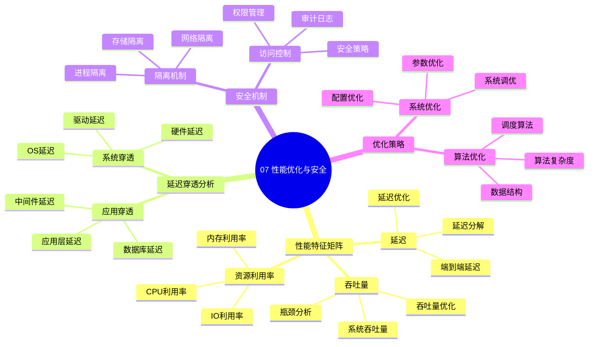

# 07. 性能优化与安全

> **主题**: 性能优化与安全机制
> **覆盖范围**: 性能特征矩阵、延迟穿透分析、安全机制、优化策略

---

## 📋 目录

- [07. 性能优化与安全](#07-性能优化与安全)
  - [📋 目录](#-目录)
  - [1 子主题索引](#1-子主题索引)
    - [1.0 性能优化与安全思维导图](#10-性能优化与安全思维导图)
  - [2 相关主题](#2-相关主题)
  - [3 核心概念矩阵](#3-核心概念矩阵)

---

## 1 子主题索引

### 1.0 性能优化与安全思维导图

**可视化文档**: 查看 [思维导图与知识矩阵](../思维导图与知识矩阵.md#37-07-性能优化与安全) 获取更详细的思维导图。

- [7.1 性能特征矩阵](./07.1_性能特征矩阵.md) - 延迟-带宽-功耗三角矩阵
- [7.2 延迟穿透分析](./07.2_延迟穿透分析.md) - 全栈延迟分解
- [7.3 安全机制](./07.3_安全机制.md) - 硬件安全、OS安全、虚拟化安全
- [7.4 优化策略](./07.4_优化策略.md) - CPU-bound、IO-bound、Latency-sensitive优化

---

## 2 相关主题

- [01. CPU硬件层](../01_CPU硬件层/README.md) - 硬件性能特征
- [03. OS抽象层](../03_OS抽象层/README.md) - OS优化接口
- [08. 技术演进与对标](../08_技术演进与对标/README.md) - 性能演进

---

## 3 核心概念矩阵

| **优化维度** | **硬件层** | **OS层** | **应用层** | **收益** |
|-------------|-----------|---------|-----------|---------|
| **延迟优化** | 缓存对齐 | 巨页、NUMA绑定 | 数据结构优化 | 10-100x |
| **带宽优化** | 多通道 | 零拷贝 | 批处理 | 2-10x |
| **功耗优化** | 动态调频 | C-State | 异步处理 | 30-50% |
| **安全优化** | SMAP/SMEP | KASLR | 最小权限 | 攻击面↓ |

---

**最后更新**: 2025-11-14
