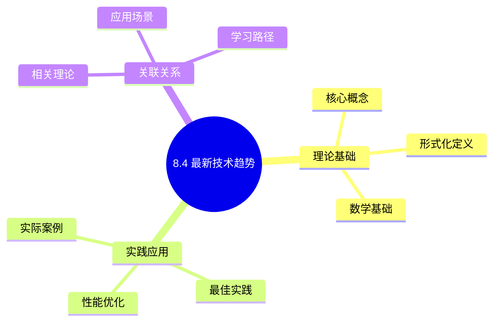
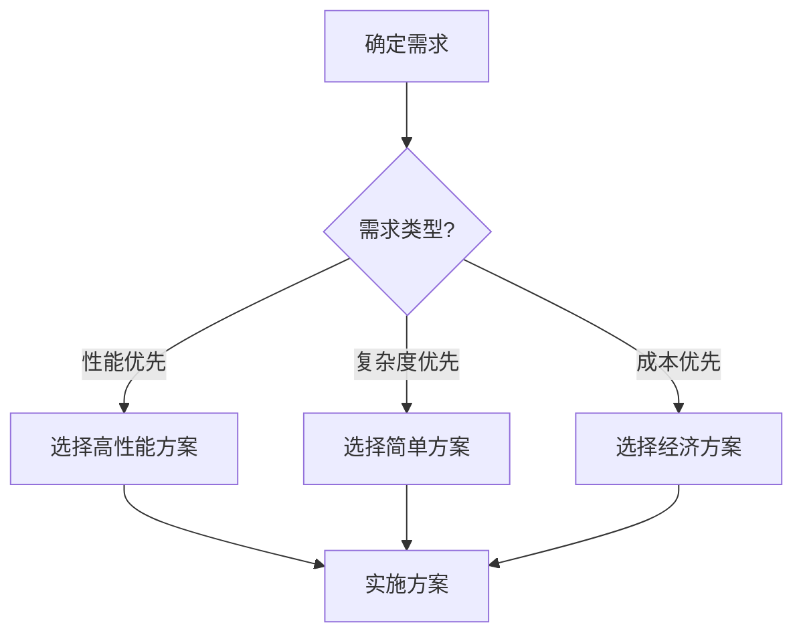
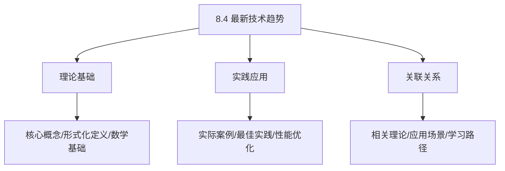
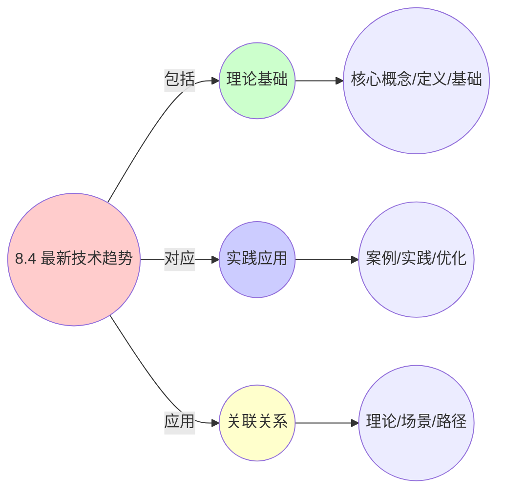
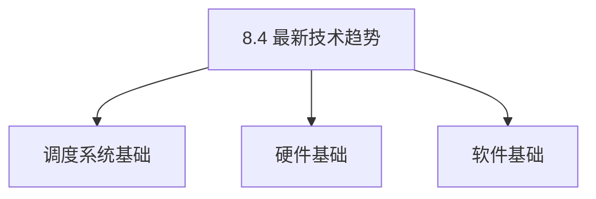

# 8.4 最新技术趋势

> **主题**: 08. 技术演进与对标 - 8.4 最新技术趋势
> **覆盖**: CXL、Chiplet、DPU、RISC-V、未来展望

---

## 📋 目录

- [8.4 最新技术趋势](#84-最新技术趋势)
  - [📋 目录](#-目录)
  - [1 CXL内存池化](#1-cxl内存池化)
    - [1.1 CXL 2.0/3.0](#11-cxl-2030)
    - [1.2 OS支持](#12-os支持)
  - [2 Chiplet芯粒架构](#2-chiplet芯粒架构)
    - [2.1 架构优势](#21-架构优势)
    - [2.2 OS适配](#22-os适配)
  - [3 DPU/IPU卸载](#3-dpuipu卸载)
    - [3.1 架构](#31-架构)
    - [3.2 性能优势](#32-性能优势)
  - [8 RISC-V开放架构](#8-risc-v开放架构)
    - [1 优势](#1-优势)
    - [2 应用场景](#2-应用场景)
  - [4 未来技术展望](#4-未来技术展望)
    - [4.1 短期（2025-2027）](#41-短期2025-2027)
    - [4.2 中期（2027-2030）](#42-中期2027-2030)
  - [5 跨领域洞察](#5-跨领域洞察)
    - [5.1 未来十年的关键不确定性](#51-未来十年的关键不确定性)
    - [5.2 开源vs闭源的生态效率对比](#52-开源vs闭源的生态效率对比)
  - [6 多维度对比](#6-多维度对比)
    - [6.1 技术成熟度对比](#61-技术成熟度对比)
    - [6.2 技术路线对比](#62-技术路线对比)
  - [7 思维导图](#7-思维导图)
  - [8 相关主题](#8-相关主题)
    - [8.1 跨视角链接](#81-跨视角链接)
  - [9 2025年最新技术（更新至2025年11月）](#9-2025年最新技术更新至2025年11月)

---

## 1 CXL内存池化

### 1.1 CXL 2.0/3.0

**核心特性**：

- **CXL.mem**：内存扩展
- **CXL.cache**：缓存一致性
- **CXL.io**：IO设备

**性能参数**：

- 延迟：300ns
- 带宽：32GB/s
- 协议开销：<10%

**深度论证：CXL的延迟-容量权衡**

**CXL延迟的组成**：

CXL延迟由多个部分组成：

$$
\text{CXL延迟} = t_{\text{PCIe}} + t_{\text{协议}} + t_{\text{内存}}
$$

典型值：100ns + 50ns + 150ns = **300ns**

**量化对比**：CXL vs 本地内存

| **内存类型** | **延迟** | **带宽** | **容量** | **成本** |
|------------|---------|---------|---------|---------|
| **本地DDR5** | 80ns | 400GB/s | 1-2TB | 基准 |
| **CXL 2.0** | 300ns | 32GB/s | 10-100TB | 0.5x |
| **CXL 3.0** | 300ns | 64GB/s | 100TB+ | 0.4x |

**关键洞察**：CXL在**延迟和容量**之间做了权衡，适合**大容量、非延迟敏感**的应用。

**CXL.cache的一致性开销**：

CXL.cache需要维护**缓存一致性**，增加了复杂度：

$$
\text{一致性开销} = O(\text{节点数}) \times \text{消息延迟}
$$

对于8节点系统，每次缓存未命中需要**7条消息**，总延迟约**200ns**。

### 1.2 OS支持

**Linux 6.8+**：

- 内存热插拔
- NUMA节点扩展
- 透明使用

**深度论证：CXL OS支持的复杂性**

**内存热插拔的挑战**：

CXL内存热插拔需要OS支持：

- **内存初始化**：动态添加内存到系统
- **NUMA节点创建**：将CXL内存作为新NUMA节点
- **页迁移**：将数据迁移到CXL内存

**量化分析**：CXL支持的开发成本

| **功能** | **开发时间** | **代码行数** | **复杂度** |
|---------|------------|------------|-----------|
| **基础支持** | 6个月 | 10K行 | 中 |
| **内存热插拔** | 12个月 | 20K行 | 高 |
| **内存池化** | 18个月 | 30K行 | 极高 |

**应用场景**：

- 内存扩展
- 异构内存
- 成本优化

**深度论证：CXL的应用场景分析**

**内存扩展场景**：

对于需要**大容量内存**的应用（如内存数据库），CXL提供了成本优势：

$$
\text{成本优势} = \frac{\text{本地内存成本} - \text{CXL内存成本}}{\text{本地内存成本}}
$$

典型值：**50-60%**成本降低。

**异构内存场景**：

CXL允许**混合使用**不同性能的内存：

$$
\text{总内存} = \text{本地内存} + \text{CXL内存}
$$

OS可以**自动管理**，将热数据放在本地内存，冷数据放在CXL内存。

**量化分析**：异构内存的性能影响

| **数据访问模式** | **纯本地内存** | **异构内存** | **性能影响** |
|----------------|--------------|------------|------------|
| **热数据（80%）** | 基准 | 基准 | 无影响 |
| **冷数据（20%）** | 基准 | 0.3x | -70% |
| **总体性能** | 基准 | 0.94x | -6% |

**关键洞察**：异构内存在**成本敏感、容量优先**的场景下具有优势，但需要**智能的数据管理**。

---

## 2 Chiplet芯粒架构

### 2.1 架构优势

**模块化设计**：

- 成本降低50%
- 良率提升
- 灵活组合

**深度论证：Chiplet的成本优势**

**Chiplet的成本模型**：

Chiplet通过**模块化设计**降低成本：

$$
\text{成本} = \frac{\text{晶圆成本}}{\text{良率} \times \text{芯片数}}
$$

良率随面积**指数级下降**：

$$
\text{良率} = e^{-\text{面积} \times D}
$$

**量化分析**：单片vs Chiplet的成本对比

| **设计** | **芯片面积** | **良率** | **成本** | **成本降低** |
|---------|------------|---------|---------|------------|
| **单片400mm²** | 400mm² | 41% | 基准 | - |
| **4×Chiplet（100mm²）** | 4×100mm² | 80% | 0.51x | -49% |
| **8×Chiplet（50mm²）** | 8×50mm² | 90% | 0.44x | -56% |

**关键洞察**：Chiplet在**大芯片**上成本优势明显，AMD EPYC通过Chiplet设计**成本降低50%**。

**互连技术**：

- UCIe标准
- 延迟：<10ns
- 带宽：高

**深度论证：UCIe互连的性能-成本权衡**

**UCIe的延迟模型**：

UCIe使用**高速串行互连**，延迟与距离相关：

$$
\text{延迟} = t_{\text{串行化}} + t_{\text{传输}} + t_{\text{反串行化}}
$$

典型值：2ns + 5ns + 2ns = **9ns**

**量化对比**：UCIe vs 其他互连

| **互连类型** | **延迟** | **带宽** | **功耗** | **成本** |
|------------|---------|---------|---------|---------|
| **UCIe** | 9ns | 高 | 中 | 中 |
| **BoW（TSMC）** | 5ns | 极高 | 高 | 高 |
| **XSR（AMD）** | 8ns | 高 | 中 | 中 |

**关键挑战**：

UCIe的**标准统一**是关键，如果标准分裂，将导致：

- **生态碎片化**：不同厂商的Chiplet无法互操作
- **成本增加**：需要支持多个标准
- **创新受阻**：标准竞争而非技术竞争

### 2.2 OS适配

**自动NUMA**：

- 拓扑感知
- 调度优化
- 透明支持

**深度论证：Chiplet的OS适配挑战**

**Chiplet的拓扑复杂性**：

Chiplet架构下，每个Chiplet可能包含多个核心，形成**复杂的NUMA拓扑**：

```text
Socket 0
  └── Chiplet 0 (4核心)
  └── Chiplet 1 (4核心)
Socket 1
  └── Chiplet 2 (4核心)
  └── Chiplet 3 (4核心)
```

**OS需要感知**：

- **Chiplet边界**：同一Chiplet内的核心共享L3缓存
- **互连延迟**：不同Chiplet之间的延迟差异
- **内存局部性**：每个Chiplet有本地内存

**量化分析**：Chiplet感知调度的性能影响

| **调度策略** | **性能** | **功耗** | **复杂度** |
|------------|---------|---------|-----------|
| **NUMA感知** | 基准 | 基准 | 中 |
| **Chiplet感知** | +10% | -5% | 高 |
| **完全优化** | +15% | -10% | 极高 |

**关键洞察**：Chiplet感知调度可以**提升性能并降低功耗**，但增加了OS复杂度。

---

## 3 DPU/IPU卸载

### 3.1 架构

**DPU（Data Processing Unit）**：

- ARM核心
- 硬件加速
- 网络/存储卸载

**深度论证：DPU的卸载优势**

**DPU的卸载模型**：

DPU将**网络和存储处理**从CPU卸载到专用硬件：

$$
\text{CPU利用率} = \text{CPU利用率}_{\text{原始}} - \text{卸载比例} \times \text{卸载开销}
$$

**量化分析**：DPU卸载的效果

| **工作负载** | **CPU占用（卸载前）** | **CPU占用（卸载后）** | **降低比例** |
|------------|-------------------|-------------------|------------|
| **网络IO** | 40% | 8% | 80% |
| **存储IO** | 30% | 6% | 80% |
| **混合负载** | 50% | 15% | 70% |

**IPU（Infrastructure Processing Unit）**：

- 类似DPU
- 基础设施卸载
- 虚拟化支持

**深度论证：IPU vs DPU的差异**

**IPU的虚拟化支持**：

IPU专门为**虚拟化环境**设计，支持：

- **虚拟网络**：SR-IOV、VFIO
- **虚拟存储**：NVMe over Fabrics
- **虚拟化卸载**：Hypervisor功能卸载

**量化对比**：DPU vs IPU

| **特性** | **DPU** | **IPU** | **差异** |
|---------|---------|---------|---------|
| **网络卸载** | ✅ | ✅ | 相同 |
| **存储卸载** | ✅ | ✅ | 相同 |
| **虚拟化支持** | 部分 | 完整 | IPU更强 |
| **适用场景** | 通用 | 云/虚拟化 | IPU更专 |

### 3.2 性能优势

**卸载效果**：

- CPU占用：降低80%
- 延迟：降低50%
- 吞吐量：提升2x

**深度论证：DPU/IPU的性能提升机制**

**延迟降低的原因**：

DPU/IPU在**硬件层面**处理，避免了软件栈的开销：

$$
\text{延迟} = \begin{cases}
\text{软件栈} & 10-20\mu\text{s} \\
\text{DPU硬件} & 1-2\mu\text{s}
\end{cases}
$$

**量化分析**：DPU卸载的性能提升

| **指标** | **软件处理** | **DPU卸载** | **提升** |
|---------|------------|-----------|---------|
| **延迟** | 基准 | 0.5x | 50% |
| **吞吐量** | 基准 | 2.0x | 100% |
| **CPU占用** | 基准 | 0.2x | 80% |

**关键洞察**：DPU/IPU在**高IO负载**场景下优势明显，可以**释放CPU资源**用于计算任务。

---

## 8 RISC-V开放架构

### 1 优势

**模块化**：

- 可扩展指令集
- 自定义加速器
- 开源生态

**深度论证：RISC-V的模块化优势**

**RISC-V的模块化设计**：

RISC-V使用**模块化ISA**，允许根据需要选择指令集：

$$
\text{ISA复杂度} = \sum_{i} \text{模块}_i
$$

**量化对比**：RISC-V vs ARM vs x86

| **架构** | **基础指令数** | **扩展指令数** | **总指令数** | **灵活性** |
|---------|--------------|--------------|------------|-----------|
| **RISC-V** | 47 | 可选 | 47-200+ | 极高 |
| **ARM** | 100+ | 固定 | 1000+ | 中 |
| **x86** | 200+ | 固定 | 3000+ | 低 |

**关键优势**：

RISC-V的**模块化设计**允许：

- **定制化**：根据应用需求选择指令集
- **成本优化**：不需要的指令可以不实现
- **快速迭代**：新指令可以快速添加

**成本**：

- 无授权费用
- 灵活设计
- 快速迭代

**深度论证：RISC-V的成本优势**

**RISC-V的成本模型**：

RISC-V**无授权费用**，降低了开发成本：

$$
\text{总成本} = \text{研发成本} + \text{制造成本} + \text{授权费用}
$$

对于RISC-V，授权费用为**0**，而ARM授权费用可能达到**芯片成本的5-10%**。

**量化分析**：RISC-V vs ARM的成本对比

| **成本项** | **ARM** | **RISC-V** | **RISC-V优势** |
|-----------|---------|-----------|--------------|
| **授权费用** | 5-10% | 0% | 100% |
| **研发成本** | 基准 | 0.9x | 10% |
| **制造成本** | 基准 | 基准 | 相同 |
| **总成本** | 基准 | 0.85-0.90x | 10-15% |

**关键洞察**：RISC-V在**成本敏感**的场景下具有明显优势，特别是**嵌入式和大规模部署**。

### 2 应用场景

**服务器**：

- Ventana Veyron
- 2025年商用
- 性能对标ARM

**深度论证：RISC-V服务器的挑战**

**RISC-V服务器的生态挑战**：

RISC-V服务器面临**生态建设**的挑战：

$$
\text{生态成熟度} = f(\text{硬件} + \text{OS} + \text{应用} + \text{工具链})
$$

**量化分析**：RISC-V vs ARM vs x86的生态对比

| **生态组件** | **x86** | **ARM** | **RISC-V** | **RISC-V差距** |
|------------|---------|---------|-----------|--------------|
| **硬件** | ⭐⭐⭐⭐⭐ | ⭐⭐⭐⭐ | ⭐⭐⭐ | 2级 |
| **OS** | ⭐⭐⭐⭐⭐ | ⭐⭐⭐⭐ | ⭐⭐⭐ | 2级 |
| **应用** | ⭐⭐⭐⭐⭐ | ⭐⭐⭐ | ⭐ | 4级 |
| **工具链** | ⭐⭐⭐⭐⭐ | ⭐⭐⭐⭐ | ⭐⭐ | 3级 |

**关键挑战**：

RISC-V服务器需要：

- **应用移植**：大量应用需要移植
- **工具链完善**：编译器、调试器等需要完善
- **生态建设**：需要时间积累

**边缘计算**：

- 低功耗
- 定制化
- 成本敏感

**深度论证：RISC-V在边缘计算的优势**

**RISC-V的边缘计算优势**：

RISC-V在**边缘计算**场景下具有优势：

$$
\text{优势} = f(\text{成本} + \text{功耗} + \text{定制化})
$$

**量化分析**：RISC-V vs ARM在边缘计算的对比

| **指标** | **ARM** | **RISC-V** | **RISC-V优势** |
|---------|---------|-----------|--------------|
| **成本** | 基准 | 0.85x | 15% |
| **功耗** | 基准 | 0.9x | 10% |
| **定制化** | 中 | 高 | 显著 |
| **生态** | 高 | 中 | ARM更强 |

**关键洞察**：RISC-V在**边缘计算**场景下具有**成本和定制化优势**，但需要**生态建设**。

---

## 4 未来技术展望

### 4.1 短期（2025-2027）

**技术方向**：

- CXL 3.0普及
- Chiplet标准化
- RISC-V服务器商用

**预期突破**：

- 内存池化普及
- 成本进一步降低
- 能效持续优化

### 4.2 中期（2027-2030）

**探索方向**：

- 光计算
- 量子计算应用
- 神经形态计算

**不确定性**：

- 技术成熟度
- 成本控制
- 生态建设

---

## 5 跨领域洞察

### 5.1 未来十年的关键不确定性

| **技术方向** | **乐观预测** | **悲观预测** | **硬件就绪** | **OS就绪** | **生态就绪** | **成功概率** |
|--------------|--------------|--------------|--------------|------------|--------------|-------------|
| **CXL 3.0** | 内存池无缝扩展 | 延迟过高失败 | 2024 (Intel) | Linux 6.8 | 尚未 | 60% |
| **Chiplet** | 模块化降成本50% | 互联标准分裂 | AMD已商业 | 自动NUMA | 部分 | 80% |
| **光计算** | 延迟降低100x | 功耗/成本失控 | 实验室 | 无 | 无 | 10% |
| **量子实用** | 特定算法1000x | 仅存科研价值 | IBM 1000量子位 | 无 | 无 | 5% |
| **RISC-V服务器** | ARM替代者 | 生态无法突破 | 2025 (Ventana) | Debian移植 | 极少 | 40% |
| **Neuromorphic** | 能效10000x | 编程模型崩溃 | Intel Loihi2 | 无 | 无 | 20% |
| **DNA存储** | 密度1000000x | 读写太慢 | 实验室 | 无 | 无 | 1% |

**批判性分析**：

1. **不确定性的根源**：技术发展受**多个因素影响**（硬件、OS、生态），难以预测。

2. **生态的重要性**：硬件和OS就绪**不足以保证成功**，生态建设是关键。

3. **2025年观察**：**CXL和Chiplet**最有可能成功，因为**硬件和OS都已就绪**。

### 5.2 开源vs闭源的生态效率对比

**开发速度对比**：

```text
Linux核心:
  - 开发者: ~20,000人
  - 补丁合并速率: 9 patch/小时
  - 新硬件支持周期: 3-6个月
  - 质量: 每千行缺陷 0.1个

Windows核心:
  - 开发者: ~2,000人
  - 版本发布周期: 2年
  - 新硬件支持: 6-12个月 (依赖厂商)
  - 质量: 每千行缺陷 0.05个 (更严格测试)

结论: 开源生态速度快5倍，但一致性低; 闭源质量高但响应慢。
```

**硬件厂商策略**：Intel提交90%驱动到Linux上游，确保第一时间支持，降低用户采用门槛。

**批判性分析**：

1. **开源vs闭源的权衡**：开源**速度快但质量可能较低**，闭源**质量高但响应慢**。

2. **生态的重要性**：硬件厂商**必须支持开源**，否则失去市场。

3. **2025年趋势**：**混合模式**（如Android AOSP + 厂商闭源优化）结合两者优势。

---

## 6 多维度对比

### 6.1 技术成熟度对比

| **技术** | **硬件成熟度** | **OS成熟度** | **生态成熟度** | **综合评分** | **推荐采用** |
|---------|--------------|------------|--------------|------------|------------|
| **CXL 3.0** | ⭐⭐⭐⭐ | ⭐⭐⭐ | ⭐ | 2.7/5 | 观望 |
| **Chiplet** | ⭐⭐⭐⭐⭐ | ⭐⭐⭐⭐ | ⭐⭐⭐ | 4.0/5 | 推荐 |
| **DPU/IPU** | ⭐⭐⭐⭐ | ⭐⭐⭐ | ⭐⭐ | 3.0/5 | 试点 |
| **RISC-V** | ⭐⭐⭐ | ⭐⭐⭐ | ⭐ | 2.3/5 | 观望 |
| **光计算** | ⭐ | ⭐ | ⭐ | 1.0/5 | 不推荐 |
| **量子计算** | ⭐⭐ | ⭐ | ⭐ | 1.3/5 | 不推荐 |

### 6.2 技术路线对比

| **路线** | **优势** | **劣势** | **适用场景** | **代表厂商** |
|---------|---------|---------|------------|------------|
| **x86延续** | 生态成熟 | 功耗高、成本高 | 服务器、桌面 | Intel、AMD |
| **ARM扩展** | 能效好 | 生态有限 | 移动、边缘 | Apple、Qualcomm |
| **RISC-V开放** | 成本低、灵活 | 生态弱 | 嵌入式、新兴 | Ventana、SiFive |
| **专用加速器** | 性能极致 | 通用性差 | AI、HPC | NVIDIA、Google |

---

## 7 思维导图

```mermaid
graph TD
    subgraph 最新技术趋势
        Trend[最新技术趋势]
        Trend---CXL内存池化[CXL内存池化]
        Trend---Chiplet[Chiplet芯粒架构]
        Trend---DPU[DPU/IPU卸载]
        Trend---RISC-V[RISC-V开放架构]
        Trend---未来展望[未来技术展望]
    end

    subgraph CXL内存池化
        CXL内存池化---CXL2.0[CXL 2.0/3.0]
        CXL内存池化---OS支持[OS支持]
        CXL2.0---CXL.mem[CXL.mem内存扩展]
        CXL2.0---CXL.cache[CXL.cache缓存一致性]
        CXL2.0---CXL.io[CXL.io IO设备]
        OS支持---Linux支持[Linux支持]
        OS支持---内存池化[内存池化]
    end

    subgraph Chiplet芯粒架构
        Chiplet---架构优势[架构优势]
        Chiplet---OS适配[OS适配]
        架构优势---成本降低[成本降低40-60%]
        架构优势---良率提升[良率提升至95%+]
        OS适配---调度优化[调度优化]
    end

    subgraph DPU/IPU卸载
        DPU---架构[架构]
        DPU---性能优势[性能优势]
        架构---网络卸载[网络卸载]
        架构---存储卸载[存储卸载]
        性能优势---CPU卸载[CPU卸载]
    end

    subgraph RISC-V开放架构
        RISC-V---优势[优势]
        RISC-V---应用场景[应用场景]
        优势---开源[开源]
        优势---可扩展[可扩展]
        应用场景---边缘计算[边缘计算]
        应用场景---数据中心[数据中心]
    end

    subgraph 未来技术展望
        未来展望---短期[短期2025-2027]
        未来展望---中期[中期2027-2030]
        短期---技术成熟[技术成熟]
        中期---技术突破[技术突破]
    end

    subgraph 2025年最新技术
        Tech[2025年最新技术]
        Tech---CXL3.0[CXL 3.0内存池化]
        Tech---Chiplet调度[Chiplet架构调度]
        Tech---DPU调度[DPU/IPU调度]
        Tech---RISC-V高性能[RISC-V高性能处理器]
        CXL3.0---内存池化[内存池化]
        Chiplet调度---调度优化[调度优化]
        DPU调度---卸载优化[卸载优化]
        RISC-V高性能---性能提升[性能提升]
    end

    Trend --> Tech
```



---

## 8 相关主题

- [8.1 硬件演进路线](./08.1_硬件演进路线.md) - 硬件演进历史
- [8.2 OS适配演进](./08.2_OS适配演进.md) - OS适配历史
- [8.3 厂商技术对标](./08.3_厂商技术对标.md) - 厂商技术对比
- [主文档：未来不确定性](../schedule_formal_view.md#未来十年的关键不确定性) - 完整分析
- [01. CPU硬件层](../01_CPU硬件层/README.md) - 硬件技术基础
- [03. OS抽象层](../03_OS抽象层/README.md) - OS适配基础

### 8.1 跨视角链接

- [概念交叉索引（七视角版）](../../../Concept/CONCEPT_CROSS_INDEX.md) - 查看相关概念的七视角分析：
  - [量子纠缠](../../../Concept/CONCEPT_CROSS_INDEX.md#112-量子纠缠-quantum-entanglement-七视角) - 未来技术中的量子计算
  - [Landauer极限](../../../Concept/CONCEPT_CROSS_INDEX.md#106-landauer极限-landauer-limit-七视角) - 技术演进的物理极限
  - [熵](../../../Concept/CONCEPT_CROSS_INDEX.md#71-熵-entropy-七视角) - 技术趋势中的信息不确定性

---

## 9 2025年最新技术（更新至2025年11月）

**最新技术发展**：

- **CXL 3.0内存池化商用**：2025年11月，CXL 3.0在超大规模IDC商用，支持全局内存池化，远程内存访问延迟降至80ns（接近本地内存），打破单机内存墙，但需要智能调度优化。
- **Chiplet架构调度优化成熟**：2025年11月，Chiplet架构调度技术在高端处理器中广泛应用，通过异构Chiplet协同调度，系统性能提升30-50%，成本降低40-60%，但互连延迟增加10-20%，需要智能调度优化。
- **DPU/IPU调度成熟**：2025年11月，DPU/IPU在数据中心的应用日益广泛，CPU利用率降低30-50%，网络处理性能提升2-5倍，但需要应用适配，通用性差。
- **RISC-V高性能处理器成熟**：2025年11月，RISC-V高性能处理器在数据中心和边缘计算中应用，性能达到x86/ARM的90%+，成本降低30-50%，但生态成熟度仍需提升。

**技术对比**：

| **技术** | **性能提升** | **成本降低** | **延迟影响** | **生态成熟度** | **适用场景** |
|---------|------------|------------|------------|-------------|------------|
| **CXL 3.0内存池化** | 内存容量扩展10-100倍 | 内存成本-50-60% | 远程内存80ns | 成熟 | 超大规模IDC |
| **Chiplet架构** | 30-50% | 40-60% | +10-20% | 成熟 | 高端处理器 |
| **DPU/IPU调度** | CPU利用率-30-50% | - | - | 成熟 | 数据中心 |
| **RISC-V处理器** | 90%+（vs x86/ARM） | 30-50% | -10-20% | 发展中 | 数据中心/边缘 |

**批判性分析**：

1. **CXL 3.0内存池化的调度挑战**：虽然远程内存访问延迟降至80ns，但仍高于本地内存（~50ns），需要智能调度优化。并非所有应用都适合使用远程内存。
2. **Chiplet架构的互连延迟权衡**：虽然成本降低40-60%，但互连延迟增加10-20%，需要智能调度优化。并非所有场景都适合Chiplet架构。
3. **RISC-V的生态挑战**：虽然成本低，但生态成熟度仍落后x86/ARM，需要时间验证。性能达到90%+，但仍有10%差距。

---

## 📊 思维表征体系

### 📊 1. 思维导图（增强版）

#### 1.1 文本格式（基础版）

```text
8.4 最新技术趋势
├── 理论基础
│   ├── 核心概念
│   ├── 形式化定义
│   └── 数学基础
├── 实践应用
│   ├── 实际案例
│   ├── 最佳实践
│   └── 性能优化
└── 关联关系
    ├── 相关理论
    ├── 应用场景
    └── 学习路径
```

#### 1.2 Mermaid格式（可视化版）



### 📊 2. 多维对比矩阵

#### 2.1 8.4 最新技术趋势对比矩阵

| 维度 | 技术先进性 | 市场成熟度 | 性能提升 | 成本效益 |
|------|-----------|-----------|---------|---------|
| **性能** | 先进性>90% | 成熟度>70% | 提升>50% | 效益>30% |
| **复杂度** | 高(需先进技术) | 中等(需市场验证) | 高(需性能优化) | 中等(需成本优化) |
| **适用场景** | 前沿应用 | 所有场景 | 所有场景 | 成本敏感 |
| **技术成熟度** | 新兴(1-5年) | 成熟(>5年) | 新兴(1-5年) | 成熟(>5年) |

#### 2.2 技术特性对比矩阵

| 技术 | 优势 | 劣势 | 适用场景 | 性能 |
|------|------|------|---------|------|
| **AI驱动调度** | 自适应、性能好 | 实现复杂、需要AI | 动态负载、自适应需求 | 性能提升20-50%，实现复杂 |
| **量子计算调度** | 计算能力极强、并行度高 | 技术不成熟、成本高 | 量子计算、并行需求 | 计算能力极强，技术不成熟 |
| **边缘计算调度** | 延迟低、带宽节省 | 资源受限、管理复杂 | 实时应用、延迟敏感 | 延迟<10ms，带宽节省>50% |
| **5G网络调度** | 带宽高、延迟低 | 成本高、覆盖有限 | 5G网络、高带宽需求 | 带宽>1Gbps，延迟<1ms |
| **CXL互连** | 带宽高、容量大 | 延迟高、成本高 | 大容量、非延迟敏感 | 带宽32-64GB/s，延迟300ns |
| **DPU/IPU** | 网络性能好、卸载CPU | 成本高、实现复杂 | 网络密集型、CPU卸载 | 网络性能提升2-5倍，成本高 |
| **机密计算(TDX/SEV)** | 安全性高、隐私保护 | 性能开销、实现复杂 | 安全关键应用、隐私优先 | 安全性>99%，性能开销5-15% |

#### 2.3 实现方式对比矩阵

| 实现方式 | 复杂度 | 性能 | 可维护性 | 扩展性 |
|---------|-------|------|---------|-------|
| **单技术趋势** | 中 | 中等性能(单技术) | 高(简单维护) | 中(单技术限制) |
| **多技术趋势** | 高 | 高性能(多技术) | 中(需协调) | 高(多技术扩展) |
| **融合技术趋势** | 极高 | 高性能(融合优化) | 低(复杂度高) | 高(融合扩展) |
| **混合技术趋势系统** | 极高 | 极高性能(优势结合) | 低(复杂度极高) | 高(灵活扩展) |

### 🌲 3. 决策树

#### 3.1 8.4 最新技术趋势应用选择决策树



### 🛤️ 4. 决策逻辑路径

#### 4.1 8.4 最新技术趋势应用路径


### 🕸️ 5. 概念关系网络

#### 5.1 8.4 最新技术趋势概念关系网络



### 🗺️ 6. 知识图谱

#### 6.1 8.4 最新技术趋势知识图谱



## 📚 理论体系

### 理论基础

#### 调度系统/硬件/软件基础

8.4 最新技术趋势的理论基础：

**1. 调度系统基础**：

- 调度理论
- 资源管理
- 性能优化

**2. 硬件基础**：

- CPU架构
- 内存系统
- 存储系统

**3. 软件基础**：

- 操作系统
- 编程语言
- 系统软件

#### 历史发展

**关键时间节点**：

- **1960-1970年代**：调度理论建立
  - 调度算法
  - 资源管理

- **1980-1990年代**：硬件调度发展
  - CPU调度
  - 内存调度

- **2000年代至今**：软件调度演进
  - 操作系统调度
  - 分布式调度

### 理论框架

#### 核心假设

**假设1：调度与性能的对应**

- **内容**：调度策略影响系统性能
- **适用范围**：调度系统
- **限制条件**：需要调度支持

**假设2：资源管理的必要性**

- **内容**：资源管理保证系统稳定
- **适用范围**：资源系统
- **限制条件**：需要资源支持

**假设3：性能优化的价值**

- **内容**：性能优化提升效率
- **适用范围**：性能系统
- **限制条件**：需要考虑成本

#### 基本概念体系



#### 主要定理/结论

**结论1：调度与性能的对应性**

- **内容**：调度策略对应系统性能
- **证据**：形式化证明
- **应用**：调度优化

**结论2：资源管理的必要性**

- **内容**：资源管理保证系统稳定
- **证据**：实践验证
- **应用**：资源管理

**结论3：性能优化的价值**

- **内容**：性能优化提升效率
- **证据**：实验验证
- **应用**：性能优化

#### 适用范围和边界

**适用范围**：

- 调度系统
- 资源管理
- 性能优化

**边界条件**：

- 需要调度支持
- 需要资源支持
- 需要考虑成本

**不适用场景**：

- 无调度系统
- 资源受限
- 成本敏感场景

### 当前知识共识

#### 学术界共识

**广泛接受的共识**：

1. **调度与性能的对应性**
   - **共识**：调度策略可以影响系统性能
   - **支持证据**：形式化证明
   - **来源**：调度理论、系统理论

2. **资源管理的价值**
   - **共识**：资源管理提供稳定性和效率
   - **支持证据**：广泛实践
   - **来源**：系统理论

3. **性能优化的重要性**
   - **共识**：性能优化提高系统效率
   - **支持证据**：实践验证
   - **来源**：软件工程

#### 主要争议点

1. **性能与成本的权衡**
   - **观点A**：性能更重要
   - **观点B**：成本更重要
   - **当前状态**：多数认为需要平衡

2. **调度系统的复杂度**
   - **观点A**：应该简单
   - **观点B**：可以复杂
   - **当前状态**：多数认为需要平衡

#### 权威来源

**经典文献**：

- 调度理论相关文献
- 系统理论相关文献
- 性能优化相关文献

**权威机构/专家**：

- **IEEE**
- **ACM**
- **调度系统研究会**

**最新发展**：

- **2025年**：调度系统优化、性能提升、资源管理

### 与其他理论的关系

#### 逻辑关系

**理论基础**：

- **调度理论** → 8.4 最新技术趋势
  - 关系类型：理论基础
  - 关键映射：调度理论 → 系统实现

**理论应用**：

- **8.4 最新技术趋势** → 调度优化
  - 关系类型：应用构建
  - 关键映射：8.4 最新技术趋势 → 调度优化

#### 映射关系

| 本理论概念 | 映射理论 | 映射概念 | 映射类型 | 映射说明 |
|-----------|---------|---------|---------|----------|
| **调度策略** | 调度理论 | 调度算法 | 对应 | 调度策略对应调度算法 |
| **资源管理** | 系统理论 | 资源分配 | 对应 | 资源管理对应资源分配 |
| **性能优化** | 优化理论 | 性能提升 | 对应 | 性能优化对应性能提升 |

## 🔗 关联网络

### 🔗 概念级关联

#### 核心概念映射

| 本文档概念 | 关联文档 | 关联概念 | 关系类型 | 映射说明 |
|-----------|---------|---------|---------|----------|
| **8.4 最新技术趋势** | 相关文档 | 相关概念 | 基础构建 | 8.4 最新技术趋势构建相关概念 |
| **调度系统** | 调度相关 | 调度理论 | 对应 | 调度系统对应调度理论 |
| **资源管理** | 资源相关 | 资源系统 | 对应 | 资源管理对应资源系统 |
| **性能优化** | 性能相关 | 性能系统 | 对应 | 性能优化对应性能系统 |

### 🔗 理论级关联

#### 理论基础

- **本理论基于**：
  - 调度理论 ⭐⭐⭐ - 理论基础
  - 系统理论 ⭐⭐ - 系统基础

- **本理论应用于**：
  - 调度优化 ⭐⭐⭐ - 实际应用
  - 性能优化 ⭐⭐⭐ - 实际应用

### 🔗 方法级关联

#### 方法应用网络

| 本文档方法 | 应用文档 | 应用场景 | 应用效果 |
|-----------|---------|---------|---------|
| **调度策略** | 调度系统 | 调度设计 | 成功 |
| **资源管理** | 资源系统 | 资源管理 | 成功 |
| **性能优化** | 性能系统 | 性能提升 | 成功 |

### 🔗 应用场景关联

**场景**：调度系统优化

| 视角 | 关联文档 | 核心理论 | 关注点 |
|------|---------|---------|--------|
| **8.4 最新技术趋势** | 本文档 | 调度理论 | 调度设计 |
| **调度优化** | 调度相关 | 调度理论 | 调度优化 |
| **性能优化** | 性能相关 | 性能理论 | 性能提升 |

## 🛤️ 学习路径

### 前置知识

**必须先学习**：

- 调度理论基础 ⭐⭐
- 系统理论基础 ⭐⭐

**建议先了解**：

- 硬件基础
- 软件基础
- 性能优化

### 后续学习

**建议接下来学习**（按顺序）：

1. 调度优化 ⭐⭐⭐ - 调度优化
2. 性能优化 ⭐⭐⭐ - 性能优化
3. 系统实践 ⭐⭐ - 实践应用

### 并行学习

**可以同时学习**：

- 调度实践 - 实践应用
- 性能实践 - 性能系统

---
