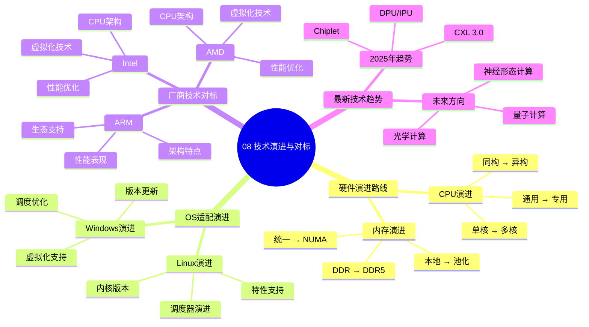

# 08. 技术演进与对标

> **主题**: 技术演进与厂商对标
> **覆盖范围**: 硬件演进、OS适配、厂商技术、最新趋势

---

## 📋 目录

- [08. 技术演进与对标](#08-技术演进与对标)
  - [📋 目录](#-目录)
  - [1 子主题索引](#1-子主题索引)
  - [2 相关主题](#2-相关主题)
  - [3 核心概念矩阵](#3-核心概念矩阵)

---

## 1 子主题索引

### 1.0 技术演进与对标思维导图

**可视化文档**: 查看 [思维导图与知识矩阵](../思维导图与知识矩阵.md#38-08-技术演进与对标) 获取更详细的思维导图。

- [8.1 硬件演进路线](./08.1_硬件演进路线.md) - 单核→多核→NUMA→Chiplet
- [8.2 OS适配演进](./08.2_OS适配演进.md) - Linux内核演进、驱动适配
- [8.3 厂商技术对标](./08.3_厂商技术对标.md) - Intel、AMD、ARM、RISC-V
- [8.4 最新技术趋势](./08.4_最新技术趋势.md) - CXL、Chiplet、DPU、RISC-V

---

## 2 相关主题

- [01. CPU硬件层](../01_CPU硬件层/README.md) - 硬件架构
- [03. OS抽象层](../03_OS抽象层/README.md) - OS适配
- [07. 性能优化与安全](../07_性能优化与安全/README.md) - 性能演进

---

## 3 核心概念矩阵

| **时代** | **硬件特征** | **OS特征** | **关键突破** |
|---------|-------------|-----------|-------------|
| **2000前** | 单核、FSB | 单核调度 | 频率提升 |
| **2005-2010** | 多核SMP、QPI | 多核调度 | 并行计算 |
| **2010-2017** | NUMA、IMC集成 | NUMA感知 | 内存局部性 |
| **2017-至今** | Chiplet、CXL | 异构调度 | 能效优化 |

---

**最后更新**: 2025-11-14
