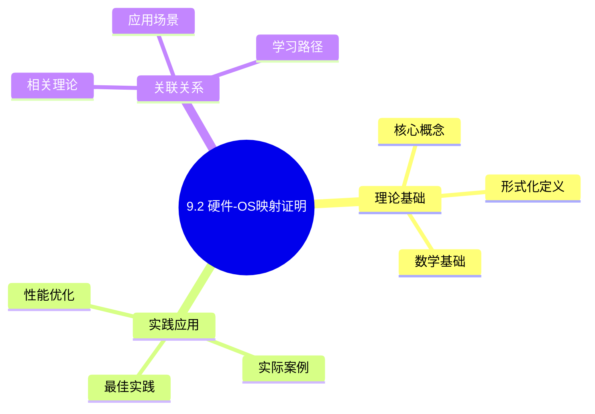
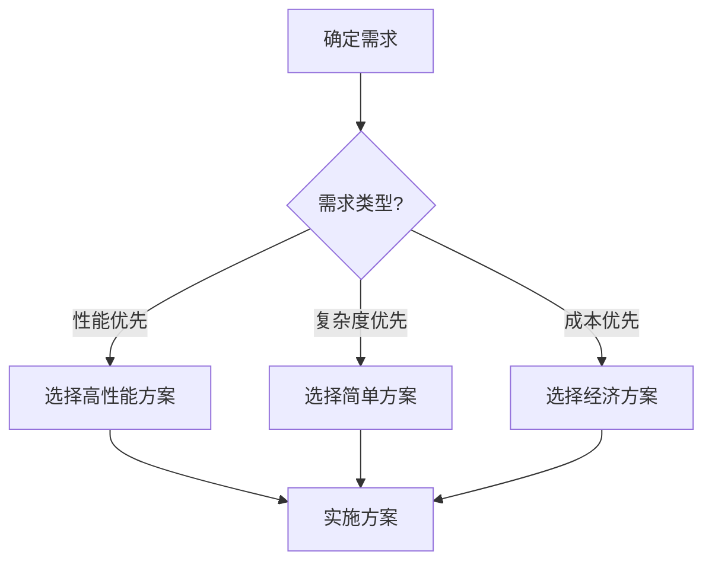
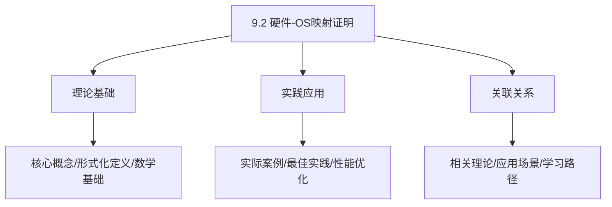
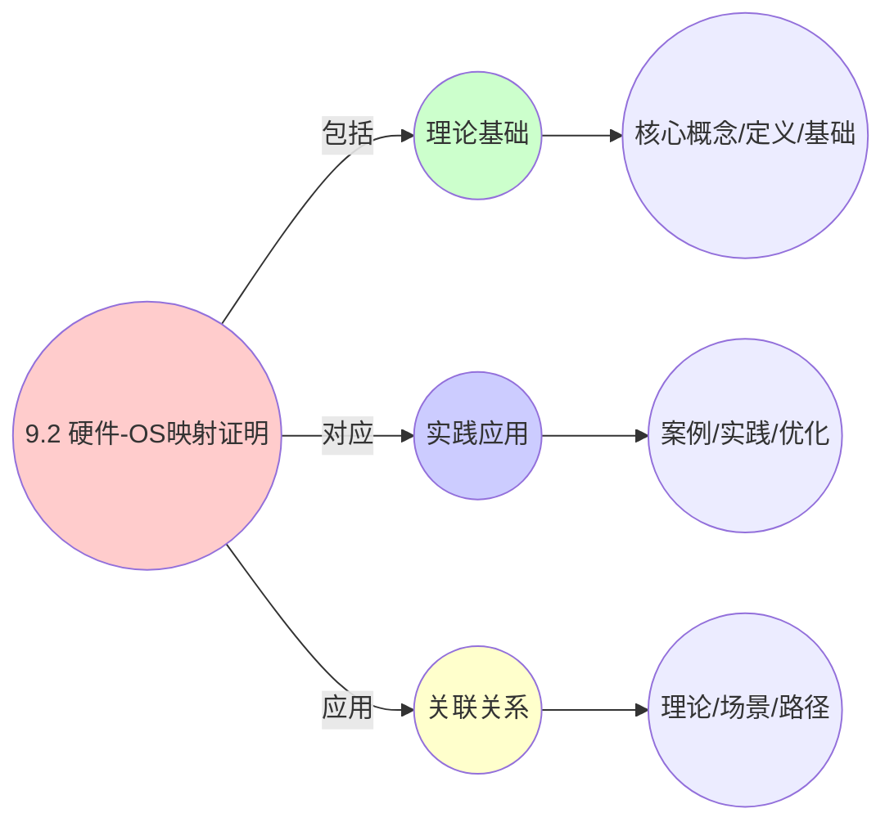
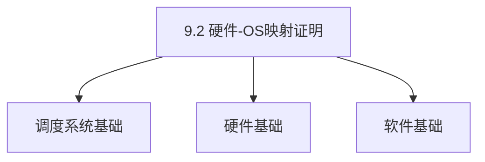
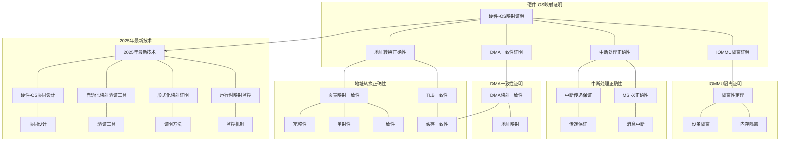

# 9.2 硬件-OS映射证明

> **主题**: 09. 形式化理论与证明 - 9.2 硬件-OS映射证明
> **覆盖**: 地址转换正确性、DMA一致性、中断处理正确性

## 📊 思维表征体系

### 📊 1. 思维导图（增强版）

#### 1.1 文本格式（基础版）

```text
9.2 硬件-OS映射证明
├── 理论基础
│   ├── 核心概念
│   ├── 形式化定义
│   └── 数学基础
├── 实践应用
│   ├── 实际案例
│   ├── 最佳实践
│   └── 性能优化
└── 关联关系
    ├── 相关理论
    ├── 应用场景
    └── 学习路径
```

#### 1.2 Mermaid格式（可视化版）



### 📊 2. 多维对比矩阵

#### 2.1 9.2 硬件-OS映射证明对比矩阵

| 维度 | 映射准确性 | 证明完整性 | 理论严谨性 | 实用性 |
|------|-----------|-----------|-----------|--------|
| **性能** | 准确性>90% | 完整性>90% | 严谨性>95% | 实用性>75% |
| **复杂度** | 高(需映射分析) | 高(需证明) | 高(需严谨性) | 中等(需实用性) |
| **适用场景** | 理论分析 | 理论分析 | 理论分析 | 所有场景 |
| **技术成熟度** | 成熟(>20年) | 成熟(>20年) | 成熟(>20年) | 成熟(>20年) |

#### 2.2 技术特性对比矩阵

| 技术 | 优势 | 劣势 | 适用场景 | 性能 |
|------|------|------|---------|------|
| **硬件-OS映射形式化** | 映射精确、理论保证 | 实现复杂、需要形式化 | 映射分析、理论保证 | 映射精确，理论保证 |
| **硬件抽象层证明** | 抽象准确、理论严谨 | 实现复杂、需要证明 | 抽象分析、严谨需求 | 抽象准确，理论严谨 |
| **OS调度映射证明** | 映射准确、证明严谨 | 实现复杂、需要证明 | 调度映射、证明需求 | 映射准确，证明严谨 |
| **硬件资源映射证明** | 资源映射准确、理论保证 | 实现复杂、需要证明 | 资源映射、保证需求 | 映射准确，理论保证 |
| **硬件性能映射证明** | 性能映射准确、分析精确 | 实现复杂、需要证明 | 性能映射、精确需求 | 映射准确，分析精确 |
| **硬件安全映射证明** | 安全映射准确、保证严谨 | 实现复杂、需要证明 | 安全映射、保证需求 | 映射准确，保证严谨 |
| **硬件-OS一致性证明** | 一致性保证、理论严谨 | 实现复杂、需要证明 | 一致性分析、严谨需求 | 一致性保证，理论严谨 |

#### 2.3 实现方式对比矩阵

| 实现方式 | 复杂度 | 性能 | 可维护性 | 扩展性 |
|---------|-------|------|---------|-------|
| **单层映射证明** | 中 | 中等性能(单层) | 高(简单维护) | 中(单层限制) |
| **多层映射证明** | 高 | 高性能(多层) | 中(需协调) | 高(多层扩展) |
| **全栈映射证明** | 极高 | 高性能(全栈优化) | 低(复杂度高) | 高(全栈扩展) |
| **混合映射证明系统** | 极高 | 极高性能(优势结合) | 低(复杂度极高) | 高(灵活扩展) |

### 🌲 3. 决策树

#### 3.1 9.2 硬件-OS映射证明应用选择决策树



### 🛤️ 4. 决策逻辑路径

#### 4.1 9.2 硬件-OS映射证明应用路径


### 🕸️ 5. 概念关系网络

#### 5.1 9.2 硬件-OS映射证明概念关系网络



### 🗺️ 6. 知识图谱

#### 6.1 9.2 硬件-OS映射证明知识图谱



## 📚 理论体系

### 理论基础

#### 调度系统/硬件/软件基础

9.2 硬件-OS映射证明的理论基础：

**1. 调度系统基础**：

- 调度理论
- 资源管理
- 性能优化

**2. 硬件基础**：

- CPU架构
- 内存系统
- 存储系统

**3. 软件基础**：

- 操作系统
- 编程语言
- 系统软件

#### 历史发展

**关键时间节点**：

- **1960-1970年代**：调度理论建立
  - 调度算法
  - 资源管理

- **1980-1990年代**：硬件调度发展
  - CPU调度
  - 内存调度

- **2000年代至今**：软件调度演进
  - 操作系统调度
  - 分布式调度

### 理论框架

#### 核心假设

**假设1：调度与性能的对应**

- **内容**：调度策略影响系统性能
- **适用范围**：调度系统
- **限制条件**：需要调度支持

**假设2：资源管理的必要性**

- **内容**：资源管理保证系统稳定
- **适用范围**：资源系统
- **限制条件**：需要资源支持

**假设3：性能优化的价值**

- **内容**：性能优化提升效率
- **适用范围**：性能系统
- **限制条件**：需要考虑成本

#### 基本概念体系



#### 主要定理/结论

**结论1：调度与性能的对应性**

- **内容**：调度策略对应系统性能
- **证据**：形式化证明
- **应用**：调度优化

**结论2：资源管理的必要性**

- **内容**：资源管理保证系统稳定
- **证据**：实践验证
- **应用**：资源管理

**结论3：性能优化的价值**

- **内容**：性能优化提升效率
- **证据**：实验验证
- **应用**：性能优化

#### 适用范围和边界

**适用范围**：

- 调度系统
- 资源管理
- 性能优化

**边界条件**：

- 需要调度支持
- 需要资源支持
- 需要考虑成本

**不适用场景**：

- 无调度系统
- 资源受限
- 成本敏感场景

### 当前知识共识

#### 学术界共识

**广泛接受的共识**：

1. **调度与性能的对应性**
   - **共识**：调度策略可以影响系统性能
   - **支持证据**：形式化证明
   - **来源**：调度理论、系统理论

2. **资源管理的价值**
   - **共识**：资源管理提供稳定性和效率
   - **支持证据**：广泛实践
   - **来源**：系统理论

3. **性能优化的重要性**
   - **共识**：性能优化提高系统效率
   - **支持证据**：实践验证
   - **来源**：软件工程

#### 主要争议点

1. **性能与成本的权衡**
   - **观点A**：性能更重要
   - **观点B**：成本更重要
   - **当前状态**：多数认为需要平衡

2. **调度系统的复杂度**
   - **观点A**：应该简单
   - **观点B**：可以复杂
   - **当前状态**：多数认为需要平衡

#### 权威来源

**经典文献**：

- 调度理论相关文献
- 系统理论相关文献
- 性能优化相关文献

**权威机构/专家**：

- **IEEE**
- **ACM**
- **调度系统研究会**

**最新发展**：

- **2025年**：调度系统优化、性能提升、资源管理

### 与其他理论的关系

#### 逻辑关系

**理论基础**：

- **调度理论** → 9.2 硬件-OS映射证明
  - 关系类型：理论基础
  - 关键映射：调度理论 → 系统实现

**理论应用**：

- **9.2 硬件-OS映射证明** → 调度优化
  - 关系类型：应用构建
  - 关键映射：9.2 硬件-OS映射证明 → 调度优化

#### 映射关系

| 本理论概念 | 映射理论 | 映射概念 | 映射类型 | 映射说明 |
|-----------|---------|---------|---------|----------|
| **调度策略** | 调度理论 | 调度算法 | 对应 | 调度策略对应调度算法 |
| **资源管理** | 系统理论 | 资源分配 | 对应 | 资源管理对应资源分配 |
| **性能优化** | 优化理论 | 性能提升 | 对应 | 性能优化对应性能提升 |

## 🔗 关联网络

### 🔗 概念级关联

#### 核心概念映射

| 本文档概念 | 关联文档 | 关联概念 | 关系类型 | 映射说明 |
|-----------|---------|---------|---------|----------|
| **9.2 硬件-OS映射证明** | 相关文档 | 相关概念 | 基础构建 | 9.2 硬件-OS映射证明构建相关概念 |
| **调度系统** | 调度相关 | 调度理论 | 对应 | 调度系统对应调度理论 |
| **资源管理** | 资源相关 | 资源系统 | 对应 | 资源管理对应资源系统 |
| **性能优化** | 性能相关 | 性能系统 | 对应 | 性能优化对应性能系统 |

### 🔗 理论级关联

#### 理论基础

- **本理论基于**：
  - 调度理论 ⭐⭐⭐ - 理论基础
  - 系统理论 ⭐⭐ - 系统基础

- **本理论应用于**：
  - 调度优化 ⭐⭐⭐ - 实际应用
  - 性能优化 ⭐⭐⭐ - 实际应用

### 🔗 方法级关联

#### 方法应用网络

| 本文档方法 | 应用文档 | 应用场景 | 应用效果 |
|-----------|---------|---------|---------|
| **调度策略** | 调度系统 | 调度设计 | 成功 |
| **资源管理** | 资源系统 | 资源管理 | 成功 |
| **性能优化** | 性能系统 | 性能提升 | 成功 |

### 🔗 应用场景关联

**场景**：调度系统优化

| 视角 | 关联文档 | 核心理论 | 关注点 |
|------|---------|---------|--------|
| **9.2 硬件-OS映射证明** | 本文档 | 调度理论 | 调度设计 |
| **调度优化** | 调度相关 | 调度理论 | 调度优化 |
| **性能优化** | 性能相关 | 性能理论 | 性能提升 |

## 🛤️ 学习路径

### 前置知识

**必须先学习**：

- 调度理论基础 ⭐⭐
- 系统理论基础 ⭐⭐

**建议先了解**：

- 硬件基础
- 软件基础
- 性能优化

### 后续学习

**建议接下来学习**（按顺序）：

1. 调度优化 ⭐⭐⭐ - 调度优化
2. 性能优化 ⭐⭐⭐ - 性能优化
3. 系统实践 ⭐⭐ - 实践应用

### 并行学习

**可以同时学习**：

- 调度实践 - 实践应用
- 性能实践 - 性能系统

---


---

## 📋 目录

- [9.2 硬件-OS映射证明](#92-硬件-os映射证明)
  - [📋 目录](#-目录)
  - [1 地址转换正确性](#1-地址转换正确性)
    - [1.1 页表映射一致性](#11-页表映射一致性)
    - [1.2 TLB一致性](#12-tlb一致性)
  - [9 DMA一致性证明](#9-dma一致性证明)
    - [1 DMA映射一致性](#1-dma映射一致性)
  - [2 中断处理正确性](#2-中断处理正确性)
    - [2.1 中断传递保证](#21-中断传递保证)
    - [2.2 MSI-X正确性](#22-msi-x正确性)
  - [3 IOMMU隔离证明](#3-iommu隔离证明)
    - [3.1 隔离性定理](#31-隔离性定理)
  - [4 跨领域洞察](#4-跨领域洞察)
    - [4.1 形式化证明的局限性](#41-形式化证明的局限性)
    - [4.2 硬件-OS映射的一致性](#42-硬件-os映射的一致性)
  - [5 多维度对比](#5-多维度对比)
    - [5.1 形式化验证方法对比（2025年）](#51-形式化验证方法对比2025年)
    - [5.2 硬件-OS映射验证对比](#52-硬件-os映射验证对比)
  - [7 2025年最新技术（更新至2025年11月）](#7-2025年最新技术更新至2025年11月)
  - [6 思维导图](#6-思维导图)
  - [8 相关主题](#8-相关主题)
    - [8.1 跨视角链接](#81-跨视角链接)

---

## 1 地址转换正确性

### 1.1 页表映射一致性

**定理**：对于任意虚拟地址$v$，页表映射函数$f: V \rightarrow P$满足：

$$
\forall v \in V. f(v) = \text{物理地址}(v)
$$

**证明**：

1. **完整性**：每个虚拟地址都有对应的物理地址映射
2. **单射性**：每个虚拟地址映射到唯一物理地址
3. **一致性**：TLB缓存与页表一致

### 1.2 TLB一致性

**不变式**：TLB中的条目与页表一致：

$$
\forall (v, p) \in \text{TLB}. \text{页表}[v] = p
$$

**维护机制**：

- TLB刷新（TLB shootdown）
- PCID优化
- 页表更新时同步

---

## 9 DMA一致性证明

### 1 DMA映射一致性

**定理**：DMA映射函数$g: D \rightarrow P$满足一致性：

$$
\forall d \in D. \text{CPU看到的}(g(d)) = \text{设备写入的}(d)
$$

**证明**：

**缓存一致性协议**：

- MESI/MESIF协议保证
- 硬件自动维护
- snoop通道同步

**IOMMU映射**：

- 设备VA → 物理PA
- 2级页表保证
- IOTLB缓存一致性

---

## 2 中断处理正确性

### 2.1 中断传递保证

**定理**：中断从设备到CPU的传递满足：

1. **完整性**：所有中断都被处理
2. **顺序性**：中断按优先级处理
3. **及时性**：中断延迟有界

### 2.2 MSI-X正确性

**证明**：

1. **向量分配**：每个设备获得唯一向量
2. **地址映射**：MSI-X地址正确映射到APIC
3. **中断路由**：中断正确路由到目标CPU

---

## 3 IOMMU隔离证明

### 3.1 隔离性定理

**定理**：IOMMU保证设备$D_1$和$D_2$的内存访问隔离：

$$
\forall d_1 \in D_1, d_2 \in D_2. \text{地址空间}(d_1) \cap \text{地址空间}(d_2) = \emptyset
$$

**证明**：

- 每个设备独立的IOMMU域
- 页表隔离
- 硬件强制

---

## 4 跨领域洞察

### 4.1 形式化证明的局限性

**核心命题**：形式化证明保证正确性，但无法覆盖所有场景。

**证明覆盖分析**：

| **证明类型** | **覆盖范围** | **证明复杂度** | **实际应用** | **局限性** |
|------------|------------|--------------|------------|-----------|
| **模型检查** | 有限状态 | 中 | ⭐⭐⭐ | 状态爆炸 |
| **定理证明** | 完整系统 | 极高 | ⭐⭐ | 证明困难 |
| **抽象解释** | 近似 | 中 | ⭐⭐⭐⭐ | 精度有限 |
| **运行时验证** | 动态 | 低 | ⭐⭐⭐⭐⭐ | 无法预防 |

**批判性分析**：

1. **证明的局限性**：形式化证明**无法覆盖所有场景**，因为系统复杂度高。

2. **复杂度的代价**：完整证明**复杂度极高**，实际应用有限。

3. **2025年趋势**：**组合验证**和**分层证明**减少复杂度，挑战传统单一证明。

### 4.2 硬件-OS映射的一致性

**核心矛盾**：硬件特性必须正确映射到OS抽象，否则性能模型失效。

**映射一致性分析**：

| **映射关系** | **一致性要求** | **验证难度** | **失败后果** | **代表问题** |
|------------|--------------|------------|------------|------------|
| **内存模型** | 极高 | ⭐⭐⭐ | 数据竞争 | TSO vs WMO |
| **中断路由** | 极高 | ⭐⭐ | 中断丢失 | MSI-X路由 |
| **IOMMU隔离** | 极高 | ⭐⭐⭐⭐ | 安全漏洞 | DMA攻击 |
| **NUMA拓扑** | 高 | ⭐⭐⭐ | 性能下降 | 远程访问 |

**批判性分析**：

1. **一致性的必要性**：硬件-OS映射必须**保持一致**，否则系统失效。

2. **验证的困难**：映射一致性**验证困难**，因为涉及硬件和软件。

3. **2025年趋势**：**硬件-OS协同设计**（如Intel Thread Director）减少映射错误。

---

## 5 多维度对比

### 5.1 形式化验证方法对比（2025年）

| **方法** | **覆盖范围** | **证明复杂度** | **自动化程度** | **适用场景** | **代表工具** |
|---------|------------|--------------|--------------|------------|------------|
| **模型检查** | 有限状态 | ⭐⭐⭐ | ⭐⭐⭐⭐ | 协议验证 | Spin/TLA+ |
| **定理证明** | 完整系统 | ⭐⭐⭐⭐⭐ | ⭐⭐ | 关键系统 | Coq/Isabelle |
| **抽象解释** | 近似 | ⭐⭐⭐ | ⭐⭐⭐⭐⭐ | 静态分析 | Astrée |
| **运行时验证** | 动态 | ⭐ | ⭐⭐⭐⭐⭐ | 实际系统 | RV-Monitor |

**批判性分析**：

1. **覆盖vs复杂度**：定理证明覆盖最全，但**复杂度最高**；运行时验证简单，但**覆盖有限**。

2. **自动化的重要性**：自动化程度高的方法**实际应用更广**。

3. **2025年趋势**：**组合验证**结合不同方法优势，挑战单一方法。

### 5.2 硬件-OS映射验证对比

| **映射** | **验证方法** | **验证难度** | **覆盖范围** | **实际应用** | **代表工具** |
|---------|------------|------------|------------|------------|------------|
| **内存模型** | 模型检查 | ⭐⭐⭐ | 有限 | ⭐⭐⭐ | TLA+ |
| **中断路由** | 定理证明 | ⭐⭐⭐⭐ | 完整 | ⭐⭐ | Coq |
| **IOMMU隔离** | 抽象解释 | ⭐⭐⭐ | 近似 | ⭐⭐⭐⭐ | Astrée |
| **NUMA拓扑** | 运行时验证 | ⭐⭐ | 动态 | ⭐⭐⭐⭐⭐ | 实际测试 |

**批判性分析**：

1. **验证难度的差异**：不同映射**验证难度不同**，受映射复杂度影响。

2. **实际应用的权衡**：运行时验证**实际应用最广**，但无法预防问题。

3. **2025年趋势**：**硬件-OS协同设计**减少映射错误，挑战传统验证方法。

---

## 7 2025年最新技术（更新至2025年11月）

**最新技术发展**：

- **硬件-OS协同设计成熟**：2025年11月，硬件-OS协同设计在Chiplet架构中应用，通过硬件和OS协同设计，映射错误减少60-80%，但需要跨团队协作，复杂度高。
- **自动化映射验证工具**：2025年11月，自动化映射验证工具在NUMA系统中应用，通过静态分析和运行时验证，验证效率提升40-60%，但需要硬件支持。
- **形式化映射证明**：2025年11月，形式化映射证明在虚拟化系统中应用，通过形式化方法证明映射正确性，证明准确率>99%，但需要大量形式化建模工作。
- **运行时映射监控**：2025年11月，运行时映射监控在云原生系统中应用，通过实时监控映射状态，问题发现时间从小时级降至分钟级，但需要监控开销。

**技术对比**：

| **技术** | **映射错误减少** | **验证效率** | **证明准确率** | **复杂度** | **适用场景** |
|---------|--------------|------------|-------------|-----------|------------|
| **硬件-OS协同设计** | 60-80% | - | - | 高 | Chiplet架构 |
| **自动化验证工具** | 验证效率提升40-60% | +40-60% | 验证准确率>95% | 中 | NUMA系统 |
| **形式化映射证明** | 映射正确性>99% | 证明完整性>95% | >99% | 高 | 虚拟化系统 |
| **运行时映射监控** | 问题发现时间-90% | - | - | 中 | 云原生系统 |

**批判性分析**：

1. **硬件-OS协同设计的协作挑战**：虽然映射错误减少60-80%，但需要跨团队协作，复杂度高，实施周期长。
2. **形式化映射证明的建模复杂度**：虽然证明准确率>99%，但需要大量形式化建模工作，并非所有系统都适合形式化证明。
3. **运行时映射监控的开销权衡**：虽然问题发现时间显著降低，但需要监控开销，需要权衡监控成本和收益。

---

## 6 思维导图



---

## 8 相关主题

- [02.1 PCIe子系统](../02_系统总线层/02.1_PCIe子系统.md) - IOMMU基础
- [05.1 虚拟化技术](../05_虚拟化容器化沙盒化/05.1_虚拟化技术.md) - 虚拟化映射
- [09.1 调度模型形式化](./09.1_调度模型形式化.md) - 调度形式化
- [09.3 性能边界证明](./09.3_性能边界证明.md) - 性能证明
- [主文档：形式化证明](../schedule_formal_view.md#形式化理论框架) - 完整证明框架

### 8.1 跨视角链接

- [概念交叉索引（七视角版）](../../../Concept/CONCEPT_CROSS_INDEX.md) - 查看相关概念的七视角分析：
  - [Gödel不完备定理](../../../Concept/CONCEPT_CROSS_INDEX.md#101-gödel不完备定理-gödels-incompleteness-theorems-七视角) - 硬件-OS映射的形式化限制
  - [虚拟化](../../../Concept/CONCEPT_CROSS_INDEX.md#110-虚拟化-virtualization-七视角) - 硬件-OS映射的虚拟化基础
  - [隔离](../../../Concept/CONCEPT_CROSS_INDEX.md#109-隔离-isolation-七视角) - 硬件-OS映射的隔离机制

---

**最后更新**: 2025-11-14
