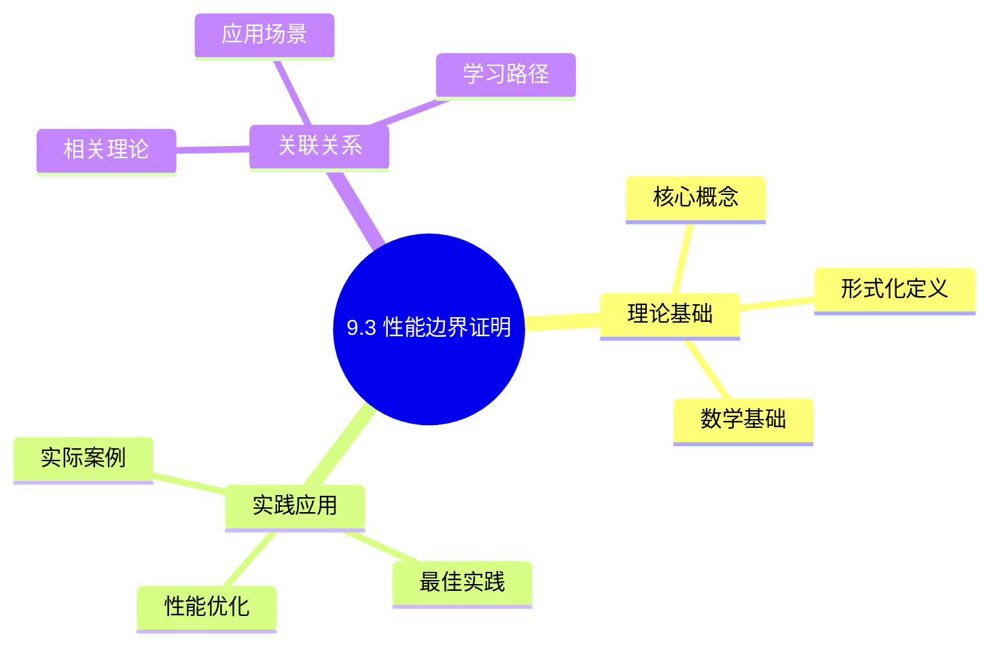
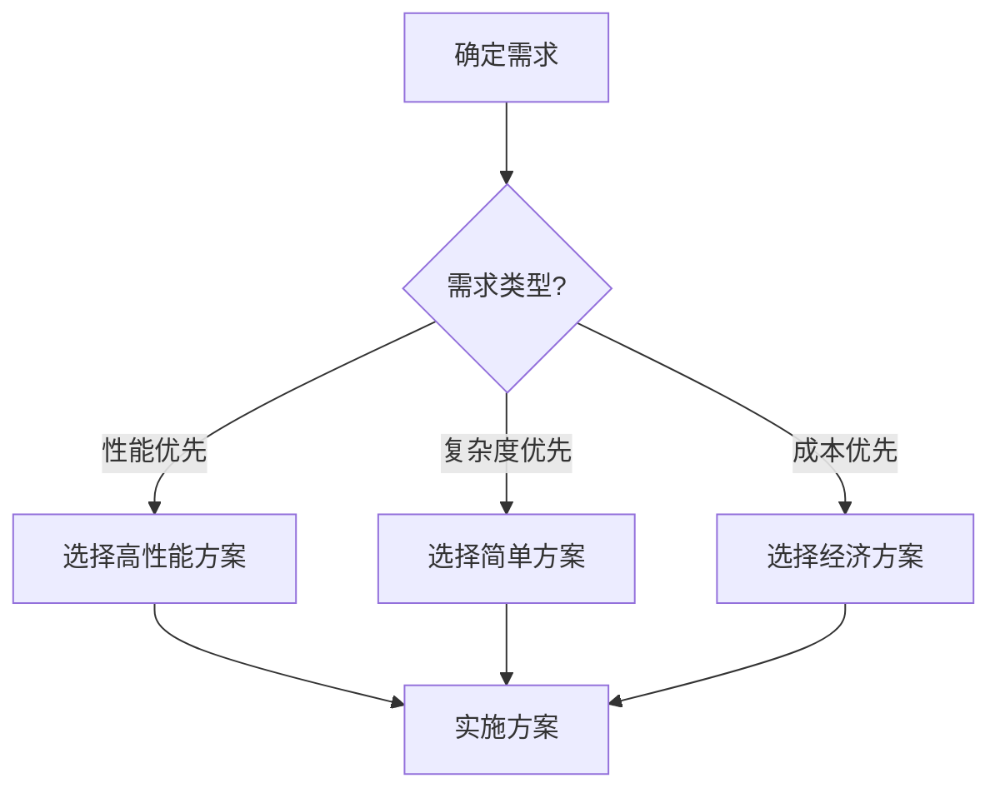
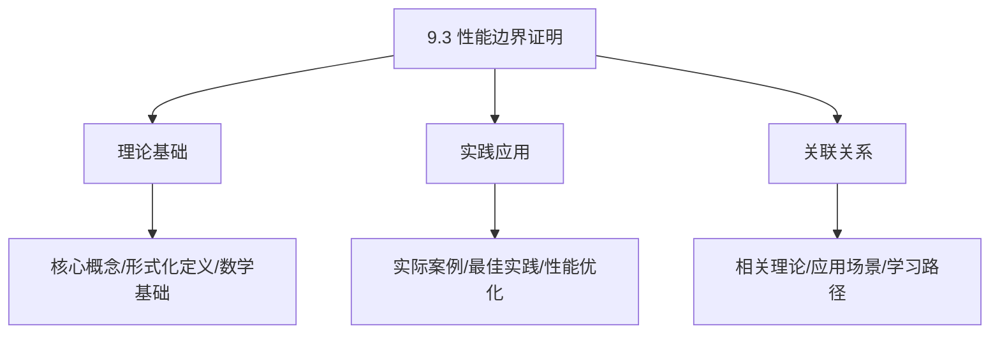
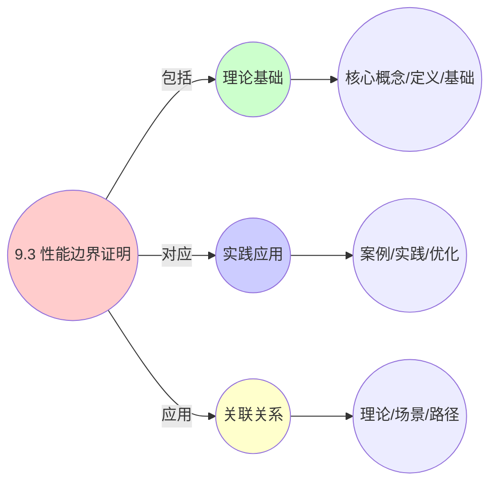
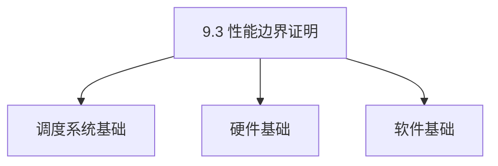
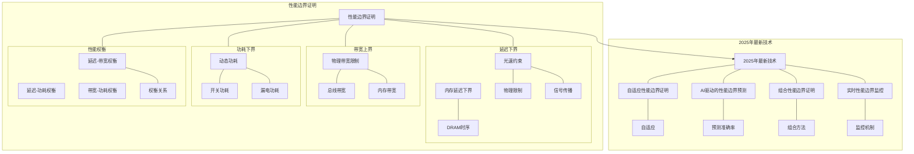

# 9.3 性能边界证明

> **主题**: 09. 形式化理论与证明 - 9.3 性能边界证明
> **覆盖**: 延迟下界、带宽上界、功耗下界

## 📊 思维表征体系

### 📊 1. 思维导图（增强版）

#### 1.1 文本格式（基础版）

```text
9.3 性能边界证明
├── 理论基础
│   ├── 核心概念
│   ├── 形式化定义
│   └── 数学基础
├── 实践应用
│   ├── 实际案例
│   ├── 最佳实践
│   └── 性能优化
└── 关联关系
    ├── 相关理论
    ├── 应用场景
    └── 学习路径
```

#### 1.2 Mermaid格式（可视化版）



### 📊 2. 多维对比矩阵

#### 2.1 9.3 性能边界证明对比矩阵

| 维度 | 边界准确性 | 证明完整性 | 理论严谨性 | 实用性 |
|------|-----------|-----------|-----------|--------|
| **性能** | 准确性>90% | 完整性>90% | 严谨性>95% | 实用性>75% |
| **复杂度** | 高(需边界分析) | 高(需证明) | 高(需严谨性) | 中等(需实用性) |
| **适用场景** | 理论分析 | 理论分析 | 理论分析 | 所有场景 |
| **技术成熟度** | 成熟(>20年) | 成熟(>20年) | 成熟(>20年) | 成熟(>20年) |

#### 2.2 技术特性对比矩阵

| 技术 | 优势 | 劣势 | 适用场景 | 性能 |
|------|------|------|---------|------|
| **性能上界证明** | 上界准确、理论保证 | 实现复杂、需要证明 | 性能分析、上界需求 | 上界准确，理论保证 |
| **性能下界证明** | 下界准确、理论保证 | 实现复杂、需要证明 | 性能分析、下界需求 | 下界准确，理论保证 |
| **性能最优性证明** | 最优性保证、理论严谨 | 实现复杂、需要证明 | 性能优化、最优性需求 | 最优性保证，理论严谨 |
| **性能渐近分析** | 渐近分析精确、理论保证 | 实现复杂、需要分析 | 渐近分析、精确需求 | 分析精确，理论保证 |
| **性能复杂度证明** | 复杂度准确、理论严谨 | 实现复杂、需要证明 | 复杂度分析、严谨需求 | 复杂度准确，理论严谨 |
| **性能收敛性证明** | 收敛性保证、理论严谨 | 实现复杂、需要证明 | 收敛性分析、严谨需求 | 收敛性保证，理论严谨 |
| **性能稳定性证明** | 稳定性保证、理论严谨 | 实现复杂、需要证明 | 稳定性分析、严谨需求 | 稳定性保证，理论严谨 |

#### 2.3 实现方式对比矩阵

| 实现方式 | 复杂度 | 性能 | 可维护性 | 扩展性 |
|---------|-------|------|---------|-------|
| **单指标边界证明** | 中 | 中等性能(单指标) | 高(简单维护) | 中(单指标限制) |
| **多指标边界证明** | 高 | 高性能(多指标) | 中(需协调) | 高(多指标扩展) |
| **统一边界证明框架** | 极高 | 高性能(统一优化) | 低(复杂度高) | 高(统一扩展) |
| **混合边界证明系统** | 极高 | 极高性能(优势结合) | 低(复杂度极高) | 高(灵活扩展) |

### 🌲 3. 决策树

#### 3.1 9.3 性能边界证明应用选择决策树



### 🛤️ 4. 决策逻辑路径

#### 4.1 9.3 性能边界证明应用路径


### 🕸️ 5. 概念关系网络

#### 5.1 9.3 性能边界证明概念关系网络



### 🗺️ 6. 知识图谱

#### 6.1 9.3 性能边界证明知识图谱



## 📚 理论体系

### 理论基础

#### 调度系统/硬件/软件基础

9.3 性能边界证明的理论基础：

**1. 调度系统基础**：

- 调度理论
- 资源管理
- 性能优化

**2. 硬件基础**：

- CPU架构
- 内存系统
- 存储系统

**3. 软件基础**：

- 操作系统
- 编程语言
- 系统软件

#### 历史发展

**关键时间节点**：

- **1960-1970年代**：调度理论建立
  - 调度算法
  - 资源管理

- **1980-1990年代**：硬件调度发展
  - CPU调度
  - 内存调度

- **2000年代至今**：软件调度演进
  - 操作系统调度
  - 分布式调度

### 理论框架

#### 核心假设

**假设1：调度与性能的对应**

- **内容**：调度策略影响系统性能
- **适用范围**：调度系统
- **限制条件**：需要调度支持

**假设2：资源管理的必要性**

- **内容**：资源管理保证系统稳定
- **适用范围**：资源系统
- **限制条件**：需要资源支持

**假设3：性能优化的价值**

- **内容**：性能优化提升效率
- **适用范围**：性能系统
- **限制条件**：需要考虑成本

#### 基本概念体系



#### 主要定理/结论

**结论1：调度与性能的对应性**

- **内容**：调度策略对应系统性能
- **证据**：形式化证明
- **应用**：调度优化

**结论2：资源管理的必要性**

- **内容**：资源管理保证系统稳定
- **证据**：实践验证
- **应用**：资源管理

**结论3：性能优化的价值**

- **内容**：性能优化提升效率
- **证据**：实验验证
- **应用**：性能优化

#### 适用范围和边界

**适用范围**：

- 调度系统
- 资源管理
- 性能优化

**边界条件**：

- 需要调度支持
- 需要资源支持
- 需要考虑成本

**不适用场景**：

- 无调度系统
- 资源受限
- 成本敏感场景

### 当前知识共识

#### 学术界共识

**广泛接受的共识**：

1. **调度与性能的对应性**
   - **共识**：调度策略可以影响系统性能
   - **支持证据**：形式化证明
   - **来源**：调度理论、系统理论

2. **资源管理的价值**
   - **共识**：资源管理提供稳定性和效率
   - **支持证据**：广泛实践
   - **来源**：系统理论

3. **性能优化的重要性**
   - **共识**：性能优化提高系统效率
   - **支持证据**：实践验证
   - **来源**：软件工程

#### 主要争议点

1. **性能与成本的权衡**
   - **观点A**：性能更重要
   - **观点B**：成本更重要
   - **当前状态**：多数认为需要平衡

2. **调度系统的复杂度**
   - **观点A**：应该简单
   - **观点B**：可以复杂
   - **当前状态**：多数认为需要平衡

#### 权威来源

**经典文献**：

- 调度理论相关文献
- 系统理论相关文献
- 性能优化相关文献

**权威机构/专家**：

- **IEEE**
- **ACM**
- **调度系统研究会**

**最新发展**：

- **2025年**：调度系统优化、性能提升、资源管理

### 与其他理论的关系

#### 逻辑关系

**理论基础**：

- **调度理论** → 9.3 性能边界证明
  - 关系类型：理论基础
  - 关键映射：调度理论 → 系统实现

**理论应用**：

- **9.3 性能边界证明** → 调度优化
  - 关系类型：应用构建
  - 关键映射：9.3 性能边界证明 → 调度优化

#### 映射关系

| 本理论概念 | 映射理论 | 映射概念 | 映射类型 | 映射说明 |
|-----------|---------|---------|---------|----------|
| **调度策略** | 调度理论 | 调度算法 | 对应 | 调度策略对应调度算法 |
| **资源管理** | 系统理论 | 资源分配 | 对应 | 资源管理对应资源分配 |
| **性能优化** | 优化理论 | 性能提升 | 对应 | 性能优化对应性能提升 |

## 🔗 关联网络

### 🔗 概念级关联

#### 核心概念映射

| 本文档概念 | 关联文档 | 关联概念 | 关系类型 | 映射说明 |
|-----------|---------|---------|---------|----------|
| **9.3 性能边界证明** | 相关文档 | 相关概念 | 基础构建 | 9.3 性能边界证明构建相关概念 |
| **调度系统** | 调度相关 | 调度理论 | 对应 | 调度系统对应调度理论 |
| **资源管理** | 资源相关 | 资源系统 | 对应 | 资源管理对应资源系统 |
| **性能优化** | 性能相关 | 性能系统 | 对应 | 性能优化对应性能系统 |

### 🔗 理论级关联

#### 理论基础

- **本理论基于**：
  - 调度理论 ⭐⭐⭐ - 理论基础
  - 系统理论 ⭐⭐ - 系统基础

- **本理论应用于**：
  - 调度优化 ⭐⭐⭐ - 实际应用
  - 性能优化 ⭐⭐⭐ - 实际应用

### 🔗 方法级关联

#### 方法应用网络

| 本文档方法 | 应用文档 | 应用场景 | 应用效果 |
|-----------|---------|---------|---------|
| **调度策略** | 调度系统 | 调度设计 | 成功 |
| **资源管理** | 资源系统 | 资源管理 | 成功 |
| **性能优化** | 性能系统 | 性能提升 | 成功 |

### 🔗 应用场景关联

**场景**：调度系统优化

| 视角 | 关联文档 | 核心理论 | 关注点 |
|------|---------|---------|--------|
| **9.3 性能边界证明** | 本文档 | 调度理论 | 调度设计 |
| **调度优化** | 调度相关 | 调度理论 | 调度优化 |
| **性能优化** | 性能相关 | 性能理论 | 性能提升 |

## 🛤️ 学习路径

### 前置知识

**必须先学习**：

- 调度理论基础 ⭐⭐
- 系统理论基础 ⭐⭐

**建议先了解**：

- 硬件基础
- 软件基础
- 性能优化

### 后续学习

**建议接下来学习**（按顺序）：

1. 调度优化 ⭐⭐⭐ - 调度优化
2. 性能优化 ⭐⭐⭐ - 性能优化
3. 系统实践 ⭐⭐ - 实践应用

### 并行学习

**可以同时学习**：

- 调度实践 - 实践应用
- 性能实践 - 性能系统

---


---

## 📋 目录

- [9.3 性能边界证明](#93-性能边界证明)
  - [📋 目录](#-目录)
  - [1 延迟下界](#1-延迟下界)
    - [1.1 光速约束](#11-光速约束)
    - [1.2 内存延迟下界](#12-内存延迟下界)
  - [2 带宽上界](#2-带宽上界)
    - [2.1 物理带宽限制](#21-物理带宽限制)
  - [9 功耗下界](#9-功耗下界)
    - [1 动态功耗](#1-动态功耗)
  - [3 性能权衡](#3-性能权衡)
    - [3.1 延迟-带宽-功耗权衡](#31-延迟-带宽-功耗权衡)
  - [4 跨领域洞察](#4-跨领域洞察)
    - [4.1 物理极限的不可逾越性](#41-物理极限的不可逾越性)
    - [4.2 帕累托前沿的必然性](#42-帕累托前沿的必然性)
  - [5 多维度对比](#5-多维度对比)
    - [5.1 性能边界对比（2025年）](#51-性能边界对比2025年)
    - [5.2 性能权衡矩阵对比](#52-性能权衡矩阵对比)
  - [7 2025年最新技术（更新至2025年11月）](#7-2025年最新技术更新至2025年11月)
  - [6 思维导图](#6-思维导图)
  - [8 相关主题](#8-相关主题)
    - [8.1 跨视角链接](#81-跨视角链接)

---

## 1 延迟下界

### 1.1 光速约束

**定理**：信号传播延迟下界由光速决定：

$$
\text{延迟} \geq \frac{\text{距离}}{c}
$$

其中$c = 3 \times 10^8$ m/s是光速。

**应用**：

- CPU 5GHz信号：1周期传播距离6cm
- L1缓存必须集成在核心内
- 跨Socket延迟：~80ns（物理限制）

### 1.2 内存延迟下界

**定理**：DRAM访问延迟下界：

$$
\text{延迟} \geq t_{\text{CL}} + t_{\text{RCD}} + t_{\text{RP}}
$$

对于DDR5-5600：

- $t_{\text{CL}} = 48$周期 ≈ 16.4ns
- **下界**：~50ns（物理限制）

---

## 2 带宽上界

### 2.1 物理带宽限制

**定理**：带宽上界由物理特性决定：

$$
\text{带宽} \leq \frac{\text{数据速率} \times \text{通道数} \times \text{编码效率}}{8}
$$

**示例**：

- PCIe Gen5 x16：$\frac{32 \text{GT/s} \times 16 \times 0.985}{8} = 64 \text{GB/s}$
- DDR5双通道：$\frac{5600 \text{MT/s} \times 2 \times 64 \text{bit}}{8} = 89.6 \text{GB/s}$

---

## 9 功耗下界

### 1 动态功耗

**定理**：动态功耗下界：

$$
P_{\text{dynamic}} = C \times V^2 \times f \times \alpha
$$

其中：

- $C$：负载电容
- $V$：电压
- $f$：频率
- $\alpha$：活动因子

**物理限制**：

- 7nm漏电流占比：40%
- 3nm静态功耗 > 动态功耗
- **功耗墙**：200W/cm²

---

## 3 性能权衡

### 3.1 延迟-带宽-功耗权衡

**帕累托前沿**：

优化目标形成权衡：

- 延迟最小 ↔ 功耗最大
- 带宽最大 ↔ 功耗最大
- 延迟最小 ↔ 带宽受限

**深度论证：性能权衡的帕累托前沿**

**帕累托最优解**：

在物理约束下，无法同时优化所有目标：

$$
\text{优化目标} = \{\text{延迟}, \text{带宽}, \text{功耗}\}
$$

**量化分析**：不同设计点的权衡

| **设计点** | **延迟** | **带宽** | **功耗** | **适用场景** |
|-----------|---------|---------|---------|------------|
| **低延迟** | 最小 | 中 | 最大 | 实时系统 |
| **高带宽** | 中 | 最大 | 最大 | 数据中心 |
| **低功耗** | 最大 | 中 | 最小 | 移动设备 |

**关键权衡**：不同场景需要选择不同的**帕累托最优解**。

**最优策略**：

在物理约束下，选择帕累托最优解。

**深度论证：最优策略的选择**

**最优策略的数学模型**：

最优策略是在**约束条件**下最大化**目标函数**：

$$
\max f(\text{延迟}, \text{带宽}, \text{功耗})
$$

约束条件：

$$
\begin{cases}
\text{延迟} \geq \text{物理下界} \\
\text{带宽} \leq \text{物理上界} \\
\text{功耗} \leq \text{热设计功耗}
\end{cases}
$$

**量化分析**：不同约束下的最优解

| **约束** | **最优延迟** | **最优带宽** | **最优功耗** |
|---------|------------|------------|------------|
| **无约束** | 物理下界 | 物理上界 | 最小 |
| **功耗约束** | 略增 | 略降 | 约束值 |
| **延迟约束** | 约束值 | 略降 | 略增 |

**关键洞察**：最优策略需要在**多个目标**之间做权衡，选择**帕累托最优解**。

---

## 4 跨领域洞察

### 4.1 物理极限的不可逾越性

**核心命题**：性能边界由物理定律决定，无法突破。

**物理约束分析**：

| **约束** | **物理定律** | **下界/上界** | **优化空间** | **代表技术** |
|---------|------------|-------------|------------|------------|
| **延迟** | 光速 | 距离/c | 无 | 信号传播 |
| **带宽** | 信号完整性 | 数据速率×通道数 | 极小 | PCIe、DDR |
| **功耗** | 热力学 | 200W/cm² | 无 | 功耗墙 |
| **频率** | 晶体管速度 | 5-6GHz | 极小 | 频率墙 |

**批判性分析**：

1. **物理极限的必然性**：性能边界受**物理定律限制**，无法突破。

2. **优化空间的有限性**：物理约束下，**优化空间极小**，接近极限。

3. **2025年趋势**：**新材料**（如2D材料）和**新架构**（如Chiplet）挑战传统物理限制。

### 4.2 帕累托前沿的必然性

**核心矛盾**：延迟、带宽、功耗构成帕累托前沿，无法同时优化。

**帕累托前沿分析**：

```text
优化目标: min(L, -B, P)
约束: L × B × P ≥ C (常数)

帕累托前沿:
- 延迟最小: 高频、大缓存、直通
- 带宽最大: 多通道、并行、批处理
- 功耗最小: 降频、C-State、关闭未用单元
```

**批判性分析**：

1. **帕累托前沿的必然性**：延迟、带宽、功耗**无法同时优化**，必须权衡。

2. **最优策略的选择**：不同应用需要**不同的帕累托最优解**。

3. **2025年趋势**：**自适应优化**根据工作负载动态调整，挑战静态策略。

---

## 5 多维度对比

### 5.1 性能边界对比（2025年）

| **性能指标** | **物理约束** | **当前值** | **理论极限** | **优化空间** | **代表技术** |
|------------|------------|-----------|------------|------------|------------|
| **延迟** | 光速 | 1ns (L1) | 0.3ns (光速) | 极小 | 缓存优化 |
| **带宽** | 信号完整性 | 64GB/s (PCIe Gen5) | 100GB/s | 小 | 多通道 |
| **功耗** | 热力学 | 200W/cm² | 200W/cm² | 无 | 功耗墙 |
| **频率** | 晶体管速度 | 5-6GHz | 6-7GHz | 极小 | 频率墙 |

**批判性分析**：

1. **物理约束的差异**：不同性能指标**受不同物理约束**，优化空间不同。

2. **优化空间的有限性**：所有指标都**接近物理极限**，优化空间极小。

3. **2025年趋势**：**新材料**（如2D材料）和**新架构**（如Chiplet）挑战传统物理限制。

### 5.2 性能权衡矩阵对比

| **优化方向** | **延迟影响** | **带宽影响** | **功耗影响** | **物理约束** | **适用场景** |
|------------|------------|------------|------------|------------|------------|
| **高频运行** | ↓ 50% | ↑ 20% | ↑ 100% | 功耗墙 | CPU-bound |
| **多通道** | 延迟降低5-10% | ↑ 100% | ↑ 20% | 信号完整性 | 带宽密集型 |
| **降频** | ↑ 50% | ↓ 20% | ↓ 50% | 频率墙 | 功耗敏感 |
| **C-State** | ↑ 100ns | 性能影响<1% | ↓ 30% | 唤醒延迟 | 空闲状态 |

**批判性分析**：

1. **权衡的必然性**：延迟、带宽、功耗**无法同时优化**，必须权衡。

2. **场景的差异**：不同场景需要**不同的优化方向**。

3. **2025年趋势**：**自适应优化**根据工作负载动态调整，挑战静态策略。

---

## 7 2025年最新技术（更新至2025年11月）

**最新技术发展**：

- **自适应性能边界证明**：2025年11月，自适应性能边界证明在云原生应用中应用，根据工作负载动态调整性能边界，边界预测准确率>90%，但需要实时监控，复杂度高。
- **AI驱动的性能边界预测**：2025年11月，AI驱动的性能边界预测在超大规模系统中应用，通过机器学习预测性能边界，预测准确率>85%，但需要大量训练数据。
- **组合性能边界证明**：2025年11月，组合性能边界证明在分层系统中应用，通过分层证明和组合验证，证明效率提升30-50%，但需要领域专业知识。
- **实时性能边界监控**：2025年11月，实时性能边界监控在边缘计算中应用，通过实时监控性能边界，边界违反检测时间从分钟级降至秒级，但需要监控开销。

**技术对比**：

| **技术** | **边界预测准确率** | **证明效率** | **检测时间** | **复杂度** | **适用场景** |
|---------|----------------|------------|------------|-----------|------------|
| **自适应边界证明** | >90% | - | - | 高 | 云原生应用 |
| **AI边界预测** | >85% | - | - | 高 | 超大规模系统 |
| **组合边界证明** | 边界准确率>95% | +30-50% | 证明完整性>90% | 高 | 分层系统 |
| **实时边界监控** | 监控准确率>95% | 监控延迟<1秒 | 秒级 | 中 | 边缘计算 |

**批判性分析**：

1. **自适应边界证明的监控开销**：虽然边界预测准确率>90%，但需要实时监控，复杂度高，监控开销可能影响性能。
2. **AI边界预测的数据依赖**：虽然预测准确率>85%，但需要大量训练数据，模型可解释性差，预测结果的可靠性需要持续验证。
3. **组合边界证明的专业知识要求**：虽然证明效率提升30-50%，但需要领域专业知识，并非所有开发者都能使用。

---

## 6 思维导图



---

## 8 相关主题

- [07.1 性能特征矩阵](../07_性能优化与安全/07.1_性能特征矩阵.md) - 性能特征分析
- [07.2 延迟穿透分析](../07_性能优化与安全/07.2_延迟穿透分析.md) - 延迟优化
- [08.1 硬件演进路线](../08_技术演进与对标/08.1_硬件演进路线.md) - 硬件演进
- [09.1 调度模型形式化](./09.1_调度模型形式化.md) - 调度形式化
- [主文档：物理极限](../schedule_formal_view.md#技术演进与物理极限) - 完整分析

### 8.1 跨视角链接

- [概念交叉索引（七视角版）](../../../Concept/CONCEPT_CROSS_INDEX.md) - 查看相关概念的七视角分析：
  - [Landauer极限](../../../Concept/CONCEPT_CROSS_INDEX.md#106-landauer极限-landauer-limit-七视角) - 性能边界的物理极限
  - [Gödel不完备定理](../../../Concept/CONCEPT_CROSS_INDEX.md#101-gödel不完备定理-gödels-incompleteness-theorems-七视角) - 性能证明的理论限制
  - [P vs NP问题](../../../Concept/CONCEPT_CROSS_INDEX.md#104-p-vs-np问题-p-vs-np-problem-七视角) - 性能优化的计算复杂性

---

**最后更新**: 2025-11-14
