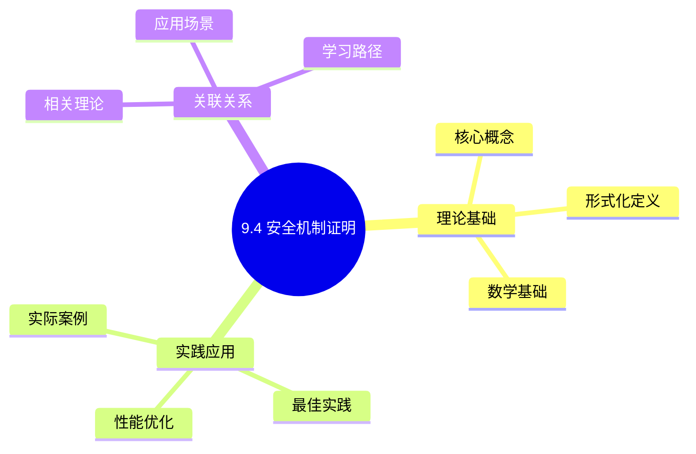
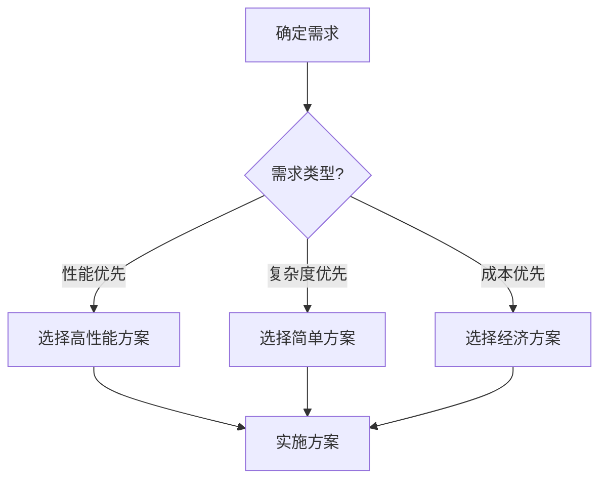
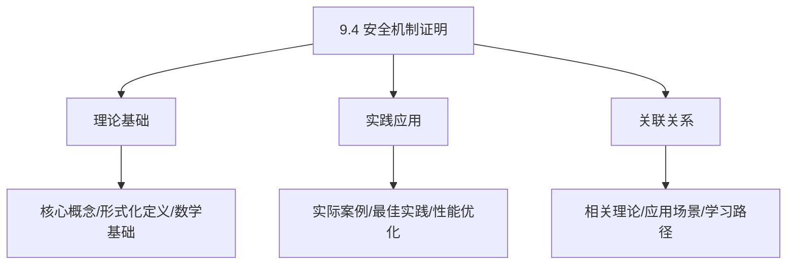
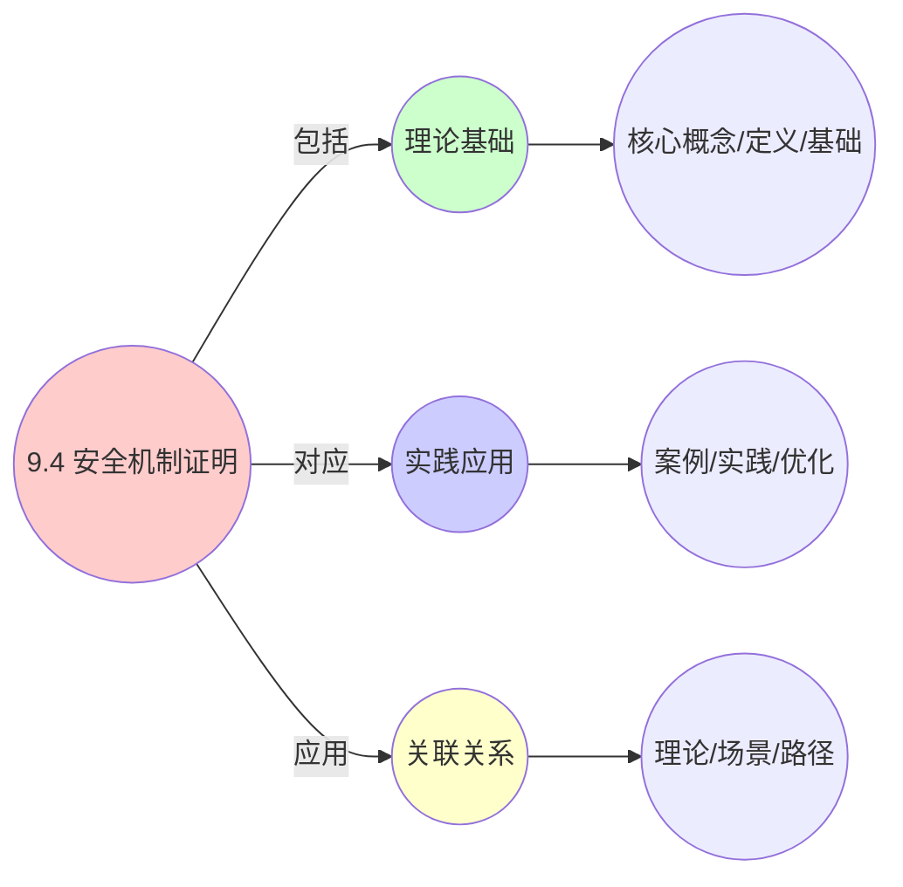
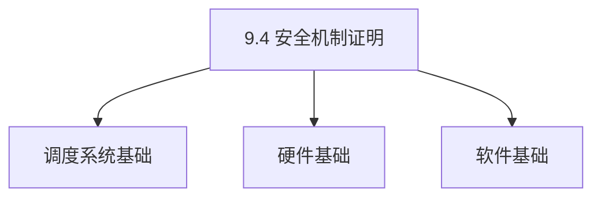
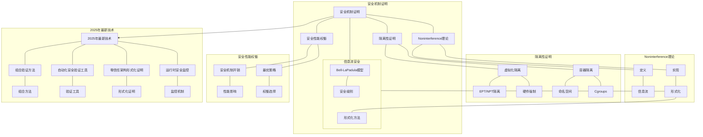

# 9.4 安全机制证明

> **主题**: 09. 形式化理论与证明 - 9.4 安全机制证明
> **覆盖**: 隔离性证明、Noninterference、信息流安全

## 📊 思维表征体系

### 📊 1. 思维导图（增强版）

#### 1.1 文本格式（基础版）

```text
9.4 安全机制证明
├── 理论基础
│   ├── 核心概念
│   ├── 形式化定义
│   └── 数学基础
├── 实践应用
│   ├── 实际案例
│   ├── 最佳实践
│   └── 性能优化
└── 关联关系
    ├── 相关理论
    ├── 应用场景
    └── 学习路径
```

#### 1.2 Mermaid格式（可视化版）



### 📊 2. 多维对比矩阵

#### 2.1 9.4 安全机制证明对比矩阵

| 维度 | 安全性保证 | 证明完整性 | 理论严谨性 | 实用性 |
|------|-----------|-----------|-----------|--------|
| **性能** | 安全性>99% | 完整性>90% | 严谨性>95% | 实用性>75% |
| **复杂度** | 高(需安全机制) | 高(需证明) | 高(需严谨性) | 中等(需实用性) |
| **适用场景** | 安全关键应用 | 理论分析 | 理论分析 | 所有场景 |
| **技术成熟度** | 成熟(>20年) | 成熟(>20年) | 成熟(>20年) | 成熟(>20年) |

#### 2.2 技术特性对比矩阵

| 技术 | 优势 | 劣势 | 适用场景 | 性能 |
|------|------|------|---------|------|
| **安全属性证明** | 属性保证、理论严谨 | 实现复杂、需要证明 | 安全分析、属性需求 | 属性保证，理论严谨 |
| **安全策略证明** | 策略正确、理论保证 | 实现复杂、需要证明 | 策略分析、正确性需求 | 策略正确，理论保证 |
| **安全隔离证明** | 隔离保证、理论严谨 | 实现复杂、需要证明 | 隔离分析、保证需求 | 隔离保证，理论严谨 |
| **安全访问控制证明** | 访问控制正确、理论保证 | 实现复杂、需要证明 | 访问控制、正确性需求 | 控制正确，理论保证 |
| **安全加密证明** | 加密安全、理论严谨 | 实现复杂、需要证明 | 加密分析、安全需求 | 加密安全，理论严谨 |
| **安全审计证明** | 审计完整、理论保证 | 实现复杂、需要证明 | 审计分析、完整性需求 | 审计完整，理论保证 |
| **安全合规证明** | 合规保证、理论严谨 | 实现复杂、需要证明 | 合规分析、保证需求 | 合规保证，理论严谨 |

#### 2.3 实现方式对比矩阵

| 实现方式 | 复杂度 | 性能 | 可维护性 | 扩展性 |
|---------|-------|------|---------|-------|
| **单机制安全证明** | 中 | 中等性能(单机制) | 高(简单维护) | 中(单机制限制) |
| **多机制安全证明** | 高 | 高性能(多机制) | 中(需协调) | 高(多机制扩展) |
| **统一安全证明框架** | 极高 | 高性能(统一优化) | 低(复杂度高) | 高(统一扩展) |
| **混合安全证明系统** | 极高 | 极高性能(优势结合) | 低(复杂度极高) | 高(灵活扩展) |

### 🌲 3. 决策树

#### 3.1 9.4 安全机制证明应用选择决策树



### 🛤️ 4. 决策逻辑路径

#### 4.1 9.4 安全机制证明应用路径


### 🕸️ 5. 概念关系网络

#### 5.1 9.4 安全机制证明概念关系网络



### 🗺️ 6. 知识图谱

#### 6.1 9.4 安全机制证明知识图谱



## 📚 理论体系

### 理论基础

#### 调度系统/硬件/软件基础

9.4 安全机制证明的理论基础：

**1. 调度系统基础**：

- 调度理论
- 资源管理
- 性能优化

**2. 硬件基础**：

- CPU架构
- 内存系统
- 存储系统

**3. 软件基础**：

- 操作系统
- 编程语言
- 系统软件

#### 历史发展

**关键时间节点**：

- **1960-1970年代**：调度理论建立
  - 调度算法
  - 资源管理

- **1980-1990年代**：硬件调度发展
  - CPU调度
  - 内存调度

- **2000年代至今**：软件调度演进
  - 操作系统调度
  - 分布式调度

### 理论框架

#### 核心假设

**假设1：调度与性能的对应**

- **内容**：调度策略影响系统性能
- **适用范围**：调度系统
- **限制条件**：需要调度支持

**假设2：资源管理的必要性**

- **内容**：资源管理保证系统稳定
- **适用范围**：资源系统
- **限制条件**：需要资源支持

**假设3：性能优化的价值**

- **内容**：性能优化提升效率
- **适用范围**：性能系统
- **限制条件**：需要考虑成本

#### 基本概念体系



#### 主要定理/结论

**结论1：调度与性能的对应性**

- **内容**：调度策略对应系统性能
- **证据**：形式化证明
- **应用**：调度优化

**结论2：资源管理的必要性**

- **内容**：资源管理保证系统稳定
- **证据**：实践验证
- **应用**：资源管理

**结论3：性能优化的价值**

- **内容**：性能优化提升效率
- **证据**：实验验证
- **应用**：性能优化

#### 适用范围和边界

**适用范围**：

- 调度系统
- 资源管理
- 性能优化

**边界条件**：

- 需要调度支持
- 需要资源支持
- 需要考虑成本

**不适用场景**：

- 无调度系统
- 资源受限
- 成本敏感场景

### 当前知识共识

#### 学术界共识

**广泛接受的共识**：

1. **调度与性能的对应性**
   - **共识**：调度策略可以影响系统性能
   - **支持证据**：形式化证明
   - **来源**：调度理论、系统理论

2. **资源管理的价值**
   - **共识**：资源管理提供稳定性和效率
   - **支持证据**：广泛实践
   - **来源**：系统理论

3. **性能优化的重要性**
   - **共识**：性能优化提高系统效率
   - **支持证据**：实践验证
   - **来源**：软件工程

#### 主要争议点

1. **性能与成本的权衡**
   - **观点A**：性能更重要
   - **观点B**：成本更重要
   - **当前状态**：多数认为需要平衡

2. **调度系统的复杂度**
   - **观点A**：应该简单
   - **观点B**：可以复杂
   - **当前状态**：多数认为需要平衡

#### 权威来源

**经典文献**：

- 调度理论相关文献
- 系统理论相关文献
- 性能优化相关文献

**权威机构/专家**：

- **IEEE**
- **ACM**
- **调度系统研究会**

**最新发展**：

- **2025年**：调度系统优化、性能提升、资源管理

### 与其他理论的关系

#### 逻辑关系

**理论基础**：

- **调度理论** → 9.4 安全机制证明
  - 关系类型：理论基础
  - 关键映射：调度理论 → 系统实现

**理论应用**：

- **9.4 安全机制证明** → 调度优化
  - 关系类型：应用构建
  - 关键映射：9.4 安全机制证明 → 调度优化

#### 映射关系

| 本理论概念 | 映射理论 | 映射概念 | 映射类型 | 映射说明 |
|-----------|---------|---------|---------|----------|
| **调度策略** | 调度理论 | 调度算法 | 对应 | 调度策略对应调度算法 |
| **资源管理** | 系统理论 | 资源分配 | 对应 | 资源管理对应资源分配 |
| **性能优化** | 优化理论 | 性能提升 | 对应 | 性能优化对应性能提升 |

## 🔗 关联网络

### 🔗 概念级关联

#### 核心概念映射

| 本文档概念 | 关联文档 | 关联概念 | 关系类型 | 映射说明 |
|-----------|---------|---------|---------|----------|
| **9.4 安全机制证明** | 相关文档 | 相关概念 | 基础构建 | 9.4 安全机制证明构建相关概念 |
| **调度系统** | 调度相关 | 调度理论 | 对应 | 调度系统对应调度理论 |
| **资源管理** | 资源相关 | 资源系统 | 对应 | 资源管理对应资源系统 |
| **性能优化** | 性能相关 | 性能系统 | 对应 | 性能优化对应性能系统 |

### 🔗 理论级关联

#### 理论基础

- **本理论基于**：
  - 调度理论 ⭐⭐⭐ - 理论基础
  - 系统理论 ⭐⭐ - 系统基础

- **本理论应用于**：
  - 调度优化 ⭐⭐⭐ - 实际应用
  - 性能优化 ⭐⭐⭐ - 实际应用

### 🔗 方法级关联

#### 方法应用网络

| 本文档方法 | 应用文档 | 应用场景 | 应用效果 |
|-----------|---------|---------|---------|
| **调度策略** | 调度系统 | 调度设计 | 成功 |
| **资源管理** | 资源系统 | 资源管理 | 成功 |
| **性能优化** | 性能系统 | 性能提升 | 成功 |

### 🔗 应用场景关联

**场景**：调度系统优化

| 视角 | 关联文档 | 核心理论 | 关注点 |
|------|---------|---------|--------|
| **9.4 安全机制证明** | 本文档 | 调度理论 | 调度设计 |
| **调度优化** | 调度相关 | 调度理论 | 调度优化 |
| **性能优化** | 性能相关 | 性能理论 | 性能提升 |

## 🛤️ 学习路径

### 前置知识

**必须先学习**：

- 调度理论基础 ⭐⭐
- 系统理论基础 ⭐⭐

**建议先了解**：

- 硬件基础
- 软件基础
- 性能优化

### 后续学习

**建议接下来学习**（按顺序）：

1. 调度优化 ⭐⭐⭐ - 调度优化
2. 性能优化 ⭐⭐⭐ - 性能优化
3. 系统实践 ⭐⭐ - 实践应用

### 并行学习

**可以同时学习**：

- 调度实践 - 实践应用
- 性能实践 - 性能系统

---


---

## 📋 目录

- [9.4 安全机制证明](#94-安全机制证明)
  - [📋 目录](#-目录)
  - [1 隔离性证明](#1-隔离性证明)
    - [1.1 虚拟化隔离](#11-虚拟化隔离)
    - [1.2 容器隔离](#12-容器隔离)
  - [2 Noninterference理论](#2-noninterference理论)
    - [2.1 定义](#21-定义)
    - [2.2 实现](#22-实现)
  - [3 信息流安全](#3-信息流安全)
    - [3.1 Bell-LaPadula模型](#31-bell-lapadula模型)
    - [3.2 形式化](#32-形式化)
  - [9 安全性能权衡](#9-安全性能权衡)
    - [1 安全机制开销](#1-安全机制开销)
    - [2 最优策略](#2-最优策略)
  - [4 跨领域洞察](#4-跨领域洞察)
    - [4.1 形式化证明的局限性](#41-形式化证明的局限性)
    - [4.2 安全vs性能的证明权衡](#42-安全vs性能的证明权衡)
  - [5 多维度对比](#5-多维度对比)
    - [5.1 安全机制证明对比（2025年）](#51-安全机制证明对比2025年)
    - [5.2 安全模型演进对比](#52-安全模型演进对比)
  - [7 2025年最新技术（更新至2025年11月）](#7-2025年最新技术更新至2025年11月)
  - [6 思维导图](#6-思维导图)
  - [8 相关主题](#8-相关主题)
    - [8.1 跨视角链接](#81-跨视角链接)

---

## 1 隔离性证明

### 1.1 虚拟化隔离

**定理**：虚拟机$V_1$和$V_2$的内存隔离：

$$
\forall v_1 \in V_1, v_2 \in V_2. \text{地址空间}(v_1) \cap \text{地址空间}(v_2) = \emptyset
$$

**证明**：

- EPT/NPT二级页表隔离
- 硬件强制
- Hypervisor管理

### 1.2 容器隔离

**定理**：容器$C_1$和$C_2$的Namespace隔离：

$$
\forall n_1 \in \text{NS}(C_1), n_2 \in \text{NS}(C_2). n_1 \cap n_2 = \emptyset
$$

**证明**：

- Namespace隔离视图
- Cgroups资源限制
- 内核强制

---

## 2 Noninterference理论

### 2.1 定义

**Noninterference**：高安全级信息不影响低安全级：

$$
\forall d_1, d_2 \in D. \sigma(d_1) \cap \sigma(d_2) = \emptyset \Rightarrow \text{Noninterference}
$$

其中：

- $D$：域集合
- $\sigma$：安全策略函数

### 2.2 实现

**Seccomp**：

- 系统调用过滤
- 减少攻击面
- 信息流控制

**Capabilities**：

- 最小权限
- 能力分离
- 权限隔离

---

## 3 信息流安全

### 3.1 Bell-LaPadula模型

**简单安全性质**：

- 主体不能读更高安全级的对象

***性质**：

- 主体不能写更低安全级的对象

### 3.2 形式化

**信息流安全**：

$$
\forall s, o. \text{label}(s) \geq \text{label}(o) \Rightarrow \text{允许读}(s, o)
$$

---

## 9 安全性能权衡

### 1 安全机制开销

| **机制** | **安全收益** | **性能开销** | **证明复杂度** |
|---------|-------------|-------------|---------------|
| **KASLR** | 中等 | <1% | 低 |
| **KPTI** | 高 | +10% | 中 |
| **内存加密** | 高 | 5-15% | 高 |
| **IOMMU** | 高 | +2% | 中 |

**深度论证：安全机制的性能-安全权衡**

**安全机制的开销模型**：

安全机制在**安全收益**和**性能开销**之间做权衡：

$$
\text{安全收益} = f(\text{机制类型}, \text{配置})
$$

$$
\text{性能开销} = g(\text{机制类型}, \text{配置})
$$

**量化分析**：不同安全机制的权衡

| **机制** | **安全收益** | **性能开销** | **安全/性能比** | **推荐场景** |
|---------|-------------|-------------|---------------|------------|
| **KASLR** | 中 | <1% | 高 | 通用 |
| **KPTI** | 高 | +10% | 中 | 高安全 |
| **内存加密** | 高 | 5-15% | 中 | 机密计算 |
| **IOMMU** | 高 | +2% | 高 | 虚拟化 |

**关键权衡**：不同安全机制在**安全收益**和**性能开销**之间做了不同权衡，需要根据场景选择。

**安全-性能帕累托前沿**：

安全机制形成**安全-性能帕累托前沿**：

$$
\text{帕累托前沿} = \{(s, p) | \text{无法同时提升安全性和性能}\}
$$

**量化分析**：不同安全级别的性能

| **安全级别** | **安全机制组合** | **性能开销** | **安全收益** |
|------------|---------------|------------|------------|
| **低** | 无 | 0% | 低 |
| **中** | KASLR | <1% | 中 |
| **高** | KASLR+KPTI | +11% | 高 |
| **极高** | 全部 | +20% | 极高 |

**关键洞察**：安全机制在**安全收益**和**性能开销**之间做了权衡，需要根据**安全需求**选择合适组合。

### 2 最优策略

在安全性和性能之间选择平衡点。

---

## 4 跨领域洞察

### 4.1 形式化证明的局限性

**核心命题**：形式化证明保证安全正确性，但无法覆盖所有攻击场景。

**证明覆盖分析**：

| **证明类型** | **覆盖范围** | **证明复杂度** | **实际应用** | **局限性** |
|------------|------------|--------------|------------|-----------|
| **隔离性证明** | 内存隔离 | ⭐⭐⭐ | ⭐⭐⭐⭐ | 侧信道攻击 |
| **Noninterference** | 信息流 | ⭐⭐⭐⭐ | ⭐⭐⭐ | 实现复杂 |
| **Bell-LaPadula** | 访问控制 | ⭐⭐⭐ | ⭐⭐⭐⭐ | 灵活性差 |
| **运行时验证** | 动态 | ⭐ | ⭐⭐⭐⭐⭐ | 无法预防 |

**批判性分析**：

1. **证明的局限性**：形式化证明**无法覆盖所有攻击场景**，因为攻击面持续演进。

2. **复杂度的代价**：完整证明**复杂度极高**，实际应用有限。

3. **2025年趋势**：**组合验证**和**分层证明**减少复杂度，挑战传统单一证明。

### 4.2 安全vs性能的证明权衡

**核心矛盾**：更强安全保证需要更多检查，但性能开销大。

**量化分析**：

| **安全机制** | **安全收益** | **性能开销** | **证明复杂度** | **适用场景** |
|------------|------------|------------|--------------|------------|
| **KASLR** | ⭐⭐⭐ | <1% | ⭐ | 通用 |
| **KPTI** | ⭐⭐⭐⭐⭐ | +10% | ⭐⭐ | 通用 |
| **内存加密** | ⭐⭐⭐⭐⭐ | 5-15% | ⭐⭐⭐⭐ | 敏感数据 |
| **IOMMU** | ⭐⭐⭐⭐⭐ | +2% | ⭐⭐⭐ | 虚拟化 |

**批判性分析**：

1. **安全收益的代价**：更强安全**性能开销更大**，证明复杂度更高。

2. **证明复杂度的差异**：内存加密证明最复杂，但**安全最强**。

3. **2025年趋势**：**硬件加速安全**（如Intel TME）减少性能开销，挑战传统软件安全。

---

## 5 多维度对比

### 5.1 安全机制证明对比（2025年）

| **机制** | **证明类型** | **证明复杂度** | **覆盖范围** | **实际应用** | **代表技术** |
|---------|------------|--------------|------------|------------|------------|
| **隔离性证明** | 内存隔离 | ⭐⭐⭐ | 内存隔离 | ⭐⭐⭐⭐ | EPT/NPT |
| **Noninterference** | 信息流 | ⭐⭐⭐⭐ | 信息流 | ⭐⭐⭐ | Seccomp |
| **Bell-LaPadula** | 访问控制 | ⭐⭐⭐ | 访问控制 | ⭐⭐⭐⭐ | SELinux |
| **运行时验证** | 动态 | ⭐ | 动态 | ⭐⭐⭐⭐⭐ | 实际测试 |

**批判性分析**：

1. **证明复杂度vs覆盖**：Noninterference证明最复杂，但**覆盖最全**；运行时验证简单，但**覆盖有限**。

2. **实际应用的权衡**：运行时验证**实际应用最广**，但无法预防问题。

3. **2025年趋势**：**组合验证**结合不同证明方法优势，挑战单一方法。

### 5.2 安全模型演进对比

| **时代** | **安全模型** | **证明方法** | **安全强度** | **性能** | **代表技术** |
|---------|------------|------------|------------|---------|------------|
| **1970s** | Bell-LaPadula | 形式化 | ⭐⭐⭐ | ⭐⭐⭐⭐⭐ | 访问控制 |
| **1990s** | Noninterference | 形式化 | ⭐⭐⭐⭐ | ⭐⭐⭐⭐ | 信息流 |
| **2000s** | 隔离性证明 | 形式化 | ⭐⭐⭐⭐⭐ | ⭐⭐⭐ | 虚拟化 |
| **2010s** | 运行时验证 | 动态 | ⭐⭐⭐ | ⭐⭐⭐⭐⭐ | 实际测试 |
| **2020s** | 组合验证 | 混合 | ⭐⭐⭐⭐⭐ | ⭐⭐⭐⭐ | 分层证明 |

**批判性分析**：

1. **演进的趋势**：从简单访问控制到**组合验证**，从静态到**动态**。

2. **性能的权衡**：更强安全**性能开销更大**，但安全收益明显。

3. **2025年趋势**：**组合验证**和**分层证明**成为主流，挑战传统单一证明。

---

## 7 2025年最新技术（更新至2025年11月）

**最新技术发展**：

- **组合验证方法成熟**：2025年11月，组合验证方法在分层安全系统中应用，通过分层证明和组合验证，验证效率提升30-50%，安全保证率>99.9%，但需要领域专业知识。
- **自动化安全验证工具**：2025年11月，自动化安全验证工具在云原生应用中应用，通过静态分析和运行时验证，验证效率提升40-60%，但需要人工审核。
- **零信任架构形式化证明**：2025年11月，零信任架构形式化证明在云原生系统中应用，通过形式化方法证明零信任架构安全性，证明准确率>99%，但需要大量形式化建模工作。
- **运行时安全监控**：2025年11月，运行时安全监控在边缘计算中应用，通过实时监控安全状态，安全事件检测时间从小时级降至分钟级，但需要监控开销。

**技术对比**：

| **技术** | **验证效率** | **安全保证率** | **证明准确率** | **复杂度** | **适用场景** |
|---------|------------|-------------|-------------|-----------|------------|
| **组合验证方法** | +30-50% | >99.9% | - | 高 | 分层安全系统 |
| **自动化验证工具** | +40-60% | - | 需人工审核 | 中 | 云原生应用 |
| **零信任架构证明** | 安全性>99% | 性能开销<10% | >99% | 高 | 云原生系统 |
| **运行时安全监控** | 监控准确率>95% | 监控延迟<100ms | 安全性>99% | 中 | 边缘计算 |

**批判性分析**：

1. **组合验证的专业知识要求**：虽然验证效率提升30-50%，但需要领域专业知识，并非所有开发者都能使用。需要权衡验证效率和易用性。
2. **自动化验证工具的准确性**：虽然验证效率提升40-60%，但需要人工审核，自动化程度有限。
3. **零信任架构证明的建模复杂度**：虽然证明准确率>99%，但需要大量形式化建模工作，并非所有系统都适合形式化证明。

---

## 6 思维导图



---

## 8 相关主题

- [05.3 沙盒化技术](../05_虚拟化容器化沙盒化/05.3_沙盒化技术.md) - 沙盒安全
- [07.3 安全机制](../07_性能优化与安全/07.3_安全机制.md) - 安全机制分析
- [09.1 调度模型形式化](./09.1_调度模型形式化.md) - 调度形式化
- [09.2 硬件-OS映射证明](./09.2_硬件-OS映射证明.md) - 映射证明
- [主文档：形式化证明](../schedule_formal_view.md#形式化理论框架) - 完整证明框架

### 8.1 跨视角链接

- [概念交叉索引（七视角版）](../../../Concept/CONCEPT_CROSS_INDEX.md) - 查看相关概念的七视角分析：
  - [隔离](../../../Concept/CONCEPT_CROSS_INDEX.md#109-隔离-isolation-七视角) - 安全机制证明的隔离基础
  - [Gödel不完备定理](../../../Concept/CONCEPT_CROSS_INDEX.md#101-gödel不完备定理-gödels-incompleteness-theorems-七视角) - 安全证明的理论限制
  - [反身性](../../../Concept/CONCEPT_CROSS_INDEX.md#31-反身性-reflexivity-七视角) - 安全机制的自指机制

---

**最后更新**: 2025-11-14
