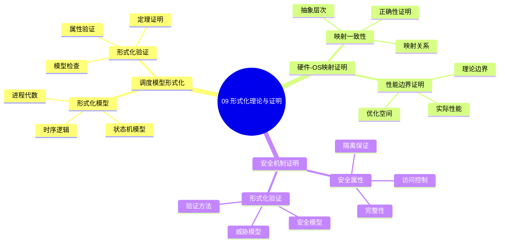

# 09. 形式化理论与证明

> **主题**: 形式化理论与证明
> **覆盖范围**: 调度模型形式化、硬件-OS映射证明、性能边界证明

---

## 📋 目录

- [09. 形式化理论与证明](#09-形式化理论与证明)
  - [📋 目录](#-目录)
  - [1 子主题索引](#1-子主题索引)
    - [1.0 形式化理论与证明思维导图](#10-形式化理论与证明思维导图)
  - [2 相关主题](#2-相关主题)
  - [3 核心概念矩阵](#3-核心概念矩阵)

---

## 1 子主题索引

### 1.0 形式化理论与证明思维导图

**可视化文档**: 查看 [思维导图与知识矩阵](../思维导图与知识矩阵.md#39-09-形式化理论与证明) 获取更详细的思维导图。

- [9.1 调度模型形式化](./09.1_调度模型形式化.md) - CFS公平性证明、实时调度可调度性
- [9.2 硬件-OS映射证明](./09.2_硬件-OS映射证明.md) - 地址转换正确性、DMA一致性
- [9.3 性能边界证明](./09.3_性能边界证明.md) - 延迟下界、带宽上界
- [9.4 安全机制证明](./09.4_安全机制证明.md) - 隔离性证明、Noninterference

---

## 2 相关主题

- [06. 调度模型](../06_调度模型/README.md) - 调度理论
- [07. 性能优化与安全](../07_性能优化与安全/README.md) - 性能边界

---

## 3 核心概念矩阵

| **证明类型** | **工具** | **对象** | **结论** |
|-------------|---------|---------|---------|
| **公平性** | 势函数 | CFS调度器 | O(log n)最优 |
| **可调度性** | 响应时间分析 | 实时任务 | EDF最优 |
| **一致性** | 线性化 | 无锁队列 | 线性一致性 |
| **安全性** | Noninterference | 隔离机制 | 信息流安全 |

---

**最后更新**: 2025-11-14
