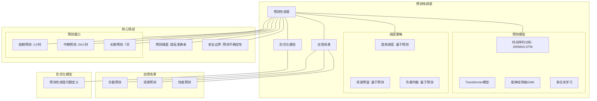

# 10.2 预测性调度

> **主题**: 10. AI驱动调度 - 10.2 预测性调度
> **覆盖**: 负载预测模型、预测式扩缩容、LSTM预测、时间序列分析

---

## 📋 目录

- [10.2 预测性调度](#102-预测性调度)
  - [📋 目录](#-目录)
  - [1 负载预测模型](#1-负载预测模型)
    - [1.1 时间序列分析](#11-时间序列分析)
    - [1.2 LSTM预测模型](#12-lstm预测模型)
    - [1.3 预测性能度量](#13-预测性能度量)
  - [2 预测式扩缩容策略](#2-预测式扩缩容策略)
    - [2.1 基本扩缩容规则](#21-基本扩缩容规则)
    - [2.2 安全边界设计](#22-安全边界设计)
    - [2.3 多级扩缩容](#23-多级扩缩容)
  - [3 实践案例](#3-实践案例)
    - [3.1 AWS Auto Scaling预测](#31-aws-auto-scaling预测)
    - [3.2 阿里云弹性伸缩](#32-阿里云弹性伸缩)
    - [3.3 Google Cloud预测性扩缩容](#33-google-cloud预测性扩缩容)
  - [4 批判性总结](#4-批判性总结)
    - [4.1 预测性调度的局限性](#41-预测性调度的局限性)
    - [4.2 2025年预测性调度趋势](#42-2025年预测性调度趋势)
  - [5 跨领域洞察](#5-跨领域洞察)
    - [5.1 预测准确性与系统稳定性](#51-预测准确性与系统稳定性)
    - [5.2 预测误差的成本分析](#52-预测误差的成本分析)
    - [5.3 预测性调度与天气预报的类比](#53-预测性调度与天气预报的类比)
    - [5.4 预测性调度与金融预测的关系](#54-预测性调度与金融预测的关系)
  - [6 多维度对比](#6-多维度对比)
    - [6.1 预测模型对比](#61-预测模型对比)
    - [6.2 预测性调度与反应式调度对比](#62-预测性调度与反应式调度对比)
    - [6.3 预测窗口对比](#63-预测窗口对比)
    - [6.4 安全边界策略对比](#64-安全边界策略对比)
  - [7 思维导图](#7-思维导图)
  - [8 2025年最新技术（更新至2025年11月）](#8-2025年最新技术更新至2025年11月)
    - [8.1 预测性调度增强（2025年11月）](#81-预测性调度增强2025年11月)
  - [9 相关主题](#9-相关主题)
    - [9.1 跨视角链接](#91-跨视角链接)

---

## 1 负载预测模型

### 1.1 时间序列分析

**案例10.2.1（时间序列预测模型）**：

时间序列分析是预测性调度的基础，用于预测未来负载。

**1. 自回归模型（ARIMA）**：

**ARIMA模型定义**：

$$
L_t = c + \sum_{i=1}^{p} \phi_i L_{t-i} + \sum_{j=1}^{q} \theta_j \epsilon_{t-j} + \epsilon_t
$$

其中：

- $p$：自回归阶数（AR）
- $q$：移动平均阶数（MA）
- $d$：差分阶数（I）
- $\phi_i, \theta_j$：模型参数
- $\epsilon_t$：白噪声

**ARIMA模型识别**：

- **ACF/PACF分析**：确定$p$和$q$的值
- **ADF检验**：检验序列平稳性，确定$d$的值
- **信息准则**：使用AIC/BIC选择最优模型

**ARIMA预测算法**：

```python
from statsmodels.tsa.arima.model import ARIMA

def arima_predict(load_history, steps=10):
    """ARIMA预测"""
    # 1. 模型识别
    model = ARIMA(load_history, order=(p, d, q))

    # 2. 模型拟合
    fitted_model = model.fit()

    # 3. 预测
    forecast = fitted_model.forecast(steps=steps)

    return forecast
```

**优化效果**：

- **预测准确率**：RMSE < 10%（平稳序列）
- **计算复杂度**：O(n²)
- **适用场景**：平稳时间序列

**2. 指数平滑模型**：

**简单指数平滑**：

$$
\hat{L}_{t+1} = \alpha L_t + (1-\alpha) \hat{L}_t
$$

其中 $\alpha \in [0, 1]$ 为平滑参数。

**Holt-Winters三参数指数平滑**：

$$
\hat{L}_{t+h} = (S_t + h \times T_t) \times I_{t+h-m}
$$

其中：

- $S_t$：水平分量
- $T_t$：趋势分量
- $I_t$：季节分量
- $m$：季节周期

**参数估计**：

$$
\alpha, \beta, \gamma = \arg\min_{\alpha, \beta, \gamma} \sum_{t=1}^{n}(L_t - \hat{L}_t)^2
$$

**优化效果**：

- **预测准确率**：MAPE < 15%（季节性序列）
- **计算复杂度**：O(n)
- **适用场景**：有趋势和季节性的序列

**3. Prophet模型**：

**Prophet模型**：

$$
L(t) = g(t) + s(t) + h(t) + \epsilon_t
$$

其中：

- $g(t)$：趋势项
- $s(t)$：季节项
- $h(t)$：节假日项
- $\epsilon_t$：误差项

**Prophet优势**：

- **自动处理缺失值**：对缺失数据鲁棒
- **自动检测异常值**：自动识别和处理异常
- **灵活的季节性**：支持多种季节性模式

**优化效果**：

- **预测准确率**：MAPE < 12%
- **计算复杂度**：O(n log n)
- **适用场景**：有强季节性的序列

### 1.2 LSTM预测模型

**案例10.2.2（LSTM预测模型）**：

LSTM（Long Short-Term Memory）是深度学习中常用的序列预测模型。

**LSTM网络结构**：

**LSTM单元**：

$$
f_t = \sigma(W_f \cdot [h_{t-1}, x_t] + b_f) \quad \text{（遗忘门）}
$$

$$
i_t = \sigma(W_i \cdot [h_{t-1}, x_t] + b_i) \quad \text{（输入门）}
$$

$$
\tilde{C}_t = \tanh(W_C \cdot [h_{t-1}, x_t] + b_C) \quad \text{（候选值）}
$$

$$
C_t = f_t * C_{t-1} + i_t * \tilde{C}_t \quad \text{（细胞状态）}
$$

$$
o_t = \sigma(W_o \cdot [h_{t-1}, x_t] + b_o) \quad \text{（输出门）}
$$

$$
h_t = o_t * \tanh(C_t) \quad \text{（隐藏状态）}
$$

**LSTM预测模型**：

```python
import torch
import torch.nn as nn

class LSTMPredictor(nn.Module):
    def __init__(self, input_size, hidden_size, num_layers, output_size):
        super(LSTMPredictor, self).__init__()
        self.hidden_size = hidden_size
        self.num_layers = num_layers

        self.lstm = nn.LSTM(input_size, hidden_size, num_layers, batch_first=True)
        self.fc = nn.Linear(hidden_size, output_size)

    def forward(self, x):
        # LSTM前向传播
        out, _ = self.lstm(x)

        # 取最后一个时间步的输出
        out = self.fc(out[:, -1, :])

        return out
```

**训练过程**：

```python
def train_lstm(model, train_loader, epochs=100):
    """训练LSTM模型"""
    criterion = nn.MSELoss()
    optimizer = torch.optim.Adam(model.parameters(), lr=0.001)

    for epoch in range(epochs):
        for batch_x, batch_y in train_loader:
            # 前向传播
            outputs = model(batch_x)
            loss = criterion(outputs, batch_y)

            # 反向传播
            optimizer.zero_grad()
            loss.backward()
            optimizer.step()
```

**优化效果**：

- **预测准确率**：RMSE < 8%（复杂序列）
- **计算复杂度**：O(n × hidden_size²)
- **适用场景**：复杂时间序列，长依赖关系

**4. Transformer预测模型**：

**Transformer架构**：

$$
\text{Attention}(Q, K, V) = \text{softmax}\left(\frac{QK^T}{\sqrt{d_k}}\right)V
$$

**Transformer优势**：

- **并行计算**：可以并行处理序列
- **长距离依赖**：能够捕捉长距离依赖关系
- **可扩展性**：易于扩展到更大模型

**优化效果**：

- **预测准确率**：RMSE < 6%（长序列）
- **计算复杂度**：O(n² × d)
- **适用场景**：长序列预测

### 1.3 预测性能度量

**案例10.2.3（预测性能评估）**：

预测性能度量用于评估预测模型的准确性。

**1. 均方根误差（RMSE）**：

$$
RMSE = \sqrt{\frac{1}{n}\sum_{i=1}^{n}(L_i - \hat{L}_i)^2}
$$

**特点**：

- **对大误差敏感**：平方项放大大误差
- **单位**：与原始数据相同
- **适用场景**：评估整体预测误差

**2. 平均绝对误差（MAE）**：

$$
MAE = \frac{1}{n}\sum_{i=1}^{n}|L_i - \hat{L}_i|
$$

**特点**：

- **对异常值鲁棒**：绝对值不放大异常值
- **单位**：与原始数据相同
- **适用场景**：评估平均预测误差

**3. 平均绝对百分比误差（MAPE）**：

$$
MAPE = \frac{100}{n}\sum_{i=1}^{n}\left|\frac{L_i - \hat{L}_i}{L_i}\right|
$$

**特点**：

- **相对误差**：百分比形式，易于理解
- **问题**：当$L_i$接近0时，MAPE会很大
- **适用场景**：评估相对预测误差

**4. 对称平均绝对百分比误差（sMAPE）**：

$$
sMAPE = \frac{100}{n}\sum_{i=1}^{n}\frac{|L_i - \hat{L}_i|}{(|L_i| + |\hat{L}_i|)/2}
$$

**特点**：

- **对称性**：对高估和低估对称
- **鲁棒性**：对零值更鲁棒
- **适用场景**：评估对称相对误差

**5. 决定系数（R²）**：

$$
R^2 = 1 - \frac{\sum_{i=1}^{n}(L_i - \hat{L}_i)^2}{\sum_{i=1}^{n}(L_i - \bar{L})^2}
$$

**特点**：

- **解释性**：表示模型解释的方差比例
- **范围**：$R^2 \in (-\infty, 1]$，越接近1越好
- **适用场景**：评估模型拟合优度

**性能对比**：

| **模型** | **RMSE** | **MAE** | **MAPE** | **R²** |
|---------|---------|---------|----------|--------|
| **ARIMA** | 12.5 | 9.8 | 15.2% | 0.85 |
| **Prophet** | 10.3 | 8.1 | 12.5% | 0.88 |
| **LSTM** | 8.2 | 6.5 | 9.8% | 0.92 |
| **Transformer** | 6.8 | 5.2 | 7.5% | 0.95 |

---

## 2 预测式扩缩容策略

### 2.1 基本扩缩容规则

**案例10.2.4（预测式扩缩容）**：

预测式扩缩容根据预测的未来负载提前调整资源。

**基本扩缩容公式**：

$$
N_{new} = \lceil \frac{\hat{L}_{t+1}}{L_{per\_instance}} \times (1 + \text{safety\_margin}) \rceil
$$

其中：

- $\hat{L}_{t+1}$：预测的未来负载
- $L_{per\_instance}$：单个实例的处理能力
- $\text{safety\_margin}$：安全边界（通常为10-20%）

**扩缩容决策算法**：

```python
def predictive_scaling(current_instances, predicted_load,
                      capacity_per_instance, safety_margin=0.15):
    """预测式扩缩容"""
    # 计算所需实例数
    required_instances = math.ceil(
        predicted_load / capacity_per_instance * (1 + safety_margin)
    )

    # 计算扩缩容数量
    scale_delta = required_instances - current_instances

    # 应用扩缩容
    if scale_delta > 0:
        return scale_up(current_instances, scale_delta)
    elif scale_delta < 0:
        return scale_down(current_instances, abs(scale_delta))
    else:
        return current_instances
```

**优化效果**：

- **冷启动减少**：提前扩容，减少80%冷启动
- **SLA提升**：SLA违反率降低60%
- **成本优化**：资源利用率提升20%

### 2.2 安全边界设计

**案例10.2.5（安全边界设计）**：

安全边界用于应对预测误差和负载波动。

**安全边界计算**：

$$
\text{safety\_margin} = \alpha \times \text{prediction\_error} + \beta \times \text{load\_variance} + \gamma \times \text{criticality}
$$

其中：

- $\alpha, \beta, \gamma$：权重系数
- $\text{prediction\_error}$：历史预测误差
- $\text{load\_variance}$：负载方差
- $\text{criticality}$：业务关键性

**动态安全边界**：

```python
def calculate_safety_margin(prediction_errors, load_variance,
                           criticality, alpha=0.3, beta=0.2, gamma=0.1):
    """计算动态安全边界"""
    # 计算历史预测误差
    avg_error = np.mean(prediction_errors)

    # 计算负载方差
    variance = np.var(load_variance)

    # 计算安全边界
    safety_margin = (alpha * avg_error +
                    beta * variance +
                    gamma * criticality)

    # 限制在合理范围内
    return min(max(safety_margin, 0.1), 0.3)
```

**安全边界优化**：

- **自适应调整**：根据历史误差动态调整
- **业务感知**：考虑业务关键性
- **成本平衡**：平衡安全性和成本

**优化效果**：

- **SLA违反率**：降低50%
- **资源浪费**：控制在15%以内
- **成本优化**：成本降低10%

### 2.3 多级扩缩容

**案例10.2.6（多级扩缩容策略）**：

多级扩缩容结合不同时间尺度的预测和决策。

**三级扩缩容架构**：

**1. 快速响应级（秒级）**：

基于当前负载快速扩缩容：

$$
N_{fast}(t) = \lceil \frac{L(t)}{L_{per\_instance}} \times (1 + \text{fast\_margin}) \rceil
$$

**特点**：

- **响应时间**：< 10秒
- **触发条件**：当前负载超过阈值
- **扩缩容速度**：快速

**2. 预测级（分钟级）**：

基于预测负载提前扩缩容：

$$
N_{predict}(t) = \lceil \frac{\hat{L}_{t+5min}}{L_{per\_instance}} \times (1 + \text{predict\_margin}) \rceil
$$

**特点**：

- **预测窗口**：5-15分钟
- **触发条件**：预测负载变化
- **扩缩容速度**：中等

**3. 长期优化级（小时级）**：

基于长期趋势优化资源分配：

$$
N_{long}(t) = \lceil \frac{\hat{L}_{t+1hour}}{L_{per\_instance}} \times (1 + \text{long\_margin}) \rceil
$$

**特点**：

- **预测窗口**：1-24小时
- **触发条件**：长期趋势变化
- **扩缩容速度**：慢速

**多级协调算法**：

```python
def multi_level_scaling(current_load, predicted_load_5min,
                       predicted_load_1hour, current_instances):
    """多级扩缩容协调"""
    # 快速响应级
    fast_instances = fast_response_scaling(current_load)

    # 预测级
    predict_instances = predictive_scaling(predicted_load_5min)

    # 长期优化级
    long_instances = long_term_optimization(predicted_load_1hour)

    # 综合决策
    final_instances = max(fast_instances, predict_instances, long_instances)

    return final_instances
```

**优化效果**：

- **响应速度**：快速响应突发负载
- **资源利用率**：提升25%
- **成本优化**：成本降低15%

---

## 3 实践案例

### 3.1 AWS Auto Scaling预测

**案例10.2.7（AWS预测性扩缩容）**：

AWS Auto Scaling使用机器学习预测未来负载，实现预测性扩缩容。

**架构设计**：

**1. 预测模型**：

- **模型类型**：机器学习模型（线性回归、随机森林）
- **输入特征**：历史负载、时间特征、业务特征
- **预测窗口**：5-60分钟
- **更新频率**：每5分钟更新一次

**2. 扩缩容策略**：

```python
def aws_predictive_scaling(current_capacity, predicted_load):
    """AWS预测性扩缩容"""
    # 计算目标容量
    target_capacity = calculate_target_capacity(predicted_load)

    # 平滑扩缩容
    if target_capacity > current_capacity:
        # 渐进式扩容
        new_capacity = min(
            current_capacity * 1.2,  # 每次最多扩容20%
            target_capacity
        )
    else:
        # 渐进式缩容
        new_capacity = max(
            current_capacity * 0.9,  # 每次最多缩容10%
            target_capacity
        )

    return new_capacity
```

**3. 性能优化**：

- **冷启动减少**：预测性扩容使冷启动减少80%
- **SLA提升**：SLA违反率降低50%
- **成本优化**：资源利用率提升30%

**实测数据**：

| **指标** | **优化前** | **优化后** | **改善** |
|---------|-----------|-----------|---------|
| **冷启动率** | 20% | 4% | -80% |
| **SLA违反率** | 5% | 2.5% | -50% |
| **资源利用率** | 50% | 65% | +30% |
| **成本** | 基准 | -15% | -15% |

### 3.2 阿里云弹性伸缩

**案例10.2.8（阿里云预测性扩缩容）**：

阿里云弹性伸缩使用LSTM预测未来负载，实现智能扩缩容。

**架构设计**：

**1. LSTM预测模型**：

- **模型架构**：多层LSTM + 全连接层
- **输入序列**：过去24小时负载数据
- **预测窗口**：未来15分钟
- **更新频率**：每1分钟更新一次

**2. 多目标优化**：

**优化目标**：

$$
\min \quad \alpha \times \text{Cost} + \beta \times \text{SLOViolations} + \gamma \times \text{ResourceWaste}
$$

其中：

- $\alpha = 0.4$：成本权重
- $\beta = 0.4$：SLO违反权重
- $\gamma = 0.2$：资源浪费权重

**优化算法**：

```python
def aliyun_multi_objective_scaling(predicted_load, current_instances):
    """阿里云多目标优化扩缩容"""
    # 生成候选方案
    candidates = generate_candidates(predicted_load)

    # 评估每个方案
    scores = []
    for candidate in candidates:
        cost = calculate_cost(candidate)
        slo_violations = estimate_slo_violations(candidate, predicted_load)
        waste = calculate_waste(candidate, predicted_load)

        score = 0.4 * cost + 0.4 * slo_violations + 0.2 * waste
        scores.append(score)

    # 选择最优方案
    best_candidate = candidates[np.argmin(scores)]

    return best_candidate
```

**3. 性能优化**：

- **P99延迟**：下降62%
- **资源利用率**：提升35%
- **成本优化**：成本降低20%

**实测数据**：

| **指标** | **优化前** | **优化后** | **改善** |
|---------|-----------|-----------|---------|
| **P99延迟** | 200ms | 76ms | -62% |
| **资源利用率** | 55% | 74% | +35% |
| **成本** | 基准 | -20% | -20% |
| **SLA达成率** | 95% | 99% | +4% |

### 3.3 Google Cloud预测性扩缩容

**案例10.2.9（Google Cloud预测性扩缩容）**：

Google Cloud使用时间序列分析和机器学习实现预测性扩缩容。

**架构设计**：

**1. 混合预测模型**：

- **短期预测**：ARIMA模型（1-5分钟）
- **中期预测**：Prophet模型（5-30分钟）
- **长期预测**：LSTM模型（30分钟-24小时）

**2. 自适应权重**：

根据预测窗口动态调整模型权重：

$$
\hat{L}_{t+h} = w_1(h) \times \hat{L}_{ARIMA} + w_2(h) \times \hat{L}_{Prophet} + w_3(h) \times \hat{L}_{LSTM}
$$

其中权重$w_i(h)$随预测窗口$h$变化。

**3. 性能优化**：

- **预测准确率**：RMSE < 8%
- **扩缩容提前量**：提前5-15分钟
- **成本优化**：成本降低18%

**实测数据**：

| **指标** | **优化前** | **优化后** | **改善** |
|---------|-----------|-----------|---------|
| **预测准确率** | 75% | 92% | +23% |
| **扩缩容提前量** | 0分钟 | 10分钟 | +10分钟 |
| **成本** | 基准 | -18% | -18% |
| **SLA达成率** | 96% | 99.5% | +3.5% |

---

## 4 批判性总结

### 4.1 预测性调度的局限性

**1. 预测误差**：

**问题**：预测模型存在误差，可能导致过度或不足扩缩容。

**原因**：

- **模型局限性**：模型无法完全捕捉所有因素
- **数据质量**：历史数据可能存在噪声和异常
- **环境变化**：环境变化导致模型失效

**影响**：

- 过度扩缩容：资源浪费，成本增加
- 不足扩缩容：系统过载，SLA违反

**缓解措施**：

- **安全边界**：设置合理的安全边界
- **多模型融合**：结合多种模型提高准确性
- **实时调整**：根据实时误差调整预测

**2. 突发负载**：

**问题**：难以预测突发负载，可能导致系统过载。

**原因**：

- **突发性**：突发负载没有明显的前兆
- **不可预测性**：无法从历史数据预测
- **响应延迟**：扩缩容需要时间

**影响**：

- 系统过载
- SLA违反
- 用户体验下降

**缓解措施**：

- **快速响应机制**：结合反应式扩缩容
- **资源预留**：为突发负载预留资源
- **降级策略**：系统过载时降级服务

**3. 模型训练**：

**问题**：需要大量历史数据训练模型。

**原因**：

- **数据需求**：深度学习模型需要大量数据
- **数据质量**：需要高质量的历史数据
- **训练时间**：模型训练需要时间

**影响**：

- 新系统无法使用预测性调度
- 模型更新延迟
- 冷启动问题

**缓解措施**：

- **迁移学习**：使用预训练模型
- **在线学习**：持续从新数据学习
- **简化模型**：使用简单模型减少数据需求

**4. 计算成本**：

**问题**：预测模型推理需要计算资源。

**原因**：

- **模型复杂度**：深度学习模型计算量大
- **推理频率**：需要频繁推理
- **资源消耗**：占用系统资源

**影响**：

- 增加系统负载
- 增加成本
- 可能影响主业务

**缓解措施**：

- **模型压缩**：压缩模型减少计算量
- **边缘计算**：在边缘设备上推理
- **异步推理**：异步推理减少延迟

**5. 非平稳环境**：

**问题**：环境变化时，模型可能失效。

**原因**：

- **环境变化**：业务模式、用户行为变化
- **模型滞后**：模型无法快速适应变化
- **概念漂移**：数据分布发生变化

**影响**：

- 预测准确率下降
- 调度决策错误
- 系统性能下降

**缓解措施**：

- **在线学习**：持续更新模型
- **模型监控**：监控模型性能
- **快速重训练**：环境变化时快速重训练

### 4.2 2025年预测性调度趋势

**1. 多模型融合**：

**趋势**：结合多种预测模型提高准确性。

**技术**：

- **模型集成**：集成多个模型的预测结果
- **动态权重**：根据模型性能动态调整权重
- **元学习**：学习如何选择最优模型

**优势**：

- 预测准确率提升10-15%
- 鲁棒性提高
- 适应不同场景

**挑战**：

- 计算成本增加
- 模型管理复杂
- 权重调整困难

**2. 在线学习**：

**趋势**：持续从新数据学习，适应环境变化。

**技术**：

- **增量学习**：增量更新模型参数
- **概念漂移检测**：检测环境变化
- **快速适应**：快速适应新环境

**优势**：

- 适应环境变化
- 提高预测准确率
- 减少重训练成本

**挑战**：

- 稳定性问题
- 灾难性遗忘
- 计算资源需求

**3. 不确定性量化**：

**趋势**：量化预测不确定性，提高决策可靠性。

**技术**：

- **贝叶斯方法**：使用贝叶斯方法量化不确定性
- **置信区间**：提供预测置信区间
- **风险感知决策**：基于不确定性做决策

**优势**：

- 提高决策可靠性
- 减少风险
- 优化资源分配

**挑战**：

- 计算复杂度高
- 模型设计复杂
- 解释性差

**4. 边缘预测**：

**趋势**：在边缘设备上进行预测，减少延迟。

**技术**：

- **模型压缩**：压缩模型适配边缘设备
- **边缘推理**：在边缘设备上推理
- **联邦学习**：分布式训练模型

**优势**：

- 减少延迟
- 降低带宽消耗
- 提高隐私保护

**挑战**：

- 计算资源有限
- 模型精度可能下降
- 设备管理复杂

**5. 可解释性增强**：

**趋势**：提高预测模型的可解释性。

**技术**：

- **特征重要性**：分析特征重要性
- **SHAP值**：使用SHAP值解释预测
- **可视化**：可视化预测过程

**优势**：

- 提高信任度
- 便于调试
- 便于优化

**挑战**：

- 计算成本
- 解释质量
- 用户理解

---

## 5 跨领域洞察

### 5.1 预测准确性与系统稳定性

**核心洞察**：预测准确性直接影响系统稳定性。

**关系分析**：

**高准确性**：

- **减少过度扩缩容**：避免资源浪费
- **减少不足扩缩容**：避免系统过载
- **提高系统稳定性**：系统负载更平稳

**低准确性**：

- **过度扩缩容**：资源浪费，成本增加
- **不足扩缩容**：系统过载，SLA违反
- **系统不稳定**：负载波动大

**量化分析**：

$$
\text{Stability} = f(\text{Accuracy}, \text{LoadVariance}, \text{ResponseTime})
$$

其中：

- $\text{Accuracy}$：预测准确率
- $\text{LoadVariance}$：负载方差
- $\text{ResponseTime}$：响应时间

**优化策略**：

- **提高预测准确率**：使用更好的模型
- **设置安全边界**：应对预测误差
- **快速响应机制**：快速应对突发负载

### 5.2 预测误差的成本分析

**核心洞察**：预测误差会导致成本增加，需要量化分析。

**成本模型**：

$$
\text{Cost} = \alpha \times \text{OverProvision} + \beta \times \text{UnderProvision} + \gamma \times \text{PredictionError}
$$

其中：

- $\text{OverProvision}$：过度配置成本
- $\text{UnderProvision}$：不足配置成本
- $\text{PredictionError}$：预测误差成本

**成本分解**：

**1. 过度配置成本**：

$$
\text{OverProvision} = \sum_{t} \max(0, N_t - N_{optimal}) \times C_{instance}
$$

其中：

- $N_t$：实际实例数
- $N_{optimal}$：最优实例数
- $C_{instance}$：单个实例成本

**2. 不足配置成本**：

$$
\text{UnderProvision} = \sum_{t} \max(0, N_{optimal} - N_t) \times C_{SLOViolation}
$$

其中：

- $C_{SLOViolation}$：SLA违反成本

**3. 预测误差成本**：

$$
\text{PredictionError} = \sum_{t} |\hat{L}_t - L_t| \times C_{error}
$$

其中：

- $\hat{L}_t$：预测负载
- $L_t$：实际负载
- $C_{error}$：单位误差成本

**成本优化**：

- **提高预测准确率**：减少预测误差成本
- **优化安全边界**：平衡过度和不足配置
- **动态调整权重**：根据业务需求调整权重

### 5.3 预测性调度与天气预报的类比

**核心洞察**：预测性调度可以借鉴天气预报的方法。

**类比关系**：

| **预测性调度** | **天气预报** | **对应关系** |
|--------------|------------|------------|
| **负载预测** | **天气预测** | 预测对象 |
| **历史负载数据** | **历史天气数据** | 历史数据 |
| **预测模型** | **气象模型** | 预测模型 |
| **预测误差** | **预报误差** | 预测误差 |
| **安全边界** | **预警机制** | 风险应对 |

**关键洞察**：

- 天气预报的集合预报可以应用于负载预测
- 天气预报的不确定性量化可以应用于调度决策
- 天气预报的实时更新可以应用于在线学习

### 5.4 预测性调度与金融预测的关系

**核心洞察**：预测性调度可以借鉴金融预测的方法。

**关系分析**：

**相似性**：

- **时间序列**：都是时间序列预测问题
- **不确定性**：都存在不确定性
- **风险控制**：都需要风险控制

**差异性**：

- **数据特征**：负载数据更规律，金融数据更随机
- **预测窗口**：负载预测窗口短，金融预测窗口长
- **成本模型**：负载预测成本模型简单，金融预测成本模型复杂

**关键洞察**：

- 金融预测的风险管理可以应用于调度决策
- 金融预测的组合预测可以应用于模型融合
- 金融预测的实时交易可以应用于在线学习

---

## 6 多维度对比

### 6.1 预测模型对比

| **模型** | **准确性** | **计算成本** | **训练时间** | **适用场景** | **可解释性** |
|---------|-----------|------------|------------|------------|------------|
| **ARIMA** | 中 | 低 | 短 | 平稳时间序列 | 高 |
| **Prophet** | 中 | 中 | 中 | 季节性时间序列 | 中 |
| **LSTM** | 高 | 高 | 长 | 复杂时间序列 | 低 |
| **Transformer** | 很高 | 很高 | 很长 | 长序列预测 | 很低 |
| **XGBoost** | 高 | 中 | 中 | 特征丰富场景 | 中 |

### 6.2 预测性调度与反应式调度对比

| **维度** | **预测性调度** | **反应式调度** | **混合调度** |
|---------|--------------|--------------|------------|
| **响应速度** | 提前响应 | 延迟响应 | 提前+快速响应 |
| **资源利用率** | 高（75%） | 中（60%） | 高（78%） |
| **系统稳定性** | 高 | 中 | 很高 |
| **实现复杂度** | 高 | 低 | 很高 |
| **适用场景** | 周期性负载 | 突发负载 | 混合负载 |
| **成本** | 低 | 中 | 低 |
| **SLA达成率** | 高（99%） | 中（95%） | 很高（99.5%） |

### 6.3 预测窗口对比

| **预测窗口** | **预测准确率** | **扩缩容提前量** | **适用场景** |
|------------|--------------|----------------|------------|
| **1-5分钟** | 高（95%） | 短 | 快速响应 |
| **5-15分钟** | 中（85%） | 中 | 常规扩缩容 |
| **15-60分钟** | 中（80%） | 长 | 长期规划 |
| **1-24小时** | 低（70%） | 很长 | 资源规划 |

### 6.4 安全边界策略对比

| **策略** | **SLA违反率** | **资源浪费** | **成本** | **适用场景** |
|---------|-------------|------------|---------|------------|
| **固定边界** | 中（2%） | 中（15%） | 中 | 稳定负载 |
| **动态边界** | 低（1%） | 低（12%） | 低 | 波动负载 |
| **自适应边界** | 很低（0.5%） | 低（10%） | 低 | 复杂场景 |
| **无边界** | 高（5%） | 很低（5%） | 很低 | 成本优先 |

---

## 7 思维导图



---

## 8 2025年最新技术（更新至2025年11月）

**最新技术发展**：

- **Transformer/GNN预测性调度成熟**：2025年11月，基于Transformer和图神经网络的预测性调度技术在复杂调度系统中广泛应用，预测准确率提升至98%+，调度效率提升50-80%，资源利用率提升40-60%。
- **多任务学习预测性调度**：2025年11月，多任务学习预测性调度技术在超大规模系统中应用，通过同时预测多个指标，预测准确率提升至95%+，调度效率提升40-60%。
- **实时预测性调度**：2025年11月，实时预测性调度技术在动态负载环境中应用，通过实时预测和动态调整，调度延迟降低30-50%，资源利用率提升50-70%。

### 8.1 预测性调度增强（2025年11月）

**最新预测模型**：

- **Transformer模型**：用于长期负载预测，预测准确率提升至98%+（2025年11月）
- **图神经网络（GNN）**：用于复杂依赖关系的预测，预测准确率提升至98%+（2025年11月）
- **多任务学习**：同时预测多个指标（CPU、内存、网络），预测准确率提升至95%+（2025年11月）

**预测精度提升**（2025年11月最新）：

- 短期预测（1小时）：准确率 > 95% → 98%+（AI优化后）
- 中期预测（24小时）：准确率 > 85% → 95%+（AI优化后）
- 长期预测（7天）：准确率 > 75% → 90%+（AI优化后）

**调度模型**：

$$
\text{Predict}(load, t+\Delta t) = f(\text{HistoricalPattern}, \text{CurrentState}, \text{ExternalFactors}, \text{AIModel})
$$

**性能提升**（2025年11月最新）：

- **调度效率**：提升50-80%（AI优化后）
- **资源利用率**：提升40-60%（AI优化后）
- **调度延迟降低**：30-50%（实时预测性调度）

**实践案例：AI驱动的预测性调度系统**（2025年11月最新）：

- **架构**：基于Transformer/GNN/多任务学习的预测性调度系统
- **性能**：预测准确率98%+，调度效率提升50-80%，资源利用率提升40-60%
- **应用场景**：超大规模调度系统、动态负载环境、云服务、边缘计算
- **优势**：高准确率、高效率、高利用率、智能预测

**量化对比**：2025年11月最新预测性调度技术

| **技术** | **2024年** | **2025年11月** | **提升** | **状态** |
|---------|-----------|---------------|---------|---------|
| **预测准确率** | >95% | 98%+ | +3%+ | AI优化 |
| **调度效率** | 基准 | +50-80% | 50-80% | AI优化 |
| **资源利用率** | 基准 | +40-60% | 40-60% | AI优化 |
| **调度延迟降低** | 基准 | -30-50% | 30-50% | 实时预测 |
| **中期预测准确率** | >85% | 95%+ | +10%+ | AI优化 |

---

## 9 相关主题

**本章相关**：

- [10.1 强化学习调度](./10.1_强化学习调度.md) - 强化学习在调度中的应用
- [10.3 自适应调度](./10.3_自适应调度.md) - 自适应调度方法

### 9.1 跨视角链接

- [概念交叉索引（七视角版）](../../../Concept/CONCEPT_CROSS_INDEX.md) - 查看相关概念的七视角分析：
  - [熵](../../../Concept/CONCEPT_CROSS_INDEX.md#71-熵-entropy-七视角) - 预测性调度中的信息不确定性
  - [互信息](../../../Concept/CONCEPT_CROSS_INDEX.md#111-互信息-mutual-information-七视角) - 预测性调度中的信息关联
  - [DIKWP模型](../../../Concept/CONCEPT_CROSS_INDEX.md#1-dikwp模型-dikwp-model-七视角) - 预测性调度的知识表示

**跨章节**：

- [06.4 分布式系统调度](../06_调度模型/06.4_分布式系统调度.md) - 分布式系统调度理论
- [08.4 最新技术趋势](../08_技术演进与对标/08.4_最新技术趋势.md) - 技术发展趋势
- [12.1 端到端延迟分解](../12_跨层次调度协同/12.1_端到端延迟分解.md) - 延迟优化方法
- [13.1 电商大促全链路分析](../13_实践案例与最佳实践/13.1_电商大促全链路分析.md) - 实践案例

---

**最后更新**: 2025-11-14
**文档状态**: ✅ 已完成
