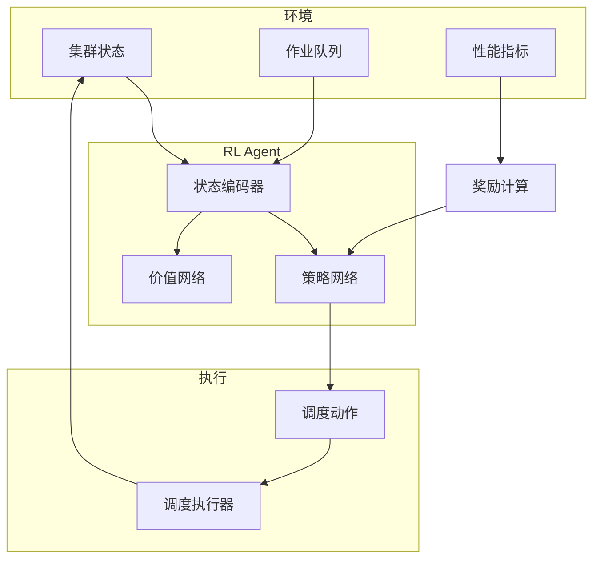
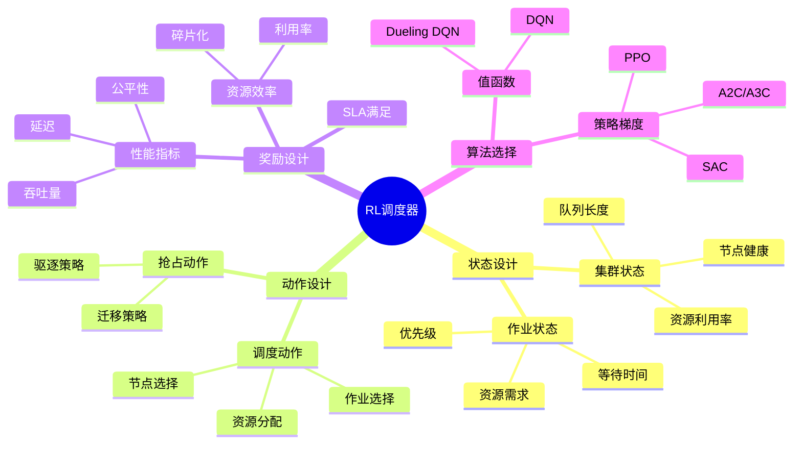
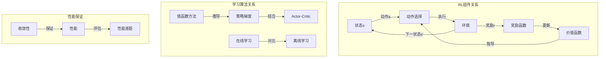

# 10.5 强化学习调度器

> **子主题编号**: 10.5
> **主题**: AI驱动调度
> **最后更新**: 2025-12-02
> **文档状态**: ✅ 完成

---

## 📋 目录

- [10.5 强化学习调度器](#105-强化学习调度器)
  - [📋 目录](#-目录)
  - [1 概述](#1-概述)
    - [1.1 核心洞察](#11-核心洞察)
    - [1.2 RL调度特性](#12-rl调度特性)
    - [1.3 形式化定义](#13-形式化定义)
    - [1.4 核心概念精确定义](#14-核心概念精确定义)
      - [1.4.1 马尔可夫决策过程（MDP）](#141-马尔可夫决策过程mdp)
      - [1.4.2 策略（Policy）](#142-策略policy)
      - [1.4.3 价值函数（Value Function）](#143-价值函数value-function)
    - [1.5 设计原理与动机](#15-设计原理与动机)
      - [1.5.1 为什么使用强化学习进行调度？](#151-为什么使用强化学习进行调度)
      - [1.5.2 RL调度与经典调度的关系](#152-rl调度与经典调度的关系)
  - [3 RL调度框架](#3-rl调度框架)
    - [3.1 整体架构](#31-整体架构)
      - [3.1.1 架构设计原理](#311-架构设计原理)
      - [3.1.2 训练-部署分离](#312-训练-部署分离)
  - [2 思维导图](#2-思维导图)
  - [4 RL调度框架](#4-rl调度框架)
    - [4.1 整体架构](#41-整体架构)
    - [4.2 训练循环](#42-训练循环)
  - [5 状态与动作设计](#5-状态与动作设计)
    - [5.1 状态空间设计](#51-状态空间设计)
    - [5.2 动作空间设计](#52-动作空间设计)
  - [6 奖励函数设计](#6-奖励函数设计)
    - [6.1 多目标奖励](#61-多目标奖励)
  - [7 训练与部署](#7-训练与部署)
    - [7.1 PPO训练](#71-ppo训练)
    - [7.2 生产部署](#72-生产部署)
  - [8 实践案例](#8-实践案例)
    - [8.1 Google Borg RL](#81-google-borg-rl)
    - [8.2 Alibaba PAI](#82-alibaba-pai)
  - [9 关系属性与依赖分析](#9-关系属性与依赖分析)
    - [9.1 RL组件之间的关系](#91-rl组件之间的关系)
      - [9.1.1 状态-动作-奖励关系](#911-状态-动作-奖励关系)
      - [9.1.2 策略-价值关系](#912-策略-价值关系)
      - [9.1.3 探索-利用平衡](#913-探索-利用平衡)
    - [9.2 学习算法之间的关系](#92-学习算法之间的关系)
      - [9.2.1 值函数方法 vs 策略梯度方法](#921-值函数方法-vs-策略梯度方法)
      - [9.2.2 在线学习 vs 离线学习](#922-在线学习-vs-离线学习)
    - [9.3 性能保证与收敛性](#93-性能保证与收敛性)
      - [9.3.1 收敛性定理](#931-收敛性定理)
      - [9.3.2 性能保证](#932-性能保证)
    - [9.4 形式化关系图](#94-形式化关系图)
  - [10 跨视角链接](#10-跨视角链接)
    - [10.1 调度视角关联](#101-调度视角关联)
    - [10.2 形式语言视角关联](#102-形式语言视角关联)
    - [10.3 关系属性映射](#103-关系属性映射)

---

## 1 概述

### 1.1 核心洞察

强化学习（RL）调度器通过与环境交互学习最优调度策略。
相比传统启发式方法，RL调度器能够**自适应复杂动态环境**，在长期目标优化上展现优势。

### 1.2 RL调度特性

| 特性 | 描述 | 调度优势 |
|------|------|---------|
| **自适应** | 从经验学习 | 适应负载变化 |
| **长期优化** | 考虑未来奖励 | 全局最优 |
| **探索利用** | 平衡探索与利用 | 发现新策略 |
| **端到端** | 直接从状态到动作 | 减少人工特征 |
| **可迁移** | 策略可迁移 | 跨集群部署 |

### 1.3 形式化定义

```text
RL调度问题建模为MDP: M = (S, A, P, R, γ)

其中：
  S: 状态空间（集群状态、作业队列）
  A: 动作空间（调度决策）
  P: 状态转移概率 P(s'|s, a)
  R: 奖励函数 R(s, a, s')
  γ: 折扣因子

目标：
  找到策略 π*: S → A 最大化期望累计奖励
  π* = argmax_π E[Σ_t γ^t R(s_t, a_t, s_{t+1}) | π]
```

### 1.4 核心概念精确定义

#### 1.4.1 马尔可夫决策过程（MDP）

**定义 1.1**：马尔可夫决策过程是用于建模序列决策问题的数学框架。

**形式化表述**：

```text
MDP M = (S, A, P, R, γ)

其中：
  S: 状态空间，s ∈ S
  A: 动作空间，a ∈ A
  P: 状态转移概率，P(s'|s, a) = Pr(S_{t+1} = s' | S_t = s, A_t = a)
  R: 奖励函数，R(s, a, s') ∈ ℝ
  γ: 折扣因子，γ ∈ [0, 1]

马尔可夫性质：
  Pr(S_{t+1} | S_t, A_t, S_{t-1}, A_{t-1}, ...) = Pr(S_{t+1} | S_t, A_t)
```

**调度系统对应**：

- **状态S** ↔ **集群状态**：资源使用、队列状态
- **动作A** ↔ **调度决策**：作业分配、资源分配
- **转移概率P** ↔ **系统动态**：作业执行、资源释放
- **奖励R** ↔ **性能指标**：吞吐量、延迟、公平性

#### 1.4.2 策略（Policy）

**定义 1.2**：策略是状态到动作的映射，决定在给定状态下选择什么动作。

**策略类型**：

1. **确定性策略**：

   ```text
   π: S → A
   每个状态映射到唯一动作
   ```

2. **随机策略**：

   ```text
   π: S → Δ(A)
   每个状态映射到动作的概率分布
   π(a|s) = Pr(A_t = a | S_t = s)
   ```

**最优策略**：

```text
最优策略π*满足：
  V^π*(s) = max_π V^π(s)  ∀s ∈ S

其中V^π(s)是策略π的状态价值函数。
```

#### 1.4.3 价值函数（Value Function）

**定义 1.3**：价值函数评估策略的长期收益。

**状态价值函数**：

```text
V^π(s) = E_π[Σ_{k=0}^∞ γ^k R_{t+k+1} | S_t = s]

表示从状态s开始，遵循策略π的期望累计奖励。
```

**动作价值函数（Q函数）**：

```text
Q^π(s, a) = E_π[Σ_{k=0}^∞ γ^k R_{t+k+1} | S_t = s, A_t = a]

表示在状态s执行动作a，然后遵循策略π的期望累计奖励。
```

**贝尔曼方程**：

```text
V^π(s) = Σ_a π(a|s) Σ_{s'} P(s'|s, a) [R(s, a, s') + γV^π(s')]

Q^π(s, a) = Σ_{s'} P(s'|s, a) [R(s, a, s') + γΣ_{a'} π(a'|s')Q^π(s', a')]
```

### 1.5 设计原理与动机

#### 1.5.1 为什么使用强化学习进行调度？

**核心优势**：

1. **自适应学习**：

   ```text
   传统方法：需要人工设计启发式规则
   RL方法：从数据中自动学习最优策略

   优势：适应动态环境和未知模式
   ```

2. **长期优化**：

   ```text
   传统方法：通常优化短期目标（如当前时刻的利用率）
   RL方法：考虑长期累计奖励

   优势：避免局部最优，实现全局优化
   ```

3. **多目标平衡**：

   ```text
   传统方法：需要手动调整权重
   RL方法：通过奖励函数自动学习平衡

   优势：自动找到多目标的最优权衡
   ```

#### 1.5.2 RL调度与经典调度的关系

**定理 1.1**（RL调度包含经典调度）：

```text
经典调度策略（如FIFO、优先级、公平调度）都可以表示为RL策略的特例。

证明思路：
  1. 将经典策略表示为确定性策略π_classic
  2. 构造奖励函数R使得π_classic是最优策略
  3. RL算法可以学习到π_classic或更好的策略
```

**推论 1.1**：RL调度器在理论上至少不会比经典调度器差。

---

## 3 RL调度框架

### 3.1 整体架构



#### 3.1.1 架构设计原理

**设计原则**：

1. **环境抽象**：

   ```text
   调度环境Env = (State, Action, Reward, NextState)

   封装了：
     - 集群状态管理
     - 作业队列管理
     - 性能指标收集
   ```

2. **Agent解耦**：

   ```text
   Agent独立于具体环境实现：
     - 可以切换不同的环境（模拟/真实）
     - 可以迁移到不同的集群
     - 便于测试和验证
   ```

3. **模块化设计**：

   ```text
   状态编码器：将环境状态转换为特征向量
   策略网络：输出动作概率分布
   价值网络：评估状态/动作价值
   ```

#### 3.1.2 训练-部署分离

**训练阶段**：

```text
目标：学习最优策略π*
方法：与环境交互，收集经验，更新策略
环境：可以使用模拟环境，加速训练
```

**部署阶段**：

```text
目标：使用学习到的策略进行调度
方法：策略网络前向传播，选择动作
环境：真实生产环境
```

**优势**：

- 训练可以在安全环境中进行
- 部署时策略已经优化好
- 可以持续在线学习改进

---

## 2 思维导图



---

## 4 RL调度框架

### 4.1 整体架构


### 4.2 训练循环

```python
# RL调度器训练框架
class RLSchedulerTrainer:
    def __init__(self, env, agent, config):
        self.env = env  # 调度环境
        self.agent = agent  # RL agent
        self.config = config
        self.replay_buffer = ReplayBuffer(config.buffer_size)

    def train(self, num_episodes):
        """训练主循环"""
        for episode in range(num_episodes):
            state = self.env.reset()
            episode_reward = 0
            done = False

            while not done:
                # 选择动作
                action = self.agent.select_action(state)

                # 执行动作
                next_state, reward, done, info = self.env.step(action)

                # 存储经验
                self.replay_buffer.push(
                    state, action, reward, next_state, done
                )

                # 更新策略
                if len(self.replay_buffer) >= self.config.batch_size:
                    batch = self.replay_buffer.sample(self.config.batch_size)
                    loss = self.agent.update(batch)

                state = next_state
                episode_reward += reward

            # 日志
            self.log_episode(episode, episode_reward)

    def evaluate(self, num_episodes=10):
        """评估策略"""
        total_reward = 0
        metrics = defaultdict(list)

        for _ in range(num_episodes):
            state = self.env.reset()
            done = False

            while not done:
                action = self.agent.select_action(state, explore=False)
                next_state, reward, done, info = self.env.step(action)

                total_reward += reward
                for k, v in info['metrics'].items():
                    metrics[k].append(v)

                state = next_state

        return {
            'mean_reward': total_reward / num_episodes,
            'metrics': {k: np.mean(v) for k, v in metrics.items()}
        }
```

---

## 5 状态与动作设计

### 5.1 状态空间设计

```python
# 状态空间定义
class SchedulerState:
    def __init__(self, cluster, queue):
        self.cluster = cluster
        self.queue = queue

    def encode(self):
        """编码状态为向量"""
        features = []

        # 集群级特征
        features.extend([
            self.cluster.cpu_utilization,
            self.cluster.memory_utilization,
            self.cluster.gpu_utilization,
            self.cluster.network_utilization,
            len(self.cluster.nodes),
            self.cluster.healthy_nodes_ratio,
        ])

        # 节点级特征 (聚合)
        node_features = []
        for node in self.cluster.nodes:
            node_features.append([
                node.cpu_available,
                node.memory_available,
                node.gpu_available,
                len(node.running_pods),
                node.load_average,
            ])

        # 聚合节点特征
        node_features = np.array(node_features)
        features.extend(node_features.mean(axis=0))
        features.extend(node_features.std(axis=0))
        features.extend(node_features.min(axis=0))
        features.extend(node_features.max(axis=0))

        # 队列特征
        features.extend([
            len(self.queue),
            self.queue.total_cpu_requested,
            self.queue.total_memory_requested,
            self.queue.avg_wait_time,
            self.queue.max_wait_time,
        ])

        # 作业特征 (top-k)
        for job in self.queue.top_k(10):
            features.extend([
                job.cpu_request,
                job.memory_request,
                job.gpu_request,
                job.priority,
                job.wait_time,
            ])

        return np.array(features, dtype=np.float32)

# 图神经网络状态编码
class GNNStateEncoder(nn.Module):
    def __init__(self, node_dim, edge_dim, hidden_dim):
        super().__init__()
        self.node_encoder = nn.Linear(node_dim, hidden_dim)
        self.edge_encoder = nn.Linear(edge_dim, hidden_dim)
        self.gnn_layers = nn.ModuleList([
            GATConv(hidden_dim, hidden_dim) for _ in range(3)
        ])
        self.readout = nn.Linear(hidden_dim, hidden_dim)

    def forward(self, node_features, edge_index, edge_features):
        """图神经网络编码"""
        x = self.node_encoder(node_features)

        for gnn in self.gnn_layers:
            x = F.relu(gnn(x, edge_index))

        # 全局池化
        graph_embedding = x.mean(dim=0)

        return self.readout(graph_embedding)
```

### 5.2 动作空间设计

```python
# 动作空间定义
class SchedulerActionSpace:
    def __init__(self, config):
        self.config = config

    def get_actions(self, state):
        """获取可用动作"""
        actions = []

        # 对每个待调度作业
        for job_idx, job in enumerate(state.queue):
            # 对每个可用节点
            for node_idx, node in enumerate(state.cluster.nodes):
                if self._can_schedule(job, node):
                    actions.append(ScheduleAction(
                        job_idx=job_idx,
                        node_idx=node_idx,
                        job_id=job.id,
                        node_id=node.id
                    ))

        # 添加"不调度"动作
        actions.append(NoOpAction())

        return actions

    def _can_schedule(self, job, node):
        """检查是否可以调度"""
        return (
            node.cpu_available >= job.cpu_request and
            node.memory_available >= job.memory_request and
            node.gpu_available >= job.gpu_request and
            node.is_healthy and
            self._check_affinity(job, node) and
            self._check_taints(job, node)
        )

# 参数化动作空间
class ParameterizedActionSpace:
    """参数化动作：连续选择作业和节点"""

    def __init__(self, num_jobs_embed, num_nodes_embed):
        self.job_selector = nn.Linear(num_jobs_embed, 1)
        self.node_selector = nn.Linear(num_nodes_embed, 1)

    def select_action(self, job_embeddings, node_embeddings):
        """选择作业和节点"""
        # 作业选择概率
        job_scores = self.job_selector(job_embeddings).squeeze(-1)
        job_probs = F.softmax(job_scores, dim=-1)
        job_idx = torch.multinomial(job_probs, 1)

        # 节点选择概率
        node_scores = self.node_selector(node_embeddings).squeeze(-1)
        node_probs = F.softmax(node_scores, dim=-1)
        node_idx = torch.multinomial(node_probs, 1)

        return job_idx, node_idx, job_probs, node_probs
```

---

## 6 奖励函数设计

### 6.1 多目标奖励

```python
# 多目标奖励函数
class SchedulerReward:
    def __init__(self, weights):
        self.weights = weights

    def compute(self, state, action, next_state, info):
        """计算综合奖励"""
        rewards = {}

        # 资源利用率奖励
        rewards['utilization'] = self._utilization_reward(next_state)

        # 作业完成奖励
        rewards['completion'] = self._completion_reward(info)

        # 等待时间惩罚
        rewards['wait_time'] = self._wait_time_penalty(next_state)

        # 碎片化惩罚
        rewards['fragmentation'] = self._fragmentation_penalty(next_state)

        # SLA满足奖励
        rewards['sla'] = self._sla_reward(info)

        # 公平性奖励
        rewards['fairness'] = self._fairness_reward(next_state)

        # 加权求和
        total_reward = sum(
            self.weights.get(k, 1.0) * v
            for k, v in rewards.items()
        )

        return total_reward, rewards

    def _utilization_reward(self, state):
        """资源利用率奖励"""
        util = state.cluster.overall_utilization
        # 目标利用率70-80%
        if 0.7 <= util <= 0.8:
            return 1.0
        elif util < 0.7:
            return util / 0.7
        else:
            return max(0, 1 - (util - 0.8) * 5)  # 过载惩罚

    def _completion_reward(self, info):
        """作业完成奖励"""
        if info.get('job_completed'):
            job = info['job']
            # 提前完成额外奖励
            bonus = max(0, (job.deadline - job.completion_time) / job.deadline)
            return 1.0 + 0.5 * bonus
        return 0

    def _wait_time_penalty(self, state):
        """等待时间惩罚"""
        avg_wait = state.queue.avg_wait_time
        max_wait = state.queue.max_wait_time

        # 归一化惩罚
        return -0.1 * (avg_wait / 60) - 0.2 * (max_wait / 300)

    def _fragmentation_penalty(self, state):
        """资源碎片化惩罚"""
        frag_score = 0
        for node in state.cluster.nodes:
            # 计算碎片化程度
            cpu_frag = node.cpu_available / node.cpu_total
            mem_frag = node.memory_available / node.memory_total

            # 不均衡的碎片更严重
            frag_score += abs(cpu_frag - mem_frag)

        return -0.1 * frag_score / len(state.cluster.nodes)

    def _sla_reward(self, info):
        """SLA满足奖励"""
        if info.get('job_completed'):
            job = info['job']
            if job.completion_time <= job.deadline:
                return 0.5
            else:
                # SLA违反惩罚
                violation = (job.completion_time - job.deadline) / job.deadline
                return -violation
        return 0

    def _fairness_reward(self, state):
        """公平性奖励 (Jain's fairness index)"""
        user_allocations = defaultdict(float)
        user_requests = defaultdict(float)

        for pod in state.cluster.all_pods:
            user = pod.owner
            user_allocations[user] += pod.resources

        for job in state.queue:
            user = job.owner
            user_requests[user] += job.resources

        if not user_allocations:
            return 0

        # 计算公平性指数
        shares = list(user_allocations.values())
        n = len(shares)
        jain = (sum(shares) ** 2) / (n * sum(s**2 for s in shares))

        return 0.5 * (jain - 0.5)  # 归一化到[-0.25, 0.25]
```

---

## 7 训练与部署

### 7.1 PPO训练

```python
# PPO调度器实现
class PPOScheduler(nn.Module):
    def __init__(self, state_dim, action_dim, config):
        super().__init__()

        # 共享特征提取
        self.feature = nn.Sequential(
            nn.Linear(state_dim, 256),
            nn.ReLU(),
            nn.Linear(256, 256),
            nn.ReLU(),
        )

        # Actor (策略网络)
        self.actor = nn.Sequential(
            nn.Linear(256, 128),
            nn.ReLU(),
            nn.Linear(128, action_dim),
            nn.Softmax(dim=-1)
        )

        # Critic (价值网络)
        self.critic = nn.Sequential(
            nn.Linear(256, 128),
            nn.ReLU(),
            nn.Linear(128, 1)
        )

        self.config = config

    def forward(self, state):
        features = self.feature(state)
        action_probs = self.actor(features)
        value = self.critic(features)
        return action_probs, value

    def update(self, rollouts):
        """PPO更新"""
        states = rollouts['states']
        actions = rollouts['actions']
        old_log_probs = rollouts['log_probs']
        returns = rollouts['returns']
        advantages = rollouts['advantages']

        for _ in range(self.config.ppo_epochs):
            # 获取当前策略
            action_probs, values = self(states)
            dist = Categorical(action_probs)
            new_log_probs = dist.log_prob(actions)
            entropy = dist.entropy().mean()

            # PPO比率
            ratio = torch.exp(new_log_probs - old_log_probs)

            # Clipped surrogate
            surr1 = ratio * advantages
            surr2 = torch.clamp(
                ratio,
                1 - self.config.clip_epsilon,
                1 + self.config.clip_epsilon
            ) * advantages

            # 损失函数
            actor_loss = -torch.min(surr1, surr2).mean()
            critic_loss = F.mse_loss(values.squeeze(), returns)
            entropy_loss = -entropy

            loss = (
                actor_loss +
                self.config.value_coef * critic_loss +
                self.config.entropy_coef * entropy_loss
            )

            # 更新
            self.optimizer.zero_grad()
            loss.backward()
            nn.utils.clip_grad_norm_(self.parameters(), self.config.max_grad_norm)
            self.optimizer.step()

        return {
            'actor_loss': actor_loss.item(),
            'critic_loss': critic_loss.item(),
            'entropy': entropy.item()
        }
```

### 7.2 生产部署

```python
# 生产环境部署
class ProductionRLScheduler:
    def __init__(self, model_path, config):
        self.model = self._load_model(model_path)
        self.config = config
        self.fallback_scheduler = DefaultScheduler()

        # 监控
        self.metrics = SchedulerMetrics()
        self.anomaly_detector = AnomalyDetector()

    def schedule(self, state):
        """生产调度决策"""
        try:
            # 检查模型健康
            if not self._is_model_healthy():
                return self.fallback_scheduler.schedule(state)

            # RL决策
            with torch.no_grad():
                state_tensor = self._encode_state(state)
                action_probs, value = self.model(state_tensor)

                # 生产环境使用greedy
                action = action_probs.argmax()

            # 验证决策
            if not self._validate_action(action, state):
                return self.fallback_scheduler.schedule(state)

            # 记录指标
            self.metrics.record_decision(state, action, value)

            return self._decode_action(action, state)

        except Exception as e:
            self.metrics.record_error(e)
            return self.fallback_scheduler.schedule(state)

    def _is_model_healthy(self):
        """检查模型健康状态"""
        # 检查最近决策质量
        recent_metrics = self.metrics.get_recent(window=100)

        if recent_metrics['error_rate'] > 0.05:
            return False

        if recent_metrics['avg_reward'] < self.config.min_reward_threshold:
            return False

        return True

    def _validate_action(self, action, state):
        """验证动作有效性"""
        if action.type == 'schedule':
            job = state.queue[action.job_idx]
            node = state.cluster.nodes[action.node_idx]

            # 资源检查
            if not node.has_resources(job.resources):
                return False

            # 约束检查
            if not self._check_constraints(job, node):
                return False

        return True
```

---

## 8 实践案例

### 8.1 Google Borg RL

```text
Google Borg强化学习调度:
- 目标: 减少作业等待时间
- 状态: 集群资源、作业队列
- 动作: 作业-机器分配
- 奖励: 负等待时间

结果:
- 等待时间减少20%+
- 资源利用率提升
- 在线学习持续优化
```

### 8.2 Alibaba PAI

```text
阿里PAI RL调度器:
- 场景: 深度学习训练作业
- 挑战: GPU资源稀缺
- 方法: Multi-agent RL

特点:
- 分布式训练感知
- 网络拓扑感知
- 公平性保证
```

---

## 9 关系属性与依赖分析

### 9.1 RL组件之间的关系

#### 9.1.1 状态-动作-奖励关系

**定义 8.1**（状态-动作-奖励三元组）：

```text
状态-动作-奖励关系：
  (s, a, r, s') ∈ S × A × ℝ × S

表示：在状态s执行动作a，获得奖励r，转移到状态s'
```

**关系性质**：

1. **因果性**：

   ```text
   奖励r依赖于状态s和动作a：
     r = R(s, a, s')
   ```

2. **马尔可夫性**：

   ```text
   状态转移只依赖于当前状态和动作：
     P(s'|s, a, history) = P(s'|s, a)
   ```

3. **时间性**：

   ```text
   奖励可能延迟：
     r_t可能依赖于s_{t+k}（k > 0）
   ```

#### 9.1.2 策略-价值关系

**定义 8.2**（策略-价值关系）：

```text
策略π和价值函数V^π的关系：
  V^π(s) = Σ_a π(a|s) Q^π(s, a)

Q^π(s, a) = Σ_{s'} P(s'|s, a) [R(s, a, s') + γV^π(s')]
```

**定理 8.1**（策略改进）：

```text
如果策略π'满足：
  π'(a|s) = 1 if a = argmax_a Q^π(s, a)
  π'(a|s) = 0 otherwise

则V^{π'}(s) ≥ V^π(s) 对所有s成立。
```

**证明**：通过策略改进定理（Policy Improvement Theorem）。

#### 9.1.3 探索-利用平衡

**定义 8.3**（探索-利用权衡）：

```text
探索-利用问题：
  - 利用：选择当前认为最优的动作
  - 探索：尝试可能更好的动作

平衡策略：
  ε-贪心：以概率ε随机选择，以概率1-ε选择最优
  UCB：选择上置信界最大的动作
  Thompson采样：从后验分布采样动作
```

**调度系统对应**：

- **利用** ↔ **使用已知好的调度策略**
- **探索** ↔ **尝试新的调度策略**
- **平衡** ↔ **在稳定性和创新性之间权衡**

### 9.2 学习算法之间的关系

#### 9.2.1 值函数方法 vs 策略梯度方法

**值函数方法**：

```text
特点：
  - 学习价值函数Q(s, a)
  - 通过价值函数推导策略
  - 适合离散动作空间

代表算法：
  - Q-Learning
  - DQN
  - Dueling DQN
```

**策略梯度方法**：

```text
特点：
  - 直接学习策略π(a|s)
  - 通过梯度上升优化策略
  - 适合连续动作空间

代表算法：
  - REINFORCE
  - A2C/A3C
  - PPO
  - SAC
```

**关系**：

```text
Actor-Critic方法结合两者：
  - Actor：策略网络（策略梯度）
  - Critic：价值网络（值函数方法）

优势：结合两种方法的优点
```

#### 9.2.2 在线学习 vs 离线学习

**在线学习（On-policy）**：

```text
特点：
  - 使用当前策略收集经验
  - 策略更新后，旧经验可能过时
  - 需要持续与环境交互

代表算法：
  - SARSA
  - A2C
  - PPO
```

**离线学习（Off-policy）**：

```text
特点：
  - 可以使用任何策略收集的经验
  - 经验可以重用
  - 可以学习历史数据

代表算法：
  - Q-Learning
  - DQN
  - DDPG
```

**调度系统选择**：

```text
在线学习：适合动态环境，策略需要快速适应
离线学习：适合稳定环境，可以利用历史数据
混合方法：结合在线和离线学习的优点
```

### 9.3 性能保证与收敛性

#### 9.3.1 收敛性定理

**定理 8.2**（Q-Learning收敛性）：

```text
在满足以下条件时，Q-Learning收敛到最优Q*：
  1. 所有状态-动作对被无限次访问
  2. 学习率α_t满足：Σ_t α_t = ∞ 且 Σ_t α_t² < ∞
  3. 奖励有界

形式化：
  lim_{t→∞} Q_t(s, a) = Q*(s, a)  w.p.1
```

**定理 8.3**（策略梯度收敛性）：

```text
在满足以下条件时，策略梯度方法收敛到局部最优：
  1. 策略参数化充分（可以表示任何策略）
  2. 学习率适当
  3. 梯度估计无偏

形式化：
  lim_{t→∞} ∇_θ J(π_θ) = 0
```

#### 9.3.2 性能保证

**定义 8.4**（性能差距）：

```text
学习到的策略π与最优策略π*的性能差距：
  Gap(π) = V^π*(s₀) - V^π(s₀)

其中s₀是初始状态。
```

**定理 8.4**（性能下界）：

```text
对于ε-最优策略π（满足V^π(s) ≥ V^π*(s) - ε），有：
  Gap(π) ≤ ε / (1 - γ)

其中γ是折扣因子。
```

### 9.4 形式化关系图



## 10 跨视角链接

### 10.1 调度视角关联

| 相关主题 | 关联内容 | 链接 |
|---------|---------|------|
| 调度模型 | 基础调度算法 | [06_调度模型](../06_调度模型/) |
| GPU调度 | 异构资源 | [16_GPU与加速器调度](../16_GPU与加速器调度/) |
| LLM调度 | 推理调度 | [25_LLM推理调度](../25_LLM推理调度/) |
| 工作流调度 | 工作流编排 | [30_工作流调度](../30_工作流调度/) |

### 10.2 形式语言视角关联

| 形式语言概念 | RL调度对应 | 映射说明 |
|------------|------------|---------|
| **类型安全** | 动作验证 | 约束检查 |
| **效应系统** | 状态转移 | 副作用追踪 |
| **泛型** | 策略参数化 | 可迁移策略 |
| **Monad** | MDP | 状态管理上下文 |
| **函子** | 策略映射 | 策略转换 |

### 10.3 关系属性映射

| RL关系 | 调度关系 | 映射说明 |
|-------|---------|---------|
| **状态-动作** | 集群状态-调度决策 | 状态到动作的映射 |
| **奖励函数** | 性能指标 | 调度质量评估 |
| **策略** | 调度策略 | 决策规则 |
| **价值函数** | 长期收益 | 累计性能 |
| **探索-利用** | 稳定性-创新性 | 平衡策略 |

---

**返回**: [AI驱动调度主索引](./README.md) | [调度视角主索引](../README.md)
