# 10.5 强化学习调度器

> **子主题编号**: 10.5
> **主题**: AI驱动调度
> **最后更新**: 2025-12-02
> **文档状态**: ✅ 完成

---

## 📋 目录

- [10.5 强化学习调度器](#105-强化学习调度器)
  - [📋 目录](#-目录)
  - [1 概述](#1-概述)
    - [1.1 核心洞察](#11-核心洞察)
    - [1.2 RL调度特性](#12-rl调度特性)
    - [1.3 形式化定义](#13-形式化定义)
  - [2 思维导图](#2-思维导图)
  - [3 RL调度框架](#3-rl调度框架)
    - [3.1 整体架构](#31-整体架构)
    - [3.2 训练循环](#32-训练循环)
  - [4 状态与动作设计](#4-状态与动作设计)
    - [4.1 状态空间设计](#41-状态空间设计)
    - [4.2 动作空间设计](#42-动作空间设计)
  - [5 奖励函数设计](#5-奖励函数设计)
    - [5.1 多目标奖励](#51-多目标奖励)
  - [6 训练与部署](#6-训练与部署)
    - [6.1 PPO训练](#61-ppo训练)
    - [6.2 生产部署](#62-生产部署)
  - [7 实践案例](#7-实践案例)
    - [7.1 Google Borg RL](#71-google-borg-rl)
    - [7.2 Alibaba PAI](#72-alibaba-pai)
  - [8 跨视角链接](#8-跨视角链接)
    - [8.1 调度视角关联](#81-调度视角关联)
    - [8.2 形式语言视角关联](#82-形式语言视角关联)

---

## 1 概述

### 1.1 核心洞察

强化学习（RL）调度器通过与环境交互学习最优调度策略。
相比传统启发式方法，RL调度器能够**自适应复杂动态环境**，在长期目标优化上展现优势。

### 1.2 RL调度特性

| 特性 | 描述 | 调度优势 |
|------|------|---------|
| **自适应** | 从经验学习 | 适应负载变化 |
| **长期优化** | 考虑未来奖励 | 全局最优 |
| **探索利用** | 平衡探索与利用 | 发现新策略 |
| **端到端** | 直接从状态到动作 | 减少人工特征 |
| **可迁移** | 策略可迁移 | 跨集群部署 |

### 1.3 形式化定义

```text
RL调度问题建模为MDP: M = (S, A, P, R, γ)

其中：
  S: 状态空间（集群状态、作业队列）
  A: 动作空间（调度决策）
  P: 状态转移概率 P(s'|s, a)
  R: 奖励函数 R(s, a, s')
  γ: 折扣因子

目标：
  找到策略 π*: S → A 最大化期望累计奖励
  π* = argmax_π E[Σ_t γ^t R(s_t, a_t, s_{t+1}) | π]
```

---

## 2 思维导图

```mermaid
mindmap
  root((RL调度器))
    状态设计
      集群状态
        资源利用率
        队列长度
        节点健康
      作业状态
        资源需求
        优先级
        等待时间
    动作设计
      调度动作
        作业选择
        节点选择
        资源分配
      抢占动作
        驱逐策略
        迁移策略
    奖励设计
      性能指标
        吞吐量
        延迟
        公平性
      资源效率
        利用率
        碎片化
      SLA满足
    算法选择
      值函数
        DQN
        Dueling DQN
      策略梯度
        A2C/A3C
        PPO
        SAC
```



---

## 3 RL调度框架

### 3.1 整体架构

```mermaid
graph TB
    subgraph "环境"
        CLUSTER[集群状态]
        QUEUE[作业队列]
        METRICS[性能指标]
    end

    subgraph "RL Agent"
        STATE[状态编码器]
        POLICY[策略网络]
        VALUE[价值网络]
    end

    subgraph "执行"
        ACTION[调度动作]
        EXECUTOR[调度执行器]
    end

    CLUSTER --> STATE
    QUEUE --> STATE
    STATE --> POLICY
    STATE --> VALUE
    POLICY --> ACTION
    ACTION --> EXECUTOR
    EXECUTOR --> CLUSTER
    METRICS --> REWARD[奖励计算]
    REWARD --> POLICY
```



### 3.2 训练循环

```python
# RL调度器训练框架
class RLSchedulerTrainer:
    def __init__(self, env, agent, config):
        self.env = env  # 调度环境
        self.agent = agent  # RL agent
        self.config = config
        self.replay_buffer = ReplayBuffer(config.buffer_size)

    def train(self, num_episodes):
        """训练主循环"""
        for episode in range(num_episodes):
            state = self.env.reset()
            episode_reward = 0
            done = False

            while not done:
                # 选择动作
                action = self.agent.select_action(state)

                # 执行动作
                next_state, reward, done, info = self.env.step(action)

                # 存储经验
                self.replay_buffer.push(
                    state, action, reward, next_state, done
                )

                # 更新策略
                if len(self.replay_buffer) >= self.config.batch_size:
                    batch = self.replay_buffer.sample(self.config.batch_size)
                    loss = self.agent.update(batch)

                state = next_state
                episode_reward += reward

            # 日志
            self.log_episode(episode, episode_reward)

    def evaluate(self, num_episodes=10):
        """评估策略"""
        total_reward = 0
        metrics = defaultdict(list)

        for _ in range(num_episodes):
            state = self.env.reset()
            done = False

            while not done:
                action = self.agent.select_action(state, explore=False)
                next_state, reward, done, info = self.env.step(action)

                total_reward += reward
                for k, v in info['metrics'].items():
                    metrics[k].append(v)

                state = next_state

        return {
            'mean_reward': total_reward / num_episodes,
            'metrics': {k: np.mean(v) for k, v in metrics.items()}
        }
```

---

## 4 状态与动作设计

### 4.1 状态空间设计

```python
# 状态空间定义
class SchedulerState:
    def __init__(self, cluster, queue):
        self.cluster = cluster
        self.queue = queue

    def encode(self):
        """编码状态为向量"""
        features = []

        # 集群级特征
        features.extend([
            self.cluster.cpu_utilization,
            self.cluster.memory_utilization,
            self.cluster.gpu_utilization,
            self.cluster.network_utilization,
            len(self.cluster.nodes),
            self.cluster.healthy_nodes_ratio,
        ])

        # 节点级特征 (聚合)
        node_features = []
        for node in self.cluster.nodes:
            node_features.append([
                node.cpu_available,
                node.memory_available,
                node.gpu_available,
                len(node.running_pods),
                node.load_average,
            ])

        # 聚合节点特征
        node_features = np.array(node_features)
        features.extend(node_features.mean(axis=0))
        features.extend(node_features.std(axis=0))
        features.extend(node_features.min(axis=0))
        features.extend(node_features.max(axis=0))

        # 队列特征
        features.extend([
            len(self.queue),
            self.queue.total_cpu_requested,
            self.queue.total_memory_requested,
            self.queue.avg_wait_time,
            self.queue.max_wait_time,
        ])

        # 作业特征 (top-k)
        for job in self.queue.top_k(10):
            features.extend([
                job.cpu_request,
                job.memory_request,
                job.gpu_request,
                job.priority,
                job.wait_time,
            ])

        return np.array(features, dtype=np.float32)

# 图神经网络状态编码
class GNNStateEncoder(nn.Module):
    def __init__(self, node_dim, edge_dim, hidden_dim):
        super().__init__()
        self.node_encoder = nn.Linear(node_dim, hidden_dim)
        self.edge_encoder = nn.Linear(edge_dim, hidden_dim)
        self.gnn_layers = nn.ModuleList([
            GATConv(hidden_dim, hidden_dim) for _ in range(3)
        ])
        self.readout = nn.Linear(hidden_dim, hidden_dim)

    def forward(self, node_features, edge_index, edge_features):
        """图神经网络编码"""
        x = self.node_encoder(node_features)

        for gnn in self.gnn_layers:
            x = F.relu(gnn(x, edge_index))

        # 全局池化
        graph_embedding = x.mean(dim=0)

        return self.readout(graph_embedding)
```

### 4.2 动作空间设计

```python
# 动作空间定义
class SchedulerActionSpace:
    def __init__(self, config):
        self.config = config

    def get_actions(self, state):
        """获取可用动作"""
        actions = []

        # 对每个待调度作业
        for job_idx, job in enumerate(state.queue):
            # 对每个可用节点
            for node_idx, node in enumerate(state.cluster.nodes):
                if self._can_schedule(job, node):
                    actions.append(ScheduleAction(
                        job_idx=job_idx,
                        node_idx=node_idx,
                        job_id=job.id,
                        node_id=node.id
                    ))

        # 添加"不调度"动作
        actions.append(NoOpAction())

        return actions

    def _can_schedule(self, job, node):
        """检查是否可以调度"""
        return (
            node.cpu_available >= job.cpu_request and
            node.memory_available >= job.memory_request and
            node.gpu_available >= job.gpu_request and
            node.is_healthy and
            self._check_affinity(job, node) and
            self._check_taints(job, node)
        )

# 参数化动作空间
class ParameterizedActionSpace:
    """参数化动作：连续选择作业和节点"""

    def __init__(self, num_jobs_embed, num_nodes_embed):
        self.job_selector = nn.Linear(num_jobs_embed, 1)
        self.node_selector = nn.Linear(num_nodes_embed, 1)

    def select_action(self, job_embeddings, node_embeddings):
        """选择作业和节点"""
        # 作业选择概率
        job_scores = self.job_selector(job_embeddings).squeeze(-1)
        job_probs = F.softmax(job_scores, dim=-1)
        job_idx = torch.multinomial(job_probs, 1)

        # 节点选择概率
        node_scores = self.node_selector(node_embeddings).squeeze(-1)
        node_probs = F.softmax(node_scores, dim=-1)
        node_idx = torch.multinomial(node_probs, 1)

        return job_idx, node_idx, job_probs, node_probs
```

---

## 5 奖励函数设计

### 5.1 多目标奖励

```python
# 多目标奖励函数
class SchedulerReward:
    def __init__(self, weights):
        self.weights = weights

    def compute(self, state, action, next_state, info):
        """计算综合奖励"""
        rewards = {}

        # 资源利用率奖励
        rewards['utilization'] = self._utilization_reward(next_state)

        # 作业完成奖励
        rewards['completion'] = self._completion_reward(info)

        # 等待时间惩罚
        rewards['wait_time'] = self._wait_time_penalty(next_state)

        # 碎片化惩罚
        rewards['fragmentation'] = self._fragmentation_penalty(next_state)

        # SLA满足奖励
        rewards['sla'] = self._sla_reward(info)

        # 公平性奖励
        rewards['fairness'] = self._fairness_reward(next_state)

        # 加权求和
        total_reward = sum(
            self.weights.get(k, 1.0) * v
            for k, v in rewards.items()
        )

        return total_reward, rewards

    def _utilization_reward(self, state):
        """资源利用率奖励"""
        util = state.cluster.overall_utilization
        # 目标利用率70-80%
        if 0.7 <= util <= 0.8:
            return 1.0
        elif util < 0.7:
            return util / 0.7
        else:
            return max(0, 1 - (util - 0.8) * 5)  # 过载惩罚

    def _completion_reward(self, info):
        """作业完成奖励"""
        if info.get('job_completed'):
            job = info['job']
            # 提前完成额外奖励
            bonus = max(0, (job.deadline - job.completion_time) / job.deadline)
            return 1.0 + 0.5 * bonus
        return 0

    def _wait_time_penalty(self, state):
        """等待时间惩罚"""
        avg_wait = state.queue.avg_wait_time
        max_wait = state.queue.max_wait_time

        # 归一化惩罚
        return -0.1 * (avg_wait / 60) - 0.2 * (max_wait / 300)

    def _fragmentation_penalty(self, state):
        """资源碎片化惩罚"""
        frag_score = 0
        for node in state.cluster.nodes:
            # 计算碎片化程度
            cpu_frag = node.cpu_available / node.cpu_total
            mem_frag = node.memory_available / node.memory_total

            # 不均衡的碎片更严重
            frag_score += abs(cpu_frag - mem_frag)

        return -0.1 * frag_score / len(state.cluster.nodes)

    def _sla_reward(self, info):
        """SLA满足奖励"""
        if info.get('job_completed'):
            job = info['job']
            if job.completion_time <= job.deadline:
                return 0.5
            else:
                # SLA违反惩罚
                violation = (job.completion_time - job.deadline) / job.deadline
                return -violation
        return 0

    def _fairness_reward(self, state):
        """公平性奖励 (Jain's fairness index)"""
        user_allocations = defaultdict(float)
        user_requests = defaultdict(float)

        for pod in state.cluster.all_pods:
            user = pod.owner
            user_allocations[user] += pod.resources

        for job in state.queue:
            user = job.owner
            user_requests[user] += job.resources

        if not user_allocations:
            return 0

        # 计算公平性指数
        shares = list(user_allocations.values())
        n = len(shares)
        jain = (sum(shares) ** 2) / (n * sum(s**2 for s in shares))

        return 0.5 * (jain - 0.5)  # 归一化到[-0.25, 0.25]
```

---

## 6 训练与部署

### 6.1 PPO训练

```python
# PPO调度器实现
class PPOScheduler(nn.Module):
    def __init__(self, state_dim, action_dim, config):
        super().__init__()

        # 共享特征提取
        self.feature = nn.Sequential(
            nn.Linear(state_dim, 256),
            nn.ReLU(),
            nn.Linear(256, 256),
            nn.ReLU(),
        )

        # Actor (策略网络)
        self.actor = nn.Sequential(
            nn.Linear(256, 128),
            nn.ReLU(),
            nn.Linear(128, action_dim),
            nn.Softmax(dim=-1)
        )

        # Critic (价值网络)
        self.critic = nn.Sequential(
            nn.Linear(256, 128),
            nn.ReLU(),
            nn.Linear(128, 1)
        )

        self.config = config

    def forward(self, state):
        features = self.feature(state)
        action_probs = self.actor(features)
        value = self.critic(features)
        return action_probs, value

    def update(self, rollouts):
        """PPO更新"""
        states = rollouts['states']
        actions = rollouts['actions']
        old_log_probs = rollouts['log_probs']
        returns = rollouts['returns']
        advantages = rollouts['advantages']

        for _ in range(self.config.ppo_epochs):
            # 获取当前策略
            action_probs, values = self(states)
            dist = Categorical(action_probs)
            new_log_probs = dist.log_prob(actions)
            entropy = dist.entropy().mean()

            # PPO比率
            ratio = torch.exp(new_log_probs - old_log_probs)

            # Clipped surrogate
            surr1 = ratio * advantages
            surr2 = torch.clamp(
                ratio,
                1 - self.config.clip_epsilon,
                1 + self.config.clip_epsilon
            ) * advantages

            # 损失函数
            actor_loss = -torch.min(surr1, surr2).mean()
            critic_loss = F.mse_loss(values.squeeze(), returns)
            entropy_loss = -entropy

            loss = (
                actor_loss +
                self.config.value_coef * critic_loss +
                self.config.entropy_coef * entropy_loss
            )

            # 更新
            self.optimizer.zero_grad()
            loss.backward()
            nn.utils.clip_grad_norm_(self.parameters(), self.config.max_grad_norm)
            self.optimizer.step()

        return {
            'actor_loss': actor_loss.item(),
            'critic_loss': critic_loss.item(),
            'entropy': entropy.item()
        }
```

### 6.2 生产部署

```python
# 生产环境部署
class ProductionRLScheduler:
    def __init__(self, model_path, config):
        self.model = self._load_model(model_path)
        self.config = config
        self.fallback_scheduler = DefaultScheduler()

        # 监控
        self.metrics = SchedulerMetrics()
        self.anomaly_detector = AnomalyDetector()

    def schedule(self, state):
        """生产调度决策"""
        try:
            # 检查模型健康
            if not self._is_model_healthy():
                return self.fallback_scheduler.schedule(state)

            # RL决策
            with torch.no_grad():
                state_tensor = self._encode_state(state)
                action_probs, value = self.model(state_tensor)

                # 生产环境使用greedy
                action = action_probs.argmax()

            # 验证决策
            if not self._validate_action(action, state):
                return self.fallback_scheduler.schedule(state)

            # 记录指标
            self.metrics.record_decision(state, action, value)

            return self._decode_action(action, state)

        except Exception as e:
            self.metrics.record_error(e)
            return self.fallback_scheduler.schedule(state)

    def _is_model_healthy(self):
        """检查模型健康状态"""
        # 检查最近决策质量
        recent_metrics = self.metrics.get_recent(window=100)

        if recent_metrics['error_rate'] > 0.05:
            return False

        if recent_metrics['avg_reward'] < self.config.min_reward_threshold:
            return False

        return True

    def _validate_action(self, action, state):
        """验证动作有效性"""
        if action.type == 'schedule':
            job = state.queue[action.job_idx]
            node = state.cluster.nodes[action.node_idx]

            # 资源检查
            if not node.has_resources(job.resources):
                return False

            # 约束检查
            if not self._check_constraints(job, node):
                return False

        return True
```

---

## 7 实践案例

### 7.1 Google Borg RL

```text
Google Borg强化学习调度:
- 目标: 减少作业等待时间
- 状态: 集群资源、作业队列
- 动作: 作业-机器分配
- 奖励: 负等待时间

结果:
- 等待时间减少20%+
- 资源利用率提升
- 在线学习持续优化
```

### 7.2 Alibaba PAI

```text
阿里PAI RL调度器:
- 场景: 深度学习训练作业
- 挑战: GPU资源稀缺
- 方法: Multi-agent RL

特点:
- 分布式训练感知
- 网络拓扑感知
- 公平性保证
```

---

## 8 跨视角链接

### 8.1 调度视角关联

| 相关主题 | 关联内容 | 链接 |
|---------|---------|------|
| 调度模型 | 基础调度算法 | [06_调度模型](../06_调度模型/) |
| GPU调度 | 异构资源 | [16_GPU与加速器调度](../16_GPU与加速器调度/) |
| LLM调度 | 推理调度 | [25_LLM推理调度](../25_LLM推理调度/) |

### 8.2 形式语言视角关联

| 形式语言概念 | RL调度对应 | 映射说明 |
|------------|------------|---------|
| **类型安全** | 动作验证 | 约束检查 |
| **效应系统** | 状态转移 | 副作用追踪 |
| **泛型** | 策略参数化 | 可迁移策略 |

---

**返回**: [AI驱动调度主索引](./README.md) | [调度视角主索引](../README.md)
