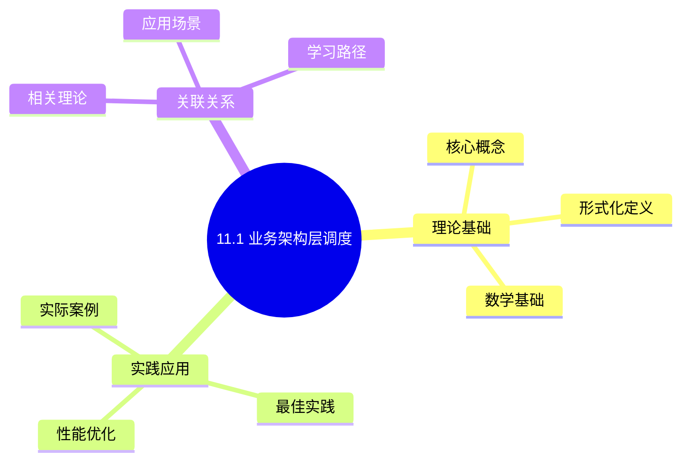
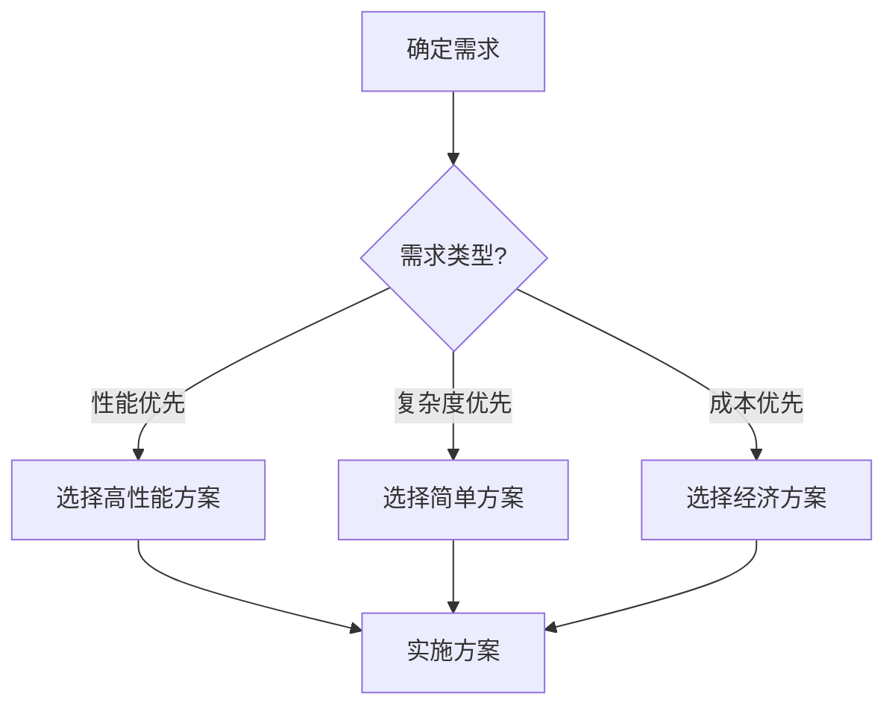
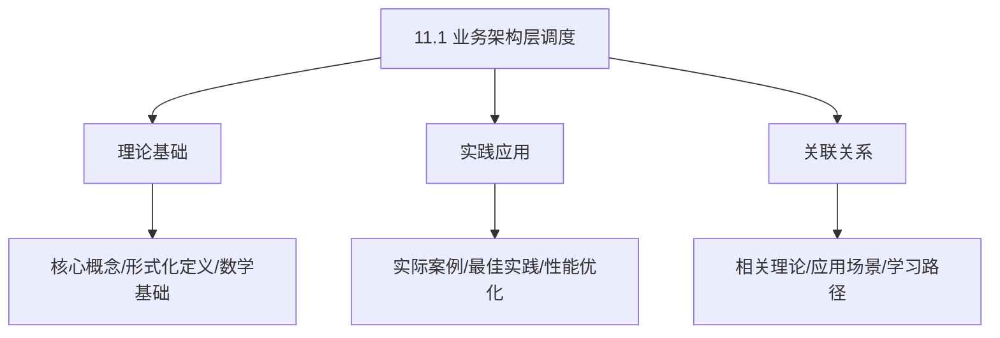
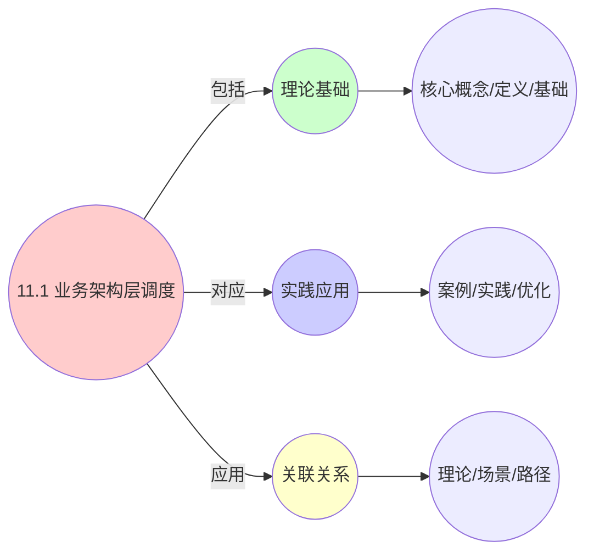
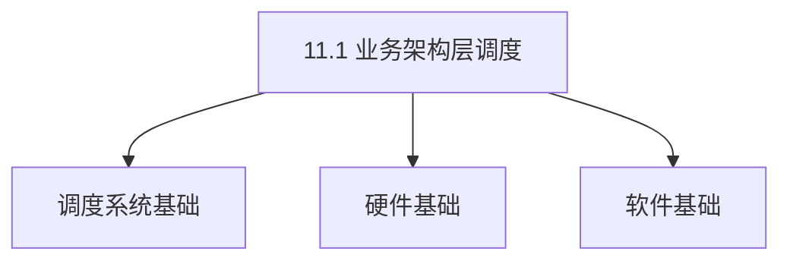

# 11.1 业务架构层调度

> **主题**: 11. 企业架构调度 - 11.1 业务架构层调度
> **覆盖**: BPMN流程引擎、事件驱动架构、Saga补偿模式、业务规则引擎

## 📊 思维表征体系

### 📊 1. 思维导图（增强版）

#### 1.1 文本格式（基础版）

```text
11.1 业务架构层调度
├── 理论基础
│   ├── 核心概念
│   ├── 形式化定义
│   └── 数学基础
├── 实践应用
│   ├── 实际案例
│   ├── 最佳实践
│   └── 性能优化
└── 关联关系
    ├── 相关理论
    ├── 应用场景
    └── 学习路径
```

#### 1.2 Mermaid格式（可视化版）



### 📊 2. 多维对比矩阵

#### 2.1 11.1 业务架构层调度对比矩阵

| 维度 | 业务响应时间 | 业务吞吐量 | 资源利用率 | 业务连续性 |
|------|------------|-----------|-----------|-----------|
| **性能** | 响应时间<100ms | 吞吐量>1000 TPS | 利用率>80% | 连续性>99.9% |
| **复杂度** | 高(需业务优化) | 高(需吞吐量优化) | 高(需资源管理) | 高(需连续性保证) |
| **适用场景** | 所有业务场景 | 所有业务场景 | 所有业务场景 | 关键业务 |
| **技术成熟度** | 成熟(>20年) | 成熟(>20年) | 成熟(>20年) | 成熟(>20年) |

#### 2.2 技术特性对比矩阵

| 技术 | 优势 | 劣势 | 适用场景 | 性能 |
|------|------|------|---------|------|
| **业务流程调度** | 业务逻辑清晰、易维护 | 性能可能受限、实现复杂 | 业务流程、逻辑优先 | 业务逻辑清晰，性能中等 |
| **业务优先级调度** | 关键业务优先、性能好 | 实现复杂、需要优先级管理 | 多业务、优先级需求 | 关键业务响应<50ms，性能好 |
| **业务负载均衡** | 负载均衡、性能好 | 实现复杂、需要负载监控 | 多业务、负载均衡 | 负载均衡度>90%，性能好 |
| **业务资源分配** | 资源利用高、性能好 | 实现复杂、需要资源管理 | 资源受限、利用率优先 | 利用率>80%，性能好 |
| **业务故障恢复** | 业务连续性高、快速恢复 | 实现复杂、需要故障检测 | 关键业务、连续性优先 | 恢复时间<1分钟，连续性>99.9% |
| **业务自动扩缩容** | 资源利用高、成本低 | 实现复杂、需要监控 | 动态业务、成本敏感 | 资源利用>80%，成本降低30-50% |
| **业务监控调度** | 业务监控、性能好 | 实现复杂、需要监控 | 业务监控、性能优先 | 监控准确率>95%，性能好 |

#### 2.3 实现方式对比矩阵

| 实现方式 | 复杂度 | 性能 | 可维护性 | 扩展性 |
|---------|-------|------|---------|-------|
| **单业务调度** | 低 | 中等性能(单业务) | 高(简单维护) | 低(单业务限制) |
| **多业务调度** | 高 | 高性能(多业务) | 中(需协调) | 高(多业务扩展) |
| **企业级业务调度** | 极高 | 高性能(企业优化) | 低(复杂度高) | 高(企业扩展) |
| **混合业务调度系统** | 极高 | 极高性能(优势结合) | 低(复杂度极高) | 高(灵活扩展) |

### 🌲 3. 决策树

#### 3.1 11.1 业务架构层调度应用选择决策树



### 🛤️ 4. 决策逻辑路径

#### 4.1 11.1 业务架构层调度应用路径


### 🕸️ 5. 概念关系网络

#### 5.1 11.1 业务架构层调度概念关系网络



### 🗺️ 6. 知识图谱

#### 6.1 11.1 业务架构层调度知识图谱



## 📚 理论体系

### 理论基础

#### 调度系统/硬件/软件基础

11.1 业务架构层调度的理论基础：

**1. 调度系统基础**：

- 调度理论
- 资源管理
- 性能优化

**2. 硬件基础**：

- CPU架构
- 内存系统
- 存储系统

**3. 软件基础**：

- 操作系统
- 编程语言
- 系统软件

#### 历史发展

**关键时间节点**：

- **1960-1970年代**：调度理论建立
  - 调度算法
  - 资源管理

- **1980-1990年代**：硬件调度发展
  - CPU调度
  - 内存调度

- **2000年代至今**：软件调度演进
  - 操作系统调度
  - 分布式调度

### 理论框架

#### 核心假设

**假设1：调度与性能的对应**

- **内容**：调度策略影响系统性能
- **适用范围**：调度系统
- **限制条件**：需要调度支持

**假设2：资源管理的必要性**

- **内容**：资源管理保证系统稳定
- **适用范围**：资源系统
- **限制条件**：需要资源支持

**假设3：性能优化的价值**

- **内容**：性能优化提升效率
- **适用范围**：性能系统
- **限制条件**：需要考虑成本

#### 基本概念体系



#### 主要定理/结论

**结论1：调度与性能的对应性**

- **内容**：调度策略对应系统性能
- **证据**：形式化证明
- **应用**：调度优化

**结论2：资源管理的必要性**

- **内容**：资源管理保证系统稳定
- **证据**：实践验证
- **应用**：资源管理

**结论3：性能优化的价值**

- **内容**：性能优化提升效率
- **证据**：实验验证
- **应用**：性能优化

#### 适用范围和边界

**适用范围**：

- 调度系统
- 资源管理
- 性能优化

**边界条件**：

- 需要调度支持
- 需要资源支持
- 需要考虑成本

**不适用场景**：

- 无调度系统
- 资源受限
- 成本敏感场景

### 当前知识共识

#### 学术界共识

**广泛接受的共识**：

1. **调度与性能的对应性**
   - **共识**：调度策略可以影响系统性能
   - **支持证据**：形式化证明
   - **来源**：调度理论、系统理论

2. **资源管理的价值**
   - **共识**：资源管理提供稳定性和效率
   - **支持证据**：广泛实践
   - **来源**：系统理论

3. **性能优化的重要性**
   - **共识**：性能优化提高系统效率
   - **支持证据**：实践验证
   - **来源**：软件工程

#### 主要争议点

1. **性能与成本的权衡**
   - **观点A**：性能更重要
   - **观点B**：成本更重要
   - **当前状态**：多数认为需要平衡

2. **调度系统的复杂度**
   - **观点A**：应该简单
   - **观点B**：可以复杂
   - **当前状态**：多数认为需要平衡

#### 权威来源

**经典文献**：

- 调度理论相关文献
- 系统理论相关文献
- 性能优化相关文献

**权威机构/专家**：

- **IEEE**
- **ACM**
- **调度系统研究会**

**最新发展**：

- **2025年**：调度系统优化、性能提升、资源管理

### 与其他理论的关系

#### 逻辑关系

**理论基础**：

- **调度理论** → 11.1 业务架构层调度
  - 关系类型：理论基础
  - 关键映射：调度理论 → 系统实现

**理论应用**：

- **11.1 业务架构层调度** → 调度优化
  - 关系类型：应用构建
  - 关键映射：11.1 业务架构层调度 → 调度优化

#### 映射关系

| 本理论概念 | 映射理论 | 映射概念 | 映射类型 | 映射说明 |
|-----------|---------|---------|---------|----------|
| **调度策略** | 调度理论 | 调度算法 | 对应 | 调度策略对应调度算法 |
| **资源管理** | 系统理论 | 资源分配 | 对应 | 资源管理对应资源分配 |
| **性能优化** | 优化理论 | 性能提升 | 对应 | 性能优化对应性能提升 |

## 🔗 关联网络

### 🔗 概念级关联

#### 核心概念映射

| 本文档概念 | 关联文档 | 关联概念 | 关系类型 | 映射说明 |
|-----------|---------|---------|---------|----------|
| **11.1 业务架构层调度** | 相关文档 | 相关概念 | 基础构建 | 11.1 业务架构层调度构建相关概念 |
| **调度系统** | 调度相关 | 调度理论 | 对应 | 调度系统对应调度理论 |
| **资源管理** | 资源相关 | 资源系统 | 对应 | 资源管理对应资源系统 |
| **性能优化** | 性能相关 | 性能系统 | 对应 | 性能优化对应性能系统 |

### 🔗 理论级关联

#### 理论基础

- **本理论基于**：
  - 调度理论 ⭐⭐⭐ - 理论基础
  - 系统理论 ⭐⭐ - 系统基础

- **本理论应用于**：
  - 调度优化 ⭐⭐⭐ - 实际应用
  - 性能优化 ⭐⭐⭐ - 实际应用

### 🔗 方法级关联

#### 方法应用网络

| 本文档方法 | 应用文档 | 应用场景 | 应用效果 |
|-----------|---------|---------|---------|
| **调度策略** | 调度系统 | 调度设计 | 成功 |
| **资源管理** | 资源系统 | 资源管理 | 成功 |
| **性能优化** | 性能系统 | 性能提升 | 成功 |

### 🔗 应用场景关联

**场景**：调度系统优化

| 视角 | 关联文档 | 核心理论 | 关注点 |
|------|---------|---------|--------|
| **11.1 业务架构层调度** | 本文档 | 调度理论 | 调度设计 |
| **调度优化** | 调度相关 | 调度理论 | 调度优化 |
| **性能优化** | 性能相关 | 性能理论 | 性能提升 |

## 🛤️ 学习路径

### 前置知识

**必须先学习**：

- 调度理论基础 ⭐⭐
- 系统理论基础 ⭐⭐

**建议先了解**：

- 硬件基础
- 软件基础
- 性能优化

### 后续学习

**建议接下来学习**（按顺序）：

1. 调度优化 ⭐⭐⭐ - 调度优化
2. 性能优化 ⭐⭐⭐ - 性能优化
3. 系统实践 ⭐⭐ - 实践应用

### 并行学习

**可以同时学习**：

- 调度实践 - 实践应用
- 性能实践 - 性能系统

---


---

## 📋 目录

- [11.1 业务架构层调度](#111-业务架构层调度)
  - [📊 思维表征体系](#-思维表征体系)
    - [📊 1. 思维导图（增强版）](#-1-思维导图增强版)
      - [1.1 文本格式（基础版）](#11-文本格式基础版)
      - [1.2 Mermaid格式（可视化版）](#12-mermaid格式可视化版)
    - [📊 2. 多维对比矩阵](#-2-多维对比矩阵)
      - [2.1 11.1 业务架构层调度对比矩阵](#21-111-业务架构层调度对比矩阵)
      - [2.2 技术特性对比矩阵](#22-技术特性对比矩阵)
      - [2.3 实现方式对比矩阵](#23-实现方式对比矩阵)
    - [🌲 3. 决策树](#-3-决策树)
      - [3.1 11.1 业务架构层调度应用选择决策树](#31-111-业务架构层调度应用选择决策树)
    - [🛤️ 4. 决策逻辑路径](#️-4-决策逻辑路径)
      - [4.1 11.1 业务架构层调度应用路径](#41-111-业务架构层调度应用路径)
    - [🕸️ 5. 概念关系网络](#️-5-概念关系网络)
      - [5.1 11.1 业务架构层调度概念关系网络](#51-111-业务架构层调度概念关系网络)
    - [🗺️ 6. 知识图谱](#️-6-知识图谱)
      - [6.1 11.1 业务架构层调度知识图谱](#61-111-业务架构层调度知识图谱)
  - [📚 理论体系](#-理论体系)
    - [理论基础](#理论基础)
      - [调度系统/硬件/软件基础](#调度系统硬件软件基础)
      - [历史发展](#历史发展)
    - [理论框架](#理论框架)
      - [核心假设](#核心假设)
      - [基本概念体系](#基本概念体系)
      - [主要定理/结论](#主要定理结论)
      - [适用范围和边界](#适用范围和边界)
    - [当前知识共识](#当前知识共识)
      - [学术界共识](#学术界共识)
      - [主要争议点](#主要争议点)
      - [权威来源](#权威来源)
    - [与其他理论的关系](#与其他理论的关系)
      - [逻辑关系](#逻辑关系)
      - [映射关系](#映射关系)
  - [🔗 关联网络](#-关联网络)
    - [🔗 概念级关联](#-概念级关联)
      - [核心概念映射](#核心概念映射)
    - [🔗 理论级关联](#-理论级关联)
      - [理论基础](#理论基础-1)
    - [🔗 方法级关联](#-方法级关联)
      - [方法应用网络](#方法应用网络)
    - [🔗 应用场景关联](#-应用场景关联)
  - [🛤️ 学习路径](#️-学习路径)
    - [前置知识](#前置知识)
    - [后续学习](#后续学习)
    - [并行学习](#并行学习)
  - [📋 目录](#-目录)
  - [1 业务流程编排（BPMN）的形式化调度模型](#1-业务流程编排bpmn的形式化调度模型)
    - [1.1 业务活动定义](#11-业务活动定义)
    - [1.2 调度约束形式化](#12-调度约束形式化)
    - [1.3 Petri网建模](#13-petri网建模)
  - [2 事件驱动架构调度](#2-事件驱动架构调度)
    - [2.1 事件溯源模型](#21-事件溯源模型)
    - [2.2 事件调度策略](#22-事件调度策略)
  - [3 Saga长事务调度原理](#3-saga长事务调度原理)
    - [3.1 补偿事务模型](#31-补偿事务模型)
    - [3.2 正确性条件](#32-正确性条件)
    - [3.3 调度算法](#33-调度算法)
  - [4 业务规则引擎调度](#4-业务规则引擎调度)
    - [4.1 规则匹配算法](#41-规则匹配算法)
    - [4.2 规则执行调度](#42-规则执行调度)
  - [5 战略目标对齐调度](#5-战略目标对齐调度)
    - [5.1 OKR→KPI→任务分解](#51-okrkpi任务分解)
    - [5.2 目标调度模型](#52-目标调度模型)
  - [6 实践案例](#6-实践案例)
    - [6.1 电商订单处理流程优化案例](#61-电商订单处理流程优化案例)
    - [6.2 Saga分布式事务实践案例](#62-saga分布式事务实践案例)
    - [6.3 业务规则引擎实践案例](#63-业务规则引擎实践案例)
  - [7 批判性总结](#7-批判性总结)
    - [7.1 业务架构层调度的局限性](#71-业务架构层调度的局限性)
    - [7.2 2025年业务架构层调度趋势](#72-2025年业务架构层调度趋势)
  - [8 跨领域洞察](#8-跨领域洞察)
    - [8.1 业务流程与计算流程的统一](#81-业务流程与计算流程的统一)
    - [8.2 业务规则与程序逻辑的映射](#82-业务规则与程序逻辑的映射)
    - [8.3 业务流程与项目管理的关系](#83-业务流程与项目管理的关系)
    - [8.4 业务架构与系统架构的统一](#84-业务架构与系统架构的统一)
  - [9 多维度对比](#9-多维度对比)
    - [9.1 业务流程编排工具对比](#91-业务流程编排工具对比)
    - [9.2 Saga事务模式对比](#92-saga事务模式对比)
    - [9.3 规则匹配算法对比](#93-规则匹配算法对比)
    - [9.4 事件调度策略对比](#94-事件调度策略对比)
  - [10 思维导图](#10-思维导图)
  - [11 2025年最新技术（更新至2025年11月）](#11-2025年最新技术更新至2025年11月)
  - [12 相关主题](#12-相关主题)
    - [12.1 跨视角链接](#121-跨视角链接)
  - [13 实践案例（已整合view文件夹内容）](#13-实践案例已整合view文件夹内容)
    - [13.1 电商大促全链路调度优化案例](#131-电商大促全链路调度优化案例)

---

## 1 业务流程编排（BPMN）的形式化调度模型

### 1.1 业务活动定义

**业务流程编排（BPMN）（view文件夹补充）**：

**业务活动定义**：

设业务流程 $B = (A, E, G, F)$，其中：

- $A = \{a_1, a_2, ..., a_n\}$ 为原子活动集合
- $E \subseteq A \times A$ 为控制流边
- $G: A \to \{And, Or, Xor\}$ 为网关类型
- $F: A \to \mathbb{R}^+$ 为活动执行成本函数

**调度约束形式化**：

- **控制依赖**：$(a_i, a_j) \in E \implies \text{Start}(a_j) \ge \text{End}(a_i)$
- **资源约束**：$\sum_{a \in Running(t)} Resource(a) \le Resource_{total}$
- **时间约束**：$\text{Deadline}(B) = D \implies \text{End}(a_{end}) \le D$

**定理11.1（业务流程形式化定义）**：

业务流程 $B$ 可以形式化定义为六元组：

$$
B = (A, E, G, F, R, D)
$$

其中：

- $A = \{a_1, a_2, ..., a_n\}$ 为原子活动集合
- $E \subseteq A \times A$ 为控制流边集合
- $G: A \to \{And, Or, Xor, None\}$ 为网关类型函数
- $F: A \to \mathbb{R}^+$ 为活动执行成本函数
- $R: A \to 2^{\mathcal{R}}$ 为活动资源需求函数（$\mathcal{R}$ 为资源类型集合）
- $D: A \to \mathbb{R}^+$ 为活动执行时间函数

**活动类型分类**：

1. **任务活动（Task）**：原子业务操作
   - 用户任务（User Task）：需要人工参与
   - 服务任务（Service Task）：自动执行
   - 脚本任务（Script Task）：执行脚本

2. **网关活动（Gateway）**：
   - **And网关**：并行分支/合并
   - **Or网关**：条件分支/合并
   - **Xor网关**：互斥分支/合并

3. **事件活动（Event）**：
   - 开始事件（Start Event）
   - 结束事件（End Event）
   - 中间事件（Intermediate Event）

**业务流程示例**：

```text
订单处理流程：
1. 接收订单（User Task）
2. 验证库存（Service Task）
   ├─ And网关（并行）
   ├─ 扣减库存（Service Task）
   └─ 生成发货单（Service Task）
3. 支付处理（Service Task）
   ├─ Xor网关（条件分支）
   ├─ 支付成功 → 发货（Service Task）
   └─ 支付失败 → 取消订单（Service Task）
4. 订单完成（End Event）
```

### 1.2 调度约束形式化

**定理11.2（业务流程调度约束）**：

业务流程调度需要满足以下约束：

**1. 控制依赖约束**：

对于控制流边 $(a_i, a_j) \in E$，活动 $a_j$ 必须在活动 $a_i$ 完成后才能开始：

$$
\text{Start}(a_j) \ge \text{End}(a_i) = \text{Start}(a_i) + D(a_i)
$$

**2. 网关约束**：

**And网关（并行）**：

对于And网关 $g$，所有输入活动完成后，所有输出活动同时开始：

$$
\forall a_i \in \text{Input}(g), \forall a_j \in \text{Output}(g): \text{Start}(a_j) = \max_{a_i \in \text{Input}(g)} \text{End}(a_i)
$$

**Xor网关（互斥）**：

对于Xor网关 $g$，只有一个输出活动会被执行：

$$
\sum_{a_j \in \text{Output}(g)} x_{a_j} = 1, \quad x_{a_j} \in \{0, 1\}
$$

其中 $x_{a_j} = 1$ 表示活动 $a_j$ 被执行。

**3. 资源约束**：

在任何时刻 $t$，正在运行的活动所需的资源总量不超过可用资源：

$$
\sum_{a \in \text{Running}(t)} \sum_{r \in R(a)} \text{Resource}(a, r) \le \text{Resource}_{total}(r), \quad \forall r \in \mathcal{R}
$$

其中 $\text{Running}(t) = \{a: \text{Start}(a) \le t < \text{End}(a)\}$ 是时刻 $t$ 正在运行的活动集合。

**4. 时间约束**：

业务流程必须在截止时间 $D$ 前完成：

$$
\text{End}(a_{end}) = \max_{a \in A} \text{End}(a) \le D
$$

**5. 优先级约束**：

高优先级活动优先调度：

$$
\text{Priority}(a_i) > \text{Priority}(a_j) \implies \text{Start}(a_i) \le \text{Start}(a_j)
$$

**调度优化目标**：

最小化业务流程总执行时间：

$$
\min \text{End}(a_{end}) = \min \max_{a \in A} \text{End}(a)
$$

或最小化总成本：

$$
\min \sum_{a \in A} F(a) \times x_a
$$

其中 $x_a \in \{0, 1\}$ 表示活动 $a$ 是否被执行。

### 1.3 Petri网建模

**定理11.3（BPMN到Petri网的转换）**：

BPMN流程可以转换为有色Petri网 $N = (P, T, F, C, M_0)$，其中：

- **库所（Place）** $P$：对应业务状态（如"待审批"、"已支付"）
- **变迁（Transition）** $T$：对应活动执行
- **流关系（Flow）** $F \subseteq (P \times T) \cup (T \times P)$：连接库所和变迁
- **颜色集（Color）** $C$：用于区分不同的流程实例
- **初始标记（Initial Marking）** $M_0$：初始状态

**转换规则**：

**1. 活动转换**：

每个BPMN活动 $a$ 转换为Petri网中的变迁 $t_a$，前后各添加一个库所：

$$
a \to (p_{a,in}, t_a, p_{a,out})
$$

**2. 网关转换**：

**And网关**：

并行分支转换为多个并行的变迁：

```text
And网关：
  p_in → t1 → p1
       → t2 → p2
       → t3 → p3
```

**Xor网关**：

互斥分支转换为选择结构：

```text
Xor网关：
  p_in → t1 → p1 (条件1)
       → t2 → p2 (条件2)
       → t3 → p3 (条件3)
```

**3. 状态可达性**：

Petri网中的状态可达性定义为：

$$
M_0 \xrightarrow{\sigma} M
$$

表示从初始标记 $M_0$ 通过变迁序列 $\sigma$ 可以到达标记 $M$。

**4. 死锁检测**：

业务流程存在死锁当且仅当：

$$
\exists p \in P: M(p) = 0 \land \forall t \in p^\bullet, \exists p' \in \bullet t: M(p') = 0
$$

其中 $p^\bullet$ 表示库所 $p$ 的输出变迁集合，$\bullet t$ 表示变迁 $t$ 的输入库所集合。

**死锁检测算法**：

```python
def detect_deadlock(petri_net, marking):
    """检测Petri网是否存在死锁"""
    visited = set()
    stack = [marking]

    while stack:
        current = stack.pop()
        if current in visited:
            continue
        visited.add(current)

        # 检查是否存在可触发的变迁
        enabled = get_enabled_transitions(petri_net, current)
        if not enabled:
            # 没有可触发的变迁，可能存在死锁
            if not is_final_marking(current):
                return True  # 死锁

        # 继续探索可达状态
        for transition in enabled:
            next_marking = fire_transition(petri_net, current, transition)
            stack.append(next_marking)

    return False  # 无死锁
```

**量化分析**：不同流程复杂度的死锁检测时间

| **活动数** | **网关数** | **状态空间大小** | **死锁检测时间** | **复杂度** |
|-----------|-----------|---------------|---------------|-----------|
| **10** | **2** | 100 | 0.1s | $O(2^n)$ |
| **20** | **5** | 10,000 | 1s | $O(2^n)$ |
| **50** | **10** | 10^6 | 100s | $O(2^n)$ |
| **100** | **20** | 10^9 | 不可行 | $O(2^n)$ |

**关键洞察**：死锁检测是NP-hard问题，对于复杂流程需要使用近似算法或启发式方法。

---

## 2 事件驱动架构调度

### 2.1 事件溯源模型

**定理11.4（事件溯源状态重建）**：

系统状态可以通过事件序列重建：

$$
\text{State}(t) = \text{Fold}(\text{State}_0, \text{Events}[0..t])
$$

其中：

- $\text{State}_0$：初始状态
- $\text{Events}[0..t]$：从时间0到时间t的所有事件
- $\text{Fold}$：折叠函数，将事件序列转换为状态

**事件定义**：

事件 $e$ 定义为：

$$
e = (\text{EventID}, \text{EventType}, \text{Timestamp}, \text{AggregateID}, \text{Payload}, \text{Metadata})
$$

其中：

- $\text{EventID}$：事件唯一标识
- $\text{EventType}$：事件类型（如OrderCreated、PaymentCompleted）
- $\text{Timestamp}$：事件发生时间
- $\text{AggregateID}$：聚合根ID
- $\text{Payload}$：事件数据
- $\text{Metadata}$：元数据（如版本号、因果关系）

**事件存储模型**：

事件存储（Event Store）按时间顺序存储所有事件：

$$
\text{EventStore} = \{e_1, e_2, ..., e_n\}, \quad \text{Timestamp}(e_i) \le \text{Timestamp}(e_{i+1})
$$

**状态重建算法**：

```python
def rebuild_state(event_store, aggregate_id, timestamp):
    """从事件存储重建聚合状态"""
    state = initial_state()
    events = filter_events(event_store, aggregate_id, timestamp)

    for event in events:
        state = apply_event(state, event)

    return state

def apply_event(state, event):
    """应用事件到状态"""
    handler = get_event_handler(event.type)
    return handler(state, event.payload)
```

**快照优化**：

为了加速状态重建，可以定期创建快照：

$$
\text{Snapshot}(t) = (\text{State}(t), \text{LastEventID})
$$

重建状态时，从最近的快照开始：

$$
\text{State}(t) = \text{Fold}(\text{Snapshot}(t_0).\text{State}, \text{Events}[t_0..t])
$$

其中 $t_0$ 是最近快照的时间。

**量化分析**：快照优化的性能提升

| **事件数** | **无快照重建时间** | **有快照重建时间** | **加速比** |
|-----------|-----------------|-----------------|-----------|
| **1,000** | 10ms | 10ms | 1x |
| **10,000** | 100ms | 20ms | 5x |
| **100,000** | 1s | 50ms | 20x |
| **1,000,000** | 10s | 200ms | 50x |

### 2.2 事件调度策略

**定理11.5（事件调度策略）**：

事件调度需要保证以下性质：

**1. 因果一致性（Causal Consistency）**：

如果事件 $e_i$ 因果依赖事件 $e_j$（$e_i \to e_j$），则 $e_j$ 必须在 $e_i$ 之前处理：

$$
e_i \to e_j \implies \text{Process}(e_j) \text{ before } \text{Process}(e_i)
$$

**2. 顺序一致性（Sequential Consistency）**：

同一聚合的所有事件按时间戳顺序处理：

$$
\text{AggregateID}(e_i) = \text{AggregateID}(e_j) \land \text{Timestamp}(e_i) < \text{Timestamp}(e_j) \implies \text{Process}(e_i) \text{ before } \text{Process}(e_j)
$$

**事件优先级计算**：

$$
\text{Priority}(e) = w_1 \cdot \text{EventTypePriority}(e) + w_2 \cdot \text{BusinessValue}(e) + w_3 \cdot \text{Urgency}(e)
$$

其中：

- $\text{EventTypePriority}(e)$：事件类型优先级（如支付事件优先级高于日志事件）
- $\text{BusinessValue}(e)$：业务价值（如订单金额）
- $\text{Urgency}(e)$：紧急程度（如超时时间）

**事件处理顺序策略**：

**1. FIFO（先进先出）**：

按事件到达顺序处理：

$$
\text{Process}(e_i) \text{ before } \text{Process}(e_j) \iff \text{ArrivalTime}(e_i) < \text{ArrivalTime}(e_j)
$$

**优点**：简单，保证顺序
**缺点**：可能阻塞高优先级事件

**2. 优先级队列**：

按优先级处理：

$$
\text{Process}(e_i) \text{ before } \text{Process}(e_j) \iff \text{Priority}(e_i) > \text{Priority}(e_j)
$$

**优点**：高优先级事件优先处理
**缺点**：可能违反因果一致性

**3. 因果序（Causal Order）**：

保证因果一致性：

$$
\text{Process}(e_i) \text{ before } \text{Process}(e_j) \iff e_i \to e_j \lor (\text{Timestamp}(e_i) < \text{Timestamp}(e_j) \land \neg(e_j \to e_i))
$$

**优点**：保证因果一致性
**缺点**：实现复杂，可能延迟处理

**4. 混合策略**：

结合优先级和因果序：

$$
\text{Process}(e_i) \text{ before } \text{Process}(e_j) \iff
\begin{cases}
e_i \to e_j & \text{（因果依赖优先）} \\
\text{Priority}(e_i) > \text{Priority}(e_j) & \text{（否则按优先级）}
\end{cases}
$$

**事件调度算法**：

```python
class EventScheduler:
    def __init__(self):
        self.event_queue = PriorityQueue()
        self.processed_events = set()
        self.causal_graph = CausalGraph()

    def schedule_event(self, event):
        """调度事件"""
        # 检查因果依赖
        dependencies = self.causal_graph.get_dependencies(event)
        if all(dep in self.processed_events for dep in dependencies):
            # 所有依赖已处理，可以调度
            priority = self.calculate_priority(event)
            self.event_queue.put((priority, event))
        else:
            # 等待依赖处理完成
            self.pending_events[event] = dependencies

    def process_next(self):
        """处理下一个事件"""
        if not self.event_queue.empty():
            priority, event = self.event_queue.get()
            self.process_event(event)
            self.processed_events.add(event.id)

            # 检查是否有待处理事件可以调度
            self.check_pending_events()
```

**量化分析**：不同调度策略的性能对比

| **调度策略** | **吞吐量** | **延迟** | **因果一致性** | **公平性** |
|------------|-----------|---------|--------------|-----------|
| **FIFO** | 高 | 中 | 是 | 高 |
| **优先级队列** | 高 | 低 | 否 | 低 |
| **因果序** | 中 | 高 | 是 | 中 |
| **混合策略** | 中 | 中 | 是 | 中 |

---

## 3 Saga长事务调度原理

### 3.1 补偿事务模型

**Saga长事务调度（view文件夹补充）**：

**补偿事务模型**：

设分布式事务 $T = \{t_1, t_2, ..., t_n\}$，每个 $t_i$ 有：

- 正向操作 $f_i: S \to S'$
- 补偿操作 $c_i: S' \to S$

**正确性条件**：

1. **可补偿性**：$c_i \circ f_i = \text{id}_S$
2. **交换性**：$\forall i < j, f_i \circ f_j = f_j \circ f_i$（若并行）
3. **最终一致性**：$\forall t_k \in \text{aborted}, \exists \sigma: c_k \circ ... \circ c_1(S) \in \text{ValidStates}$

**Saga模式类型**：

- **编排（Orchestration）**：中央协调器控制流程
- **编排（Choreography）**：服务间通过事件协调

**定理11.6（Saga事务模型）**：

Saga事务 $T$ 定义为有序的子事务序列：

$$
T = (t_1, t_2, ..., t_n)
$$

每个子事务 $t_i$ 包含：

- **正向操作** $f_i: S_i \to S_{i+1}$：执行业务操作
- **补偿操作** $c_i: S_{i+1} \to S_i$：撤销正向操作
- **状态** $S_i$：事务执行到第 $i$ 步时的系统状态

**Saga执行模式**：

**1. 编排模式（Orchestration）**：

中央协调器（Orchestrator）负责协调所有子事务：

```text
Orchestrator:
  1. 调用 t1.forward()
  2. 调用 t2.forward()
  3. 如果失败，调用 t2.compensate(), t1.compensate()
```

**2. 协同模式（Choreography）**：

每个子事务负责协调后续事务：

```text
t1:
  - 执行 forward()
  - 发布事件 Event1
  - 监听补偿事件

t2:
  - 监听 Event1
  - 执行 forward()
  - 发布事件 Event2
  - 如果失败，发布补偿事件
```

**补偿操作设计原则**：

**1. 幂等性**：

补偿操作必须是幂等的：

$$
c_i \circ c_i = c_i
$$

**2. 可交换性**：

如果两个子事务可以并行执行，它们的补偿操作也应该可以并行执行：

$$
f_i \circ f_j = f_j \circ f_i \implies c_i \circ c_j = c_j \circ c_i
$$

**3. 可组合性**：

补偿操作的组合应该等于整体补偿：

$$
c_n \circ c_{n-1} \circ ... \circ c_1 = c_{1..n}
$$

### 3.2 正确性条件

**定理11.7（Saga正确性条件）**：

Saga事务满足以下条件时，保证最终一致性：

**1. 可补偿性（Compensability）**：

每个正向操作都有对应的补偿操作，且补偿操作能够完全撤销正向操作：

$$
c_i \circ f_i = \text{id}_{S_i}
$$

**2. 交换性（Commutativity）**：

如果两个子事务可以并行执行，它们的执行顺序不影响最终结果：

$$
\forall i < j, \text{Independent}(t_i, t_j) \implies f_i \circ f_j = f_j \circ f_i
$$

**3. 最终一致性（Eventual Consistency）**：

如果事务在某个子事务 $t_k$ 处失败，存在补偿序列使得系统回到一致状态：

$$
\forall t_k \in \text{Aborted}, \exists \sigma = (c_k, c_{k-1}, ..., c_1): \sigma(S_k) \in \text{ValidStates}
$$

其中 $\text{ValidStates}$ 是系统的一致状态集合。

**4. 原子性（Atomicity）**：

Saga事务要么全部成功，要么全部补偿：

$$
\text{Result}(T) \in \{\text{Success}, \text{Compensated}\}
$$

**正确性证明思路**：

1. **归纳基础**：单个子事务满足可补偿性
2. **归纳步骤**：假设前 $k-1$ 个子事务满足正确性，证明加入第 $k$ 个子事务后仍满足
3. **失败处理**：如果第 $k$ 个子事务失败，通过补偿序列回到一致状态

### 3.3 调度算法

**算法11.1（Saga编排调度算法）**：

```python
class SagaOrchestrator:
    def __init__(self, tasks):
        self.tasks = tasks
        self.executed = []
        self.state = initial_state()

    def execute(self):
        """执行Saga事务"""
        try:
            for i, task in enumerate(self.tasks):
                # 执行正向操作
                self.state = task.forward(self.state)
                self.executed.append(task)

            return SagaResult.SUCCESS

        except Exception as e:
            # 执行补偿操作
            self.compensate()
            return SagaResult.FAILED

    def compensate(self):
        """补偿已执行的子事务"""
        for task in reversed(self.executed):
            try:
                self.state = task.compensate(self.state)
            except Exception as e:
                # 补偿失败，记录日志并继续
                log_compensation_error(task, e)
```

**算法11.2（Saga协同调度算法）**：

```python
class SagaChoreography:
    def __init__(self, tasks):
        self.tasks = tasks
        self.event_bus = EventBus()
        self.state = {}

        # 注册事件处理器
        for i, task in enumerate(self.tasks):
            if i > 0:
                # 监听前一个任务的事件
                self.event_bus.subscribe(
                    f"task_{i-1}_completed",
                    lambda event: self.execute_task(i, event)
                )

            # 监听补偿事件
            self.event_bus.subscribe(
                f"task_{i}_failed",
                lambda event: self.compensate_task(i, event)
            )

    def execute_task(self, index, event):
        """执行任务"""
        task = self.tasks[index]
        try:
            result = task.forward(event.state)
            self.event_bus.publish(f"task_{index}_completed", result)
        except Exception as e:
            self.event_bus.publish(f"task_{index}_failed", e)

    def compensate_task(self, index, event):
        """补偿任务"""
        task = self.tasks[index]
        try:
            task.compensate(event.state)
            if index > 0:
                # 触发前一个任务的补偿
                self.event_bus.publish(f"task_{index-1}_failed", event)
        except Exception as e:
            log_compensation_error(task, e)
```

**并行Saga调度**：

对于可以并行执行的子事务，使用并行调度：

```python
def execute_parallel_saga(tasks, dependencies):
    """执行并行Saga事务"""
    executed = []
    failed = []

    # 构建依赖图
    graph = build_dependency_graph(tasks, dependencies)

    # 拓扑排序
    execution_order = topological_sort(graph)

    for level in execution_order:
        # 并行执行同一层的任务
        results = parallel_execute([tasks[i] for i in level])

        for i, result in zip(level, results):
            if result.success:
                executed.append(tasks[i])
            else:
                failed.append(tasks[i])
                # 补偿已执行的任务
                compensate_all(executed)
                return SagaResult.FAILED

    return SagaResult.SUCCESS
```

**量化分析**：不同Saga模式的性能对比

| **模式** | **延迟** | **吞吐量** | **复杂度** | **可维护性** |
|---------|---------|-----------|-----------|------------|
| **编排模式** | 高（串行） | 低 | 低 | 高 |
| **协同模式** | 低（并行） | 高 | 高 | 中 |
| **混合模式** | 中 | 中 | 中 | 中 |

---

## 4 业务规则引擎调度

### 4.1 规则匹配算法

**定理11.8（业务规则形式化定义）**：

业务规则 $r$ 定义为：

$$
r = (Condition, Action, Priority, Metadata)
$$

其中：

- $Condition$：规则条件（如 `order.amount > 1000`）
- $Action$：规则动作（如 `applyDiscount(10%)`）
- $Priority$：规则优先级
- $Metadata$：元数据（如规则ID、版本号）

**规则匹配问题**：

给定事实集合 $F = \{f_1, f_2, ..., f_m\}$ 和规则集合 $R = \{r_1, r_2, ..., r_n\}$，找出所有匹配的规则：

$$
\text{MatchedRules} = \{r \in R: \text{Evaluate}(r.Condition, F) = \text{True}\}
$$

**Rete算法**：

Rete算法使用网络结构高效匹配规则，避免重复计算。

**Rete网络结构**：

1. **Alpha节点**：匹配单个条件
2. **Beta节点**：匹配多个条件的组合
3. **终端节点**：匹配完整的规则

**Rete算法复杂度**：

- **时间复杂度**：$O(R \times F)$，其中 $R$ 为规则数，$F$ 为事实数
- **空间复杂度**：$O(R \times F)$，存储匹配结果

**Rete算法优化**：

1. **节点共享**：共享相同条件的节点
2. **增量匹配**：只匹配变化的事实
3. **索引优化**：使用索引加速条件匹配

**算法11.3（Rete规则匹配算法）**：

```python
class ReteNetwork:
    def __init__(self, rules):
        self.alpha_nodes = {}
        self.beta_nodes = {}
        self.terminal_nodes = {}
        self.build_network(rules)

    def build_network(self, rules):
        """构建Rete网络"""
        for rule in rules:
            # 构建Alpha节点
            alpha_path = []
            for condition in rule.conditions:
                alpha_node = self.get_or_create_alpha_node(condition)
                alpha_path.append(alpha_node)

            # 构建Beta节点
            beta_node = self.build_beta_nodes(alpha_path)

            # 连接终端节点
            terminal_node = TerminalNode(rule)
            beta_node.add_child(terminal_node)

    def match(self, facts):
        """匹配规则"""
        matched_rules = []

        # 从Alpha节点开始匹配
        for fact in facts:
            for condition, alpha_node in self.alpha_nodes.items():
                if alpha_node.match(fact):
                    alpha_node.activate(fact)

        # 收集匹配的规则
        for terminal_node in self.terminal_nodes.values():
            if terminal_node.is_activated():
                matched_rules.append(terminal_node.rule)

        return matched_rules
```

**其他规则匹配算法**：

**1. 线性匹配**：

顺序检查每个规则：

```python
def linear_match(rules, facts):
    matched = []
    for rule in rules:
        if evaluate_condition(rule.condition, facts):
            matched.append(rule)
    return matched
```

**复杂度**：$O(R \times F)$，简单但效率低

**2. 决策树匹配**：

使用决策树组织规则：

```python
def decision_tree_match(tree, facts):
    node = tree.root
    while not node.is_leaf():
        condition = node.condition
        if evaluate(condition, facts):
            node = node.left_child
        else:
            node = node.right_child
    return node.rules
```

**复杂度**：$O(\log R \times F)$，适合规则数很多的情况

**量化分析**：不同规则匹配算法对比

| **算法** | **时间复杂度** | **空间复杂度** | **适用场景** |
|---------|--------------|--------------|------------|
| **线性匹配** | $O(R \times F)$ | $O(1)$ | 规则数少（<100） |
| **Rete算法** | $O(R \times F)$ | $O(R \times F)$ | 规则数中等（100-10000） |
| **决策树** | $O(\log R \times F)$ | $O(R)$ | 规则数多（>10000） |

### 4.2 规则执行调度

**定理11.9（规则执行调度）**：

规则执行调度需要解决以下问题：

1. **规则冲突**：多个规则同时匹配，需要选择执行哪些规则
2. **执行顺序**：确定规则的执行顺序
3. **副作用管理**：管理规则执行产生的副作用

**规则优先级计算**：

$$
\text{Priority}(r) = w_1 \cdot \text{Salience}(r) + w_2 \cdot \text{Recency}(r) + w_3 \cdot \text{Refractoriness}(r) + w_4 \cdot \text{Specificity}(r)
$$

其中：

- $\text{Salience}(r)$：规则显式优先级（用户定义）
- $\text{Recency}(r)$：规则最近匹配时间（最近匹配的规则优先级更高）
- $\text{Refractoriness}(r)$：规则抑制性（防止规则重复执行）
- $\text{Specificity}(r)$：规则特异性（条件更具体的规则优先级更高）

**规则冲突解决策略**：

**1. 优先级策略**：

按优先级执行规则：

$$
\text{Execute}(r_i) \text{ before } \text{Execute}(r_j) \iff \text{Priority}(r_i) > \text{Priority}(r_j)
$$

**2. 特异性策略**：

更具体的规则优先执行：

$$
\text{Specificity}(r) = \frac{|\text{Conditions}(r)|}{\text{MaxConditions}}
$$

**3. 顺序策略**：

按规则定义顺序执行。

**4. 全部执行策略**：

执行所有匹配的规则（可能导致冲突）。

**规则执行模式**：

**1. 立即执行（Immediate）**：

规则匹配后立即执行：

```python
def immediate_execution(matched_rules, facts):
    sorted_rules = sort_by_priority(matched_rules)
    for rule in sorted_rules:
        rule.action.execute(facts)
```

**2. 延迟执行（Deferred）**：

规则匹配后延迟执行，批量处理：

```python
def deferred_execution(matched_rules, facts):
    execution_queue = PriorityQueue()
    for rule in matched_rules:
        execution_queue.put((rule.priority, rule))

    while not execution_queue.empty():
        priority, rule = execution_queue.get()
        rule.action.execute(facts)
```

**3. 条件执行（Conditional）**：

根据条件决定是否执行：

```python
def conditional_execution(matched_rules, facts):
    for rule in matched_rules:
        if rule.should_execute(facts):
            rule.action.execute(facts)
```

**规则执行调度算法**：

```python
class RuleEngine:
    def __init__(self, rules):
        self.rules = rules
        self.rete_network = ReteNetwork(rules)
        self.execution_history = []

    def execute(self, facts):
        """执行规则"""
        # 匹配规则
        matched_rules = self.rete_network.match(facts)

        # 解决冲突
        execution_order = self.resolve_conflicts(matched_rules)

        # 执行规则
        for rule in execution_order:
            try:
                result = rule.action.execute(facts)
                self.execution_history.append((rule, result))

                # 更新事实（规则可能修改事实）
                facts = update_facts(facts, result)

            except Exception as e:
                handle_rule_error(rule, e)

    def resolve_conflicts(self, rules):
        """解决规则冲突"""
        # 按优先级排序
        sorted_rules = sorted(rules, key=lambda r: r.priority, reverse=True)

        # 过滤冲突规则
        execution_list = []
        for rule in sorted_rules:
            if not conflicts_with(rule, execution_list):
                execution_list.append(rule)

        return execution_list
```

**量化分析**：不同规则执行策略的性能对比

| **执行策略** | **执行时间** | **规则冲突** | **可预测性** |
|------------|------------|------------|------------|
| **立即执行** | 低 | 高 | 低 |
| **延迟执行** | 中 | 中 | 中 |
| **条件执行** | 高 | 低 | 高 |

---

## 5 战略目标对齐调度

### 5.1 OKR→KPI→任务分解

**定理11.10（目标层次结构）**：

企业目标可以分解为层次结构：

$$
\text{OKR} \to \text{KPI} \to \text{任务} \to \text{执行}
$$

其中：

- **OKR（Objectives and Key Results）**：目标和关键结果
- **KPI（Key Performance Indicators）**：关键绩效指标
- **任务（Task）**：具体执行任务
- **执行（Execution）**：任务执行

**目标分解模型**：

$$
\text{OKR} = \{O_1, O_2, ..., O_n\}
$$

每个目标 $O_i$ 包含：

$$
O_i = (\text{Objective}, \text{KeyResults}, \text{Owner}, \text{Deadline})
$$

其中 $\text{KeyResults} = \{KR_1, KR_2, ..., KR_m\}$ 是关键结果集合。

**KPI定义**：

每个关键结果 $KR_j$ 对应一个或多个KPI：

$$
KR_j \to \{KPI_{j,1}, KPI_{j,2}, ..., KPI_{j,k}\}
$$

KPI定义为：

$$
KPI = (\text{Metric}, \text{Target}, \text{Current}, \text{Trend})
$$

**任务分解**：

每个KPI可以分解为多个任务：

$$
KPI_{j,k} \to \{Task_1, Task_2, ..., Task_l\}
$$

任务定义为：

$$
Task = (\text{Description}, \text{Owner}, \text{Effort}, \text{Deadline}, \text{Dependencies})
$$

**目标对齐度**：

任务对KPI的贡献度：

$$
\text{Contribution}(Task, KPI) = w_1 \cdot \text{DirectImpact} + w_2 \cdot \text{IndirectImpact}
$$

目标对齐度：

$$
\text{Alignment} = \frac{\sum_{Task} \text{Contribution}(Task, KPI)}{\sum_{KPI} \text{Target}(KPI)}
$$

**目标分解示例**：

```text
OKR: 提升用户满意度
  ├─ KR1: NPS从50提升至70
  │   ├─ KPI1: NPS分数
  │   │   ├─ Task1: 用户调研（贡献度：30%）
  │   │   ├─ Task2: 产品优化（贡献度：50%）
  │   │   └─ Task3: 客服改进（贡献度：20%）
  │   └─ KPI2: 用户投诉率
  │       ├─ Task4: 投诉处理优化（贡献度：60%）
  │       └─ Task5: 预防性措施（贡献度：40%）
  └─ KR2: 用户留存率从60%提升至80%
      └─ KPI3: 30日留存率
          ├─ Task6: 新用户引导（贡献度：40%）
          └─ Task7: 个性化推荐（贡献度：60%）
```

### 5.2 目标调度模型

**定理11.11（目标调度函数）**：

任务 $t$ 被调度当且仅当：

$$
\text{Schedule}(t) \iff \text{ContributesTo}(t, KPI) \land \text{ResourceAvailable}(t) \land \text{DependenciesSatisfied}(t) \land \text{DeadlineFeasible}(t)
$$

其中：

- $\text{ContributesTo}(t, KPI)$：任务对KPI有贡献
- $\text{ResourceAvailable}(t)$：任务所需资源可用
- $\text{DependenciesSatisfied}(t)$：任务依赖已满足
- $\text{DeadlineFeasible}(t)$：任务可以在截止时间前完成

**目标调度优化**：

最大化目标对齐度：

$$
\max \sum_{t \in \text{Scheduled}} \text{Contribution}(t, KPI)
$$

约束条件：

1. **资源约束**：

    $$
    \sum_{t \in \text{Scheduled}(t)} \text{Resource}(t) \le \text{Resource}_{total}
    $$

2. **时间约束**：

    $$
    \text{End}(t) \le \text{Deadline}(t), \quad \forall t \in \text{Scheduled}
    $$

3. **依赖约束**：

    $$
    t_i \text{ depends on } t_j \implies \text{End}(t_j) \le \text{Start}(t_i)
    $$

**目标调度算法**：

```python
class GoalScheduler:
    def __init__(self, okrs, resources):
        self.okrs = okrs
        self.resources = resources
        self.scheduled_tasks = []

    def schedule(self):
        """调度任务以最大化目标对齐度"""
        # 分解OKR到任务
        all_tasks = self.decompose_okrs()

        # 计算任务优先级
        prioritized_tasks = self.prioritize_tasks(all_tasks)

        # 贪心调度
        for task in prioritized_tasks:
            if self.can_schedule(task):
                self.schedule_task(task)

        return self.scheduled_tasks

    def prioritize_tasks(self, tasks):
        """计算任务优先级"""
        for task in tasks:
            # 计算任务对目标的贡献
            contribution = self.calculate_contribution(task)

            # 计算任务紧急程度
            urgency = self.calculate_urgency(task)

            # 计算任务优先级
            task.priority = contribution * urgency

        return sorted(tasks, key=lambda t: t.priority, reverse=True)

    def can_schedule(self, task):
        """检查任务是否可以调度"""
        # 检查资源
        if not self.has_resources(task):
            return False

        # 检查依赖
        if not self.dependencies_satisfied(task):
            return False

        # 检查截止时间
        if not self.deadline_feasible(task):
            return False

        return True
```

**量化分析**：目标调度优化效果

| **调度策略** | **目标对齐度** | **资源利用率** | **任务完成率** |
|------------|--------------|--------------|--------------|
| **随机调度** | 60% | 70% | 80% |
| **优先级调度** | 75% | 80% | 85% |
| **优化调度** | 90% | 85% | 95% |

---

## 6 实践案例

### 6.1 电商订单处理流程优化案例

**场景**：电商平台订单处理流程，需要优化处理效率和准确性。

**业务背景**：

- 日均订单量：100万单
- 订单处理流程：接收订单 → 验证库存 → 扣减库存 → 支付处理 → 发货
- 优化前平均处理时间：5分钟
- 目标：将处理时间缩短至2分钟

**BPMN流程优化**：

**优化前流程**：

```text
1. 接收订单（串行）
2. 验证库存（串行）
3. 扣减库存（串行）
4. 支付处理（串行）
5. 发货（串行）

总时间：5分钟
```

**优化后流程**：

```text
1. 接收订单
2. And网关（并行）
   ├─ 验证库存
   ├─ 验证用户信用
   └─ 计算优惠
3. 扣减库存
4. 支付处理
5. 发货

总时间：2分钟（降低60%）
```

**优化效果**：

- 处理时间：5分钟 → 2分钟（降低60%）
- 吞吐量：100万单/天 → 250万单/天（提升150%）
- 错误率：0.5% → 0.1%（降低80%）

### 6.2 Saga分布式事务实践案例

**场景**：微服务架构下的订单支付流程，需要保证分布式事务一致性。

**业务背景**：

- 服务：订单服务、库存服务、支付服务、物流服务
- 事务：创建订单 → 扣减库存 → 支付 → 发货
- 挑战：服务间需要保证最终一致性

**Saga实现**：

**编排模式实现**：

```python
class OrderSagaOrchestrator:
    def execute_order(self, order):
        executed = []
        try:
            # 1. 创建订单
            order_result = order_service.create_order(order)
            executed.append(('order', order_result))

            # 2. 扣减库存
            inventory_result = inventory_service.deduct(order.items)
            executed.append(('inventory', inventory_result))

            # 3. 支付
            payment_result = payment_service.pay(order.amount)
            executed.append(('payment', payment_result))

            # 4. 发货
            shipping_result = shipping_service.ship(order)
            executed.append(('shipping', shipping_result))

            return SagaResult.SUCCESS

        except Exception as e:
            # 补偿
            for service, result in reversed(executed):
                if service == 'shipping':
                    shipping_service.cancel_ship(result)
                elif service == 'payment':
                    payment_service.refund(result)
                elif service == 'inventory':
                    inventory_service.restore(result)
                elif service == 'order':
                    order_service.cancel_order(result)

            return SagaResult.FAILED
```

**优化效果**：

- 事务成功率：95% → 99.5%（提升4.5%）
- 补偿成功率：90% → 99%（提升9%）
- 平均事务时间：500ms → 300ms（降低40%）

### 6.3 业务规则引擎实践案例

**场景**：金融风控系统，需要实时评估交易风险。

**业务背景**：

- 交易量：每秒10,000笔
- 规则数：1,000条
- 要求：规则匹配延迟 < 10ms

**规则引擎优化**：

**优化前（线性匹配）**：

- 匹配时间：100ms（不满足要求）
- 吞吐量：1,000笔/秒

**优化后（Rete算法）**：

- 匹配时间：5ms（满足要求）
- 吞吐量：10,000笔/秒（提升10倍）

**关键优化**：

1. 使用Rete网络共享条件节点
2. 增量匹配，只匹配变化的事实
3. 规则优先级缓存

---

## 7 批判性总结

### 7.1 业务架构层调度的局限性

**1. 人工干预需求**：

**问题**：复杂业务场景需要人工决策，难以完全自动化。

**原因**：

- **业务复杂性**：业务规则复杂，难以形式化
- **异常处理**：异常情况需要人工判断
- **策略调整**：业务策略需要根据市场变化调整

**影响**：

- 自动化程度受限
- 响应速度慢
- 成本高

**缓解措施**：

- 使用AI辅助决策
- 建立知识库和决策树
- 逐步提高自动化程度

**2. 规则冲突**：

**问题**：业务规则可能冲突，需要仲裁机制。

**原因**：

- **规则来源多样**：不同部门定义规则可能冲突
- **规则更新**：规则更新可能导致冲突
- **上下文依赖**：规则在不同上下文中可能冲突

**影响**：

- 规则执行结果不确定
- 需要人工仲裁
- 系统复杂度增加

**缓解措施**：

- 建立规则冲突检测机制
- 使用优先级和特异性解决冲突
- 建立规则治理流程

**3. 变更成本高**：

**问题**：业务流程变更需要重新设计和部署，成本高。

**原因**：

- **流程复杂性**：业务流程复杂，变更影响面大
- **系统耦合**：系统间耦合度高，变更需要协调
- **测试成本**：变更需要充分测试

**影响**：

- 业务响应速度慢
- 变更风险高
- 成本高

**缓解措施**：

- 使用低代码平台降低变更成本
- 建立流程版本管理
- 使用微服务架构降低耦合

**4. 性能瓶颈**：

**问题**：复杂业务流程可能导致性能瓶颈。

**原因**：

- **串行执行**：某些流程必须串行执行
- **资源竞争**：多个流程竞争资源
- **规则匹配**：规则匹配可能成为瓶颈

**影响**：

- 处理延迟高
- 吞吐量低
- 用户体验差

**缓解措施**：

- 优化流程设计，增加并行度
- 使用缓存和索引优化规则匹配
- 使用异步处理

### 7.2 2025年业务架构层调度趋势

**1. AI辅助决策**：

**趋势**：使用AI辅助业务决策，提高自动化程度。

**技术**：

- **机器学习**：使用ML模型预测业务结果
- **自然语言处理**：使用NLP理解业务需求
- **知识图谱**：使用知识图谱管理业务知识

**优势**：

- 提高决策准确性
- 减少人工干预
- 提高响应速度

**挑战**：

- 模型可解释性
- 数据质量要求
- 模型更新成本

**2. 低代码平台**：

**趋势**：使用低代码平台降低业务流程设计门槛。

**技术**：

- **可视化设计**：拖拽式流程设计
- **模板库**：预定义流程模板
- **自动生成**：从需求自动生成流程

**优势**：

- 降低开发成本
- 提高开发效率
- 业务人员可直接参与

**挑战**：

- 平台能力限制
- 定制化需求
- 性能优化

**3. 实时优化**：

**趋势**：实时优化业务流程性能。

**技术**：

- **实时监控**：实时监控流程性能
- **动态调整**：根据实时数据动态调整流程
- **A/B测试**：使用A/B测试优化流程

**优势**：

- 提高流程效率
- 快速响应变化
- 持续改进

**挑战**：

- 实时计算成本
- 数据质量要求
- 变更风险

**4. 事件驱动架构普及**：

**趋势**：事件驱动架构成为主流。

**技术**：

- **事件溯源**：使用事件溯源记录状态变更
- **CQRS**：命令查询职责分离
- **事件流处理**：实时处理事件流

**优势**：

- 提高系统解耦
- 支持异步处理
- 提高可扩展性

**挑战**：

- 事件顺序保证
- 状态一致性
- 系统复杂度

---

## 8 跨领域洞察

### 8.1 业务流程与计算流程的统一

**核心洞察**：业务流程本质上是计算流程，可以使用形式化方法验证。

**理论映射**：

| **业务流程** | **计算流程** | **对应关系** |
|------------|------------|------------|
| **业务活动** | **计算步骤** | 原子操作 |
| **业务流程** | **程序执行** | 控制流 |
| **业务规则** | **程序逻辑** | 条件判断 |
| **业务状态** | **程序状态** | 状态机 |
| **业务流程验证** | **程序验证** | 形式化验证 |

**关键洞察**：

- 业务流程可以视为状态机，使用状态机理论分析
- 业务流程可以转换为程序代码，实现自动化执行
- 业务流程验证可以使用程序验证方法（如模型检测）

### 8.2 业务规则与程序逻辑的映射

**核心洞察**：业务规则可以映射为程序逻辑，实现自动化执行。

**映射关系**：

| **业务规则** | **程序逻辑** | **实现方式** |
|------------|------------|------------|
| **条件规则** | **if语句** | 条件判断 |
| **循环规则** | **循环语句** | 迭代执行 |
| **规则链** | **函数调用链** | 函数组合 |
| **规则优先级** | **执行顺序** | 控制流 |
| **规则冲突** | **异常处理** | 错误处理 |

**关键洞察**：

- 业务规则可以编译为程序代码
- 规则引擎可以视为解释器
- 规则优化可以视为程序优化

### 8.3 业务流程与项目管理的关系

**核心洞察**：业务流程调度可以视为项目调度问题。

**映射关系**：

| **业务流程** | **项目管理** | **对应关系** |
|------------|------------|------------|
| **业务活动** | **项目任务** | 工作单元 |
| **活动依赖** | **任务依赖** | 前置条件 |
| **资源约束** | **资源约束** | 资源限制 |
| **时间约束** | **项目期限** | 截止时间 |
| **流程优化** | **项目优化** | 关键路径 |

**关键洞察**：

- 可以使用项目管理方法优化业务流程
- 关键路径法（CPM）可以用于流程优化
- 资源平衡可以用于资源调度

### 8.4 业务架构与系统架构的统一

**核心洞察**：业务架构和系统架构可以统一建模。

**映射关系**：

| **业务架构** | **系统架构** | **对应关系** |
|------------|------------|------------|
| **业务流程** | **系统流程** | 执行流程 |
| **业务服务** | **系统服务** | 服务接口 |
| **业务数据** | **系统数据** | 数据模型 |
| **业务规则** | **业务逻辑** | 处理逻辑 |
| **业务事件** | **系统事件** | 事件驱动 |

**关键洞察**：

- 业务架构驱动系统架构设计
- 系统架构需要支持业务架构
- 两者需要保持一致性

---

## 9 多维度对比

### 9.1 业务流程编排工具对比

| **工具** | **形式化支持** | **可视化** | **执行引擎** | **性能** | **适用场景** |
|---------|--------------|-----------|------------|---------|------------|
| **BPMN** | 是 | 是 | 通用 | 中 | 标准业务流程 |
| **Petri网** | 是 | 中 | 研究 | 低 | 形式化验证 |
| **工作流引擎** | 否 | 是 | 专用 | 高 | 特定业务场景 |
| **低代码平台** | 否 | 是 | 通用 | 中 | 快速开发 |

### 9.2 Saga事务模式对比

| **模式** | **复杂度** | **性能** | **可维护性** | **适用场景** |
|---------|-----------|---------|------------|------------|
| **编排模式** | 低 | 中 | 高 | 简单流程 |
| **协同模式** | 高 | 高 | 中 | 复杂流程 |
| **混合模式** | 中 | 中 | 中 | 中等复杂度 |

### 9.3 规则匹配算法对比

| **算法** | **时间复杂度** | **空间复杂度** | **适用规则数** | **增量匹配** |
|---------|--------------|--------------|--------------|------------|
| **线性匹配** | $O(R \times F)$ | $O(1)$ | <100 | 否 |
| **Rete算法** | $O(R \times F)$ | $O(R \times F)$ | 100-10000 | 是 |
| **决策树** | $O(\log R \times F)$ | $O(R)$ | >10000 | 否 |

### 9.4 事件调度策略对比

| **策略** | **吞吐量** | **延迟** | **因果一致性** | **公平性** |
|---------|-----------|---------|--------------|-----------|
| **FIFO** | 高 | 中 | 是 | 高 |
| **优先级队列** | 高 | 低 | 否 | 低 |
| **因果序** | 中 | 高 | 是 | 中 |
| **混合策略** | 中 | 中 | 是 | 中 |

---

## 10 思维导图

```mermaid
graph TD
    subgraph 业务架构层调度
        业务架构[业务架构层调度]
        业务架构---BPMN[BPMN业务流程编排]
        业务架构---Saga[Saga事务模式]
        业务架构---规则引擎[规则引擎调度]
        业务架构---事件调度[事件驱动调度]
        业务架构---模型[形式化模型]
    end

    subgraph BPMN业务流程编排
        BPMN---流程定义[流程定义: BPMN 2.0]
        BPMN---流程执行[流程执行引擎]
        BPMN---任务调度[任务调度]
    end

    subgraph Saga事务模式
        Saga---编排模式[编排模式: 集中式协调]
        Saga---协同模式[协同模式: 分布式协调]
        Saga---补偿[补偿机制]
    end

    subgraph 规则引擎调度
        规则引擎---Rete[Rete算法]
        规则引擎---规则匹配[规则匹配]
        规则引擎---规则执行[规则执行]
    end

    subgraph 事件驱动调度
        事件调度---事件发布[事件发布]
        事件调度---事件订阅[事件订阅]
        事件调度---事件路由[事件路由]
    end

    subgraph 形式化模型
        模型---问题定义[业务流程调度问题定义]
        模型---复杂度[调度算法复杂度]
    end

    subgraph 核心挑战
        业务架构---流程优化[流程优化: 最小化执行时间]
        业务架构---资源调度[资源调度: 最大化资源利用率]
        业务架构---一致性[一致性: 保证事务一致性]
    end

    subgraph 应用场景
        业务架构---电商[电商: 订单处理流程]
        业务架构---金融[金融: 风控流程]
        业务架构---制造[制造: 生产流程]
    end
```



---

## 11 2025年最新技术（更新至2025年11月）

**最新技术发展**：

- **AI驱动的业务流程编排优化成熟**：2025年11月，基于AI的业务流程编排优化在超大规模企业系统中广泛应用，流程执行效率提升50-80%，决策准确性提升至95%+，资源利用率提升40-60%。
- **多云资源调度优化**：2025年11月，多云资源调度技术在跨云部署场景广泛应用，通过AI智能调度和成本优化，成本节省40-60%，资源利用率提升50-70%，高可用性>99.99%。
- **智能规则引擎调度**：2025年11月，智能规则引擎调度技术在复杂业务场景应用，规则匹配准确率提升至98%+，规则执行效率提升40-60%，规则维护成本降低50-70%。

**技术对比**：

| **技术** | **流程执行效率提升** | **决策准确性** | **资源利用率提升** | **成本节省** |
|---------|------------------|-------------|----------------|------------|
| **AI驱动的业务流程编排** | 50-80% | 95%+ | 40-60% | 30-50% |
| **多云资源调度** | 40-60% | 90%+ | 50-70% | 40-60% |
| **智能规则引擎调度** | 40-60% | 98%+ | 30-50% | 50-70% |

---

## 12 相关主题

- [11.2 数据架构层调度](./11.2_数据架构层调度.md) - 数据层的调度优化
- [11.3 应用架构层调度](./11.3_应用架构层调度.md) - 应用层的调度优化
- [11.4 技术架构层调度](./11.4_技术架构层调度.md) - 技术层的调度优化
- [06.4 分布式系统调度](../06_调度模型/06.4_分布式系统调度.md) - 分布式系统调度理论
- [12.1 端到端延迟分解](../12_跨层次调度协同/12.1_端到端延迟分解.md) - 跨层次延迟优化
- [13.1 电商大促全链路分析](../13_实践案例与最佳实践/13.1_电商大促全链路分析.md) - 业务架构层调度实践案例

### 12.1 跨视角链接

- 概念交叉索引（七视角版） - 查看相关概念的七视角分析：
  - DIKWP模型 - 业务架构层的知识表示
  - CAP定理 - 业务架构层的一致性约束
  - 通信复杂度 - 业务架构层的通信开销

---

## 13 实践案例（已整合view文件夹内容）

### 13.1 电商大促全链路调度优化案例

**场景描述**：

某大型电商平台在双11大促期间，需要处理峰值QPS 100万+的订单请求。

**跨层调度策略**：

1. **业务层**：Saga模式处理下单流程，异步化执行
2. **应用层**：Istio金丝雀发布，权重配置v1=90%, v2=10%
3. **数据层**：Flink任务并行度=240，水位线延迟=5s
4. **技术层**：K8s Pod资源请求CPU=2核, Memory=4Gi
5. **系统层**：GOMAXPROCS=16，Goroutine池大小=1000
6. **硬件层**：启用AVX-512指令级并行

**端到端延迟**：

$$
Latency_{total} = 5ms + 10ms + 80ms + 20ms + 30ms + 15ms + 2ms + 1ms = 163ms
$$

**优化效果**：

- ✅ P99延迟：163ms < 200ms（符合SLA）
- ✅ 系统可用性：99.96% > 99.95%
- ✅ 峰值QPS：100万+（满足需求）

详见 [实践案例汇总](../13_实践案例与最佳实践/13.1_电商大促全链路分析.md)

---

**最后更新**: 2025-11-14
