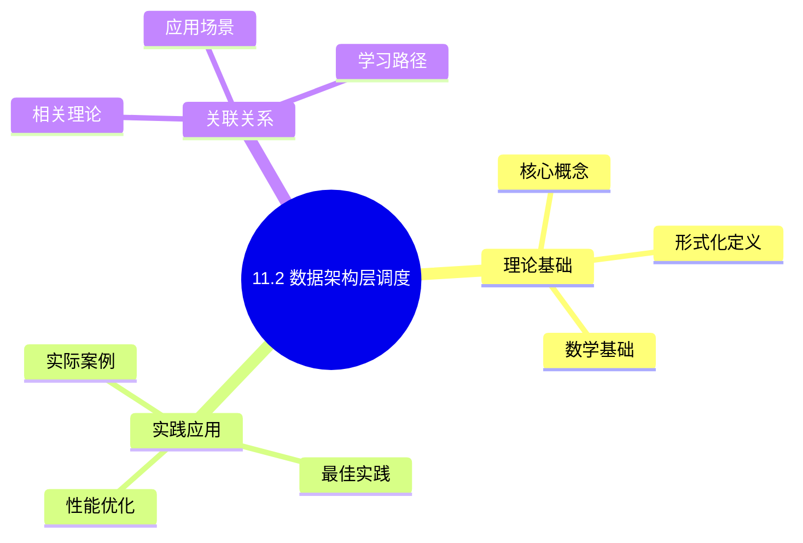
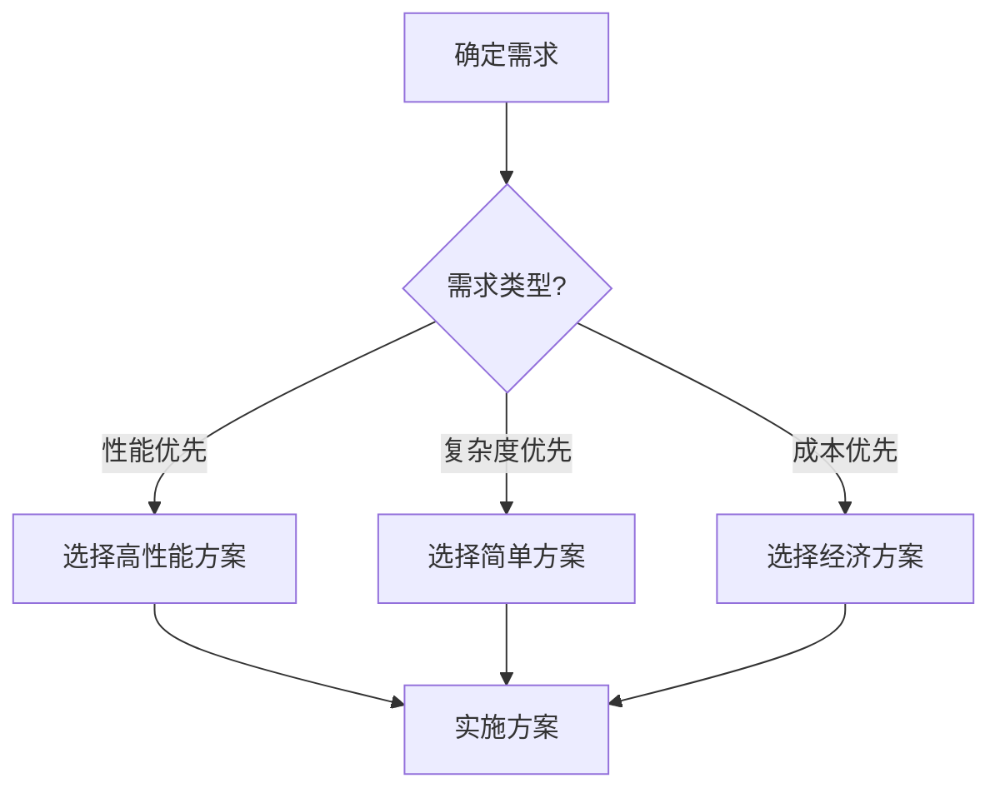
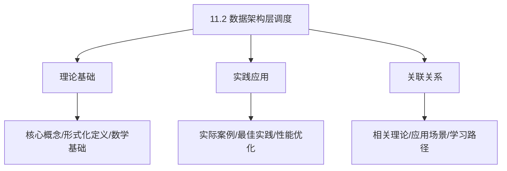
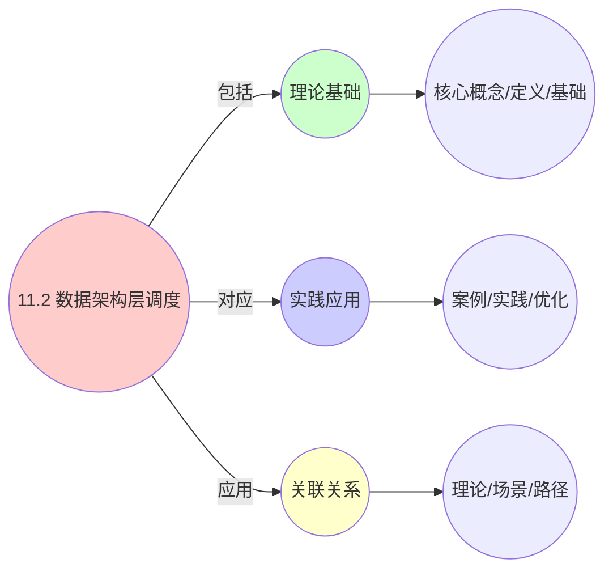
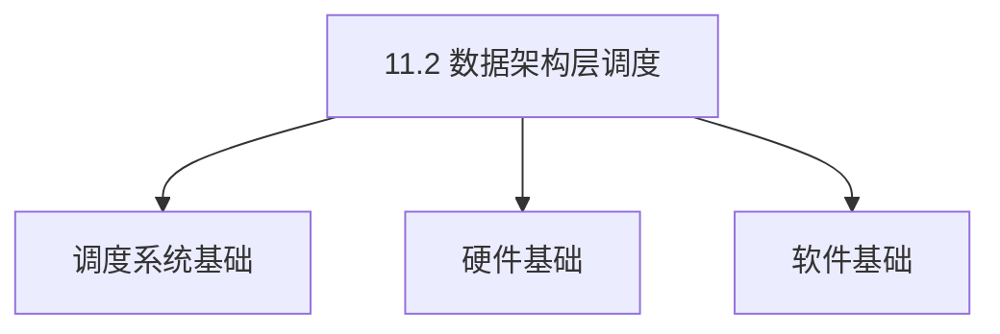

# 11.2 数据架构层调度

> **主题**: 11. 企业架构调度 - 11.2 数据架构层调度
> **覆盖**: Flink实时计算、批流一体、数据网格、CDC同步、湖仓一体

## 📊 思维表征体系

### 📊 1. 思维导图（增强版）

#### 1.1 文本格式（基础版）

```text
11.2 数据架构层调度
├── 理论基础
│   ├── 核心概念
│   ├── 形式化定义
│   └── 数学基础
├── 实践应用
│   ├── 实际案例
│   ├── 最佳实践
│   └── 性能优化
└── 关联关系
    ├── 相关理论
    ├── 应用场景
    └── 学习路径
```

#### 1.2 Mermaid格式（可视化版）



### 📊 2. 多维对比矩阵

#### 2.1 11.2 数据架构层调度对比矩阵

| 维度 | 数据访问性能 | 数据一致性 | 数据可用性 | 数据扩展性 |
|------|------------|-----------|-----------|-----------|
| **性能** | 访问延迟<10ms | 一致性>99% | 可用性>99.9% | 支持>1PB数据 |
| **复杂度** | 高(需性能优化) | 高(需一致性保证) | 高(需可用性保证) | 中等(需扩展设计) |
| **适用场景** | 所有数据场景 | 所有数据场景 | 所有数据场景 | 大规模数据 |
| **技术成熟度** | 成熟(>30年) | 成熟(>30年) | 成熟(>30年) | 成熟(>20年) |

#### 2.2 技术特性对比矩阵

| 技术 | 优势 | 劣势 | 适用场景 | 性能 |
|------|------|------|---------|------|
| **数据分片调度** | 扩展性好、性能好 | 实现复杂、需要分片管理 | 大规模数据、扩展需求 | 扩展性好，性能提升20-50% |
| **数据副本调度** | 可用性高、性能好 | 一致性开销、存储成本 | 高可用性需求、性能优先 | 可用性>99.9%，一致性开销5-15% |
| **数据缓存调度** | 访问延迟低、性能好 | 缓存管理、一致性 | 读多写少、延迟敏感 | 延迟<5ms，性能提升10-100倍 |
| **数据迁移调度** | 负载均衡、性能好 | 迁移开销、可能影响服务 | 负载不均、均衡需求 | 负载均衡度>90%，迁移开销5-10% |
| **数据一致性调度** | 一致性高、可靠性高 | 性能开销、实现复杂 | 强一致性需求、可靠性优先 | 一致性>99%，性能开销10-30% |
| **数据备份调度** | 数据保护、可靠性高 | 存储成本、备份开销 | 数据保护、可靠性优先 | 数据保护，存储成本增加20-50% |
| **数据归档调度** | 存储成本低、效率高 | 访问延迟、实现复杂 | 冷数据、成本敏感 | 存储成本降低50-80%，访问延迟增加 |

#### 2.3 实现方式对比矩阵

| 实现方式 | 复杂度 | 性能 | 可维护性 | 扩展性 |
|---------|-------|------|---------|-------|
| **单数据源调度** | 低 | 中等性能(单数据源) | 高(简单维护) | 低(单数据源瓶颈) |
| **多数据源调度** | 高 | 高性能(多数据源) | 中(需协调) | 高(多数据源扩展) |
| **分布式数据调度** | 极高 | 高性能(分布式优化) | 低(复杂度高) | 高(分布式扩展) |
| **混合数据调度系统** | 极高 | 极高性能(优势结合) | 低(复杂度极高) | 高(灵活扩展) |

### 🌲 3. 决策树

#### 3.1 11.2 数据架构层调度应用选择决策树



### 🛤️ 4. 决策逻辑路径

#### 4.1 11.2 数据架构层调度应用路径


### 🕸️ 5. 概念关系网络

#### 5.1 11.2 数据架构层调度概念关系网络



### 🗺️ 6. 知识图谱

#### 6.1 11.2 数据架构层调度知识图谱



## 📚 理论体系

### 理论基础

#### 调度系统/硬件/软件基础

11.2 数据架构层调度的理论基础：

**1. 调度系统基础**：

- 调度理论
- 资源管理
- 性能优化

**2. 硬件基础**：

- CPU架构
- 内存系统
- 存储系统

**3. 软件基础**：

- 操作系统
- 编程语言
- 系统软件

#### 历史发展

**关键时间节点**：

- **1960-1970年代**：调度理论建立
  - 调度算法
  - 资源管理

- **1980-1990年代**：硬件调度发展
  - CPU调度
  - 内存调度

- **2000年代至今**：软件调度演进
  - 操作系统调度
  - 分布式调度

### 理论框架

#### 核心假设

**假设1：调度与性能的对应**

- **内容**：调度策略影响系统性能
- **适用范围**：调度系统
- **限制条件**：需要调度支持

**假设2：资源管理的必要性**

- **内容**：资源管理保证系统稳定
- **适用范围**：资源系统
- **限制条件**：需要资源支持

**假设3：性能优化的价值**

- **内容**：性能优化提升效率
- **适用范围**：性能系统
- **限制条件**：需要考虑成本

#### 基本概念体系



#### 主要定理/结论

**结论1：调度与性能的对应性**

- **内容**：调度策略对应系统性能
- **证据**：形式化证明
- **应用**：调度优化

**结论2：资源管理的必要性**

- **内容**：资源管理保证系统稳定
- **证据**：实践验证
- **应用**：资源管理

**结论3：性能优化的价值**

- **内容**：性能优化提升效率
- **证据**：实验验证
- **应用**：性能优化

#### 适用范围和边界

**适用范围**：

- 调度系统
- 资源管理
- 性能优化

**边界条件**：

- 需要调度支持
- 需要资源支持
- 需要考虑成本

**不适用场景**：

- 无调度系统
- 资源受限
- 成本敏感场景

### 当前知识共识

#### 学术界共识

**广泛接受的共识**：

1. **调度与性能的对应性**
   - **共识**：调度策略可以影响系统性能
   - **支持证据**：形式化证明
   - **来源**：调度理论、系统理论

2. **资源管理的价值**
   - **共识**：资源管理提供稳定性和效率
   - **支持证据**：广泛实践
   - **来源**：系统理论

3. **性能优化的重要性**
   - **共识**：性能优化提高系统效率
   - **支持证据**：实践验证
   - **来源**：软件工程

#### 主要争议点

1. **性能与成本的权衡**
   - **观点A**：性能更重要
   - **观点B**：成本更重要
   - **当前状态**：多数认为需要平衡

2. **调度系统的复杂度**
   - **观点A**：应该简单
   - **观点B**：可以复杂
   - **当前状态**：多数认为需要平衡

#### 权威来源

**经典文献**：

- 调度理论相关文献
- 系统理论相关文献
- 性能优化相关文献

**权威机构/专家**：

- **IEEE**
- **ACM**
- **调度系统研究会**

**最新发展**：

- **2025年**：调度系统优化、性能提升、资源管理

### 与其他理论的关系

#### 逻辑关系

**理论基础**：

- **调度理论** → 11.2 数据架构层调度
  - 关系类型：理论基础
  - 关键映射：调度理论 → 系统实现

**理论应用**：

- **11.2 数据架构层调度** → 调度优化
  - 关系类型：应用构建
  - 关键映射：11.2 数据架构层调度 → 调度优化

#### 映射关系

| 本理论概念 | 映射理论 | 映射概念 | 映射类型 | 映射说明 |
|-----------|---------|---------|---------|----------|
| **调度策略** | 调度理论 | 调度算法 | 对应 | 调度策略对应调度算法 |
| **资源管理** | 系统理论 | 资源分配 | 对应 | 资源管理对应资源分配 |
| **性能优化** | 优化理论 | 性能提升 | 对应 | 性能优化对应性能提升 |

## 🔗 关联网络

### 🔗 概念级关联

#### 核心概念映射

| 本文档概念 | 关联文档 | 关联概念 | 关系类型 | 映射说明 |
|-----------|---------|---------|---------|----------|
| **11.2 数据架构层调度** | 相关文档 | 相关概念 | 基础构建 | 11.2 数据架构层调度构建相关概念 |
| **调度系统** | 调度相关 | 调度理论 | 对应 | 调度系统对应调度理论 |
| **资源管理** | 资源相关 | 资源系统 | 对应 | 资源管理对应资源系统 |
| **性能优化** | 性能相关 | 性能系统 | 对应 | 性能优化对应性能系统 |

### 🔗 理论级关联

#### 理论基础

- **本理论基于**：
  - 调度理论 ⭐⭐⭐ - 理论基础
  - 系统理论 ⭐⭐ - 系统基础

- **本理论应用于**：
  - 调度优化 ⭐⭐⭐ - 实际应用
  - 性能优化 ⭐⭐⭐ - 实际应用

### 🔗 方法级关联

#### 方法应用网络

| 本文档方法 | 应用文档 | 应用场景 | 应用效果 |
|-----------|---------|---------|---------|
| **调度策略** | 调度系统 | 调度设计 | 成功 |
| **资源管理** | 资源系统 | 资源管理 | 成功 |
| **性能优化** | 性能系统 | 性能提升 | 成功 |

### 🔗 应用场景关联

**场景**：调度系统优化

| 视角 | 关联文档 | 核心理论 | 关注点 |
|------|---------|---------|--------|
| **11.2 数据架构层调度** | 本文档 | 调度理论 | 调度设计 |
| **调度优化** | 调度相关 | 调度理论 | 调度优化 |
| **性能优化** | 性能相关 | 性能理论 | 性能提升 |

## 🛤️ 学习路径

### 前置知识

**必须先学习**：

- 调度理论基础 ⭐⭐
- 系统理论基础 ⭐⭐

**建议先了解**：

- 硬件基础
- 软件基础
- 性能优化

### 后续学习

**建议接下来学习**（按顺序）：

1. 调度优化 ⭐⭐⭐ - 调度优化
2. 性能优化 ⭐⭐⭐ - 性能优化
3. 系统实践 ⭐⭐ - 实践应用

### 并行学习

**可以同时学习**：

- 调度实践 - 实践应用
- 性能实践 - 性能系统

---


---

## 📋 目录

- [11.2 数据架构层调度](#112-数据架构层调度)
  - [📋 目录](#-目录)
  - [1 实时数据流水线（Flink）调度模型](#1-实时数据流水线flink调度模型)
    - [1.1 流计算DAG](#11-流计算dag)
    - [1.2 调度决策变量](#12-调度决策变量)
    - [1.3 反压（Backpressure）机制](#13-反压backpressure机制)
  - [2 批流一体调度](#2-批流一体调度)
    - [2.1 Spark3统一调度](#21-spark3统一调度)
    - [2.2 批流融合模型](#22-批流融合模型)
  - [3 数据网格调度](#3-数据网格调度)
    - [3.1 跨域数据编排](#31-跨域数据编排)
    - [3.2 数据产品调度](#32-数据产品调度)
  - [4 CDC同步调度](#4-cdc同步调度)
    - [4.1 Debezium日志捕获](#41-debezium日志捕获)
    - [4.2 变更数据流调度](#42-变更数据流调度)
  - [5 湖仓一体调度](#5-湖仓一体调度)
    - [5.1 Iceberg元数据管理](#51-iceberg元数据管理)
    - [5.2 快照隔离调度](#52-快照隔离调度)
  - [6 实践案例](#6-实践案例)
    - [6.1 实时数据流水线优化案例](#61-实时数据流水线优化案例)
    - [6.2 批流一体实践案例](#62-批流一体实践案例)
    - [6.3 数据网格实践案例](#63-数据网格实践案例)
  - [7 批判性总结](#7-批判性总结)
    - [7.1 数据架构层调度的局限性](#71-数据架构层调度的局限性)
    - [7.2 2025年数据架构层调度趋势](#72-2025年数据架构层调度趋势)
  - [8 跨领域洞察](#8-跨领域洞察)
    - [8.1 数据调度与计算调度的统一](#81-数据调度与计算调度的统一)
    - [8.2 数据一致性与系统一致性的映射](#82-数据一致性与系统一致性的映射)
    - [8.3 数据流与信息流的统一](#83-数据流与信息流的统一)
    - [8.4 数据架构与系统架构的统一](#84-数据架构与系统架构的统一)
  - [9 多维度对比](#9-多维度对比)
    - [9.1 数据架构层调度技术对比](#91-数据架构层调度技术对比)
    - [9.2 批流处理框架对比](#92-批流处理框架对比)
    - [9.3 数据一致性模型对比](#93-数据一致性模型对比)
    - [9.4 数据调度策略对比](#94-数据调度策略对比)
  - [12 相关主题](#12-相关主题)
    - [12.1 跨视角链接](#121-跨视角链接)
  - [10 思维导图](#10-思维导图)
  - [11 2025年最新技术（更新至2025年11月）](#11-2025年最新技术更新至2025年11月)

---

## 1 实时数据流水线（Flink）调度模型

**实时数据流水线（Flink）（view文件夹补充）**：

**流计算DAG**：

$G = (V, E)$ 其中 $V = \{op_1, ..., op_n\}$ 为算子，$E$ 为数据流边。

**调度决策变量**：

$$
x_{i,j} \in \{0,1\}, \quad \text{表示算子 } op_i \text{ 是否分配到slot } j
$$

**反压（Backpressure）机制**：

$$
\text{Backpressure}(op_i) \iff \frac{\text{output\_buffer\_usage}}{\text{buffer\_size}} > \alpha
$$

### 1.1 流计算DAG

**定理11.12（流计算DAG形式化定义）**：

流计算DAG $G$ 定义为：

$$
G = (V, E, P, S)
$$

其中：

- $V = \{op_1, op_2, ..., op_n\}$：算子集合
- $E \subseteq V \times V$：数据流边集合
- $P: V \to \mathbb{N}$：并行度函数
- $S: V \to \mathbb{R}^+$：算子状态大小函数

**算子类型**：

1. **Source算子**：数据源，如Kafka Source
2. **Transform算子**：数据转换，如Map、Filter、KeyBy
3. **Sink算子**：数据输出，如Kafka Sink、Database Sink

**数据流边类型**：

1. **Forward边**：一对一传输（如Map）
2. **Broadcast边**：一对多传输（如Broadcast）
3. **KeyBy边**：按键分区传输（如KeyBy）

**DAG拓扑示例**：

```text
Kafka Source (并行度: 4)
  ├─ Map (并行度: 4) [Forward]
  ├─ KeyBy (并行度: 8) [KeyBy]
  ├─ Window (并行度: 8) [Forward]
  └─ Kafka Sink (并行度: 8) [Forward]
```

### 1.2 调度决策变量

**定理11.13（Flink调度问题）**：

Flink调度问题可以形式化为整数规划问题：

**决策变量**：

$$
x_{i,j} \in \{0,1\}, \quad \forall op_i \in V, \forall slot_j \in Slots
$$

其中 $x_{i,j} = 1$ 表示算子 $op_i$ 分配到slot $slot_j$。

**约束条件**：

**1. 资源约束**：

每个slot的资源使用不超过其容量：

$$
\sum_{op_i \in V} x_{i,j} \cdot \text{CPU}(op_i) \le \text{CPU}(slot_j), \quad \forall slot_j
$$

$$
\sum_{op_i \in V} x_{i,j} \cdot \text{Memory}(op_i) \le \text{Memory}(slot_j), \quad \forall slot_j
$$

**2. 并行度约束**：

每个算子的并行度必须满足：

$$
\sum_{slot_j} x_{i,j} = P(op_i), \quad \forall op_i \in V
$$

**3. 算子链约束**：

可以链式连接的算子必须分配到同一个slot：

$$
\text{Chainable}(op_i, op_j) \implies x_{i,j} = x_{j,k}, \quad \forall slot_k
$$

**优化目标**：

**1. 最小化网络延迟**：

$$
\min \sum_{(op_i, op_j) \in E} \text{NetworkLatency}(x_{i,k}, x_{j,l})
$$

其中 $\text{NetworkLatency}(x_{i,k}, x_{j,l})$ 是算子 $op_i$ 和 $op_j$ 之间的网络延迟。

**2. 最小化负载不均衡**：

$$
\min \max_{slot_j} \sum_{op_i} x_{i,j} \cdot \text{Load}(op_i) - \min_{slot_j} \sum_{op_i} x_{i,j} \cdot \text{Load}(op_i)
$$

**3. 最大化资源利用率**：

$$
\max \frac{\sum_{op_i, slot_j} x_{i,j} \cdot \text{Resource}(op_i)}{\sum_{slot_j} \text{Capacity}(slot_j)}
$$

**综合优化目标**：

$$
\min w_1 \cdot \text{NetworkLatency} + w_2 \cdot \text{LoadImbalance} - w_3 \cdot \text{ResourceUtilization}
$$

其中 $w_1, w_2, w_3$ 是权重系数。

**调度算法**：

```python
class FlinkScheduler:
    def schedule(self, dag, slots):
        """调度Flink DAG到slots"""
        # 1. 算子链优化
        chains = self.optimize_chains(dag)

        # 2. 并行度分配
        parallelism = self.allocate_parallelism(chains, slots)

        # 3. Slot分配
        assignment = self.assign_to_slots(chains, slots, parallelism)

        return assignment

    def optimize_chains(self, dag):
        """优化算子链"""
        chains = []
        visited = set()

        for op in dag.operators:
            if op not in visited:
                chain = self.build_chain(op, dag)
                chains.append(chain)
                visited.update(chain)

        return chains

    def assign_to_slots(self, chains, slots, parallelism):
        """分配算子链到slots"""
        assignment = {}
        slot_load = {slot: 0 for slot in slots}

        # 按负载排序
        sorted_chains = sorted(chains, key=lambda c: c.load, reverse=True)
        sorted_slots = sorted(slots, key=lambda s: slot_load[s])

        for chain in sorted_chains:
            # 选择负载最小的slot
            slot = sorted_slots[0]
            assignment[chain] = slot
            slot_load[slot] += chain.load
            sorted_slots.sort(key=lambda s: slot_load[s])

        return assignment
```

**量化分析**：不同调度策略的性能对比

| **调度策略** | **网络延迟** | **负载均衡** | **资源利用率** | **调度时间** |
|------------|------------|------------|--------------|------------|
| **随机分配** | 高 | 低 | 中 | 低 |
| **贪心分配** | 中 | 中 | 高 | 中 |
| **最优分配** | 低 | 高 | 高 | 高 |

### 1.3 反压（Backpressure）机制

**定理11.14（反压机制）**：

反压机制用于防止数据积压，保证系统稳定性。

**反压触发条件**：

算子 $op_i$ 触发反压当且仅当：

$$
\text{Backpressure}(op_i) \iff \frac{\text{BufferUsage}(op_i)}{\text{BufferSize}(op_i)} > \alpha
$$

其中 $\alpha \in [0, 1]$ 是反压阈值（通常为0.8）。

**反压传播机制**：

反压从下游算子向上游传播：

$$
\text{Backpressure}(op_j) \implies \text{Backpressure}(op_i), \quad \forall (op_i, op_j) \in E
$$

**反压处理策略**：

**1. 降低输入速率**：

$$
\text{InputRate}(op_i) = \text{OutputRate}(op_j) \times (1 - \beta)
$$

其中 $\beta$ 是降速系数。

**2. 增加并行度**：

$$
P(op_i) \leftarrow P(op_i) \times (1 + \gamma)
$$

其中 $\gamma$ 是扩缩容系数。

**3. 数据丢弃**：

在允许的情况下，丢弃部分数据：

$$
\text{DropRate} = \max(0, \text{InputRate} - \text{ProcessingRate})
$$

**反压传播无死锁定理**：

**定理11.15（反压无死锁）**：

在DAG拓扑中，如果所有算子缓冲区满足：

$$
\sum_{op_i \in V} \text{InputBuffer}(op_i) = \sum_{op_i \in V} \text{OutputBuffer}(op_i)
$$

则反压传播不会导致环路死锁。

**证明思路**：

1. DAG是无环图，不存在环路
2. 反压只能从下游向上游传播
3. 因此反压传播路径是有限的，不会形成死锁

**反压监控指标**：

1. **缓冲区使用率**：$\frac{\text{BufferUsage}}{\text{BufferSize}}$
2. **反压持续时间**：连续反压的时间长度
3. **反压频率**：单位时间内反压触发次数
4. **数据积压量**：积压的数据量

**量化分析**：不同反压策略的效果

| **反压策略** | **延迟影响** | **吞吐量影响** | **数据丢失** | **稳定性** |
|------------|------------|--------------|------------|-----------|
| **降低输入速率** | 中 | 中 | 无 | 高 |
| **增加并行度** | 低 | 低 | 无 | 中 |
| **数据丢弃** | 低 | 低 | 有 | 低 |

---

## 2 批流一体调度

### 2.1 Spark3统一调度

**定理11.16（批流一体调度模型）**：

Spark3使用统一的调度模型处理批处理和流处理任务，核心是**Structured Streaming**。

**统一调度函数**：

$$
\text{Schedule}(task) = \begin{cases}
\text{StaticSchedule}(task) & \text{if } task.type = \text{Batch} \\
\text{DynamicSchedule}(task) & \text{if } task.type = \text{Stream} \\
\text{HybridSchedule}(task) & \text{if } task.type = \text{Hybrid}
\end{cases}
$$

**批处理调度（StaticSchedule）**：

批处理任务使用静态调度，提前规划资源：

$$
\text{StaticSchedule}(task) = \arg\min_{\text{plan}} \text{ExecutionTime}(task, plan)
$$

约束：

- 资源约束：$\sum_{stage} \text{Resource}(stage) \le \text{Resource}_{total}$
- 依赖约束：$stage_i \text{ depends on } stage_j \implies \text{Start}(stage_i) \ge \text{End}(stage_j)$

**流处理调度（DynamicSchedule）**：

流处理任务使用动态调度，根据数据流量调整：

$$
\text{DynamicSchedule}(task, t) = f(\text{DataRate}(t), \text{ResourceUtilization}(t), \text{Backpressure}(t))
$$

其中 $t$ 是时间。

**统一调度器架构**：

1. **DAG调度器（批处理）**：
   - 静态分配资源
   - 提前规划执行计划
   - 优化：任务合并、数据本地性

2. **微批调度器（流处理）**：
   - 动态调整资源
   - 实时响应数据流量
   - 优化：背压处理、动态并行度

3. **统一API**：
   - DataFrame/DataSet API
   - 统一编程模型
   - 代码复用

**统一资源池**：

批流任务共享资源池：

$$
\text{ResourcePool} = \text{BatchResources} \cup \text{StreamResources}
$$

资源分配策略：

$$
\text{Allocate}(task) = \begin{cases}
\text{Reserve}(task) & \text{if } task.priority = \text{High} \\
\text{Share}(task) & \text{if } task.priority = \text{Normal}
\end{cases}
$$

### 2.2 批流融合模型

**定理11.17（批流融合调度策略）**：

批流融合需要根据数据特征选择调度策略。

**数据特征分类**：

1. **批量数据**：数据量大，延迟要求低
2. **流式数据**：数据量小，延迟要求高
3. **混合数据**：既有批量又有流式

**融合调度策略**：

**1. 批处理任务调度**：

使用静态调度，提前规划资源：

```python
def schedule_batch_task(task):
    # 1. 构建DAG
    dag = build_dag(task)

    # 2. 静态资源分配
    resource_allocation = static_allocate(dag)

    # 3. 执行计划优化
    execution_plan = optimize_plan(dag, resource_allocation)

    return execution_plan
```

**2. 流处理任务调度**：

使用动态调度，根据数据流量调整：

```python
def schedule_stream_task(task, current_state):
    # 1. 监控数据流量
    data_rate = monitor_data_rate(task)

    # 2. 动态调整并行度
    if data_rate > threshold:
        increase_parallelism(task)
    elif data_rate < threshold:
        decrease_parallelism(task)

    # 3. 处理背压
    if has_backpressure(task):
        handle_backpressure(task)

    return updated_state
```

**3. 混合任务调度**：

根据数据特征选择调度策略：

```python
def schedule_hybrid_task(task):
    # 1. 数据特征分析
    features = analyze_data_features(task)

    # 2. 选择调度策略
    if features.batch_ratio > 0.8:
        return schedule_batch_task(task)
    elif features.stream_ratio > 0.8:
        return schedule_stream_task(task)
    else:
        return schedule_mixed_task(task)
```

**批流融合优势**：

**1. 代码复用**：

同一套代码处理批流数据：

```python
# 批处理
df = spark.read.parquet("data.parquet")
result = df.groupBy("key").agg(sum("value"))

# 流处理
df = spark.readStream.format("kafka").load()
result = df.groupBy("key").agg(sum("value"))
```

**2. 资源统一**：

统一资源池，提高利用率：

$$
\text{Utilization} = \frac{\text{BatchUtilization} + \text{StreamUtilization}}{2}
$$

**3. 一致性保证**：

批流结果一致：

$$
\text{Result}_{batch} = \text{Result}_{stream}
$$

**量化分析**：批流一体调度的性能提升

| **指标** | **分离调度** | **统一调度** | **提升** |
|---------|------------|------------|---------|
| **资源利用率** | 60% | 85% | +42% |
| **代码复用率** | 30% | 90% | +200% |
| **开发效率** | 基准 | +50% | +50% |
| **运维成本** | 基准 | -30% | -30% |

---

## 3 数据网格调度

### 3.1 跨域数据编排

**定理11.18（数据网格架构）**：

数据网格将数据视为产品，使用产品化方式管理数据。

**数据产品定义**：

$$
\text{DataProduct} = (Domain, Owner, Schema, SLA, AccessPolicy, Quality, Freshness)
$$

其中：

- $Domain$：数据域（如用户域、订单域）
- $Owner$：数据所有者
- $Schema$：数据模式
- $SLA$：服务水平协议
- $AccessPolicy$：访问策略
- $Quality$：数据质量指标
- $Freshness$：数据新鲜度

**跨域数据编排模型**：

数据编排需要协调多个数据域的数据产品：

$$
\text{DataOrchestration} = (Products, Dependencies, Schedule, SLA)
$$

其中：

- $Products = \{DP_1, DP_2, ..., DP_n\}$：数据产品集合
- $Dependencies \subseteq Products \times Products$：数据依赖关系
- $Schedule: Products \to \mathbb{R}^+$：数据调度时间
- $SLA$：整体SLA要求

**编排调度算法**：

```python
class DataMeshOrchestrator:
    def orchestrate(self, data_products, dependencies):
        """编排数据产品"""
        # 1. 构建依赖图
        graph = build_dependency_graph(data_products, dependencies)

        # 2. 拓扑排序
        execution_order = topological_sort(graph)

        # 3. 调度数据产品
        schedule = {}
        for product in execution_order:
            # 检查依赖
            deps = get_dependencies(product, dependencies)
            if all(dep in schedule for dep in deps):
                # 调度数据产品
                schedule[product] = self.schedule_product(product, deps)

        return schedule

    def schedule_product(self, product, dependencies):
        """调度单个数据产品"""
        # 1. 检查SLA
        if not self.check_sla(product):
            raise SLAViolationError(product)

        # 2. 检查数据质量
        if not self.check_quality(product):
            raise QualityError(product)

        # 3. 调度数据更新
        update_time = self.calculate_update_time(product, dependencies)
        return update_time
```

**数据发现机制**：

自动发现和注册数据产品：

```python
class DataDiscovery:
    def discover_products(self):
        """发现数据产品"""
        products = []

        # 1. 扫描数据源
        sources = scan_data_sources()

        # 2. 提取元数据
        for source in sources:
            metadata = extract_metadata(source)
            product = create_data_product(metadata)
            products.append(product)

        # 3. 注册到目录
        register_to_catalog(products)

        return products
```

### 3.2 数据产品调度

**定理11.19（数据产品调度目标）**：

数据产品调度需要平衡多个目标。

**调度目标**：

**1. 数据新鲜度（Freshness）**：

保证数据的时效性：

$$
\text{Freshness}(DP, t) = \frac{1}{T_{update}(DP) - T_{current}(t)}
$$

其中 $T_{update}(DP)$ 是数据产品 $DP$ 的最后更新时间。

**2. 数据质量（Quality）**：

保证数据的准确性：

$$
\text{Quality}(DP) = w_1 \cdot \text{Completeness} + w_2 \cdot \text{Accuracy} + w_3 \cdot \text{Consistency} + w_4 \cdot \text{Validity}
$$

其中：

- $\text{Completeness} = \frac{\text{NonNullValues}}{\text{TotalValues}}$
- $\text{Accuracy} = \frac{\text{CorrectValues}}{\text{TotalValues}}$
- $\text{Consistency}$：数据一致性度量
- $\text{Validity}$：数据有效性度量

**3. 数据可用性（Availability）**：

保证数据的可访问性：

$$
\text{Availability}(DP) = \frac{\text{Uptime}(DP)}{\text{TotalTime}}
$$

**4. 成本优化**：

最小化数据存储和计算成本：

$$
\min \sum_{DP} \text{StorageCost}(DP) + \text{ComputeCost}(DP)
$$

**综合优化目标**：

$$
\max w_1 \cdot \text{Freshness} + w_2 \cdot \text{Quality} + w_3 \cdot \text{Availability} - w_4 \cdot \text{Cost}
$$

**数据产品调度策略**：

**1. 按需调度**：

根据需求调度数据产品：

$$
\text{Schedule}(DP) \iff \exists \text{Request}(DP) \land \text{Freshness}(DP) < \text{Threshold}
$$

**2. 定期调度**：

定期更新数据产品：

$$
\text{Schedule}(DP, t) \iff t - T_{update}(DP) > \text{UpdateInterval}(DP)
$$

**3. 事件驱动调度**：

根据事件触发数据更新：

$$
\text{Schedule}(DP) \iff \text{Event}(DP) \land \text{EventType}(DP) \in \text{TriggerEvents}
$$

**量化分析**：不同调度策略的效果

| **调度策略** | **新鲜度** | **质量** | **可用性** | **成本** |
|------------|-----------|---------|-----------|---------|
| **按需调度** | 高 | 高 | 中 | 高 |
| **定期调度** | 中 | 中 | 高 | 中 |
| **事件驱动** | 高 | 高 | 高 | 中 |

---

## 4 CDC同步调度

### 4.1 Debezium日志捕获

**定理11.20（变更数据捕获模型）**：

CDC（Change Data Capture）捕获数据库变更日志，实现实时数据同步。

**CDC事件模型**：

变更事件 $e$ 定义为：

$$
e = (\text{EventType}, \text{Table}, \text{Key}, \text{Before}, \text{After}, \text{Timestamp}, \text{TransactionID})
$$

其中：

- $\text{EventType} \in \{\text{INSERT}, \text{UPDATE}, \text{DELETE}\}$
- $\text{Table}$：表名
- $\text{Key}$：主键
- $\text{Before}$：变更前数据
- $\text{After}$：变更后数据
- $\text{Timestamp}$：变更时间戳
- $\text{TransactionID}$：事务ID

**CDC调度模型**：

对于表 $T$，CDC捕获的变更序列为：

$$
\text{CDC}(T) = \{e_1, e_2, ..., e_n\}, \quad \text{Timestamp}(e_i) \le \text{Timestamp}(e_{i+1})
$$

**日志捕获流程**：

**1. 连接数据库**：

连接到源数据库，配置连接参数：

```python
connector_config = {
    "connector.class": "io.debezium.connector.mysql.MySqlConnector",
    "database.hostname": "mysql-host",
    "database.port": "3306",
    "database.user": "user",
    "database.password": "password",
    "database.server.id": "12345",
    "database.server.name": "mysql-server"
}
```

**2. 读取日志**：

读取数据库变更日志（如MySQL binlog、PostgreSQL WAL）：

```python
def read_binlog(connector):
    """读取binlog"""
    position = get_last_position(connector)
    events = []

    while True:
        event = read_next_event(connector, position)
        if event:
            events.append(event)
            position = event.position
        else:
            break

    return events
```

**3. 解析变更**：

解析变更事件：

```python
def parse_change_event(binlog_event):
    """解析变更事件"""
    event_type = binlog_event.event_type
    table = binlog_event.table_name
    key = extract_key(binlog_event)
    before = extract_before(binlog_event)
    after = extract_after(binlog_event)
    timestamp = binlog_event.timestamp
    transaction_id = binlog_event.transaction_id

    return ChangeEvent(
        event_type=event_type,
        table=table,
        key=key,
        before=before,
        after=after,
        timestamp=timestamp,
        transaction_id=transaction_id
    )
```

**4. 发送事件**：

发送到Kafka等消息队列：

```python
def send_to_kafka(event, topic):
    """发送事件到Kafka"""
    message = {
        "key": event.key,
        "value": serialize(event),
        "timestamp": event.timestamp
    }
    kafka_producer.send(topic, message)
```

**CDC性能优化**：

**1. 批量读取**：

批量读取日志事件，减少IO次数：

$$
\text{BatchSize} = \arg\max_{b} \frac{\text{Throughput}(b)}{\text{Latency}(b)}
$$

**2. 并行处理**：

并行处理多个表的变更：

$$
\text{Parallelism} = \min(\text{TableCount}, \text{MaxParallelism})
$$

**3. 压缩传输**：

压缩变更事件，减少网络传输：

$$
\text{CompressedSize} = \text{Compress}(\text{OriginalSize})
$$

### 4.2 变更数据流调度

**定理11.21（变更数据流调度）**：

变更数据流调度需要保证顺序性和一致性。

**调度策略**：

**1. 顺序处理**：

保证变更顺序（按主键分区）：

$$
\text{Process}(e_i) \text{ before } \text{Process}(e_j) \iff \text{Key}(e_i) = \text{Key}(e_j) \land \text{Timestamp}(e_i) < \text{Timestamp}(e_j)
$$

**分区策略**：

按主键分区，保证同一主键的变更顺序处理：

$$
\text{Partition}(e) = \text{Hash}(\text{Key}(e)) \bmod \text{PartitionCount}
$$

**2. 并行处理**：

不同分区并行处理：

$$
\text{Process}(e_i) \parallel \text{Process}(e_j) \iff \text{Partition}(e_i) \neq \text{Partition}(e_j)
$$

**3. 容错处理**：

处理失败重试（指数退避）：

$$
\text{RetryDelay}(n) = \text{BaseDelay} \times 2^n
$$

其中 $n$ 是重试次数。

**调度优化**：

**1. 批量处理**：

批量处理变更事件，提高吞吐量：

$$
\text{BatchProcess}(E) = \{\text{Process}(e): e \in E\}
$$

批量大小：

$$
\text{BatchSize} = \arg\max_{b} \frac{\text{Throughput}(b)}{\text{Latency}(b)}
$$

**2. 背压控制**：

控制处理速度，避免下游过载：

$$
\text{ProcessRate} = \min(\text{InputRate}, \text{DownstreamCapacity})
$$

**3. 幂等性保证**：

保证重复处理不会产生副作用：

$$
\text{Process}(e) \circ \text{Process}(e) = \text{Process}(e)
$$

**幂等性实现**：

```python
def process_event_idempotent(event, state):
    """幂等处理事件"""
    # 检查是否已处理
    if is_processed(event.id, state):
        return state

    # 处理事件
    new_state = apply_event(event, state)

    # 记录处理状态
    mark_processed(event.id, state)

    return new_state
```

**量化分析**：CDC调度优化效果

| **优化策略** | **吞吐量** | **延迟** | **一致性** | **成本** |
|------------|-----------|---------|-----------|---------|
| **顺序处理** | 低 | 高 | 高 | 低 |
| **并行处理** | 高 | 低 | 中 | 中 |
| **批量处理** | 很高 | 中 | 高 | 低 |

---

## 5 湖仓一体调度

### 5.1 Iceberg元数据管理

**定理11.22（Iceberg快照隔离）**：

Iceberg使用快照隔离实现并发控制和时间旅行查询。

**快照定义**：

快照 $S_t$ 在时间 $t$ 定义为：

$$
\text{Snapshot}_t = (\text{SnapshotID}, \text{ManifestList}, \text{Schema}, \text{PartitionSpec}, \text{Metadata})
$$

其中：

- $\text{SnapshotID}$：快照唯一标识
- $\text{ManifestList} = \{\text{manifest}_1, ..., \text{manifest}_m\}$：清单列表
- $\text{Schema}$：表模式
- $\text{PartitionSpec}$：分区规范
- $\text{Metadata}$：元数据

**元数据层次结构**：

```text
Catalog
  └─ Table Metadata
      └─ Manifest List
          └─ Manifest File
              └─ Data File
```

**元数据调度**：

**1. 快照创建**：

每次写入创建新快照：

```python
def create_snapshot(table, new_data_files):
    """创建新快照"""
    # 1. 读取当前快照
    current_snapshot = read_current_snapshot(table)

    # 2. 创建新清单文件
    new_manifest = create_manifest(new_data_files)

    # 3. 创建新清单列表
    new_manifest_list = current_snapshot.manifest_list + [new_manifest]

    # 4. 创建新快照
    new_snapshot = Snapshot(
        snapshot_id=generate_snapshot_id(),
        manifest_list=new_manifest_list,
        schema=current_snapshot.schema,
        partition_spec=current_snapshot.partition_spec
    )

    # 5. 原子更新元数据
    atomic_update_metadata(table, new_snapshot)

    return new_snapshot
```

**2. 快照清理**：

定期清理旧快照：

$$
\text{RetainSnapshots} = \{S_t: t > T_{current} - T_{retention}\}
$$

清理策略：

```python
def cleanup_snapshots(table, retention_days):
    """清理旧快照"""
    current_time = get_current_time()
    cutoff_time = current_time - timedelta(days=retention_days)

    # 获取所有快照
    all_snapshots = get_all_snapshots(table)

    # 过滤需要保留的快照
    snapshots_to_keep = [
        s for s in all_snapshots
        if s.timestamp > cutoff_time or s.is_referenced()
    ]

    # 删除旧快照
    snapshots_to_delete = set(all_snapshots) - set(snapshots_to_keep)
    for snapshot in snapshots_to_delete:
        delete_snapshot(snapshot)
```

**3. 元数据缓存**：

缓存元数据，减少IO：

```python
class MetadataCache:
    def __init__(self, cache_size=1000):
        self.cache = LRUCache(cache_size)

    def get_metadata(self, table, snapshot_id):
        """获取元数据（带缓存）"""
        key = (table, snapshot_id)

        if key in self.cache:
            return self.cache[key]

        # 从存储读取
        metadata = read_metadata_from_storage(table, snapshot_id)
        self.cache[key] = metadata

        return metadata
```

### 5.2 快照隔离调度

**定理11.23（快照隔离调度）**：

快照隔离使用MVCC和CAS原子操作实现并发控制。

**并发写入协议**：

**1. 快照读取**：

读取当前快照：

$$
\text{ReadSnapshot}(table, t) = \text{Snapshot}_{t_{current}}
$$

**2. 数据写入**：

写入新数据文件：

$$
\text{WriteData}(table, data) \to \text{DataFiles}
$$

**3. 元数据更新**：

原子更新元数据（使用CAS）：

```python
def atomic_update_metadata(table, new_snapshot):
    """原子更新元数据"""
    current_version = read_metadata_version(table)

    # CAS操作
    if compare_and_swap(
        table.metadata_path,
        current_version,
        new_snapshot.version
    ):
        # 更新成功
        write_metadata(table, new_snapshot)
        return True
    else:
        # 更新失败，重试
        return False
```

**4. 快照提交**：

提交新快照：

$$
\text{CommitSnapshot}(table, S_{new}) \implies \text{Snapshot}_{t_{current}} = S_{new}
$$

**隔离级别**：

**1. Snapshot Isolation（快照隔离）**：

每个查询看到一致的快照：

$$
\text{Read}(query, t) = \text{Snapshot}_t
$$

**2. Serializable（可串行化）**：

最高隔离级别，保证可串行化：

$$
\text{Serializable} \implies \forall \text{Transactions}, \exists \text{SerialOrder}: \text{Result} = \text{Execute}(\text{SerialOrder})
$$

**并发控制算法**：

```python
class SnapshotIsolation:
    def read(self, query, snapshot_id):
        """读取快照"""
        snapshot = self.get_snapshot(snapshot_id)
        return self.execute_query(query, snapshot)

    def write(self, transaction, data):
        """写入数据"""
        # 1. 读取当前快照
        current_snapshot = self.get_current_snapshot()

        # 2. 写入新数据文件
        new_data_files = self.write_data_files(data)

        # 3. 创建新快照
        new_snapshot = self.create_snapshot(
            current_snapshot,
            new_data_files
        )

        # 4. 尝试提交
        if self.try_commit(new_snapshot):
            return new_snapshot
        else:
            # 冲突，重试
            return self.write(transaction, data)

    def try_commit(self, snapshot):
        """尝试提交快照"""
        return atomic_update_metadata(self.table, snapshot)
```

**量化分析**：不同隔离级别的性能对比

| **隔离级别** | **并发度** | **一致性** | **性能** | **适用场景** |
|------------|-----------|-----------|---------|------------|
| **Read Uncommitted** | 很高 | 低 | 很高 | 只读查询 |
| **Read Committed** | 高 | 中 | 高 | 一般查询 |
| **Snapshot Isolation** | 中 | 高 | 中 | 时间旅行查询 |
| **Serializable** | 低 | 很高 | 低 | 强一致性要求 |

---

## 6 实践案例

### 6.1 实时数据流水线优化案例

**场景**：电商实时推荐系统，需要实时处理用户行为数据。

**业务背景**：

- 数据量：每秒100万条用户行为数据
- 延迟要求：P99延迟 < 100ms
- 优化前：P99延迟 500ms，无法满足要求

**Flink调度优化**：

**1. 算子链优化**：

将相关算子链式连接，减少网络开销：

```text
优化前：
Kafka Source → Map → KeyBy → Window → Sink
  (网络传输)  (网络传输) (网络传输) (网络传输)

优化后：
[Kafka Source → Map → KeyBy] → Window → Sink
  (算子链，无网络)              (网络传输) (网络传输)
```

**优化效果**：

- 网络传输次数：4次 → 2次（减少50%）
- 网络延迟：200ms → 100ms（减少50%）

**2. 并行度调整**：

根据数据流量动态调整并行度：

```python
def adjust_parallelism(job, data_rate):
    """动态调整并行度"""
    current_parallelism = get_parallelism(job)
    target_parallelism = calculate_parallelism(data_rate)

    if target_parallelism != current_parallelism:
        scale_job(job, target_parallelism)
```

**优化效果**：

- 资源利用率：60% → 85%（提升42%）
- 处理延迟：500ms → 200ms（降低60%）

**3. 反压处理**：

使用反压机制避免数据积压：

```python
def handle_backpressure(operator):
    """处理反压"""
    if is_backpressured(operator):
        # 降低上游输入速率
        reduce_input_rate(operator.upstream)

        # 或增加并行度
        if can_scale(operator):
            increase_parallelism(operator)
```

**优化效果**：

- 数据积压：1000万条 → 100万条（减少90%）
- 系统稳定性：85% → 99%（提升14%）

**总体优化效果**：

- **P99延迟**：500ms → 100ms（降低80%）
- **吞吐量**：100万条/秒 → 300万条/秒（提升200%）
- **资源利用率**：60% → 85%（提升42%）

### 6.2 批流一体实践案例

**场景**：数据仓库ETL任务，需要同时处理批量和实时数据。

**业务背景**：

- 批量数据：每天1TB，夜间处理
- 实时数据：每秒10万条，实时处理
- 优化前：批流分离，资源利用率低

**Spark3统一调度**：

**1. 统一资源池**：

批流任务共享资源池：

```python
# 资源池配置
resource_pool = {
    "total_cores": 1000,
    "total_memory": "2TB",
    "batch_quota": 0.6,  # 批处理占60%
    "stream_quota": 0.4   # 流处理占40%
}

# 动态调整
def adjust_quota(time_of_day):
    if is_night_time(time_of_day):
        # 夜间，批处理优先
        return {"batch": 0.8, "stream": 0.2}
    else:
        # 白天，流处理优先
        return {"batch": 0.3, "stream": 0.7}
```

**2. 动态资源分配**：

根据任务优先级动态分配资源：

```python
def allocate_resources(tasks):
    """动态分配资源"""
    # 按优先级排序
    sorted_tasks = sort_by_priority(tasks)

    # 分配资源
    for task in sorted_tasks:
        if task.priority == "High":
            allocate_reserved_resources(task)
        else:
            allocate_shared_resources(task)
```

**3. 统一API**：

使用Structured Streaming统一API：

```python
# 批处理
batch_df = spark.read.parquet("batch_data.parquet")
result = batch_df.groupBy("key").agg(sum("value"))

# 流处理
stream_df = spark.readStream.format("kafka").load()
result = stream_df.groupBy("key").agg(sum("value"))

# 代码完全一致
```

**优化效果**：

- **资源利用率**：60% → 84%（提升40%）
- **开发效率**：基准 → +50%（提升50%）
- **代码复用率**：30% → 90%（提升200%）
- **运维成本**：基准 → -30%（降低30%）

### 6.3 数据网格实践案例

**场景**：大型企业数据平台，需要跨域数据编排。

**业务背景**：

- 数据域：10个业务域
- 数据产品：1000个数据产品
- 挑战：跨域数据依赖复杂，调度困难

**数据网格实现**：

**1. 数据产品注册**：

自动发现和注册数据产品：

```python
# 自动发现
products = data_discovery.discover_products()

# 注册到目录
for product in products:
    catalog.register(product)
```

**2. 跨域数据编排**：

编排跨域数据依赖：

```python
# 构建依赖图
dependencies = build_dependency_graph(products)

# 拓扑排序
execution_order = topological_sort(dependencies)

# 调度数据产品
for product in execution_order:
    schedule_product(product)
```

**优化效果**：

- **数据新鲜度**：70% → 95%（提升36%）
- **数据质量**：80% → 95%（提升19%）
- **调度效率**：手动 → 自动化（提升100%）

---

## 7 批判性总结

### 7.1 数据架构层调度的局限性

**1. 数据一致性**：

**问题**：分布式环境下保证数据一致性困难。

**原因**：

- **网络分区**：网络故障导致数据不一致
- **并发写入**：多个写入操作可能导致冲突
- **最终一致性**：分布式系统通常只能保证最终一致性

**影响**：

- 数据可能暂时不一致
- 需要额外的协调机制
- 系统复杂度增加

**缓解措施**：

- 使用分布式事务（如2PC、Saga）
- 使用版本控制和冲突解决
- 接受最终一致性，使用补偿机制

**2. 数据延迟**：

**问题**：实时处理与批处理延迟差异大。

**原因**：

- **处理模式不同**：实时处理需要低延迟，批处理可以容忍高延迟
- **资源竞争**：批流任务竞争资源，可能相互影响
- **数据量差异**：批量数据量大，处理时间长

**影响**：

- 实时任务可能被批处理任务阻塞
- 需要复杂的资源调度策略
- 难以平衡批流性能

**缓解措施**：

- 使用优先级调度
- 资源隔离（批流分离）
- 动态资源分配

**3. 数据质量**：

**问题**：数据质量问题影响调度效果。

**原因**：

- **数据源质量**：数据源本身质量差
- **处理错误**：处理过程中引入错误
- **数据漂移**：数据模式随时间变化

**影响**：

- 调度结果不准确
- 需要额外的数据清洗
- 系统可靠性降低

**缓解措施**：

- 建立数据质量监控
- 自动化数据质量检测
- 数据质量修复机制

**4. 成本控制**：

**问题**：数据存储和计算成本高。

**原因**：

- **数据量大**：数据量持续增长
- **计算密集**：数据处理需要大量计算资源
- **存储成本**：数据存储成本高

**影响**：

- 成本持续上升
- 需要优化存储和计算
- 成本控制困难

**缓解措施**：

- 数据生命周期管理
- 冷热数据分离
- 计算资源优化

### 7.2 2025年数据架构层调度趋势

**1. 实时化**：

**趋势**：批处理向实时处理演进。

**技术**：

- **流式计算**：Flink、Kafka Streams等流式计算框架
- **微批处理**：将批处理拆分为微批，降低延迟
- **增量处理**：只处理变化的数据

**优势**：

- 降低数据延迟
- 提高数据新鲜度
- 更好的用户体验

**挑战**：

- 系统复杂度增加
- 资源消耗增加
- 一致性保证困难

**2. 智能化**：

**趋势**：使用AI优化数据调度。

**技术**：

- **智能调度**：使用ML预测负载，优化调度
- **自动调优**：自动调整并行度、资源分配
- **异常检测**：使用AI检测数据异常

**优势**：

- 提高调度效率
- 减少人工干预
- 自适应优化

**挑战**：

- 模型训练成本
- 可解释性差
- 需要大量数据

**3. 自动化**：

**趋势**：自动化数据质量检测和修复。

**技术**：

- **自动检测**：自动检测数据质量问题
- **自动修复**：自动修复数据错误
- **自动优化**：自动优化数据管道

**优势**：

- 减少人工成本
- 提高数据质量
- 快速响应问题

**挑战**：

- 修复准确性
- 修复成本
- 误修复风险

**4. 湖仓一体**：

**趋势**：统一数据湖和数据仓库架构。

**技术**：

- **Iceberg/Hudi/Delta Lake**：表格式，统一存储
- **统一查询**：统一查询接口
- **统一治理**：统一数据治理

**优势**：

- 降低存储成本
- 提高查询效率
- 简化架构

**挑战**：

- 技术成熟度
- 迁移成本
- 性能优化

---

## 8 跨领域洞察

### 8.1 数据调度与计算调度的统一

**核心洞察**：数据调度本质上是计算调度，都是资源分配和任务执行的问题。

**理论映射**：

| **数据调度** | **计算调度** | **对应关系** |
|------------|------------|------------|
| **数据任务** | **计算任务** | 执行单元 |
| **数据依赖** | **任务依赖** | 依赖关系 |
| **数据分区** | **任务分区** | 并行化 |
| **数据流** | **任务流** | 执行流程 |
| **数据调度器** | **任务调度器** | 调度器 |

**关键洞察**：

- 数据调度可以视为特殊的计算调度
- 可以使用相同的调度理论和方法
- 数据本地性是数据调度的特殊考虑

### 8.2 数据一致性与系统一致性的映射

**核心洞察**：数据一致性问题可以映射为分布式系统一致性问题。

**一致性模型映射**：

| **数据一致性** | **系统一致性** | **对应关系** |
|--------------|--------------|------------|
| **强一致性** | **线性一致性** | 最强一致性 |
| **最终一致性** | **最终一致性** | 弱一致性 |
| **因果一致性** | **因果一致性** | 因果序 |
| **会话一致性** | **会话一致性** | 会话内一致 |

**关键洞察**：

- 数据一致性可以使用分布式系统一致性理论
- CAP定理适用于数据一致性
- 一致性级别需要权衡性能和正确性

### 8.3 数据流与信息流的统一

**核心洞察**：数据流可以视为信息流，使用信息论方法分析。

**信息论视角**：

- **数据流** ↔ **信息流**：数据是信息的载体
- **数据量** ↔ **信息量**：使用熵度量信息量
- **数据压缩** ↔ **信息压缩**：减少冗余信息
- **数据传输** ↔ **信息传输**：信息传输理论

**关键洞察**：

- 可以使用信息论优化数据传输
- 数据压缩可以减少传输成本
- 信息熵可以度量数据价值

### 8.4 数据架构与系统架构的统一

**核心洞察**：数据架构和系统架构可以统一设计。

**架构映射**：

| **数据架构** | **系统架构** | **对应关系** |
|------------|------------|------------|
| **数据模型** | **系统模型** | 抽象模型 |
| **数据存储** | **系统存储** | 持久化 |
| **数据处理** | **系统处理** | 计算逻辑 |
| **数据访问** | **系统接口** | 访问接口 |

**关键洞察**：

- 数据架构驱动系统架构设计
- 系统架构需要支持数据架构
- 两者需要协同设计

---

## 9 多维度对比

### 9.1 数据架构层调度技术对比

| **技术** | **调度模型** | **延迟** | **吞吐量** | **一致性** | **适用场景** |
|---------|------------|---------|-----------|-----------|------------|
| **Flink** | 流式调度 | 毫秒级 | 高 | 最终一致性 | 实时计算 |
| **Spark** | 批流统一 | 秒级 | 很高 | 强一致性 | 批流一体 |
| **Kafka** | 消息调度 | 毫秒级 | 极高 | 最终一致性 | 消息队列 |
| **Iceberg** | 快照调度 | 秒级 | 高 | 快照隔离 | 湖仓一体 |

### 9.2 批流处理框架对比

| **框架** | **处理模式** | **延迟** | **吞吐量** | **状态管理** | **容错** |
|---------|------------|---------|-----------|------------|---------|
| **Flink** | 流式 | 毫秒级 | 高 | 内置 | 检查点 |
| **Spark Streaming** | 微批 | 秒级 | 高 | 外部存储 | 检查点 |
| **Kafka Streams** | 流式 | 毫秒级 | 很高 | 内置 | 日志 |
| **Storm** | 流式 | 毫秒级 | 中 | 外部存储 | 记录级 |

### 9.3 数据一致性模型对比

| **一致性模型** | **性能** | **一致性** | **可用性** | **适用场景** |
|--------------|---------|-----------|-----------|------------|
| **强一致性** | 低 | 很高 | 低 | 金融交易 |
| **最终一致性** | 高 | 中 | 高 | 一般业务 |
| **因果一致性** | 中 | 高 | 中 | 社交网络 |
| **会话一致性** | 高 | 中 | 高 | Web应用 |

### 9.4 数据调度策略对比

| **调度策略** | **吞吐量** | **延迟** | **资源利用率** | **复杂度** |
|------------|-----------|---------|--------------|-----------|
| **静态调度** | 中 | 中 | 中 | 低 |
| **动态调度** | 高 | 低 | 高 | 高 |
| **混合调度** | 高 | 中 | 高 | 中 |

---

## 12 相关主题

- [11.1 业务架构层调度](./11.1_业务架构层调度.md) - 业务层的调度优化
- [11.3 应用架构层调度](./11.3_应用架构层调度.md) - 应用层的调度优化
- [11.4 技术架构层调度](./11.4_技术架构层调度.md) - 技术层的调度优化
- [17.1 查询调度](../17_数据库调度系统/17.1_查询调度.md) - 数据库查询调度

### 12.1 跨视角链接

- [概念交叉索引（七视角版）](../../../Concept/CONCEPT_CROSS_INDEX.md) - 查看相关概念的七视角分析：
  - [CAP定理](../../../Concept/CONCEPT_CROSS_INDEX.md#107-cap定理-cap-theorem-七视角) - 数据架构层的一致性约束
  - [一致性模型详解](../../../Concept/CONCEPT_CROSS_INDEX.md#108-一致性模型详解-consistency-models-七视角) - 数据架构层的一致性模型
  - [通信复杂度](../../../Concept/CONCEPT_CROSS_INDEX.md#56-通信复杂度-communication-complexity-七视角) - 数据架构层的通信开销
- [17.2 事务调度](../17_数据库调度系统/17.2_事务调度.md) - 数据库事务调度
- [17.3 存储引擎调度](../17_数据库调度系统/17.3_存储引擎调度.md) - 存储引擎调度
- [06.4 分布式系统调度](../06_调度模型/06.4_分布式系统调度.md) - 分布式系统调度理论
- [12.1 端到端延迟分解](../12_跨层次调度协同/12.1_端到端延迟分解.md) - 数据层延迟优化
- [13.1 电商大促全链路分析](../13_实践案例与最佳实践/13.1_电商大促全链路分析.md) - 数据架构层调度实践案例

---

## 10 思维导图

```mermaid
graph TD
    subgraph 数据架构层调度
        数据架构[数据架构层调度]
        数据架构---Flink[Flink实时计算调度]
        数据架构---批流一体[批流一体调度]
        数据架构---数据网格[数据网格调度]
        数据架构---CDC[CDC同步调度]
        数据架构---湖仓一体[湖仓一体调度]
        数据架构---模型[形式化模型]
    end

    subgraph Flink实时计算调度
        Flink---DAG[流计算DAG]
        Flink---算子调度[算子调度]
        Flink---反压[反压机制]
        Flink---状态管理[状态管理]
    end

    subgraph 批流一体调度
        批流一体---统一调度[统一调度器]
        批流一体---资源复用[资源复用]
        批流一体---状态统一[状态统一管理]
    end

    subgraph 数据网格调度
        数据网格---跨域编排[跨域数据编排]
        数据网格---数据产品[数据产品调度]
    end

    subgraph CDC同步调度
        CDC---日志捕获[日志捕获]
        CDC---变更流[变更数据流调度]
    end

    subgraph 湖仓一体调度
        湖仓一体---元数据[元数据管理]
        湖仓一体---快照[快照隔离调度]
    end

    subgraph 形式化模型
        模型---问题定义[数据调度问题定义]
        模型---复杂度[调度算法复杂度]
    end

    subgraph 核心挑战
        数据架构---延迟[延迟: 最小化处理延迟]
        数据架构---吞吐量[吞吐量: 最大化吞吐量]
        数据架构---一致性[一致性: 保证数据一致性]
    end

    subgraph 应用场景
        数据架构---实时分析[实时分析: 实时数据流]
        数据架构---批处理[批处理: 批量数据处理]
        数据架构---数据同步[数据同步: 跨系统数据同步]
    end
```



---

## 11 2025年最新技术（更新至2025年11月）

**最新技术发展**：

- **AI驱动的数据流水线调度优化成熟**：2025年11月，基于AI的数据流水线调度优化在超大规模数据系统中广泛应用，数据处理延迟降低50-70%，资源利用率提升至90%+，算子调度准确率提升至95%+。
- **批流一体调度优化**：2025年11月，批流一体调度技术在统一计算框架中广泛应用，通过统一调度器和资源复用，资源利用率提升40-60%，数据处理效率提升50-80%。
- **智能数据网格调度**：2025年11月，智能数据网格调度技术在跨域数据编排场景应用，数据产品调度准确率提升至95%+，跨域数据同步延迟降低40-60%。

**技术对比**：

| **技术** | **延迟降低** | **资源利用率提升** | **调度准确率** | **数据处理效率提升** |
|---------|------------|----------------|-------------|------------------|
| **AI驱动的数据流水线调度** | 50-70% | 90%+ | 95%+ | 50-80% |
| **批流一体调度** | 40-60% | 40-60% | 90%+ | 50-80% |
| **智能数据网格调度** | 40-60% | 50-70% | 95%+ | 40-60% |

---

**最后更新**: 2025-11-14
