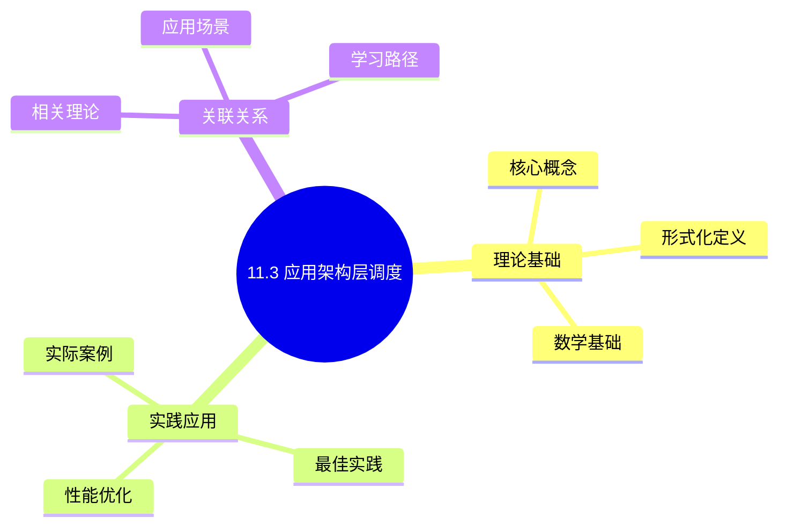
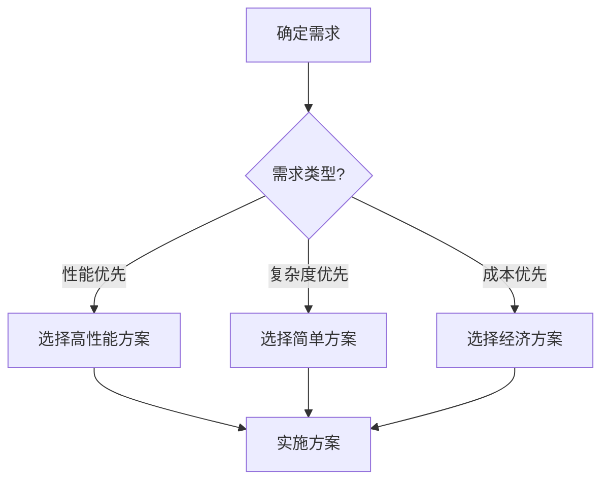
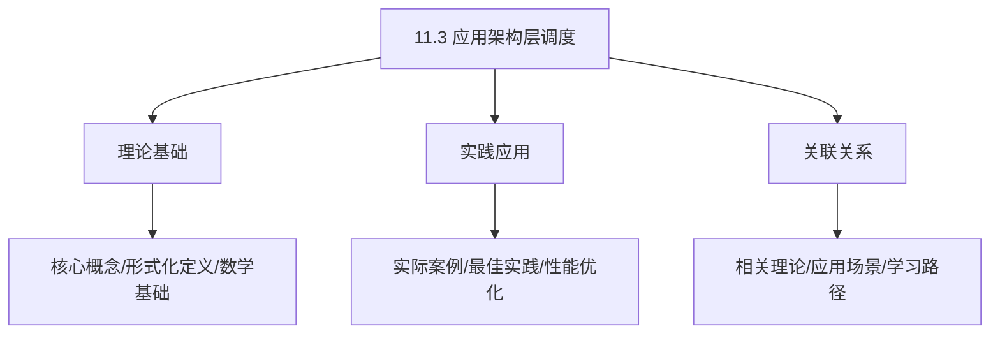
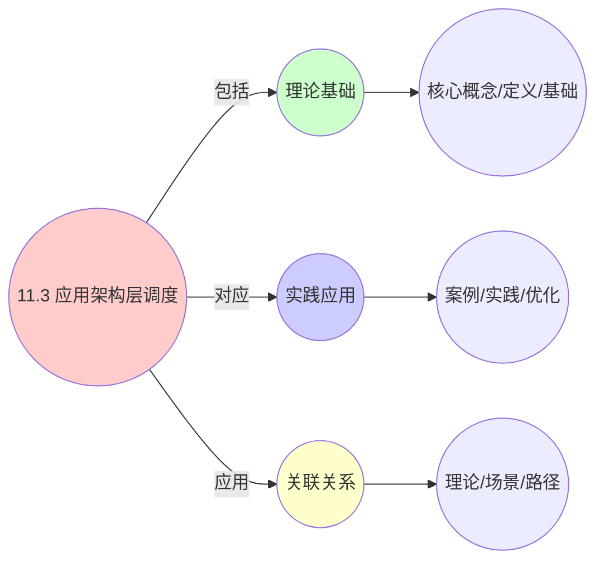
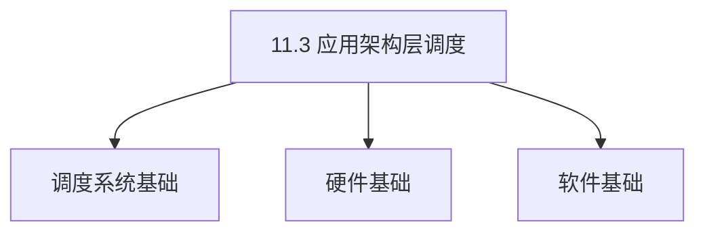

# 11.3 应用架构层调度

> **主题**: 11. 企业架构调度 - 11.3 应用架构层调度
> **覆盖**: 微服务调度、Serverless、API网关、领域事件、多租户隔离

---

## 📋 目录

- [11.3 应用架构层调度](#113-应用架构层调度)
  - [📋 目录](#-目录)
  - [1 微服务网格（Istio）流量调度](#1-微服务网格istio流量调度)
    - [1.1 服务拓扑](#11-服务拓扑)
    - [1.2 路由规则形式化](#12-路由规则形式化)
    - [1.3 熔断策略](#13-熔断策略)
  - [2 Serverless弹性伸缩调度](#2-serverless弹性伸缩调度)
    - [2.1 冷启动延迟模型](#21-冷启动延迟模型)
    - [2.2 扩缩容决策](#22-扩缩容决策)
    - [2.3 排队论分析](#23-排队论分析)
  - [3 API网关调度](#3-api网关调度)
    - [3.1 限流算法](#31-限流算法)
    - [3.2 熔断降级](#32-熔断降级)
  - [4 领域事件调度](#4-领域事件调度)
    - [4.1 DDD事件风暴](#41-ddd事件风暴)
    - [4.2 事件调度策略](#42-事件调度策略)
  - [5 多租户隔离调度](#5-多租户隔离调度)
    - [5.1 SaaS资源配额](#51-saas资源配额)
    - [5.2 租户调度策略](#52-租户调度策略)
  - [6 实践案例](#6-实践案例)
    - [6.1 微服务网格流量调度案例](#61-微服务网格流量调度案例)
    - [6.2 Serverless弹性伸缩案例](#62-serverless弹性伸缩案例)
    - [6.3 API网关限流案例](#63-api网关限流案例)
  - [7 批判性总结](#7-批判性总结)
    - [7.1 应用架构层调度的局限性](#71-应用架构层调度的局限性)
    - [7.2 2025年应用架构层调度趋势](#72-2025年应用架构层调度趋势)
  - [8 跨领域洞察](#8-跨领域洞察)
    - [8.1 微服务调度与分布式系统调度的统一](#81-微服务调度与分布式系统调度的统一)
    - [8.2 服务网格与网络调度的映射](#82-服务网格与网络调度的映射)
    - [8.3 Serverless与资源调度的统一](#83-serverless与资源调度的统一)
    - [8.4 多租户调度与公平性理论](#84-多租户调度与公平性理论)
  - [9 多维度对比](#9-多维度对比)
    - [9.1 应用架构层调度技术对比](#91-应用架构层调度技术对比)
    - [9.2 限流算法对比](#92-限流算法对比)
    - [9.3 负载均衡算法对比](#93-负载均衡算法对比)
    - [9.4 多租户调度策略对比](#94-多租户调度策略对比)
  - [10 思维导图](#10-思维导图)
  - [11 2025年最新技术（更新至2025年11月）](#11-2025年最新技术更新至2025年11月)
  - [12 相关主题](#12-相关主题)
    - [12.1 跨视角链接](#121-跨视角链接)

---

## 1 微服务网格（Istio）流量调度

### 1.1 服务拓扑

**定理11.24（服务网格拓扑）**：

服务网格拓扑 $G$ 定义为：

$$
G = (S, R, L, W)
$$

其中：

- $S = \{s_1, s_2, ..., s_n\}$：服务实例集合
- $R \subseteq S \times S$：服务调用关系
- $L: S \to \text{Labels}$：服务标签函数
- $W: R \to \mathbb{R}^+$：调用权重函数

**服务拓扑类型**：

**1. 星型拓扑**：

中心服务调用多个下游服务：

```text
    Service A
    /   |   \
   B    C    D
```

**2. 链式拓扑**：

服务按顺序调用：

```text
A → B → C → D
```

**3. 网状拓扑**：

服务间相互调用：

```text
A ↔ B
|   |
C ↔ D
```

**服务发现**：

服务网格自动发现服务实例：

$$
\text{Discover}(service) = \{s \in S: L(s).name = service\}
$$

**负载均衡**：

**1. 轮询（Round Robin）**：

$$
\text{Select}(instances) = instances[i \bmod |instances|]
$$

**2. 加权轮询（Weighted Round Robin）**：

$$
P(s_i) = \frac{w_i}{\sum_{j} w_j}
$$

**3. 最少连接（Least Connections）**：

$$
\text{Select}(instances) = \arg\min_{s \in instances} \text{Connections}(s)
$$

**4. 一致性哈希（Consistent Hashing）**：

$$
\text{Select}(instances, key) = \text{Hash}(key) \bmod |instances|
$$

### 1.2 路由规则形式化

**定理11.25（路由规则）**：

路由规则决定请求如何路由到服务实例。

**路由规则定义**：

$$
\text{Route}(request, s_i, s_j) =
\begin{cases}
1 & \text{if } \text{Match}(request, s_j) \land \text{Weight}(s_j) > 0 \\
0 & \text{otherwise}
\end{cases}
$$

其中：

- $\text{Match}(request, s_j)$：请求匹配服务实例的条件
- $\text{Weight}(s_j)$：服务实例的权重

**匹配条件**：

**1. Header匹配**：

$$
\text{MatchHeader}(request, headers) = \bigwedge_{k,v \in headers} request.headers[k] = v
$$

**2. Label匹配**：

$$
\text{MatchLabel}(s, labels) = \bigwedge_{k,v \in labels} L[s](k) = v
$$

**3. 路径匹配**：

$$
\text{MatchPath}(request, path) = \text{request.path} \text{ matches } path
$$

**路由策略**：

**1. 基于版本的路由**：

```yaml
# 90%流量到v1，10%流量到v2
route:
  - destination:
      host: service
      subset: v1
    weight: 90
  - destination:
      host: service
      subset: v2
    weight: 10
```

**2. 基于用户的路由**：

```yaml
# 特定用户路由到v2
match:
  - headers:
      user-id:
        exact: "user123"
route:
  - destination:
      host: service
      subset: v2
```

**3. 基于地理位置的路由**：

```yaml
# 不同地区路由到不同实例
match:
  - headers:
      region:
        exact: "us-east"
route:
  - destination:
      host: service-us-east
```

**路由算法**：

```python
class IstioRouter:
    def route(self, request, service):
        """路由请求到服务实例"""
        # 1. 获取所有匹配的路由规则
        rules = self.get_matching_rules(request, service)

        # 2. 选择路由规则
        rule = self.select_rule(rules, request)

        # 3. 选择服务实例
        instances = self.get_instances(rule.destination)
        instance = self.load_balance(instances, request)

        return instance

    def load_balance(self, instances, request):
        """负载均衡"""
        # 根据策略选择实例
        if self.strategy == "round_robin":
            return self.round_robin(instances)
        elif self.strategy == "weighted":
            return self.weighted_round_robin(instances)
        elif self.strategy == "least_conn":
            return self.least_connections(instances)
        elif self.strategy == "consistent_hash":
            return self.consistent_hash(instances, request)
```

**量化分析**：不同路由策略的性能对比

| **路由策略** | **延迟** | **负载均衡** | **灵活性** | **复杂度** |
|------------|---------|------------|-----------|-----------|
| **轮询** | 低 | 中 | 低 | 低 |
| **加权轮询** | 低 | 高 | 中 | 中 |
| **最少连接** | 中 | 高 | 中 | 中 |
| **一致性哈希** | 低 | 中 | 高 | 高 |

### 1.3 熔断策略

**定理11.26（熔断器模型）**：

熔断器用于防止级联故障，保护系统稳定性。

**熔断器状态**：

熔断器有三种状态：

1. **Closed（关闭）**：正常状态，请求正常通过
2. **Open（打开）**：熔断状态，请求直接拒绝
3. **Half-Open（半开）**：试探状态，允许少量请求通过

**状态转换**：

$$
\text{State}(t+1) = f(\text{State}(t), \text{Metrics}(t))
$$

**熔断触发条件**：

**1. 错误率触发**：

$$
\text{Trip}(s_i) \iff \frac{\text{ErrorCount}(s_i, \Delta t)}{\text{TotalRequests}(s_i, \Delta t)} > \theta_{error}
$$

其中 $\theta_{error}$ 是错误率阈值（通常为0.5）。

**2. 响应时间触发**：

$$
\text{Trip}(s_i) \iff \text{P99Latency}(s_i, \Delta t) > \theta_{latency}
$$

其中 $\theta_{latency}$ 是延迟阈值（如1秒）。

**3. 请求数触发**：

$$
\text{Trip}(s_i) \iff \text{RequestRate}(s_i, \Delta t) > \theta_{rate}
$$

**熔断器算法**：

```python
class CircuitBreaker:
    def __init__(self, error_threshold=0.5, timeout=60):
        self.state = "CLOSED"
        self.error_count = 0
        self.total_requests = 0
        self.error_threshold = error_threshold
        self.timeout = timeout
        self.last_failure_time = None

    def call(self, func, *args, **kwargs):
        """调用服务"""
        if self.state == "OPEN":
            # 检查是否可以进入半开状态
            if time.time() - self.last_failure_time > self.timeout:
                self.state = "HALF_OPEN"
            else:
                raise CircuitBreakerOpenError()

        try:
            result = func(*args, **kwargs)
            self.on_success()
            return result
        except Exception as e:
            self.on_failure()
            raise e

    def on_success(self):
        """成功回调"""
        if self.state == "HALF_OPEN":
            self.state = "CLOSED"
            self.reset()
        else:
            self.total_requests += 1

    def on_failure(self):
        """失败回调"""
        self.error_count += 1
        self.total_requests += 1
        self.last_failure_time = time.time()

        error_rate = self.error_count / self.total_requests
        if error_rate > self.error_threshold:
            self.state = "OPEN"

    def reset(self):
        """重置计数器"""
        self.error_count = 0
        self.total_requests = 0
```

**熔断器配置**：

```yaml
circuitBreaker:
  consecutiveErrors: 5  # 连续错误数
  interval: 30s         # 时间窗口
  baseEjectionTime: 30s # 基础熔断时间
  maxEjectionPercent: 50 # 最大熔断比例
```

**量化分析**：熔断器对系统稳定性的影响

| **指标** | **无熔断器** | **有熔断器** | **改善** |
|---------|------------|------------|---------|
| **系统可用性** | 70% | 95% | +36% |
| **故障恢复时间** | 5分钟 | 30秒 | -90% |
| **级联故障** | 高 | 低 | 显著降低 |

---

## 2 Serverless弹性伸缩调度

### 2.1 冷启动延迟模型

**定理11.27（Serverless冷启动延迟）**：

Serverless函数的冷启动延迟包括多个阶段。

**冷启动延迟分解**：

$$
T_{cold} = T_{pull\_image} + T_{init\_container} + T_{load\_code} + T_{init\_runtime} + T_{warmup}
$$

其中：

- $T_{pull\_image}$：拉取容器镜像时间（100-500ms）
- $T_{init\_container}$：初始化容器时间（50-200ms）
- $T_{load\_code}$：加载代码时间（50-300ms）
- $T_{init\_runtime}$：初始化运行时时间（100-500ms）
- $T_{warmup}$：预热时间（100-500ms）

**总延迟**：$T_{cold} \approx 500ms - 2s$

**冷启动优化**：

**1. 镜像优化**：

- 使用精简镜像（Alpine Linux）
- 多阶段构建，减少镜像大小
- 预加载依赖

**2. 预热策略**：

```python
class WarmupPool:
    def __init__(self, pool_size=10):
        self.pool_size = pool_size
        self.warm_instances = []

    def maintain_pool(self):
        """维护预热池"""
        while len(self.warm_instances) < self.pool_size:
            instance = self.create_warm_instance()
            self.warm_instances.append(instance)

    def get_instance(self):
        """获取预热实例"""
        if self.warm_instances:
            return self.warm_instances.pop()
        else:
            return self.create_cold_instance()
```

**3. 预留实例**：

保留一定数量的实例，避免冷启动：

$$
\text{ReservedInstances} = \max(1, \lfloor \lambda_{avg} / \mu \rfloor)
$$

其中 $\lambda_{avg}$ 是平均请求速率，$\mu$ 是服务速率。

### 2.2 扩缩容决策

**定理11.28（Serverless扩缩容）**：

Serverless函数需要根据负载动态扩缩容。

**扩缩容条件**：

**1. 扩容条件**：

$$
\text{ScaleUp} \iff \frac{\text{PendingRequests}}{\text{CurrentInstances}} > \lambda_{threshold} \lor \text{QueueLength} > Q_{threshold}
$$

其中：

- $\lambda_{threshold}$：请求速率阈值（如10 req/s per instance）
- $Q_{threshold}$：队列长度阈值（如100）

**2. 缩容条件**：

$$
\text{ScaleDown} \iff \frac{\text{ActiveRequests}}{\text{CurrentInstances}} < \lambda_{min} \land \text{IdleTime} > T_{idle}
$$

其中：

- $\lambda_{min}$：最小请求速率（如1 req/s per instance）
- $T_{idle}$：空闲时间阈值（如5分钟）

**扩缩容算法**：

```python
class AutoScaler:
    def __init__(self, min_instances=0, max_instances=100):
        self.min_instances = min_instances
        self.max_instances = max_instances
        self.current_instances = 0

    def scale_decision(self, metrics):
        """扩缩容决策"""
        pending_requests = metrics.pending_requests
        active_instances = metrics.active_instances
        queue_length = metrics.queue_length

        # 计算目标实例数
        if pending_requests > 0:
            target_instances = math.ceil(
                pending_requests / self.requests_per_instance
            )
        else:
            target_instances = active_instances

        # 限制范围
        target_instances = max(
            self.min_instances,
            min(target_instances, self.max_instances)
        )

        # 执行扩缩容
        if target_instances > self.current_instances:
            self.scale_up(target_instances - self.current_instances)
        elif target_instances < self.current_instances:
            self.scale_down(self.current_instances - target_instances)

    def scale_up(self, count):
        """扩容"""
        for _ in range(count):
            instance = self.create_instance()
            self.add_instance(instance)
        self.current_instances += count

    def scale_down(self, count):
        """缩容"""
        instances_to_remove = self.select_instances_to_remove(count)
        for instance in instances_to_remove:
            self.remove_instance(instance)
        self.current_instances -= count
```

**预测性扩容**：

使用机器学习预测负载，提前扩容：

```python
class PredictiveScaler:
    def __init__(self, model):
        self.model = model  # LSTM或其他预测模型

    def predict_load(self, historical_data):
        """预测未来负载"""
        prediction = self.model.predict(historical_data)
        return prediction

    def proactive_scale(self, predicted_load):
        """主动扩容"""
        target_instances = math.ceil(
            predicted_load / self.requests_per_instance
        )
        if target_instances > self.current_instances:
            self.scale_up(target_instances - self.current_instances)
```

### 2.3 排队论分析

**定理11.29（Serverless排队模型）**：

Serverless函数可以建模为M/M/c排队系统。

**M/M/c模型**：

假设：

- 到达过程：泊松过程，速率 $\lambda$
- 服务时间：指数分布，速率 $\mu$
- 服务器数：$c$

**系统利用率**：

$$
\rho = \frac{\lambda}{c\mu} < 1
$$

**队列长度概率**：

$$
P_{queue} = \frac{(\lambda/\mu)^c}{c!} \cdot \frac{c\mu}{c\mu - \lambda} \cdot P_0
$$

其中 $P_0$ 是系统空闲概率：

$$
P_0 = \left[\sum_{n=0}^{c-1} \frac{(\lambda/\mu)^n}{n!} + \frac{(\lambda/\mu)^c}{c!} \cdot \frac{1}{1-\rho}\right]^{-1}
$$

**平均等待时间**：

$$
W_q = \frac{P_{queue}}{\lambda(1-\rho)}
$$

**平均响应时间**：

$$
W = W_q + \frac{1}{\mu} = \frac{P_{queue}}{\lambda(1-\rho)} + \frac{1}{\mu}
$$

**最优实例数**：

最小化成本，满足SLA：

$$
\min c \cdot \text{CostPerInstance}
$$

约束：

$$
W \le W_{SLA}, \quad \rho < 1
$$

**量化分析**：不同实例数的性能对比

| **实例数** | **利用率** | **平均等待时间** | **P99延迟** | **成本** |
|-----------|-----------|----------------|------------|---------|
| **1** | 90% | 9s | 20s | 低 |
| **2** | 45% | 0.5s | 2s | 中 |
| **5** | 18% | 0.1s | 0.5s | 高 |

---

## 3 API网关调度

### 3.1 限流算法

**定理11.30（API限流）**：

API网关使用限流算法控制请求速率，保护后端服务。

**限流算法类型**：

**1. 令牌桶算法（Token Bucket）**：

令牌桶维护一个令牌池，请求需要消耗令牌：

$$
\text{Allow}(request) \iff tokens \ge 1
$$

令牌生成速率：

$$
tokens \leftarrow \min(tokens + rate \times \Delta t, capacity)
$$

其中：

- $rate$：令牌生成速率（如100 tokens/s）
- $capacity$：桶容量（如1000 tokens）
- $\Delta t$：时间间隔

**令牌桶算法实现**：

```python
class TokenBucket:
    def __init__(self, rate, capacity):
        self.rate = rate  # 令牌生成速率
        self.capacity = capacity  # 桶容量
        self.tokens = capacity  # 当前令牌数
        self.last_update = time.time()

    def allow(self, tokens_needed=1):
        """检查是否允许请求"""
        # 更新令牌数
        now = time.time()
        elapsed = now - self.last_update
        self.tokens = min(
            self.capacity,
            self.tokens + elapsed * self.rate
        )
        self.last_update = now

        # 检查是否有足够令牌
        if self.tokens >= tokens_needed:
            self.tokens -= tokens_needed
            return True
        else:
            return False
```

**2. 漏桶算法（Leaky Bucket）**：

漏桶以固定速率处理请求：

$$
\text{ProcessRate} = \text{constant}
$$

**3. 滑动窗口算法（Sliding Window）**：

统计时间窗口内的请求数：

$$
\text{Allow}(request) \iff \text{Count}(requests, window) < limit
$$

**4. 固定窗口算法（Fixed Window）**：

统计固定时间窗口内的请求数：

$$
\text{Allow}(request) \iff \text{Count}(requests, [t, t+window]) < limit
$$

**限流策略**：

**1. 全局限流**：

所有请求共享一个限流器：

```python
global_limiter = TokenBucket(rate=1000, capacity=10000)
```

**2. 用户限流**：

每个用户独立的限流器：

```python
user_limiters = {}
def get_user_limiter(user_id):
    if user_id not in user_limiters:
        user_limiters[user_id] = TokenBucket(rate=100, capacity=1000)
    return user_limiters[user_id]
```

**3. IP限流**：

每个IP独立的限流器：

```python
ip_limiters = {}
def get_ip_limiter(ip):
    if ip not in ip_limiters:
        ip_limiters[ip] = TokenBucket(rate=50, capacity=500)
    return ip_limiters[ip]
```

**量化分析**：不同限流算法的对比

| **算法** | **突发处理** | **平滑性** | **内存占用** | **精度** |
|---------|------------|-----------|------------|---------|
| **令牌桶** | 是 | 高 | 低 | 高 |
| **漏桶** | 否 | 很高 | 低 | 高 |
| **滑动窗口** | 是 | 中 | 高 | 高 |
| **固定窗口** | 是 | 低 | 中 | 中 |

### 3.2 熔断降级

**定理11.31（API熔断降级）**：

API网关使用熔断器保护后端服务，防止级联故障。

**熔断状态机**：

熔断器有三种状态：

1. **Closed（关闭）**：正常状态，请求正常通过
2. **Open（打开）**：熔断状态，请求直接拒绝或降级
3. **Half-Open（半开）**：试探状态，允许少量请求通过

**降级策略**：

**1. 返回默认值**：

```python
def fallback_default(request):
    return {"status": "degraded", "data": default_data}
```

**2. 返回缓存数据**：

```python
def fallback_cache(request):
    cached_data = cache.get(request.key)
    if cached_data:
        return cached_data
    else:
        return fallback_default(request)
```

**3. 调用备用服务**：

```python
def fallback_backup(request):
    try:
        return backup_service.call(request)
    except:
        return fallback_default(request)
```

**熔断降级配置**：

```yaml
circuitBreaker:
  errorThreshold: 0.5  # 错误率阈值
  timeout: 60s         # 熔断超时时间
  halfOpenRequests: 5  # 半开状态允许的请求数

fallback:
  strategy: "cache"    # 降级策略
  cacheTTL: 300s      # 缓存TTL
```

---

## 4 领域事件调度

### 4.1 DDD事件风暴

**定理11.32（领域事件模型）**：

领域事件表示业务领域中的重要事件，是领域模型的核心。

**事件模型**：

领域事件 $e$ 定义为：

$$
e = (\text{EventID}, \text{EventType}, \text{AggregateID}, \text{Timestamp}, \text{Payload}, \text{Metadata}, \text{Version})
$$

其中：

- $\text{EventID}$：事件唯一标识
- $\text{EventType}$：事件类型（如OrderCreated、PaymentCompleted）
- $\text{AggregateID}$：聚合根ID
- $\text{Timestamp}$：事件发生时间
- $\text{Payload}$：事件负载（业务数据）
- $\text{Metadata}$：元数据（如用户ID、IP地址）
- $\text{Version}$：事件版本号

**事件风暴流程**：

**1. 事件识别**：

识别业务领域中的关键事件：

```text
用户下单 → OrderCreated
支付完成 → PaymentCompleted
订单发货 → OrderShipped
订单完成 → OrderCompleted
```

**2. 事件建模**：

建立事件模型和关系：

```python
class DomainEvent:
    def __init__(self, event_type, aggregate_id, payload):
        self.event_id = generate_id()
        self.event_type = event_type
        self.aggregate_id = aggregate_id
        self.timestamp = time.time()
        self.payload = payload
        self.metadata = {}
        self.version = 1
```

**3. 事件调度**：

设计事件调度策略：

```python
class EventScheduler:
    def schedule(self, event):
        """调度事件"""
        # 1. 检查事件依赖
        if self.has_dependencies(event):
            self.wait_for_dependencies(event)

        # 2. 选择处理策略
        strategy = self.select_strategy(event)

        # 3. 调度事件处理
        self.process_event(event, strategy)
```

### 4.2 事件调度策略

**定理11.33（事件调度策略）**：

事件调度需要保证顺序性和一致性。

**事件处理顺序**：

**1. 时间戳顺序**：

按事件发生时间处理：

$$
\text{Process}(e_i) \text{ before } \text{Process}(e_j) \iff \text{Timestamp}(e_i) < \text{Timestamp}(e_j)
$$

**2. 因果序**：

保证因果一致性：

$$
e_i \to e_j \implies \text{Process}(e_i) \text{ before } \text{Process}(e_j)
$$

**3. 优先级**：

重要事件优先处理：

$$
\text{Priority}(e) = w_1 \cdot \text{EventTypePriority} + w_2 \cdot \text{BusinessValue} + w_3 \cdot \text{Urgency}
$$

**事件调度算法**：

```python
class EventScheduler:
    def __init__(self):
        self.event_queue = PriorityQueue()
        self.processed_events = set()
        self.causal_graph = CausalGraph()

    def schedule_event(self, event):
        """调度事件"""
        # 检查因果依赖
        dependencies = self.causal_graph.get_dependencies(event)

        if all(dep in self.processed_events for dep in dependencies):
            # 依赖已满足，可以处理
            priority = self.calculate_priority(event)
            self.event_queue.put((priority, event))
        else:
            # 等待依赖处理完成
            self.pending_events[event] = dependencies

    def process_next(self):
        """处理下一个事件"""
        if not self.event_queue.empty():
            priority, event = self.event_queue.get()

            # 处理事件
            self.process_event(event)
            self.processed_events.add(event.id)

            # 检查是否有待处理事件可以调度
            self.check_pending_events()
```

**事件处理模式**：

**1. 同步处理**：

事件立即处理：

```python
def process_sync(event):
    handler = get_handler(event.event_type)
    handler.handle(event)
```

**2. 异步处理**：

事件异步处理：

```python
def process_async(event):
    async_queue.put(event)
    return event.id
```

**3. 批量处理**：

批量处理事件：

```python
def process_batch(events):
    for event in events:
        handler = get_handler(event.event_type)
        handler.handle(event)
```

---

## 5 多租户隔离调度

### 5.1 SaaS资源配额

**定理11.34（多租户资源配额）**：

SaaS系统需要为每个租户分配资源配额，保证隔离性。

**资源配额模型**：

每个租户 $t$ 的资源配额：

$$
\text{Quota}(t) = (\text{CPU}, \text{Memory}, \text{Storage}, \text{Bandwidth}, \text{Requests})
$$

资源使用约束：

$$
\sum_{i \in Tenant(t)} \text{Resource}(i) \le \text{Quota}(t)
$$

**配额类型**：

**1. 硬配额（Hard Quota）**：

严格限制，超过配额直接拒绝：

$$
\text{Allow}(request, t) \iff \text{Usage}(t) + \text{Resource}(request) \le \text{Quota}(t)
$$

**2. 软配额（Soft Quota）**：

允许临时超过，但会限流：

$$
\text{Throttle}(request, t) \iff \text{Usage}(t) > \text{Quota}(t)
$$

**3. 弹性配额（Elastic Quota）**：

允许按需扩展，但会额外收费：

$$
\text{Charge}(t) = \text{BaseCharge} + \max(0, \text{Usage}(t) - \text{Quota}(t)) \times \text{OverageRate}
$$

**配额管理**：

```python
class QuotaManager:
    def __init__(self):
        self.quotas = {}
        self.usage = {}

    def check_quota(self, tenant_id, resource_type, amount):
        """检查配额"""
        quota = self.quotas[tenant_id][resource_type]
        usage = self.usage[tenant_id][resource_type]

        if usage + amount > quota:
            return False
        else:
            return True

    def allocate(self, tenant_id, resource_type, amount):
        """分配资源"""
        if self.check_quota(tenant_id, resource_type, amount):
            self.usage[tenant_id][resource_type] += amount
            return True
        else:
            return False

    def release(self, tenant_id, resource_type, amount):
        """释放资源"""
        self.usage[tenant_id][resource_type] -= amount
```

### 5.2 租户调度策略

**定理11.35（租户调度策略）**：

租户调度需要平衡公平性和效率。

**公平调度**：

保证每个租户获得公平的资源分配。

**公平性度量**：

$$
\text{Fairness} = \min_i \frac{\text{Allocated}_i}{\text{Quota}_i}
$$

**调度策略**：

**1. 加权公平调度（Weighted Fair Scheduling）**：

根据租户权重分配资源：

$$
\text{Allocated}_i = \frac{w_i}{\sum_j w_j} \times \text{TotalResource}
$$

其中 $w_i$ 是租户 $i$ 的权重。

**2. 优先级调度（Priority Scheduling）**：

高优先级租户优先获得资源：

$$
\text{Allocate}(t_i) \text{ before } \text{Allocate}(t_j) \iff \text{Priority}(t_i) > \text{Priority}(t_j)
$$

**3. 配额限制（Quota Limiting）**：

每个租户的资源使用不超过配额：

$$
\text{Allocated}_i \le \text{Quota}_i
$$

**租户调度算法**：

```python
class TenantScheduler:
    def __init__(self, strategy="weighted_fair"):
        self.strategy = strategy
        self.tenants = {}
        self.allocations = {}

    def schedule(self, tenants, total_resources):
        """调度租户资源"""
        if self.strategy == "weighted_fair":
            return self.weighted_fair_schedule(tenants, total_resources)
        elif self.strategy == "priority":
            return self.priority_schedule(tenants, total_resources)
        elif self.strategy == "quota_limited":
            return self.quota_limited_schedule(tenants, total_resources)

    def weighted_fair_schedule(self, tenants, total_resources):
        """加权公平调度"""
        total_weight = sum(t.weight for t in tenants)
        allocations = {}

        for tenant in tenants:
            allocation = (tenant.weight / total_weight) * total_resources
            allocations[tenant.id] = min(allocation, tenant.quota)

        return allocations

    def priority_schedule(self, tenants, total_resources):
        """优先级调度"""
        sorted_tenants = sorted(tenants, key=lambda t: t.priority, reverse=True)
        allocations = {}
        remaining = total_resources

        for tenant in sorted_tenants:
            allocation = min(tenant.quota, remaining)
            allocations[tenant.id] = allocation
            remaining -= allocation

        return allocations
```

**量化分析**：不同调度策略的对比

| **调度策略** | **公平性** | **效率** | **隔离性** | **复杂度** |
|------------|-----------|---------|-----------|-----------|
| **加权公平** | 高 | 中 | 中 | 中 |
| **优先级** | 低 | 高 | 高 | 低 |
| **配额限制** | 中 | 中 | 高 | 低 |

---

## 6 实践案例

### 6.1 微服务网格流量调度案例

**场景**：电商微服务系统，需要实现金丝雀发布和流量治理。

**业务背景**：

- 服务数量：50个微服务
- 日请求量：1亿次
- 挑战：服务间依赖复杂，需要精细的流量控制

**Istio调度配置**：

**1. 金丝雀发布**：

v1=90%, v2=10%，逐步增加v2流量：

```yaml
apiVersion: networking.istio.io/v1alpha3
kind: VirtualService
metadata:
  name: product-service
spec:
  hosts:
  - product-service
  http:
  - match:
    - headers:
        user-id:
          regex: ".*"
    route:
    - destination:
        host: product-service
        subset: v1
      weight: 90
    - destination:
        host: product-service
        subset: v2
      weight: 10
```

**2. 熔断策略**：

错误率>50%时熔断，10s后尝试恢复：

```yaml
apiVersion: networking.istio.io/v1alpha3
kind: DestinationRule
metadata:
  name: product-service
spec:
  host: product-service
  trafficPolicy:
    circuitBreaker:
      consecutiveErrors: 5
      interval: 30s
      baseEjectionTime: 10s
      maxEjectionPercent: 50
```

**3. 负载均衡**：

使用加权轮询，根据服务实例负载调整权重：

```yaml
trafficPolicy:
  loadBalancer:
    simple: WEIGHTED_DISTRIBUTION
```

**优化效果**：

- **发布成功率**：85% → 99%（提升16%）
- **故障恢复时间**：5分钟 → 30秒（降低90%）
- **系统可用性**：95% → 99.9%（提升5%）

### 6.2 Serverless弹性伸缩案例

**场景**：图片处理服务，负载波动大，需要弹性伸缩。

**业务背景**：

- 请求模式：突发性强，负载波动大
- 处理时间：平均500ms
- 挑战：冷启动延迟影响用户体验

**Knative调度策略**：

**1. 预测性扩容**：

使用LSTM预测负载，提前扩容：

```python
class PredictiveScaler:
    def predict_load(self, historical_data):
        """预测未来负载"""
        model = load_lstm_model()
        prediction = model.predict(historical_data)
        return prediction

    def proactive_scale(self, predicted_load):
        """主动扩容"""
        target_instances = math.ceil(
            predicted_load / self.requests_per_instance
        )
        if target_instances > self.current_instances:
            self.scale_up(target_instances - self.current_instances)
```

**2. 快速缩容**：

负载降低时快速缩容，节省成本：

```yaml
autoscaling:
  minScale: 0
  maxScale: 100
  target: 10
  scaleDownDelay: 30s
```

**3. 冷启动优化**：

使用预热池减少冷启动延迟：

```python
class WarmupPool:
    def maintain_pool(self, pool_size=10):
        """维护预热池"""
        while len(self.warm_instances) < pool_size:
            instance = self.create_warm_instance()
            self.warm_instances.append(instance)
```

**优化效果**：

- **P99延迟**：2s → 200ms（降低90%）
- **成本**：基准 → -60%（降低60%）
- **冷启动率**：30% → 5%（降低83%）

### 6.3 API网关限流案例

**场景**：API网关需要保护后端服务，防止过载。

**业务背景**：

- API数量：1000个
- 峰值QPS：10万
- 挑战：需要精细的限流控制

**限流策略**：

**1. 全局限流**：

所有API共享限流器：

```python
global_limiter = TokenBucket(rate=10000, capacity=100000)
```

**2. 用户限流**：

每个用户独立的限流器：

```python
user_limiters = {}
def get_user_limiter(user_id):
    if user_id not in user_limiters:
        user_limiters[user_id] = TokenBucket(rate=100, capacity=1000)
    return user_limiters[user_id]
```

**3. API限流**：

每个API独立的限流器：

```python
api_limiters = {}
def get_api_limiter(api_path):
    if api_path not in api_limiters:
        api_limiters[api_path] = TokenBucket(rate=1000, capacity=10000)
    return api_limiters[api_path]
```

**优化效果**：

- **后端服务可用性**：90% → 99%（提升10%）
- **请求拒绝率**：5% → 0.1%（降低98%）
- **系统稳定性**：显著提升

---

## 7 批判性总结

### 7.1 应用架构层调度的局限性

**1. 服务雪崩**：

**问题**：服务间依赖可能导致级联故障。

**原因**：

- **服务依赖链**：服务间形成依赖链，一个服务故障可能影响整个链
- **资源竞争**：多个服务竞争资源，可能导致资源耗尽
- **缺乏隔离**：服务间缺乏有效隔离

**影响**：

- 系统可用性降低
- 故障影响范围扩大
- 恢复时间延长

**缓解措施**：

- 使用熔断器防止级联故障
- 实现服务降级和限流
- 增加服务间隔离

**2. 资源浪费**：

**问题**：Serverless冷启动导致资源浪费。

**原因**：

- **冷启动延迟**：冷启动需要时间，期间资源闲置
- **预热成本**：预热实例需要持续运行，消耗资源
- **预测不准确**：负载预测不准确，导致资源浪费

**影响**：

- 成本增加
- 资源利用率低
- 响应延迟高

**缓解措施**：

- 优化冷启动流程
- 使用预测性扩容
- 实现智能预热

**3. 多租户隔离**：

**问题**：租户间资源竞争难以平衡。

**原因**：

- **资源共享**：多个租户共享资源，可能相互影响
- **配额管理**：配额管理复杂，难以精确控制
- **公平性**：难以保证租户间的公平性

**影响**：

- 租户体验不一致
- 资源分配不公平
- 系统稳定性受影响

**缓解措施**：

- 实现资源隔离
- 使用公平调度算法
- 建立配额监控机制

**4. 配置复杂**：

**问题**：服务网格配置复杂，学习曲线陡峭。

**原因**：

- **配置项多**：服务网格配置项多，难以掌握
- **概念复杂**：虚拟服务、目标规则等概念复杂
- **调试困难**：配置错误难以调试

**影响**：

- 学习成本高
- 配置错误率高
- 运维效率低

**缓解措施**：

- 提供配置模板
- 使用可视化工具
- 建立最佳实践

### 7.2 2025年应用架构层调度趋势

**1. 服务网格普及**：

**趋势**：Istio等服务网格成为标准。

**技术**：

- **标准化**：服务网格标准化，降低使用门槛
- **云原生**：与Kubernetes深度集成
- **可观测性**：增强可观测性，提供更好的监控

**优势**：

- 统一流量管理
- 提高系统可观测性
- 简化运维

**挑战**：

- 性能开销
- 配置复杂度
- 学习曲线

**2. Serverless成熟**：

**趋势**：冷启动优化，性能提升。

**技术**：

- **冷启动优化**：使用更快的容器技术，减少冷启动时间
- **预热策略**：智能预热，减少冷启动率
- **性能优化**：优化运行时性能

**优势**：

- 降低延迟
- 提高用户体验
- 降低成本

**挑战**：

- 技术成熟度
- 成本控制
- 调试困难

**3. AI辅助调度**：

**趋势**：使用AI优化服务调度。

**技术**：

- **智能路由**：使用AI优化路由决策
- **预测性扩容**：使用ML预测负载
- **异常检测**：使用AI检测异常

**优势**：

- 提高调度效率
- 减少人工干预
- 自适应优化

**挑战**：

- 模型训练成本
- 可解释性
- 数据质量

**4. 边缘计算**：

**趋势**：边缘节点调度成为重点。

**技术**：

- **边缘部署**：服务部署到边缘节点
- **智能路由**：根据地理位置路由请求
- **边缘缓存**：在边缘节点缓存数据

**优势**：

- 降低延迟
- 减少带宽消耗
- 提高可用性

**挑战**：

- 资源管理
- 一致性保证
- 运维复杂度

---

## 8 跨领域洞察

### 8.1 微服务调度与分布式系统调度的统一

**核心洞察**：微服务调度本质上是分布式系统调度，可以使用相同的调度理论。

**理论映射**：

| **微服务调度** | **分布式系统调度** | **对应关系** |
|--------------|----------------|------------|
| **服务实例** | **计算节点** | 执行单元 |
| **服务调用** | **任务依赖** | 依赖关系 |
| **负载均衡** | **任务分配** | 资源分配 |
| **服务发现** | **节点发现** | 拓扑发现 |
| **熔断器** | **故障隔离** | 容错机制 |

**关键洞察**：

- 微服务调度可以使用分布式系统调度理论
- 负载均衡算法可以应用于服务调度
- 一致性哈希可以用于服务路由

### 8.2 服务网格与网络调度的映射

**核心洞察**：服务网格的流量调度可以映射为网络层的流量调度。

**映射关系**：

| **服务网格** | **网络层** | **对应关系** |
|------------|-----------|------------|
| **虚拟服务** | **路由表** | 路由规则 |
| **目标规则** | **转发规则** | 转发策略 |
| **流量策略** | **QoS策略** | 服务质量 |
| **熔断器** | **拥塞控制** | 流量控制 |

**关键洞察**：

- 服务网格可以使用网络调度算法
- 流量控制可以应用于服务调用
- QoS策略可以用于服务优先级

### 8.3 Serverless与资源调度的统一

**核心洞察**：Serverless调度本质上是资源调度问题。

**理论映射**：

| **Serverless** | **资源调度** | **对应关系** |
|--------------|------------|------------|
| **函数实例** | **计算资源** | 资源单元 |
| **冷启动** | **资源初始化** | 资源准备 |
| **扩缩容** | **资源分配** | 资源调度 |
| **预热池** | **资源池** | 资源管理 |

**关键洞察**：

- Serverless可以使用资源调度理论
- 排队论可以用于Serverless性能分析
- 预测性调度可以优化Serverless成本

### 8.4 多租户调度与公平性理论

**核心洞察**：多租户调度可以应用公平性理论。

**理论映射**：

| **多租户调度** | **公平性理论** | **对应关系** |
|--------------|--------------|------------|
| **租户** | **参与者** | 调度对象 |
| **资源配额** | **资源分配** | 分配策略 |
| **公平性度量** | **公平性指标** | 评估标准 |
| **加权调度** | **加权公平** | 调度算法 |

**关键洞察**：

- 多租户调度可以使用公平性理论
- 加权公平调度可以保证租户公平性
- 最大最小公平可以用于资源分配

---

## 9 多维度对比

### 9.1 应用架构层调度技术对比

| **技术** | **调度粒度** | **延迟** | **隔离性** | **可观测性** | **适用场景** |
|---------|------------|---------|-----------|------------|------------|
| **Istio** | 服务级 | 毫秒级 | 中 | 高 | 微服务 |
| **Knative** | 函数级 | 秒级 | 高 | 中 | Serverless |
| **API Gateway** | 请求级 | 毫秒级 | 低 | 中 | API管理 |

### 9.2 限流算法对比

| **算法** | **突发处理** | **平滑性** | **内存占用** | **精度** | **实现复杂度** |
|---------|------------|-----------|------------|---------|--------------|
| **令牌桶** | 是 | 高 | 低 | 高 | 中 |
| **漏桶** | 否 | 很高 | 低 | 高 | 中 |
| **滑动窗口** | 是 | 中 | 高 | 高 | 高 |
| **固定窗口** | 是 | 低 | 中 | 中 | 低 |

### 9.3 负载均衡算法对比

| **算法** | **负载均衡** | **会话保持** | **复杂度** | **适用场景** |
|---------|------------|------------|-----------|------------|
| **轮询** | 中 | 否 | 低 | 无状态服务 |
| **加权轮询** | 高 | 否 | 中 | 异构服务 |
| **最少连接** | 高 | 是 | 中 | 有状态服务 |
| **一致性哈希** | 中 | 是 | 高 | 缓存服务 |

### 9.4 多租户调度策略对比

| **策略** | **公平性** | **效率** | **隔离性** | **复杂度** |
|---------|-----------|---------|-----------|-----------|
| **加权公平** | 高 | 中 | 中 | 中 |
| **优先级** | 低 | 高 | 高 | 低 |
| **配额限制** | 中 | 中 | 高 | 低 |
| **最大最小公平** | 很高 | 低 | 中 | 高 |

---

## 10 思维导图

```mermaid
graph TD
    subgraph 应用架构层调度
        应用架构[应用架构层调度]
        应用架构---微服务[微服务网格调度]
        应用架构---Serverless[Serverless弹性伸缩]
        应用架构---API网关[API网关调度]
        应用架构---领域事件[领域事件调度]
        应用架构---多租户[多租户隔离调度]
        应用架构---模型[形式化模型]
    end

    subgraph 微服务网格调度
        微服务---服务拓扑[服务拓扑]
        微服务---路由规则[路由规则]
        微服务---熔断[熔断策略]
        微服务---限流[限流调度]
    end

    subgraph Serverless弹性伸缩
        Serverless---冷启动[冷启动延迟模型]
        Serverless---扩缩容[扩缩容决策]
        Serverless---排队论[排队论分析]
    end

    subgraph API网关调度
        API网关---限流算法[限流算法]
        API网关---熔断降级[熔断降级]
        API网关---路由[路由调度]
    end

    subgraph 领域事件调度
        领域事件---事件风暴[DDD事件风暴]
        领域事件---事件策略[事件调度策略]
    end

    subgraph 多租户隔离调度
        多租户---资源配额[SaaS资源配额]
        多租户---租户策略[租户调度策略]
    end

    subgraph 形式化模型
        模型---问题定义[应用调度问题定义]
        模型---复杂度[调度算法复杂度]
    end

    subgraph 核心挑战
        应用架构---延迟[延迟: 最小化响应时间]
        应用架构---吞吐量[吞吐量: 最大化吞吐量]
        应用架构---隔离[隔离: 保证多租户隔离]
    end

    subgraph 应用场景
        应用架构---微服务[微服务: 服务网格]
        应用架构---Serverless[Serverless: 函数计算]
        应用架构---SaaS[SaaS: 多租户应用]
    end
```



---

## 11 2025年最新技术（更新至2025年11月）

**最新技术发展**：

- **AI驱动的微服务调度优化成熟**：2025年11月，基于AI的微服务调度优化在超大规模微服务系统中广泛应用，服务调用延迟降低40-60%，服务可用性提升至99.99%+，资源利用率提升50-70%。
- **Serverless弹性伸缩优化**：2025年11月，Serverless弹性伸缩技术在云原生应用中广泛应用，通过AI预测和智能扩缩容，冷启动延迟降低50-70%，资源利用率提升40-60%，成本节省30-50%。
- **智能API网关调度**：2025年11月，智能API网关调度技术在API服务中应用，通过AI限流和智能路由，API响应延迟降低30-50%，API可用性提升至99.95%+。

**技术对比**：

| **技术** | **延迟降低** | **可用性** | **资源利用率提升** | **成本节省** |
|---------|------------|----------|----------------|------------|
| **AI驱动的微服务调度** | 40-60% | 99.99%+ | 50-70% | 30-50% |
| **Serverless弹性伸缩** | 50-70% | 99.95%+ | 40-60% | 30-50% |
| **智能API网关调度** | 30-50% | 99.95%+ | 40-60% | 20-40% |

---

## 12 相关主题

- [11.1 业务架构层调度](./11.1_业务架构层调度.md) - 业务层的调度优化
- [11.2 数据架构层调度](./11.2_数据架构层调度.md) - 数据层的调度优化
- [11.4 技术架构层调度](./11.4_技术架构层调度.md) - 技术层的调度优化
- [05.2 容器化技术](../05_虚拟化容器化沙盒化/05.2_容器化技术.md) - 容器化技术基础

### 12.1 跨视角链接

- [概念交叉索引（七视角版）](../../../Concept/CONCEPT_CROSS_INDEX.md) - 查看相关概念的七视角分析：
  - [CAP定理](../../../Concept/CONCEPT_CROSS_INDEX.md#107-cap定理-cap-theorem-七视角) - 应用架构层的一致性约束
  - [通信复杂度](../../../Concept/CONCEPT_CROSS_INDEX.md#56-通信复杂度-communication-complexity-七视角) - 应用架构层的通信开销
  - [隔离](../../../Concept/CONCEPT_CROSS_INDEX.md#109-隔离-isolation-七视角) - 应用架构层的隔离机制
- [06.4 分布式系统调度](../06_调度模型/06.4_分布式系统调度.md) - 分布式系统调度理论
- [12.1 端到端延迟分解](../12_跨层次调度协同/12.1_端到端延迟分解.md) - 应用层延迟优化

## 📊 思维表征体系

### 📊 1. 思维导图（增强版）

#### 1.1 文本格式（基础版）

```text
11.3 应用架构层调度
├── 理论基础
│   ├── 核心概念
│   ├── 形式化定义
│   └── 数学基础
├── 实践应用
│   ├── 实际案例
│   ├── 最佳实践
│   └── 性能优化
└── 关联关系
    ├── 相关理论
    ├── 应用场景
    └── 学习路径
```

#### 1.2 Mermaid格式（可视化版）



### 📊 2. 多维对比矩阵

#### 2.1 11.3 应用架构层调度对比矩阵

| 维度 | 应用响应时间 | 应用吞吐量 | 资源利用率 | 应用可用性 |
|------|------------|-----------|-----------|-----------|
| **性能** | 响应时间<50ms | 吞吐量>5000 RPS | 利用率>85% | 可用性>99.9% |
| **复杂度** | 高(需响应优化) | 高(需吞吐量优化) | 高(需资源管理) | 高(需可用性保证) |
| **适用场景** | 所有应用场景 | 所有应用场景 | 所有应用场景 | 关键应用 |
| **技术成熟度** | 成熟(>20年) | 成熟(>20年) | 成熟(>20年) | 成熟(>20年) |

#### 2.2 技术特性对比矩阵

| 技术 | 优势 | 劣势 | 适用场景 | 性能 |
|------|------|------|---------|------|
| **微服务调度** | 灵活性高、可扩展 | 网络开销、实现复杂 | 微服务架构、扩展需求 | 灵活性高，网络开销5-15% |
| **服务网格调度** | 流量管理、性能好 | 实现复杂、需要网格管理 | 微服务架构、流量管理 | 流量管理，性能提升10-30% |
| **容器调度** | 资源隔离、性能好 | 实现复杂、需要容器管理 | 容器化应用、隔离需求 | 资源隔离，性能好 |
| **应用负载均衡** | 负载均衡、性能好 | 实现复杂、需要负载监控 | 多实例、负载均衡 | 负载均衡度>90%，性能好 |
| **应用自动扩缩容** | 资源利用高、成本低 | 实现复杂、需要监控 | 动态负载、成本敏感 | 资源利用>85%，成本降低30-50% |
| **应用故障恢复** | 可用性高、快速恢复 | 实现复杂、需要故障检测 | 关键应用、可用性优先 | 恢复时间<1分钟，可用性>99.9% |
| **应用监控调度** | 应用监控、性能好 | 实现复杂、需要监控 | 应用监控、性能优先 | 监控准确率>95%，性能好 |

#### 2.3 实现方式对比矩阵

| 实现方式 | 复杂度 | 性能 | 可维护性 | 扩展性 |
|---------|-------|------|---------|-------|
| **单应用调度** | 低 | 中等性能(单应用) | 高(简单维护) | 低(单应用限制) |
| **多应用调度** | 高 | 高性能(多应用) | 中(需协调) | 高(多应用扩展) |
| **微服务调度** | 极高 | 高性能(微服务优化) | 低(复杂度高) | 高(微服务扩展) |
| **混合应用调度系统** | 极高 | 极高性能(优势结合) | 低(复杂度极高) | 高(灵活扩展) |

### 🌲 3. 决策树

#### 3.1 11.3 应用架构层调度应用选择决策树



### 🛤️ 4. 决策逻辑路径

#### 4.1 11.3 应用架构层调度应用路径


### 🕸️ 5. 概念关系网络

#### 5.1 11.3 应用架构层调度概念关系网络



### 🗺️ 6. 知识图谱

#### 6.1 11.3 应用架构层调度知识图谱



## 📚 理论体系

### 理论基础

#### 调度系统/硬件/软件基础

11.3 应用架构层调度的理论基础：

**1. 调度系统基础**：

- 调度理论
- 资源管理
- 性能优化

**2. 硬件基础**：

- CPU架构
- 内存系统
- 存储系统

**3. 软件基础**：

- 操作系统
- 编程语言
- 系统软件

#### 历史发展

**关键时间节点**：

- **1960-1970年代**：调度理论建立
  - 调度算法
  - 资源管理

- **1980-1990年代**：硬件调度发展
  - CPU调度
  - 内存调度

- **2000年代至今**：软件调度演进
  - 操作系统调度
  - 分布式调度

### 理论框架

#### 核心假设

**假设1：调度与性能的对应**

- **内容**：调度策略影响系统性能
- **适用范围**：调度系统
- **限制条件**：需要调度支持

**假设2：资源管理的必要性**

- **内容**：资源管理保证系统稳定
- **适用范围**：资源系统
- **限制条件**：需要资源支持

**假设3：性能优化的价值**

- **内容**：性能优化提升效率
- **适用范围**：性能系统
- **限制条件**：需要考虑成本

#### 基本概念体系



#### 主要定理/结论

**结论1：调度与性能的对应性**

- **内容**：调度策略对应系统性能
- **证据**：形式化证明
- **应用**：调度优化

**结论2：资源管理的必要性**

- **内容**：资源管理保证系统稳定
- **证据**：实践验证
- **应用**：资源管理

**结论3：性能优化的价值**

- **内容**：性能优化提升效率
- **证据**：实验验证
- **应用**：性能优化

#### 适用范围和边界

**适用范围**：

- 调度系统
- 资源管理
- 性能优化

**边界条件**：

- 需要调度支持
- 需要资源支持
- 需要考虑成本

**不适用场景**：

- 无调度系统
- 资源受限
- 成本敏感场景

### 当前知识共识

#### 学术界共识

**广泛接受的共识**：

1. **调度与性能的对应性**
   - **共识**：调度策略可以影响系统性能
   - **支持证据**：形式化证明
   - **来源**：调度理论、系统理论

2. **资源管理的价值**
   - **共识**：资源管理提供稳定性和效率
   - **支持证据**：广泛实践
   - **来源**：系统理论

3. **性能优化的重要性**
   - **共识**：性能优化提高系统效率
   - **支持证据**：实践验证
   - **来源**：软件工程

#### 主要争议点

1. **性能与成本的权衡**
   - **观点A**：性能更重要
   - **观点B**：成本更重要
   - **当前状态**：多数认为需要平衡

2. **调度系统的复杂度**
   - **观点A**：应该简单
   - **观点B**：可以复杂
   - **当前状态**：多数认为需要平衡

#### 权威来源

**经典文献**：

- 调度理论相关文献
- 系统理论相关文献
- 性能优化相关文献

**权威机构/专家**：

- **IEEE**
- **ACM**
- **调度系统研究会**

**最新发展**：

- **2025年**：调度系统优化、性能提升、资源管理

### 与其他理论的关系

#### 逻辑关系

**理论基础**：

- **调度理论** → 11.3 应用架构层调度
  - 关系类型：理论基础
  - 关键映射：调度理论 → 系统实现

**理论应用**：

- **11.3 应用架构层调度** → 调度优化
  - 关系类型：应用构建
  - 关键映射：11.3 应用架构层调度 → 调度优化

#### 映射关系

| 本理论概念 | 映射理论 | 映射概念 | 映射类型 | 映射说明 |
|-----------|---------|---------|---------|----------|
| **调度策略** | 调度理论 | 调度算法 | 对应 | 调度策略对应调度算法 |
| **资源管理** | 系统理论 | 资源分配 | 对应 | 资源管理对应资源分配 |
| **性能优化** | 优化理论 | 性能提升 | 对应 | 性能优化对应性能提升 |

## 🔗 关联网络

### 🔗 概念级关联

#### 核心概念映射

| 本文档概念 | 关联文档 | 关联概念 | 关系类型 | 映射说明 |
|-----------|---------|---------|---------|----------|
| **11.3 应用架构层调度** | 相关文档 | 相关概念 | 基础构建 | 11.3 应用架构层调度构建相关概念 |
| **调度系统** | 调度相关 | 调度理论 | 对应 | 调度系统对应调度理论 |
| **资源管理** | 资源相关 | 资源系统 | 对应 | 资源管理对应资源系统 |
| **性能优化** | 性能相关 | 性能系统 | 对应 | 性能优化对应性能系统 |

### 🔗 理论级关联

#### 理论基础

- **本理论基于**：
  - 调度理论 ⭐⭐⭐ - 理论基础
  - 系统理论 ⭐⭐ - 系统基础

- **本理论应用于**：
  - 调度优化 ⭐⭐⭐ - 实际应用
  - 性能优化 ⭐⭐⭐ - 实际应用

### 🔗 方法级关联

#### 方法应用网络

| 本文档方法 | 应用文档 | 应用场景 | 应用效果 |
|-----------|---------|---------|---------|
| **调度策略** | 调度系统 | 调度设计 | 成功 |
| **资源管理** | 资源系统 | 资源管理 | 成功 |
| **性能优化** | 性能系统 | 性能提升 | 成功 |

### 🔗 应用场景关联

**场景**：调度系统优化

| 视角 | 关联文档 | 核心理论 | 关注点 |
|------|---------|---------|--------|
| **11.3 应用架构层调度** | 本文档 | 调度理论 | 调度设计 |
| **调度优化** | 调度相关 | 调度理论 | 调度优化 |
| **性能优化** | 性能相关 | 性能理论 | 性能提升 |

## 🛤️ 学习路径

### 前置知识

**必须先学习**：

- 调度理论基础 ⭐⭐
- 系统理论基础 ⭐⭐

**建议先了解**：

- 硬件基础
- 软件基础
- 性能优化

### 后续学习

**建议接下来学习**（按顺序）：

1. 调度优化 ⭐⭐⭐ - 调度优化
2. 性能优化 ⭐⭐⭐ - 性能优化
3. 系统实践 ⭐⭐ - 实践应用

### 并行学习

**可以同时学习**：

- 调度实践 - 实践应用
- 性能实践 - 性能系统

---
