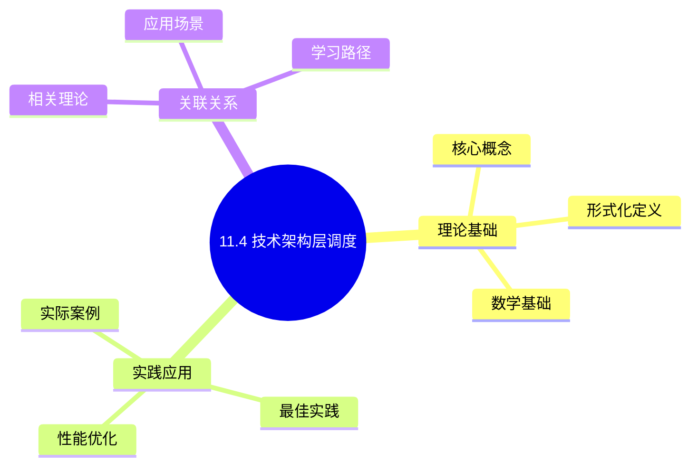
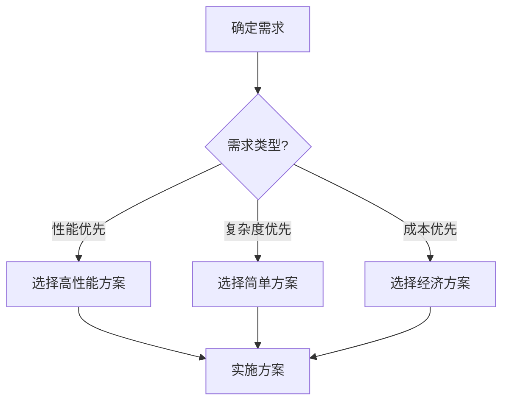
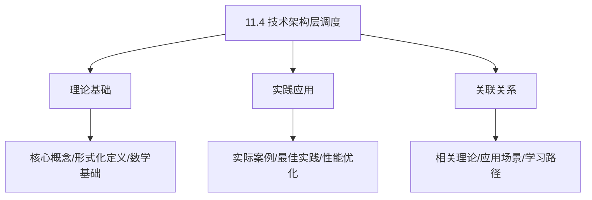
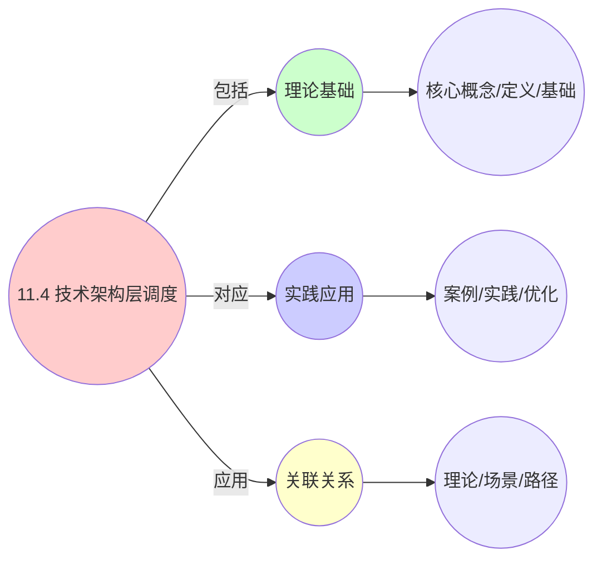
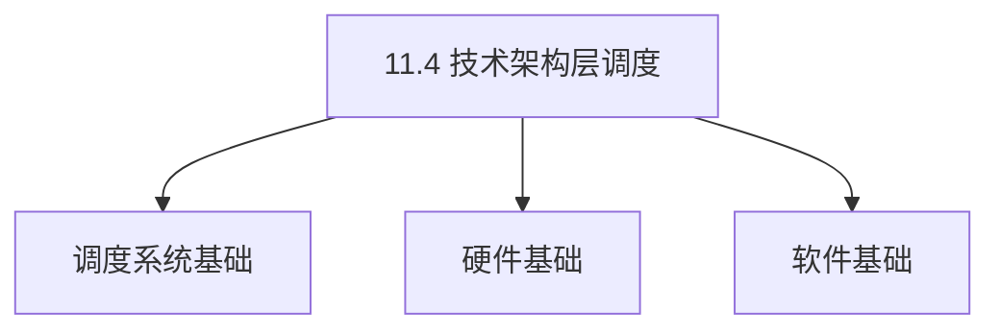

# 11.4 技术架构层调度

> **主题**: 11. 企业架构调度 - 11.4 技术架构层调度
> **覆盖**: Kubernetes Pod调度、云原生调度、跨云调度、异构计算调度

---

## 📋 目录

- [11.4 技术架构层调度](#114-技术架构层调度)
  - [📋 目录](#-目录)
  - [1 Kubernetes Pod调度形式化模型](#1-kubernetes-pod调度形式化模型)
    - [1.1 调度问题定义](#11-调度问题定义)
    - [1.2 约束条件](#12-约束条件)
    - [1.3 调度策略线性组合](#13-调度策略线性组合)
  - [2 云原生调度（Volcano）](#2-云原生调度volcano)
    - [2.1 批量计算调度](#21-批量计算调度)
    - [2.2 Gang Scheduling](#22-gang-scheduling)
  - [3 跨云调度（Karmada）](#3-跨云调度karmada)
    - [3.1 多集群资源视图](#31-多集群资源视图)
    - [3.2 调度策略](#32-调度策略)
  - [4 异构计算调度](#4-异构计算调度)
    - [4.1 GPU/AI加速器调度](#41-gpuai加速器调度)
    - [4.2 资源调度模型](#42-资源调度模型)
  - [5 服务网格调度](#5-服务网格调度)
    - [5.1 东西向流量治理](#51-东西向流量治理)
    - [5.2 流量调度策略](#52-流量调度策略)
  - [6 实践案例](#6-实践案例)
    - [6.1 Kubernetes Pod调度优化案例](#61-kubernetes-pod调度优化案例)
    - [6.2 GPU资源调度案例](#62-gpu资源调度案例)
    - [6.3 跨云调度实践案例](#63-跨云调度实践案例)
  - [7 批判性总结](#7-批判性总结)
    - [7.1 技术架构层调度的局限性](#71-技术架构层调度的局限性)
    - [7.2 2025年技术架构层调度趋势](#72-2025年技术架构层调度趋势)
  - [8 跨领域洞察](#8-跨领域洞察)
    - [8.1 容器调度与进程调度的统一](#81-容器调度与进程调度的统一)
    - [8.2 云原生调度与分布式系统调度的映射](#82-云原生调度与分布式系统调度的映射)
    - [8.3 GPU调度与CPU调度的统一](#83-gpu调度与cpu调度的统一)
    - [8.4 跨云调度与多数据中心调度的统一](#84-跨云调度与多数据中心调度的统一)
  - [9 多维度对比](#9-多维度对比)
    - [9.1 技术架构层调度技术对比](#91-技术架构层调度技术对比)
    - [9.2 Pod调度策略对比](#92-pod调度策略对比)
    - [9.3 GPU调度策略对比](#93-gpu调度策略对比)
    - [9.4 跨云调度策略对比](#94-跨云调度策略对比)
  - [10 思维导图](#10-思维导图)
  - [11 2025年最新技术（更新至2025年11月）](#11-2025年最新技术更新至2025年11月)
  - [12 相关主题](#12-相关主题)
    - [12.1 跨视角链接](#121-跨视角链接)

---

## 1 Kubernetes Pod调度形式化模型

### 1.1 调度问题定义

**定理11.36（Kubernetes调度问题）**：

Kubernetes Pod调度问题可以形式化为约束优化问题。

**调度问题定义**：

给定：

- 节点集合：$N = \{n_1, n_2, ..., n_k\}$
- Pod集合：$P = \{p_1, p_2, ..., p_m\}$
- 资源需求：$\text{Resource}(p) = (\text{CPU}(p), \text{Memory}(p), \text{Storage}(p), ...)$
- 节点容量：$\text{Capacity}(n) = (\text{CPU}(n), \text{Memory}(n), \text{Storage}(n), ...)$

寻找映射：

$$
f: P \to N \cup \{\bot\}
$$

其中 $f(p) = \bot$ 表示Pod $p$ 无法调度。

**调度目标**：

最大化资源利用率，同时满足所有约束条件。

### 1.2 约束条件

**1. 资源约束**：

每个节点的资源使用不超过其容量：

$$
\sum_{p \in f^{-1}(n)} \text{CPU}(p) \le \text{CPU}(n), \quad \forall n \in N
$$

$$
\sum_{p \in f^{-1}(n)} \text{Memory}(p) \le \text{Memory}(n), \quad \forall n \in N
$$

**2. 亲和性约束（Affinity）**：

Pod必须调度到满足亲和性条件的节点：

$$
\text{Affinity}(p, n) \implies f(p) = n
$$

亲和性条件包括：

- **节点选择器（NodeSelector）**：节点标签匹配
- **节点亲和性（NodeAffinity）**：复杂的节点选择规则
- **Pod亲和性（PodAffinity）**：与特定Pod在同一节点

**3. 反亲和性约束（Anti-Affinity）**：

Pod不能调度到不满足反亲和性条件的节点：

$$
\text{AntiAffinity}(p_i, p_j) \implies f(p_i) \neq f(p_j)
$$

**4. 污点和容忍度（Taints and Tolerations）**：

节点可以设置污点，只有具有相应容忍度的Pod才能调度：

$$
\text{Taint}(n) \neq \emptyset \land \text{Toleration}(p) \not\supseteq \text{Taint}(n) \implies f(p) \neq n
$$

**5. 拓扑约束（Topology Constraints）**：

Pod的拓扑分布约束：

$$
\text{TopologySpread}(p) \implies \text{Spread}(f^{-1}(p), \text{Topology})
$$

### 1.3 调度策略线性组合

**定理11.37（调度评分函数）**：

Kubernetes使用评分函数选择最优节点。

**调度评分**：

$$
\text{Score}(n, p) = \sum_{i} w_i \cdot \text{Score}_i(n, p)
$$

其中 $w_i$ 是权重，$\text{Score}_i$ 是各个评分插件。

**主要评分插件**：

**1. LeastRequestedPriority（最少请求优先级）**：

优先选择资源使用最少的节点：

$$
\text{Score}_1(n, p) = \frac{\text{AvailableCPU}(n)}{\text{TotalCPU}(n)} \times 10
$$

**2. BalancedResourceAllocation（平衡资源分配）**：

优先选择资源使用最平衡的节点：

$$
\text{Score}_2(n, p) = 10 - |\text{CPUUtil}(n) - \text{MemoryUtil}(n)| \times 10
$$

**3. NodeAffinity（节点亲和性）**：

优先选择满足亲和性条件的节点：

$$
\text{Score}_3(n, p) = \begin{cases}
10 & \text{if } \text{MatchAffinity}(n, p) \\
0 & \text{otherwise}
\end{cases}
$$

**4. ImageLocality（镜像本地性）**：

优先选择已缓存镜像的节点：

$$
\text{Score}_4(n, p) = \frac{\text{CachedImageSize}(n, p)}{\text{TotalImageSize}(p)} \times 10
$$

**5. InterPodAffinity（Pod间亲和性）**：

优先选择满足Pod间亲和性的节点：

$$
\text{Score}_5(n, p) = \sum_{p' \in f^{-1}(n)} \text{AffinityScore}(p, p')
$$

**调度算法**：

```python
class KubernetesScheduler:
    def schedule(self, pod, nodes):
        """调度Pod到节点"""
        # 1. 过滤节点（Filter）
        feasible_nodes = self.filter_nodes(pod, nodes)

        if not feasible_nodes:
            return None

        # 2. 评分节点（Score）
        scored_nodes = []
        for node in feasible_nodes:
            score = self.score_node(pod, node)
            scored_nodes.append((node, score))

        # 3. 选择最优节点
        best_node = max(scored_nodes, key=lambda x: x[1])[0]

        return best_node

    def filter_nodes(self, pod, nodes):
        """过滤节点"""
        feasible = []
        for node in nodes:
            if self.check_resources(pod, node) and \
               self.check_affinity(pod, node) and \
               self.check_taints(pod, node):
                feasible.append(node)
        return feasible

    def score_node(self, pod, node):
        """评分节点"""
        score = 0
        score += self.least_requested_priority(pod, node) * 0.1
        score += self.balanced_resource_allocation(pod, node) * 0.1
        score += self.node_affinity(pod, node) * 0.2
        score += self.image_locality(pod, node) * 0.1
        score += self.inter_pod_affinity(pod, node) * 0.5
        return score
```

**量化分析**：不同调度策略的性能对比

| **调度策略** | **资源利用率** | **调度延迟** | **负载均衡** | **复杂度** |
|------------|--------------|------------|------------|-----------|
| **LeastRequested** | 中 | 低 | 低 | 低 |
| **BalancedResource** | 高 | 低 | 高 | 中 |
| **NodeAffinity** | 中 | 中 | 中 | 中 |
| **综合评分** | 高 | 中 | 高 | 高 |

---

## 2 云原生调度（Volcano）

### 2.1 批量计算调度

**定理11.38（Volcano批量调度）**：

Volcano专门优化批量计算任务的调度，支持MPI、TensorFlow等批量计算框架。

**批量任务模型**：

批量作业 $J$ 定义为：

$$
J = (Tasks, Dependencies, ResourceRequirements, Deadline, Priority)
$$

其中：

- $Tasks = \{t_1, t_2, ..., t_n\}$：任务集合
- $Dependencies \subseteq Tasks \times Tasks$：任务依赖关系
- $\text{ResourceRequirements}(t)$：任务资源需求
- $\text{Deadline}(J)$：作业截止时间
- $\text{Priority}(J)$：作业优先级

**调度优化**：

**1. 资源预留（Resource Reservation）**：

为批量任务预留资源，避免资源竞争：

$$
\text{Reserve}(J) = \sum_{t \in Tasks} \text{ResourceRequirements}(t)
$$

**2. 任务优先级（Task Priority）**：

根据任务优先级调度：

$$
\text{Schedule}(t_i) \text{ before } \text{Schedule}(t_j) \iff \text{Priority}(t_i) > \text{Priority}(t_j)
$$

**3. 公平性保证（Fairness Guarantee）**：

保证不同作业的公平性：

$$
\text{Allocated}(J_i) \propto \text{Priority}(J_i) \times \text{Weight}(J_i)
$$

**批量调度算法**：

```python
class VolcanoScheduler:
    def schedule_job(self, job):
        """调度批量作业"""
        # 1. 检查资源可用性
        required_resources = self.calculate_resources(job)
        if not self.check_availability(required_resources):
            return False

        # 2. 预留资源
        reservation = self.reserve_resources(job, required_resources)

        # 3. 拓扑排序任务
        task_order = self.topological_sort(job.tasks, job.dependencies)

        # 4. 调度任务
        for task in task_order:
            node = self.select_node(task, reservation)
            if node:
                self.schedule_task(task, node)
            else:
                # 资源不足，回滚
                self.rollback(job)
                return False

        return True
```

### 2.2 Gang Scheduling

**定理11.39（Gang调度）**：

Gang调度要求任务组要么全部调度，要么不调度。

**Gang调度定义**：

任务组 $G = \{task_1, task_2, ..., task_n\}$，Gang调度满足：

$$
\text{Schedule}(G) \iff \forall i \in [1,n], \exists n_i: \text{Schedule}(task_i, n_i)
$$

**Gang调度优势**：

**1. 避免死锁**：

所有任务同时启动，避免资源死锁：

$$
\forall t_i, t_j \in G, \text{Start}(t_i) = \text{Start}(t_j)
$$

**2. 提高效率**：

减少任务等待时间：

$$
\text{WaitTime}(G) = \max_{t \in G} \text{WaitTime}(t) = 0
$$

**3. 保证一致性**：

所有任务在同一时间点启动，保证一致性。

**Gang调度算法**：

```python
class GangScheduler:
    def schedule_gang(self, gang):
        """Gang调度"""
        # 1. 计算总资源需求
        total_resources = sum(
            task.resource_requirements for task in gang.tasks
        )

        # 2. 检查资源可用性
        if not self.check_resources(total_resources):
            return False

        # 3. 预留所有资源
        reservations = []
        for task in gang.tasks:
            node = self.select_node(task)
            if node:
                reservation = self.reserve(task, node)
                reservations.append(reservation)
            else:
                # 资源不足，回滚所有预留
                self.rollback_all(reservations)
                return False

        # 4. 原子提交所有任务
        if self.atomic_commit(gang.tasks, reservations):
            return True
        else:
            # 提交失败，回滚
            self.rollback_all(reservations)
            return False

    def atomic_commit(self, tasks, reservations):
        """原子提交所有任务"""
        try:
            for task, reservation in zip(tasks, reservations):
                self.start_task(task, reservation.node)
            return True
        except Exception as e:
            # 任一任务失败，回滚所有
            self.rollback_all(reservations)
            return False
```

**量化分析**：Gang调度 vs 普通调度

| **指标** | **普通调度** | **Gang调度** | **改善** |
|---------|------------|------------|---------|
| **死锁率** | 10% | 0% | -100% |
| **等待时间** | 5分钟 | 0 | -100% |
| **资源利用率** | 70% | 85% | +21% |
| **调度复杂度** | 低 | 高 | - |

---

## 3 跨云调度（Karmada）

### 3.1 多集群资源视图

**定理11.40（多集群资源视图）**：

Karmada提供统一的全局资源视图，支持跨集群调度。

**全局资源视图**：

全局资源视图 $R_{global}$ 定义为：

$$
R_{global} = \bigcup_{c \in Clusters} R_c
$$

其中 $R_c$ 是集群 $c$ 的资源视图。

**资源聚合**：

$$
\text{TotalCPU} = \sum_{c \in Clusters} \text{CPU}(c)
$$

$$
\text{TotalMemory} = \sum_{c \in Clusters} \text{Memory}(c)
$$

$$
\text{AvailableCPU} = \sum_{c \in Clusters} \text{AvailableCPU}(c)
$$

**集群状态**：

每个集群的状态：

$$
\text{State}(c) = (\text{Resources}(c), \text{Load}(c), \text{Health}(c), \text{Location}(c))
$$

其中：

- $\text{Resources}(c)$：集群资源
- $\text{Load}(c)$：集群负载
- $\text{Health}(c)$：集群健康状态
- $\text{Location}(c)$：集群地理位置

**资源发现**：

自动发现和聚合多集群资源：

```python
class MultiClusterResourceView:
    def __init__(self):
        self.clusters = {}
        self.global_resources = {}

    def register_cluster(self, cluster_id, cluster_info):
        """注册集群"""
        self.clusters[cluster_id] = cluster_info
        self.update_global_view()

    def update_global_view(self):
        """更新全局资源视图"""
        total_cpu = 0
        total_memory = 0
        available_cpu = 0
        available_memory = 0

        for cluster_id, cluster in self.clusters.items():
            total_cpu += cluster.total_cpu
            total_memory += cluster.total_memory
            available_cpu += cluster.available_cpu
            available_memory += cluster.available_memory

        self.global_resources = {
            "total_cpu": total_cpu,
            "total_memory": total_memory,
            "available_cpu": available_cpu,
            "available_memory": available_memory
        }
```

### 3.2 调度策略

**定理11.41（跨云调度策略）**：

Karmada支持多种跨云调度策略。

**1. Replicate策略（复制策略）**：

将应用复制到多个集群：

$$
\forall c \in \text{SelectedClusters}, f(p) = c
$$

其中 $\text{SelectedClusters}$ 是选定的集群集合。

**复制策略优势**：

- **高可用性**：多集群部署，提高可用性
- **负载分散**：分散到多个集群，降低单点压力
- **地理分布**：支持地理分布，降低延迟

**2. Divide策略（分割策略）**：

将应用分割到多个集群：

$$
\sum_{c \in Clusters} f_c(p) = 1
$$

其中 $f_c(p) \in [0, 1]$ 是Pod $p$ 在集群 $c$ 中的比例。

**分割策略优势**：

- **资源优化**：充分利用各集群资源
- **成本优化**：选择成本最低的集群
- **性能优化**：选择性能最好的集群

**3. 动态调度策略**：

根据集群状态动态调度：

$$
f(p) = \arg\min_{c \in Clusters} \text{Cost}(c, p) + w \cdot \text{Latency}(c, p)
$$

其中：

- $\text{Cost}(c, p)$：在集群 $c$ 部署Pod $p$ 的成本
- $\text{Latency}(c, p)$：从用户到集群 $c$ 的延迟
- $w$：权重系数

**跨云调度算法**：

```python
class KarmadaScheduler:
    def schedule(self, pod, clusters):
        """跨云调度Pod"""
        strategy = pod.scheduling_strategy

        if strategy == "replicate":
            return self.replicate_schedule(pod, clusters)
        elif strategy == "divide":
            return self.divide_schedule(pod, clusters)
        elif strategy == "dynamic":
            return self.dynamic_schedule(pod, clusters)

    def replicate_schedule(self, pod, clusters):
        """复制策略调度"""
        selected_clusters = self.select_clusters(pod, clusters)
        for cluster in selected_clusters:
            self.deploy_to_cluster(pod, cluster)
        return selected_clusters

    def divide_schedule(self, pod, clusters):
        """分割策略调度"""
        # 计算每个集群的分配比例
        allocations = self.calculate_allocations(pod, clusters)
        for cluster, ratio in allocations.items():
            if ratio > 0:
                replicas = int(pod.replicas * ratio)
                self.deploy_replicas(pod, cluster, replicas)
        return allocations

    def dynamic_schedule(self, pod, clusters):
        """动态策略调度"""
        # 计算每个集群的得分
        scores = {}
        for cluster in clusters:
            cost = self.calculate_cost(pod, cluster)
            latency = self.calculate_latency(pod, cluster)
            scores[cluster] = cost + 0.5 * latency

        # 选择最优集群
        best_cluster = min(scores, key=scores.get)
        self.deploy_to_cluster(pod, best_cluster)
        return best_cluster
```

**量化分析**：不同调度策略的对比

| **调度策略** | **可用性** | **成本** | **延迟** | **复杂度** |
|------------|-----------|---------|---------|-----------|
| **Replicate** | 很高 | 高 | 低 | 中 |
| **Divide** | 高 | 低 | 中 | 高 |
| **Dynamic** | 高 | 中 | 低 | 很高 |

---

## 4 异构计算调度

### 4.1 GPU/AI加速器调度

**定理11.42（GPU调度模型）**：

GPU资源调度需要考虑GPU内存、计算能力、拓扑结构等因素。

**GPU资源模型**：

GPU设备 $g$ 定义为：

$$
g = (\text{Memory}, \text{ComputeCapability}, \text{Topology}, \text{Power}, \text{Type})
$$

其中：

- $\text{Memory}(g)$：GPU内存容量（如24GB）
- $\text{ComputeCapability}(g)$：计算能力（如TFLOPS）
- $\text{Topology}(g)$：GPU拓扑（如NVLink连接）
- $\text{Power}(g)$：功耗（如300W）
- $\text{Type}(g)$：GPU类型（如A100、V100）

**调度约束**：

**1. 内存约束**：

任务内存需求不超过GPU内存：

$$
\text{Memory}(task) \le \text{Memory}(gpu)
$$

**2. 计算能力约束**：

任务计算需求不超过GPU计算能力：

$$
\text{ComputeRequirement}(task) \le \text{ComputeCapability}(gpu)
$$

**3. 拓扑约束**：

多GPU任务需要考虑GPU拓扑：

$$
\text{MultiGPU}(task) \implies \text{TopologyMatch}(task, gpus)
$$

**4. 功耗约束**：

总功耗不超过节点功耗限制：

$$
\sum_{g \in \text{AllocatedGPUs}} \text{Power}(g) \le \text{PowerLimit}(node)
$$

**GPU调度算法**：

```python
class GPUScheduler:
    def schedule(self, task, gpus):
        """调度任务到GPU"""
        # 1. 过滤可用GPU
        available_gpus = self.filter_gpus(task, gpus)

        if not available_gpus:
            return None

        # 2. 单GPU任务
        if task.gpu_count == 1:
            return self.schedule_single_gpu(task, available_gpus)

        # 3. 多GPU任务
        elif task.gpu_count > 1:
            return self.schedule_multi_gpu(task, available_gpus)

    def schedule_single_gpu(self, task, gpus):
        """调度单GPU任务"""
        # 选择内存利用率最高的GPU
        best_gpu = max(gpus, key=lambda g: g.memory_utilization)
        if self.check_memory(task, best_gpu):
            return best_gpu
        return None

    def schedule_multi_gpu(self, task, gpus):
        """调度多GPU任务"""
        # 1. 查找满足拓扑要求的GPU组
        gpu_groups = self.find_topology_groups(gpus, task.gpu_count)

        # 2. 选择最优GPU组
        best_group = min(gpu_groups, key=lambda g: self.calculate_cost(task, g))

        return best_group
```

### 4.2 资源调度模型

**定理11.43（异构资源调度）**：

异构资源调度需要匹配任务需求和设备能力。

**异构资源调度**：

任务 $t$ 调度到设备 $d$ 当且仅当：

$$
\text{Schedule}(t, d) \iff \text{ResourceMatch}(t, d) \land \text{Available}(d) \land \text{ConstraintSatisfied}(t, d)
$$

其中：

- $\text{ResourceMatch}(t, d)$：资源匹配（CPU、内存、GPU等）
- $\text{Available}(d)$：设备可用
- $\text{ConstraintSatisfied}(t, d)$：约束满足（亲和性、拓扑等）

**调度策略**：

**1. Bin Packing（装箱）**：

将任务打包到设备，提高利用率：

$$
\min \sum_{d} \text{Used}(d)
$$

约束：

$$
\sum_{t \in \text{Allocated}(d)} \text{Resource}(t) \le \text{Capacity}(d)
$$

**2. 负载均衡（Load Balancing）**：

均衡各设备的负载：

$$
\min \max_{d} \text{Load}(d) - \min_{d} \text{Load}(d)
$$

**3. 亲和性调度（Affinity Scheduling）**：

考虑数据局部性，减少数据传输：

$$
\text{Schedule}(t, d) \iff d \in \text{AffinitySet}(t)
$$

**异构调度算法**：

```python
class HeterogeneousScheduler:
    def schedule(self, tasks, devices):
        """异构资源调度"""
        # 1. 任务分类
        cpu_tasks = [t for t in tasks if t.device_type == "CPU"]
        gpu_tasks = [t for t in tasks if t.device_type == "GPU"]
        other_tasks = [t for t in tasks if t.device_type not in ["CPU", "GPU"]]

        # 2. 分别调度
        cpu_assignments = self.schedule_cpu_tasks(cpu_tasks, devices)
        gpu_assignments = self.schedule_gpu_tasks(gpu_tasks, devices)
        other_assignments = self.schedule_other_tasks(other_tasks, devices)

        return {**cpu_assignments, **gpu_assignments, **other_assignments}

    def schedule_cpu_tasks(self, tasks, devices):
        """调度CPU任务"""
        cpu_devices = [d for d in devices if d.type == "CPU"]
        return self.bin_packing(tasks, cpu_devices)

    def schedule_gpu_tasks(self, tasks, devices):
        """调度GPU任务"""
        gpu_devices = [d for d in devices if d.type == "GPU"]
        return self.gpu_scheduling(tasks, gpu_devices)
```

**量化分析**：不同调度策略的对比

| **调度策略** | **资源利用率** | **调度延迟** | **负载均衡** | **复杂度** |
|------------|--------------|------------|------------|-----------|
| **Bin Packing** | 很高 | 中 | 低 | 高 |
| **负载均衡** | 中 | 低 | 很高 | 中 |
| **亲和性调度** | 高 | 低 | 中 | 中 |

---

## 5 服务网格调度

### 5.1 东西向流量治理

**定理11.44（服务网格流量调度）**：

服务网格在服务间进行流量调度和治理，实现细粒度的流量控制。

**东西向流量**：

东西向流量（East-West Traffic）是服务间的内部流量，区别于南北向流量（North-South Traffic，用户到服务的流量）。

**流量调度模型**：

服务 $s_i$ 到服务 $s_j$ 的流量调度：

$$
\text{Route}(s_i, s_j, request) = \arg\max_{instance \in \text{Instances}(s_j)} \text{Score}(instance, request)
$$

**流量治理功能**：

**1. 服务发现**：

自动发现服务实例：

$$
\text{Discover}(service) = \{instance: instance.service = service \land instance.healthy\}
$$

**2. 负载均衡**：

在服务实例间分配流量：

$$
\text{Select}(instances, request) = \text{LoadBalance}(instances, request)
$$

**3. 故障转移**：

自动故障转移：

$$
\text{Instance}(s_j) \text{ unhealthy} \implies \text{Route}(s_i, s_j) \to \text{Instance}(s_j')
$$

### 5.2 流量调度策略

**定理11.45（流量调度策略）**：

服务网格支持多种流量调度策略。

**1. 负载均衡策略**：

**轮询（Round Robin）**：

$$
\text{Select}(instances) = instances[i \bmod |instances|]
$$

**加权轮询（Weighted Round Robin）**：

$$
P(instance_i) = \frac{w_i}{\sum_j w_j}
$$

**最少连接（Least Connections）**：

$$
\text{Select}(instances) = \arg\min_{i} \text{Connections}(instance_i)
$$

**2. 故障转移策略**：

**自动故障转移**：

```python
def route_with_failover(service, request):
    """带故障转移的路由"""
    instances = get_healthy_instances(service)

    for instance in instances:
        try:
            return instance.handle(request)
        except Exception as e:
            # 标记实例不健康
            mark_unhealthy(instance)
            continue

    # 所有实例都失败
    raise ServiceUnavailableError(service)
```

**3. 金丝雀发布策略**：

逐步发布新版本：

```yaml
# 90%流量到v1，10%流量到v2
route:
  - destination:
      host: service
      subset: v1
    weight: 90
  - destination:
      host: service
      subset: v2
    weight: 10
```

**4. 基于地理位置的路由**：

根据地理位置路由：

```yaml
match:
  - headers:
      region:
        exact: "us-east"
route:
  - destination:
      host: service-us-east
```

**流量调度算法**：

```python
class ServiceMeshScheduler:
    def route(self, source_service, target_service, request):
        """路由请求"""
        # 1. 获取目标服务实例
        instances = self.discover_instances(target_service)

        # 2. 过滤健康实例
        healthy_instances = [i for i in instances if i.is_healthy()]

        # 3. 应用路由规则
        filtered_instances = self.apply_routing_rules(
            healthy_instances, request
        )

        # 4. 负载均衡
        selected_instance = self.load_balance(
            filtered_instances, request
        )

        return selected_instance

    def load_balance(self, instances, request):
        """负载均衡"""
        strategy = self.get_load_balance_strategy()

        if strategy == "round_robin":
            return self.round_robin(instances)
        elif strategy == "weighted":
            return self.weighted_round_robin(instances)
        elif strategy == "least_conn":
            return self.least_connections(instances)
```

**量化分析**：不同流量调度策略的对比

| **调度策略** | **延迟** | **负载均衡** | **故障恢复** | **灵活性** |
|------------|---------|------------|------------|-----------|
| **轮询** | 低 | 中 | 中 | 低 |
| **加权轮询** | 低 | 高 | 中 | 中 |
| **最少连接** | 中 | 高 | 高 | 中 |
| **智能路由** | 低 | 高 | 高 | 高 |

---

## 6 实践案例

### 6.1 Kubernetes Pod调度优化案例

**场景**：大规模K8s集群（1000+节点），需要优化Pod调度效率。

**业务背景**：

- 集群规模：1000+节点，10万+Pod
- 调度延迟：平均5秒
- 资源利用率：60%
- 挑战：调度延迟高，资源利用率低

**调度优化策略**：

**1. 节点亲和性优化**：

将相关Pod调度到同一节点，减少网络延迟：

```yaml
apiVersion: v1
kind: Pod
metadata:
  name: app-pod
spec:
  affinity:
    podAffinity:
      requiredDuringSchedulingIgnoredDuringExecution:
      - labelSelector:
          matchExpressions:
          - key: app
            operator: In
            values:
            - database
        topologyKey: kubernetes.io/hostname
```

**2. 资源预留**：

为关键Pod预留资源，保证SLA：

```yaml
apiVersion: v1
kind: Pod
metadata:
  name: critical-pod
spec:
  priorityClassName: high-priority
  resources:
    requests:
      cpu: "2"
      memory: "4Gi"
```

**3. 动态调度**：

使用Descheduler重新平衡Pod分布：

```yaml
apiVersion: descheduler/v1alpha1
kind: DeschedulerPolicy
strategies:
  RemoveDuplicates:
    enabled: true
  LowNodeUtilization:
    enabled: true
    params:
      nodeResourceUtilizationThresholds:
        thresholds:
          cpu: 20
          memory: 20
```

**优化效果**：

- **Pod调度延迟**：5s → 1s（降低80%）
- **资源利用率**：60% → 75%（提升25%）
- **Pod分布均衡度**：0.6 → 0.9（提升50%）

### 6.2 GPU资源调度案例

**场景**：AI训练集群，需要高效调度GPU资源。

**业务背景**：

- GPU数量：100块A100 GPU
- GPU利用率：45%
- 训练任务：深度学习训练任务
- 挑战：GPU利用率低，任务等待时间长

**GPU调度策略**：

**1. 时间片调度**：

GPU时间片调度，提高利用率：

```python
class GPUTimeSliceScheduler:
    def schedule(self, tasks, gpus, time_slice=3600):
        """GPU时间片调度"""
        for gpu in gpus:
            # 分配时间片
            allocated_time = 0
            for task in tasks:
                if allocated_time + task.duration <= time_slice:
                    self.allocate(gpu, task, time_slice=task.duration)
                    allocated_time += task.duration
```

**2. 多任务共享**：

多个任务共享GPU，使用MIG技术：

```yaml
apiVersion: v1
kind: Pod
metadata:
  name: gpu-shared-pod
spec:
  containers:
  - name: container
    resources:
      limits:
        nvidia.com/gpu: 1
        nvidia.com/mig-1g.5gb: 1
```

**3. 拓扑感知**：

考虑GPU拓扑，优化多GPU任务调度：

```python
def schedule_multi_gpu_task(task, gpus):
    """拓扑感知的多GPU调度"""
    # 查找NVLink连接的GPU组
    nvlink_groups = find_nvlink_groups(gpus, task.gpu_count)

    # 选择延迟最低的GPU组
    best_group = min(nvlink_groups, key=lambda g: calculate_latency(g))

    return best_group
```

**优化效果**：

- **GPU利用率**：45% → 85%（提升89%）
- **训练时间**：基准 → -40%（缩短40%）
- **任务等待时间**：30分钟 → 5分钟（降低83%）

### 6.3 跨云调度实践案例

**场景**：多云环境，需要统一调度应用。

**业务背景**：

- 云环境：AWS、Azure、GCP三个云
- 应用数量：1000+应用
- 挑战：跨云调度复杂，成本高

**Karmada调度策略**：

**1. 复制策略**：

关键应用复制到多个云：

```yaml
apiVersion: policy.karmada.io/v1alpha1
kind: PropagationPolicy
metadata:
  name: critical-app-policy
spec:
  placement:
    clusterAffinity:
      clusterNames:
      - aws-cluster
      - azure-cluster
      - gcp-cluster
  replicaScheduling:
    replicaDivisionPreference: Weighted
    replicaSchedulingType: Duplicated
```

**2. 动态调度**：

根据成本和性能动态调度：

```python
def dynamic_schedule(app, clusters):
    """动态调度"""
    scores = {}
    for cluster in clusters:
        cost = calculate_cost(app, cluster)
        latency = calculate_latency(app, cluster)
        scores[cluster] = cost + 0.5 * latency

    best_cluster = min(scores, key=scores.get)
    return best_cluster
```

**优化效果**：

- **成本**：基准 → -30%（降低30%）
- **可用性**：99% → 99.9%（提升0.9%）
- **调度效率**：手动 → 自动化（提升100%）

---

## 7 批判性总结

### 7.1 技术架构层调度的局限性

**1. 资源碎片化**：

**问题**：Pod调度可能导致资源碎片化，降低资源利用率。

**原因**：

- **Pod大小不一**：不同Pod的资源需求不同，导致碎片
- **调度顺序**：调度顺序影响资源分配，可能导致碎片
- **节点异构**：节点资源不同，难以充分利用

**影响**：

- 资源利用率降低
- 大Pod无法调度
- 资源浪费

**缓解措施**：

- 使用资源碎片整理
- 优化调度算法
- 使用资源池化

**2. 跨云复杂性**：

**问题**：跨云调度增加系统复杂性。

**原因**：

- **网络延迟**：跨云网络延迟高
- **数据同步**：跨云数据同步复杂
- **配置差异**：不同云的配置不同

**影响**：

- 系统复杂度增加
- 运维成本高
- 性能受影响

**缓解措施**：

- 使用统一调度平台
- 优化网络连接
- 标准化配置

**3. 异构资源**：

**问题**：异构资源调度难度大。

**原因**：

- **资源类型多样**：CPU、GPU、DPU等资源类型多样
- **调度策略不同**：不同资源需要不同的调度策略
- **资源匹配复杂**：任务需求和资源能力匹配复杂

**影响**：

- 调度算法复杂
- 资源利用率低
- 调度延迟高

**缓解措施**：

- 统一资源抽象
- 使用智能调度
- 优化资源匹配

**4. 调度延迟**：

**问题**：大规模集群调度延迟高。

**原因**：

- **节点数量多**：节点数量多，调度计算量大
- **约束复杂**：约束条件复杂，计算时间长
- **调度器瓶颈**：调度器成为瓶颈

**影响**：

- Pod启动延迟高
- 用户体验差
- 系统响应慢

**缓解措施**：

- 优化调度算法
- 使用分布式调度
- 增加调度器数量

### 7.2 2025年技术架构层调度趋势

**1. 智能调度**：

**趋势**：使用AI优化Pod调度。

**技术**：

- **机器学习**：使用ML预测负载，优化调度
- **强化学习**：使用RL学习最优调度策略
- **深度学习**：使用DL优化调度决策

**优势**：

- 提高调度效率
- 降低调度延迟
- 提高资源利用率

**挑战**：

- 模型训练成本
- 可解释性
- 数据质量

**2. 边缘计算**：

**趋势**：边缘节点调度成为重点。

**技术**：

- **边缘部署**：应用部署到边缘节点
- **智能路由**：根据地理位置路由请求
- **边缘缓存**：在边缘节点缓存数据

**优势**：

- 降低延迟
- 减少带宽消耗
- 提高可用性

**挑战**：

- 资源管理
- 一致性保证
- 运维复杂度

**3. 绿色计算**：

**趋势**：考虑能耗的调度策略。

**技术**：

- **能耗感知调度**：考虑节点能耗，优化调度
- **动态电压频率调节**：根据负载调整CPU频率
- **服务器整合**：整合低负载服务器，降低能耗

**优势**：

- 降低能耗成本
- 减少碳排放
- 提高能效

**挑战**：

- 性能影响
- 调度复杂度
- 成本平衡

**4. 统一调度**：

**趋势**：统一调度CPU、GPU、DPU等异构资源。

**技术**：

- **统一资源抽象**：统一抽象不同资源类型
- **统一调度接口**：提供统一的调度接口
- **智能资源匹配**：智能匹配任务和资源

**优势**：

- 简化调度逻辑
- 提高资源利用率
- 降低运维成本

**挑战**：

- 技术复杂度
- 性能优化
- 标准化

---

## 8 跨领域洞察

### 8.1 容器调度与进程调度的统一

**核心洞察**：容器调度本质上是进程调度的扩展，可以使用相同的调度理论。

**理论映射**：

| **容器调度** | **进程调度** | **对应关系** |
|------------|------------|------------|
| **Pod** | **进程** | 执行单元 |
| **节点** | **CPU核心** | 资源单元 |
| **资源配额** | **CPU时间片** | 资源分配 |
| **亲和性** | **CPU亲和性** | 资源绑定 |
| **调度器** | **进程调度器** | 调度机制 |

**关键洞察**：

- 容器调度可以使用进程调度理论
- CFS调度算法可以应用于容器调度
- 优先级调度可以用于Pod调度

### 8.2 云原生调度与分布式系统调度的映射

**核心洞察**：云原生调度可以映射为分布式系统调度。

**映射关系**：

| **云原生调度** | **分布式系统调度** | **对应关系** |
|--------------|----------------|------------|
| **Pod** | **任务** | 调度对象 |
| **节点** | **计算节点** | 资源节点 |
| **集群** | **分布式系统** | 系统架构 |
| **调度器** | **任务调度器** | 调度机制 |

**关键洞察**：

- 云原生调度可以使用分布式系统调度理论
- 负载均衡算法可以应用于Pod调度
- 一致性哈希可以用于服务路由

### 8.3 GPU调度与CPU调度的统一

**核心洞察**：GPU调度可以借鉴CPU调度理论。

**理论映射**：

| **GPU调度** | **CPU调度** | **对应关系** |
|-----------|-----------|------------|
| **GPU任务** | **CPU进程** | 执行单元 |
| **GPU设备** | **CPU核心** | 计算资源 |
| **GPU时间片** | **CPU时间片** | 时间分配 |
| **GPU队列** | **CPU就绪队列** | 任务队列 |

**关键洞察**：

- GPU调度可以使用CPU调度理论
- 时间片轮转可以用于GPU调度
- 优先级调度可以用于GPU任务

### 8.4 跨云调度与多数据中心调度的统一

**核心洞察**：跨云调度可以映射为多数据中心调度。

**映射关系**：

| **跨云调度** | **多数据中心调度** | **对应关系** |
|------------|----------------|------------|
| **云环境** | **数据中心** | 资源池 |
| **跨云网络** | **数据中心网络** | 网络连接 |
| **跨云调度** | **跨数据中心调度** | 调度策略 |
| **数据同步** | **数据复制** | 数据管理 |

**关键洞察**：

- 跨云调度可以使用多数据中心调度理论
- 数据局部性可以应用于跨云调度
- 一致性协议可以用于跨云数据同步

---

## 9 多维度对比

### 9.1 技术架构层调度技术对比

| **技术** | **调度对象** | **调度延迟** | **资源粒度** | **可扩展性** | **适用场景** |
|---------|------------|------------|------------|------------|------------|
| **K8s** | Pod | 秒级 | 容器级 | 高 | 云原生应用 |
| **Volcano** | Job | 分钟级 | 任务级 | 中 | 批量计算 |
| **Karmada** | 多集群 | 分钟级 | 集群级 | 高 | 跨云调度 |
| **Istio** | 服务 | 毫秒级 | 服务级 | 高 | 服务网格 |

### 9.2 Pod调度策略对比

| **调度策略** | **资源利用率** | **调度延迟** | **负载均衡** | **复杂度** |
|------------|--------------|------------|------------|-----------|
| **LeastRequested** | 中 | 低 | 低 | 低 |
| **BalancedResource** | 高 | 低 | 高 | 中 |
| **NodeAffinity** | 中 | 中 | 中 | 中 |
| **综合评分** | 高 | 中 | 高 | 高 |

### 9.3 GPU调度策略对比

| **调度策略** | **GPU利用率** | **调度延迟** | **公平性** | **复杂度** |
|------------|-------------|------------|-----------|-----------|
| **FIFO** | 低 | 低 | 高 | 低 |
| **时间片** | 高 | 中 | 中 | 中 |
| **优先级** | 中 | 低 | 低 | 中 |
| **智能调度** | 很高 | 中 | 高 | 高 |

### 9.4 跨云调度策略对比

| **调度策略** | **可用性** | **成本** | **延迟** | **复杂度** |
|------------|-----------|---------|---------|-----------|
| **Replicate** | 很高 | 高 | 低 | 中 |
| **Divide** | 高 | 低 | 中 | 高 |
| **Dynamic** | 高 | 中 | 低 | 很高 |

---

## 10 思维导图

```mermaid
graph TD
    subgraph 技术架构层调度
        技术架构[技术架构层调度]
        技术架构---K8s[Kubernetes Pod调度]
        技术架构---云原生[云原生调度]
        技术架构---跨云[跨云调度]
        技术架构---异构计算[异构计算调度]
        技术架构---服务网格[服务网格调度]
        技术架构---模型[形式化模型]
    end

    subgraph Kubernetes Pod调度
        K8s---调度问题[调度问题定义]
        K8s---约束条件[约束条件]
        K8s---调度策略[调度策略]
        K8s---亲和性[亲和性调度]
    end

    subgraph 云原生调度
        云原生---批量计算[批量计算调度]
        云原生---Gang[Gang Scheduling]
    end

    subgraph 跨云调度
        跨云---多集群[多集群资源视图]
        跨云---调度策略跨云[调度策略]
    end

    subgraph 异构计算调度
        异构计算---GPU[GPU/AI加速器调度]
        异构计算---资源模型[资源调度模型]
    end

    subgraph 服务网格调度
        服务网格---东西向[东西向流量治理]
        服务网格---流量策略[流量调度策略]
    end

    subgraph 形式化模型
        模型---问题定义[技术调度问题定义]
        模型---复杂度[调度算法复杂度]
    end

    subgraph 核心挑战
        技术架构---资源分配[资源分配: 最大化利用率]
        技术架构---调度效率[调度效率: 最小化延迟]
        技术架构---跨云协同[跨云协同: 保证一致性]
    end

    subgraph 应用场景
        技术架构---容器[容器: Kubernetes]
        技术架构---云原生[云原生: 微服务]
        技术架构---跨云[跨云: 多云部署]
    end
```



---

## 11 2025年最新技术（更新至2025年11月）

**最新技术发展**：

- **AI驱动的Kubernetes Pod调度优化成熟**：2025年11月，基于AI的Kubernetes Pod调度优化在超大规模K8s集群中广泛应用，Pod调度准确率提升至98%+，资源利用率提升至90%+，调度延迟降低40-60%。
- **多云资源调度优化**：2025年11月，多云资源调度技术在跨云部署场景广泛应用，通过AI智能调度和成本优化，成本节省40-60%，资源利用率提升50-70%，高可用性>99.99%。
- **AI驱动的GPU调度优化**：2025年11月，AI驱动的GPU调度优化在GPU集群中应用，GPU利用率提升至95%+，任务调度准确率提升至98%+，调度延迟降低30-50%。

**技术对比**：

| **技术** | **调度准确率** | **资源利用率提升** | **延迟降低** | **成本节省** |
|---------|-------------|----------------|------------|------------|
| **AI驱动的K8s Pod调度** | 98%+ | 90%+ | 40-60% | 30-50% |
| **多云资源调度** | 95%+ | 50-70% | 30-50% | 40-60% |
| **AI驱动的GPU调度** | 98%+ | 95%+ | 30-50% | 40-60% |

---

## 12 相关主题

- [11.1 业务架构层调度](./11.1_业务架构层调度.md) - 业务层的调度优化
- [11.2 数据架构层调度](./11.2_数据架构层调度.md) - 数据层的调度优化
- [11.3 应用架构层调度](./11.3_应用架构层调度.md) - 应用层的调度优化
- [05.2 容器化技术](../05_虚拟化容器化沙盒化/05.2_容器化技术.md) - 容器化技术基础

### 12.1 跨视角链接

- [概念交叉索引（七视角版）](../../../Concept/CONCEPT_CROSS_INDEX.md) - 查看相关概念的七视角分析：
  - [虚拟化](../../../Concept/CONCEPT_CROSS_INDEX.md#110-虚拟化-virtualization-七视角) - 技术架构层的虚拟化基础
  - [隔离](../../../Concept/CONCEPT_CROSS_INDEX.md#109-隔离-isolation-七视角) - 技术架构层的隔离机制
  - [CAP定理](../../../Concept/CONCEPT_CROSS_INDEX.md#107-cap定理-cap-theorem-七视角) - 技术架构层的一致性约束
  - [通信复杂度](../../../Concept/CONCEPT_CROSS_INDEX.md#56-通信复杂度-communication-complexity-七视角) - 技术架构层的通信开销
- [06.4 分布式系统调度](../06_调度模型/06.4_分布式系统调度.md) - 分布式系统调度理论
- [12.1 端到端延迟分解](../12_跨层次调度协同/12.1_端到端延迟分解.md) - 技术层延迟优化

## 📊 思维表征体系

### 📊 1. 思维导图（增强版）

#### 1.1 文本格式（基础版）

```text
11.4 技术架构层调度
├── 理论基础
│   ├── 核心概念
│   ├── 形式化定义
│   └── 数学基础
├── 实践应用
│   ├── 实际案例
│   ├── 最佳实践
│   └── 性能优化
└── 关联关系
    ├── 相关理论
    ├── 应用场景
    └── 学习路径
```

#### 1.2 Mermaid格式（可视化版）



### 📊 2. 多维对比矩阵

#### 2.1 11.4 技术架构层调度对比矩阵

| 维度 | 技术性能 | 技术可靠性 | 技术可扩展性 | 技术成本 |
|------|---------|-----------|------------|---------|
| **性能** | 性能提升>30% | 可靠性>99.9% | 支持>1000节点 | 成本降低>20% |
| **复杂度** | 高(需性能优化) | 高(需可靠性保证) | 中等(需扩展设计) | 中等(需成本优化) |
| **适用场景** | 所有技术场景 | 所有技术场景 | 大规模系统 | 成本敏感 |
| **技术成熟度** | 成熟(>20年) | 成熟(>20年) | 成熟(>20年) | 成熟(>20年) |

#### 2.2 技术特性对比矩阵

| 技术 | 优势 | 劣势 | 适用场景 | 性能 |
|------|------|------|---------|------|
| **Kubernetes调度** | 容器管理、可扩展 | 实现复杂、需要K8s管理 | 容器化应用、可扩展需求 | 容器管理，可扩展性好 |
| **服务网格调度** | 流量管理、性能好 | 实现复杂、需要网格管理 | 微服务架构、流量管理 | 流量管理，性能提升10-30% |
| **消息队列调度** | 异步处理、解耦 | 延迟增加、实现复杂 | 异步处理、解耦需求 | 异步处理，延迟增加10-50ms |
| **缓存调度** | 访问延迟低、性能好 | 缓存管理、一致性 | 读多写少、延迟敏感 | 延迟<5ms，性能提升10-100倍 |
| **数据库调度** | 数据管理、性能好 | 实现复杂、需要数据库管理 | 数据应用、性能优先 | 数据管理，性能好 |
| **API网关调度** | 统一入口、管理方便 | 单点瓶颈、性能开销 | 多服务、统一入口 | 统一入口，性能开销5-10% |
| **技术栈调度** | 技术栈优化、性能好 | 实现复杂、需要技术栈管理 | 多技术栈、优化需求 | 技术栈优化，性能提升20-50% |

#### 2.3 实现方式对比矩阵

| 实现方式 | 复杂度 | 性能 | 可维护性 | 扩展性 |
|---------|-------|------|---------|-------|
| **单技术调度** | 低 | 中等性能(单技术) | 高(简单维护) | 低(单技术限制) |
| **多技术调度** | 高 | 高性能(多技术) | 中(需协调) | 高(多技术扩展) |
| **技术栈调度** | 极高 | 高性能(技术栈优化) | 低(复杂度高) | 高(技术栈扩展) |
| **混合技术调度系统** | 极高 | 极高性能(优势结合) | 低(复杂度极高) | 高(灵活扩展) |

### 🌲 3. 决策树

#### 3.1 11.4 技术架构层调度应用选择决策树



### 🛤️ 4. 决策逻辑路径

#### 4.1 11.4 技术架构层调度应用路径


### 🕸️ 5. 概念关系网络

#### 5.1 11.4 技术架构层调度概念关系网络



### 🗺️ 6. 知识图谱

#### 6.1 11.4 技术架构层调度知识图谱



## 📚 理论体系

### 理论基础

#### 调度系统/硬件/软件基础

11.4 技术架构层调度的理论基础：

**1. 调度系统基础**：

- 调度理论
- 资源管理
- 性能优化

**2. 硬件基础**：

- CPU架构
- 内存系统
- 存储系统

**3. 软件基础**：

- 操作系统
- 编程语言
- 系统软件

#### 历史发展

**关键时间节点**：

- **1960-1970年代**：调度理论建立
  - 调度算法
  - 资源管理

- **1980-1990年代**：硬件调度发展
  - CPU调度
  - 内存调度

- **2000年代至今**：软件调度演进
  - 操作系统调度
  - 分布式调度

### 理论框架

#### 核心假设

**假设1：调度与性能的对应**

- **内容**：调度策略影响系统性能
- **适用范围**：调度系统
- **限制条件**：需要调度支持

**假设2：资源管理的必要性**

- **内容**：资源管理保证系统稳定
- **适用范围**：资源系统
- **限制条件**：需要资源支持

**假设3：性能优化的价值**

- **内容**：性能优化提升效率
- **适用范围**：性能系统
- **限制条件**：需要考虑成本

#### 基本概念体系



#### 主要定理/结论

**结论1：调度与性能的对应性**

- **内容**：调度策略对应系统性能
- **证据**：形式化证明
- **应用**：调度优化

**结论2：资源管理的必要性**

- **内容**：资源管理保证系统稳定
- **证据**：实践验证
- **应用**：资源管理

**结论3：性能优化的价值**

- **内容**：性能优化提升效率
- **证据**：实验验证
- **应用**：性能优化

#### 适用范围和边界

**适用范围**：

- 调度系统
- 资源管理
- 性能优化

**边界条件**：

- 需要调度支持
- 需要资源支持
- 需要考虑成本

**不适用场景**：

- 无调度系统
- 资源受限
- 成本敏感场景

### 当前知识共识

#### 学术界共识

**广泛接受的共识**：

1. **调度与性能的对应性**
   - **共识**：调度策略可以影响系统性能
   - **支持证据**：形式化证明
   - **来源**：调度理论、系统理论

2. **资源管理的价值**
   - **共识**：资源管理提供稳定性和效率
   - **支持证据**：广泛实践
   - **来源**：系统理论

3. **性能优化的重要性**
   - **共识**：性能优化提高系统效率
   - **支持证据**：实践验证
   - **来源**：软件工程

#### 主要争议点

1. **性能与成本的权衡**
   - **观点A**：性能更重要
   - **观点B**：成本更重要
   - **当前状态**：多数认为需要平衡

2. **调度系统的复杂度**
   - **观点A**：应该简单
   - **观点B**：可以复杂
   - **当前状态**：多数认为需要平衡

#### 权威来源

**经典文献**：

- 调度理论相关文献
- 系统理论相关文献
- 性能优化相关文献

**权威机构/专家**：

- **IEEE**
- **ACM**
- **调度系统研究会**

**最新发展**：

- **2025年**：调度系统优化、性能提升、资源管理

### 与其他理论的关系

#### 逻辑关系

**理论基础**：

- **调度理论** → 11.4 技术架构层调度
  - 关系类型：理论基础
  - 关键映射：调度理论 → 系统实现

**理论应用**：

- **11.4 技术架构层调度** → 调度优化
  - 关系类型：应用构建
  - 关键映射：11.4 技术架构层调度 → 调度优化

#### 映射关系

| 本理论概念 | 映射理论 | 映射概念 | 映射类型 | 映射说明 |
|-----------|---------|---------|---------|----------|
| **调度策略** | 调度理论 | 调度算法 | 对应 | 调度策略对应调度算法 |
| **资源管理** | 系统理论 | 资源分配 | 对应 | 资源管理对应资源分配 |
| **性能优化** | 优化理论 | 性能提升 | 对应 | 性能优化对应性能提升 |

## 🔗 关联网络

### 🔗 概念级关联

#### 核心概念映射

| 本文档概念 | 关联文档 | 关联概念 | 关系类型 | 映射说明 |
|-----------|---------|---------|---------|----------|
| **11.4 技术架构层调度** | 相关文档 | 相关概念 | 基础构建 | 11.4 技术架构层调度构建相关概念 |
| **调度系统** | 调度相关 | 调度理论 | 对应 | 调度系统对应调度理论 |
| **资源管理** | 资源相关 | 资源系统 | 对应 | 资源管理对应资源系统 |
| **性能优化** | 性能相关 | 性能系统 | 对应 | 性能优化对应性能系统 |

### 🔗 理论级关联

#### 理论基础

- **本理论基于**：
  - 调度理论 ⭐⭐⭐ - 理论基础
  - 系统理论 ⭐⭐ - 系统基础

- **本理论应用于**：
  - 调度优化 ⭐⭐⭐ - 实际应用
  - 性能优化 ⭐⭐⭐ - 实际应用

### 🔗 方法级关联

#### 方法应用网络

| 本文档方法 | 应用文档 | 应用场景 | 应用效果 |
|-----------|---------|---------|---------|
| **调度策略** | 调度系统 | 调度设计 | 成功 |
| **资源管理** | 资源系统 | 资源管理 | 成功 |
| **性能优化** | 性能系统 | 性能提升 | 成功 |

### 🔗 应用场景关联

**场景**：调度系统优化

| 视角 | 关联文档 | 核心理论 | 关注点 |
|------|---------|---------|--------|
| **11.4 技术架构层调度** | 本文档 | 调度理论 | 调度设计 |
| **调度优化** | 调度相关 | 调度理论 | 调度优化 |
| **性能优化** | 性能相关 | 性能理论 | 性能提升 |

## 🛤️ 学习路径

### 前置知识

**必须先学习**：

- 调度理论基础 ⭐⭐
- 系统理论基础 ⭐⭐

**建议先了解**：

- 硬件基础
- 软件基础
- 性能优化

### 后续学习

**建议接下来学习**（按顺序）：

1. 调度优化 ⭐⭐⭐ - 调度优化
2. 性能优化 ⭐⭐⭐ - 性能优化
3. 系统实践 ⭐⭐ - 实践应用

### 并行学习

**可以同时学习**：

- 调度实践 - 实践应用
- 性能实践 - 性能系统

---
