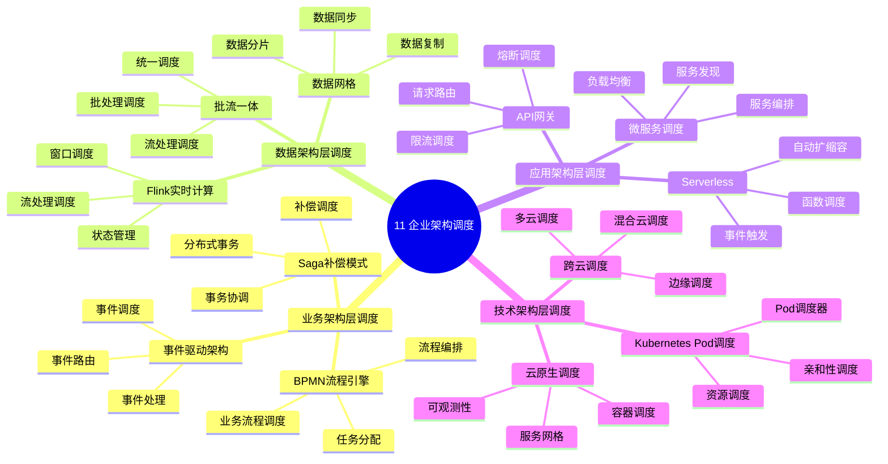

# 11. 企业架构调度

> **主题**: 企业架构视角下的调度分层体系
> **覆盖范围**: 业务架构层、数据架构层、应用架构层、技术架构层调度

---

## 📋 目录

- [11. 企业架构调度](#11-企业架构调度)
  - [📋 目录](#-目录)
  - [1 子主题索引](#1-子主题索引)
    - [1.0 企业架构调度思维导图](#10-企业架构调度思维导图)
  - [2 相关主题](#2-相关主题)
  - [3 核心概念矩阵](#3-核心概念矩阵)

---

## 1 子主题索引

### 1.0 企业架构调度思维导图

**可视化文档**: 查看 [思维导图与知识矩阵](../思维导图与知识矩阵.md#310-10-24-扩展主题) 获取更详细的思维导图。

- [11.1 业务架构层调度](./11.1_业务架构层调度.md) - BPMN流程引擎、事件驱动架构、Saga补偿模式
- [11.2 数据架构层调度](./11.2_数据架构层调度.md) - Flink实时计算、批流一体、数据网格
- [11.3 应用架构层调度](./11.3_应用架构层调度.md) - 微服务调度、Serverless、API网关
- [11.4 技术架构层调度](./11.4_技术架构层调度.md) - Kubernetes Pod调度、云原生调度、跨云调度

---

## 2 相关主题

- [06. 调度模型](../06_调度模型/README.md)
- [05. 虚拟化容器化沙盒化](../05_虚拟化容器化沙盒化/README.md)

---

## 3 核心概念矩阵

| **架构层级** | **调度单位** | **时间粒度** | **优化目标** |
|------------|------------|------------|------------|
| **业务架构层** | 业务流程实例 | 分钟-小时 | 业务SLA达成率 |
| **数据架构层** | 数据分片 | 秒-分钟 | 数据新鲜度 |
| **应用架构层** | 微服务实例 | 毫秒-秒 | 服务P99延迟 |
| **技术架构层** | Pod/容器 | 毫秒级 | 集群资源碎片率 |

---

**最后更新**: 2025-11-14
