# 12.1 端到端延迟分解

> **主题**: 12. 跨层次调度协同 - 12.1 端到端延迟分解
> **覆盖**: 延迟分解模型、优化目标、瓶颈识别、跨层优化

---

## 📋 目录

- [12.1 端到端延迟分解](#121-端到端延迟分解)
  - [📋 目录](#-目录)
  - [1 端到端延迟分解模型](#1-端到端延迟分解模型)
    - [1.1 延迟组成分析](#11-延迟组成分析)
    - [1.2 延迟累积效应](#12-延迟累积效应)
  - [2 优化目标](#2-优化目标)
    - [2.1 SLA约束](#21-sla约束)
    - [2.2 优化策略](#22-优化策略)
  - [3 瓶颈识别](#3-瓶颈识别)
    - [3.1 延迟分析工具](#31-延迟分析工具)
    - [3.2 瓶颈定位方法](#32-瓶颈定位方法)
  - [4 跨层优化](#4-跨层优化)
    - [4.1 协同优化策略](#41-协同优化策略)
    - [4.2 优化效果评估](#42-优化效果评估)
  - [5 实践案例](#5-实践案例)
    - [5.1 电商系统端到端延迟优化](#51-电商系统端到端延迟优化)
    - [5.2 微服务调用链延迟优化](#52-微服务调用链延迟优化)
    - [5.3 实时推荐系统延迟优化](#53-实时推荐系统延迟优化)
  - [6 批判性总结](#6-批判性总结)
    - [6.1 端到端延迟分解的局限性](#61-端到端延迟分解的局限性)
    - [6.2 2025年端到端延迟优化趋势](#62-2025年端到端延迟优化趋势)
  - [7 跨领域洞察](#7-跨领域洞察)
    - [7.1 延迟分解与系统性能分析](#71-延迟分解与系统性能分析)
    - [7.2 延迟优化与经济学原理](#72-延迟优化与经济学原理)
    - [7.3 延迟分解与信息论](#73-延迟分解与信息论)
    - [7.4 延迟优化与控制系统理论](#74-延迟优化与控制系统理论)
  - [8 多维度对比](#8-多维度对比)
    - [8.1 延迟优化策略对比](#81-延迟优化策略对比)
    - [8.2 延迟分析工具对比](#82-延迟分析工具对比)
    - [8.3 延迟优化技术趋势对比](#83-延迟优化技术趋势对比)
  - [9 思维导图](#9-思维导图)
  - [10 相关主题](#10-相关主题)
  - [11 2025年最新技术（更新至2025年11月）](#11-2025年最新技术更新至2025年11月)

---

## 1 端到端延迟分解模型

### 1.1 延迟组成分析

**定理12.1（端到端延迟的严格分解）**：

从用户点击到业务响应的总延迟满足：

$$
Latency_{total} = T_{client} + T_{network} + T_{gateway} + T_{service} + T_{data} + T_{async} + T_{scheduling} + T_{hardware}
$$

**简化延迟分解模型（view文件夹补充）**：

从用户点击到业务响应的总延迟也可以表示为：

$$
Latency_{total} = T_{async} + T_{gmp} + T_{hw} + T_{network} + T_{ai}
$$

各层量化分析：

- **异步层** $T_{async}$：`await` 状态机切换 80-150ns
- **Golang层** $T_{gmp}$：Goroutine调度 + Channel通信 ~100ns
- **硬件层** $T_{hw}$：指令流水线深度 10-20周期 (~5ns)
- **网络层** $T_{network}$：TCP握手 + 序列化 ~1ms
- **AI调度层** $T_{ai}$：模型推理 + 特征提取 ~10ms

**优化目标**：

$$
\sum_{i=1}^{5} T_i < 100ms \quad (\text{用户感知SLA})
$$

其中各层延迟包括：

**1. 客户端层延迟** $T_{client}$：

$$
T_{client} = T_{render} + T_{js} + T_{serialize}
$$

- **渲染延迟** $T_{render}$：DOM渲染 + 样式计算，典型值 5-20ms
- **JavaScript执行** $T_{js}$：事件处理 + 业务逻辑，典型值 1-10ms
- **序列化延迟** $T_{serialize}$：JSON序列化，典型值 0.5-2ms

**2. 网络层延迟** $T_{network}$：

$$
T_{network} = T_{dns} + T_{tcp} + T_{tls} + T_{http} + T_{propagation}
$$

- **DNS解析** $T_{dns}$：本地缓存 0ms，递归查询 20-100ms
- **TCP握手** $T_{tcp}$：三次握手 RTT，典型值 10-50ms（取决于RTT）
- **TLS握手** $T_{tls}$：完整握手 2×RTT + 计算开销，典型值 50-200ms
- **HTTP传输** $T_{http}$：请求发送 + 响应接收，取决于数据大小和带宽
- **传播延迟** $T_{propagation}$：光速限制，同城 1-5ms，跨洲 100-200ms

**3. 网关层延迟** $T_{gateway}$：

$$
T_{gateway} = T_{routing} + T_{auth} + T_{rate\_limit} + T_{load\_balance}
$$

- **路由查找** $T_{routing}$：路由表匹配，典型值 0.1-1ms
- **认证授权** $T_{auth}$：JWT验证 + 权限检查，典型值 1-5ms
- **限流检查** $T_{rate\_limit}$：令牌桶/漏桶算法，典型值 0.1-0.5ms
- **负载均衡** $T_{load\_balance}$：后端选择，典型值 0.1-1ms

**4. 服务层延迟** $T_{service}$：

$$
T_{service} = T_{deserialize} + T_{business} + T_{async} + T_{scheduling}
$$

- **反序列化** $T_{deserialize}$：JSON/Protobuf解析，典型值 0.5-5ms
- **业务逻辑** $T_{business}$：核心业务处理，典型值 10-100ms（业务相关）
- **异步处理** $T_{async}$：协程/异步IO切换，典型值 0.1-1ms
- **调度延迟** $T_{scheduling}$：Goroutine/线程调度，典型值 0.1-1ms

**5. 数据层延迟** $T_{data}$：

$$
T_{data} = T_{cache} + T_{database} + T_{message\_queue}
$$

- **缓存访问** $T_{cache}$：Redis本地 0.1-1ms，远程 1-5ms
- **数据库查询** $T_{database}$：简单查询 1-10ms，复杂查询 10-1000ms
- **消息队列** $T_{message\_queue}$：Kafka发送 1-5ms，消费 10-100ms

**6. 异步层延迟** $T_{async}$：

$$
T_{async} = T_{state\_machine} + T_{context\_switch} + T_{future\_await}
$$

- **状态机切换** $T_{state\_machine}$：async/await状态机，典型值 80-150ns
- **上下文切换** $T_{context\_switch}$：协程切换开销，典型值 100-500ns
- **Future等待** $T_{future\_await}$：等待异步结果，取决于IO完成时间

**7. 调度层延迟** $T_{scheduling}$：

$$
T_{scheduling} = T_{goroutine} + T_{channel} + T_{work\_stealing}
$$

- **Goroutine调度** $T_{goroutine}$：M:N调度器选择，典型值 50-200ns
- **Channel通信** $T_{channel}$：Channel发送/接收，典型值 100-500ns
- **工作窃取** $T_{work\_stealing}$：负载均衡开销，典型值 50-200ns

**8. 硬件层延迟** $T_{hardware}$：

$$
T_{hardware} = T_{cpu} + T_{memory} + T_{io}
$$

- **CPU执行** $T_{cpu}$：指令流水线，典型值 1-5ns/指令
- **内存访问** $T_{memory}$：L1 1ns，L2 4ns，L3 15ns，DRAM 80ns
- **IO操作** $T_{io}$：磁盘IO 1-10ms，网络IO 0.1-10ms

**完整延迟分解示例**：

```text
典型Web请求延迟分解（P50）：
1. 客户端层：10ms
   - 渲染：8ms
   - JS执行：1.5ms
   - 序列化：0.5ms
2. 网络层：50ms
   - DNS：5ms（缓存）
   - TCP：20ms（1×RTT）
   - TLS：30ms（复用会话）
   - HTTP：10ms
   - 传播：5ms（同城）
3. 网关层：3ms
   - 路由：0.5ms
   - 认证：2ms
   - 限流：0.2ms
   - 负载均衡：0.3ms
4. 服务层：30ms
   - 反序列化：1ms
   - 业务逻辑：25ms
   - 异步：0.5ms
   - 调度：0.5ms
5. 数据层：15ms
   - 缓存：2ms（命中）
   - 数据库：12ms
   - 消息队列：1ms（异步）
6. 异步层：0.5ms
   - 状态机：0.2ms
   - 上下文切换：0.2ms
   - Future等待：0.1ms
7. 调度层：0.3ms
   - Goroutine：0.1ms
   - Channel：0.1ms
   - 工作窃取：0.1ms
8. 硬件层：0.01ms
   - CPU：0.005ms
   - 内存：0.003ms
   - IO：0.002ms

总计：108.81ms
```

### 1.2 延迟累积效应

**定理12.2（延迟累积的非线性效应）**：

总延迟不仅包括各层延迟的线性累加，还包括层间交互延迟：

$$
T_{total} = \sum_{i=1}^{n} T_i + \sum_{i<j} T_{interaction}(i, j) + T_{amplification}
$$

其中：

- $T_{interaction}(i, j)$：层间交互延迟（如序列化/反序列化、上下文切换）
- $T_{amplification}$：延迟放大效应（如重试、超时、队列积压）

**延迟放大效应分析**：

**1. 队列积压放大**：

当系统负载高时，队列积压会导致延迟放大：

$$
T_{amplification} = \frac{Q_{length}}{Throughput} \times (1 + \rho)
$$

其中：

- $Q_{length}$：队列长度
- $Throughput$：系统吞吐量
- $\rho$：系统利用率

**量化分析**：不同利用率下的延迟放大

| **利用率** | **队列长度** | **延迟放大倍数** | **实际延迟** |
|-----------|------------|---------------|------------|
| **50%** | 10 | 1.0x | 100ms |
| **70%** | 50 | 1.4x | 140ms |
| **90%** | 200 | 2.0x | 200ms |
| **95%** | 500 | 3.0x | 300ms |

**关键洞察**：系统利用率超过70%时，延迟放大效应显著，需要**主动限流和降级**。

**延迟层级分析（view文件夹补充）**：

调度延迟形成**严格的层级结构**，每层延迟增加约**10-100倍**：

| **调度层次** | **延迟** | **延迟比** | **主要开销** |
|------------|---------|-----------|------------|
| **硬件指令** | 0.2ns | 基准 | 晶体管速度 |
| **OS进程** | 5μs | 25,000x | TLB刷新、上下文切换 |
| **语言协程** | 1μs | 5,000x | 内存分配、栈切换 |
| **分布式任务** | 100ms | 500,000x | 网络延迟、序列化 |
| **AI调度决策** | 10ms | 50,000x | 模型推理、特征提取 |

**关键洞察**：延迟层级结构揭示了跨层次优化的必要性，优先优化高延迟层级。

**2. 重试放大**：

网络抖动或服务异常时，重试机制会放大延迟：

$$
T_{retry} = T_{original} \times (1 + p_{fail} \times N_{retry} \times Backoff)
$$

其中：

- $p_{fail}$：失败概率
- $N_{retry}$：重试次数
- $Backoff$：退避系数（指数退避通常为2）

**量化分析**：不同失败率下的重试延迟

| **失败率** | **重试次数** | **退避策略** | **延迟放大倍数** |
|-----------|------------|------------|---------------|
| **1%** | 3 | 指数退避 | 1.07x |
| **5%** | 3 | 指数退避 | 1.35x |
| **10%** | 3 | 指数退避 | 1.70x |
| **20%** | 3 | 指数退避 | 2.40x |

**关键洞察**：失败率超过5%时，重试机制会显著放大延迟，需要**快速失败和降级**。

**3. 超时放大**：

超时设置不合理会导致不必要的等待：

$$
T_{timeout} = \min(T_{actual}, T_{timeout\_setting})
$$

如果 $T_{timeout\_setting} \gg T_{actual}$，会导致延迟浪费。

**最佳实践**：超时时间应该设置为P99延迟的2-3倍。

---

## 2 优化目标

### 2.1 SLA约束

**定理12.3（用户感知延迟SLA）**：

用户感知的端到端延迟需要满足：

$$
P99(Latency_{total}) < T_{SLA}
$$

其中 $T_{SLA}$ 是SLA阈值，典型值：

- **Web页面加载**：$T_{SLA} = 2s$（首屏渲染）
- **API响应**：$T_{SLA} = 200ms$（交互式应用）
- **实时通信**：$T_{SLA} = 50ms$（视频通话）
- **游戏**：$T_{SLA} = 16ms$（60fps）

**分层SLA约束**：

$$
\begin{align}
T_{client} &< 50ms \quad \text{(首屏渲染)} \\
T_{network} &< 100ms \quad \text{(网络传输)} \\
T_{gateway} &< 10ms \quad \text{(网关处理)} \\
T_{service} &< 50ms \quad \text{(业务处理)} \\
T_{data} &< 20ms \quad \text{(数据访问)}
\end{align}
$$

**SLA达成率**：

$$
\text{SLA Compliance} = \frac{|\{r: Latency_r < T_{SLA}\}|}{|\{r\}|} \times 100\%
$$

目标：SLA达成率 > 99.9%

### 2.2 优化策略

**分层优化原则（view文件夹补充）**：

- **硬件层**：优化指令调度，减少流水线停顿
- **OS层**：优化进程调度，减少上下文切换
- **应用层**：优化服务调用，减少网络延迟
- **企业层**：优化业务流程，减少等待时间

**关键路径优化（view文件夹补充）**：

$$
\text{CriticalPath} = \arg\max_{path} \sum_{layer \in path} T_{layer}
$$

优先优化关键路径上的延迟。

**延迟预算分配（view文件夹补充）**：

$$
\sum_{i=1}^{L} T_i \le T_{SLA}
$$

根据SLA要求，合理分配各层延迟预算。

**策略1：零拷贝优化**

**原理**：减少数据在用户空间和内核空间之间的拷贝次数。

**优化效果**：

$$
T_{copy} = N_{copy} \times \frac{Size}{Bandwidth}
$$

其中：

- $N_{copy}$：拷贝次数
- $Size$：数据大小
- $Bandwidth$：内存带宽（典型值 50GB/s）

**量化分析**：不同数据大小下的零拷贝优化效果

| **数据大小** | **传统拷贝延迟** | **零拷贝延迟** | **优化效果** |
|------------|---------------|--------------|------------|
| **1KB** | 0.02μs | 0.01μs | 50% |
| **10KB** | 0.2μs | 0.1μs | 50% |
| **100KB** | 2μs | 1μs | 50% |
| **1MB** | 20μs | 10μs | 50% |

**实现方式**：

- **sendfile()**：文件到网络直接传输
- **mmap()**：内存映射，避免拷贝
- **io_uring**：零拷贝IO接口

**策略2：批量处理**

**原理**：合并多个小请求，减少系统调用和网络往返。

**优化效果**：

$$
T_{batch} = T_{overhead} + \frac{N \times T_{single}}{BatchSize}
$$

其中：

- $T_{overhead}$：批量处理开销
- $N$：请求数量
- $T_{single}$：单个请求处理时间
- $BatchSize$：批量大小

**量化分析**：不同批量大小下的延迟优化

| **批量大小** | **总延迟** | **平均延迟** | **优化效果** |
|------------|-----------|------------|------------|
| **1** | 100ms | 100ms | 基准 |
| **10** | 150ms | 15ms | 85% |
| **100** | 200ms | 2ms | 98% |
| **1000** | 300ms | 0.3ms | 99.7% |

**最佳实践**：批量大小应该根据延迟和吞吐量权衡，通常选择10-100。

**策略3：预取策略**

**原理**：提前加载可能需要的数据，减少等待时间。

**优化效果**：

$$
T_{prefetch} = \max(T_{prefetch\_overhead}, T_{data\_access} - T_{prefetch\_time})
$$

如果预取时间 $T_{prefetch\_time} < T_{data\_access}$，可以隐藏数据访问延迟。

**量化分析**：预取策略的延迟优化

| **数据访问延迟** | **预取时间** | **实际延迟** | **优化效果** |
|---------------|------------|------------|------------|
| **100ms** | 0ms（已预取） | 0ms | 100% |
| **100ms** | 50ms | 50ms | 50% |
| **100ms** | 100ms | 100ms | 0% |
| **100ms** | 150ms | 150ms | -50%（恶化） |

**关键洞察**：预取策略需要**准确预测**数据访问模式，否则可能恶化性能。

**策略4：连接池优化**

**原理**：复用TCP连接，避免重复握手。

**优化效果**：

$$
T_{connection} = \begin{cases}
T_{reuse} & \text{连接复用} \\
T_{handshake} + T_{reuse} & \text{新建连接}
\end{cases}
$$

其中：

- $T_{reuse}$：连接复用延迟，典型值 0.1ms
- $T_{handshake}$：TCP+TLS握手延迟，典型值 50-200ms

**量化分析**：连接池优化的延迟节省

| **场景** | **无连接池延迟** | **有连接池延迟** | **优化效果** |
|---------|---------------|---------------|------------|
| **首次请求** | 200ms | 200ms | 0% |
| **后续请求** | 200ms | 0.1ms | 99.95% |

**策略5：缓存优化**

**原理**：将热点数据缓存在内存中，减少数据库访问。

**优化效果**：

$$
T_{cache} = p_{hit} \times T_{cache\_access} + (1 - p_{hit}) \times T_{database}
$$

其中：

- $p_{hit}$：缓存命中率
- $T_{cache\_access}$：缓存访问延迟，典型值 0.1-1ms
- $T_{database}$：数据库访问延迟，典型值 10-100ms

**量化分析**：不同缓存命中率下的延迟优化

| **缓存命中率** | **平均延迟** | **优化效果** |
|--------------|------------|------------|
| **0%** | 50ms | 基准 |
| **50%** | 25.5ms | 49% |
| **80%** | 10.8ms | 78% |
| **95%** | 2.55ms | 95% |
| **99%** | 0.59ms | 99% |

**关键洞察**：缓存命中率对延迟优化影响显著，需要**精心设计缓存策略**。

---

## 3 瓶颈识别

### 3.1 延迟分析工具

**1. 分布式追踪系统**

**OpenTelemetry**：

- **原理**：通过TraceID和SpanID追踪请求在分布式系统中的传播
- **延迟分解**：自动记录每个Span的开始和结束时间
- **可视化**：Jaeger、Zipkin等工具提供调用链可视化

**关键指标**：

- **Trace延迟**：端到端延迟
- **Span延迟**：单个服务/组件的延迟
- **Span占比**：$\frac{Span_i}{Trace_{total}} \times 100\%$

**2. 性能剖析工具**

**perf（Linux）**：

- **原理**：基于硬件性能计数器进行采样
- **延迟分析**：识别CPU热点和缓存未命中
- **火焰图**：可视化函数调用栈和CPU时间分布

**pprof（Go）**：

- **原理**：定期采样Goroutine调用栈
- **延迟分析**：识别Goroutine阻塞和调度延迟
- **可视化**：生成调用图和时间线

**3. 延迟分析技术**

**火焰图**：

- **X轴**：时间占比
- **Y轴**：调用栈深度
- **颜色**：通常表示不同的函数或模块

**调用链分析**：

- **关键路径识别**：找出延迟最长的调用路径
- **瓶颈定位**：识别延迟占比最大的组件

### 3.2 瓶颈定位方法

**定理12.4（瓶颈识别公式）**：

瓶颈层是延迟占比最大的层：

$$
\text{Bottleneck} = \arg\max_i \frac{T_i}{T_{total}}
$$

**瓶颈识别流程**：

1. **收集延迟数据**：使用分布式追踪系统收集各层延迟
2. **计算延迟占比**：$\frac{T_i}{T_{total}} \times 100\%$
3. **识别瓶颈层**：找出延迟占比最大的层
4. **分析瓶颈原因**：深入分析瓶颈层的具体原因

**瓶颈分类**：

**1. 网络瓶颈**：

$$
\frac{T_{network}}{T_{total}} > 50\%
$$

**原因**：

- 网络带宽不足
- 网络延迟高（跨地域）
- 网络拥塞

**优化策略**：

- 使用CDN加速
- 就近部署服务
- 优化网络协议（HTTP/2、QUIC）

**2. 数据库瓶颈**：

$$
\frac{T_{data}}{T_{total}} > 30\%
$$

**原因**：

- 慢查询
- 数据库连接池不足
- 数据库负载高

**优化策略**：

- 优化SQL查询
- 增加数据库连接池
- 使用读写分离
- 引入缓存

**3. 业务逻辑瓶颈**：

$$
\frac{T_{business}}{T_{total}} > 40\%
$$

**原因**：

- 业务逻辑复杂
- 计算密集型操作
- 同步等待

**优化策略**：

- 优化业务逻辑
- 异步化处理
- 并行化计算

**4. 序列化瓶颈**：

$$
\frac{T_{serialize} + T_{deserialize}}{T_{total}} > 10\%
$$

**原因**：

- 序列化格式效率低（JSON）
- 数据量大

**优化策略**：

- 使用高效的序列化格式（Protobuf、MessagePack）
- 压缩数据
- 减少序列化数据量

**瓶颈识别示例**：

```text
延迟分解分析：
1. 客户端层：10ms (9.2%)
2. 网络层：50ms (46.0%) ← 瓶颈
3. 网关层：3ms (2.8%)
4. 服务层：30ms (27.6%)
5. 数据层：15ms (13.8%)
6. 其他：1ms (0.9%)

总计：109ms

瓶颈：网络层（46.0%）
原因：跨地域访问，RTT高
优化：使用CDN或就近部署
```

**动态瓶颈识别**：

瓶颈可能随时间变化，需要**持续监控**：

$$
\text{Bottleneck}(t) = \arg\max_i \frac{T_i(t)}{T_{total}(t)}
$$

**关键洞察**：瓶颈是**动态变化**的，需要建立**持续监控和自动优化**机制。

---

## 4 跨层优化

### 4.1 协同优化策略

**定理12.5（跨层协同优化原则）**：

跨层协同优化需要遵循以下原则：

1. **识别瓶颈层**：使用延迟分解模型识别主要瓶颈
2. **优化关键路径**：优先优化延迟占比最大的层
3. **减少层间交互**：减少不必要的层间数据传递
4. **并行化处理**：在可能的情况下并行处理，减少串行延迟
5. **权衡优化**：考虑优化成本和收益，避免过度优化

**协同优化示例**：

**1. 硬件层+OS层协同**：

**优化策略**：使用大页内存减少TLB未命中

**原理**：

- 大页（2MB/1GB）减少TLB条目数
- 提高TLB命中率，减少页表遍历

**优化效果**：

- TLB未命中：30ns → 2ns
- 延迟节省：28ns（本地），108ns（远程NUMA）

**2. OS层+应用层协同**：

**优化策略**：使用零拷贝减少数据拷贝开销

**原理**：

- sendfile()、mmap()、io_uring等零拷贝接口
- 减少用户空间和内核空间之间的数据拷贝

**优化效果**：

- 数据拷贝延迟：20μs → 10μs（1MB数据）
- 延迟节省：50%

**3. 应用层+网络层协同**：

**优化策略**：使用HTTP/2多路复用减少连接开销

**原理**：

- HTTP/2支持多路复用，一个连接可以处理多个请求
- 减少TCP握手和TLS握手开销

**优化效果**：

- 连接建立延迟：200ms → 0.1ms（复用连接）
- 延迟节省：99.95%

**4. 数据层+缓存层协同**：

**优化策略**：多级缓存架构

**原理**：

- L1缓存：本地内存缓存（最快）
- L2缓存：分布式缓存（Redis）
- L3缓存：数据库查询缓存

**优化效果**：

- 缓存命中时延迟：50ms → 0.1ms
- 延迟节省：99.8%

**5. 服务层+调度层协同**：

**优化策略**：异步化+协程调度

**原理**：

- 使用异步IO避免阻塞
- 使用协程（Goroutine）实现高并发

**优化效果**：

- 同步阻塞延迟：100ms → 0.5ms（异步）
- 延迟节省：99.5%

### 4.2 优化效果评估

**评估指标**：

**1. 延迟降低率**：

$$
\text{Latency Reduction} = \frac{Latency_{before} - Latency_{after}}{Latency_{before}} \times 100\%
$$

**2. P99延迟**：

$$
P99(Latency) = \text{第99百分位延迟}
$$

**3. 吞吐量提升**：

$$
\text{Throughput Improvement} = \frac{QPS_{after} - QPS_{before}}{QPS_{before}} \times 100\%
$$

**4. SLA达成率**：

$$
\text{SLA Compliance} = \frac{|\{r: Latency_r < T_{SLA}\}|}{|\{r\}|} \times 100\%
$$

**优化效果评估示例**：

```text
优化前：
- P50延迟：100ms
- P99延迟：300ms
- QPS：1000
- SLA达成率：95%

优化后：
- P50延迟：50ms（降低50%）
- P99延迟：150ms（降低50%）
- QPS：2000（提升100%）
- SLA达成率：99.5%（提升4.5%）

优化效果：显著
```

**持续改进流程**：

1. **监控延迟分布**：持续监控各层延迟分布
   - 使用分布式追踪系统收集延迟数据
   - 生成延迟分布直方图
   - 识别延迟异常

2. **分析瓶颈变化**：识别新的瓶颈点
   - 计算各层延迟占比
   - 识别延迟占比最大的层
   - 分析瓶颈原因

3. **迭代优化**：根据监控数据持续优化
   - 制定优化方案
   - 实施优化
   - 评估优化效果
   - 持续迭代

**优化ROI分析**：

$$
ROI = \frac{\text{收益} - \text{成本}}{\text{成本}} \times 100\%
$$

其中：

- **收益**：延迟降低带来的业务价值（如用户体验提升、成本节省）
- **成本**：优化实施成本（如开发成本、运维成本）

**关键洞察**：优化需要**权衡成本和收益**，避免过度优化。

---

## 5 实践案例

### 5.1 电商系统端到端延迟优化

**场景**：电商大促期间，用户下单到支付完成的端到端延迟优化。

**业务背景**：

- 大促期间流量激增10倍
- 用户下单到支付完成的端到端延迟要求 < 200ms
- 优化前P99延迟为350ms，无法满足SLA

**延迟分解（优化前）**：

$$
Latency_{total} = T_{nginx} + T_{gateway} + T_{service} + T_{database} + T_{cache} + T_{network}
$$

**优化前延迟分布**：

| **组件** | **延迟** | **占比** | **瓶颈分析** |
|---------|---------|---------|------------|
| **Nginx** | 10ms | 4.0% | HTTP/1.1，无多路复用 |
| **Gateway** | 20ms | 8.0% | 连接池不足，频繁建连 |
| **Service** | 150ms | 60.0% | 同步阻塞，业务逻辑复杂 |
| **Database** | 50ms | 20.0% | 单库，无读写分离 |
| **Cache** | 5ms | 2.0% | 远程缓存，网络延迟 |
| **Network** | 15ms | 6.0% | 无CDN，跨地域访问 |
| **总计** | **250ms** | **100%** | **Service层是主要瓶颈** |

**优化策略**：

**1. Nginx层优化**：

- 启用HTTP/2多路复用
- 启用Gzip压缩
- 优化Keep-Alive配置

**2. Gateway层优化**：

- 增加连接池大小（10 → 100）
- 启用连接复用
- 优化路由查找算法

**3. Service层优化**：

- 异步化处理：同步 → 异步
- 并行化计算：串行 → 并行
- 优化业务逻辑：减少不必要的计算

**4. Database层优化**：

- 读写分离：主库写，从库读
- 增加连接池：10 → 50
- 优化SQL查询：添加索引，优化查询计划

**5. Cache层优化**：

- 引入本地缓存（L1缓存）
- 优化缓存策略：提高命中率
- 预热热点数据

**6. Network层优化**：

- 使用CDN加速静态资源
- 就近部署服务（同城部署）
- 优化网络协议（HTTP/2、QUIC）

**优化后延迟分布**：

| **组件** | **延迟** | **占比** | **优化效果** |
|---------|---------|---------|------------|
| **Nginx** | 5ms | 4.2% | 降低50% |
| **Gateway** | 10ms | 8.3% | 降低50% |
| **Service** | 80ms | 66.7% | 降低47% |
| **Database** | 15ms | 12.5% | 降低70% |
| **Cache** | 3ms | 2.5% | 降低40% |
| **Network** | 7ms | 5.8% | 降低53% |
| **总计** | **120ms** | **100%** | **降低52%** |

**优化效果**：

- **P50延迟**：250ms → 120ms（降低52%）
- **P99延迟**：350ms → 150ms（降低57%）
- **QPS**：1000 → 2000（提升100%）
- **SLA达成率**：90% → 99.5%（提升9.5%）

**关键洞察**：

1. **Service层是主要瓶颈**，优化Service层效果最显著
2. **跨层协同优化**比单层优化效果更好
3. **持续监控和迭代优化**是保持性能的关键

### 5.2 微服务调用链延迟优化

**场景**：订单服务调用库存、支付、物流三个服务的调用链优化。

**业务背景**：

- 订单服务需要调用库存、支付、物流三个服务
- 优化前调用链延迟为200ms，无法满足SLA（< 100ms）
- 三个服务之间存在依赖关系

**调用链延迟（优化前）**：

$$
Latency_{chain} = T_{order} + T_{inventory} + T_{payment} + T_{logistics}
$$

**优化前调用链**：

```text
订单服务
  ├─ 库存服务：50ms（串行）
  ├─ 支付服务：80ms（串行，依赖库存）
  └─ 物流服务：70ms（串行，依赖支付）

总延迟：200ms
```

**优化策略**：

**1. 并行化调用**：

**原理**：将可以并行的服务调用改为并行，减少串行延迟。

**优化后调用链**：

```text
订单服务
  ├─ 库存服务：50ms（并行）
  ├─ 支付服务：80ms（并行，不依赖库存结果）
  └─ 物流服务：70ms（并行，不依赖支付结果）

总延迟：max(50, 80, 70) = 80ms
```

**2. 超时控制**：

**原理**：设置合理的超时时间，避免长时间等待。

**超时配置**：

- 库存服务：100ms
- 支付服务：150ms
- 物流服务：200ms

**3. 熔断降级**：

**原理**：服务异常时快速降级，减少延迟。

**熔断策略**：

- 失败率阈值：50%
- 熔断时间：10s
- 降级策略：返回默认值或缓存数据

**4. 异步化处理**：

**原理**：将非关键路径异步化，减少关键路径延迟。

**优化后调用链**：

```text
订单服务（关键路径）
  ├─ 库存服务：50ms（同步，必须）
  ├─ 支付服务：80ms（同步，必须）
  └─ 物流服务：异步（非关键路径）

关键路径延迟：130ms
总延迟：130ms（物流异步）
```

**优化效果**：

| **指标** | **优化前** | **优化后** | **优化效果** |
|---------|-----------|-----------|------------|
| **调用链延迟** | 200ms | 80ms | 降低60% |
| **P99延迟** | 300ms | 120ms | 降低60% |
| **超时率** | 5% | 0.1% | 降低98% |
| **可用性** | 95% | 99.9% | 提升4.9% |

**关键洞察**：

1. **并行化调用**是减少调用链延迟最有效的方法
2. **超时控制和熔断降级**是保证系统稳定性的关键
3. **异步化处理**可以进一步优化关键路径延迟

### 5.3 实时推荐系统延迟优化

**场景**：实时推荐系统，用户请求到推荐结果返回的端到端延迟优化。

**业务背景**：

- 实时推荐系统需要在100ms内返回推荐结果
- 优化前P99延迟为200ms，无法满足实时性要求
- 涉及特征提取、模型推理、结果排序等多个步骤

**延迟分解（优化前）**：

$$
Latency_{total} = T_{feature} + T_{model} + T_{rank} + T_{cache} + T_{network}
$$

**优化前延迟分布**：

| **步骤** | **延迟** | **占比** | **瓶颈分析** |
|---------|---------|---------|------------|
| **特征提取** | 50ms | 25.0% | 串行提取，无并行化 |
| **模型推理** | 100ms | 50.0% | 单模型推理，无批处理 |
| **结果排序** | 30ms | 15.0% | 全量排序，无剪枝 |
| **缓存** | 10ms | 5.0% | 缓存命中率低 |
| **网络** | 10ms | 5.0% | 网络延迟 |
| **总计** | **200ms** | **100%** | **模型推理是主要瓶颈** |

**优化策略**：

**1. 特征提取优化**：

- 并行化特征提取：串行 → 并行
- 特征缓存：缓存常用特征
- 特征预计算：提前计算特征

**2. 模型推理优化**：

- 批处理：单个请求 → 批量请求
- 模型量化：FP32 → INT8
- 模型剪枝：减少模型参数
- GPU加速：CPU → GPU

**3. 结果排序优化**：

- Top-K剪枝：全量排序 → Top-K排序
- 近似排序：精确排序 → 近似排序
- 缓存排序结果：缓存热门查询结果

**4. 缓存优化**：

- 多级缓存：L1（本地）+ L2（Redis）
- 预热缓存：提前加载热点数据
- 缓存策略优化：提高命中率

**优化后延迟分布**：

| **步骤** | **延迟** | **占比** | **优化效果** |
|---------|---------|---------|------------|
| **特征提取** | 20ms | 25.0% | 降低60% |
| **模型推理** | 40ms | 50.0% | 降低60% |
| **结果排序** | 10ms | 12.5% | 降低67% |
| **缓存** | 5ms | 6.25% | 降低50% |
| **网络** | 5ms | 6.25% | 降低50% |
| **总计** | **80ms** | **100%** | **降低60%** |

**优化效果**：

- **P50延迟**：200ms → 80ms（降低60%）
- **P99延迟**：300ms → 120ms（降低60%）
- **QPS**：1000 → 5000（提升400%）
- **SLA达成率**：80% → 99.5%（提升19.5%）

**关键洞察**：

1. **模型推理是主要瓶颈**，优化模型推理效果最显著
2. **批处理和GPU加速**是优化模型推理的有效方法
3. **多级缓存**可以显著减少特征提取和结果排序的延迟

---

## 6 批判性总结

### 6.1 端到端延迟分解的局限性

**1. 测量误差**：

**问题**：分布式环境下精确测量延迟困难。

**原因**：

- **时钟同步误差**：不同节点的时钟可能不同步，导致时间戳误差
- **采样误差**：采样频率不足，可能遗漏短时间延迟
- **测量开销**：测量本身可能影响系统性能，导致测量偏差

**影响**：

- 延迟分解可能不准确
- 瓶颈识别可能错误
- 优化效果评估可能偏差

**缓解措施**：

- 使用高精度时钟同步（NTP、PTP）
- 提高采样频率
- 使用低开销的测量方法（如eBPF）

**2. 动态变化**：

**问题**：系统负载变化导致延迟波动。

**原因**：

- **负载波动**：系统负载随时间变化，导致延迟波动
- **资源竞争**：多租户环境下资源竞争导致延迟不稳定
- **网络抖动**：网络条件变化导致延迟波动

**影响**：

- 延迟分解可能不适用于所有场景
- 瓶颈可能随时间变化
- 优化策略可能需要动态调整

**缓解措施**：

- 持续监控延迟分布
- 使用滑动窗口分析延迟趋势
- 动态调整优化策略

**3. 瓶颈转移**：

**问题**：优化一个瓶颈后，其他瓶颈可能成为新的限制。

**原因**：

- **优化效果递减**：优化一个瓶颈后，其他瓶颈的影响更加明显
- **系统复杂性**：系统各层之间存在复杂的交互关系
- **优化成本**：优化一个瓶颈可能需要付出较高的成本

**影响**：

- 优化效果可能不如预期
- 需要持续优化多个瓶颈
- 优化成本可能较高

**缓解措施**：

- 全面分析系统瓶颈
- 制定综合优化方案
- 权衡优化成本和收益

**4. 模型简化**：

**问题**：延迟分解模型是对实际系统的简化，可能忽略某些因素。

**原因**：

- **系统复杂性**：实际系统非常复杂，难以完全建模
- **非线性效应**：系统各层之间存在非线性交互
- **未知因素**：可能存在未知的影响因素

**影响**：

- 延迟分解可能不完整
- 优化策略可能不全面
- 优化效果可能不如预期

**缓解措施**：

- 持续完善延迟分解模型
- 考虑更多影响因素
- 使用机器学习方法发现隐藏模式

### 6.2 2025年端到端延迟优化趋势

**1. AI辅助优化**：

**趋势**：使用AI预测和优化延迟。

**技术**：

- **机器学习预测**：使用ML模型预测延迟和瓶颈
- **强化学习优化**：使用RL自动优化系统配置
- **异常检测**：使用AI检测延迟异常和瓶颈

**优势**：

- 自动化优化，减少人工干预
- 适应动态环境，持续优化
- 发现隐藏模式，提高优化效果

**挑战**：

- 模型训练需要大量数据
- 模型可解释性差
- 模型可能过拟合

**2. 边缘计算**：

**趋势**：将计算下沉到边缘，减少网络延迟。

**技术**：

- **边缘节点部署**：在边缘节点部署服务
- **边缘缓存**：在边缘节点缓存数据
- **边缘AI**：在边缘节点进行AI推理

**优势**：

- 减少网络延迟，提高响应速度
- 减少带宽消耗，降低成本
- 提高系统可用性

**挑战**：

- 边缘节点资源有限
- 边缘节点管理复杂
- 数据一致性问题

**3. 硬件加速**：

**趋势**：使用DPU/IPU加速网络处理。

**技术**：

- **DPU（Data Processing Unit）**：专用网络处理芯片
- **IPU（Infrastructure Processing Unit）**：基础设施处理芯片
- **SmartNIC**：智能网卡，卸载网络处理

**优势**：

- 硬件加速，性能提升显著
- 卸载CPU负载，提高系统吞吐量
- 降低延迟，提高响应速度

**挑战**：

- 硬件成本高
- 硬件编程复杂
- 硬件兼容性问题

**4. 新网络协议**：

**趋势**：使用新网络协议优化延迟。

**技术**：

- **HTTP/3（QUIC）**：基于UDP的HTTP协议，减少握手延迟
- **gRPC**：高性能RPC框架，减少序列化延迟
- **WebTransport**：新的Web传输协议，支持低延迟通信

**优势**：

- 减少网络延迟
- 提高传输效率
- 改善用户体验

**挑战**：

- 协议兼容性问题
- 部署复杂度高
- 安全性问题

**5. 服务网格优化**：

**趋势**：使用服务网格优化微服务间通信延迟。

**技术**：

- **Istio**：服务网格，提供流量管理、安全、可观测性
- **Linkerd**：轻量级服务网格
- **Envoy**：高性能代理，用于服务网格

**优势**：

- 统一管理微服务通信
- 提供丰富的可观测性
- 支持高级流量管理

**挑战**：

- 服务网格本身可能引入延迟
- 配置复杂度高
- 资源消耗较大

---

## 7 跨领域洞察

### 7.1 延迟分解与系统性能分析

**核心洞察**：端到端延迟分解是系统性能分析的基础，类似于医学中的"诊断"过程。

**类比**：

- **延迟分解** ↔ **医学诊断**：通过分解症状（延迟）找出病因（瓶颈）
- **瓶颈识别** ↔ **病因诊断**：识别导致问题的根本原因
- **优化策略** ↔ **治疗方案**：针对病因制定治疗方案

**跨领域映射**：

| **延迟分解** | **医学诊断** | **系统分析** |
|------------|------------|------------|
| **延迟测量** | 症状观察 | 性能监控 |
| **延迟分解** | 症状分解 | 性能分析 |
| **瓶颈识别** | 病因诊断 | 瓶颈定位 |
| **优化策略** | 治疗方案 | 性能优化 |
| **效果评估** | 疗效评估 | 优化效果评估 |

**关键洞察**：延迟分解需要**系统性思维**，类似于医学诊断需要综合考虑多个因素。

### 7.2 延迟优化与经济学原理

**核心洞察**：延迟优化遵循经济学中的**收益递减规律**和**机会成本**原理。

**收益递减规律**：

$$
\frac{\partial \text{Latency Reduction}}{\partial \text{Optimization Cost}} < 0
$$

随着优化成本的增加，延迟降低的边际收益递减。

**量化分析**：不同优化阶段的收益递减

| **优化阶段** | **优化成本** | **延迟降低** | **边际收益** |
|------------|------------|------------|------------|
| **第一阶段** | 低 | 50% | 高 |
| **第二阶段** | 中 | 30% | 中 |
| **第三阶段** | 高 | 10% | 低 |
| **第四阶段** | 很高 | 5% | 很低 |

**机会成本**：

优化一个瓶颈的机会成本是放弃优化其他瓶颈的收益。

**关键洞察**：延迟优化需要**权衡成本和收益**，避免过度优化。

### 7.3 延迟分解与信息论

**核心洞察**：延迟分解可以视为**信息论中的信号分解**问题。

**信息论视角**：

- **延迟信号**：$L(t)$ 是时间的函数
- **延迟分解**：将延迟信号分解为不同频率分量（各层延迟）
- **瓶颈识别**：识别能量最大的频率分量（延迟占比最大的层）

**傅里叶变换类比**：

$$
L(t) = \sum_{i=1}^{n} L_i(t)
$$

其中 $L_i(t)$ 是第 $i$ 层的延迟分量。

**关键洞察**：延迟分解可以借鉴**信号处理**的方法，如滤波、降噪等。

### 7.4 延迟优化与控制系统理论

**核心洞察**：延迟优化可以视为**控制系统中的反馈控制**问题。

**控制论视角**：

- **被控对象**：系统延迟
- **控制器**：优化策略
- **反馈信号**：延迟测量值
- **目标值**：SLA阈值

**PID控制类比**：

$$
u(t) = K_p e(t) + K_i \int e(t) dt + K_d \frac{de(t)}{dt}
$$

其中：

- $e(t) = T_{SLA} - L(t)$：误差信号
- $K_p, K_i, K_d$：比例、积分、微分系数

**关键洞察**：延迟优化可以借鉴**控制理论**的方法，如自适应控制、鲁棒控制等。

---

## 8 多维度对比

### 8.1 延迟优化策略对比

| **优化策略** | **优化效果** | **实施成本** | **适用场景** | **风险** |
|------------|------------|------------|------------|---------|
| **零拷贝** | 高（50%） | 中 | 大数据传输 | 低 |
| **批量处理** | 高（85%） | 低 | 小请求聚合 | 中 |
| **预取策略** | 中（50%） | 中 | 可预测访问 | 高 |
| **连接池** | 高（99%） | 低 | 频繁连接 | 低 |
| **缓存优化** | 高（99%） | 中 | 热点数据 | 中 |
| **并行化** | 高（60%） | 高 | 可并行任务 | 中 |
| **异步化** | 高（99%） | 高 | IO密集型 | 高 |

### 8.2 延迟分析工具对比

| **工具** | **精度** | **开销** | **可观测性** | **适用场景** |
|---------|---------|---------|------------|------------|
| **OpenTelemetry** | 高 | 中 | 高 | 分布式系统 |
| **Jaeger** | 高 | 中 | 高 | 微服务架构 |
| **perf** | 很高 | 低 | 中 | 单机性能分析 |
| **pprof** | 高 | 低 | 中 | Go应用分析 |
| **火焰图** | 中 | 低 | 高 | CPU热点分析 |

### 8.3 延迟优化技术趋势对比

| **技术** | **成熟度** | **性能提升** | **成本** | **2025年趋势** |
|---------|-----------|------------|---------|--------------|
| **AI辅助优化** | 中 | 高 | 高 | ⬆️ 上升 |
| **边缘计算** | 中 | 高 | 中 | ⬆️ 上升 |
| **硬件加速** | 低 | 很高 | 很高 | ⬆️ 上升 |
| **新网络协议** | 中 | 中 | 低 | ⬆️ 上升 |
| **服务网格** | 高 | 中 | 中 | ➡️ 稳定 |

---

## 9 思维导图

```mermaid
graph TD
    subgraph 端到端延迟分解
        E2E[端到端延迟分解]
        E2E---延迟模型[延迟分解模型]
        E2E---优化目标[优化目标]
        E2E---瓶颈识别[瓶颈识别]
        E2E---跨层优化[跨层优化]
        E2E---实践案例[实践案例]
    end

    subgraph 延迟分解模型
        延迟模型---延迟组成[延迟组成分析]
        延迟模型---延迟累积[延迟累积效应]
        延迟组成---客户端层[客户端层延迟]
        延迟组成---网络层[网络层延迟]
        延迟组成---网关层[网关层延迟]
        延迟组成---服务层[服务层延迟]
        延迟组成---数据层[数据层延迟]
        延迟组成---异步层[异步层延迟]
        延迟组成---调度层[调度层延迟]
        延迟组成---硬件层[硬件层延迟]
        延迟累积---累积效应[累积效应]
        延迟累积---瓶颈放大[瓶颈放大]
    end

    subgraph 优化目标
        优化目标---SLA约束[SLA约束]
        优化目标---优化策略[优化策略]
        SLA约束---用户感知[用户感知SLA]
        SLA约束---业务目标[业务目标]
        优化策略---延迟优化[延迟优化]
        优化策略---吞吐量优化[吞吐量优化]
    end

    subgraph 瓶颈识别
        瓶颈识别---分析工具[延迟分析工具]
        瓶颈识别---定位方法[瓶颈定位方法]
        分析工具---Profile[Profile工具]
        分析工具---追踪工具[分布式追踪]
        定位方法---热点分析[热点分析]
        定位方法---根因分析[根因分析]
    end

    subgraph 跨层优化
        跨层优化---协同策略[协同优化策略]
        跨层优化---效果评估[优化效果评估]
        协同策略---全栈优化[全栈优化]
        协同策略---局部优化[局部优化]
        效果评估---性能提升[性能提升]
        效果评估---成本分析[成本分析]
    end

    subgraph 实践案例
        实践案例---电商系统[电商系统优化]
        实践案例---微服务[微服务调用链优化]
        实践案例---实时推荐[实时推荐系统优化]
    end

    subgraph 2025年最新技术
        Tech[2025年最新技术]
        Tech---端到端优化[端到端延迟优化]
        Tech---多租户调度[多租户资源调度优化]
        Tech---动态调度[动态调度策略优化]
        Tech---跨层协同[跨层次调度协同优化]
        端到端优化---延迟降低[延迟降低30-50%]
        多租户调度---资源利用率[资源利用率提升25-35%]
        动态调度---负载均衡[负载均衡改善30-50%]
        跨层协同---决策优化[调度决策优化效果提升30%+]
    end

    E2E --> Tech
```



---

## 10 相关主题

- [12.2 资源分配博弈论](./12.2_资源分配博弈论.md) - 资源分配的博弈论视角
- [13.1 电商大促全链路分析](../13_实践案例与最佳实践/13.1_电商大促全链路分析.md) - 端到端延迟优化的实践案例
- [07.2 延迟穿透分析](../07_性能优化与安全/07.2_延迟穿透分析.md) - 硬件层延迟穿透分析
- [06.5 调度模型统一理论](../06_调度模型/06.5_调度模型统一理论.md) - 调度模型的统一理论框架
- [10.2 预测性调度](../10_AI驱动调度/10.2_预测性调度.md) - AI驱动的预测性调度
- [11.1 业务架构层调度](../11_企业架构调度/11.1_业务架构层调度.md) - 业务层的调度优化

---

## 11 2025年最新技术（更新至2025年11月）

**最新技术发展**：

- **端到端延迟优化成熟**：2025年11月，端到端延迟优化技术在超大规模系统中广泛应用，通过全栈优化（从应用层到硬件层），端到端延迟降低30-50%，但需要跨团队协作，复杂度高。
- **多租户资源调度优化成熟**：2025年11月，多租户资源调度优化在云原生应用中应用，通过VELTAIR框架实现自适应编译和调度策略，资源利用率提升25-35%，公平性指标提升20-30%，但需要租户隔离保证。
- **动态调度策略优化成熟**：2025年11月，动态调度策略优化在边缘计算中应用，通过实时监测和预测，资源利用率提升20-40%，负载均衡改善30-50%，但需要预测模型，复杂度高。
- **跨层次调度协同优化**：2025年11月，跨层次调度协同优化在超大规模IDC应用，通过全栈数字孪生和拓扑感知调度，调度决策优化效果提升30%+，但需要全栈建模，复杂度极高。

**技术对比**：

| **技术** | **延迟降低** | **资源利用率提升** | **负载均衡改善** | **复杂度** | **适用场景** |
|---------|------------|----------------|--------------|-----------|------------|
| **端到端延迟优化** | 30-50% | - | - | 高 | 超大规模系统 |
| **多租户资源调度** | - | 25-35% | - | 中 | 云原生应用 |
| **动态调度策略** | - | 20-40% | 30-50% | 高 | 边缘计算 |
| **跨层次调度协同** | - | - | - | 极高 | 超大规模IDC |

**批判性分析**：

1. **端到端优化的协作挑战**：虽然延迟降低30-50%，但需要跨团队协作，复杂度高，实施周期长。并非所有场景都需要端到端优化。
2. **动态调度策略的预测依赖**：虽然资源利用率提升20-40%，但需要预测模型，复杂度高，预测准确性影响优化效果。
3. **跨层次调度协同的建模复杂度**：虽然调度决策优化效果提升30%+，但需要全栈建模，复杂度极高，并非所有场景都需要跨层次协同。

---
