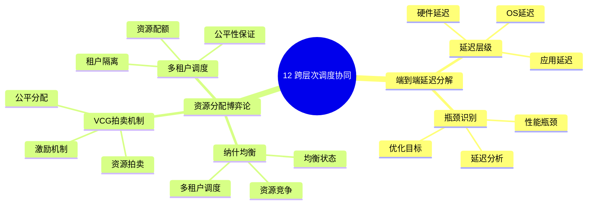

# 12. 跨层次调度协同

> **主题**: 跨层次调度协同机制
> **覆盖范围**: 端到端延迟分解、资源分配博弈论、跨层优化

---

## 📋 目录

- [12. 跨层次调度协同](#12-跨层次调度协同)
  - [📋 目录](#-目录)
  - [1 子主题索引](#1-子主题索引)
    - [1.0 跨层次调度协同思维导图](#10-跨层次调度协同思维导图)
  - [2 相关主题](#2-相关主题)

---

## 1 子主题索引

### 1.0 跨层次调度协同思维导图

**可视化文档**: 查看 [思维导图与知识矩阵](../思维导图与知识矩阵.md#310-10-24-扩展主题) 获取更详细的思维导图。

- [12.1 端到端延迟分解](./12.1_端到端延迟分解.md) - 延迟分解模型、优化目标、瓶颈识别
- [12.2 资源分配博弈论](./12.2_资源分配博弈论.md) - 纳什均衡、VCG拍卖机制、多租户调度

---

## 2 相关主题

- [06. 调度模型](../06_调度模型/README.md)
- [07. 性能优化与安全](../07_性能优化与安全/README.md)

---

**最后更新**: 2025-11-14
