# 13.2 最佳实践总结

> **主题**: 13. 实践案例与最佳实践 - 13.2 最佳实践总结
> **覆盖**: 各层最佳实践、性能调优指南、故障排查、监控告警

---

## 📋 目录

- [13.2 最佳实践总结](#132-最佳实践总结)
  - [📋 目录](#-目录)
  - [1 硬件层最佳实践](#1-硬件层最佳实践)
    - [1.1 CPU优化](#11-cpu优化)
    - [1.2 内存优化](#12-内存优化)
  - [2 OS层最佳实践](#2-os层最佳实践)
    - [2.1 进程调度优化](#21-进程调度优化)
    - [2.2 内存管理优化](#22-内存管理优化)
  - [3 语言层最佳实践](#3-语言层最佳实践)
    - [3.1 Golang优化](#31-golang优化)
    - [3.2 异步编程优化](#32-异步编程优化)
  - [4 分布式层最佳实践](#4-分布式层最佳实践)
    - [4.1 负载均衡优化](#41-负载均衡优化)
    - [4.2 一致性优化](#42-一致性优化)
  - [5 AI调度层最佳实践](#5-ai调度层最佳实践)
    - [5.1 模型优化](#51-模型优化)
    - [5.2 特征工程](#52-特征工程)
  - [6 故障排查指南](#6-故障排查指南)
    - [6.1 性能问题排查](#61-性能问题排查)
    - [6.2 稳定性问题排查](#62-稳定性问题排查)
  - [7 监控告警策略](#7-监控告警策略)
    - [7.1 关键指标](#71-关键指标)
    - [7.2 告警策略](#72-告警策略)
  - [8 实践案例总结](#8-实践案例总结)
    - [8.1 成功案例](#81-成功案例)
    - [8.2 失败案例教训](#82-失败案例教训)
  - [9 批判性总结](#9-批判性总结)
    - [9.1 最佳实践的局限性](#91-最佳实践的局限性)
    - [9.2 2025年最佳实践趋势](#92-2025年最佳实践趋势)
  - [10 跨领域洞察](#10-跨领域洞察)
    - [10.1 最佳实践与系统工程的统一](#101-最佳实践与系统工程的统一)
    - [10.2 性能优化与经济学的关系](#102-性能优化与经济学的关系)
    - [10.3 故障排查与医学诊断的类比](#103-故障排查与医学诊断的类比)
    - [10.4 监控告警与控制系统的关系](#104-监控告警与控制系统的关系)
  - [11 多维度对比](#11-多维度对比)
    - [11.1 优化策略对比](#111-优化策略对比)
    - [11.2 故障排查方法对比](#112-故障排查方法对比)
    - [11.3 监控工具对比](#113-监控工具对比)
    - [11.4 告警策略对比](#114-告警策略对比)
  - [13 2025年最新技术（更新至2025年11月）](#13-2025年最新技术更新至2025年11月)
  - [12 思维导图](#12-思维导图)
  - [14 相关主题](#14-相关主题)
    - [14.1 跨视角链接](#141-跨视角链接)

---

## 1 硬件层最佳实践

### 1.1 CPU优化

**最佳实践13.1（CPU性能优化）**：

CPU优化是系统性能优化的基础，需要从多个维度进行优化。

**1. Profile-Guided Optimization（PGO）**：

使用PGO提高分支预测率：

**原理**：

编译器根据运行时profile数据优化代码：

$$
\text{Optimize}(code, profile) = \arg\max_{code'} \text{Performance}(code', profile)
$$

**实施步骤**：

1. **编译带插桩的版本**：

    ```bash
    gcc -fprofile-generate -o app app.c
    ```

2. **运行典型负载**：

    ```bash
    ./app < typical_workload
    ```

3. **使用profile数据重新编译**：

    ```bash
    gcc -fprofile-use -o app app.c
    ```

**优化效果**：

- 分支预测率：85% → 95%（提升12%）
- 指令缓存命中率：90% → 95%（提升6%）
- 整体性能：基准 → +10-15%

**2. 分支提示（Branch Hints）**：

分支概率 $p>90\%$ 时用`__builtin_expect`提示编译器：

```c
if (__builtin_expect(condition, 1)) {
    // 热路径
    hot_path();
} else {
    // 冷路径
    cold_path();
}
```

**优化原理**：

编译器将热路径放在代码前面，减少分支预测失败：

$$
\text{BranchPenalty} = (1-p) \times \text{Penalty}
$$

其中 $p$ 是预测正确率。

**3. NUMA绑定**：

将进程绑定到NUMA节点，减少远程内存访问：

```bash
numactl --membind=0 --cpunodebind=0 ./app
```

**NUMA优化效果**：

- 内存访问延迟：远程访问延迟是本地访问的2-3倍
- 绑定后延迟：降低30-50%

**4. CPU亲和性**：

将关键进程绑定到特定CPU核心：

```c
cpu_set_t cpuset;
CPU_ZERO(&cpuset);
CPU_SET(0, &cpuset);
pthread_setaffinity_np(pthread_self(), sizeof(cpuset), &cpuset);
```

**优化效果**：

- 缓存命中率：提升20-30%
- 上下文切换开销：降低50%

### 1.2 内存优化

**最佳实践13.2（内存性能优化）**：

内存优化对系统性能影响巨大，需要从多个角度优化。

**1. 大页内存（Huge Pages）**：

使用2MB/1GB大页，减少TLB未命中：

**TLB未命中率**：

使用4KB页时：

$$
\text{TLBMissRate} = \frac{\text{MemorySize}}{4KB \times \text{TLBEntries}}
$$

使用2MB大页时：

$$
\text{TLBMissRate} = \frac{\text{MemorySize}}{2MB \times \text{TLBEntries}}
$$

**优化效果**：

- TLB未命中率：降低90%+
- 内存访问延迟：降低10-20%

**配置方法**：

```bash
# 预留大页
echo 1024 > /proc/sys/vm/nr_hugepages

# 使用大页
mount -t hugetlbfs none /mnt/huge
```

**2. 预取优化（Prefetching）**：

使用硬件预取，提前加载数据：

**软件预取**：

```c
__builtin_prefetch(&data[i+1], 1, 3);
```

**硬件预取**：

现代CPU自动预取，但需要数据访问模式规律：

- **顺序访问**：硬件预取效果好
- **随机访问**：硬件预取效果差

**优化效果**：

- 顺序访问：性能提升20-30%
- 随机访问：性能提升5-10%

**3. 内存对齐（Memory Alignment）**：

数据对齐到缓存行边界，避免伪共享：

**伪共享问题**：

两个变量在同一缓存行，不同CPU核心修改会导致缓存行失效：

```c
// 避免伪共享
struct {
    int x __attribute__((aligned(64)));
    int y __attribute__((aligned(64)));
} data;
```

**优化效果**：

- 多线程性能：提升30-50%
- 缓存一致性开销：降低60%

**4. 内存池（Memory Pool）**：

使用内存池减少内存分配开销：

```c
typedef struct {
    void *pool;
    size_t size;
    size_t used;
} memory_pool_t;

void* pool_alloc(memory_pool_t *pool, size_t size) {
    if (pool->used + size <= pool->size) {
        void *ptr = (char*)pool->pool + pool->used;
        pool->used += size;
        return ptr;
    }
    return NULL;
}
```

**优化效果**：

- 内存分配延迟：降低80-90%
- 内存碎片：降低50%

---

## 2 OS层最佳实践

### 2.1 进程调度优化

**最佳实践13.3（进程调度优化）**：

进程调度优化直接影响系统响应性和吞吐量。

**1. PCID优化（Process Context ID）**：

使用PCID减少TLB刷新开销：

**原理**：

PCID允许TLB同时缓存多个进程的页表项：

$$
\text{TLBEntries} = \sum_{pid} \text{TLBEntries}(pid)
$$

**优化效果**：

- TLB刷新开销：降低60-80%
- 上下文切换延迟：降低20-30%

**2. CFS时间片优化**：

设置为6ms，平衡交互式响应与吞吐：

**时间片计算**：

$$
\text{TimeSlice} = \frac{\text{Period} \times \text{Weight}(task)}{\sum_{i} \text{Weight}(task_i)}
$$

其中 $\text{Period} = 6ms$。

**优化效果**：

- 交互式响应：延迟 < 100ms
- 吞吐量：保持高吞吐

**3. CPU亲和性**：

将关键进程绑定到特定CPU核心：

```c
cpu_set_t cpuset;
CPU_ZERO(&cpuset);
CPU_SET(0, &cpuset);
sched_setaffinity(0, sizeof(cpuset), &cpuset);
```

**优化效果**：

- 缓存命中率：提升30%
- 上下文切换：降低50%

**4. 实时优先级**：

关键任务使用实时优先级：

```c
struct sched_param param;
param.sched_priority = 50;
sched_setscheduler(0, SCHED_FIFO, &param);
```

**优化效果**：

- 响应延迟：降低80%
- 延迟抖动：降低90%

### 2.2 内存管理优化

**最佳实践13.4（内存管理优化）**：

内存管理优化对系统性能和稳定性至关重要。

**1. 透明大页（Transparent Huge Pages）**：

启用透明大页（THP），减少页表开销：

**配置**：

```bash
echo always > /sys/kernel/mm/transparent_hugepage/enabled
```

**优化效果**：

- 页表大小：降低90%
- TLB命中率：提升50%
- 内存访问延迟：降低10-15%

**2. 内存压缩（Memory Compression）**：

使用zswap/z3fold压缩内存，提高利用率：

**原理**：

将不常用的页面压缩存储：

$$
\text{EffectiveMemory} = \text{PhysicalMemory} + \text{CompressedMemory} \times \text{CompressionRatio}
$$

**优化效果**：

- 内存利用率：提升20-30%
- 交换延迟：降低50%

**3. NUMA平衡（NUMA Balancing）**：

启用NUMA平衡，优化内存访问：

```bash
echo 1 > /proc/sys/kernel/numa_balancing
```

**优化效果**：

- 远程内存访问：降低40%
- 内存访问延迟：降低20%

**4. 内存回收优化**：

优化内存回收策略：

```bash
# 调整swappiness
echo 10 > /proc/sys/vm/swappiness

# 调整dirty_ratio
echo 10 > /proc/sys/vm/dirty_ratio
```

**优化效果**：

- 内存回收延迟：降低30%
- 系统响应性：提升20%

---

## 3 语言层最佳实践

### 3.1 Golang优化

**最佳实践13.5（Golang性能优化）**：

Golang优化需要从运行时、并发、内存等多个角度进行。

**1. GOMAXPROCS优化**：

设置为CPU核心数，减少上下文切换：

```go
runtime.GOMAXPROCS(runtime.NumCPU())
```

**优化原理**：

GOMAXPROCS控制同时运行的OS线程数：

$$
\text{OptimalGOMAXPROCS} = \text{NumCPU}
$$

**优化效果**：

- 上下文切换：降低50%
- CPU利用率：提升20%

**2. Channel缓冲区优化**：

按利特尔法则设置：$BufferSize = \lambda \times W$

**利特尔法则**：

$$
L = \lambda \times W
$$

其中：

- $L$：系统中平均任务数
- $\lambda$：到达速率
- $W$：平均等待时间

**Channel缓冲区**：

$$
\text{BufferSize} = \lambda \times W
$$

**优化效果**：

- Channel阻塞：降低80%
- 吞吐量：提升30%

**3. Goroutine池优化**：

使用Goroutine池，避免过度创建：

```go
type Pool struct {
    workers chan struct{}
    tasks   chan func()
}

func NewPool(size int) *Pool {
    return &Pool{
        workers: make(chan struct{}, size),
        tasks:   make(chan func(), 1000),
    }
}

func (p *Pool) Submit(task func()) {
    select {
    case p.tasks <- task:
    case p.workers <- struct{}{}:
        go p.worker(task)
    }
}
```

**优化效果**：

- Goroutine创建开销：降低90%
- 内存使用：降低50%

**4. 内存分配优化**：

减少内存分配，使用对象池：

```go
var bufferPool = sync.Pool{
    New: func() interface{} {
        return make([]byte, 0, 1024)
    },
}

func getBuffer() []byte {
    return bufferPool.Get().([]byte)
}

func putBuffer(buf []byte) {
    buf = buf[:0]
    bufferPool.Put(buf)
}
```

**优化效果**：

- GC压力：降低60%
- 内存分配延迟：降低80%

### 3.2 异步编程优化

**最佳实践13.6（异步编程优化）**：

异步编程是提高系统并发性能的关键。

**1. 批量IO优化**：

使用批量IO操作，减少系统调用：

**原理**：

批量IO减少系统调用次数：

$$
\text{SystemCalls} = \frac{\text{TotalIO}}{\text{BatchSize}}
$$

**优化效果**：

- 系统调用次数：降低90%
- IO吞吐量：提升50%

**2. 事件循环优化**：

单线程事件循环，避免GIL竞争：

**Node.js事件循环**：

```javascript
// 事件循环处理异步任务
setImmediate(() => {
    // 异步任务
});
```

**优化效果**：

- 上下文切换：降低80%
- 延迟：降低30%

**3. 协程切换优化**：

减少协程切换频率，提高性能：

**优化策略**：

- **批量处理**：批量处理任务，减少切换
- **优先级调度**：高优先级任务优先执行
- **时间片优化**：合理设置时间片大小

**优化效果**：

- 协程切换开销：降低50%
- 吞吐量：提升30%

**4. 异步IO优化**：

使用异步IO，提高并发性能：

```python
import asyncio

async def async_io():
    # 异步IO操作
    data = await async_read()
    return data
```

**优化效果**：

- IO并发度：提升10倍
- 资源利用率：提升50%

---

## 4 分布式层最佳实践

### 4.1 负载均衡优化

**最佳实践13.7（负载均衡优化）**：

负载均衡是分布式系统的核心，需要精细优化。

**1. 一致性哈希优化**：

虚拟节点数100-200，负载标准差<5%：

**一致性哈希**：

$$
\text{Hash}(key) \to \text{Node}
$$

**虚拟节点**：

每个物理节点映射到多个虚拟节点：

$$
\text{VirtualNodes} = \text{PhysicalNodes} \times \text{Replicas}
$$

**负载均衡度**：

$$
\text{LoadStdDev} = \sqrt{\frac{1}{n}\sum_{i}(Load_i - \bar{Load})^2}
$$

**优化效果**：

- 负载标准差：< 5%
- 节点故障影响：降低到1/n

**2. 健康检查优化**：

心跳周期 $\Delta t > 2 \times RTT_{max}$，避免脑裂：

**心跳机制**：

$$
\text{HeartbeatInterval} = 2 \times \text{RTT}_{max} + \text{Buffer}
$$

**健康检查策略**：

- **快速失败**：连续失败3次标记为不健康
- **慢速恢复**：连续成功5次标记为健康
- **超时设置**：超时时间 = 2 × RTT

**优化效果**：

- 误判率：< 0.1%
- 故障检测时间：< 3秒

**3. 动态权重优化**：

根据节点负载动态调整权重：

$$
w_i(t) = \frac{1}{\text{Load}_i(t) + \epsilon}
$$

**权重更新**：

```python
def update_weights(nodes):
    """动态更新权重"""
    for node in nodes:
        load = get_node_load(node)
        weight = 1.0 / (load + 0.1)  # 避免除零
        node.weight = weight
```

**优化效果**：

- 负载均衡度：提升40%
- 响应时间：降低20%

**4. 会话保持优化**：

使用一致性哈希实现会话保持：

```python
def route_request(request, nodes):
    """会话保持路由"""
    session_id = request.session_id
    node_index = hash(session_id) % len(nodes)
    return nodes[node_index]
```

**优化效果**：

- 会话一致性：100%
- 缓存命中率：提升50%

### 4.2 一致性优化

**最佳实践13.8（分布式一致性优化）**：

一致性是分布式系统的核心挑战，需要权衡性能和一致性。

**1. 最终一致性优化**：

在可接受范围内使用最终一致性：

**一致性模型**：

- **强一致性**：所有节点立即一致
- **最终一致性**：最终会达到一致
- **因果一致性**：保证因果序

**选择原则**：

$$
\text{ChooseConsistency} = \begin{cases}
\text{Strong} & \text{if } \text{Critical} \\
\text{Eventual} & \text{if } \text{Acceptable} \\
\text{Causal} & \text{if } \text{OrderMatters}
\end{cases}
$$

**优化效果**：

- 性能：提升50-100%
- 可用性：提升10-20%

**2. 版本向量优化**：

使用版本向量检测因果序：

**版本向量**：

$$
V = [v_1, v_2, ..., v_n]
$$

其中 $v_i$ 是节点 $i$ 的版本号。

**因果序检测**：

$$
\text{HappensBefore}(e_1, e_2) \iff V(e_1) < V(e_2)
$$

**优化效果**：

- 冲突检测：准确率100%
- 性能开销：< 5%

**3. 冲突解决优化**：

设计合理的冲突解决策略：

**冲突解决策略**：

- **Last-Write-Wins（LWW）**：最后写入获胜
- **Vector Clock**：使用向量时钟
- **CRDT**：使用无冲突复制数据类型

**优化效果**：

- 冲突解决时间：降低80%
- 数据一致性：提升到99.9%

**4. 分布式锁优化**：

使用分布式锁保证一致性：

**Redlock算法**：

```python
def acquire_lock(key, ttl):
    """获取分布式锁"""
    lock_value = generate_unique_id()
    acquired = 0

    for node in nodes:
        if redis.set(key, lock_value, nx=True, ex=ttl):
            acquired += 1

    # 多数节点获取成功
    if acquired > len(nodes) / 2:
        return lock_value
    else:
        release_lock(key, lock_value)
        return None
```

**优化效果**：

- 锁获取成功率：> 99%
- 死锁率：< 0.01%

---

## 5 AI调度层最佳实践

### 5.1 模型优化

**最佳实践13.9（AI模型优化）**：

AI模型优化是提高推理性能的关键。

**1. 模型压缩优化**：

使用知识蒸馏、量化减少模型大小：

**知识蒸馏**：

$$
L_{distill} = \alpha L_{student} + (1-\alpha) L_{teacher}
$$

**量化优化**：

将FP32量化为INT8：

$$
\text{ModelSize} = \frac{\text{FP32Size}}{4}
$$

**优化效果**：

- 模型大小：降低75%
- 推理速度：提升2-4倍
- 精度损失：< 1%

**2. 模型加速优化**：

使用TensorRT、ONNX Runtime加速推理：

**TensorRT优化**：

- **层融合**：融合多个层，减少kernel启动
- **精度校准**：INT8量化校准
- **动态shape**：支持动态batch size

**优化效果**：

- 推理延迟：降低50-70%
- 吞吐量：提升2-3倍

**3. 批量推理优化**：

批量处理请求，提高吞吐量：

**批量大小优化**：

$$
\text{OptimalBatchSize} = \arg\max_{b} \frac{\text{Throughput}(b)}{\text{Latency}(b)}
$$

**优化效果**：

- 吞吐量：提升5-10倍
- GPU利用率：提升到90%+

**4. 模型缓存优化**：

缓存模型和中间结果：

```python
class ModelCache:
    def __init__(self):
        self.model_cache = {}
        self.result_cache = {}

    def get_model(self, model_id):
        if model_id not in self.model_cache:
            self.model_cache[model_id] = load_model(model_id)
        return self.model_cache[model_id]
```

**优化效果**：

- 模型加载时间：降低90%
- 内存使用：优化20%

### 5.2 特征工程

**最佳实践13.10（特征工程优化）**：

特征工程是AI系统的关键环节。

**1. 特征选择优化**：

选择关键特征，减少特征维度：

**特征重要性**：

$$
\text{Importance}(f) = \text{InformationGain}(f) + \text{Correlation}(f, target)
$$

**特征选择算法**：

- **互信息**：选择与目标相关性高的特征
- **卡方检验**：选择统计显著的特征
- **L1正则化**：自动选择特征

**优化效果**：

- 特征维度：降低50-70%
- 训练时间：降低40-60%
- 模型精度：提升5-10%

**2. 特征标准化优化**：

标准化特征，提高模型稳定性：

**标准化方法**：

$$
x_{norm} = \frac{x - \mu}{\sigma}
$$

**优化效果**：

- 模型收敛速度：提升30%
- 模型稳定性：提升20%

**3. 特征缓存优化**：

缓存特征计算结果，减少重复计算：

```python
class FeatureCache:
    def __init__(self, ttl=3600):
        self.cache = {}
        self.ttl = ttl

    def get_features(self, key):
        if key in self.cache:
            value, timestamp = self.cache[key]
            if time.time() - timestamp < self.ttl:
                return value

        # 计算特征
        features = compute_features(key)
        self.cache[key] = (features, time.time())
        return features
```

**优化效果**：

- 特征计算时间：降低80%
- 系统响应时间：降低50%

**4. 特征预处理优化**：

优化特征预处理流程：

**预处理优化**：

- **并行处理**：并行计算特征
- **增量更新**：只更新变化的特征
- **预计算**：提前计算常用特征

**优化效果**：

- 预处理时间：降低60%
- 系统吞吐量：提升40%

---

## 6 故障排查指南

### 6.1 性能问题排查

**最佳实践13.11（性能问题排查）**：

性能问题排查需要系统化的方法和工具。

**排查步骤**：

**1. 定位瓶颈**：

使用性能分析工具定位瓶颈：

**硬件层分析**：

使用perf分析CPU热点：

```bash
# 采样CPU事件
perf record -g ./app

# 分析热点
perf report
```

**OS层分析**：

使用strace分析系统调用：

```bash
# 跟踪系统调用
strace -c ./app

# 分析系统调用统计
```

**应用层分析**：

使用pprof分析应用性能：

```go
import _ "net/http/pprof"

// 启动pprof服务器
go func() {
    log.Println(http.ListenAndServe("localhost:6060", nil))
}()
```

**2. 分析原因**：

分析瓶颈的根本原因：

**CPU瓶颈分析**：

- **CPU利用率**：检查是否达到100%
- **上下文切换**：检查上下文切换频率
- **CPU缓存**：检查缓存命中率

**内存瓶颈分析**：

- **内存使用率**：检查内存使用情况
- **缺页率**：检查缺页频率
- **内存泄漏**：检查内存是否持续增长

**IO瓶颈分析**：

- **IOPS**：检查IOPS是否达到上限
- **IO延迟**：检查IO延迟是否过高
- **IO队列**：检查IO队列长度

**3. 优化方案**：

制定并实施优化方案：

**算法优化**：

- **复杂度优化**：降低算法时间复杂度
- **数据结构优化**：选择合适的数据结构
- **缓存优化**：使用缓存减少计算

**系统优化**：

- **参数调优**：调整系统参数
- **资源分配**：优化资源分配
- **架构优化**：优化系统架构

**4. 验证效果**：

验证优化效果：

**性能测试**：

对比优化前后性能：

- **延迟**：P50、P99延迟
- **吞吐量**：QPS、TPS
- **资源使用**：CPU、内存使用率

**压力测试**：

验证系统稳定性：

- **负载测试**：逐步增加负载
- **压力测试**：超过正常负载
- **稳定性测试**：长时间运行测试

### 6.2 稳定性问题排查

**最佳实践13.12（稳定性问题排查）**：

稳定性问题排查需要系统化的方法和流程。

**排查步骤**：

**1. 日志分析**：

分析系统日志，找出异常：

**错误日志分析**：

```bash
# 查找错误日志
grep -i error /var/log/app.log

# 统计错误类型
grep -i error /var/log/app.log | awk '{print $5}' | sort | uniq -c
```

**警告日志分析**：

```bash
# 查找警告日志
grep -i warn /var/log/app.log

# 分析警告趋势
```

**访问日志分析**：

```bash
# 分析访问模式
awk '{print $1}' /var/log/access.log | sort | uniq -c | sort -rn
```

**2. 监控指标分析**：

查看监控指标，定位问题：

**系统指标**：

- **CPU**：利用率、负载、中断
- **内存**：使用率、缺页、交换
- **磁盘**：IOPS、延迟、使用率
- **网络**：带宽、延迟、丢包

**应用指标**：

- **QPS**：每秒请求数
- **延迟**：P50、P99延迟
- **错误率**：错误请求比例
- **资源使用**：CPU、内存使用

**业务指标**：

- **订单量**：订单数量趋势
- **支付成功率**：支付成功比例
- **用户活跃度**：活跃用户数

**3. 根因分析**：

进行根因分析：

**时间线分析**：

分析问题发生时间线：

```python
def analyze_timeline(events):
    """分析事件时间线"""
    timeline = sorted(events, key=lambda e: e.timestamp)

    # 找出关键事件
    key_events = []
    for event in timeline:
        if is_key_event(event):
            key_events.append(event)

    return key_events
```

**关联分析**：

分析问题关联因素：

- **相关性分析**：分析指标相关性
- **因果分析**：分析因果关系
- **影响分析**：分析影响范围

**假设验证**：

验证根因假设：

- **实验验证**：通过实验验证假设
- **数据验证**：通过数据验证假设
- **逻辑验证**：通过逻辑验证假设

**4. 修复验证**：

修复问题并验证：

**修复实施**：

- **修复方案**：制定修复方案
- **实施修复**：实施修复
- **回滚计划**：准备回滚计划

**验证测试**：

验证修复效果：

- **功能测试**：验证功能正常
- **性能测试**：验证性能恢复
- **稳定性测试**：验证稳定性

**监控观察**：

持续监控系统状态：

- **实时监控**：实时监控关键指标
- **告警设置**：设置告警规则
- **定期检查**：定期检查系统状态

---

## 7 监控告警策略

### 7.1 关键指标

**最佳实践13.13（监控指标体系）**：

建立完善的监控指标体系是系统可观测性的基础。

**硬件层指标**：

**CPU指标**：

- **利用率**：$\text{CPUUtil} = \frac{\text{UsedTime}}{\text{TotalTime}}$
- **负载**：1分钟、5分钟、15分钟平均负载
- **温度**：CPU温度，阈值80°C
- **中断**：中断频率和类型

**内存指标**：

- **使用率**：$\text{MemoryUtil} = \frac{\text{UsedMemory}}{\text{TotalMemory}}$
- **缺页率**：$\text{PageFaultRate} = \frac{\text{PageFaults}}{\text{Time}}$
- **交换**：交换使用率和频率
- **缓存**：缓存命中率

**磁盘指标**：

- **IOPS**：每秒IO操作数
- **延迟**：P50、P99 IO延迟
- **使用率**：磁盘空间使用率
- **吞吐量**：读写吞吐量

**网络指标**：

- **带宽**：网络带宽使用率
- **延迟**：网络延迟（RTT）
- **丢包率**：网络丢包率
- **连接数**：TCP连接数

**OS层指标**：

**进程指标**：

- **进程数**：系统进程总数
- **线程数**：系统线程总数
- **僵尸进程**：僵尸进程数量

**调度指标**：

- **上下文切换**：上下文切换频率
- **系统调用**：系统调用频率
- **调度延迟**：进程调度延迟

**文件系统指标**：

- **文件描述符**：文件描述符使用率
- **inode使用率**：inode使用率
- **文件系统延迟**：文件系统操作延迟

**应用层指标**：

**性能指标**：

- **QPS**：每秒请求数
- **延迟**：P50、P90、P99延迟
- **错误率**：错误请求比例
- **吞吐量**：每秒处理量

**资源指标**：

- **CPU使用率**：应用CPU使用率
- **内存使用率**：应用内存使用率
- **GC频率**：垃圾回收频率
- **GC时间**：垃圾回收时间

**业务指标**：

- **订单量**：订单数量
- **支付成功率**：支付成功比例
- **用户活跃度**：活跃用户数
- **转化率**：业务转化率

### 7.2 告警策略

**最佳实践13.14（告警策略设计）**：

告警策略需要平衡及时性和准确性。

**告警规则**：

**延迟告警**：

- **P99延迟** > 200ms：警告
- **P99延迟** > 500ms：严重
- **P99延迟** > 1000ms：紧急

**错误率告警**：

- **错误率** > 1%：警告
- **错误率** > 5%：严重
- **错误率** > 10%：紧急

**资源使用告警**：

- **资源使用率** > 80%：警告
- **资源使用率** > 90%：严重
- **资源使用率** > 95%：紧急

**可用性告警**：

- **系统不可用**：紧急
- **服务降级**：严重
- **性能下降**：警告

**告警分级**：

**P0（紧急）**：

- **定义**：系统不可用，立即处理
- **响应时间**：< 5分钟
- **处理时间**：< 30分钟
- **示例**：系统宕机、数据库不可用

**P1（高）**：

- **定义**：关键功能异常，1小时内处理
- **响应时间**：< 15分钟
- **处理时间**：< 2小时
- **示例**：支付失败、订单异常

**P2（中）**：

- **定义**：非关键功能异常，4小时内处理
- **响应时间**：< 1小时
- **处理时间**：< 8小时
- **示例**：推荐异常、日志异常

**P3（低）**：

- **定义**：性能下降，24小时内处理
- **响应时间**：< 4小时
- **处理时间**：< 24小时
- **示例**：响应时间增加、资源使用率上升

**告警收敛**：

**去重策略**：

相同告警合并：

```python
class AlertDeduplicator:
    def __init__(self, window=300):
        self.window = window
        self.alerts = {}

    def deduplicate(self, alert):
        """去重告警"""
        key = (alert.metric, alert.instance)

        if key in self.alerts:
            last_alert = self.alerts[key]
            if time.time() - last_alert.timestamp < self.window:
                # 合并告警
                return None

        self.alerts[key] = alert
        return alert
```

**抑制策略**：

相关告警抑制：

```python
def suppress_alerts(alerts):
    """抑制相关告警"""
    suppressed = set()

    for alert in alerts:
        if alert.severity == "critical":
            # 抑制相关的warning告警
            for other in alerts:
                if other.metric == alert.metric and \
                   other.severity == "warning":
                    suppressed.add(other.id)

    return [a for a in alerts if a.id not in suppressed]
```

**升级策略**：

长时间未处理自动升级：

```python
def escalate_alert(alert):
    """升级告警"""
    if alert.severity == "warning" and \
       time.time() - alert.timestamp > 3600:
        alert.severity = "critical"
        return alert
    return alert
```

**量化分析**：告警策略效果

| **策略** | **告警数量** | **误报率** | **响应时间** | **处理效率** |
|---------|------------|-----------|------------|------------|
| **无收敛** | 1000/天 | 50% | 5分钟 | 低 |
| **去重** | 500/天 | 30% | 5分钟 | 中 |
| **抑制+去重** | 200/天 | 10% | 3分钟 | 高 |
| **智能收敛** | 100/天 | 5% | 2分钟 | 很高 |

---

## 8 实践案例总结

### 8.1 成功案例

**案例1：电商系统性能优化**

**场景**：大型电商系统，P99延迟过高，无法满足SLA。

**问题分析**：

- **P99延迟**：500ms，SLA要求200ms
- **瓶颈定位**：数据库查询、序列化、网络传输
- **根本原因**：串行处理、未使用缓存、网络延迟高

**优化方案**：

**1. 数据库优化**：

- **索引优化**：添加必要索引
- **查询优化**：优化慢查询
- **连接池**：使用连接池减少连接开销

**2. 序列化优化**：

- **协议优化**：使用Protobuf替代JSON
- **压缩优化**：启用压缩减少传输量

**3. 网络优化**：

- **CDN加速**：使用CDN加速静态资源
- **HTTP/2**：使用HTTP/2多路复用

**4. 缓存优化**：

- **多级缓存**：本地缓存+分布式缓存
- **缓存预热**：提前加载热点数据

**优化效果**：

- **P99延迟**：500ms → 150ms（降低70%）
- **吞吐量**：1000 QPS → 3000 QPS（提升200%）
- **SLA满足率**：60% → 99%（提升65%）

**案例2：微服务系统稳定性提升**

**场景**：微服务系统，服务雪崩，可用性下降。

**问题分析**：

- **可用性**：95%，目标99.9%
- **问题**：服务雪崩、级联故障
- **根本原因**：缺乏熔断、降级、限流机制

**优化方案**：

**1. 熔断器**：

- **错误率熔断**：错误率>50%时熔断
- **延迟熔断**：P99延迟>1s时熔断
- **半开状态**：10s后尝试恢复

**2. 降级策略**：

- **返回默认值**：服务不可用时返回默认值
- **返回缓存**：使用缓存数据
- **调用备用服务**：使用备用服务

**3. 限流策略**：

- **令牌桶限流**：控制请求速率
- **用户限流**：每个用户独立限流
- **API限流**：每个API独立限流

**优化效果**：

- **可用性**：95% → 99.9%（提升5%）
- **故障恢复时间**：5分钟 → 30秒（降低90%）
- **级联故障**：显著减少

**案例3：AI推理系统性能优化**

**场景**：AI推理系统，推理延迟高，吞吐量低。

**问题分析**：

- **推理延迟**：100ms，目标20ms
- **吞吐量**：100 QPS，目标1000 QPS
- **瓶颈**：模型大小、批量处理、GPU利用率

**优化方案**：

**1. 模型优化**：

- **模型量化**：FP32 → INT8
- **模型压缩**：知识蒸馏
- **模型加速**：TensorRT优化

**2. 批量处理**：

- **动态批量**：根据负载动态调整批量大小
- **批量合并**：合并多个请求

**3. GPU优化**：

- **GPU利用率**：提升到90%+
- **多任务共享**：使用MIG技术

**优化效果**：

- **推理延迟**：100ms → 20ms（降低80%）
- **吞吐量**：100 QPS → 1000 QPS（提升900%）
- **GPU利用率**：45% → 90%（提升100%）

### 8.2 失败案例教训

**案例1：过度优化**

**场景**：系统性能优化，过度优化导致系统复杂度增加。

**问题**：

- **优化过度**：为了1%的性能提升，增加50%的复杂度
- **维护困难**：代码难以理解和维护
- **bug增加**：复杂优化引入新bug

**教训**：

- **优化要有度**：平衡性能和复杂度
- **优先简单方案**：简单方案优先
- **可维护性**：考虑长期维护成本

**案例2：忽略监控**

**场景**：系统优化，但缺少监控，问题发现滞后。

**问题**：

- **缺少监控**：无法及时发现问题
- **问题发现滞后**：问题发现时已造成损失
- **优化效果未知**：无法评估优化效果

**教训**：

- **监控是基础**：优化前先建立监控
- **关键指标**：监控关键性能指标
- **告警机制**：建立完善的告警机制

**案例3：缺乏测试**

**场景**：系统优化，但缺乏充分测试，上线后出现问题。

**问题**：

- **测试不足**：未充分测试优化方案
- **上线后问题**：优化后引入新问题
- **回滚困难**：回滚成本高

**教训**：

- **充分测试**：优化前充分测试
- **灰度发布**：使用灰度发布
- **回滚计划**：准备回滚计划

**案例4：忽略业务影响**

**场景**：技术优化，但忽略了业务影响。

**问题**：

- **业务影响**：优化影响了业务功能
- **用户体验**：优化降低了用户体验
- **业务指标下降**：业务指标下降

**教训**：

- **考虑业务**：优化要考虑业务影响
- **用户体验**：不能牺牲用户体验
- **业务指标**：关注业务指标变化

---

## 9 批判性总结

### 9.1 最佳实践的局限性

**1. 场景依赖**：

**问题**：最佳实践依赖具体场景，不能盲目套用。

**原因**：

- **业务差异**：不同业务场景需求不同
- **技术栈差异**：不同技术栈特性不同
- **环境差异**：不同环境条件不同

**影响**：

- 盲目套用可能适得其反
- 需要根据实际情况调整
- 需要持续验证和优化

**缓解措施**：

- **场景分析**：深入分析业务场景
- **实验验证**：通过实验验证最佳实践
- **持续优化**：根据实际情况持续优化

**2. 时效性**：

**问题**：技术发展，最佳实践需要更新。

**原因**：

- **技术演进**：技术不断演进
- **新工具出现**：新工具和方法不断出现
- **环境变化**：运行环境不断变化

**影响**：

- 过时的最佳实践可能失效
- 需要持续学习和更新
- 需要关注技术趋势

**缓解措施**：

- **持续学习**：持续学习新技术
- **定期更新**：定期更新最佳实践
- **关注趋势**：关注技术发展趋势

**3. 权衡取舍**：

**问题**：不同目标之间存在权衡。

**原因**：

- **性能vs稳定性**：高性能可能降低稳定性
- **性能vs成本**：高性能可能增加成本
- **性能vs复杂度**：高性能可能增加复杂度

**影响**：

- 需要权衡不同目标
- 没有完美的方案
- 需要根据优先级选择

**缓解措施**：

- **明确优先级**：明确优化目标优先级
- **权衡分析**：分析不同方案的权衡
- **平衡优化**：平衡不同目标

**4. 实施成本**：

**问题**：最佳实践的实施成本可能很高。

**原因**：

- **人力成本**：需要专业人才
- **时间成本**：需要时间实施
- **资源成本**：需要额外资源

**影响**：

- 可能超出预算
- 可能影响其他工作
- 需要评估ROI

**缓解措施**：

- **成本评估**：评估实施成本
- **ROI分析**：分析投资回报
- **分阶段实施**：分阶段实施

### 9.2 2025年最佳实践趋势

**1. AI辅助优化**：

**趋势**：使用AI辅助优化决策。

**技术**：

- **智能调优**：使用AI自动调优参数
- **异常检测**：使用AI检测异常
- **预测性维护**：使用AI预测故障

**优势**：

- 提高优化效率
- 降低人工成本
- 提高优化准确性

**挑战**：

- 模型训练成本
- 可解释性
- 数据质量

**2. 自动化优化**：

**趋势**：自动化优化和故障处理。

**技术**：

- **自动调优**：自动调整系统参数
- **自动扩缩容**：自动扩缩容
- **自动故障恢复**：自动故障恢复

**优势**：

- 提高响应速度
- 降低人工干预
- 提高系统稳定性

**挑战**：

- 自动化复杂度
- 误操作风险
- 需要完善的监控

**3. 可观测性增强**：

**趋势**：更完善的可观测性体系。

**技术**：

- **分布式追踪**：完整的请求追踪
- **指标聚合**：多维度指标聚合
- **日志分析**：智能日志分析

**优势**：

- 提高问题定位速度
- 提高系统透明度
- 提高运维效率

**挑战**：

- 数据量大
- 存储成本
- 分析复杂度

**4. 云原生优化**：

**趋势**：云原生环境下的优化。

**技术**：

- **容器优化**：容器镜像和运行时优化
- **K8s优化**：Kubernetes调度和资源优化
- **服务网格**：服务网格流量优化

**优势**：

- 提高资源利用率
- 提高系统弹性
- 简化运维

**挑战**：

- 技术复杂度
- 学习曲线
- 迁移成本

**5. 绿色计算优化**：

**趋势**：考虑能耗的优化。

**技术**：

- **能耗感知调度**：考虑能耗的调度
- **动态电压频率调节**：根据负载调整频率
- **服务器整合**：整合低负载服务器

**优势**：

- 降低能耗成本
- 减少碳排放
- 提高能效

**挑战**：

- 性能影响
- 调度复杂度
- 成本平衡

---

## 10 跨领域洞察

### 10.1 最佳实践与系统工程的统一

**核心洞察**：最佳实践本质上是系统工程方法的应用。

**理论映射**：

| **最佳实践** | **系统工程** | **对应关系** |
|------------|------------|------------|
| **性能优化** | **系统优化** | 优化方法 |
| **故障排查** | **问题诊断** | 诊断方法 |
| **监控告警** | **系统监控** | 监控方法 |
| **持续改进** | **迭代优化** | 改进方法 |

**关键洞察**：

- 最佳实践可以使用系统工程理论
- 系统思维可以指导最佳实践
- 持续改进是系统工程的核心

### 10.2 性能优化与经济学的关系

**核心洞察**：性能优化可以应用经济学原理。

**经济学视角**：

- **边际收益递减**：优化收益递减
- **机会成本**：优化需要权衡
- **投资回报**：优化需要评估ROI

**关键洞察**：

- 优化要考虑投资回报
- 边际收益递减规律适用
- 需要权衡不同优化方案

### 10.3 故障排查与医学诊断的类比

**核心洞察**：故障排查可以借鉴医学诊断方法。

**诊断方法映射**：

| **故障排查** | **医学诊断** | **对应关系** |
|------------|------------|------------|
| **症状观察** | **症状检查** | 观察方法 |
| **指标分析** | **化验检查** | 分析方法 |
| **根因分析** | **病因分析** | 诊断方法 |
| **治疗方案** | **治疗方案** | 治疗方法 |

**关键洞察**：

- 故障排查可以使用医学诊断方法
- 系统化诊断流程很重要
- 经验积累很重要

### 10.4 监控告警与控制系统的关系

**核心洞察**：监控告警可以视为控制系统。

**控制理论映射**：

| **监控告警** | **控制系统** | **对应关系** |
|------------|------------|------------|
| **监控** | **传感器** | 信息采集 |
| **告警** | **执行器** | 控制输出 |
| **阈值** | **控制目标** | 控制目标 |
| **反馈** | **反馈控制** | 控制机制 |

**关键洞察**：

- 监控告警可以使用控制理论
- 反馈控制可以优化告警
- PID控制可以应用于告警

## 11 多维度对比

### 11.1 优化策略对比

| **优化策略** | **性能提升** | **实施成本** | **维护成本** | **风险** |
|------------|------------|------------|------------|---------|
| **算法优化** | 很高 | 高 | 低 | 低 |
| **系统优化** | 高 | 中 | 中 | 中 |
| **架构优化** | 很高 | 很高 | 高 | 高 |
| **硬件升级** | 高 | 很高 | 低 | 低 |

### 11.2 故障排查方法对比

| **排查方法** | **定位速度** | **准确性** | **成本** | **适用场景** |
|------------|------------|-----------|---------|------------|
| **日志分析** | 中 | 中 | 低 | 一般问题 |
| **监控分析** | 高 | 高 | 中 | 性能问题 |
| **性能分析** | 高 | 很高 | 高 | 性能瓶颈 |
| **根因分析** | 低 | 很高 | 很高 | 复杂问题 |

### 11.3 监控工具对比

| **监控工具** | **功能** | **性能** | **成本** | **适用场景** |
|------------|---------|---------|---------|------------|
| **Prometheus** | 高 | 高 | 低 | 指标监控 |
| **Grafana** | 高 | 中 | 低 | 可视化 |
| **Jaeger** | 中 | 中 | 中 | 分布式追踪 |
| **ELK** | 高 | 中 | 中 | 日志分析 |

### 11.4 告警策略对比

| **告警策略** | **告警数量** | **误报率** | **响应时间** | **处理效率** |
|------------|------------|-----------|------------|------------|
| **无收敛** | 很高 | 高 | 慢 | 低 |
| **简单去重** | 高 | 中 | 中 | 中 |
| **智能收敛** | 中 | 低 | 快 | 高 |
| **AI辅助** | 低 | 很低 | 很快 | 很高 |

## 13 2025年最新技术（更新至2025年11月）

**最新技术发展**：

- **AI驱动的自动优化成熟**：2025年11月，AI驱动的自动优化在云原生应用中应用，通过强化学习自动调整系统参数，优化效率提升30-50%，但需要模型训练成本，可解释性差。
- **自动化优化成熟**：2025年11月，自动化优化在云原生环境中应用，通过自动调优、自动扩缩容、自动故障恢复，响应速度提升50-70%，但需要完善的监控，误操作风险需关注。
- **可观测性增强成熟**：2025年11月，可观测性增强在云原生应用中应用，通过分布式追踪、指标聚合、智能日志分析，问题定位速度提升40-60%，但数据量大，存储成本高。
- **云原生优化成熟**：2025年11月，云原生优化在Kubernetes环境中应用，通过容器优化、K8s调度优化、服务网格流量优化，资源利用率提升25-35%，但技术复杂度高，学习曲线陡峭。
- **绿色计算优化成熟**：2025年11月，绿色计算优化在超大规模IDC应用，通过能耗感知调度和动态电压频率调节，能耗降低30%+，但性能可能受影响，需要权衡。

**技术对比**：

| **技术** | **优化效率提升** | **响应速度提升** | **问题定位速度** | **资源利用率提升** | **能耗降低** | **复杂度** |
|---------|--------------|--------------|--------------|----------------|------------|-----------|
| **AI自动优化** | 30-50% | - | - | - | - | 高 |
| **自动化优化** | - | 50-70% | - | - | - | 中 |
| **可观测性增强** | - | - | 40-60% | - | - | 中 |
| **云原生优化** | - | - | - | 25-35% | - | 高 |
| **绿色计算优化** | - | - | - | - | 30%+ | 中 |

**批判性分析**：

1. **AI自动优化的可解释性挑战**：虽然优化效率提升30-50%，但模型可解释性差，优化决策的合理性需要持续验证。需要权衡优化效率和可解释性。
2. **自动化优化的误操作风险**：虽然响应速度提升50-70%，但误操作风险需关注，需要完善的监控和回滚机制。
3. **绿色计算优化的性能权衡**：虽然能耗降低30%+，但性能可能受影响，需要权衡能耗和性能。

---

## 12 思维导图

```mermaid
graph TD
    subgraph 最佳实践总结
        BestPractice[最佳实践总结]
        BestPractice---硬件层[硬件层最佳实践]
        BestPractice---OS层[OS层最佳实践]
        BestPractice---语言层[语言层最佳实践]
        BestPractice---分布式层[分布式层最佳实践]
        BestPractice---AI调度层[AI调度层最佳实践]
        BestPractice---故障排查[故障排查指南]
        BestPractice---监控告警[监控告警策略]
        BestPractice---实践案例[实践案例总结]
    end

    subgraph 硬件层最佳实践
        硬件层---CPU优化[CPU优化]
        硬件层---内存优化[内存优化]
        CPU优化---PGO[PGO优化]
        CPU优化---分支提示[分支提示]
        内存优化---NUMA感知[NUMA感知]
        内存优化---缓存优化[缓存优化]
    end

    subgraph OS层最佳实践
        OS层---进程调度[进程调度优化]
        OS层---内存管理[内存管理优化]
        进程调度---CFS优化[CFS优化]
        进程调度---实时调度[实时调度]
        内存管理---页表优化[页表优化]
        内存管理---内存分配[内存分配优化]
    end

    subgraph 语言层最佳实践
        语言层---Golang优化[Golang优化]
        语言层---异步编程[异步编程优化]
        Golang优化---Goroutine调度[Goroutine调度]
        异步编程---异步IO[异步IO]
        异步编程---协程调度[协程调度]
    end

    subgraph 分布式层最佳实践
        分布式层---负载均衡[负载均衡优化]
        分布式层---一致性优化[一致性优化]
        负载均衡---算法选择[算法选择]
        一致性优化---一致性协议[一致性协议]
    end

    subgraph AI调度层最佳实践
        AI调度层---模型优化[模型优化]
        AI调度层---特征工程[特征工程]
        模型优化---强化学习[强化学习]
        特征工程---特征选择[特征选择]
    end

    subgraph 故障排查指南
        故障排查---性能问题[性能问题排查]
        故障排查---稳定性问题[稳定性问题排查]
        性能问题---Profile[Profile分析]
        稳定性问题---日志分析[日志分析]
    end

    subgraph 监控告警策略
        监控告警---关键指标[关键指标]
        监控告警---告警策略[告警策略]
        关键指标---延迟[延迟指标]
        关键指标---吞吐量[吞吐量指标]
        告警策略---阈值告警[阈值告警]
        告警策略---智能告警[智能告警]
    end

    subgraph 实践案例总结
        实践案例---成功案例[成功案例]
        实践案例---失败案例[失败案例教训]
        成功案例---优化效果[优化效果]
        失败案例---教训总结[教训总结]
    end

    subgraph 2025年最新技术
        Tech[2025年最新技术]
        Tech---AI自动优化[AI驱动的自动优化]
        Tech---自动化优化[自动化优化]
        Tech---可观测性[可观测性增强]
        Tech---云原生[云原生优化]
        Tech---绿色计算[绿色计算优化]
        AI自动优化---优化效率[优化效率提升30-50%]
        自动化优化---响应速度[响应速度提升50-70%]
        可观测性---问题定位[问题定位速度提升40-60%]
        云原生---资源利用率[资源利用率提升25-35%]
        绿色计算---能耗降低[能耗降低30%+]
    end

    BestPractice --> Tech
```



---

## 14 相关主题

- [13.1 电商大促全链路分析](./13.1_电商大促全链路分析.md) - 实践案例详细分析
- [07.4 优化策略](../07_性能优化与安全/07.4_优化策略.md) - 性能优化策略
- [12.1 端到端延迟分解](../12_跨层次调度协同/12.1_端到端延迟分解.md) - 延迟优化方法
- [11.1 业务架构层调度](../11_企业架构调度/11.1_业务架构层调度.md) - 业务层优化
- [11.2 数据架构层调度](../11_企业架构调度/11.2_数据架构层调度.md) - 数据层优化
- [11.3 应用架构层调度](../11_企业架构调度/11.3_应用架构层调度.md) - 应用层优化
- [11.4 技术架构层调度](../11_企业架构调度/11.4_技术架构层调度.md) - 技术层优化

### 14.1 跨视角链接

- [概念交叉索引（七视角版）](../../../Concept/CONCEPT_CROSS_INDEX.md) - 查看相关概念的七视角分析：
  - [DIKWP模型](../../../Concept/CONCEPT_CROSS_INDEX.md#1-dikwp模型-dikwp-model-七视角) - 最佳实践的知识表示
  - [通信复杂度](../../../Concept/CONCEPT_CROSS_INDEX.md#56-通信复杂度-communication-complexity-七视角) - 最佳实践的通信开销
  - [熵](../../../Concept/CONCEPT_CROSS_INDEX.md#71-熵-entropy-七视角) - 最佳实践中的信息不确定性

---

**最后更新**: 2025-11-14
