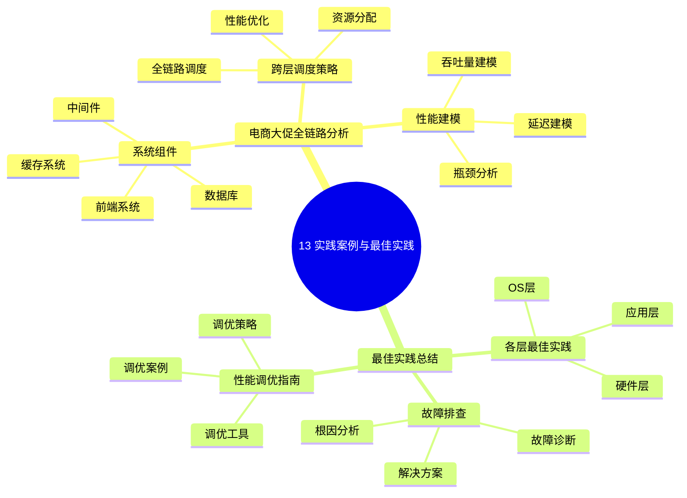

# 13. 实践案例与最佳实践

> **主题**: 实践案例与最佳实践
> **覆盖范围**: 电商大促全链路分析、最佳实践总结、性能调优指南

---

## 📋 目录

- [13. 实践案例与最佳实践](#13-实践案例与最佳实践)
  - [📋 目录](#-目录)
  - [1 子主题索引](#1-子主题索引)
    - [1.0 实践案例与最佳实践思维导图](#10-实践案例与最佳实践思维导图)
  - [2 相关主题](#2-相关主题)

---

## 1 子主题索引

### 1.0 实践案例与最佳实践思维导图

**可视化文档**: 查看 [思维导图与知识矩阵](../思维导图与知识矩阵.md#310-10-24-扩展主题) 获取更详细的思维导图。

- [13.1 电商大促全链路分析](./13.1_电商大促全链路分析.md) - 系统组件、跨层调度策略、性能建模
- [13.2 最佳实践总结](./13.2_最佳实践总结.md) - 各层最佳实践、性能调优指南、故障排查

---

## 2 相关主题

- [07. 性能优化与安全](../07_性能优化与安全/README.md)
- [12. 跨层次调度协同](../12_跨层次调度协同/README.md)

---

**最后更新**: 2025-11-14
