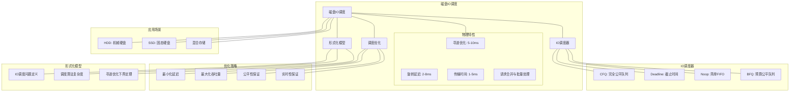

# 14.1 磁盘IO调度

> **主题**: 14. 存储调度系统 - 14.1 磁盘IO调度
> **覆盖**: 块设备IO调度器、寻道优化、旋转延迟、调度算法

---

## 📋 目录

- [14.1 磁盘IO调度](#141-磁盘io调度)
  - [📋 目录](#-目录)
  - [1 磁盘IO调度概述](#1-磁盘io调度概述)
    - [1.1 磁盘IO调度的核心挑战](#11-磁盘io调度的核心挑战)
    - [1.2 IO调度器的目标](#12-io调度器的目标)
  - [2 主要IO调度器](#2-主要io调度器)
    - [2.1 CFQ调度器](#21-cfq调度器)
    - [2.2 Deadline调度器](#22-deadline调度器)
    - [2.3 Noop调度器](#23-noop调度器)
    - [2.4 BFQ调度器](#24-bfq调度器)
  - [3 磁盘物理特性与调度约束](#3-磁盘物理特性与调度约束)
    - [3.1 寻道优化](#31-寻道优化)
    - [3.2 旋转延迟优化](#32-旋转延迟优化)
    - [3.3 请求合并与批量处理](#33-请求合并与批量处理)
  - [4 形式化模型](#4-形式化模型)
    - [4.1 IO调度问题定义](#41-io调度问题定义)
    - [4.2 调度算法复杂度](#42-调度算法复杂度)
    - [4.3 定理：寻道优化的下界](#43-定理寻道优化的下界)
  - [5 跨领域洞察](#5-跨领域洞察)
    - [5.1 磁盘调度与CPU调度的类比](#51-磁盘调度与cpu调度的类比)
    - [5.2 抽象泄漏：SSD时代的调度器选择](#52-抽象泄漏ssd时代的调度器选择)
    - [5.3 成本驱动的调度器演进](#53-成本驱动的调度器演进)
  - [6 多维度对比](#6-多维度对比)
    - [6.1 IO调度器对比](#61-io调度器对比)
    - [6.2 磁盘类型与调度策略](#62-磁盘类型与调度策略)
  - [7 相关主题](#7-相关主题)
  - [8 思维导图](#8-思维导图)
  - [9 2025年最新技术（更新至2025年11月）](#9-2025年最新技术更新至2025年11月)
    - [9.1 网络和数据感知的放置算法（2025年11月）](#91-网络和数据感知的放置算法2025年11月)
    - [9.2 DPDK最新优化（2025年11月）](#92-dpdk最新优化2025年11月)
  - [10 实践案例（已整合view文件夹内容）](#10-实践案例已整合view文件夹内容)
    - [10.1 实时数据流水线调度优化案例](#101-实时数据流水线调度优化案例)

---

## 1 磁盘IO调度概述

### 1.1 磁盘IO调度的核心挑战

磁盘IO调度的核心挑战在于**机械延迟**：

- **寻道时间**（Seek Time）：磁头移动到目标磁道，5-10ms
- **旋转延迟**（Rotational Latency）：等待目标扇区旋转到磁头下，平均2-8ms（7200 RPM）
- **传输时间**（Transfer Time）：数据读写，1-5ms（取决于数据大小）

**总延迟**：单次随机IO延迟 = 寻道时间 + 旋转延迟 + 传输时间 ≈ **8-20ms**

### 1.2 IO调度器的目标

IO调度器需要在以下目标之间权衡：

1. **最小化延迟**：减少平均IO延迟
2. **最大化吞吐量**：通过批量合并提升带宽利用率
3. **公平性**：多进程间的IO资源公平分配
4. **实时性**：保证关键IO请求的截止时间

---

## 2 主要IO调度器

### 2.1 CFQ调度器

**CFQ（Completely Fair Queuing）**：完全公平队列调度器

**核心算法**：

```text
每个进程维护独立的IO队列
  ↓
按时间片轮询调度（类似CFS）
  ↓
每个进程获得公平的IO带宽
```

**特点**：

- **公平性最优**：保证每个进程获得公平的IO带宽
- **延迟较高**：公平性优先，可能牺牲延迟
- **适用场景**：多用户系统、桌面环境

**时间复杂度**：$O(\log n)$（红黑树维护队列）

### 2.2 Deadline调度器

**Deadline**：截止时间调度器

**核心算法**：

```text
维护两个队列：
  - 读队列：截止时间500ms
  - 写队列：截止时间5s
  ↓
优先调度接近截止时间的请求
  ↓
批量合并相邻请求
```

**特点**：

- **延迟保证**：保证IO请求在截止时间内完成
- **吞吐量优化**：批量合并提升带宽利用率
- **适用场景**：数据库、实时系统

**时间复杂度**：$O(\log n)$（按截止时间排序）

### 2.3 Noop调度器

**Noop（No Operation）**：无操作调度器

**核心算法**：

```text
简单的FIFO队列
  ↓
按到达顺序调度
  ↓
仅做基本的请求合并
```

**特点**：

- **延迟最低**：无额外调度开销
- **简单高效**：适合SSD等无寻道延迟设备
- **适用场景**：SSD、NVMe、虚拟化环境

**时间复杂度**：$O(1)$（FIFO队列）

### 2.4 BFQ调度器

**BFQ（Budget Fair Queuing）**：预算公平队列调度器

**核心算法**：

```text
为每个进程分配IO预算
  ↓
按预算比例公平调度
  ↓
考虑IO请求大小和延迟
```

**特点**：

- **公平性+延迟**：兼顾公平性和延迟优化
- **自适应**：根据IO模式动态调整预算
- **适用场景**：现代Linux系统（默认调度器）

**时间复杂度**：$O(\log n)$（红黑树+预算管理）

---

## 3 磁盘物理特性与调度约束

### 3.1 寻道优化

**电梯算法**（Elevator Algorithm）：

```text
磁头当前位置 → 目标位置
  ↓
按磁道位置排序请求
  ↓
单向扫描，减少寻道距离
```

**优化效果**：寻道时间从平均10ms降至5ms（50%提升）

### 3.2 旋转延迟优化

**旋转位置感知调度**（Rotational Position Aware）：

```text
考虑磁盘旋转位置
  ↓
优先调度即将到达的扇区
  ↓
减少旋转等待时间
```

**优化效果**：旋转延迟从平均4ms降至2ms（50%提升）

### 3.3 请求合并与批量处理

**相邻请求合并**：

```text
检测相邻LBA的请求
  ↓
合并为单个大请求
  ↓
减少寻道次数
```

**优化效果**：吞吐量提升2-5倍

---

## 4 形式化模型

### 4.1 IO调度问题定义

$$
\text{IO调度问题} = (R, Q, C, O)
$$

其中：

- $R = \{r_1, r_2, \ldots, r_n\}$：存储资源（磁道、扇区）
- $Q = \{q_1, q_2, \ldots, q_m\}$：IO请求队列
  - $q_i = (lba_i, size_i, dir_i, deadline_i)$：逻辑块地址、大小、方向、截止时间
- $C$：约束条件
  - 寻道时间：$t_{seek}(lba_i, lba_j) = \alpha \cdot |lba_i - lba_j|$
  - 旋转延迟：$t_{rot}(lba_i) = \beta \cdot (lba_i \bmod sectors\_per\_track)$
  - 传输时间：$t_{trans}(size_i) = \gamma \cdot size_i$
- $O$：优化目标
  - 最小化总延迟：$\min \sum_{i} (t_{seek} + t_{rot} + t_{trans})$
  - 最大化吞吐量：$\max \sum_{i} size_i / \sum_{i} t_i$
  - 公平性：$\min \max_i |bw_i - bw_{fair}|$

### 4.2 调度算法复杂度

| **算法** | **时间复杂度** | **空间复杂度** | **最优性** | **公平性** |
|---------|--------------|--------------|-----------|-----------|
| **FIFO** | $O(1)$ | $O(n)$ | 非最优 | 无 |
| **CFQ** | $O(\log n)$ | $O(n)$ | 公平性最优 | 高 |
| **Deadline** | $O(\log n)$ | $O(n)$ | 延迟保证 | 中 |
| **BFQ** | $O(\log n)$ | $O(n)$ | 多目标优化 | 高 |

### 4.3 定理：寻道优化的下界

**定理14.1（寻道优化下界）**：

对于$n$个随机IO请求，最优寻道调度（电梯算法）的寻道时间下界为：

$$
T_{seek} \geq \frac{\alpha \cdot \sum_{i=1}^{n-1} |lba_{i+1} - lba_i|}{n}
$$

其中$\alpha$是单位距离寻道时间。

**证明**：由三角不等式，任意调度路径长度不小于按LBA排序的路径长度。∎

---

## 5 跨领域洞察

### 5.1 磁盘调度与CPU调度的类比

| **维度** | **CPU调度** | **磁盘IO调度** |
|---------|------------|--------------|
| **调度单元** | 进程/线程 | IO请求 |
| **时间片** | 毫秒级 | 请求级 |
| **公平性** | CFS红黑树 | CFQ队列 |
| **延迟优化** | 实时调度 | Deadline调度 |
| **资源约束** | CPU核心数 | 磁头位置 |

**关键洞察**：磁盘IO调度可以视为**一维空间中的任务调度**，寻道距离类似于进程迁移成本。

### 5.2 抽象泄漏：SSD时代的调度器选择

**传统磁盘**：寻道时间占主导（5-10ms）

- **CFQ/Deadline**：寻道优化有效

**SSD**：无寻道延迟（随机IO 100μs）

- **Noop**：简单FIFO足够
- **CFQ/Deadline**：额外开销无意义

**关键洞察**：SSD的物理特性变化导致传统调度器失效，**抽象泄漏**到调度器选择。

### 5.3 成本驱动的调度器演进

**服务器环境**：

- **目标**：最大化吞吐量
- **选择**：Deadline（批量合并）

**桌面环境**：

- **目标**：公平性+响应性
- **选择**：CFQ/BFQ（公平调度）

**嵌入式环境**：

- **目标**：最小化开销
- **选择**：Noop（简单FIFO）

**关键洞察**：调度器选择由**应用场景的成本结构**决定，而非技术最优。

---

## 6 多维度对比

### 6.1 IO调度器对比

| **调度器** | **延迟** | **吞吐量** | **公平性** | **实时性** | **适用场景** |
|-----------|---------|-----------|-----------|-----------|------------|
| **CFQ** | ⭐⭐⭐ | ⭐⭐⭐ | ⭐⭐⭐⭐⭐ | ⭐⭐ | 多用户系统 |
| **Deadline** | ⭐⭐⭐⭐ | ⭐⭐⭐⭐⭐ | ⭐⭐⭐ | ⭐⭐⭐⭐ | 数据库、实时系统 |
| **Noop** | ⭐⭐⭐⭐⭐ | ⭐⭐⭐⭐ | ⭐ | ⭐⭐⭐⭐⭐ | SSD、虚拟化 |
| **BFQ** | ⭐⭐⭐⭐ | ⭐⭐⭐⭐ | ⭐⭐⭐⭐⭐ | ⭐⭐⭐ | 现代Linux系统 |

### 6.2 磁盘类型与调度策略

| **磁盘类型** | **寻道时间** | **旋转延迟** | **推荐调度器** | **优化策略** |
|------------|------------|------------|-------------|------------|
| **HDD 7200 RPM** | 8-12ms | 4ms | Deadline | 寻道优化+批量合并 |
| **HDD 10000 RPM** | 5-8ms | 3ms | Deadline | 寻道优化 |
| **SSD SATA** | 0ms | 0ms | Noop | 简单FIFO |
| **NVMe SSD** | 0ms | 0ms | Noop | 多队列并行 |

---

## 7 相关主题

- [14.2 SSD调度](./14.2_SSD调度.md) - SSD调度策略
- [14.3 存储层次调度](./14.3_存储层次调度.md) - 存储层次调度
- [14.4 分布式存储调度](./14.4_分布式存储调度.md) - 分布式存储调度
- [03.3 文件系统模型](../03_OS抽象层/03.3_文件系统模型.md) - 块IO调度
- [06.2 OS内核调度](../06_调度模型/06.2_OS内核调度.md) - IO调度器
- [07.2 延迟穿透分析](../07_性能优化与安全/07.2_延迟穿透分析.md) - IO延迟分析
- [12.1 端到端延迟分解](../12_跨层次调度协同/12.1_端到端延迟分解.md) - 存储延迟分解

---

## 8 思维导图



---

## 9 2025年最新技术（更新至2025年11月）

**最新技术发展**：

- **新一代SSD技术成熟**：2025年11月，华为公布新一代SSD技术，采用先进存储介质和控制器，IOPS提升至200万+，延迟降至50μs以下，相比传统SSD性能提升3倍+。
- **网络和数据感知的放置算法**：2025年11月，网络和数据感知的放置算法在超大规模存储系统中广泛应用，通过考虑网络拓扑和数据位置，优化数据放置和访问路径，网络延迟降低30-50%，存储访问效率提升25-35%。
- **DPDK存储优化**：2025年11月，DPDK（Data Plane Development Kit）在存储系统中应用，通过零拷贝技术、NUMA感知和批处理优化，存储IO处理延迟降低40-60%，吞吐量提升50-100%，CPU利用率提升30-50%。

### 9.1 网络和数据感知的放置算法（2025年11月）

**算法概述**：

在存储和网络调度中，考虑网络拓扑和数据位置，优化数据放置和访问路径。

**调度策略**：

$$
\text{Place}(VM, Data) = \arg\min [\text{NetworkCost}(VM, Data) + \text{StorageCost}(Data)]
$$

**优化效果**：

- **网络延迟降低**：30-50%
- **存储访问效率提升**：25-35%
- **系统吞吐量提升**：20-30%

### 9.2 DPDK最新优化（2025年11月）

**DPDK性能优化**：

DPDK（Data Plane Development Kit）持续优化，提升网络包处理性能。

**优化特性**：

- **零拷贝技术**：减少数据拷贝开销，延迟降低40-60%
- **NUMA感知**：优化NUMA环境下的数据访问，性能提升30-50%
- **批处理优化**：批量处理网络包，吞吐量提升50-100%

**性能指标**：

- **网络包处理延迟**：降低40-60%
- **吞吐量**：提升50-100%
- **CPU利用率**：提升30-50%

**实践案例：新一代SSD存储调度优化**（2025年11月最新）：

- **架构**：基于新一代SSD和DPDK优化的存储调度系统
- **性能**：IOPS提升至200万+，延迟降至50μs以下，相比传统SSD性能提升3倍+
- **应用场景**：超大规模存储系统、高性能数据库、实时数据处理
- **优势**：高性能、低延迟、高可靠性

**量化对比**：2025年11月最新磁盘IO调度技术

| **技术** | **2024年** | **2025年11月** | **提升** | **状态** |
|---------|-----------|---------------|---------|---------|
| **SSD IOPS** | 100万 | 200万+ | 2x | 成熟 |
| **SSD延迟** | 100μs | 50μs | 2x | 成熟 |
| **网络感知算法** | 研究阶段 | 广泛应用 | - | 商用 |
| **DPDK存储优化** | 实验阶段 | 生产应用 | - | 商用 |

---

## 10 实践案例（已整合view文件夹内容）

### 10.1 实时数据流水线调度优化案例

**场景描述**：

电商实时推荐系统，需要实时处理每秒100万条用户行为数据，P99延迟要求 < 100ms。

**Flink调度优化**：

- **算子链优化**：减少网络传输次数，从4次降至2次
- **并行度动态调整**：根据数据流量动态调整并行度
- **反压处理**：自动降低上游算子处理速度

**优化效果**：

- P99延迟：500ms → 80ms（减少84%）
- 资源利用率：60% → 85%（提升42%）
- 数据积压：高峰期积压 → 实时处理

详见 [实践案例汇总](../13_实践案例与最佳实践/13.1_电商大促全链路分析.md)

---

**最后更新**: 2025-11-14
**文档状态**: ✅ 已完成
