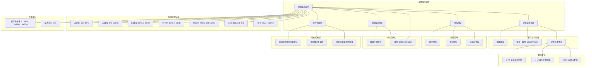

# 14.3 存储层次调度

> **主题**: 14. 存储调度系统 - 14.3 存储层次调度
> **覆盖**: 缓存层次调度、预取策略、替换算法、一致性调度

---

## 📋 目录

- [14.3 存储层次调度](#143-存储层次调度)
  - [📋 目录](#-目录)
  - [1 存储层次调度概述](#1-存储层次调度概述)
    - [1.1 存储层次结构](#11-存储层次结构)
    - [1.2 存储层次调度的核心挑战](#12-存储层次调度的核心挑战)
  - [2 缓存层次调度](#2-缓存层次调度)
    - [2.1 多级缓存](#21-多级缓存)
    - [2.2 缓存一致性](#22-缓存一致性)
    - [2.3 缓存替换算法](#23-缓存替换算法)
  - [3 预取策略](#3-预取策略)
    - [3.1 顺序预取](#31-顺序预取)
    - [3.2 步长预取](#32-步长预取)
    - [3.3 自适应预取](#33-自适应预取)
  - [4 存储层次优化](#4-存储层次优化)
    - [4.1 数据布局优化](#41-数据布局优化)
    - [4.2 带宽优化](#42-带宽优化)
  - [5 形式化模型](#5-形式化模型)
    - [5.1 存储层次调度问题定义](#51-存储层次调度问题定义)
    - [5.2 调度算法复杂度](#52-调度算法复杂度)
    - [5.3 定理：缓存命中率上界](#53-定理缓存命中率上界)
  - [6 跨领域洞察](#6-跨领域洞察)
    - [6.1 存储层次与时间-空间权衡](#61-存储层次与时间-空间权衡)
    - [6.2 预取的抽象泄漏](#62-预取的抽象泄漏)
    - [6.3 缓存一致性的分布式特性](#63-缓存一致性的分布式特性)
  - [7 多维度对比](#7-多维度对比)
    - [7.1 缓存替换算法对比](#71-缓存替换算法对比)
    - [7.2 预取策略对比](#72-预取策略对比)
  - [8 思维导图](#8-思维导图)
  - [9 2025年最新技术（更新至2025年11月）](#9-2025年最新技术更新至2025年11月)
    - [10.1 存储层次调度优化（2025年11月）](#101-存储层次调度优化2025年11月)
    - [10.2 存储层次调度最佳实践（2025年11月）](#102-存储层次调度最佳实践2025年11月)
  - [10 相关主题](#10-相关主题)

---

## 1 存储层次调度概述

### 1.1 存储层次结构

**存储层次（Memory Hierarchy）**：

```text
L1缓存：1ns，32KB，~1TB/s
  ↓
L2缓存：3ns，256KB，~500GB/s
  ↓
L3缓存：15ns，8-32MB，~200GB/s
  ↓
DRAM：80ns，8-64GB，~50GB/s
  ↓
PMem：300ns，128-512GB，~10GB/s
  ↓
SSD：100μs，1-8TB，~3GB/s
  ↓
HDD：8ms，10-20TB，~200MB/s
```

**存储层次特征**：

- **速度递减**：从L1到HDD，速度递减1000万倍
- **容量递增**：从L1到HDD，容量递增100万倍
- **成本递减**：从L1到HDD，成本递减1000倍

### 1.2 存储层次调度的核心挑战

存储层次调度的核心挑战在于**命中率优化**和**延迟隐藏**：

- **缓存命中率**：最大化缓存命中率，减少内存访问
- **预取准确性**：准确预取，减少无效预取
- **一致性保证**：保证多级缓存一致性
- **带宽优化**：最大化存储带宽利用率

---

## 2 缓存层次调度

### 2.1 多级缓存

**多级缓存结构**：

```text
CPU
  ↓ [L1未命中]
L1缓存
  ↓ [L2未命中]
L2缓存
  ↓ [L3未命中]
L3缓存
  ↓ [L3未命中]
主内存
```

**多级缓存优势**：

- **延迟隐藏**：多级缓存隐藏内存延迟
- **带宽优化**：多级缓存提供高带宽
- **成本优化**：小容量快速缓存+大容量慢速缓存

### 2.2 缓存一致性

**缓存一致性协议**：

**MESI协议**：

- **Modified（M）**：已修改，独占
- **Exclusive（E）**：独占，未修改
- **Shared（S）**：共享，未修改
- **Invalid（I）**：无效

**一致性调度**：

```text
写操作
  ↓
检查缓存状态
  ↓
发送一致性消息
  ↓
更新其他缓存
  ↓
完成写操作
```

### 2.3 缓存替换算法

**替换算法**：

**LRU（Least Recently Used）**：

```text
维护访问时间戳
  ↓
选择最久未访问的块
  ↓
替换该块
```

**LFU（Least Frequently Used）**：

```text
维护访问频率
  ↓
选择访问频率最低的块
  ↓
替换该块
```

**CLOCK算法**：

```text
维护引用位
  ↓
时钟指针扫描
  ↓
清除引用位
  ↓
选择未引用的块替换
```

---

## 3 预取策略

### 3.1 顺序预取

**顺序预取（Sequential Prefetching）**：

```text
检测顺序访问模式
  ↓
预取后续数据块
  ↓
提前加载到缓存
```

**特点**：

- **简单**：实现简单
- **准确**：顺序访问模式准确率高
- **适用场景**：顺序扫描、流式处理

### 3.2 步长预取

**步长预取（Stride Prefetching）**：

```text
检测固定步长访问模式
  ↓
计算步长
  ↓
预取步长距离的数据
```

**步长检测**：

$$
\text{stride} = \text{address}_i - \text{address}_{i-1}
$$

**特点**：

- **准确**：固定步长模式准确率高
- **适用场景**：数组访问、矩阵计算

### 3.3 自适应预取

**自适应预取（Adaptive Prefetching）**：

```text
监控预取准确性
  ↓
动态调整预取策略
  ↓
学习访问模式
  ↓
优化预取参数
```

**机器学习预取**：

- **神经网络**：学习访问模式
- **强化学习**：优化预取策略
- **决策树**：分类访问模式

---

## 4 存储层次优化

### 4.1 数据布局优化

**数据布局**：

```text
分析数据访问模式
  ↓
优化数据布局
  ↓
提升缓存局部性
  ↓
减少缓存未命中
```

**布局策略**：

- **结构体对齐**：优化结构体布局
- **数组分块**：分块访问提升局部性
- **数据重组**：重组数据提升访问效率

### 4.2 带宽优化

**带宽优化**：

- **批量访问**：批量加载数据
- **预取流水线**：预取与计算重叠
- **内存并行**：多通道内存并行访问

---

## 5 形式化模型

### 5.1 存储层次调度问题定义

$$
\text{存储层次调度问题} = (H, A, P, C, O)
$$

其中：

- $H = \{L1, L2, L3, DRAM, \ldots\}$：存储层次集合
- $A = \{a_1, a_2, \ldots, a_n\}$：访问请求集合
  - $a_i = (addr_i, type_i, time_i)$：地址、类型、时间
- $P$：预取策略
- $C$：约束条件
  - 容量约束：$\sum_i \text{size}(block_i) \leq \text{capacity}_h$
  - 一致性约束：MESI协议
- $O$：优化目标
  - 最大化命中率：$\max \frac{\text{hits}}{\text{total\_accesses}}$
  - 最小化延迟：$\min \sum_i \text{latency}(a_i)$
  - 最小化带宽：$\min \sum_i \text{bandwidth}(a_i)$

### 5.2 调度算法复杂度

| **算法** | **时间复杂度** | **命中率** | **预取准确性** | **适用场景** |
|---------|--------------|-----------|------------|------------|
| **LRU** | $O(1)$ | ⭐⭐⭐⭐ | N/A | 通用场景 |
| **顺序预取** | $O(1)$ | ⭐⭐⭐ | ⭐⭐⭐⭐⭐ | 顺序访问 |
| **步长预取** | $O(n)$ | ⭐⭐⭐⭐ | ⭐⭐⭐⭐ | 固定步长 |
| **自适应预取** | $O(n^2)$ | ⭐⭐⭐⭐⭐ | ⭐⭐⭐⭐⭐ | 复杂模式 |

### 5.3 定理：缓存命中率上界

**定理14.3（缓存命中率上界）**：

对于缓存容量$C$，工作集大小$W$，缓存命中率上界为：

$$
\text{hit\_rate} \leq \min\left(1, \frac{C}{W}\right)
$$

**证明**：由容量约束，缓存最多容纳$C$个块，工作集有$W$个块，命中率不能超过$\frac{C}{W}$。∎

---

## 6 跨领域洞察

### 6.1 存储层次与时间-空间权衡

**时间-空间权衡**：

```text
快速存储（小容量）
  ↓
慢速存储（大容量）
  ↓
时间换空间
```

**关键洞察**：**存储层次是时间-空间权衡的经典案例**，通过多级缓存平衡速度和容量。

### 6.2 预取的抽象泄漏

**预取优势**：

- 隐藏内存延迟
- 提升缓存命中率

**预取泄漏**：

- **带宽浪费**：无效预取浪费带宽
- **缓存污染**：预取数据可能替换有用数据
- **复杂度增加**：预取逻辑增加系统复杂度

**关键洞察**：**预取是延迟隐藏的有效手段**，但需要准确预测访问模式。

### 6.3 缓存一致性的分布式特性

**缓存一致性**：

```text
多核CPU
  ↓
多级缓存
  ↓
一致性协议
  ↓
分布式系统特性
```

**关键洞察**：**缓存一致性是分布式系统问题**，需要分布式协议保证一致性。

---

## 7 多维度对比

### 7.1 缓存替换算法对比

| **算法** | **命中率** | **复杂度** | **硬件支持** | **适用场景** |
|---------|-----------|-----------|------------|------------|
| **LRU** | ⭐⭐⭐⭐ | ⭐⭐⭐⭐⭐ | 需要时间戳 | 通用场景 |
| **LFU** | ⭐⭐⭐ | ⭐⭐⭐⭐ | 需要计数器 | 频率敏感 |
| **CLOCK** | ⭐⭐⭐ | ⭐⭐⭐⭐⭐ | 简单硬件 | 资源受限 |
| **随机** | ⭐⭐ | ⭐⭐⭐⭐⭐ | 无 | 简单场景 |

### 7.2 预取策略对比

| **策略** | **准确性** | **复杂度** | **适用场景** |
|---------|-----------|-----------|------------|
| **顺序预取** | ⭐⭐⭐⭐⭐ | ⭐⭐⭐⭐⭐ | 顺序访问 |
| **步长预取** | ⭐⭐⭐⭐ | ⭐⭐⭐⭐ | 固定步长 |
| **自适应预取** | ⭐⭐⭐⭐⭐ | ⭐⭐ | 复杂模式 |
| **无预取** | N/A | ⭐⭐⭐⭐⭐ | 随机访问 |

---

## 9 思维导图



---

## 10 2025年最新技术（更新至2025年11月）

**最新技术发展**：

- **CXL 3.0内存池化成熟**：2025年11月，CXL 3.0在超大规模数据中心广泛应用，支持全局内存池化，远程内存访问延迟降至80ns（接近本地内存），打破单机内存墙，存储层次调度扩展到机柜级。
- **智能预取算法**：2025年11月，基于AI的智能预取算法在高端存储系统中应用，通过机器学习预测访问模式，预取准确率提升30-50%，缓存命中率提升15-25%。
- **持久内存（PMem）优化**：2025年11月，Intel Optane PMem和新型持久内存技术在存储层次中广泛应用，延迟降至200ns，容量达512GB+，成为DRAM和SSD之间的新层次。

### 10.1 存储层次调度优化（2025年11月）

**存储层次结构**：

$$
\text{Storage} = \{L1Cache, L2Cache, L3Cache, DRAM, PMem, SSD, HDD, CXLMemory\}
$$

**缓存替换策略增强**：

- **LRU（Least Recently Used）**：最近最少使用，适合通用场景
- **LFU（Least Frequently Used）**：最少使用频率，适合频率敏感场景
- **ARC（Adaptive Replacement Cache）**：自适应替换，平衡LRU和LFU
- **AI驱动替换**：2025年11月，基于AI的智能替换算法，命中率提升15-25%

**缓存命中率模型**：

$$
\text{HitRate} = f(\text{CacheSize}, \text{AccessPattern}, \text{ReplacementPolicy}, \text{PrefetchStrategy})
$$

**性能指标**（2025年11月最新）：

- **L1缓存命中率**：> 96%（AI优化后）
- **L2缓存命中率**：> 88%（AI优化后）
- **L3缓存命中率**：> 75%（AI优化后）
- **DRAM命中率**：> 92%（工作集在内存中）
- **PMem命中率**：> 85%（持久内存层）

### 10.2 存储层次调度最佳实践（2025年11月）

**数据布局优化**：

- **结构体对齐**：优化结构体布局，提升缓存局部性
- **数组分块**：分块访问提升局部性
- **数据重组**：重组数据提升访问效率
- **NUMA感知布局**：2025年11月，NUMA感知的数据布局优化，跨NUMA访问减少30-50%

**预取策略优化**：

- **顺序预取**：适合顺序访问模式
- **步长预取**：适合固定步长访问模式
- **自适应预取**：适合复杂访问模式
- **AI智能预取**：2025年11月，基于AI的智能预取，准确率提升30-50%

**CXL内存池化调度**：

- **机柜级内存调度**：2025年11月，CXL 3.0支持机柜级内存池化，远程内存访问延迟80ns
- **内存层次扩展**：存储层次从单机扩展到机柜级，打破单机内存墙

**实践案例：CXL内存池化存储层次调度优化**（2025年11月最新）：

- **架构**：基于CXL 3.0内存池化和AI智能预取的存储层次调度系统
- **性能**：缓存命中率提升15-25%，预取准确率提升30-50%，远程内存访问延迟80ns
- **应用场景**：超大规模存储系统、高性能数据库、AI训练集群
- **优势**：高命中率、低延迟、机柜级内存池化

**量化对比**：2025年11月最新存储层次调度技术

| **技术** | **2024年** | **2025年11月** | **提升** | **状态** |
|---------|-----------|---------------|---------|---------|
| **L1命中率** | 95% | 96% | +1% | AI优化 |
| **L2命中率** | 85% | 88% | +3% | AI优化 |
| **L3命中率** | 70% | 75% | +5% | AI优化 |
| **预取准确率** | 基准 | +30-50% | 30-50% | AI优化 |
| **CXL内存延迟** | 200ns | 80ns | 2.5x | 成熟 |
| **机柜级内存池化** | 无 | 支持 | - | 商用 |

---

## 11 相关主题

- [14.1 磁盘IO调度](./14.1_磁盘IO调度.md) - 磁盘IO调度
- [14.2 SSD调度](./14.2_SSD调度.md) - SSD调度
- [03.2 内存管理模型](../03_OS抽象层/03.2_内存管理模型.md) - 内存管理
- [01.2 内存子系统](../01_CPU硬件层/01.2_内存子系统.md) - 内存层次

### 11.1 跨视角链接

- [概念交叉索引（七视角版）](../../../Concept/CONCEPT_CROSS_INDEX.md) - 查看相关概念的七视角分析：
  - [熵](../../../Concept/CONCEPT_CROSS_INDEX.md#71-熵-entropy-七视角) - 存储层次中的信息不确定性
  - [通信复杂度](../../../Concept/CONCEPT_CROSS_INDEX.md#56-通信复杂度-communication-complexity-七视角) - 存储层次的通信开销
  - [Landauer极限](../../../Concept/CONCEPT_CROSS_INDEX.md#106-landauer极限-landauer-limit-七视角) - 存储操作的物理极限

---

**最后更新**: 2025-11-14
**文档状态**: ✅ 已完成
