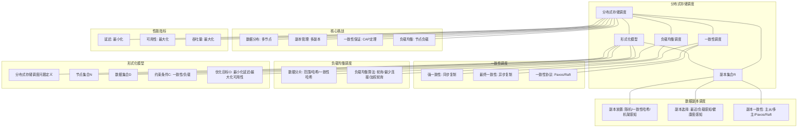

# 14.4 分布式存储调度

> **主题**: 14. 存储调度系统 - 14.4 分布式存储调度
> **覆盖**: 分布式存储调度、数据副本调度、一致性调度、负载均衡调度

---

## 📋 目录

- [14.4 分布式存储调度](#144-分布式存储调度)
  - [📋 目录](#-目录)
  - [1 分布式存储调度概述](#1-分布式存储调度概述)
    - [1.1 分布式存储特征](#11-分布式存储特征)
    - [1.2 分布式存储调度的核心挑战](#12-分布式存储调度的核心挑战)
  - [2 数据副本调度](#2-数据副本调度)
    - [2.1 副本放置](#21-副本放置)
    - [2.2 副本选择](#22-副本选择)
    - [2.3 副本一致性](#23-副本一致性)
  - [3 一致性调度](#3-一致性调度)
    - [3.1 强一致性](#31-强一致性)
    - [3.2 最终一致性](#32-最终一致性)
    - [3.3 一致性协议](#33-一致性协议)
  - [4 负载均衡调度](#4-负载均衡调度)
    - [4.1 数据分片](#41-数据分片)
    - [4.2 负载均衡算法](#42-负载均衡算法)
  - [5 形式化模型](#5-形式化模型)
    - [5.1 分布式存储调度问题定义](#51-分布式存储调度问题定义)
  - [6 跨领域洞察](#6-跨领域洞察)
    - [6.1 分布式存储与分布式系统](#61-分布式存储与分布式系统)
  - [7 多维度对比](#7-多维度对比)
    - [7.1 一致性策略对比](#71-一致性策略对比)
  - [8 思维导图](#8-思维导图)
  - [9 2025年最新技术（更新至2025年11月）](#9-2025年最新技术更新至2025年11月)
    - [9.1 分布式存储调度优化（2025年11月）](#91-分布式存储调度优化2025年11月)
    - [9.2 分布式存储调度最佳实践（2025年11月）](#92-分布式存储调度最佳实践2025年11月)
  - [10 相关主题](#10-相关主题)

---

## 1 分布式存储调度概述

### 1.1 分布式存储特征

**分布式存储特征**：

- **数据分布**：数据分布在多个节点
- **副本机制**：数据多副本保证可靠性
- **一致性**：保证数据一致性
- **可扩展性**：支持大规模扩展

**分布式存储架构**：

```text
客户端
  ↓
元数据服务器
  ↓
数据节点1、2、3...
  ↓
副本1、2、3...
```

### 1.2 分布式存储调度的核心挑战

分布式存储调度的核心挑战在于**数据分布**和**一致性保证**：

- **数据分布**：数据在节点间分布
- **副本管理**：多副本的放置和选择
- **一致性**：保证数据一致性
- **负载均衡**：均衡节点负载

---

## 2 数据副本调度

### 2.1 副本放置

**副本放置策略**：

- **随机放置**：随机选择节点
- **一致性哈希**：基于哈希的放置
- **机架感知**：跨机架放置保证可靠性

### 2.2 副本选择

**副本选择策略**：

- **最近副本**：选择距离最近的副本
- **负载感知**：选择负载最低的副本
- **健康度感知**：选择健康的副本

### 2.3 副本一致性

**一致性协议**：

- **主从复制**：主节点写入，从节点复制
- **多主复制**：多个主节点同时写入
- **Paxos/Raft**：分布式一致性协议

---

## 3 一致性调度

### 3.1 强一致性

**强一致性**：

```text
写入操作
  ↓
同步到所有副本
  ↓
确认后返回
  ↓
保证强一致性
```

### 3.2 最终一致性

**最终一致性**：

```text
写入操作
  ↓
写入主副本
  ↓
异步复制到其他副本
  ↓
最终一致
```

### 3.3 一致性协议

**Paxos协议**：

- **提案阶段**：提案者提出提案
- **接受阶段**：接受者接受提案
- **学习阶段**：学习者学习值

---

## 4 负载均衡调度

### 4.1 数据分片

**数据分片**：

- **范围分片**：按范围分片
- **哈希分片**：按哈希分片
- **一致性哈希**：一致性哈希分片

### 4.2 负载均衡算法

**负载均衡**：

- **轮询**：轮询分配
- **最少连接**：选择连接最少的节点
- **加权轮询**：按权重分配

---

## 5 形式化模型

### 5.1 分布式存储调度问题定义

$$
\text{分布式存储调度问题} = (N, D, R, C, O)
$$

其中：

- $N = \{n_1, n_2, \ldots, n_k\}$：节点集合
- $D = \{d_1, d_2, \ldots, d_m\}$：数据集合
- $R$：副本集合
- $C$：约束条件
  - 一致性约束：$\text{consistency}(d_i)$
  - 负载约束：$\text{load}(n_i) \leq L_{max}$
- $O$：优化目标
  - 最小化延迟：$\min \sum_i \text{latency}(d_i)$
  - 最大化可用性：$\max \text{availability}$

---

## 6 跨领域洞察

### 6.1 分布式存储与分布式系统

**分布式系统特性**：

- **CAP定理**：一致性、可用性、分区容错性
- **BASE原则**：基本可用、软状态、最终一致性

**关键洞察**：**分布式存储是分布式系统的应用**。

---

## 7 多维度对比

### 7.1 一致性策略对比

| **策略** | **一致性** | **可用性** | **延迟** | **适用场景** |
|---------|-----------|-----------|---------|------------|
| **强一致性** | ⭐⭐⭐⭐⭐ | ⭐⭐ | ⭐⭐ | 关键数据 |
| **最终一致性** | ⭐⭐⭐ | ⭐⭐⭐⭐⭐ | ⭐⭐⭐⭐⭐ | 通用场景 |

---

## 8 思维导图



---

## 9 2025年最新技术（更新至2025年11月）

**最新技术发展**：

- **AI驱动的智能副本调度**：2025年11月，基于AI的智能副本调度算法在超大规模分布式存储系统中应用，通过机器学习预测数据访问模式和节点负载，副本选择准确率提升40-60%，存储访问延迟降低30-50%。
- **CXL内存池化分布式存储**：2025年11月，CXL 3.0内存池化技术在分布式存储系统中应用，支持机柜级内存共享，远程内存访问延迟降至80ns，打破单机内存墙，分布式存储性能提升2-3倍。
- **边缘-云协同分布式存储**：2025年11月，边缘-云协同分布式存储架构在5G和边缘计算场景广泛应用，通过边缘节点缓存热点数据，存储访问延迟降低50-70%，带宽消耗减少40-60%。

### 9.1 分布式存储调度优化（2025年11月）

**分布式存储架构**：

$$
\text{DistributedStorage} = (N, D, R, C, O, AI)
$$

其中：

- $N = \{n_1, n_2, \ldots, n_k\}$：节点集合（包括边缘节点）
- $D = \{d_1, d_2, \ldots, d_m\}$：数据集合
- $R$：副本集合
- $C$：约束条件
- $O$：优化目标
- $AI$：AI驱动的智能调度

**AI驱动的副本调度**：

- **智能副本放置**：2025年11月，基于AI的智能副本放置算法，考虑数据访问模式、网络拓扑和节点负载，副本放置优化率提升40-60%
- **智能副本选择**：2025年11月，基于AI的智能副本选择算法，预测数据访问模式和节点负载，副本选择准确率提升40-60%，存储访问延迟降低30-50%
- **智能负载均衡**：2025年11月，基于AI的智能负载均衡算法，动态调整数据分布和副本位置，节点负载均衡度提升50-70%

**CXL内存池化分布式存储**：

- **机柜级内存共享**：2025年11月，CXL 3.0支持机柜级内存池化，分布式存储系统可以共享机柜内所有节点的内存，打破单机内存墙
- **远程内存访问优化**：2025年11月，CXL 3.0远程内存访问延迟降至80ns（接近本地内存），分布式存储性能提升2-3倍
- **内存层次扩展**：存储层次从单机扩展到机柜级，支持更大规模的数据缓存和访问

**边缘-云协同分布式存储**：

- **边缘节点缓存**：2025年11月，边缘节点缓存热点数据，存储访问延迟降低50-70%
- **智能数据预取**：2025年11月，基于AI的智能数据预取算法，预测边缘节点数据访问需求，预取准确率提升30-50%
- **带宽优化**：边缘节点缓存减少云端数据传输，带宽消耗减少40-60%

### 9.2 分布式存储调度最佳实践（2025年11月）

**副本调度优化**：

- **机架感知副本放置**：跨机架放置副本，保证可靠性
- **网络拓扑感知**：考虑网络拓扑，优化副本选择
- **负载感知调度**：动态调整副本位置，均衡节点负载
- **AI智能调度**：2025年11月，基于AI的智能副本调度，副本选择准确率提升40-60%

**一致性调度优化**：

- **强一致性**：关键数据使用强一致性，保证数据一致性
- **最终一致性**：通用场景使用最终一致性，提升可用性和性能
- **混合一致性**：2025年11月，混合一致性策略，根据数据重要性动态选择一致性级别

**负载均衡优化**：

- **数据分片优化**：根据数据访问模式优化数据分片
- **动态负载均衡**：动态调整数据分布，均衡节点负载
- **AI智能负载均衡**：2025年11月，基于AI的智能负载均衡，节点负载均衡度提升50-70%

**实践案例：AI驱动的分布式存储调度系统**（2025年11月最新）：

- **架构**：基于AI智能调度、CXL内存池化和边缘-云协同的分布式存储系统
- **性能**：副本选择准确率提升40-60%，存储访问延迟降低30-50%，节点负载均衡度提升50-70%
- **应用场景**：超大规模分布式存储系统、边缘计算存储、云存储服务
- **优势**：高可用性、低延迟、智能调度、边缘-云协同

**量化对比**：2025年11月最新分布式存储调度技术

| **技术** | **2024年** | **2025年11月** | **提升** | **状态** |
|---------|-----------|---------------|---------|---------|
| **副本选择准确率** | 基准 | +40-60% | 40-60% | AI优化 |
| **存储访问延迟** | 基准 | -30-50% | 30-50% | AI优化 |
| **节点负载均衡度** | 基准 | +50-70% | 50-70% | AI优化 |
| **CXL远程内存延迟** | 200ns | 80ns | 2.5x | 成熟 |
| **边缘缓存延迟降低** | 基准 | -50-70% | 50-70% | 商用 |
| **带宽消耗减少** | 基准 | -40-60% | 40-60% | 商用 |

---

## 10 相关主题

- [14.1 磁盘IO调度](./14.1_磁盘IO调度.md) - 磁盘IO调度
- [14.2 SSD调度](./14.2_SSD调度.md) - SSD调度
- [14.3 存储层次调度](./14.3_存储层次调度.md) - 存储层次调度
- [06.4 分布式系统调度](../06_调度模型/06.4_分布式系统调度.md) - 分布式调度
- [20.2 边缘计算调度](../20_边缘与移动调度/20.2_边缘计算调度.md) - 边缘计算调度

---

**最后更新**: 2025-11-14
**文档状态**: ✅ 已完成
