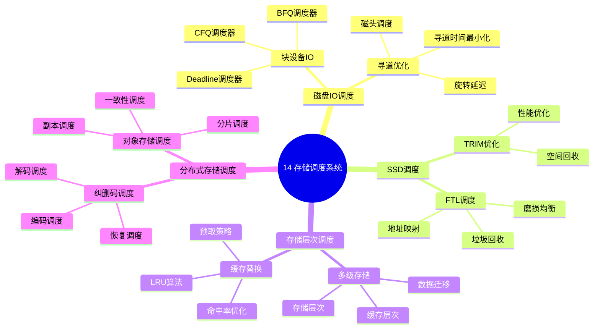

# 14. 存储调度系统

> **主题**: 存储IO调度、SSD调度、存储层次调度、分布式存储调度
> **覆盖范围**: 从块设备IO调度到分布式存储调度的完整体系

---

## 📋 目录

- [14. 存储调度系统](#14-存储调度系统)
  - [📋 目录](#-目录)
  - [1 子主题索引](#1-子主题索引)
    - [1.0 存储调度系统思维导图](#10-存储调度系统思维导图)
  - [2 相关主题](#2-相关主题)
  - [3 核心概念矩阵](#3-核心概念矩阵)
  - [4 调度延迟层级](#4-调度延迟层级)
  - [5 形式化模型](#5-形式化模型)
    - [5.1 IO调度问题定义](#51-io调度问题定义)
    - [5.2 调度算法复杂度](#52-调度算法复杂度)

---

## 1 子主题索引

### 1.0 存储调度系统思维导图



**可视化文档**: 查看 [思维导图与知识矩阵](../思维导图与知识矩阵.md#310-10-24-扩展主题) 获取更详细的思维导图。


- [14.1 磁盘IO调度](./14.1_磁盘IO调度.md) - 块设备IO调度器（CFQ、Deadline、Noop、BFQ）、寻道优化、旋转延迟
- [14.2 SSD调度](./14.2_SSD调度.md) - FTL调度、垃圾回收调度、磨损均衡、TRIM优化
- [14.3 存储层次调度](./14.3_存储层次调度.md) - 多级存储调度、缓存替换策略、预取调度
- [14.4 分布式存储调度](./14.4_分布式存储调度.md) - 对象存储调度、副本调度、纠删码调度、一致性调度

---

## 2 相关主题

- [03.3 文件系统模型](../03_OS抽象层/03.3_文件系统模型.md) - 块IO调度
- [06.2 OS内核调度](../06_调度模型/06.2_OS内核调度.md) - IO调度器
- [07.2 延迟穿透分析](../07_性能优化与安全/07.2_延迟穿透分析.md) - IO延迟分析
- [12.1 端到端延迟分解](../12_跨层次调度协同/12.1_端到端延迟分解.md) - 存储延迟分解

---

## 3 核心概念矩阵

| **调度类型** | **调度单元** | **延迟范围** | **优化目标** | **主要约束** |
|------------|------------|------------|------------|------------|
| **磁盘IO调度** | IO请求 | 5-10ms（寻道） | 最小化寻道时间 | 机械延迟 |
| **SSD调度** | 页/块 | 100μs（随机） | 最小化延迟 | 磨损均衡 |
| **存储层次调度** | 数据块 | 纳秒-毫秒 | 最大化命中率 | 容量限制 |
| **分布式存储调度** | 对象/分片 | 毫秒-秒 | 一致性+可用性 | 网络延迟 |

---

## 4 调度延迟层级

```text
应用层IO请求
  ↓ [系统调用] ~1μs
VFS层
  ↓ [块设备抽象] ~5μs
块IO调度器（CFQ/Deadline/BFQ）
  ↓ [队列调度] ~10μs
设备驱动
  ↓ [DMA传输] ~50μs
存储设备
  ├─ 磁盘: 寻道5-10ms + 旋转延迟2-8ms + 传输1-5ms
  └─ SSD: 随机100μs + 顺序50μs
```

**关键洞察**：存储调度延迟跨越6个数量级（纳秒到毫秒），调度策略必须适应不同延迟特性。

---

## 5 形式化模型

### 5.1 IO调度问题定义

$$
\text{IO调度问题} = (R, Q, C, O)
$$

其中：

- $R = \{r_1, r_2, \ldots, r_n\}$：存储资源（磁盘、SSD、缓存）
- $Q = \{q_1, q_2, \ldots, q_m\}$：IO请求队列（LBA、大小、方向）
- $C$：约束条件（寻道时间、带宽限制、容量）
- $O$：优化目标（最小化延迟、最大化吞吐量、公平性）

### 5.2 调度算法复杂度

| **算法** | **时间复杂度** | **空间复杂度** | **最优性** |
|---------|--------------|--------------|-----------|
| **FIFO** | $O(1)$ | $O(n)$ | 非最优 |
| **CFQ** | $O(\log n)$ | $O(n)$ | 公平性最优 |
| **Deadline** | $O(\log n)$ | $O(n)$ | 延迟保证 |
| **BFQ** | $O(\log n)$ | $O(n)$ | 公平性+延迟 |

---

**最后更新**: 2025-11-14
**文档状态**: ✅ 已完成，包含思维导图和2025年最新技术章节
