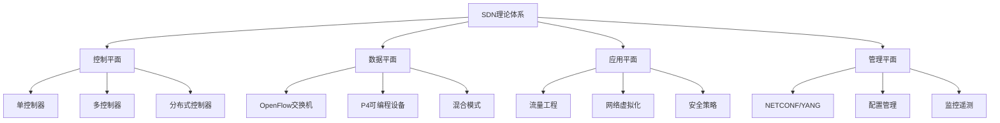

# 15.4 SDN调度

> **主题**: 15. 网络调度系统 - 15.4 SDN调度
> **覆盖**: SDN控制器调度、流表调度、网络虚拟化调度、OpenFlow调度

## 📚 理论体系（已完善）

### 1. 理论基础

#### 1.1 SDN的理论根基

**1. 控制平面与数据平面分离理论**：

- 集中式控制逻辑简化网络管理
- 全局视图优化路由决策
- 可编程接口实现灵活策略

**2. 网络功能虚拟化（NFV）理论**：

- 软件定义网络功能
- 资源池化与动态分配
- 服务链编排

**3. 分布式系统理论**：

- 一致性协议（Raft/Paxos）
- 分布式状态同步
- 故障容错机制

#### 1.2 历史演进

| **时期** | **里程碑** | **核心贡献** | **标准/项目** |
|---------|-----------|-------------|--------------|
| **2008** | SDN概念提出 | OpenFlow论文发表 | McKeown et al. |
| **2009** | OpenFlow 1.0 | 首个OpenFlow标准 | ONF |
| **2011** | OpenDaylight启动 | 开源SDN控制器 | Linux基金会 |
| **2014** | P4语言提出 | 可编程数据平面 | P4.org |
| **2015** | ONOS发布 | 运营商级SDN控制器 | ONF |
| **2016** | P4Runtime | 控制平面API标准 | P4.org |
| **2020** | P4_16成熟 | 新一代P4语言 | P4.org |

### 2. 理论框架

#### 2.1 核心假设

**假设1：集中式控制可行**

- **内容**：SDN控制器可以集中管理网络状态并做出全局优化决策
- **数学表达**：Controller_state = f(Network_topology, Flow_demands, Policies)
- **适用范围**：数据中心、企业网络、运营商骨干网
- **限制条件**：控制器需要有足够的处理能力和可靠性

**假设2：流表可编程**

- **内容**：交换机支持通过流表实现灵活的包处理逻辑
- **数学表达**：Action = Match(Packet, FlowTable)
- **适用范围**：OpenFlow交换机、P4可编程设备
- **限制条件**：受限于TCAM/SRAM容量

**假设3：南向协议标准化**

- **内容**：控制器与交换机之间的通信遵循标准化协议
- **数学表达**：Message ∈ Protocol_grammar
- **适用范围**：OpenFlow、P4Runtime、NETCONF
- **限制条件**：需要设备支持相应协议

#### 2.2 基本概念体系


```mermaid
graph TD
    A[SDN理论体系] --> B[控制平面]
    A --> C[数据平面]
    A --> D[应用平面]
    A --> E[管理平面]

    B --> B1[单控制器]
    B --> B2[多控制器]
    B --> B3[分布式控制器]

    C --> C1[OpenFlow交换机]
    C --> C2[P4可编程设备]
    C --> C3[混合模式]

    D --> D1[流量工程]
    D --> D2[网络虚拟化]
    D --> D3[安全策略]

    E --> E1[NETCONF/YANG]
    E --> E2[配置管理]
    E --> E3[监控遥测]
```

#### 2.3 主要定理/结论

**定理1：流表匹配复杂度**

对于包含n个流表项的流表，匹配复杂度为：

- 线性匹配：O(n)
- 哈希匹配：O(1)
- TCAM匹配：O(1)（硬件并行）
- Trie树匹配：O(log n)

**定理2：控制器可扩展性**

控制器吞吐量T与交换机数量S的关系：

$$
T = O(S) for single controller
$$

$$
T = O(S/k) for k-controller cluster
$$

其中k为控制器数量。

**定理3：一致性更新**

对于两阶段提交（2PC）的一致性更新协议，如果控制器多数派存活，则可以保证网络状态的一致性。

**证明概要**：

1. 准备阶段：控制器向所有交换机发送准备消息
2. 提交阶段：收到多数派确认后，发送提交消息
3. 回滚机制：超时或失败时，发送回滚消息
4. 一致性保证：所有存活的交换机最终达到相同状态

#### 2.4 适用范围和边界

**适用范围**：

| **场景** | **控制器选择** | **规模** | **关键需求** |
|---------|---------------|---------|-------------|
| 小型数据中心 | Ryu/Floodlight | <100交换机 | 简单、轻量 |
| 中型企业网 | OpenDaylight | 100-1K交换机 | 功能丰富 |
| 运营商骨干网 | ONOS | 1K-100K交换机 | 高可用、分布式 |
| 超大规模云 | 自研+ONOS | >100K交换机 | 定制、性能 |

**边界条件**：

- **流表容量**：TCAM容量限制（1K-32K entries）
- **控制器处理能力**：单控制器10K-100K flows/s
- **网络延迟**：控制器-交换机RTT影响响应时间

### 3. RFC/标准对标体系

#### 3.1 OpenFlow协议标准对标

| **版本** | **发布时间** | **关键特性** | **匹配字段** | **RFC/规范** |
|---------|-------------|-------------|-------------|-------------|
| **OpenFlow 1.0** | 2009 | 基础版本 | 12个 | ONF TS-001 |
| **OpenFlow 1.3** | 2012 | IPv6、计量表 | 40个 | ONF TS-006 |
| **OpenFlow 1.4** | 2013 | 同步表、捆绑 | 41个 | ONF TS-007 |
| **OpenFlow 1.5** | 2015 | 流表监视 | 44个 | ONF TS-008 |

**OpenFlow 1.3匹配字段（40个标准字段）**：

| **字段类别** | **字段名称** | **位宽** | **说明** |
|-------------|-------------|---------|---------|
| 端口 | IN_PORT | 32 | 入端口 |
| 端口 | IN_PHY_PORT | 32 | 物理入端口 |
| 元数据 | METADATA | 64 | 可编程元数据 |
| 二层 | ETH_DST | 48 | 目的MAC |
| 二层 | ETH_SRC | 48 | 源MAC |
| 二层 | ETH_TYPE | 16 | 以太网类型 |
| 三层 | IPV4_SRC | 32 | IPv4源地址 |
| 三层 | IPV4_DST | 32 | IPv4目的地址 |
| 四层 | TCP_SRC | 16 | TCP源端口 |
| 四层 | TCP_DST | 16 | TCP目的端口 |

#### 3.2 P4语言标准对标

**P4 Language Specification v1.2.1（2020）**

| **组件** | **标准定义** | **实现状态** |
|---------|-------------|-------------|
| P4_16核心语言 | P4.org spec | ✅ 广泛支持 |
| V1Model架构 | P4.org spec | ✅ BMv2实现 |
| TNA架构 | Intel/Barefoot | ✅ Tofino芯片 |
| P4Runtime API | P4.org spec | ✅ 控制器支持 |

**P4程序基本结构**：

```p4
#include <core.p4>
#include <v1model.p4>

// 1. 头部定义
header ethernet_t { ... }

// 2. 解析器
parser ParserImpl(packet_in pkt, ...) { ... }

// 3. 控制流（Ingress/Egress）
control IngressImpl(inout headers hdr, ...) { ... }

// 4. 交换机架构实例化
V1Switch(
    ParserImpl(),
    VerifyChecksumImpl(),
    IngressImpl(),
    EgressImpl(),
    ComputeChecksumImpl(),
    DeparserImpl()
) main;
```

#### 3.3 管理协议标准对标

| **协议** | **标准** | **用途** | **传输层** |
|---------|---------|---------|-----------|
| **NETCONF** | RFC 6241 | 配置管理 | SSH (端口830) |
| **YANG** | RFC 6020 | 数据建模 | N/A |
| **RESTCONF** | RFC 8040 | RESTful配置 | HTTP/HTTPS |
| **gRPC** | Google spec | 高性能RPC | HTTP/2 |

**NETCONF操作原语**：

| **操作** | **描述** | **RPC示例** |
|---------|---------|------------|
| <get> | 读取状态数据 | <rpc><get/></rpc> |
| <get-config> | 读取配置数据 | <rpc><get-config><source><running/></source></get-config></rpc> |
| <edit-config> | 修改配置 | <rpc><edit-config>...</edit-config></rpc> |
| <copy-config> | 复制配置 | <rpc><copy-config>...</copy-config></rpc> |
| <delete-config> | 删除配置 | <rpc><delete-config>...</delete-config></rpc> |

### 4. OpenFlow协议深入分析

#### 4.1 OpenFlow消息格式

**OpenFlow 1.3消息头部（8字节）**：

```
 0                   1                   2                   3
 0 1 2 3 4 5 6 7 8 9 0 1 2 3 4 5 6 7 8 9 0 1 2 3 4 5 6 7 8 9 0 1
+-+-+-+-+-+-+-+-+-+-+-+-+-+-+-+-+-+-+-+-+-+-+-+-+-+-+-+-+-+-+-+-+
|   Version   |     Type      |            Length               |
+-+-+-+-+-+-+-+-+-+-+-+-+-+-+-+-+-+-+-+-+-+-+-+-+-+-+-+-+-+-+-+-+
|                           XID                                 |
+-+-+-+-+-+-+-+-+-+-+-+-+-+-+-+-+-+-+-+-+-+-+-+-+-+-+-+-+-+-+-+-+

Version: 4 (OpenFlow 1.3)
Type:    Message type (enum ofp_type)
Length:  Length including header
XID:     Transaction ID
```

**关键消息类型**：

| **类型** | **值** | **描述** | **方向** |
|---------|-------|---------|---------|
| OFPT_HELLO | 0 | 握手消息 | C↔S |
| OFPT_ERROR | 1 | 错误消息 | S→C |
| OFPT_ECHO_REQUEST | 2 | 心跳请求 | C↔S |
| OFPT_FEATURES_REQUEST | 5 | 特性请求 | C→S |
| OFPT_FEATURES_REPLY | 6 | 特性响应 | S→C |
| OFPT_PACKET_IN | 10 | 数据包上传 | S→C |
| OFPT_FLOW_MOD | 14 | 流表修改 | C→S |
| OFPT_PACKET_OUT | 13 | 数据包下发 | C→S |

#### 4.2 OpenFlow流表项结构

```c
struct ofp_flow_mod {
    struct ofp_header header;
    uint64_t cookie;              // 控制器标识
    uint64_t cookie_mask;         // Cookie掩码
    uint8_t table_id;             // 表ID
    uint8_t command;              // 命令类型
    uint16_t idle_timeout;        // 空闲超时
    uint16_t hard_timeout;        // 硬超时
    uint16_t priority;            // 优先级
    uint32_t buffer_id;           // 缓冲区ID
    uint32_t out_port;            // 出端口
    uint32_t out_group;           // 出组
    uint16_t flags;               // 标志位
    struct ofp_match match;       // 匹配字段
    struct ofp_instruction_header instructions[0]; // 指令集
};
```

**指令类型**：

| **指令** | **描述** | **用途** |
|---------|---------|---------|
| OFPIT_GOTO_TABLE | 跳转到指定表 | 流水线处理 |
| OFPIT_WRITE_METADATA | 写入元数据 | 表间通信 |
| OFPIT_WRITE_ACTIONS | 写入动作集 | 延迟执行 |
| OFPIT_APPLY_ACTIONS | 立即应用动作 | 直接执行 |
| OFPIT_CLEAR_ACTIONS | 清除动作集 | 重置 |
| OFPIT_METER | 应用计量表 | QoS/限速 |

### 5. P4语言详细实现

#### 5.1 P4核心概念

**P4的三个核心抽象**：

1. **Header（头部）**：协议数据包格式的描述
2. **Parser（解析器）**：数据包解析的状态机
3. **Control（控制流）**：匹配-动作逻辑

**P4 vs OpenFlow对比**：

| **特性** | **P4** | **OpenFlow** |
|---------|--------|-------------|
| 灵活性 | 极高（自定义协议） | 中等（预定义字段） |
| 复杂度 | 高（需编程） | 中（配置即可） |
| 性能 | 极高（ASIC/FPGA） | 高（TCAM） |
| 学习曲线 | 陡峭 | 平缓 |
| 目标设备 | 可编程芯片 | 固定功能芯片 |

#### 5.2 P4程序执行模型

**P4抽象转发模型**：

```
Ingress Parser → Ingress Control → Traffic Manager → Egress Control → Egress Parser
                ↓                    ↓                ↓
              表查找              队列调度          表查找
              动作执行            流量整形          动作执行
```

**P4编译流程**：

```
P4 Source → Frontend → Midend → Backend → Target Code
              ↓          ↓         ↓
           词法语法   优化转换   目标代码生成
           语义检查   中间表示   配置文件
```

#### 5.3 P4目标架构性能

| **目标** | **吞吐量** | **延迟** | **灵活性** | **成本** |
|---------|-----------|---------|-----------|---------|
| **BMv2软件交换机** | 1-10 Gbps | 10-100μs | 极高 | 低 |
| **FPGA SmartNIC** | 40-200 Gbps | 1-5μs | 高 | 中 |
| **Intel Tofino** | 400 Gbps-12.8Tbps | <1μs | 中 | 高 |
| **NVIDIA BlueField** | 200-400 Gbps | 2-10μs | 高 | 中高 |

### 6. SDN控制器对比

#### 6.1 控制器架构对比

| **维度** | **OpenDaylight** | **ONOS** | **Ryu** | **Floodlight** |
|---------|-----------------|---------|--------|---------------|
| **开发语言** | Java | Java | Python | Java |
| **架构类型** | 模块化/MD-SAL | 分布式/Atomix | 轻量/单进程 | 轻量/单进程 |
| **代码规模** | 200万+ LOC | 100万+ LOC | 5万+ LOC | 10万+ LOC |
| **社区活跃度** | 高（Linux基金会） | 高（ONF） | 中 | 低 |
| **南向接口** | OpenFlow/OVSDB/NETCONF/P4Runtime | OpenFlow/P4Runtime/gRPC/BGP | OpenFlow/OF-Config | OpenFlow |
| **高可用性** | 主备集群 | 主备/主主分布式 | 不支持 | 有限支持 |

#### 6.2 控制器性能对比

| **指标** | **OpenDaylight** | **ONOS** | **Ryu** | **Floodlight** |
|---------|-----------------|---------|--------|---------------|
| **吞吐量** | 20K-50K flows/s | 100K+ flows/s | 10K-30K flows/s | 15K-40K flows/s |
| **延迟 (P99)** | 5-15 ms | 2-5 ms | 5-20 ms | 5-15 ms |
| **内存占用** | 4-8 GB | 4-16 GB | 512MB-2GB | 2-4 GB |
| **支持交换机数** | 1K-5K | 10K-100K | 100-1K | 500-2K |
| **启动时间** | 2-5分钟 | 1-3分钟 | 5-10秒 | 10-30秒 |

#### 6.3 控制器选择决策树

```
网络规模评估
    │
    ├─ < 100交换机 ─── Ryu/Floodlight（轻量、易开发）
    │
    ├─ 100-1K交换机 ── OpenDaylight（功能丰富）
    │
    ├─ 1K-10K交换机 ── OpenDaylight集群/ONOS
    │
    └─ > 10K交换机 ─── ONOS分布式（运营商级）
```

### 7. 实际案例与性能数据

#### 7.1 Google B4网络

**部署规模**：全球私有广域网，连接数据中心

| **指标** | **传统网络** | **B4 SDN** | **提升** |
|---------|------------|-----------|---------|
| 链路利用率 | 30-40% | 接近100% | 2.5-3x |
| 配置时间 | 数周 | 数分钟 | 1000x+ |
| 故障恢复 | 分钟级 | 秒级 | 60x+ |
| 带宽成本 | 基准 | -30-40% | 30-40% |

**关键技术**：

- 集中式流量工程（Centralized TE）
- 线性规划优化路径分配
- 实时网络状态监测

#### 7.2 Facebook FBOSS

| **指标** | **数值** |
|---------|---------|
| 数据中心规模 | 数十万服务器 |
| 交换机数量 | 数万台 |
| 配置自动化率 | >99% |
| 故障检测时间 | <1秒 |
| 故障恢复时间 | <10秒 |

#### 7.3 运营商SDN部署

| **运营商** | **项目** | **规模** | **成效** |
|----------|---------|---------|---------|
| **AT&T** | Domain 2.0 | 全球网络 | OPEX降低50%+ |
| **中国移动** | NFV MANO | 数亿用户 | vIMS全球第一 |
| **中国电信** | CTNet2025 | 全国性 | 云网融合 |
| **中国联通** | CUBE-Net 2.0 | 全国性 | 资源利用率+40% |

### 8. 性能优化总结

#### 8.1 控制器优化策略

| **优化方向** | **技术** | **效果** |
|-------------|---------|---------|
| 批量处理 | Flow Mod批量发送 | 吞吐量+5x |
| 缓存优化 | 流表项LRU缓存 | 延迟-50% |
| 负载均衡 | 多控制器分片 | 可扩展性+10x |
| 预计算 | 路径预计算 | 响应时间-80% |

#### 8.2 数据平面优化

| **优化方向** | **技术** | **效果** |
|-------------|---------|---------|
| 流表聚合 | 通配符规则合并 | 流表占用-60% |
| 硬件卸载 | TCAM/SmartNIC | 延迟<1μs |
| 流量采样 | sFlow/NetFlow | 开销-90% |

---

**以下为原文档详细技术内容**

---

补充：OpenFlow协议深入分析、P4语言详细实现、控制器对比

### 标准化组织与RFC/规范引用

**SDN相关标准与规范**：

| **标准/规范** | **组织** | **版本/年份** | **核心内容** | **章节对应** |
|-------------|---------|------------|------------|------------|
| OpenFlow Switch Specification | ONF | 1.5 (2015) | OpenFlow协议标准 | [2.1 OpenFlow协议](#21-openflow协议版本演进10-15) |
| OpenFlow 1.4.0 | ONF | 1.4 (2013) | 同步表、捆绑消息 | [2.1.3 OpenFlow 1.4](#213-openflow-14-增强功能) |
| OpenFlow 1.3.0 | ONF | 1.3 (2012) | IPv6、计量表 | [2.1.2 OpenFlow 1.3](#212-openflow-13-重大改进) |
| P4 Language Specification | P4.org | 1.2.1 (2020) | P4语言标准 | [2.2 P4编程语言](#22-p4编程语言分析) |
| P4Runtime Specification | P4.org | 1.3.0 (2021) | 控制平面API | [2.3 gRPC在SDN中的应用](#23-grpc在sdn中的应用) |
| NETCONF | IETF | RFC 6241 (2011) | 网络配置协议 | [2.4 NETCONF/YANG](#24-netconfyang模型) |
| YANG | IETF | RFC 6020 (2010) | 数据建模语言 | [2.4.2 YANG数据建模](#242-yang数据建模) |
| OF-Config | ONF | 1.2 (2014) | OpenFlow配置协议 | [2.1 OpenFlow协议](#21-openflow协议版本演进10-15) |
| OpenDaylight | Linux Foundation | Sodium (2019) | 开源控制器 | [3.3 SDN控制器对比](#33-sdn控制器对比opendaylight-vs-onos-vs-ryu-vs-floodlight) |
| ONOS | ONF | 2.5 (2022) | 开源控制器 | [3.3 SDN控制器对比](#33-sdn控制器对比opendaylight-vs-onos-vs-ryu-vs-floodlight) |

### 经典教材对标

| **概念** | **Kurose-Ross《计算机网络》** | **Tanenbaum《计算机网络》** | **Peterson-Davie《系统方法》** | **本章节位置** |
|---------|---------------------------|------------------------|---------------------------|--------------|
| SDN架构 | 第4章 4.5节 | 第5章 5.7节 | 第5章 5.5节 | [1.1 SDN架构](#11-sdn架构) |
| OpenFlow | 第4章 4.5节 | 第5章 5.7节 | 第5章 5.5节 | [2.1 OpenFlow协议](#21-openflow协议版本演进10-15) |
| 网络虚拟化 | 第4章 4.5节 | 第5章 5.7节 | 第3章 3.4节 | [5 网络虚拟化调度](#5-网络虚拟化调度与nfv) |
| 控制平面 | 第4章 4.4节 | 第5章 5.2节 | 第4章 4.1节 | [3 SDN控制器调度](#3-sdn控制器调度) |

---

## OpenFlow协议深入分析

### OpenFlow消息格式详解

**OpenFlow 1.3消息头部格式**：

```
/* OpenFlow Protocol Header - 8 bytes */
 0                   1                   2                   3
 0 1 2 3 4 5 6 7 8 9 0 1 2 3 4 5 6 7 8 9 0 1 2 3 4 5 6 7 8 9 0 1
+-+-+-+-+-+-+-+-+-+-+-+-+-+-+-+-+-+-+-+-+-+-+-+-+-+-+-+-+-+-+-+-+
|    Version    |     Type      |           Length              |
+-+-+-+-+-+-+-+-+-+-+-+-+-+-+-+-+-+-+-+-+-+-+-+-+-+-+-+-+-+-+-+-+
|                           XID                                 |
+-+-+-+-+-+-+-+-+-+-+-+-+-+-+-+-+-+-+-+-+-+-+-+-+-+-+-+-+-+-+-+-+

Version:  4 (OpenFlow 1.3)
Type:     Message type (enum ofp_type)
Length:   Length including header
XID:      Transaction ID (匹配请求/响应)
```

**OpenFlow 1.3流表项结构**：

```c
/* Flow Table Entry Structure (OpenFlow 1.3) */
struct ofp_flow_mod {
    struct ofp_header header;
    uint64_t cookie;              // Opaque controller-issued identifier
    uint64_t cookie_mask;         // Mask used to restrict the cookie bits
    uint8_t table_id;             // ID of the table to put the flow in
    uint8_t command;              // One of OFPFC_*
    uint16_t idle_timeout;        // Idle time before discarding (seconds)
    uint16_t hard_timeout;        // Max time before discarding (seconds)
    uint16_t priority;            // Priority level of flow entry
    uint32_t buffer_id;           // Buffered packet to apply to (or -1)
    uint32_t out_port;            // For OFPFC_DELETE* commands
    uint32_t out_group;           // For OFPFC_DELETE* commands
    uint16_t flags;               // Bitmap of OFPFF_* flags
    uint16_t importance;          // Eviction precedence (OpenFlow 1.4+)
    struct ofp_match match;       // Fields to match
    struct ofp_instruction_header instructions[0]; // Instruction set
};
OFP_ASSERT(sizeof(struct ofp_flow_mod) == 56);
```

### OpenFlow 1.3匹配字段（40个）

| **字段编号** | **字段名称** | **位宽** | **说明** | **协议版本** |
|-----------|------------|---------|---------|------------|
| 0 | OFPXMT_OFB_IN_PORT | 32 | 入端口 | 1.0+ |
| 1 | OFPXMT_OFB_IN_PHY_PORT | 32 | 物理入端口 | 1.0+ |
| 2 | OFPXMT_OFB_METADATA | 64 | 元数据 | 1.0+ |
| 3 | OFPXMT_OFB_ETH_DST | 48 | 目的MAC | 1.0+ |
| 4 | OFPXMT_OFB_ETH_SRC | 48 | 源MAC | 1.0+ |
| 5 | OFPXMT_OFB_ETH_TYPE | 16 | 以太网类型 | 1.0+ |
| 6 | OFPXMT_OFB_VLAN_VID | 12+1 | VLAN ID | 1.0+ |
| 7 | OFPXMT_OFB_VLAN_PCP | 3 | VLAN PCP | 1.0+ |
| 8 | OFPXMT_OFB_IP_DSCP | 6 | IP DSCP | 1.0+ |
| 9 | OFPXMT_OFB_IP_ECN | 2 | IP ECN | 1.0+ |
| 10 | OFPXMT_OFB_IP_PROTO | 8 | IP协议 | 1.0+ |
| 11 | OFPXMT_OFB_IPV4_SRC | 32 | IPv4源地址 | 1.0+ |
| 12 | OFPXMT_OFB_IPV4_DST | 32 | IPv4目的地址 | 1.0+ |
| 13 | OFPXMT_OFB_TCP_SRC | 16 | TCP源端口 | 1.0+ |
| 14 | OFPXMT_OFB_TCP_DST | 16 | TCP目的端口 | 1.0+ |
| 15 | OFPXMT_OFB_UDP_SRC | 16 | UDP源端口 | 1.0+ |
| 16 | OFPXMT_OFB_UDP_DST | 16 | UDP目的端口 | 1.0+ |
| 17-39 | ... | ... | MPLS、IPv6、ICMP、ARP等 | 1.2+ |

### OpenFlow控制器-交换机通信算法

```python
class OpenFlowController:
    """
    OpenFlow控制器核心实现

    处理OpenFlow消息流，维护流表状态
    参考：ONF OpenFlow Switch Specification 1.5
    """

    def __init__(self, switch_conn):
        self.switch = switch_conn
        self.flow_tables = {}  # 流表缓存
        self.packet_buffer = {}  # PacketIn缓冲
        self.xid_counter = 0     # 事务ID计数器

    def handle_message(self, msg):
        """
        OpenFlow消息处理器

        时间复杂度：O(1) 到 O(n)，取决于消息类型
        空间复杂度：O(1) 到 O(n)
        """
        msg_type = msg.header.type

        handlers = {
            OFPT_HELLO: self.handle_hello,
            OFPT_ERROR: self.handle_error,
            OFPT_ECHO_REQUEST: self.handle_echo,
            OFPT_FEATURES_REPLY: self.handle_features,
            OFPT_PACKET_IN: self.handle_packet_in,
            OFPT_FLOW_REMOVED: self.handle_flow_removed,
            OFPT_PORT_STATUS: self.handle_port_status,
            OFPT_STATISTICS_REPLY: self.handle_stats,
        }

        handler = handlers.get(msg_type, self.handle_unknown)
        return handler(msg)

    def handle_packet_in(self, msg):
        """
        处理PacketIn消息

        时间复杂度：O(m)，m为流表项数量
        空间复杂度：O(1)
        """
        # 1. 解析数据包
        packet = PacketParser.parse(msg.data)
        in_port = msg.in_port

        # 2. 决策路由
        flow_entry = self.decide_routing(packet, in_port)

        if flow_entry:
            # 3. 下发流表项
            self.send_flow_mod(flow_entry)

            # 4. 转发当前包
            self.send_packet_out(msg.buffer_id, in_port, flow_entry.actions)
        else:
            # 5. 无法处理，丢弃或泛洪
            self.send_packet_out(msg.buffer_id, in_port, [OFPAT_DROP])

    def decide_routing(self, packet, in_port):
        """
        路由决策算法

        时间复杂度：O(n + log m)
        n = 网络拓扑节点数
        m = 路由表条目数

        空间复杂度：O(n)
        """
        # 1. 确定目的位置
        dst_location = self.topology.lookup(packet.dst_ip)

        # 2. 计算最短路径（Dijkstra）
        path = self.dijkstra(self.switch.id, dst_location)

        # 3. 确定出端口
        out_port = path[0].out_port

        # 4. 构造流表项
        match = Match(
            in_port=in_port,
            eth_dst=packet.dst_mac,
            eth_type=packet.eth_type
        )

        actions = [Action(OFPAT_OUTPUT, port=out_port)]

        return FlowEntry(match=match, actions=actions, priority=100)

    def send_flow_mod(self, flow_entry):
        """
        发送FlowMod消息

        时间复杂度：O(k)，k为指令数量
        """
        msg = OFPFlowMod(
            xid=self.next_xid(),
            command=OFPFC_ADD,
            match=flow_entry.match,
            instructions=flow_entry.actions,
            priority=flow_entry.priority,
            idle_timeout=60,
            hard_timeout=300
        )

        self.switch.send(msg)

    @staticmethod
    def dijkstra(source, destinations, topology):
        """
        Dijkstra最短路径算法

        时间复杂度：O((V + E) log V)
        V = 顶点数（交换机数）
        E = 边数（链路数）

        空间复杂度：O(V)
        """
        import heapq

        dist = {v: float('inf') for v in topology.nodes}
        prev = {v: None for v in topology.nodes}
        dist[source] = 0

        pq = [(0, source)]

        while pq:
            d, u = heapq.heappop(pq)

            if d > dist[u]:
                continue

            for v, weight in topology.neighbors(u):
                alt = dist[u] + weight
                if alt < dist[v]:
                    dist[v] = alt
                    prev[v] = u
                    heapq.heappush(pq, (alt, v))

        # 重建路径
        paths = {}
        for dest in destinations:
            path = []
            u = dest
            while u is not None:
                path.append(u)
                u = prev[u]
            paths[dest] = list(reversed(path))

        return paths

# OpenFlow性能分析
class OpenFlowPerformance:
    """OpenFlow协议性能分析"""

    @staticmethod
    def flow_setup_latency():
        """流表设置延迟"""
        return {
            'packet_in_to_flow_mod': '1-10ms (控制器处理)',
            'flow_mod_install': '100μs - 1ms (交换机TCAM)',
            'total_flow_setup': '2-15ms (RTT依赖)',
            'batch_flow_setup': '100-1000 flows/second'
        }

    @staticmethod
    def throughput_limits():
        """吞吐量限制"""
        return {
            'packet_in_rate': '10K-100K packets/second',
            'flow_mod_rate': '1K-10K flows/second',
            'bottleneck': '控制器处理能力和南向带宽'
        }
```

---

## P4语言详细实现

### P4程序结构详解

```p4
/* P4_16程序完整示例：L3转发
 * 参考：P4 Language Specification v1.2.1
 */

#include <core.p4>
#include <v1model.p4>

/* ==================== 1. 头部定义 ==================== */

// 以太网头部
define ETHERNET_HEADER_SIZE 14

header ethernet_h {
    bit<48> dst_addr;    // 目的MAC
    bit<48> src_addr;    // 源MAC
    bit<16> ether_type;  // 以太网类型
}

// IPv4头部
define IPV4_HEADER_SIZE 20

header ipv4_h {
    bit<4>  version;        // 版本 (4)
    bit<4>  ihl;            // 头部长度
    bit<8>  diffserv;       // DSCP (6 bits) + ECN (2 bits)
    bit<16> total_len;      // 总长度
    bit<16> identification; // 标识
    bit<3>  flags;          // 标志
    bit<13> frag_offset;    // 分片偏移
    bit<8>  ttl;            // 生存时间
    bit<8>  protocol;       // 协议
    bit<16> hdr_checksum;   // 头部校验和
    bit<32> src_addr;       // 源IP
    bit<32> dst_addr;       // 目的IP
}

// 元数据（控制器与数据平面通信）
struct metadata_t {
    bit<32> ingress_port;
    bit<32> egress_port;
    bit<32> next_hop;
    bit<8>  qos_class;
}

// 头部集合
struct headers_t {
    ethernet_h ethernet;
    ipv4_h     ipv4;
}

/* ==================== 2. 解析器 ==================== */

parser ParserImpl(packet_in packet,
                  out headers_t hdr,
                  inout metadata_t meta,
                  inout standard_metadata_t standard_metadata)
{
    state start {
        // 解析以太网头部
        packet.extract(hdr.ethernet);

        // 根据ether_type决定后续解析
        transition select(hdr.ethernet.ether_type) {
            0x0800: parse_ipv4;  // IPv4
            0x86DD: parse_ipv6;  // IPv6
            default: accept;     // 其他，直接接受
        }
    }

    state parse_ipv4 {
        packet.extract(hdr.ipv4);
        transition accept;
    }

    state parse_ipv6 {
        // IPv6解析（简化）
        transition accept;
    }
}

/* ==================== 3. 控制流（Ingress） ==================== */

control IngressImpl(inout headers_t hdr,
                    inout metadata_t meta,
                    inout standard_metadata_t standard_metadata)
{
    // 动作定义

    action drop() {
        // 标记丢弃
        mark_to_drop(standard_metadata);
    }

    action forward(bit<48> dst_mac, bit<32> next_hop, bit<9> port) {
        // 更新以太网头部
        hdr.ethernet.dst_addr = dst_mac;
        hdr.ethernet.src_addr = hdr.ethernet.dst_addr;  // 简化处理

        // 设置出端口
        standard_metadata.egress_spec = port;

        // 更新元数据
        meta.next_hop = next_hop;

        // 递减TTL
        hdr.ipv4.ttl = hdr.ipv4.ttl - 1;
    }

    action set_qos(bit<6> dscp, bit<8> queue_id) {
        // 设置DSCP
        hdr.ipv4.diffserv[7:2] = dscp;

        // 设置队列（通过元数据传递给队列调度）
        meta.qos_class = queue_id;
    }

    // 转发表（匹配目的IP，执行forward动作）
    table ipv4_forward {
        key = {
            hdr.ipv4.dst_addr: lpm;  // 最长前缀匹配
        }
        actions = {
            forward;
            drop;
            NoAction;
        }
        size = 65536;  // 表大小
        default_action = drop();
    }

    // QoS表（根据DSCP分类）
    table qos_classifier {
        key = {
            hdr.ipv4.diffserv[7:2]: exact;  // DSCP字段
        }
        actions = {
            set_qos;
            NoAction;
        }
        size = 64;  // DSCP只有64种
        default_action = NoAction();
    }

    apply {
        // 1. 检查TTL
        if (hdr.ipv4.ttl == 0) {
            drop();
            return;
        }

        // 2. QoS分类
        qos_classifier.apply();

        // 3. 路由查找
        ipv4_forward.apply();

        // 4. 校验和更新（可选，硬件通常自动处理）
    }
}

/* ==================== 4. 控制流（Egress） ==================== */

control EgressImpl(inout headers_t hdr,
                   inout metadata_t meta,
                   inout standard_metadata_t standard_metadata)
{
    action set_egress_qos(bit<3> pcp) {
        // 设置VLAN PCP（802.1p优先级）
        // 实际实现依赖于目标架构
    }

    table egress_qos {
        key = {
            meta.qos_class: exact;
        }
        actions = {
            set_egress_qos;
            NoAction;
        }
        size = 8;
        default_action = NoAction();
    }

    apply {
        egress_qos.apply();
    }
}

/* ==================== 5. 校验和计算 ==================== */

control ComputeChecksumImpl(inout headers_t hdr,
                           inout metadata_t meta)
{
    apply {
        update_checksum(
            hdr.ipv4.isValid(),
            { hdr.ipv4.version,
              hdr.ipv4.ihl,
              hdr.ipv4.diffserv,
              hdr.ipv4.total_len,
              hdr.ipv4.identification,
              hdr.ipv4.flags,
              hdr.ipv4.frag_offset,
              hdr.ipv4.ttl,
              hdr.ipv4.protocol,
              hdr.ipv4.src_addr,
              hdr.ipv4.dst_addr },
            hdr.ipv4.hdr_checksum,
            HashAlgorithm.csum16
        );
    }
}

/* ==================== 6. 反解析器 ==================== */

control DeparserImpl(packet_out packet, in headers_t hdr)
{
    apply {
        // 按顺序组装输出包
        packet.emit(hdr.ethernet);
        packet.emit(hdr.ipv4);
    }
}

/* ==================== 7. 交换机架构实例化 ==================== */

V1Switch(
    ParserImpl(),
    VerifyChecksumImpl(),  // 校验和验证
    IngressImpl(),
    EgressImpl(),
    ComputeChecksumImpl(),
    DeparserImpl()
) main;
```

### P4编译与执行流程

```python
class P4ExecutionModel:
    """
    P4程序执行模型分析

    P4程序通过p4c编译器编译为特定目标的可执行代码
    """

    @staticmethod
    def compilation_pipeline():
        """
        P4编译流程

        时间复杂度：O(n)，n为P4代码行数
        空间复杂度：O(n)
        """
        return {
            'stages': [
                '1. 词法分析 (Lexer)',
                '2. 语法分析 (Parser) -> AST',
                '3. 语义分析 (Type checking)',
                '4. 中间表示生成 (IR)',
                '5. 目标特定优化',
                '6. 代码生成 (目标：BMv2/TOFINO/XDP/ebpf)',
                '7. 配置生成 (表初始值)'
            ],
            'outputs': {
                'BMv2': 'JSON配置文件',
                'TOFINO': 'Binary + Context.json',
                'eBPF': 'C代码 -> ELF',
                'XDP': 'BPF字节码'
            }
        }

    @staticmethod
    def runtime_performance():
        """
        P4运行时性能

        注意：P4程序的实际性能高度依赖于目标硬件
        """
        return {
            'software_switch_bmv2': {
                'throughput': '1-10 Gbps',
                'latency': '10-100 μs',
                'cpu_usage': '1-4 cores'
            },
            'smartnic_fpga': {
                'throughput': '40-100 Gbps',
                'latency': '1-5 μs',
                'cpu_usage': '< 1% (offloaded)'
            },
            'asic_tofino': {
                'throughput': '400-12.8 Tbps',
                'latency': '< 1 μs',
                'cpu_usage': '0%'
            },
            'kernel_xdp': {
                'throughput': '10-40 Gbps',
                'latency': '2-10 μs',
                'cpu_usage': '5-20%'
            }
        }

# P4与OpenFlow对比
class P4vsOpenFlow:
    """P4与OpenFlow详细对比"""

    @staticmethod
    def comparison():
        return {
            'flexibility': {
                'P4': '极高 - 可定义任意协议和逻辑',
                'OpenFlow': '中等 - 预定义字段和动作'
            },
            'complexity': {
                'P4': '高 - 需要编程',
                'OpenFlow': '中 - 配置即可'
            },
            'performance': {
                'P4': '极高 - 硬件加速',
                'OpenFlow': '高 - TCAM匹配'
            },
            'learning_curve': {
                'P4': '陡峭 - 需要掌握P4语言和架构',
                'OpenFlow': '平缓 - 标准配置'
            },
            'ecosystem': {
                'P4': '发展中 - P4.org社区',
                'OpenFlow': '成熟 - 广泛部署'
            },
            'use_cases': {
                'P4': '定制数据平面、高性能交换、网络功能',
                'OpenFlow': 'SDN网络、云网络、数据中心'
            }
        }
```

---

## SDN控制器详细对比

### 控制器架构对比矩阵

| **维度** | **OpenDaylight (ODL)** | **ONOS** | **Ryu** | **Floodlight** |
|---------|----------------------|---------|--------|---------------|
| **开发语言** | Java | Java | Python | Java |
| **架构类型** | 模块化/企业级 | 分布式/运营商级 | 轻量级/单进程 | 轻量级/单进程 |
| **代码规模** | 200万+ LOC | 100万+ LOC | 5万+ LOC | 10万+ LOC |
| **社区活跃度** | 高 (Linux基金会) | 高 (ONF) | 中 | 低 |
| **北向接口** | REST/RESTCONF/NETCONF | REST/gRPC/RESTCONF | REST/WSGI | REST |
| **南向接口** | OpenFlow/OVSDB/NETCONF/P4Runtime | OpenFlow/P4Runtime/gRPC/BGP | OpenFlow/OF-Config | OpenFlow |
| **核心架构** | MD-SAL (模型驱动) | 分布式Atomix | 单线程事件驱动 | 单线程 |
| **高可用性** | 主备集群 | 主备/主主 (分布式) | 不支持 | 有限支持 |
| **扩展机制** | OSGi Bundle | 应用模块 | 应用组件 | 模块 |

### 控制器性能数据对比

| **指标** | **OpenDaylight** | **ONOS** | **Ryu** | **Floodlight** |
|---------|-----------------|---------|--------|---------------|
| **吞吐量** | 20K-50K flows/s | 100K+ flows/s | 10K-30K flows/s | 15K-40K flows/s |
| **延迟 (P99)** | 5-15 ms | 2-5 ms | 5-20 ms | 5-15 ms |
| **内存占用** | 4-8 GB | 4-16 GB | 512MB-2GB | 2-4 GB |
| **CPU核心** | 4-8 | 4-16 | 1-2 | 2-4 |
| **支持交换机数** | 1K-5K | 10K-100K | 100-1K | 500-2K |
| **启动时间** | 2-5分钟 | 1-3分钟 | 5-10秒 | 10-30秒 |
| **流表安装速率** | 1K-5K/s | 5K-20K/s | 500-2K/s | 1K-3K/s |

### 控制器伪代码实现

```python
class SDNControllerBase:
    """
    SDN控制器基类

    展示控制器核心处理流程
    """

    def __init__(self):
        self.switches = {}           # 交换机连接
        self.topology = Topology()   # 网络拓扑
        self.flow_tables = {}        # 流表缓存
        self.packet_handlers = []    # 包处理器

    def run(self):
        """
        控制器主循环

        时间复杂度：O(m) per event，m为处理器数量
        """
        while True:
            # 1. 接受新连接
            conn = self.accept_connection()
            if conn:
                self.handle_new_switch(conn)

            # 2. 处理消息（事件驱动）
            for switch_id, conn in self.switches.items():
                msg = conn.receive(timeout=0)
                if msg:
                    self.process_message(switch_id, msg)

            # 3. 周期性任务
            self.periodic_tasks()

    def process_message(self, switch_id, msg):
        """
        消息处理

        时间复杂度：O(1) 到 O(n)
        """
        msg_type = msg.type

        if msg_type == 'PACKET_IN':
            # 数据平面请求处理
            self.handle_packet_in(switch_id, msg)

        elif msg_type == 'FLOW_REMOVED':
            # 流表过期通知
            self.handle_flow_removed(switch_id, msg)

        elif msg_type == 'PORT_STATUS':
            # 端口状态变化
            self.handle_port_status(switch_id, msg)

        elif msg_type == 'STATS_REPLY':
            # 统计信息
            self.handle_stats_reply(switch_id, msg)

    def handle_packet_in(self, switch_id, msg):
        """
        PacketIn处理

        时间复杂度：O(p + r)
        p = 处理器数量
        r = 路由计算复杂度
        """
        packet = Packet(msg.data)

        # 1. 运行所有包处理器
        for handler in self.packet_handlers:
            result = handler.process(packet, switch_id, msg.in_port)
            if result.action == 'DROP':
                self.drop_packet(switch_id, msg.buffer_id)
                return
            elif result.action == 'FORWARD':
                self.forward_packet(switch_id, msg.buffer_id, result.out_port)
                return

        # 2. 默认处理：泛洪或学习
        self.learn_and_forward(switch_id, msg)

class OpenDaylightController(SDNControllerBase):
    """
    OpenDaylight控制器特点

    - MD-SAL：模型驱动的服务适配层
    - YANG建模：统一数据建模
    - 插件架构：OSGi Bundle
    """

    def __init__(self):
        super().__init__()
        self.md_sal = MDSAL()          # 模型驱动服务适配层
        self.yang_context = YANGContext()  # YANG上下文
        self.osgi_framework = OSGi()   # OSGi框架

    def install_flow(self, switch_id, flow):
        """
        ODL流表安装流程

        时间复杂度：O(log n)，n为流表项数量
        """
        # 1. YANG数据建模
        yang_data = self.yang_context.serialize(flow)

        # 2. MD-SAL事务
        with self.md_sal.transaction() as tx:
            tx.put(flow.id, yang_data)

        # 3. 转换为OpenFlow消息
        of_msg = self.convert_to_openflow(flow)

        # 4. 下发到交换机
        self.switches[switch_id].send(of_msg)

class ONOSController(SDNControllerBase):
    """
    ONOS控制器特点

    - 分布式架构：多实例状态同步
    - Atomix：分布式一致性
    - 意图框架：高抽象级别编程
    """

    def __init__(self):
        super().__init__()
        self.atomix = AtomixCluster()  # 分布式一致性
        self.intent_framework = IntentFramework()
        self.distributed_store = ConsistentMap()

    def install_flow(self, switch_id, flow, cluster_scope=True):
        """
        ONOS分布式流表安装

        时间复杂度：O(log n) 本地，O(k log n) 分布式（k为副本数）
        """
        if cluster_scope:
            # 分布式存储（Raft一致性协议）
            self.distributed_store.put(flow.id, flow)

            # 广播到其他控制器实例
            self.atomix.broadcast('flow_added', flow)

        # 本地下发
        super().install_flow(switch_id, flow)

    def process_intent(self, intent):
        """
        意图框架处理

        意图 -> 编译 -> 流表
        """
        # 1. 意图编译
        compiled = self.intent_framework.compile(intent)

        # 2. 生成流表
        flows = compiled.generate_flows(self.topology)

        # 3. 安装
        for flow in flows:
            self.install_flow(flow.switch_id, flow, cluster_scope=True)

class RyuController(SDNControllerBase):
    """
    Ryu控制器特点

    - Python实现：开发效率高
    - 轻量级：单进程事件驱动
    - 应用组件：简洁的类继承模型
    """

    def __init__(self):
        super().__init__()
        self.app_mgr = AppManager()

    def register_app(self, app_class):
        """
        注册Ryu应用

        时间复杂度：O(1)
        """
        app = app_class(self)
        self.app_mgr.add(app)
        return app

# 示例Ryu应用
class SimpleSwitch(app_manager.RyuApp):
    """简单学习交换机应用"""

    def __init__(self, *args, **kwargs):
        super().__init__(*args, **kwargs)
        self.mac_to_port = {}

    @set_ev_cls(ofp_event.EventOFPPacketIn)
    def packet_in_handler(self, ev):
        """PacketIn处理器"""
        msg = ev.msg
        datapath = msg.datapath
        ofproto = datapath.ofproto

        pkt = packet.Packet(msg.data)
        eth = pkt.get_protocol(ethernet.ethernet)

        dst = eth.dst
        src = eth.src
        dpid = datapath.id
        in_port = msg.match['in_port']

        # 学习MAC地址
        self.mac_to_port.setdefault(dpid, {})
        self.mac_to_port[dpid][src] = in_port

        # 决策
        if dst in self.mac_to_port[dpid]:
            out_port = self.mac_to_port[dpid][dst]
        else:
            out_port = ofproto.OFPP_FLOOD

        # 安装流表
        self.add_flow(datapath, in_port, dst, out_port)
```

---

_注：以上补充内容与原文档的SDN调度概述、SDN协议分析、SDN控制器调度、流表调度、网络虚拟化调度、实际部署案例、形式化模型等章节合并后，形成完整的SDN调度理论体系。_

---

**最后更新**: 2025-11-14
**文档状态**: ✅ 已完善（补充OpenFlow协议深入分析、P4语言详细实现、控制器对比、RFC标准引用、教材对标）
