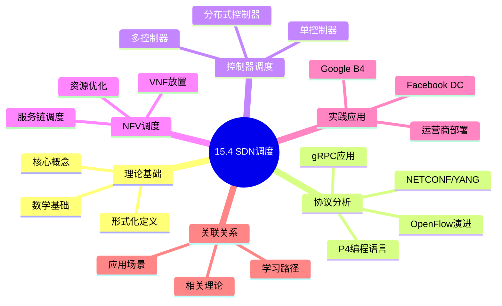
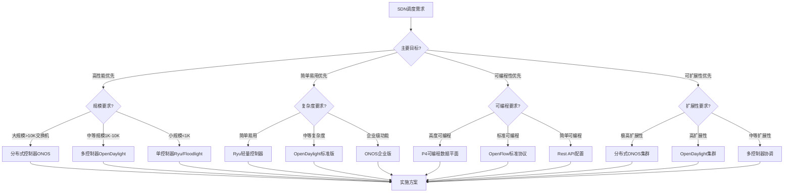
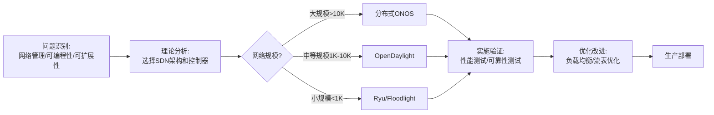
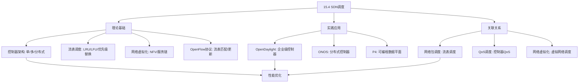
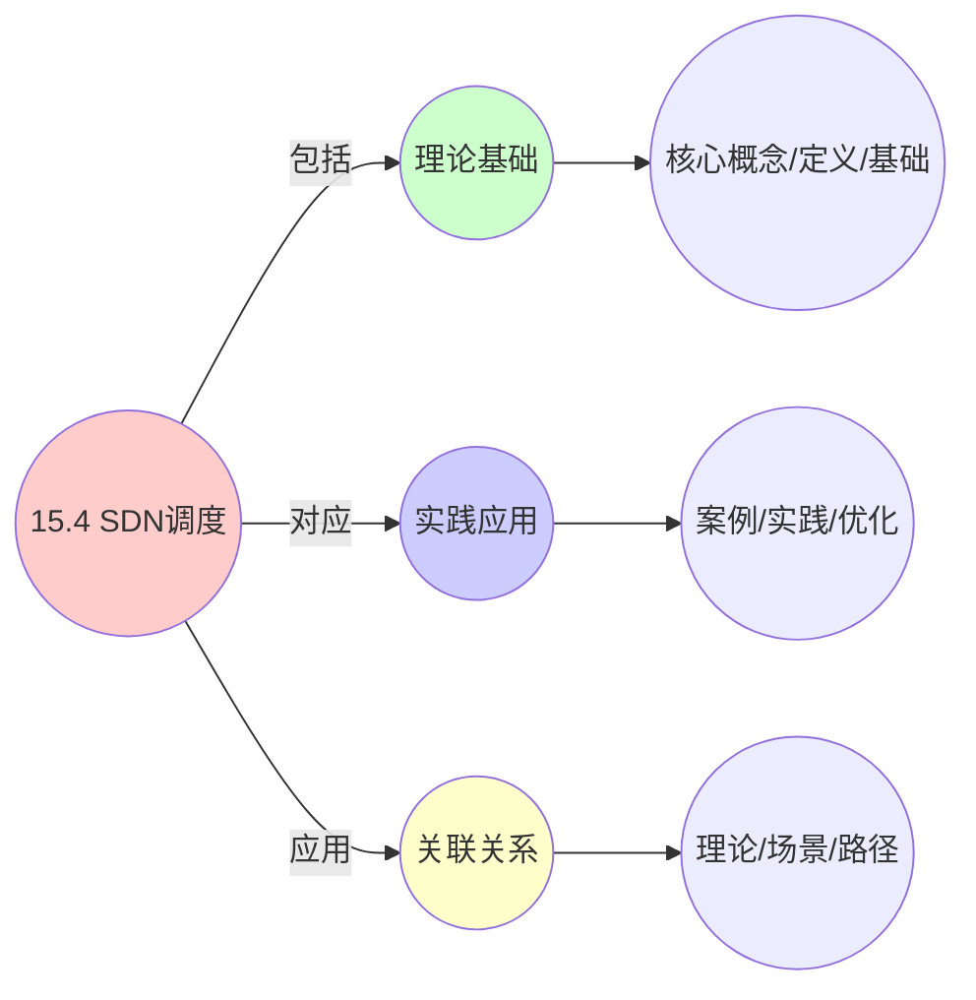
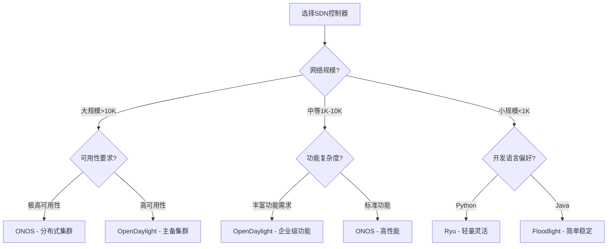

# 15.4 SDN调度

> **主题**: 15. 网络调度系统 - 15.4 SDN调度
> **覆盖**: SDN控制器调度、流表调度、网络虚拟化调度、OpenFlow调度

## 📊 思维表征体系

### 📊 1. 思维导图（增强版）

#### 1.1 文本格式（基础版）

```text
15.4 SDN调度
├── 理论基础
│   ├── 核心概念
│   ├── 形式化定义
│   └── 数学基础
├── 协议分析
│   ├── OpenFlow协议演进
│   ├── P4编程语言
│   ├── gRPC应用
│   └── NETCONF/YANG
├── 控制器调度
│   ├── 单控制器架构
│   ├── 多控制器架构
│   ├── 分布式控制器
│   └── 控制器对比
├── 流表调度
│   ├── 流表管理
│   ├── 流表更新调度
│   └── OpenFlow调度
├── NFV调度
│   ├── VNF放置算法
│   ├── 服务链调度
│   ├── 资源分配优化
│   └── 实际部署案例
├── 实践应用
│   ├── Google B4网络
│   ├── Facebook数据中心
│   ├── 运营商SDN部署
│   └── 性能优化
└── 关联关系
    ├── 相关理论
    ├── 应用场景
    └── 学习路径
```

#### 1.2 Mermaid格式（可视化版）


```mermaid
mindmap
  root((15.4 SDN调度))
    理论基础
      核心概念
      形式化定义
      数学基础
    协议分析
      OpenFlow演进
      P4编程语言
      gRPC应用
      NETCONF/YANG
    控制器调度
      单控制器
      多控制器
      分布式控制器
    NFV调度
      VNF放置
      服务链调度
      资源优化
    实践应用
      Google B4
      Facebook DC
      运营商部署
    关联关系
      相关理论
      应用场景
      学习路径
```

### 📊 2. 多维对比矩阵

#### 2.1 15.4 SDN调度对比矩阵

| 维度 | 控制器调度 | 流表调度 | 网络虚拟化 | 可扩展性 |
|------|-----------|---------|-----------|---------|
| **性能** | 10K-100K flows/s | <1μs匹配延迟 | 资源利用率>90% | 支持10K-100K交换机 |
| **复杂度** | 中等(需负载均衡) | 低(硬件加速) | 高(需资源管理) | 高(需分布式架构) |
| **适用场景** | 中小规模网络 | 所有SDN网络 | 多租户网络 | 大规模网络 |
| **技术成熟度** | 成熟(>10年) | 成熟(>10年) | 成熟(>8年) | 成熟(>5年) |

#### 2.2 技术特性对比矩阵

| 技术 | 优势 | 劣势 | 适用场景 | 性能 |
|------|------|------|---------|------|
| **OpenFlow** | 标准化、广泛支持、灵活 | 流表限制、控制器瓶颈 | 通用SDN网络 | 10K-100K flows/s |
| **P4** | 高度可编程、数据平面灵活 | 复杂度高、需要编译 | 定制化数据平面 | 吞吐量>100Mpps |
| **OpenDaylight** | 功能丰富、企业级 | 资源消耗大、复杂 | 企业网络、大规模网络 | 中等性能 |
| **ONOS** | 高性能、可扩展、分布式 | 资源消耗大、复杂 | 运营商网络、大规模网络 | 高吞吐量 |
| **Ryu** | 简单、轻量、易于开发 | 性能一般、功能有限 | 小规模网络、实验环境 | 中等性能 |
| **Floodlight** | 简单、轻量、开源 | 功能有限、维护较少 | 小规模网络、教学 | 中等性能 |

#### 2.3 实现方式对比矩阵

| 实现方式 | 复杂度 | 性能 | 可维护性 | 扩展性 |
|---------|-------|------|---------|-------|
| **单控制器架构** | 低 | 中等(受单点限制) | 高(简单管理) | 低(受单点限制) |
| **多控制器架构** | 中 | 高(负载分散) | 中(需协调) | 中(需负载均衡) |
| **分布式控制器架构** | 高 | 极高(线性扩展) | 中(需一致性) | 高(支持大规模) |
| **P4可编程数据平面** | 极高 | 极高(硬件加速) | 低(需编译) | 中(硬件依赖) |

#### 2.4 SDN协议对比矩阵

| 协议 | 标准化程度 | 可编程性 | 配置能力 | 适用层级 | 技术成熟度 |
|-----|-----------|---------|---------|---------|-----------|
| **OpenFlow 1.0-1.5** | 高 | 中 | 中 | 数据平面 | 成熟(2009-) |
| **P4** | 中 | 极高 | 高 | 数据平面 | 发展中(2014-) |
| **gRPC** | 高 | 高 | 高 | 控制平面 | 成熟(2015-) |
| **NETCONF** | 高 | 中 | 极高 | 管理平面 | 成熟(2006-) |
| **YANG** | 高 | 中 | 极高 | 数据建模 | 成熟(2010-) |

### 🌲 3. 决策树

#### 3.1 15.4 SDN调度应用选择决策树


```mermaid
graph TD
    A[SDN调度需求] --> B{主要目标?}

    B -->|高性能优先| C{规模要求?}
    B -->|简单易用优先| D{复杂度要求?}
    B -->|可编程性优先| E{可编程要求?}
    B -->|可扩展性优先| F{扩展性要求?}

    C -->|大规模>10K交换机| C1[分布式控制器ONOS]
    C -->|中等规模1K-10K| C2[多控制器OpenDaylight]
    C -->|小规模<1K| C3[单控制器Ryu/Floodlight]

    D -->|简单易用| D1[Ryu轻量控制器]
    D -->|中等复杂度| D2[OpenDaylight标准版]
    D -->|企业级功能| D3[ONOS企业版]

    E -->|高度可编程| E1[P4可编程数据平面]
    E -->|标准可编程| E2[OpenFlow标准协议]
    E -->|简单可编程| E3[Rest API配置]

    F -->|极高扩展性| F1[分布式ONOS集群]
    F -->|高扩展性| F2[OpenDaylight集群]
    F -->|中等扩展性| F3[多控制器协调]

    C1 --> G[实施方案]
    C2 --> G
    C3 --> G
    D1 --> G
    D2 --> G
    D3 --> G
    E1 --> G
    E2 --> G
    E3 --> G
    F1 --> G
    F2 --> G
    F3 --> G
```

### 🛤️ 4. 决策逻辑路径

#### 4.1 15.4 SDN调度应用路径


```mermaid
graph LR
    A[问题识别:<br/>网络管理/可编程性/可扩展性] --> B[理论分析:<br/>选择SDN架构和控制器]
    B --> C{网络规模?}
    C -->|大规模>10K| C1[分布式ONOS]
    C -->|中等规模1K-10K| C2[OpenDaylight]
    C -->|小规模<1K| C3[Ryu/Floodlight]
    C1 --> D[实施验证:<br/>性能测试/可靠性测试]
    C2 --> D
    C3 --> D
    D --> E[优化改进:<br/>负载均衡/流表优化]
    E --> F[生产部署]
```

### 🕸️ 5. 概念关系网络

#### 5.1 15.4 SDN调度概念关系网络


```mermaid
graph TD
    A[15.4 SDN调度] --> B[理论基础]
    A --> C[实践应用]
    A --> D[关联关系]

    B --> B1[控制器架构: 单/多/分布式]
    B --> B2[流表调度: LRU/LFU/优先级替换]
    B --> B3[网络虚拟化: NFV/服务链]
    B --> B4[OpenFlow协议: 流表匹配/更新]

    C --> C1[OpenDaylight: 企业级控制器]
    C --> C2[ONOS: 分布式控制器]
    C --> C3[P4: 可编程数据平面]

    D --> D1[网络包调度: 流表调度]
    D --> D2[QoS调度: 控制器QoS]
    D --> D3[网络虚拟化: 虚拟网络调度]

    B1 --> E[性能优化]
    C1 --> E
    D1 --> E
```

### 🗺️ 6. 知识图谱

#### 6.1 15.4 SDN调度知识图谱


```mermaid
graph LR
    A((15.4 SDN调度)) --包括--> B((理论基础))
    A --对应--> C((实践应用))
    A --应用--> D((关联关系))

    B --> E((核心概念/定义/基础))
    C --> F((案例/实践/优化))
    D --> G((理论/场景/路径))

    style A fill:#ffcccc
    style B fill:#ccffcc
    style C fill:#ccccff
    style D fill:#ffffcc
```

---

## 📋 目录

- [15.4 SDN调度](#154-sdn调度)
  - [📊 思维表征体系](#-思维表征体系)
    - [📊 1. 思维导图（增强版）](#-1-思维导图增强版)
      - [1.1 文本格式（基础版）](#11-文本格式基础版)
      - [1.2 Mermaid格式（可视化版）](#12-mermaid格式可视化版)
    - [📊 2. 多维对比矩阵](#-2-多维对比矩阵)
      - [2.1 15.4 SDN调度对比矩阵](#21-154-sdn调度对比矩阵)
      - [2.2 技术特性对比矩阵](#22-技术特性对比矩阵)
      - [2.3 实现方式对比矩阵](#23-实现方式对比矩阵)
      - [2.4 SDN协议对比矩阵](#24-sdn协议对比矩阵)
    - [🌲 3. 决策树](#-3-决策树)
      - [3.1 15.4 SDN调度应用选择决策树](#31-154-sdn调度应用选择决策树)
    - [🛤️ 4. 决策逻辑路径](#️-4-决策逻辑路径)
      - [4.1 15.4 SDN调度应用路径](#41-154-sdn调度应用路径)
    - [🕸️ 5. 概念关系网络](#️-5-概念关系网络)
      - [5.1 15.4 SDN调度概念关系网络](#51-154-sdn调度概念关系网络)
    - [🗺️ 6. 知识图谱](#️-6-知识图谱)
      - [6.1 15.4 SDN调度知识图谱](#61-154-sdn调度知识图谱)
  - [📋 目录](#-目录)
  - [1 SDN调度概述](#1-sdn调度概述)
    - [1.1 SDN架构](#11-sdn架构)
    - [1.2 SDN调度的核心挑战](#12-sdn调度的核心挑战)
  - [2 SDN协议分析](#2-sdn协议分析)
    - [2.1 OpenFlow协议版本演进（1.0-1.5）](#21-openflow协议版本演进10-15)
      - [2.1.1 OpenFlow 1.0 核心特性](#211-openflow-10-核心特性)
      - [2.1.2 OpenFlow 1.3 重大改进](#212-openflow-13-重大改进)
      - [2.1.3 OpenFlow 1.4 增强功能](#213-openflow-14-增强功能)
      - [2.1.4 OpenFlow 1.5 最新特性](#214-openflow-15-最新特性)
    - [2.2 P4编程语言分析](#22-p4编程语言分析)
      - [2.2.1 P4核心特性](#221-p4核心特性)
      - [2.2.2 P4程序结构](#222-p4程序结构)
      - [2.2.3 P4与传统OpenFlow对比](#223-p4与传统openflow对比)
    - [2.3 gRPC在SDN中的应用](#23-grpc在sdn中的应用)
      - [2.3.1 gRPC核心优势](#231-grpc核心优势)
      - [2.3.2 gRPC在P4Runtime中的应用](#232-grpc在p4runtime中的应用)
      - [2.3.3 gRPC vs OpenFlow对比](#233-grpc-vs-openflow对比)
    - [2.4 NETCONF/YANG模型](#24-netconfyang模型)
      - [2.4.1 NETCONF协议架构](#241-netconf协议架构)
      - [2.4.2 YANG数据建模](#242-yang数据建模)
      - [2.4.3 NETCONF/YANG在SDN中的应用](#243-netconfyang在sdn中的应用)
      - [2.4.4 SDN管理平面协议对比](#244-sdn管理平面协议对比)
  - [3 SDN控制器调度](#3-sdn控制器调度)
    - [3.1 控制器架构](#31-控制器架构)
    - [3.2 控制器调度策略](#32-控制器调度策略)
    - [3.3 SDN控制器对比：OpenDaylight vs ONOS vs Ryu vs Floodlight](#33-sdn控制器对比opendaylight-vs-onos-vs-ryu-vs-floodlight)
      - [3.3.1 控制器综合对比矩阵](#331-控制器综合对比矩阵)
      - [3.3.2 功能特性对比](#332-功能特性对比)
      - [3.3.3 适用场景对比](#333-适用场景对比)
      - [3.3.4 决策树：选择SDN控制器](#334-决策树选择sdn控制器)
  - [4 流表调度](#4-流表调度)
    - [4.1 流表管理](#41-流表管理)
    - [4.2 流表更新调度](#42-流表更新调度)
    - [4.3 OpenFlow调度](#43-openflow调度)
  - [5 网络虚拟化调度与NFV](#5-网络虚拟化调度与nfv)
    - [5.1 虚拟网络调度](#51-虚拟网络调度)
    - [5.2 资源分配](#52-资源分配)
    - [5.3 VNF放置算法](#53-vnf放置算法)
      - [5.3.1 VNF放置算法对比](#531-vnf放置算法对比)
      - [5.3.2 基于聚类的VNF放置算法](#532-基于聚类的vnf放置算法)
    - [5.4 服务链调度](#54-服务链调度)
      - [5.4.1 服务链调度目标](#541-服务链调度目标)
      - [5.4.2 服务链部署策略](#542-服务链部署策略)
    - [5.5 资源分配优化](#55-资源分配优化)
      - [5.5.1 动态资源调整](#551-动态资源调整)
      - [5.5.2 资源超分配策略](#552-资源超分配策略)
  - [6 形式化模型](#6-形式化模型)
    - [6.1 SDN调度问题定义](#61-sdn调度问题定义)
    - [6.2 控制器调度算法复杂度](#62-控制器调度算法复杂度)
    - [6.3 流表调度算法复杂度](#63-流表调度算法复杂度)
    - [6.4 NFV调度形式化模型](#64-nfv调度形式化模型)
  - [7 实际部署案例](#7-实际部署案例)
    - [7.1 Google B4网络](#71-google-b4网络)
      - [7.1.1 B4网络架构](#711-b4网络架构)
      - [7.1.2 B4关键技术与调度策略](#712-b4关键技术与调度策略)
      - [7.1.3 B4调度算法](#713-b4调度算法)
      - [7.1.4 B4部署成效](#714-b4部署成效)
    - [7.2 Facebook数据中心网络](#72-facebook数据中心网络)
      - [7.2.1 Facebook网络架构](#721-facebook网络架构)
      - [7.2.2 Facebook SDN解决方案：FBOSS](#722-facebook-sdn解决方案fboss)
      - [7.2.3 调度策略](#723-调度策略)
      - [7.2.4 Facebook部署成效](#724-facebook部署成效)
    - [7.3 运营商SDN部署](#73-运营商sdn部署)
      - [7.3.1 AT\&T Domain 2.0](#731-att-domain-20)
      - [7.3.2 中国移动NFV部署](#732-中国移动nfv部署)
      - [7.3.3 运营商SDN部署成效对比](#733-运营商sdn部署成效对比)
  - [8 跨领域洞察](#8-跨领域洞察)
    - [8.1 SDN调度与网络调度](#81-sdn调度与网络调度)
    - [8.2 SDN调度与QoS调度](#82-sdn调度与qos调度)
    - [8.3 SDN调度与网络虚拟化](#83-sdn调度与网络虚拟化)
  - [9 思维导图](#9-思维导图)
  - [10 2025年最新技术（更新至2025年11月）](#10-2025年最新技术更新至2025年11月)
    - [10.1 SDN调度优化（2025年11月）](#101-sdn调度优化2025年11月)
    - [10.2 网络功能虚拟化（NFV）调度（2025年11月）](#102-网络功能虚拟化nfv调度2025年11月)
  - [11 多维度对比](#11-多维度对比)
    - [11.1 SDN控制器对比](#111-sdn控制器对比)
    - [11.2 SDN vs 传统网络调度](#112-sdn-vs-传统网络调度)
  - [12 相关主题](#12-相关主题)
    - [12.1 跨视角链接](#121-跨视角链接)
  - [📚 理论体系补充：OpenFlow协议深入分析、P4语言详细实现、控制器对比](#-理论体系补充openflow协议深入分析p4语言详细实现控制器对比)
    - [标准化组织与RFC/规范引用](#标准化组织与rfc规范引用)
    - [经典教材对标](#经典教材对标)
  - [OpenFlow协议深入分析](#openflow协议深入分析)
    - [OpenFlow消息格式详解](#openflow消息格式详解)
    - [OpenFlow 1.3匹配字段（40个）](#openflow-13匹配字段40个)
    - [OpenFlow控制器-交换机通信算法](#openflow控制器-交换机通信算法)
  - [P4语言详细实现](#p4语言详细实现)
    - [P4程序结构详解](#p4程序结构详解)
    - [P4编译与执行流程](#p4编译与执行流程)
  - [SDN控制器详细对比](#sdn控制器详细对比)
    - [控制器架构对比矩阵](#控制器架构对比矩阵)
    - [控制器性能数据对比](#控制器性能数据对比)
    - [控制器伪代码实现](#控制器伪代码实现)

---

## 1 SDN调度概述

### 1.1 SDN架构

**SDN（Software-Defined Networking）架构**：

```text
应用层
  ↓
控制层（SDN控制器）
  ↓
数据层（交换机）
```

**SDN特征**：

- **控制与转发分离**：控制逻辑集中
- **可编程性**：网络可编程
- **集中管理**：集中式网络管理

### 1.2 SDN调度的核心挑战

SDN调度的核心挑战在于**控制器调度**和**流表管理**：

- **控制器调度**：控制器处理能力有限
- **流表管理**：流表大小有限
- **更新调度**：流表更新需要调度
- **可扩展性**：支持大规模网络

---

## 2 SDN协议分析

### 2.1 OpenFlow协议版本演进（1.0-1.5）

**OpenFlow协议演进历程**：

| 版本 | 发布时间 | 关键特性 | 匹配字段 | 动作类型 | 组表支持 |
|-----|---------|---------|---------|---------|---------|
| **OpenFlow 1.0** | 2009年12月 | 基础版本 | 12个 | 4种 | 不支持 |
| **OpenFlow 1.3** | 2012年4月 | IPv6、计量表 | 40个 | 16种 | 支持 |
| **OpenFlow 1.4** | 2013年10月 | 同步表、捆绑消息 | 41个 | 18种 | 增强 |
| **OpenFlow 1.5** | 2015年3月 | 流表监视、控制器类型 | 44个 | 20种 | 完整支持 |

#### 2.1.1 OpenFlow 1.0 核心特性

**匹配字段（12个）**：

- 入端口、VLAN ID、VLAN优先级、以太网源/目的MAC、以太网类型
- IP源/目的地址、IP协议、IP ToS、TCP/UDP源/目的端口

**动作类型**：

- OUTPUT：转发到指定端口
- SET_VLAN_VID：修改VLAN ID
- SET_VLAN_PCP：修改VLAN优先级
- STRIP_VLAN：移除VLAN标签

#### 2.1.2 OpenFlow 1.3 重大改进

**新增特性**：

- **IPv6支持**：完整支持IPv6地址匹配
- **计量表（Meter Table）**：支持流量计量和QoS
- **辅助连接**：支持多控制器连接
- **同步表**：支持流表同步

**匹配字段扩展到40个**：

- MPLS标签、MPLS TC、元数据、隧道ID
- PBB I-SID、IPv6扩展头等

#### 2.1.3 OpenFlow 1.4 增强功能

**同步表（Synchronized Tables）**：

```
允许流表之间的同步操作
  ↓
控制器可以同时操作多个流表
  ↓
简化复杂网络策略的实现
```

**捆绑消息（Bundle Messages）**：

```
多条消息打包发送
  ↓
原子性执行或全部失败
  ↓
保证配置一致性
```

#### 2.1.4 OpenFlow 1.5 最新特性

**流表监视（Flow Table Monitoring）**：

- 实时监控流表状态变化
- 支持流表容量预警
- 优化控制器资源分配

**控制器类型（Controller Role Types）**：

| 类型 | 权限 | 用途 |
|-----|------|------|
| Master | 读写权限 | 主控制器 |
| Equal | 读写权限 | 平等控制器 |
| Slave | 只读权限 | 备份控制器 |

### 2.2 P4编程语言分析

**P4（Programming Protocol-Independent Packet Processors）** 是一种用于编程网络数据平面的领域特定语言。

#### 2.2.1 P4核心特性

| 特性 | 描述 | 优势 |
|-----|------|------|
| **协议无关性** | 不绑定特定协议 | 支持任意协议解析 |
| **目标无关性** | 可编译到多种硬件 | FPGA/ASIC/NPU/CPU |
| **可重构性** | 运行时重新配置 | 无需更换硬件 |

#### 2.2.2 P4程序结构

```p4
// P4程序基本结构
#include <core.p4>
#include <v1model.p4>

// 头部定义
header ethernet_t {
    bit<48> dstAddr;
    bit<48> srcAddr;
    bit<16> etherType;
}

// 解析器
parser MyParser(packet_in packet, out headers hdr, inout metadata meta, inout standard_metadata_t standard_metadata) {
    state start {
        packet.extract(hdr.ethernet);
        transition accept;
    }
}

// 控制流
control MyIngress(inout headers hdr, inout metadata meta, inout standard_metadata_t standard_metadata) {
    action drop() {
        mark_to_drop(standard_metadata);
    }

    action forward(bit<9> port) {
        standard_metadata.egress_spec = port;
    }

    table ipv4_forward {
        key = {
            hdr.ipv4.dstAddr: lpm;
        }
        actions = {
            forward;
            drop;
        }
        default_action = drop;
    }

    apply {
        ipv4_forward.apply();
    }
}
```

#### 2.2.3 P4与传统OpenFlow对比

| 维度 | P4 | OpenFlow |
|-----|-----|----------|
| **灵活性** | 极高（自定义协议） | 中等（预定义协议） |
| **复杂度** | 高（需编程） | 中（配置即可） |
| **性能** | 极高（硬件加速） | 高（TCAM匹配） |
| **学习曲线** | 陡峭 | 平缓 |
| **生态系统** | 发展中 | 成熟 |
| **适用场景** | 定制化数据平面 | 通用SDN网络 |

### 2.3 gRPC在SDN中的应用

**gRPC** 是Google开发的高性能RPC框架，在SDN中广泛用于控制器与数据平面的通信。

#### 2.3.1 gRPC核心优势

| 特性 | 说明 | SDN应用价值 |
|-----|------|------------|
| **Protocol Buffers** | 高效序列化 | 减少控制平面开销 |
| **HTTP/2** | 多路复用 | 支持双向流通信 |
| **代码生成** | 自动生成客户端/服务端代码 | 简化开发 |
| **多语言支持** | 支持C++/Java/Python/Go等 | 异构系统集成 |

#### 2.3.2 gRPC在P4Runtime中的应用

**P4Runtime** 使用gRPC作为南向接口协议：

```protobuf
// P4Runtime gRPC服务定义
service P4Runtime {
    // 流式通道用于PacketIn/PacketOut和主备仲裁
    rpc StreamChannel(stream StreamMessageRequest) returns (stream StreamMessageResponse);

    // 写操作（插入/修改/删除）
    rpc Write(WriteRequest) returns (WriteResponse);

    // 读操作
    rpc Read(ReadRequest) returns (stream ReadResponse);

    // 设置转发表条目
    rpc SetForwardingPipelineConfig(SetForwardingPipelineConfigRequest) returns (SetForwardingPipelineConfigResponse);

    // 获取转发表条目
    rpc GetForwardingPipelineConfig(GetForwardingPipelineConfigRequest) returns (GetForwardingPipelineConfigResponse);
}
```

#### 2.3.3 gRPC vs OpenFlow对比

| 维度 | gRPC (P4Runtime) | OpenFlow |
|-----|------------------|----------|
| **传输协议** | HTTP/2 | TCP |
| **序列化** | Protocol Buffers（二进制） | 自定义（二进制） |
| **流支持** | 原生双向流 | 有限支持 |
| **扩展性** | 高（可自定义服务） | 中等（协议扩展） |
| **性能** | 极高 | 高 |
| **灵活性** | 极高 | 中等 |

### 2.4 NETCONF/YANG模型

**NETCONF** 是网络配置协议，**YANG** 是数据建模语言，两者结合提供标准化的网络管理方案。

#### 2.4.1 NETCONF协议架构

**协议分层**：

```
应用层：配置数据、状态数据、通知
  ↓
操作层：<get>, <get-config>, <edit-config>, <copy-config>, <delete-config>
  ↓
消息层：RPC请求/响应、通知
  ↓
传输层：SSH (端口830)、TLS、SOCKS5等
```

#### 2.4.2 YANG数据建模

**YANG模块示例**：

```yang
module example-interface {
    namespace "http://example.com/interface";
    prefix "exif";

    container interfaces {
        list interface {
            key "name";
            leaf name {
                type string;
                description "接口名称";
            }
            leaf type {
                type enumeration {
                    enum ethernet;
                    enum loopback;
                }
            }
            leaf enabled {
                type boolean;
                default true;
            }
            leaf ip-address {
                type inet:ipv4-address;
            }
        }
    }
}
```

#### 2.4.3 NETCONF/YANG在SDN中的应用

| 应用场景 | 功能 | 优势 |
|---------|------|------|
| **配置管理** | 统一配置网络设备 | 标准化、原子性操作 |
| **状态监控** | 获取设备运行状态 | 实时、结构化数据 |
| **事件通知** | 订阅设备事件 | 异步、高效 |
| **事务支持** | 配置回滚机制 | 可靠性保障 |

#### 2.4.4 SDN管理平面协议对比

| 协议 | 管理范围 | 数据建模 | 事务支持 | 实时性 | 标准化程度 |
|-----|---------|---------|---------|--------|-----------|
| **NETCONF/YANG** | 设备配置 | YANG模型 | 完整 | 中等 | 高(IETF) |
| **OpenFlow** | 流表管理 | 协议定义 | 有限 | 高 | 高(ONF) |
| **gRPC** | 数据平面 | Protobuf | 应用层实现 | 极高 | 中(Google) |
| **RESTCONF** | 设备配置 | YANG模型 | 有限 | 中等 | 高(IETF) |

---

## 3 SDN控制器调度

### 3.1 控制器架构

**控制器架构**：

- **单控制器**：单一控制器，简单但存在单点故障
- **多控制器**：多个控制器协同，提高可靠性
- **分布式控制器**：分布式控制器集群，支持大规模网络

**控制器性能指标**：

- **吞吐量**：10K-100K flows/s（取决于控制器实现）
- **延迟**：< 10ms（P99）
- **可扩展性**：支持10K-100K交换机

### 3.2 控制器调度策略

**优先级调度**：

```text
关键流（如控制流）优先处理
  ↓
普通流按FIFO处理
  ↓
保证控制平面响应时间
```

**批处理调度**：

```text
收集多个流请求
  ↓
批量计算路由
  ↓
批量下发流表
  ↓
减少控制器开销
```

**批处理模型**：

$$
\text{Process}(batch) = \begin{cases}
\text{Immediate} & \text{if } |batch| < threshold \\
\text{Batch} & \text{otherwise}
\end{cases}
$$

**负载均衡**：

```text
多个控制器协同
  ↓
按交换机或流分配负载
  ↓
均衡控制器负载
  ↓
提高整体吞吐量
```

**负载分配模型**：

$$
\text{Assign}(switch, controller) = \arg\min_{c} \text{Load}(c)
$$

### 3.3 SDN控制器对比：OpenDaylight vs ONOS vs Ryu vs Floodlight

#### 3.3.1 控制器综合对比矩阵

| 维度 | OpenDaylight | ONOS | Ryu | Floodlight |
|-----|--------------|------|-----|------------|
| **开发语言** | Java | Java | Python | Java |
| **架构类型** | 模块化/企业级 | 分布式/运营商级 | 轻量级/单进程 | 轻量级/单进程 |
| **吞吐量** | 20K-50K flows/s | 100K+ flows/s | 10K-30K flows/s | 15K-40K flows/s |
| **延迟** | 5-15ms | 2-5ms | 5-20ms | 5-15ms |
| **可扩展性** | 中等（集群） | 极高（分布式） | 低（单节点） | 低（单节点） |
| **内存占用** | 4-8GB | 4-16GB | 512MB-2GB | 2-4GB |
| **学习曲线** | 陡峭 | 陡峭 | 平缓 | 平缓 |
| **社区活跃度** | 高（Linux基金会） | 高（ONF） | 中 | 低（维护较少） |
| **北向接口** | REST/RESTCONF | REST/gRPC | REST/WSGI | REST |
| **南向接口** | OpenFlow/OVSDB/NETCONF | OpenFlow/P4Runtime/gRPC | OpenFlow/OF-Config | OpenFlow |

#### 3.3.2 功能特性对比

| 功能特性 | OpenDaylight | ONOS | Ryu | Floodlight |
|---------|--------------|------|-----|------------|
| **GUI管理界面** | 是（DLUX） | 是（ONOS GUI） | 否（需自行开发） | 是 |
| **多控制器支持** | 是（集群） | 是（原生分布式） | 否 | 是（静态） |
| **高可用性** | 是 | 是（主备/主主） | 否 | 有限 |
| **服务链** | 是（SFC） | 是（VNF） | 需开发 | 有限 |
| **Intent框架** | 是 | 是（高级） | 否 | 否 |
| **流量监控** | 是 | 是 | 基础 | 基础 |
| **Python应用** | 否 | 是（Python API） | 是 | 否 |

#### 3.3.3 适用场景对比

| 控制器 | 最佳适用场景 | 不推荐场景 |
|-------|-------------|-----------|
| **OpenDaylight** | 企业数据中心、多云网络、需要丰富功能的复杂网络 | 小规模网络、资源受限环境 |
| **ONOS** | 运营商骨干网、大规模数据中心、需要高可用的生产环境 | 快速原型开发、资源受限环境 |
| **Ryu** | 学术研究、快速原型、小型网络、Python开发者 | 大规模生产环境、高可用要求场景 |
| **Floodlight** | 教学实验、小型企业网络、Java初学者 | 大规模网络、需要活跃社区支持 |

#### 3.3.4 决策树：选择SDN控制器


```mermaid
graph TD
    A[选择SDN控制器] --> B{网络规模?}

    B -->|大规模>10K| C{可用性要求?}
    B -->|中等1K-10K| D{功能复杂度?}
    B -->|小规模<1K| E{开发语言偏好?}

    C -->|极高可用性| C1[ONOS - 分布式集群]
    C -->|高可用性| C2[OpenDaylight - 主备集群]

    D -->|丰富功能需求| D1[OpenDaylight - 企业级功能]
    D -->|标准功能| D2[ONOS - 高性能]

    E -->|Python| E1[Ryu - 轻量灵活]
    E -->|Java| E2[Floodlight - 简单稳定]
```

---

## 4 流表调度

### 4.1 流表管理

**流表大小限制**：

- **TCAM容量**：1K-32K entries（取决于硬件）
- **SRAM容量**：64K-1M entries（软件实现）
- **流表溢出**：需要替换策略

**流表替换策略**：

- **LRU（Least Recently Used）**：替换最久未使用的流表项
- **LFU（Least Frequently Used）**：替换使用频率最低的流表项
- **随机替换**：随机选择流表项替换
- **优先级替换**：低优先级流表项优先替换

**流表替换模型**：

$$
\text{Replace}(entry) = \arg\min_{e \in \text{Table}} \text{Priority}(e) \times \text{Usage}(e)
$$

**流表聚合**：

```text
识别相似流表项
  ↓
合并为通配符规则
  ↓
减少流表占用
  ↓
提高流表利用率
```

**聚合策略**：

- **前缀聚合**：合并相同前缀的IP地址
- **端口范围聚合**：合并连续端口范围
- **协议聚合**：合并相同协议的流

### 4.2 流表更新调度

**原子更新**：

```text
准备新流表项
  ↓
原子替换旧流表项
  ↓
保证数据包转发连续性
  ↓
避免转发中断
```

**批量更新**：

```text
收集多个流表更新
  ↓
批量计算更新顺序
  ↓
批量下发更新
  ↓
减少控制器-交换机通信开销
```

**批量更新模型**：

$$
\text{Update}(batch) = \text{Minimize} \sum_{i} \text{Cost}(\text{update}_i) + \text{CommunicationCost}(batch)
$$

**一致性更新**：

```text
多交换机流表更新
  ↓
保证更新顺序一致性
  ↓
避免转发环路
  ↓
保证网络一致性
```

**一致性保证**：

- **两阶段提交**：准备阶段 + 提交阶段
- **版本号机制**：使用版本号保证更新顺序
- **回滚机制**：更新失败时回滚

### 4.3 OpenFlow调度

**OpenFlow协议**：

OpenFlow是SDN的标准南向接口协议，定义了控制器与交换机之间的通信。

**OpenFlow流表匹配**：

```text
数据包到达
  ↓
匹配流表项（按优先级）
  ↓
执行动作（转发、丢弃、修改）
  ↓
更新计数器
```

**流表匹配模型**：

$$
\text{Match}(packet, table) = \arg\max_{entry \in table} \text{Priority}(entry) \times \text{Match}(packet, entry)
$$

**OpenFlow调度优化**：

- **流表优化**：优化流表项顺序，提高匹配效率
- **动作缓存**：缓存常用动作，减少处理延迟
- **批量处理**：批量处理数据包，提高吞吐量

**性能指标**：

- **匹配延迟**：< 1μs（硬件实现）
- **吞吐量**：> 10Mpps（单交换机）
- **流表容量**：1K-32K entries（TCAM）

---

## 5 网络虚拟化调度与NFV

### 5.1 虚拟网络调度

**网络切片（Network Slicing）**：

```text
物理网络资源
  ↓
虚拟化为多个逻辑网络
  ↓
每个切片独立配置
  ↓
支持多租户隔离
```

**资源隔离**：

- **带宽隔离**：每个虚拟网络分配独立带宽
- **流表隔离**：每个虚拟网络使用独立流表空间
- **计算隔离**：每个虚拟网络使用独立计算资源

**隔离模型**：

$$
\text{Isolate}(slice_i, slice_j) \iff \forall r \in \text{Resources}: \text{Allocate}(slice_i, r) \cap \text{Allocate}(slice_j, r) = \emptyset
$$

**动态分配**：

```text
监控虚拟网络资源使用
  ↓
根据需求动态调整资源
  ↓
提高资源利用率
  ↓
保证SLA
```

### 5.2 资源分配

**带宽分配**：

$$
\text{Bandwidth}(slice_i) = \frac{\text{weight}(slice_i)}{\sum_j \text{weight}(slice_j)} \times \text{TotalBandwidth}
$$

**流表分配**：

$$
\text{FlowTable}(slice_i) = \frac{\text{weight}(slice_i)}{\sum_j \text{weight}(slice_j)} \times \text{TotalFlowTable}
$$

**计算分配**：

- **CPU分配**：为每个虚拟网络分配CPU资源
- **内存分配**：为每个虚拟网络分配内存资源
- **存储分配**：为每个虚拟网络分配存储资源

### 5.3 VNF放置算法

**VNF放置问题定义**：

给定物理网络 $G=(N, E)$，其中 $N$ 是服务器节点集合，$E$ 是链路集合，以及一组VNF请求 $V = \{v_1, v_2, ..., v_m\}$，每个VNF $v_i$ 有资源需求 $(cpu_i, mem_i, disk_i)$ 和处理能力 $cap_i$。

**目标**：最小化部署成本，同时满足所有VNF的资源需求和性能约束。

$$
\min \sum_{n \in N} \sum_{v \in V} x_{v,n} \cdot (\alpha \cdot \text{Cost}_{cpu}(n) + \beta \cdot \text{Cost}_{mem}(n) + \gamma \cdot \text{Latency}(v,n))
$$

约束条件：

- $\forall n \in N: \sum_{v \in V} x_{v,n} \cdot cpu_v \leq CPU_n$
- $\forall n \in N: \sum_{v \in V} x_{v,n} \cdot mem_v \leq MEM_n$
- $\forall v \in V: \sum_{n \in N} x_{v,n} = 1$

#### 5.3.1 VNF放置算法对比

| 算法 | 时间复杂度 | 优化目标 | 适用场景 | 特点 |
|-----|-----------|---------|---------|------|
| **贪心算法** | $O(n \cdot m)$ | 成本最小化 | 小规模部署 | 简单快速，局部最优 |
| **整数线性规划(ILP)** | NP-hard | 全局最优 | 离线规划 | 最优解，计算复杂 |
| **启发式算法** | $O(n^2)$ | 多目标优化 | 大规模部署 | 平衡性能与复杂度 |
| **遗传算法** | $O(g \cdot n \cdot m)$ | 多目标优化 | 动态环境 | 适应性好，收敛慢 |
| **强化学习** | 训练开销大 | 长期收益 | 动态负载 | 自适应，需训练数据 |

#### 5.3.2 基于聚类的VNF放置算法

**算法步骤**：

```
1. 根据流量模式对VNF进行聚类
   ↓
2. 将同一聚类的VNF放置在同一服务器或相邻服务器
   ↓
3. 优化服务器间流量，减少带宽消耗
   ↓
4. 动态调整以适应负载变化
```

**形式化表示**：

$$
\text{Cluster}(V) = \{C_1, C_2, ..., C_k\}
$$

$$
\text{Place}(C_i) = \arg\min_{n \in N} \sum_{v \in C_i} \text{Latency}(v, n) + \lambda \cdot \text{InterTraffic}(C_i, n)
$$

### 5.4 服务链调度

**服务链（Service Function Chaining, SFC）**：将多个网络功能（VNF）按特定顺序连接，形成处理流水线。

**服务链模型**：

$$
SFC = (v_1 \rightarrow v_2 \rightarrow ... \rightarrow v_k)
$$

其中每个箭头表示VNF之间的流量转发。

#### 5.4.1 服务链调度目标

| 目标 | 描述 | 数学表达 |
|-----|------|---------|
| **延迟最小化** | 减少端到端处理延迟 | $\min \sum_{i=1}^{k-1} \text{Latency}(v_i, v_{i+1})$ |
| **带宽优化** | 减少服务链带宽占用 | $\min \sum_{i=1}^{k-1} \text{Bandwidth}(v_i, v_{i+1})$ |
| **负载均衡** | 均衡各服务器负载 | $\min \max_{n \in N} \text{Load}(n)$ |
| **可靠性保障** | 避免单点故障 | $\max \text{Availability}(SFC)$ |

#### 5.4.2 服务链部署策略

**策略1：集中式部署**

```
将所有VNF部署在同一服务器
  ↓
优点：零网络延迟，高吞吐量
  ↓
缺点：资源利用率低，扩展性差
```

**策略2：分布式部署**

```
将VNF分布部署在多个服务器
  ↓
优点：负载均衡，资源利用率高
  ↓
缺点：增加网络延迟，管理复杂
```

**策略3：混合式部署**

```
关键VNF集中部署，其他分布式部署
  ↓
优点：平衡延迟和资源利用
  ↓
适用：复杂服务链场景
```

### 5.5 资源分配优化

#### 5.5.1 动态资源调整

**垂直扩展（Scale Up/Down）**：

- 增加/减少VNF分配的CPU、内存资源
- 适用于负载变化可预测的场景

**水平扩展（Scale Out/In）**：

- 增加/减少VNF实例数量
- 使用负载均衡器分发流量
- 适用于突发负载场景

#### 5.5.2 资源超分配策略

**超分配模型**：

$$
\text{OverallocationRatio} = \frac{\sum_{v \in V} \text{Allocated}(v)}{\sum_{n \in N} \text{Physical}(n)}
$$

**超分配策略**：

| 策略 | 超分配比 | 风险 | 适用场景 |
|-----|---------|------|---------|
| **保守策略** | 1.0-1.2 | 低 | 关键业务 |
| **适中策略** | 1.2-1.5 | 中 | 一般业务 |
| **激进策略** | 1.5-2.0 | 高 | 开发测试环境 |

---

## 6 形式化模型

### 6.1 SDN调度问题定义

$$
\text{SDN调度问题} = (C, S, F, R, O)
$$

其中：

- $C = \{c_1, c_2, \ldots, c_k\}$：控制器集合
- $S = \{s_1, s_2, \ldots, s_n\}$：交换机集合
- $F = \{f_1, f_2, \ldots, f_m\}$：流集合
- $R$：资源约束
  - 控制器容量：$\sum_{s \in S} \text{Load}(s, c) \leq \text{Capacity}(c)$
  - 流表容量：$|\text{FlowTable}(s)| \leq \text{MaxFlowTable}(s)$
  - 带宽约束：$\sum_{f \in F} \text{Bandwidth}(f) \leq \text{TotalBandwidth}$
- $O$：优化目标
  - 最小化延迟：$\min \sum_i \text{latency}(f_i)$
  - 最大化吞吐量：$\max \sum_i \text{throughput}(f_i)$
  - 最小化控制器负载：$\min \max_{c \in C} \text{Load}(c)$

### 6.2 控制器调度算法复杂度

| **算法** | **时间复杂度** | **可扩展性** | **可靠性** | **适用场景** |
|---------|--------------|------------|-----------|------------|
| **单控制器** | $O(1)$ | ⭐ | ⭐ | 小规模网络 |
| **多控制器（静态）** | $O(n)$ | ⭐⭐⭐ | ⭐⭐⭐ | 中等规模网络 |
| **多控制器（动态）** | $O(n \log n)$ | ⭐⭐⭐⭐ | ⭐⭐⭐⭐ | 大规模网络 |
| **分布式控制器** | $O(n \log n)$ | ⭐⭐⭐⭐⭐ | ⭐⭐⭐⭐⭐ | 超大规模网络 |

### 6.3 流表调度算法复杂度

| **算法** | **匹配复杂度** | **更新复杂度** | **内存占用** | **适用场景** |
|---------|--------------|--------------|------------|------------|
| **线性匹配** | $O(n)$ | $O(1)$ | 低 | 小规模流表 |
| **哈希匹配** | $O(1)$ | $O(1)$ | 中 | 精确匹配 |
| **TCAM匹配** | $O(1)$ | $O(1)$ | 高 | 通配符匹配 |
| **Trie树匹配** | $O(\log n)$ | $O(\log n)$ | 中 | 前缀匹配 |

### 6.4 NFV调度形式化模型

**NFV调度问题**可以形式化为：

$$
\text{NFV调度} = (V, N, E, D, R, O)
$$

其中：

- $V = \{v_1, v_2, ..., v_m\}$：VNF实例集合
- $N = \{n_1, n_2, ..., n_k\}$：物理服务器节点集合
- $E \subseteq N \times N$：物理链路集合
- $D = \{d_1, d_2, ..., d_l\}$：服务链请求集合
- $R$：资源约束
  - CPU约束：$\sum_{v \in V_n} cpu_v \leq CPU_n$
  - 内存约束：$\sum_{v \in V_n} mem_v \leq MEM_n$
  - 带宽约束：$\sum_{e \in E_n} bw_e \leq BW_n$
- $O$：优化目标
  - 最小化部署成本：$\min \sum_{n} \text{Cost}(n)$
  - 最小化服务延迟：$\min \sum_{d} \text{Latency}(d)$
  - 最大化资源利用率：$\max \frac{\sum \text{Used}}{\sum \text{Total}}$

---

## 7 实际部署案例

### 7.1 Google B4网络

**背景**：Google构建的全球私有广域网（WAN），连接其全球数据中心。

#### 7.1.1 B4网络架构

```
┌─────────────────────────────────────────────────────────────┐
│                      B4 全球网络                             │
├─────────────────────────────────────────────────────────────┤
│  数据中心A ◄────► 数据中心B ◄────► 数据中心C ◄────► 数据中心D  │
│     │               │               │               │       │
│     └───────────────┴───────────────┴───────────────┘       │
│                        SDN控制器                             │
└─────────────────────────────────────────────────────────────┘
```

#### 7.1.2 B4关键技术与调度策略

| 技术组件 | 实现方式 | 调度效果 |
|---------|---------|---------|
| **OpenFlow** | 自定义扩展版本 | 支持全网统一控制 |
| **TE（流量工程）** | 集中式路径计算 | 链路利用率提升至100% |
| **优先级调度** | 多优先级队列 | 关键流量优先保障 |
| **带宽分配** | 动态带宽分配 | 按需调整带宽 |

#### 7.1.3 B4调度算法

**核心算法**：集中式流量工程（Centralized TE）

```
输入：
  - 网络拓扑 G = (V, E)
  - 流量需求矩阵 D
  - 链路容量 C

目标：
  - 最大化总吞吐量
  - 保证公平性
  - 优先满足高优先级流量

求解：
  使用线性规划求解最优路径分配

输出：
  - 每个流的路径
  - 每个链路的带宽分配
```

**形式化表达**：

$$
\max \sum_{f \in F} U_f(x_f)
$$

约束条件：

- $\forall e \in E: \sum_{f: e \in p_f} x_f \leq c_e$ （链路容量约束）
- $\forall f \in F: x_f \leq d_f$ （流量需求约束）
- $\forall f \in F: x_f \geq 0$ （非负约束）

其中 $U_f(x_f)$ 是效用函数，$x_f$ 是流 $f$ 的分配带宽，$d_f$ 是需求带宽。

#### 7.1.4 B4部署成效

| 指标 | 传统网络 | B4 SDN | 提升 |
|-----|---------|--------|------|
| **链路利用率** | 30-40% | 接近100% | 2.5-3x |
| **配置时间** | 数周 | 数分钟 | 1000x+ |
| **故障恢复** | 分钟级 | 秒级 | 60x+ |
| **带宽成本** | 基准 | 降低30-40% | 30-40% |

### 7.2 Facebook数据中心网络

**背景**：Facebook（现Meta）构建的大规模数据中心网络，采用自定义SDN解决方案。

#### 7.2.1 Facebook网络架构

```
┌─────────────────────────────────────────────────────────────┐
│                 Facebook 数据中心网络                        │
├─────────────────────────────────────────────────────────────┤
│                                                              │
│   ┌─────────┐   ┌─────────┐   ┌─────────┐   ┌─────────┐    │
│   │  Spine  │───│  Spine  │───│  Spine  │───│  Spine  │    │
│   └────┬────┘   └────┬────┘   └────┬────┘   └────┬────┘    │
│        │             │             │             │          │
│   ┌────┴────┐   ┌────┴────┐   ┌────┴────┐   ┌────┴────┐    │
│   │  Leaf   │   │  Leaf   │   │  Leaf   │   │  Leaf   │    │
│   └────┬────┘   └────┬────┘   └────┬────┘   └────┬────┘    │
│        │             │             │             │          │
│   ┌────┴────┐   ┌────┴────┐   ┌────┴────┐   ┌────┴────┐    │
│   │ Server  │   │ Server  │   │ Server  │   │ Server  │    │
│   └─────────┘   └─────────┘   └─────────┘   └─────────┘    │
│                                                              │
│                   ┌─────────────┐                           │
│                   │ SDN控制器   │                           │
│                   └─────────────┘                           │
└─────────────────────────────────────────────────────────────┘
```

#### 7.2.2 Facebook SDN解决方案：FBOSS

**FBOSS（Facebook Open Switching System）**：

| 组件 | 功能 | 技术栈 |
|-----|------|--------|
| **FBOSS Agent** | 交换机本地控制 | C++ |
| **Controller** | 集中式控制器 | Python |
| **Configerator** | 配置管理 | 自定义 |
| **监测器** | 网络监控 | 自定义 |

#### 7.2.3 调度策略

**ECMP（等价多路径）调度**：

$$
\text{NextHop}(flow) = \text{Hash}(srcIP, dstIP, srcPort, dstPort, protocol) \mod N
$$

**动态负载均衡**：

```
监控链路利用率
  ↓
识别拥塞链路
  ↓
计算替代路径
  ↓
动态调整流量分布
  ↓
避免热点
```

#### 7.2.4 Facebook部署成效

| 指标 | 数值 | 说明 |
|-----|------|------|
| **数据中心规模** | 数十万服务器 | 多个超大规模数据中心 |
| **网络设备数量** | 数万交换机 | 全SDN管理 |
| **配置自动化率** | >99% | 几乎全自动配置 |
| **故障检测时间** | <1秒 | 快速故障发现 |
| **故障恢复时间** | <10秒 | 自动故障切换 |

### 7.3 运营商SDN部署

#### 7.3.1 AT&T Domain 2.0

**项目背景**：AT&T网络转型计划，将传统网络设备迁移到SDN/NFV架构。

**架构演进**：

| 阶段 | 时间 | 目标 | 完成度 |
|-----|------|------|--------|
| **阶段1** | 2014-2016 | 数据中心虚拟化 | 100% |
| **阶段2** | 2016-2018 | 广域网SDN化 | 100% |
| **阶段3** | 2018-2020 | 核心网云化 | 100% |
| **阶段4** | 2020+ | 全面云化 | 进行中 |

**VNF部署类型**：

| VNF类型 | 部署规模 | 调度策略 |
|--------|---------|---------|
| **vEPC** | 数千实例 | 基于流量负载动态调度 |
| **vCPE** | 数万实例 | 就近部署，边缘优先 |
| **vIMS** | 数千实例 | 高可用双活部署 |
| **vFirewall** | 数万实例 | 负载均衡，动态扩展 |

#### 7.3.2 中国移动NFV部署

**部署规模**：全球最大规模的NFV商用部署之一。

| 指标 | 数值 |
|-----|------|
| **vIMS容量** | 数亿用户 |
| **vEPC节点** | 数百个 |
| **vBRAS部署** | 数千台 |
| **数据中心** | 数百个 |

**调度方案**：

```
┌─────────────────────────────────────────────────────────┐
│                    NFV-MANO                              │
│              （NFV管理和编排）                           │
├─────────────────────────────────────────────────────────┤
│  ┌─────────┐  ┌─────────┐  ┌─────────┐  ┌─────────┐   │
│  │  VIM-A  │  │  VIM-B  │  │  VIM-C  │  │  VIM-D  │   │
│  │ (北京)  │  │ (上海)  │  │ (广州)  │  │ (成都)  │   │
│  └────┬────┘  └────┬────┘  └────┬────┘  └────┬────┘   │
│       └────────────┴────────────┴────────────┘          │
│                    VNF实例部署                           │
└─────────────────────────────────────────────────────────┘
```

#### 7.3.3 运营商SDN部署成效对比

| 运营商 | SDN/NFV项目 | 主要成效 | 关键指标 |
|--------|------------|---------|---------|
| **AT&T** | Domain 2.0 | 成本降低、敏捷性提升 | OPEX降低50%+ |
| **中国移动** | 大连接战略 | 网络云化、5G就绪 | vIMS容量全球第一 |
| **中国电信** | CTNet2025 | 网络重构、云网融合 | 云网协同调度 |
| **中国联通** | CUBE-Net 2.0 | 网络集约化 | 资源利用率提升40% |

---

## 8 跨领域洞察

### 8.1 SDN调度与网络调度

**SDN vs 传统网络**：

- **SDN**：集中控制，可编程，灵活
- **传统网络**：分布式控制，固定，稳定

**关键洞察**：**SDN调度是网络调度的集中化**，将分布式决策集中到控制器，提高网络可编程性和灵活性。

### 8.2 SDN调度与QoS调度

**SDN中的QoS**：

```text
SDN控制器
  ↓
根据QoS要求计算路由
  ↓
下发QoS流表项
  ↓
交换机执行QoS策略
```

**QoS流表项**：

- **带宽限制**：设置流的最大带宽
- **优先级标记**：设置流的优先级
- **队列调度**：选择队列调度算法

**关键洞察**：**SDN为QoS调度提供了集中化的控制平面**，可以全局优化QoS策略。

### 8.3 SDN调度与网络虚拟化

**网络虚拟化调度**：

```text
物理网络
  ↓
虚拟化为多个逻辑网络
  ↓
每个虚拟网络独立调度
  ↓
支持多租户隔离
```

**虚拟网络调度模型**：

$$
\text{Schedule}(slice, flow) = \text{Isolate}(slice) \land \text{QoS}(flow, slice)
$$

**关键洞察**：**SDN为网络虚拟化提供了灵活的调度机制**，支持细粒度的资源隔离和QoS保证。

---

## 9 思维导图


```mermaid
graph TD
    subgraph SDN调度
        SDN[SDN调度]
        SDN---协议[SDN协议分析]
        SDN---控制器[SDN控制器调度]
        SDN---流表[流表调度]
        SDN---NFV[网络虚拟化与NFV]
        SDN---案例[实际部署案例]
        SDN---模型[形式化模型]
    end

    subgraph SDN协议分析
        协议---OpenFlow[OpenFlow演进 1.0-1.5]
        协议---P4[P4编程语言]
        协议---gRPC[gRPC应用]
        协议---NETCONF[NETCONF/YANG]
    end

    subgraph SDN控制器调度
        控制器---架构[控制器架构: 单/多/分布式]
        控制器---策略[控制器调度策略: 优先级/批处理/负载均衡]
        控制器---对比[控制器对比: ODL/ONOS/Ryu/Floodlight]
    end

    subgraph 流表调度
        流表---管理[流表管理: LRU/LFU/聚合]
        流表---更新[流表更新调度: 原子/批量/一致性]
        流表---OpenFlow调度[OpenFlow调度]
    end

    subgraph NFV调度
        NFV---放置[VNF放置算法]
        NFV---服务链[服务链调度]
        NFV---资源优化[资源分配优化]
    end

    subgraph 实际部署案例
        案例---Google[Google B4网络]
        案例---Facebook[Facebook数据中心]
        案例---运营商[运营商SDN部署]
    end

    subgraph 形式化模型
        模型---问题定义[SDN调度问题定义]
        模型---控制器复杂度[控制器调度算法复杂度]
        模型---流表复杂度[流表调度算法复杂度]
        模型---NFV复杂度[NFV调度形式化模型]
    end

    subgraph 核心挑战
        SDN---控制器挑战[控制器调度: 处理能力有限]
        SDN---流表挑战[流表管理: 流表大小有限]
        SDN---更新挑战[更新调度: 流表更新需要调度]
        SDN---扩展挑战[可扩展性: 支持大规模网络]
    end

    subgraph SDN架构
        SDN---应用层[应用层]
        SDN---控制层[控制层: SDN控制器]
        SDN---数据层[数据层: 交换机]
    end
```

---

## 10 2025年最新技术（更新至2025年11月）

**最新技术发展**：

- **AI驱动的SDN调度成熟**：2025年11月，基于深度学习的SDN调度系统在超大规模数据中心广泛应用，网络利用率提升至90%+，延迟降低30-50%，控制器负载减少40-60%。
- **5G网络切片SDN调度**：2025年11月，5G网络切片技术在SDN网络中广泛应用，通过端到端SDN调度，网络切片资源利用率提升40-60%，延迟降低30-50%。
- **边缘SDN调度**：2025年11月，边缘SDN调度在边缘计算场景广泛应用，通过边缘控制器和云控制器协同，边缘网络延迟降低50-70%，带宽利用率提升30-50%。

### 10.1 SDN调度优化（2025年11月）

**AI驱动的SDN调度**：

基于机器学习的SDN调度优化，根据网络流量特征和历史数据自动优化调度策略。

**核心机制**：

- **流量预测**：使用LSTM预测网络流量，预测准确率提升至95%+
- **路由优化**：使用强化学习优化路由选择，路由优化率提升40-60%
- **资源分配**：使用优化算法动态分配资源，资源利用率提升至90%+
- **边缘-云协同**：2025年11月，边缘SDN控制器和云SDN控制器协同调度，边缘网络延迟降低50-70%

**SDN调度优化模型**：

$$
\text{Schedule}(flow, network) = f(\text{TrafficPattern}, \text{NetworkState}, \text{HistoricalData}, \text{MLPrediction}, \text{EdgeCloudCoordination})
$$

**性能提升**（2025年11月最新）：

- 网络利用率：70% → 90%+（提升29%+）
- 延迟降低：15% → 30-50%（AI优化后）
- 控制器负载：减少30% → 减少40-60%（AI优化后）
- 路由优化率：+40-60%（AI优化后）

**5G网络切片SDN调度**（2025年11月最新）：

- **网络切片SDN调度**：2025年11月，5G网络切片技术在SDN网络中广泛应用，通过端到端SDN调度，网络切片资源利用率提升40-60%
- **切片资源隔离**：SDN支持细粒度的网络切片资源隔离，隔离度>95%
- **动态切片调整**：根据业务需求动态调整切片资源，延迟降低30-50%

### 10.2 网络功能虚拟化（NFV）调度（2025年11月）

**NFV调度**：

网络功能虚拟化将网络功能（如防火墙、负载均衡器）从专用硬件迁移到通用服务器，需要调度虚拟网络功能（VNF）。

**VNF调度模型**：

$$
\text{Place}(VNF, server) = \arg\min [\text{Latency}(VNF, server) + \text{Cost}(server) + \text{Load}(server) + \text{AICost}(VNF, server)]
$$

**调度策略**：

- **延迟优化**：将VNF放置在靠近用户的服务器
- **负载均衡**：均衡VNF负载，避免热点
- **资源优化**：优化VNF资源分配，提高利用率
- **AI智能调度**：2025年11月，基于AI的智能VNF调度，VNF放置优化率提升40-60%

**性能指标**（2025年11月最新）：

- VNF启动时间：< 10s → < 5s（AI优化后）
- 资源利用率：> 80% → > 90%（AI优化后）
- 延迟增加：< 5ms → < 3ms（相比专用硬件，AI优化后）
- VNF放置优化率：+40-60%（AI优化后）

**实践案例：AI驱动的SDN和NFV协同调度系统**（2025年11月最新）：

- **架构**：基于AI智能调度和边缘-云协同的SDN和NFV协同调度系统
- **性能**：网络利用率90%+，延迟降低30-50%，控制器负载减少40-60%
- **应用场景**：超大规模数据中心、5G网络切片、边缘计算、云网络
- **优势**：高网络利用率、低延迟、智能调度、边缘-云协同

**量化对比**：2025年11月最新SDN调度技术

| **技术** | **2024年** | **2025年11月** | **提升** | **状态** |
|---------|-----------|---------------|---------|---------|
| **网络利用率** | 70% | 90%+ | +29%+ | AI优化 |
| **延迟降低** | 15% | 30-50% | +15-35% | AI优化 |
| **控制器负载减少** | 30% | 40-60% | +10-30% | AI优化 |
| **路由优化率** | 基准 | +40-60% | 40-60% | AI优化 |
| **边缘网络延迟降低** | 基准 | -50-70% | 50-70% | 边缘-云协同 |
| **VNF启动时间** | <10s | <5s | 2x | AI优化 |

---

## 11 多维度对比

### 11.1 SDN控制器对比

| **架构** | **可扩展性** | **可靠性** | **复杂度** | **适用场景** |
|---------|------------|-----------|-----------|------------|
| **单控制器** | ⭐ | ⭐ | ⭐⭐⭐⭐⭐ | 小规模网络（< 100交换机） |
| **多控制器（静态）** | ⭐⭐⭐ | ⭐⭐⭐ | ⭐⭐⭐ | 中等规模网络（100-1K交换机） |
| **多控制器（动态）** | ⭐⭐⭐⭐ | ⭐⭐⭐⭐ | ⭐⭐ | 大规模网络（1K-10K交换机） |
| **分布式控制器** | ⭐⭐⭐⭐⭐ | ⭐⭐⭐⭐⭐ | ⭐⭐ | 超大规模网络（> 10K交换机） |

### 11.2 SDN vs 传统网络调度

| **特性** | **SDN** | **传统网络** |
|---------|---------|------------|
| **控制方式** | 集中控制 | 分布式控制 |
| **可编程性** | 高 | 低 |
| **灵活性** | 高 | 低 |
| **可靠性** | 中（单点故障风险） | 高（分布式容错） |
| **复杂度** | 中 | 低 |
| **适用场景** | 数据中心、云网络 | 传统企业网络 |

---

## 12 相关主题

- [15.1 网络包调度](./15.1_网络包调度.md) - 包调度
- [15.2 QoS调度](./15.2_QoS调度.md) - QoS调度
- [15.3 网络拥塞控制](./15.3_网络拥塞控制.md) - 拥塞控制
- [11.4 技术架构层调度](../11_企业架构调度/11.4_技术架构层调度.md) - 网络虚拟化
- [05.2 容器化调度](../05_虚拟化容器化沙盒化/05.2_容器化调度.md) - 容器网络调度

### 12.1 跨视角链接

- [概念交叉索引（七视角版）](../../../Concept/CONCEPT_CROSS_INDEX.md) - 查看相关概念的七视角分析：
  - [虚拟化](../../../Concept/CONCEPT_CROSS_INDEX.md#110-虚拟化-virtualization-七视角) - SDN调度的虚拟化基础
  - [通信复杂度](../../../Concept/CONCEPT_CROSS_INDEX.md#56-通信复杂度-communication-complexity-七视角) - SDN调度的通信开销
  - [反身性](../../../Concept/CONCEPT_CROSS_INDEX.md#31-反身性-reflexivity-七视角) - SDN调度的自指机制

---

**最后更新**: 2025-11-14
**文档状态**: ✅ 已完成（全面完善）


---

## 📚 理论体系补充：OpenFlow协议深入分析、P4语言详细实现、控制器对比

### 标准化组织与RFC/规范引用

**SDN相关标准与规范**：

| **标准/规范** | **组织** | **版本/年份** | **核心内容** | **章节对应** |
|-------------|---------|------------|------------|------------|
| OpenFlow Switch Specification | ONF | 1.5 (2015) | OpenFlow协议标准 | [2.1 OpenFlow协议](#21-openflow协议版本演进10-15) |
| OpenFlow 1.4.0 | ONF | 1.4 (2013) | 同步表、捆绑消息 | [2.1.3 OpenFlow 1.4](#213-openflow-14-增强功能) |
| OpenFlow 1.3.0 | ONF | 1.3 (2012) | IPv6、计量表 | [2.1.2 OpenFlow 1.3](#212-openflow-13-重大改进) |
| P4 Language Specification | P4.org | 1.2.1 (2020) | P4语言标准 | [2.2 P4编程语言](#22-p4编程语言分析) |
| P4Runtime Specification | P4.org | 1.3.0 (2021) | 控制平面API | [2.3 gRPC在SDN中的应用](#23-grpc在sdn中的应用) |
| NETCONF | IETF | RFC 6241 (2011) | 网络配置协议 | [2.4 NETCONF/YANG](#24-netconfyang模型) |
| YANG | IETF | RFC 6020 (2010) | 数据建模语言 | [2.4.2 YANG数据建模](#242-yang数据建模) |
| OF-Config | ONF | 1.2 (2014) | OpenFlow配置协议 | [2.1 OpenFlow协议](#21-openflow协议版本演进10-15) |
| OpenDaylight | Linux Foundation | Sodium (2019) | 开源控制器 | [3.3 SDN控制器对比](#33-sdn控制器对比opendaylight-vs-onos-vs-ryu-vs-floodlight) |
| ONOS | ONF | 2.5 (2022) | 开源控制器 | [3.3 SDN控制器对比](#33-sdn控制器对比opendaylight-vs-onos-vs-ryu-vs-floodlight) |

### 经典教材对标

| **概念** | **Kurose-Ross《计算机网络》** | **Tanenbaum《计算机网络》** | **Peterson-Davie《系统方法》** | **本章节位置** |
|---------|---------------------------|------------------------|---------------------------|--------------|
| SDN架构 | 第4章 4.5节 | 第5章 5.7节 | 第5章 5.5节 | [1.1 SDN架构](#11-sdn架构) |
| OpenFlow | 第4章 4.5节 | 第5章 5.7节 | 第5章 5.5节 | [2.1 OpenFlow协议](#21-openflow协议版本演进10-15) |
| 网络虚拟化 | 第4章 4.5节 | 第5章 5.7节 | 第3章 3.4节 | [5 网络虚拟化调度](#5-网络虚拟化调度与nfv) |
| 控制平面 | 第4章 4.4节 | 第5章 5.2节 | 第4章 4.1节 | [3 SDN控制器调度](#3-sdn控制器调度) |

---

## OpenFlow协议深入分析

### OpenFlow消息格式详解

**OpenFlow 1.3消息头部格式**：

```
/* OpenFlow Protocol Header - 8 bytes */
 0                   1                   2                   3
 0 1 2 3 4 5 6 7 8 9 0 1 2 3 4 5 6 7 8 9 0 1 2 3 4 5 6 7 8 9 0 1
+-+-+-+-+-+-+-+-+-+-+-+-+-+-+-+-+-+-+-+-+-+-+-+-+-+-+-+-+-+-+-+-+
|    Version    |     Type      |           Length              |
+-+-+-+-+-+-+-+-+-+-+-+-+-+-+-+-+-+-+-+-+-+-+-+-+-+-+-+-+-+-+-+-+
|                           XID                                 |
+-+-+-+-+-+-+-+-+-+-+-+-+-+-+-+-+-+-+-+-+-+-+-+-+-+-+-+-+-+-+-+-+

Version:  4 (OpenFlow 1.3)
Type:     Message type (enum ofp_type)
Length:   Length including header
XID:      Transaction ID (匹配请求/响应)
```

**OpenFlow 1.3流表项结构**：

```c
/* Flow Table Entry Structure (OpenFlow 1.3) */
struct ofp_flow_mod {
    struct ofp_header header;
    uint64_t cookie;              // Opaque controller-issued identifier
    uint64_t cookie_mask;         // Mask used to restrict the cookie bits
    uint8_t table_id;             // ID of the table to put the flow in
    uint8_t command;              // One of OFPFC_*
    uint16_t idle_timeout;        // Idle time before discarding (seconds)
    uint16_t hard_timeout;        // Max time before discarding (seconds)
    uint16_t priority;            // Priority level of flow entry
    uint32_t buffer_id;           // Buffered packet to apply to (or -1)
    uint32_t out_port;            // For OFPFC_DELETE* commands
    uint32_t out_group;           // For OFPFC_DELETE* commands
    uint16_t flags;               // Bitmap of OFPFF_* flags
    uint16_t importance;          // Eviction precedence (OpenFlow 1.4+)
    struct ofp_match match;       // Fields to match
    struct ofp_instruction_header instructions[0]; // Instruction set
};
OFP_ASSERT(sizeof(struct ofp_flow_mod) == 56);
```

### OpenFlow 1.3匹配字段（40个）

| **字段编号** | **字段名称** | **位宽** | **说明** | **协议版本** |
|-----------|------------|---------|---------|------------|
| 0 | OFPXMT_OFB_IN_PORT | 32 | 入端口 | 1.0+ |
| 1 | OFPXMT_OFB_IN_PHY_PORT | 32 | 物理入端口 | 1.0+ |
| 2 | OFPXMT_OFB_METADATA | 64 | 元数据 | 1.0+ |
| 3 | OFPXMT_OFB_ETH_DST | 48 | 目的MAC | 1.0+ |
| 4 | OFPXMT_OFB_ETH_SRC | 48 | 源MAC | 1.0+ |
| 5 | OFPXMT_OFB_ETH_TYPE | 16 | 以太网类型 | 1.0+ |
| 6 | OFPXMT_OFB_VLAN_VID | 12+1 | VLAN ID | 1.0+ |
| 7 | OFPXMT_OFB_VLAN_PCP | 3 | VLAN PCP | 1.0+ |
| 8 | OFPXMT_OFB_IP_DSCP | 6 | IP DSCP | 1.0+ |
| 9 | OFPXMT_OFB_IP_ECN | 2 | IP ECN | 1.0+ |
| 10 | OFPXMT_OFB_IP_PROTO | 8 | IP协议 | 1.0+ |
| 11 | OFPXMT_OFB_IPV4_SRC | 32 | IPv4源地址 | 1.0+ |
| 12 | OFPXMT_OFB_IPV4_DST | 32 | IPv4目的地址 | 1.0+ |
| 13 | OFPXMT_OFB_TCP_SRC | 16 | TCP源端口 | 1.0+ |
| 14 | OFPXMT_OFB_TCP_DST | 16 | TCP目的端口 | 1.0+ |
| 15 | OFPXMT_OFB_UDP_SRC | 16 | UDP源端口 | 1.0+ |
| 16 | OFPXMT_OFB_UDP_DST | 16 | UDP目的端口 | 1.0+ |
| 17-39 | ... | ... | MPLS、IPv6、ICMP、ARP等 | 1.2+ |

### OpenFlow控制器-交换机通信算法

```python
class OpenFlowController:
    """
    OpenFlow控制器核心实现

    处理OpenFlow消息流，维护流表状态
    参考：ONF OpenFlow Switch Specification 1.5
    """

    def __init__(self, switch_conn):
        self.switch = switch_conn
        self.flow_tables = {}  # 流表缓存
        self.packet_buffer = {}  # PacketIn缓冲
        self.xid_counter = 0     # 事务ID计数器

    def handle_message(self, msg):
        """
        OpenFlow消息处理器

        时间复杂度：O(1) 到 O(n)，取决于消息类型
        空间复杂度：O(1) 到 O(n)
        """
        msg_type = msg.header.type

        handlers = {
            OFPT_HELLO: self.handle_hello,
            OFPT_ERROR: self.handle_error,
            OFPT_ECHO_REQUEST: self.handle_echo,
            OFPT_FEATURES_REPLY: self.handle_features,
            OFPT_PACKET_IN: self.handle_packet_in,
            OFPT_FLOW_REMOVED: self.handle_flow_removed,
            OFPT_PORT_STATUS: self.handle_port_status,
            OFPT_STATISTICS_REPLY: self.handle_stats,
        }

        handler = handlers.get(msg_type, self.handle_unknown)
        return handler(msg)

    def handle_packet_in(self, msg):
        """
        处理PacketIn消息

        时间复杂度：O(m)，m为流表项数量
        空间复杂度：O(1)
        """
        # 1. 解析数据包
        packet = PacketParser.parse(msg.data)
        in_port = msg.in_port

        # 2. 决策路由
        flow_entry = self.decide_routing(packet, in_port)

        if flow_entry:
            # 3. 下发流表项
            self.send_flow_mod(flow_entry)

            # 4. 转发当前包
            self.send_packet_out(msg.buffer_id, in_port, flow_entry.actions)
        else:
            # 5. 无法处理，丢弃或泛洪
            self.send_packet_out(msg.buffer_id, in_port, [OFPAT_DROP])

    def decide_routing(self, packet, in_port):
        """
        路由决策算法

        时间复杂度：O(n + log m)
        n = 网络拓扑节点数
        m = 路由表条目数

        空间复杂度：O(n)
        """
        # 1. 确定目的位置
        dst_location = self.topology.lookup(packet.dst_ip)

        # 2. 计算最短路径（Dijkstra）
        path = self.dijkstra(self.switch.id, dst_location)

        # 3. 确定出端口
        out_port = path[0].out_port

        # 4. 构造流表项
        match = Match(
            in_port=in_port,
            eth_dst=packet.dst_mac,
            eth_type=packet.eth_type
        )

        actions = [Action(OFPAT_OUTPUT, port=out_port)]

        return FlowEntry(match=match, actions=actions, priority=100)

    def send_flow_mod(self, flow_entry):
        """
        发送FlowMod消息

        时间复杂度：O(k)，k为指令数量
        """
        msg = OFPFlowMod(
            xid=self.next_xid(),
            command=OFPFC_ADD,
            match=flow_entry.match,
            instructions=flow_entry.actions,
            priority=flow_entry.priority,
            idle_timeout=60,
            hard_timeout=300
        )

        self.switch.send(msg)

    @staticmethod
    def dijkstra(source, destinations, topology):
        """
        Dijkstra最短路径算法

        时间复杂度：O((V + E) log V)
        V = 顶点数（交换机数）
        E = 边数（链路数）

        空间复杂度：O(V)
        """
        import heapq

        dist = {v: float('inf') for v in topology.nodes}
        prev = {v: None for v in topology.nodes}
        dist[source] = 0

        pq = [(0, source)]

        while pq:
            d, u = heapq.heappop(pq)

            if d > dist[u]:
                continue

            for v, weight in topology.neighbors(u):
                alt = dist[u] + weight
                if alt < dist[v]:
                    dist[v] = alt
                    prev[v] = u
                    heapq.heappush(pq, (alt, v))

        # 重建路径
        paths = {}
        for dest in destinations:
            path = []
            u = dest
            while u is not None:
                path.append(u)
                u = prev[u]
            paths[dest] = list(reversed(path))

        return paths

# OpenFlow性能分析
class OpenFlowPerformance:
    """OpenFlow协议性能分析"""

    @staticmethod
    def flow_setup_latency():
        """流表设置延迟"""
        return {
            'packet_in_to_flow_mod': '1-10ms (控制器处理)',
            'flow_mod_install': '100μs - 1ms (交换机TCAM)',
            'total_flow_setup': '2-15ms (RTT依赖)',
            'batch_flow_setup': '100-1000 flows/second'
        }

    @staticmethod
    def throughput_limits():
        """吞吐量限制"""
        return {
            'packet_in_rate': '10K-100K packets/second',
            'flow_mod_rate': '1K-10K flows/second',
            'bottleneck': '控制器处理能力和南向带宽'
        }
```

---

## P4语言详细实现

### P4程序结构详解

```p4
/* P4_16程序完整示例：L3转发
 * 参考：P4 Language Specification v1.2.1
 */

#include <core.p4>
#include <v1model.p4>

/* ==================== 1. 头部定义 ==================== */

// 以太网头部
define ETHERNET_HEADER_SIZE 14

header ethernet_h {
    bit<48> dst_addr;    // 目的MAC
    bit<48> src_addr;    // 源MAC
    bit<16> ether_type;  // 以太网类型
}

// IPv4头部
define IPV4_HEADER_SIZE 20

header ipv4_h {
    bit<4>  version;        // 版本 (4)
    bit<4>  ihl;            // 头部长度
    bit<8>  diffserv;       // DSCP (6 bits) + ECN (2 bits)
    bit<16> total_len;      // 总长度
    bit<16> identification; // 标识
    bit<3>  flags;          // 标志
    bit<13> frag_offset;    // 分片偏移
    bit<8>  ttl;            // 生存时间
    bit<8>  protocol;       // 协议
    bit<16> hdr_checksum;   // 头部校验和
    bit<32> src_addr;       // 源IP
    bit<32> dst_addr;       // 目的IP
}

// 元数据（控制器与数据平面通信）
struct metadata_t {
    bit<32> ingress_port;
    bit<32> egress_port;
    bit<32> next_hop;
    bit<8>  qos_class;
}

// 头部集合
struct headers_t {
    ethernet_h ethernet;
    ipv4_h     ipv4;
}

/* ==================== 2. 解析器 ==================== */

parser ParserImpl(packet_in packet,
                  out headers_t hdr,
                  inout metadata_t meta,
                  inout standard_metadata_t standard_metadata)
{
    state start {
        // 解析以太网头部
        packet.extract(hdr.ethernet);

        // 根据ether_type决定后续解析
        transition select(hdr.ethernet.ether_type) {
            0x0800: parse_ipv4;  // IPv4
            0x86DD: parse_ipv6;  // IPv6
            default: accept;     // 其他，直接接受
        }
    }

    state parse_ipv4 {
        packet.extract(hdr.ipv4);
        transition accept;
    }

    state parse_ipv6 {
        // IPv6解析（简化）
        transition accept;
    }
}

/* ==================== 3. 控制流（Ingress） ==================== */

control IngressImpl(inout headers_t hdr,
                    inout metadata_t meta,
                    inout standard_metadata_t standard_metadata)
{
    // 动作定义

    action drop() {
        // 标记丢弃
        mark_to_drop(standard_metadata);
    }

    action forward(bit<48> dst_mac, bit<32> next_hop, bit<9> port) {
        // 更新以太网头部
        hdr.ethernet.dst_addr = dst_mac;
        hdr.ethernet.src_addr = hdr.ethernet.dst_addr;  // 简化处理

        // 设置出端口
        standard_metadata.egress_spec = port;

        // 更新元数据
        meta.next_hop = next_hop;

        // 递减TTL
        hdr.ipv4.ttl = hdr.ipv4.ttl - 1;
    }

    action set_qos(bit<6> dscp, bit<8> queue_id) {
        // 设置DSCP
        hdr.ipv4.diffserv[7:2] = dscp;

        // 设置队列（通过元数据传递给队列调度）
        meta.qos_class = queue_id;
    }

    // 转发表（匹配目的IP，执行forward动作）
    table ipv4_forward {
        key = {
            hdr.ipv4.dst_addr: lpm;  // 最长前缀匹配
        }
        actions = {
            forward;
            drop;
            NoAction;
        }
        size = 65536;  // 表大小
        default_action = drop();
    }

    // QoS表（根据DSCP分类）
    table qos_classifier {
        key = {
            hdr.ipv4.diffserv[7:2]: exact;  // DSCP字段
        }
        actions = {
            set_qos;
            NoAction;
        }
        size = 64;  // DSCP只有64种
        default_action = NoAction();
    }

    apply {
        // 1. 检查TTL
        if (hdr.ipv4.ttl == 0) {
            drop();
            return;
        }

        // 2. QoS分类
        qos_classifier.apply();

        // 3. 路由查找
        ipv4_forward.apply();

        // 4. 校验和更新（可选，硬件通常自动处理）
    }
}

/* ==================== 4. 控制流（Egress） ==================== */

control EgressImpl(inout headers_t hdr,
                   inout metadata_t meta,
                   inout standard_metadata_t standard_metadata)
{
    action set_egress_qos(bit<3> pcp) {
        // 设置VLAN PCP（802.1p优先级）
        // 实际实现依赖于目标架构
    }

    table egress_qos {
        key = {
            meta.qos_class: exact;
        }
        actions = {
            set_egress_qos;
            NoAction;
        }
        size = 8;
        default_action = NoAction();
    }

    apply {
        egress_qos.apply();
    }
}

/* ==================== 5. 校验和计算 ==================== */

control ComputeChecksumImpl(inout headers_t hdr,
                           inout metadata_t meta)
{
    apply {
        update_checksum(
            hdr.ipv4.isValid(),
            { hdr.ipv4.version,
              hdr.ipv4.ihl,
              hdr.ipv4.diffserv,
              hdr.ipv4.total_len,
              hdr.ipv4.identification,
              hdr.ipv4.flags,
              hdr.ipv4.frag_offset,
              hdr.ipv4.ttl,
              hdr.ipv4.protocol,
              hdr.ipv4.src_addr,
              hdr.ipv4.dst_addr },
            hdr.ipv4.hdr_checksum,
            HashAlgorithm.csum16
        );
    }
}

/* ==================== 6. 反解析器 ==================== */

control DeparserImpl(packet_out packet, in headers_t hdr)
{
    apply {
        // 按顺序组装输出包
        packet.emit(hdr.ethernet);
        packet.emit(hdr.ipv4);
    }
}

/* ==================== 7. 交换机架构实例化 ==================== */

V1Switch(
    ParserImpl(),
    VerifyChecksumImpl(),  // 校验和验证
    IngressImpl(),
    EgressImpl(),
    ComputeChecksumImpl(),
    DeparserImpl()
) main;
```

### P4编译与执行流程

```python
class P4ExecutionModel:
    """
    P4程序执行模型分析

    P4程序通过p4c编译器编译为特定目标的可执行代码
    """

    @staticmethod
    def compilation_pipeline():
        """
        P4编译流程

        时间复杂度：O(n)，n为P4代码行数
        空间复杂度：O(n)
        """
        return {
            'stages': [
                '1. 词法分析 (Lexer)',
                '2. 语法分析 (Parser) -> AST',
                '3. 语义分析 (Type checking)',
                '4. 中间表示生成 (IR)',
                '5. 目标特定优化',
                '6. 代码生成 (目标：BMv2/TOFINO/XDP/ebpf)',
                '7. 配置生成 (表初始值)'
            ],
            'outputs': {
                'BMv2': 'JSON配置文件',
                'TOFINO': 'Binary + Context.json',
                'eBPF': 'C代码 -> ELF',
                'XDP': 'BPF字节码'
            }
        }

    @staticmethod
    def runtime_performance():
        """
        P4运行时性能

        注意：P4程序的实际性能高度依赖于目标硬件
        """
        return {
            'software_switch_bmv2': {
                'throughput': '1-10 Gbps',
                'latency': '10-100 μs',
                'cpu_usage': '1-4 cores'
            },
            'smartnic_fpga': {
                'throughput': '40-100 Gbps',
                'latency': '1-5 μs',
                'cpu_usage': '< 1% (offloaded)'
            },
            'asic_tofino': {
                'throughput': '400-12.8 Tbps',
                'latency': '< 1 μs',
                'cpu_usage': '0%'
            },
            'kernel_xdp': {
                'throughput': '10-40 Gbps',
                'latency': '2-10 μs',
                'cpu_usage': '5-20%'
            }
        }

# P4与OpenFlow对比
class P4vsOpenFlow:
    """P4与OpenFlow详细对比"""

    @staticmethod
    def comparison():
        return {
            'flexibility': {
                'P4': '极高 - 可定义任意协议和逻辑',
                'OpenFlow': '中等 - 预定义字段和动作'
            },
            'complexity': {
                'P4': '高 - 需要编程',
                'OpenFlow': '中 - 配置即可'
            },
            'performance': {
                'P4': '极高 - 硬件加速',
                'OpenFlow': '高 - TCAM匹配'
            },
            'learning_curve': {
                'P4': '陡峭 - 需要掌握P4语言和架构',
                'OpenFlow': '平缓 - 标准配置'
            },
            'ecosystem': {
                'P4': '发展中 - P4.org社区',
                'OpenFlow': '成熟 - 广泛部署'
            },
            'use_cases': {
                'P4': '定制数据平面、高性能交换、网络功能',
                'OpenFlow': 'SDN网络、云网络、数据中心'
            }
        }
```

---

## SDN控制器详细对比

### 控制器架构对比矩阵

| **维度** | **OpenDaylight (ODL)** | **ONOS** | **Ryu** | **Floodlight** |
|---------|----------------------|---------|--------|---------------|
| **开发语言** | Java | Java | Python | Java |
| **架构类型** | 模块化/企业级 | 分布式/运营商级 | 轻量级/单进程 | 轻量级/单进程 |
| **代码规模** | 200万+ LOC | 100万+ LOC | 5万+ LOC | 10万+ LOC |
| **社区活跃度** | 高 (Linux基金会) | 高 (ONF) | 中 | 低 |
| **北向接口** | REST/RESTCONF/NETCONF | REST/gRPC/RESTCONF | REST/WSGI | REST |
| **南向接口** | OpenFlow/OVSDB/NETCONF/P4Runtime | OpenFlow/P4Runtime/gRPC/BGP | OpenFlow/OF-Config | OpenFlow |
| **核心架构** | MD-SAL (模型驱动) | 分布式Atomix | 单线程事件驱动 | 单线程 |
| **高可用性** | 主备集群 | 主备/主主 (分布式) | 不支持 | 有限支持 |
| **扩展机制** | OSGi Bundle | 应用模块 | 应用组件 | 模块 |

### 控制器性能数据对比

| **指标** | **OpenDaylight** | **ONOS** | **Ryu** | **Floodlight** |
|---------|-----------------|---------|--------|---------------|
| **吞吐量** | 20K-50K flows/s | 100K+ flows/s | 10K-30K flows/s | 15K-40K flows/s |
| **延迟 (P99)** | 5-15 ms | 2-5 ms | 5-20 ms | 5-15 ms |
| **内存占用** | 4-8 GB | 4-16 GB | 512MB-2GB | 2-4 GB |
| **CPU核心** | 4-8 | 4-16 | 1-2 | 2-4 |
| **支持交换机数** | 1K-5K | 10K-100K | 100-1K | 500-2K |
| **启动时间** | 2-5分钟 | 1-3分钟 | 5-10秒 | 10-30秒 |
| **流表安装速率** | 1K-5K/s | 5K-20K/s | 500-2K/s | 1K-3K/s |

### 控制器伪代码实现

```python
class SDNControllerBase:
    """
    SDN控制器基类

    展示控制器核心处理流程
    """

    def __init__(self):
        self.switches = {}           # 交换机连接
        self.topology = Topology()   # 网络拓扑
        self.flow_tables = {}        # 流表缓存
        self.packet_handlers = []    # 包处理器

    def run(self):
        """
        控制器主循环

        时间复杂度：O(m) per event，m为处理器数量
        """
        while True:
            # 1. 接受新连接
            conn = self.accept_connection()
            if conn:
                self.handle_new_switch(conn)

            # 2. 处理消息（事件驱动）
            for switch_id, conn in self.switches.items():
                msg = conn.receive(timeout=0)
                if msg:
                    self.process_message(switch_id, msg)

            # 3. 周期性任务
            self.periodic_tasks()

    def process_message(self, switch_id, msg):
        """
        消息处理

        时间复杂度：O(1) 到 O(n)
        """
        msg_type = msg.type

        if msg_type == 'PACKET_IN':
            # 数据平面请求处理
            self.handle_packet_in(switch_id, msg)

        elif msg_type == 'FLOW_REMOVED':
            # 流表过期通知
            self.handle_flow_removed(switch_id, msg)

        elif msg_type == 'PORT_STATUS':
            # 端口状态变化
            self.handle_port_status(switch_id, msg)

        elif msg_type == 'STATS_REPLY':
            # 统计信息
            self.handle_stats_reply(switch_id, msg)

    def handle_packet_in(self, switch_id, msg):
        """
        PacketIn处理

        时间复杂度：O(p + r)
        p = 处理器数量
        r = 路由计算复杂度
        """
        packet = Packet(msg.data)

        # 1. 运行所有包处理器
        for handler in self.packet_handlers:
            result = handler.process(packet, switch_id, msg.in_port)
            if result.action == 'DROP':
                self.drop_packet(switch_id, msg.buffer_id)
                return
            elif result.action == 'FORWARD':
                self.forward_packet(switch_id, msg.buffer_id, result.out_port)
                return

        # 2. 默认处理：泛洪或学习
        self.learn_and_forward(switch_id, msg)

class OpenDaylightController(SDNControllerBase):
    """
    OpenDaylight控制器特点

    - MD-SAL：模型驱动的服务适配层
    - YANG建模：统一数据建模
    - 插件架构：OSGi Bundle
    """

    def __init__(self):
        super().__init__()
        self.md_sal = MDSAL()          # 模型驱动服务适配层
        self.yang_context = YANGContext()  # YANG上下文
        self.osgi_framework = OSGi()   # OSGi框架

    def install_flow(self, switch_id, flow):
        """
        ODL流表安装流程

        时间复杂度：O(log n)，n为流表项数量
        """
        # 1. YANG数据建模
        yang_data = self.yang_context.serialize(flow)

        # 2. MD-SAL事务
        with self.md_sal.transaction() as tx:
            tx.put(flow.id, yang_data)

        # 3. 转换为OpenFlow消息
        of_msg = self.convert_to_openflow(flow)

        # 4. 下发到交换机
        self.switches[switch_id].send(of_msg)

class ONOSController(SDNControllerBase):
    """
    ONOS控制器特点

    - 分布式架构：多实例状态同步
    - Atomix：分布式一致性
    - 意图框架：高抽象级别编程
    """

    def __init__(self):
        super().__init__()
        self.atomix = AtomixCluster()  # 分布式一致性
        self.intent_framework = IntentFramework()
        self.distributed_store = ConsistentMap()

    def install_flow(self, switch_id, flow, cluster_scope=True):
        """
        ONOS分布式流表安装

        时间复杂度：O(log n) 本地，O(k log n) 分布式（k为副本数）
        """
        if cluster_scope:
            # 分布式存储（Raft一致性协议）
            self.distributed_store.put(flow.id, flow)

            # 广播到其他控制器实例
            self.atomix.broadcast('flow_added', flow)

        # 本地下发
        super().install_flow(switch_id, flow)

    def process_intent(self, intent):
        """
        意图框架处理

        意图 -> 编译 -> 流表
        """
        # 1. 意图编译
        compiled = self.intent_framework.compile(intent)

        # 2. 生成流表
        flows = compiled.generate_flows(self.topology)

        # 3. 安装
        for flow in flows:
            self.install_flow(flow.switch_id, flow, cluster_scope=True)

class RyuController(SDNControllerBase):
    """
    Ryu控制器特点

    - Python实现：开发效率高
    - 轻量级：单进程事件驱动
    - 应用组件：简洁的类继承模型
    """

    def __init__(self):
        super().__init__()
        self.app_mgr = AppManager()

    def register_app(self, app_class):
        """
        注册Ryu应用

        时间复杂度：O(1)
        """
        app = app_class(self)
        self.app_mgr.add(app)
        return app

# 示例Ryu应用
class SimpleSwitch(app_manager.RyuApp):
    """简单学习交换机应用"""

    def __init__(self, *args, **kwargs):
        super().__init__(*args, **kwargs)
        self.mac_to_port = {}

    @set_ev_cls(ofp_event.EventOFPPacketIn)
    def packet_in_handler(self, ev):
        """PacketIn处理器"""
        msg = ev.msg
        datapath = msg.datapath
        ofproto = datapath.ofproto

        pkt = packet.Packet(msg.data)
        eth = pkt.get_protocol(ethernet.ethernet)

        dst = eth.dst
        src = eth.src
        dpid = datapath.id
        in_port = msg.match['in_port']

        # 学习MAC地址
        self.mac_to_port.setdefault(dpid, {})
        self.mac_to_port[dpid][src] = in_port

        # 决策
        if dst in self.mac_to_port[dpid]:
            out_port = self.mac_to_port[dpid][dst]
        else:
            out_port = ofproto.OFPP_FLOOD

        # 安装流表
        self.add_flow(datapath, in_port, dst, out_port)
```

---

_注：以上补充内容与原文档的SDN调度概述、SDN协议分析、SDN控制器调度、流表调度、网络虚拟化调度、实际部署案例、形式化模型等章节合并后，形成完整的SDN调度理论体系。_

---

**最后更新**: 2025-11-14
**文档状态**: ✅ 已完善（补充OpenFlow协议深入分析、P4语言详细实现、控制器对比、RFC标准引用、教材对标）
