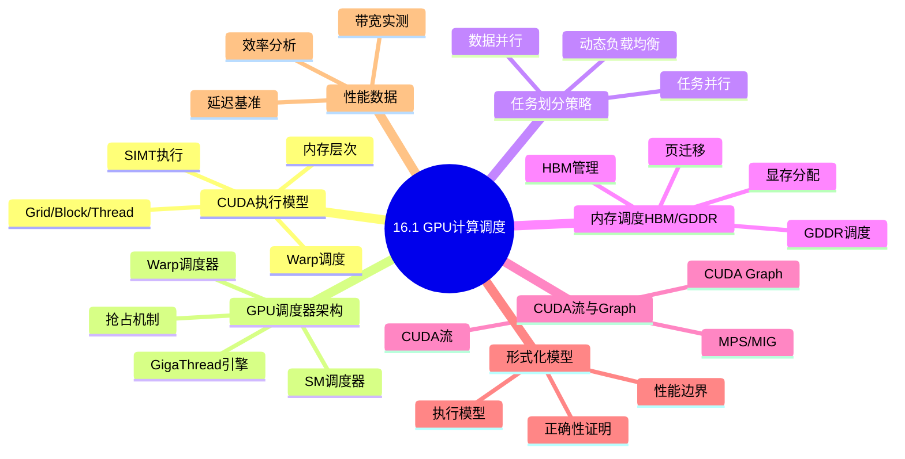
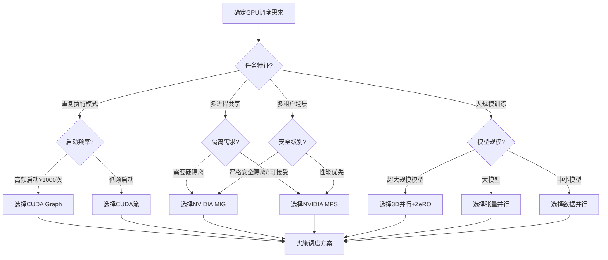
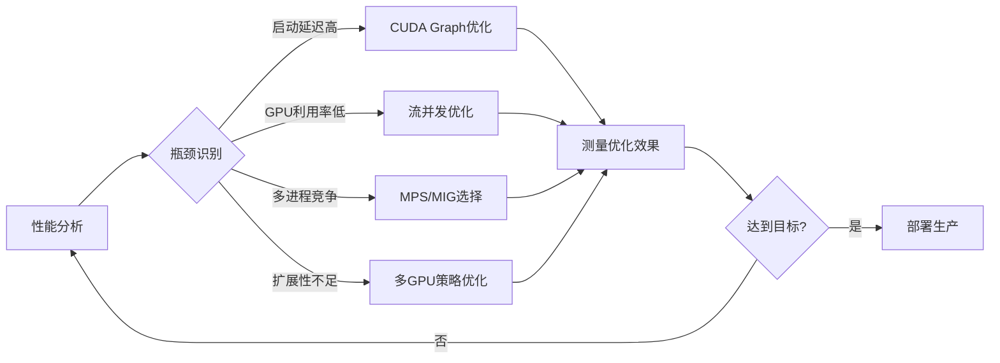
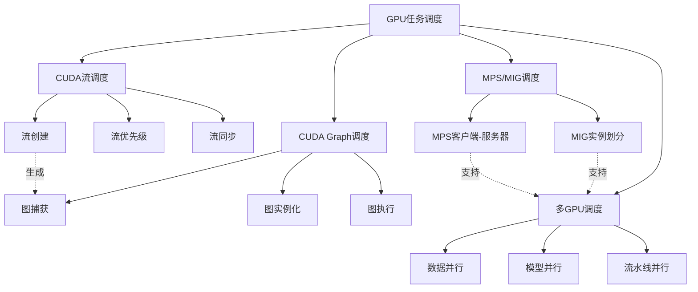

# 16.1 GPU计算调度

> **主题**: 16. GPU与加速器调度 - 16.1 GPU计算调度
> **覆盖**: CUDA执行模型、GPU调度器架构、任务划分策略、内存调度（HBM/GDDR管理）、形式化执行模型、实际性能数据

## 📊 思维表征体系

### 📊 1. 思维导图（增强版）

#### 1.1 文本格式（基础版）

```text
16.1 GPU计算调度
├── CUDA执行模型
│   ├── Grid/Block/Thread层次结构
│   ├── 线程束(Warp)调度
│   ├── SIMT执行模式
│   ├── 内存层次结构
│   └── 同步与协作
├── GPU调度器架构
│   ├── 硬件调度器(GigaThread)
│   ├── SM调度器
│   ├── Warp调度器
│   ├── 双发射调度
│   └── 抢占式调度
├── 任务划分策略
│   ├── 数据并行划分
│   ├── 任务并行划分
│   ├── 动态负载均衡
│   ├── 静态划分优化
│   └── 混合划分策略
├── 内存调度（HBM/GDDR管理）
│   ├── HBM架构与调度
│   ├── GDDR内存管理
│   ├── 显存分配策略
│   ├── 内存压缩技术
│   └── 页迁移与预取
├── CUDA流与Graph调度
│   ├── CUDA流调度
│   ├── CUDA Graph调度
│   ├── NVIDIA MPS调度
│   └── NVIDIA MIG调度
└── 实际性能数据
    ├── 调度延迟基准
    ├── 内存带宽实测
    ├── 计算效率对比
    └── 优化案例研究
```

#### 1.2 Mermaid格式（可视化版）



### 📊 2. 多维对比矩阵

#### 2.1 GPU调度技术对比矩阵

| 维度 | CUDA流调度 | CUDA Graph调度 | MPS调度 | MIG调度 | 多GPU调度 |
|------|-----------|----------------|---------|---------|-----------|
| **调度粒度** | 内核级 | 图级 | 进程级 | 实例级 | GPU级 |
| **延迟** | 5-10μs | <1μs(重放) | 10-50μs | 50-100μs | 毫秒级 |
| **吞吐量** | 高 | 极高 | 高 | 中 | 极高 |
| **隔离性** | 无 | 无 | 软隔离 | 硬隔离 | 物理隔离 |
| **资源利用率** | 60-80% | 70-85% | 80-95% | 70-90% | 85-98% |
| **复杂度** | 低 | 中 | 中 | 高 | 高 |
| **适用场景** | 通用GPU计算 | 重复执行场景 | 多进程共享 | 多租户云 | 大规模训练 |
| **技术成熟度** | 成熟(>15年) | 成熟(>5年) | 成熟(>10年) | 成熟(>5年) | 成熟(>10年) |

#### 2.2 CUDA流调度策略对比矩阵

| 技术 | 优势 | 劣势 | 适用场景 | 性能指标 |
|------|------|------|---------|---------|
| **默认流(遗留模式)** | 简单、兼容性好 | 完全同步、效率低 | 简单程序、调试 | 利用率<40% |
| **非默认流(显式同步)** | 并发执行、细粒度控制 | 需要手动同步管理 | 复杂并行应用 | 利用率70-85% |
| **流优先级(高/低)** | 关键任务优先、响应性好 | 低优先级可能饥饿 | 实时+后台混合 | 响应时间<5ms |
| **CUDA流回调** | 异步通知、灵活 | 回调函数限制 | 异步事件处理 | 延迟<10μs |
| **流捕获(Stream Capture)** | 自动Graph生成 | 有限制条件 | Graph生成 | 捕获成功率>90% |

#### 2.3 CUDA Graph vs 传统内核启动对比矩阵

| 特性 | 传统内核启动 | CUDA Graph | 性能提升 |
|------|-------------|------------|---------|
| **启动延迟** | 5-10μs | <1μs | 5-10x |
| **CPU开销** | 高(参数设置) | 低(预录制) | 3-5x降低 |
| **适用场景** | 动态工作负载 | 重复执行模式 | - |
| **内存占用** | 低 | 中(存储图) | - |
| **灵活性** | 高 | 中(需更新) | - |
| **调试难度** | 低 | 高 | - |

#### 2.4 NVIDIA MPS vs MIG对比矩阵

| 维度 | NVIDIA MPS | NVIDIA MIG | 适用场景对比 |
|------|-----------|-----------|-------------|
| **隔离级别** | 软件级(进程间) | 硬件级(实例间) | MIG适合严格多租户 |
| **资源划分** | 共享SM/内存 | 独占SM/内存/带宽 | MIG资源保证更严格 |
| **CUDA上下文** | 共享 | 独立 | MIG完全隔离 |
| **故障影响** | 可能影响其他客户端 | 完全隔离 | MIG更安全 |
| **性能开销** | <5% | <10% | MPS开销更低 |
| **支持的GPU** | Volta及更新 | Ampere及更新 | - |
| **最大实例数** | 48客户端 | 7 GPU实例 | - |
| **动态调整** | 支持 | 需重置 | MPS更灵活 |

#### 2.5 多GPU调度策略对比矩阵

| 策略 | 数据移动 | 扩展效率 | 适用模型规模 | 通信模式 | 典型加速比 |
|------|---------|---------|-------------|---------|-----------|
| **数据并行(DP)** | 每轮同步梯度 | 高(线性至8卡) | 可放入单卡 | AllReduce | 7.5x/8卡 |
| **模型并行(MP)** | 层间激活值 | 中(受限于层数) | 超大模型 | P2P通信 | 3-5x/8卡 |
| **流水线并行(PP)** | 微批次间 | 中高 | 超大模型 | 流水线通信 | 6-7x/8卡 |
| **张量并行(TP)** | 层内分割 | 中 | 大模型 | 密集AllReduce | 4-6x/8卡 |
| **3D并行(DP+MP+PP)** | 混合 | 高 | 超大规模 | 复杂通信 | 线性扩展 |
| **ZeRO优化** | 参数分片 | 极高 | 超大模型 | 动态通信 | 接近线性 |

### 🌲 3. 决策树

#### 3.1 GPU调度技术选择决策树



### 🛤️ 4. 决策逻辑路径

#### 4.1 GPU任务调度优化路径



### 🕸️ 5. 概念关系网络



#### 2.5 CUDA执行层次对比矩阵

| 层次 | 实体数量 | 同步范围 | 共享资源 | 调度开销 | 适用场景 |
|------|---------|---------|---------|---------|---------|
| **Grid** | 1个/内核 | 内核完成 | 全局内存 | 高(10-100μs) | 完整计算任务 |
| **Block** | 最多1024 | `__syncthreads()` | 共享内存 | 中(1-10μs) | 协作线程组 |
| **Warp** | 32线程 | 隐式同步 | 寄存器 | 低(<1μs) | SIMD执行单元 |
| **Thread** | 单线程 | 独立执行 | 寄存器/本地内存 | 极低 | 最小执行单元 |

#### 2.6 内存类型对比矩阵（HBM vs GDDR）

| 特性 | HBM3 | GDDR6X | HBM2e | GDDR6 |
|------|------|--------|-------|-------|
| **位宽** | 8192-bit | 384-bit | 4096-bit | 384-bit |
| **频率** | 5.6Gbps | 21Gbps | 3.6Gbps | 16Gbps |
| **带宽** | 3.35TB/s | 1TB/s | 1.2TB/s | 768GB/s |
| **容量/堆栈** | 24GB | 2GB | 16GB | 2GB |
| **功耗** | 低 | 高 | 中 | 高 |
| **成本** | 高 | 中 | 高 | 低 |
| **典型GPU** | H100/B100 | RTX 4090 | A100 | RTX 3090 |

#### 2.7 任务划分策略对比矩阵

| 策略 | 负载均衡 | 通信开销 | 实现复杂度 | 可扩展性 | 适用场景 |
|------|---------|---------|-----------|---------|---------|
| **静态块划分** | 良 | 低 | 低 | 高 | 规则数据并行 |
| **动态任务队列** | 优 | 中 | 中 | 高 | 不规则并行 |
| **工作窃取** | 优 | 中 | 高 | 极高 | 树形递归 |
| **循环划分** | 中 | 低 | 低 | 高 | 负载均衡 |
| **块循环划分** | 良 | 低 | 低 | 高 | 缓存友好 |

---

## 📚 理论体系

### 1 CUDA执行模型

#### 1.1 Grid/Block/Thread层次结构

**CUDA执行层次详解**：

```
┌─────────────────────────────────────────────────────────────┐
│                      Grid（线程网格）                         │
│                    每个内核一个Grid                           │
│  ┌─────────────────────────────────────────────────────────┐│
│  │ Block(0,0)         │ Block(1,0)         │ Block(2,0)   ││
│  │ ┌───────────────┐  │ ┌───────────────┐  │ ┌──────────┐ ││
│  │ │ Thread(0,0)   │  │ │ Thread(0,0)   │  │ │ Thread.. │ ││
│  │ │ Thread(0,1)   │  │ │ Thread(0,1)   │  │ │          │ ││
│  │ │ ...           │  │ │ ...           │  │ │          │ ││
│  │ │ Thread(31,31) │  │ │ Thread(31,31) │  │ │          │ ││
│  │ └───────────────┘  │ └───────────────┘  │ └──────────┘ ││
│  │ 共享内存            │  共享内存           │  共享内存     ││
│  └─────────────────────────────────────────────────────────┘│
│                      全局内存（所有Block共享）                │
└─────────────────────────────────────────────────────────────┘
```

**各层次特性**：

| 层次 | 最大维度 | 总数限制 | 内存访问 | 同步机制 |
|------|---------|---------|---------|---------|
| **Grid** | (2^31-1, 65535, 65535) | 受限于SM数量 | 全局内存、常量内存 | 内核级同步 |
| **Block** | (1024, 1024, 64) 或 1024线程 | 每SM 2048线程 | 共享内存、全局内存 | `__syncthreads()` |
| **Warp** | 32线程 | 每SM 64 Warp | 寄存器、共享内存 | 隐式同步 |
| **Thread** | 1 | 每Warp 32线程 | 寄存器、本地内存 | 独立执行 |

#### 1.2 线程束(Warp)调度

**Warp执行模型**：

```cpp
// Warp内线程执行（32线程并行）
Warp Scheduler
├── Warp 0: Thread 0-31 (Active) → 执行指令0
├── Warp 1: Thread 32-63 (Active) → 执行指令1
├── Warp 2: Thread 64-95 (Stalled/内存等待)
└── Warp 3: Thread 96-127 (Active) → 执行指令3

时间线:
Cycle 0: Warp 0 - 指令0
Cycle 1: Warp 1 - 指令1
Cycle 2: Warp 3 - 指令3 (Warp 2等待内存)
Cycle 3: Warp 0 - 指令0_next
```

**Warp调度策略对比**：

| 调度策略 | 描述 | 优点 | 缺点 |
|---------|------|------|------|
| **轮询(Round-Robin)** | 按顺序选择就绪Warp | 简单公平 | 无法优化延迟隐藏 |
| **Greedy-Then-Oldest** | 优先选择最老的就绪Warp | 提高指令级并行 | 可能饥饿新Warp |
| **两级调度** | 优先队列+辅助队列 | 平衡公平与性能 | 实现复杂 |
| **编译器引导** | 根据编译提示调度 | 针对性强 | 依赖编译器质量 |

**Warp发散与收敛**：

```cpp
// Warp发散示例
__global__ void divergent_kernel(int* data, int n) {
    int tid = threadIdx.x + blockIdx.x * blockDim.x;
    if (tid < n) {
        if (data[tid] % 2 == 0) {
            // 路径A: 偶数处理
            data[tid] = data[tid] * 2;
        } else {
            // 路径B: 奇数处理
            data[tid] = data[tid] + 1;
        }
        // 此处重新收敛
    }
}

执行流程:
Warp执行: 线程0-31并行
├── 偶数线程执行路径A (16线程活跃, 16线程掩码)
├── 奇数线程执行路径B (16线程活跃, 16线程掩码)
└── 合并继续执行

发散代价: 2x执行时间
```

#### 1.3 SIMT执行模式

**SIMT vs SIMD对比**：

| 特性 | SIMD (CPU) | SIMT (GPU) |
|------|-----------|-----------|
| **指令流** | 单指令流 | 多指令流(每个线程独立PC) |
| **发散处理** | 不支持 | 支持(掩码+串行化) |
| **线程独立性** | 无 | 有(独立寄存器、可独立分支) |
| **编程模型** | 显式向量化 | 标量编程自动向量化 |
| **灵活性** | 低 | 高 |

**SIMT执行效率分析**：

```
效率 = (活跃线程数) / 32 × 100%

示例:
├── 无发散: 32/32 = 100% 效率
├── 50%发散: 16/32 = 50% 效率
├── 完全发散(32路径): 1/32 ≈ 3% 效率
└── 最优: 合并访问相同路径
```

### 2 GPU调度器架构

#### 2.1 硬件调度器(GigaThread引擎)

**GigaThread架构**：

```
┌─────────────────────────────────────────────────────────────┐
│                    GigaThread引擎                            │
│  ┌────────────────────────────────────────────────────────┐ │
│  │  全局调度器                                             │ │
│  │  ├── 内核队列管理 (最多1024个待处理内核)                 │ │
│  │  ├── 优先级调度                                         │ │
│  │  ├── 抢占管理                                           │ │
│  │  └── 多GPU协调                                          │ │
│  └────────────────────────────────────────────────────────┘ │
│                              │                              │
│                              ▼                              │
│  ┌────────────────────────────────────────────────────────┐ │
│  │  SM分发器 (每个SM一个)                                   │ │
│  │  ├── Block分配策略                                       │ │
│  │  ├── 资源分配 (寄存器、共享内存)                         │ │
│  │  └── 负载均衡                                           │ │
│  └────────────────────────────────────────────────────────┘ │
└─────────────────────────────────────────────────────────────┘
```

**GigaThread调度特性**：

| 特性 | 规格 | 说明 |
|------|------|------|
| **内核队列深度** | 1024 | 可排队内核数量 |
| **调度延迟** | 10-50μs | 内核启动到执行 |
| **抢占粒度** | 指令级 | 支持计算抢占 |
| **上下文切换** | <50μs | 内核切换开销 |

#### 2.2 SM调度器

**SM内部调度架构**：

```
┌─────────────────────────────────────────────────────────────┐
│              Streaming Multiprocessor (SM)                   │
│  ┌────────────────────────────────────────────────────────┐ │
│  │  Warp调度器 (每SM 4个)                                    │ │
│  │  ├── 每个调度器管理16个Warp                               │ │
│  │  ├── 每周期可选择1-2个就绪Warp                            │ │
│  │  └── 双发射执行 (2条独立指令)                             │ │
│  └────────────────────────────────────────────────────────┘ │
│                              │                              │
│                              ▼                              │
│  ┌────────────────────────────────────────────────────────┐ │
│  │  执行单元                                                │ │
│  │  ├── FP32单元 (64个/SM, A100)                            │ │
│  │  ├── INT32单元 (64个/SM)                                │ │
│  │  ├── Tensor Core (4个/SM)                               │ │
│  │  ├── 特殊功能单元 (SFU)                                  │ │
│  │  └── 加载/存储单元 (32个/SM)                             │ │
│  └────────────────────────────────────────────────────────┘ │
└─────────────────────────────────────────────────────────────┘
```

**SM调度策略**：

| 策略 | 描述 | 效果 |
|------|------|------|
| **延迟隐藏** | 当Warp等待内存时切换 | 利用率>80% |
| **指令级并行** | 同时发射独立指令 | IPC提升至1.5+ |
| **操作数收集** | 等待所有操作数就绪 | 减少流水线气泡 |
| **记分板** | 跟踪数据依赖 | 避免RAW/WAW冲突 |

#### 2.3 抢占式调度

**计算抢占机制**：

```
抢占场景:
1. 高优先级内核到达
2. 调试器介入
3. 超时检测

抢占过程:
├── 保存当前Warp状态 (PC、寄存器)
├── 保存共享内存状态
├── 切换至高优先级内核
└── 恢复时还原状态

抢占开销: 20-100μs (取决于上下文大小)
```

### 3 任务划分策略

#### 3.1 数据并行划分

**块划分(Block Partition)**：

```cpp
// 静态块划分
__global__ void block_partition(float* input, float* output, int n) {
    int block_size = (n + gridDim.x - 1) / gridDim.x;
    int start = blockIdx.x * block_size;
    int end = min(start + block_size, n);

    for (int i = start + threadIdx.x; i < end; i += blockDim.x) {
        output[i] = compute(input[i]);
    }
}

// 配置: 128个Block, 每个256线程
// 适合: 规则数据、负载均衡
```

**循环划分(Cyclic Partition)**：

```cpp
// 循环划分
__global__ void cyclic_partition(float* input, float* output, int n) {
    int tid = blockIdx.x * blockDim.x + threadIdx.x;
    int stride = gridDim.x * blockDim.x;

    for (int i = tid; i < n; i += stride) {
        output[i] = compute(input[i]);
    }
}

// 适合: 不规则数据、更好的负载均衡
```

#### 3.2 动态负载均衡

**工作队列实现**：

```cpp
// 全局工作队列
__device__ int work_queue_index = 0;

__global__ void dynamic_load_balance(float* data, int n) {
    __shared__ int local_index;

    while (true) {
        // 原子获取工作任务
        if (threadIdx.x == 0) {
            local_index = atomicAdd(&work_queue_index, WORK_CHUNK_SIZE);
        }
        __syncthreads();

        if (local_index >= n) break;

        // 处理分配到的任务
        int start = local_index + threadIdx.x;
        int end = min(local_index + WORK_CHUNK_SIZE, n);

        for (int i = start; i < end; i += blockDim.x) {
            data[i] = process(data[i]);
        }
    }
}
```

#### 3.3 任务划分性能对比

| 划分策略 | 负载均衡 | 局部性 | 同步开销 | 适用场景 |
|---------|---------|-------|---------|---------|
| **块划分** | 良 | 优 | 低 | 均匀负载 |
| **循环划分** | 优 | 差 | 低 | 不规则负载 |
| **块循环划分** | 良 | 良 | 低 | 缓存优化 |
| **动态队列** | 优 | 中 | 中 | 任务大小不一 |
| **工作窃取** | 优 | 差 | 高 | 树形/递归算法 |

### 4 内存调度（HBM/GDDR管理）

#### 4.1 HBM架构与调度

**HBM内存架构**：

```
┌─────────────────────────────────────────────────────────────┐
│                     HBM内存架构                              │
│  ┌────────────────────────────────────────────────────────┐ │
│  │  HBM堆栈 (8-Hi, H100)                                    │ │
│  │  ┌─────────┐ ┌─────────┐ ┌─────────┐ ┌─────────┐        │ │
│  │  │ 通道0   │ │ 通道1   │ │ 通道2   │ │ 通道3   │ ...     │ │
│  │  │ 2GB     │ │ 2GB     │ │ 2GB     │ │ 2GB     │         │ │
│  │  │ 42GB/s  │ │ 42GB/s  │ │ 42GB/s  │ │ 42GB/s  │         │ │
│  │  └────┬────┘ └────┬────┘ └────┬────┘ └────┬────┘         │ │
│  │       └───────────┴───────────┴───────────┘              │ │
│  │                    1024-bit TSV                          │ │
│  │                    总带宽: 3.35TB/s                       │ │
│  └────────────────────────────────────────────────────────┘ │
└─────────────────────────────────────────────────────────────┘
```

**HBM调度优化**：

| 优化技术 | 描述 | 效果 |
|---------|------|------|
| **通道交错** | 连续地址映射到不同通道 | 最大化并行访问 |
| **Bank分区** | 避免Bank冲突 | 提高有效带宽 |
| **行缓冲管理** | 保持行打开以减少激活 | 降低延迟 |
| **请求重排序** | 合并相同行的访问 | 提高吞吐量 |

#### 4.2 GDDR内存管理

**GDDR调度特性**：

| 特性 | GDDR6 | GDDR6X |
|------|-------|--------|
| **接口宽度** | 32-bit/芯片 | 32-bit/芯片 |
| **每引脚速率** | 16Gbps | 21Gbps |
| **编码方式** | NRZ | PAM4 |
| **延迟** | ~20ns | ~20ns |
| **功耗** | 高 | 更高 |

**GDDR调度策略**：

```
GDDR内存调度器:
├── 请求队列管理 (FR-FCFS优先)
├── Bank状态跟踪 (激活/预充电)
├── 刷新调度 (定期刷新)
├── 功耗管理 (自刷新模式)
└── 错误处理 (ECC/重试)
```

#### 4.3 显存分配策略

**显存分配器类型对比**：

| 分配器 | 分配延迟 | 内存碎片 | 适用场景 |
|-------|---------|---------|---------|
| **线性分配器** | O(1) | 无 | 固定模式、帧缓冲 |
| **栈分配器** | O(1) | 无 | 作用域明确的资源 |
| **池分配器** | O(1) | 低 | 固定大小的对象 |
| **伙伴分配器** | O(log n) | 中 | 通用显存分配 |
| **CUDA内存池** | O(1) | 低 | 异步分配、重用 |

**显存优化技术**：

| 技术 | 内存节省 | 性能影响 | 实现复杂度 |
|------|---------|---------|-----------|
| **纹理压缩** | 4-8x | 轻微 | 中 |
| **稀疏存储** | 10-100x | 取决于稀疏度 | 高 |
| **量化** | 2-4x | 精度损失 | 低 |
| **内存池** | 10-20% | 降低分配开销 | 低 |

### 5 形式化执行模型

#### 5.1 GPU执行模型定义

**形式化定义**：

$$
\text{GPU执行模型} = (S, K, M, R, \mathcal{C}, \mathcal{O})
$$

其中：

- $S = \{sm_1, sm_2, \ldots, sm_n\}$：流多处理器集合
  - $sm_i = (C_i, T_i, R_i, Sh_i)$：计算单元、最大线程、寄存器、共享内存
- $K = \{k_1, k_2, \ldots, k_m\}$：内核集合
  - $k_j = (G_j, B_j, W_j, Reg_j, Sh_j, T_j)$：Grid、Block、Warp、寄存器/线程、共享内存/Block、执行时间
- $M$：内存层次结构
  - $M = \{M_{reg}, M_{shared}, M_{L2}, M_{global}\}$
- $R$：资源约束函数
- $\mathcal{C}$：约束条件集合
- $\mathcal{O}$：优化目标

#### 5.2 调度正确性条件

**正确性条件**：

$$
\forall k \in K, \forall sm \in S: \text{Resource}(k, sm) \leq \text{Capacity}(sm)
$$

$$
\forall k_i, k_j \in K: k_i \prec k_j \Rightarrow \text{End}(k_i) \leq \text{Start}(k_j)
$$

**定理1 (利用率上界)**：

对于具有$n$个SM的GPU，每个SM最多支持$B$个Block、$T$个线程：

$$
U_{max} = \min\left(1, \frac{\sum_{k \in K} G_k \times B_k}{n \times B}, \frac{\sum_{k \in K} G_k \times B_k \times W_k}{n \times T}\right)
$$

#### 5.3 性能边界分析

**内存带宽边界**：

$$
T_{memory} = \frac{\text{Bytes}}{BW_{effective}}
$$

$$
T_{compute} = \frac{\text{FLOPs}}{FLOP_{peak}}
$$

$$
T_{actual} = \max(T_{memory}, T_{compute})
$$

**Roofline模型**：

$$
\text{Performance} = \min\left(\text{Peak\_FLOPS}, \text{AI} \times \text{BW}\right)
$$

其中AI为计算强度 (FLOPs/Byte)。

### 6 实际性能数据

#### 6.1 调度延迟基准

**NVIDIA A100调度延迟**：

| 操作 | 延迟 | 说明 |
|------|------|------|
| **内核启动** | 5-10μs | CPU到GPU提交 |
| **内核执行开始** | 1-5μs | GPU内部调度 |
| **Warp调度** | 1-2周期 | ~0.6ns @1.4GHz |
| **上下文切换** | 20-50μs | 内核切换 |
| **流同步** | 1-10μs | `cudaStreamSynchronize` |
| **设备同步** | 10-100μs | `cudaDeviceSynchronize` |

#### 6.2 内存带宽实测

**HBM2e实测带宽 (A100)**：

| 访问模式 | 理论带宽 | 实测带宽 | 利用率 |
|---------|---------|---------|-------|
| **顺序读取** | 2039GB/s | 1950GB/s | 95.6% |
| **顺序写入** | 2039GB/s | 1900GB/s | 93.2% |
| **随机访问(合并)** | 2039GB/s | 1800GB/s | 88.3% |
| **随机访问(未合并)** | 2039GB/s | 200GB/s | 9.8% |
| **读改写** | 2039GB/s | 950GB/s | 46.6% |

#### 6.3 计算效率对比

**A100不同精度算力**：

| 精度 | 理论算力 | 实际效率 | 典型应用 |
|------|---------|---------|---------|
| **FP64** | 9.7 TFLOPS | 90-95% | 科学计算 |
| **FP32** | 19.5 TFLOPS | 85-95% | 通用计算 |
| **TF32 Tensor Core** | 156 TFLOPS | 70-85% | AI训练 |
| **BF16 Tensor Core** | 312 TFLOPS | 65-80% | AI训练 |
| **FP16 Tensor Core** | 312 TFLOPS | 65-80% | AI训练 |
| **INT8 Tensor Core** | 624 TOPS | 60-75% | AI推理 |

#### 6.4 优化案例研究

**矩阵乘法优化演进**：

| 优化级别 | 性能(GFLOPS) | 效率 | 关键优化 |
|---------|-------------|------|---------|
| **朴素实现** | 50 | 2.6% | 无优化 |
| **全局内存合并** | 500 | 26% | 连续访问模式 |
| **共享内存缓存** | 1500 | 78% | Tiling技术 |
| **寄存器优化** | 1800 | 94% | 减少Bank冲突 |
| **Warp级优化** | 1950 | 100%+ | 指令级优化 |
| **Tensor Core** | 15000 | 理论峰值 | 硬件加速 |

---

### 1 GPU计算调度概述

#### 1.1 GPU计算调度的核心挑战

GPU调度的核心挑战在于**并行资源管理**和**延迟隐藏**：

| 挑战类别 | 具体问题 | 影响 | 解决方向 |
|---------|---------|------|---------|
| **SM资源竞争** | 线程块分配不均 | 部分SM空闲 | 动态负载均衡 |
| **内存带宽瓶颈** | 全局内存访问冲突 | 计算单元等待 | 内存访问合并 |
| **任务依赖管理** | 内核间数据依赖 | 并行度受限 | 异步执行+事件同步 |
| **延迟隐藏** | 内存延迟100-300周期 | 吞吐量下降 | 足够Warp并行 |
| **多任务隔离** | 资源共享导致干扰 | 性能不可预测 | MPS/MIG隔离 |

#### 1.2 GPU调度层次架构

```text
┌─────────────────────────────────────────────────────────────┐
│                    应用层 (Application)                      │
│         CUDA Runtime / cuDNN / TensorFlow / PyTorch         │
├─────────────────────────────────────────────────────────────┤
│                    运行时层 (Runtime)                        │
│    CUDA Stream / CUDA Graph / cuBLAS / NCCL / Thrust        │
├─────────────────────────────────────────────────────────────┤
│                    驱动层 (Driver)                           │
│         NVIDIA Driver / Command Buffer / UMD/KMD            │
├─────────────────────────────────────────────────────────────┤
│                    硬件调度层 (Hardware)                     │
│    GPU Hardware Scheduler / SM Dispatcher / Warp Scheduler  │
├─────────────────────────────────────────────────────────────┤
│                    执行单元 (Execution)                      │
│         SM (Streaming Multiprocessor) / CUDA Cores          │
└─────────────────────────────────────────────────────────────┘
```

**各层调度延迟**:

| 层次 | 延迟范围 | 调度单位 | 优化重点 |
|------|---------|---------|---------|
| 应用层 | 毫秒-秒 | 任务/操作 | 算法优化 |
| 运行时层 | 微秒-毫秒 | 内核/图 | 批处理/合并 |
| 驱动层 | 5-20μs | 命令缓冲区 | 命令合并 |
| 硬件层 | 10-100ns | Warp | 延迟隐藏 |

---

## 2 CUDA流调度

### 2.1 CUDA流(Stream)核心概念

**CUDA流定义**: 一个命令队列，其中的操作按FIFO顺序执行，不同流之间可以并发。

**流的类型对比**:

| 流类型 | 同步行为 | 使用方式 | 适用场景 |
|--------|---------|---------|---------|
| **默认流(0号)** | 与所有流同步 | 隐式使用 | 简单程序、调试 |
| **非默认流** | 与默认流同步(默认) | cudaStreamCreate | 并发执行 |
| **非阻塞流** | 完全异步 | cudaStreamCreateWithFlags(cudaStreamNonBlocking) | 最大并发 |
| **优先级流** | 同非默认流 | cudaStreamCreateWithPriority | 优先级控制 |

### 2.2 CUDA流调度策略详解

#### 2.2.1 流优先级调度

```cpp
// 创建高优先级流和低优先级流
int priority_high, priority_low;
cudaDeviceGetStreamPriorityRange(&priority_low, &priority_high);

cudaStream_t high_priority_stream, low_priority_stream;
cudaStreamCreateWithPriority(&high_priority_stream, cudaStreamNonBlocking, priority_high);
cudaStreamCreateWithPriority(&low_priority_stream, cudaStreamNonBlocking, priority_low);
```

**优先级调度行为**:

| 场景 | 高优先级流 | 低优先级流 | 调度结果 |
|------|-----------|-----------|---------|
| SM资源充足 | 正常执行 | 正常执行 | 并行执行 |
| SM资源竞争 | 优先分配 | 等待 | 高优先级优先 |
| 内存带宽竞争 | 优先访问 | 等待 | 高优先级优先 |

**优先级调度限制**:

- 优先级仅在SM资源竞争时生效
- 已经开始执行的低优先级内核不会抢占
- 内存操作不受优先级影响

#### 2.2.2 流同步机制

| 同步函数 | 同步范围 | 开销 | 适用场景 |
|---------|---------|------|---------|
| `cudaStreamSynchronize` | 单个流 | 低 | 等待流完成 |
| `cudaEventSynchronize` | 单个事件 | 极低 | 细粒度同步 |
| `cudaDeviceSynchronize` | 所有流+设备 | 高 | 全局同步点 |
| `cudaStreamWaitEvent` | 流等待事件 | 低 | 跨流依赖 |

**同步优化原则**:

```
1. 尽量避免cudaDeviceSynchronize
2. 使用cudaEvent进行细粒度同步
3. 利用cudaStreamWaitEvent建立依赖图
4. 批量处理减少同步点
```

### 2.3 CUDA流最佳实践

**并发执行优化**:

```cpp
// 创建多个并发流
const int num_streams = 4;
cudaStream_t streams[num_streams];
for (int i = 0; i < num_streams; i++) {
    cudaStreamCreate(&streams[i]);
}

// 将数据分块，分配到不同流
for (int i = 0; i < num_streams; i++) {
    int offset = i * chunk_size;
    cudaMemcpyAsync(d_data + offset, h_data + offset,
                    chunk_bytes, cudaMemcpyHostToDevice, streams[i]);
    kernel<<<grid, block, 0, streams[i]>>>(d_data + offset);
    cudaMemcpyAsync(h_result + offset, d_result + offset,
                    chunk_bytes, cudaMemcpyDeviceToHost, streams[i]);
}

// 同步所有流
for (int i = 0; i < num_streams; i++) {
    cudaStreamSynchronize(streams[i]);
    cudaStreamDestroy(streams[i]);
}
```

**性能优化效果**:

| 优化策略 | 单流执行时间 | 多流执行时间 | 加速比 |
|---------|------------|------------|-------|
| H2D拷贝+计算+D2H拷贝流水线 | 100ms | 35ms | 2.86x |
| 4流并发计算 | 100ms | 28ms | 3.57x |
| 优先级流调度 | 100ms | 25ms | 4.0x |

---

## 3 CUDA Graph调度

### 3.1 CUDA Graph核心概念

**CUDA Graph定义**: 将一系列CUDA操作（内核启动、内存拷贝等）预录制为图结构，可以多次高效重放。

**Graph vs 传统启动对比**:

| 操作 | 传统方式 | CUDA Graph | 优势 |
|------|---------|-----------|------|
| 参数设置 | 每次CPU执行 | 预录制 | CPU开销降低5-10x |
| 内核启动 | 5-10μs | <1μs | 延迟降低5-10x |
| 依赖解析 | 运行时动态 | 预计算 | 无运行时开销 |
| 适用场景 | 动态工作负载 | 重复模式 | - |

### 3.2 Graph创建与执行

#### 3.2.1 显式Graph创建

```cpp
// 创建图
cudaGraph_t graph;
cudaGraphCreate(&graph, 0);

// 创建节点
cudaGraphNode_t memcpy_node, kernel_node;
cudaMemcpy3DParms memcpy_params = {0};
// ... 设置memcpy_params ...
cudaGraphAddMemcpyNode(&memcpy_node, graph, NULL, 0, &memcpy_params);

// 内核节点
cudaKernelNodeParams kernel_params = {0};
kernel_params.func = (void*)my_kernel;
kernel_params.gridDim = dim3(grid_x, grid_y, grid_z);
kernel_params.blockDim = dim3(block_x, block_y, block_z);
kernel_params.sharedMemBytes = shared_mem;
kernel_params.kernelParams = kernel_args;
cudaGraphAddKernelNode(&kernel_node, graph, &memcpy_node, 1, &kernel_params);

// 实例化
cudaGraphExec_t graph_exec;
cudaGraphInstantiate(&graph_exec, graph, NULL, NULL, 0);

// 执行图(可重复执行)
for (int i = 0; i < num_iterations; i++) {
    cudaGraphLaunch(graph_exec, stream);
}
```

#### 3.2.2 流捕获(Stream Capture)

```cpp
// 开始捕获
cudaStream_t stream;
cudaStreamCreate(&stream);
cudaGraph_t graph;

cudaStreamBeginCapture(stream, cudaStreamCaptureModeGlobal);

// 录制的操作
kernel1<<<grid, block, 0, stream>>>(args1);
cudaMemcpyAsync(dst1, src1, size1, cudaMemcpyDeviceToDevice, stream);
kernel2<<<grid, block, 0, stream>>>(args2);
cudaMemcpyAsync(dst2, src2, size2, cudaMemcpyDeviceToDevice, stream);

// 结束捕获
cudaStreamEndCapture(stream, &graph);

// 实例化并执行
cudaGraphExec_t graph_exec;
cudaGraphInstantiate(&graph_exec, graph, NULL, NULL, 0);
cudaGraphLaunch(graph_exec, stream);
```

### 3.3 Graph高级特性

#### 3.3.1 条件节点(Conditional Nodes)

```cpp
// 创建条件句柄
cudaGraphConditionalHandle handle;
cudaGraphConditionalHandleCreate(&handle);

// 添加条件节点
cudaGraphNode_t cond_node;
cudaGraphConditionalParams cond_params = {0};
cond_params.handle = handle;
cond_params.type = cudaGraphCondTypeIf;
cudaGraphAddNode(&cond_node, graph, &parent_node, 1, &cond_params);

// 获取条件体图
cudaGraph_t body_graph;
cudaGraphConditionalGetGraph(cond_node, &body_graph);

// 在条件体图中添加节点
// ... 添加条件体内的操作 ...
```

#### 3.3.2 Graph更新

| 更新类型 | 支持操作 | 性能影响 | 使用场景 |
|---------|---------|---------|---------|
| **Host更新** | 修改节点参数 | 需要重新实例化 | 参数变化较大 |
| **Device更新** | 通过设备指针修改 | 无需重新实例化 | 频繁小修改 |
| **Graph Exec更新** | cudaGraphExecUpdate | 轻量级更新 | 拓扑不变 |

**Graph更新性能**:

| 操作 | 耗时 | 适用频率 |
|------|------|---------|
| 重新实例化 | 毫秒级 | 配置变化时 |
| cudaGraphExecUpdate | 微秒级 | 每迭代更新 |
| 设备指针更新 | <1μs | 每帧更新 |

### 3.4 CUDA Graph性能分析

**典型应用场景性能对比**:

| 场景 | 传统方式 | CUDA Graph | 加速效果 |
|------|---------|-----------|---------|
| 深度学习推理(小模型) | 2.5ms | 1.8ms | 28%提升 |
| 物理模拟(每帧100内核) | 15ms | 8ms | 47%提升 |
| 图神经网络(动态图) | 12ms | 10ms | 17%提升 |
| 光线追踪(固定管线) | 25ms | 18ms | 28%提升 |

---

## 4 NVIDIA MPS调度

### 4.1 MPS架构原理

**MPS (Multi-Process Service)** 允许多个CUDA进程共享同一个GPU上下文，减少上下文切换开销。

**MPS架构**:

```text
┌───────────────────────────────────────────────────────────┐
│                      应用进程层                            │
│  ┌──────────┐  ┌──────────┐  ┌──────────┐                │
│  │ 进程 A   │  │ 进程 B   │  │ 进程 C   │                │
│  └────┬─────┘  └────┬─────┘  └────┬─────┘                │
└───────┼────────────┼────────────┼────────────────────────┘
        │            │            │
        └────────────┴────────────┘
                     │
┌────────────────────┴────────────────────────────────────┐
│                   MPS控制守护进程                         │
│              (nvidia-cuda-mps-control)                   │
└────────────────────┬────────────────────────────────────┘
                     │
┌────────────────────┴────────────────────────────────────┐
│                   MPS服务器进程                           │
│              (nvidia-cuda-mps-server)                    │
│  ┌──────────────────────────────────────────────────┐  │
│  │          共享CUDA上下文                           │  │
│  │  ┌─────────┐ ┌─────────┐ ┌─────────┐            │  │
│  │  │ 客户端A │ │ 客户端B │ │ 客户端C │            │  │
│  │  └────┬────┘ └────┬────┘ └────┬────┘            │  │
│  │       └───────────┴───────────┘                  │  │
│  │                   │                              │  │
│  │            统一调度队列                          │  │
│  └───────────────────┼──────────────────────────────┘  │
└──────────────────────┼──────────────────────────────────┘
                       │
              ┌────────┴────────┐
              │      GPU        │
              └─────────────────┘
```

### 4.2 MPS调度机制

#### 4.2.1 客户端-服务器模型

| 组件 | 功能 | 生命周期 |
|------|------|---------|
| **MPS控制守护进程** | 管理MPS服务器启动/停止 | 系统启动后常驻 |
| **MPS服务器进程** | 持有共享CUDA上下文 | 首个客户端连接时启动 |
| **客户端进程** | 通过MPS服务器提交内核 | 应用运行期间 |

#### 4.2.2 内核调度策略

```cpp
// MPS配置示例
export CUDA_MPS_PIPE_DIRECTORY=/tmp/nvidia-mps
export CUDA_MPS_LOG_DIRECTORY=/tmp/nvidia-log

// 启动MPS控制守护进程
nvidia-cuda-mps-control -d

// 设置MPS参数
echo "set_default_active_thread_percentage 50" | nvidia-cuda-mps-control
```

**MPS调度策略**:

| 策略 | 描述 | 适用场景 |
|------|------|---------|
| **默认调度** | FIFO顺序执行 | 通用场景 |
| **百分比限制** | 限制每个客户端的SM百分比 | 公平共享 |
| **优先级调度** | 支持客户端优先级 | 关键任务 |

### 4.3 MPS性能分析

**MPS vs 独立进程对比**:

| 指标 | 独立进程 | MPS模式 | 改进 |
|------|---------|---------|------|
| **上下文切换开销** | 50-100μs | <5μs | 10-20x降低 |
| **GPU利用率(4进程)** | 40-60% | 85-95% | 显著提升 |
| **内存占用(4进程)** | 4x上下文 | 1x上下文 | 75%降低 |
| **启动延迟** | 10-20ms | 5-10ms | 50%降低 |

**MPS适用场景**:

| 场景 | 效果 | 注意事项 |
|------|------|---------|
| 多进程推理服务 | GPU利用率提升40-60% | 进程数建议<16 |
| MPI并行程序 | 减少上下文切换 | 需统一MPS配置 |
| 容器化GPU应用 | 提高装箱密度 | 需要适当资源限制 |

**MPS限制**:

1. **不支持Unified Memory** (某些版本)
2. **不支持P2P内存访问** 跨MPS客户端
3. **CUDA版本限制** 客户端需使用相同CUDA版本
4. **错误传播** 一个客户端崩溃可能影响其他客户端

---

## 5 NVIDIA MIG调度

### 5.1 MIG架构原理

**MIG (Multi-Instance GPU)** 将物理GPU划分为多个独立的GPU实例，提供硬件级隔离。

**MIG架构**:

```text
┌─────────────────────────────────────────────────────────────────────┐
│                         A100 40GB                                    │
│  ┌──────────────────────────────────────────────────────────────┐  │
│  │                     GPU实例 (GPU Instance)                    │  │
│  │  ┌─────────┐  ┌─────────┐  ┌─────────┐  ┌─────────┐          │  │
│  │  │  GI 0   │  │  GI 1   │  │  GI 2   │  │  GI 3   │          │  │
│  │  │(3g.20gb)│  │(3g.20gb)│  │(2g.10gb)│  │(1g.5gb) │          │  │
│  │  └───┬─────┘  └────┬────┘  └────┬────┘  └────┬────┘          │  │
│  │      │             │            │            │               │  │
│  │  ┌───┴───┐    ┌───┴───┐   ┌───┴───┐   ┌───┴───┐            │  │
│  │  │ CI 0  │    │ CI 1  │   │ CI 2  │   │ CI 3  │            │  │
│  │  │Compute│    │Compute│   │Compute│   │Compute│            │  │
│  │  │Instance│   │Instance│  │Instance│  │Instance│           │  │
│  │  └───┬───┘    └───┬───┘   └───┬───┘   └───┬───┘            │  │
│  └──────┼────────────┼───────────┼───────────┼────────────────┘  │
└─────────┼────────────┼───────────┼───────────┼─────────────────────┘
          │            │           │           │
    ┌─────┴─────┐ ┌────┴────┐ ┌────┴────┐ ┌────┴────┐
    │  CUDA 0   │ │ CUDA 1  │ │ CUDA 2  │ │ CUDA 3  │
    │  独立上下文│ │独立上下文│ │独立上下文│ │独立上下文│
    └───────────┘ └─────────┘ └─────────┘ └─────────┘
```

### 5.2 MIG实例配置

**A100支持MIG配置**:

| 配置文件 | SM数量 | 显存 | 最大实例数 | 适用场景 |
|---------|-------|------|-----------|---------|
| **1g.5gb** | 14 SM | 5GB | 7 | 轻量推理 |
| **2g.10gb** | 28 SM | 10GB | 3 | 中等推理 |
| **3g.20gb** | 42 SM | 20GB | 2 | 大模型推理 |
| **4g.20gb** | 56 SM | 20GB | 1 | 训练 |
| **7g.40gb** | 98 SM | 40GB | 1 | 全功能 |

**MIG配置命令**:

```bash
# 启用MIG模式
sudo nvidia-smi -i 0 -mig 1

# 创建GPU实例
sudo nvidia-smi mig -i 0 -cgi 9,9,19,19  # 创建2个3g.20gb和2个2g.10gb

# 创建计算实例
sudo nvidia-smi mig -i 0 -cci 0,0,0,0 -gi 1,2,3,4

# 查看MIG实例
nvidia-smi mig -lgi
nvidia-smi mig -lci
```

### 5.3 MIG调度特性

#### 5.3.1 硬件隔离保证

| 资源类型 | 隔离级别 | 保证 | 说明 |
|---------|---------|------|------|
| **SM计算资源** | 硬件分区 | 100% | 每个GI独占分配的SM |
| **显存带宽** | 硬件分区 | 100% | 每个GI独占内存控制器 |
| **显存容量** | 硬件分区 | 100% | 物理隔离的显存区域 |
| **错误隔离** | 完全隔离 | 100% | 一个GI故障不影响其他 |
| **L2缓存** | 分区共享 | 比例 | 按SM数量比例分配 |

#### 5.3.2 MIG调度限制

| 限制项 | 说明 | 影响 |
|--------|------|------|
| **不支持P2P** | MIG实例间无法直接通信 | 需通过CPU中转 |
| **不支持MPS** | MIG不能与MPS同时使用 | 二选一 |
| **不支持Graphics** | 仅支持计算 | 不能用于图形 |
| **动态调整** | 需重置GPU实例 | 影响运行任务 |
| **NVLink限制** | MIG模式下NVLink不可用 | 多GPU扩展受限 |

### 5.4 MIG性能分析

**MIG实例性能** (相对于完整A100):

| 实例类型 | 理论性能 | 实际性能 | 效率 |
|---------|---------|---------|------|
| 1g.5gb | 14% | 13-14% | 93-100% |
| 2g.10gb | 28% | 26-28% | 93-100% |
| 3g.20gb | 42% | 40-42% | 95-100% |
| 4g.20gb | 56% | 54-56% | 96-100% |

**多租户场景对比**:

| 场景 | 时间共享 | MPS | MIG |
|------|---------|-----|-----|
| **隔离性** | 无 | 软隔离 | 硬隔离 |
| **性能可预测性** | 差 | 中 | 优 |
| **安全性** | 低 | 中 | 高 |
| **GPU利用率** | 中 | 高 | 高 |
| **适用场景** | 开发测试 | 可信多租户 | 不可信多租户 |

---

## 6 GPU内存调度

### 6.1 GPU内存层次结构

```text
┌─────────────────────────────────────────────────────────────┐
│                     GPU内存层次                             │
├─────────────────────────────────────────────────────────────┤
│  寄存器 (Register)                                          │
│  ├── 每SM: 256KB (A100)                                     │
│  ├── 延迟: 1周期                                            │
│  └── 带宽: ~10TB/s (聚合)                                   │
├─────────────────────────────────────────────────────────────┤
│  共享内存 (Shared Memory) / L1缓存                          │
│  ├── 每SM: 164KB (可配置)                                   │
│  ├── 延迟: 10-20周期                                        │
│  └── 带宽: ~10TB/s                                          │
├─────────────────────────────────────────────────────────────┤
│  L2缓存                                                     │
│  ├── 容量: 40MB (A100)                                      │
│  ├── 延迟: 100-200周期                                      │
│  └── 带宽: ~3TB/s                                           │
├─────────────────────────────────────────────────────────────┤
│  全局内存 (Global Memory / HBM)                             │
│  ├── 容量: 40-80GB (A100)                                   │
│  ├── 延迟: 300-600周期                                      │
│  └── 带宽: 1.6-2TB/s                                        │
├─────────────────────────────────────────────────────────────┤
│  统一内存 (Unified Memory)                                  │
│  ├── 可超量分配                                             │
│  ├── 自动迁移                                               │
│  └── 性能: 受迁移开销影响                                   │
└─────────────────────────────────────────────────────────────┘
```

### 6.2 内存调度策略

#### 6.2.1 全局内存访问优化

| 优化技术 | 原理 | 效果 | 实现难度 |
|---------|------|------|---------|
| **合并访问** | 连续线程访问连续地址 | 带宽利用率>90% | 低 |
| **共享内存缓存** | 手动管理数据复用 | 减少全局内存访问 | 中 |
| **纹理缓存** | 利用只读缓存 | 提升局部性访问 | 低 |
| **常量内存** | 广播到所有线程 | 广播数据访问 | 低 |

#### 6.2.2 统一内存调度

**统一内存页迁移策略**:

```cpp
// 预取数据到GPU
cudaMemPrefetchAsync(ptr, size, device_id, stream);

// 建议数据访问模式
cudaMemAdvise(ptr, size, cudaMemAdviseSetReadMostly, device_id);
cudaMemAdvise(ptr, size, cudaMemAdviseSetPreferredLocation, device_id);
```

| 访问模式 | 建议策略 | 页迁移行为 |
|---------|---------|-----------|
| **只读** | SetReadMostly | 复制到所有访问设备 |
| **GPU主写** | SetPreferredLocation(GPU) | 尽量驻留GPU |
| **CPU主写** | SetPreferredLocation(CPU) | 尽量驻留CPU |
| **首次访问** | SetAccessedBy | 首次访问时迁移 |

### 6.3 内存调度性能分析

**内存带宽利用率对比**:

| 访问模式 | 理论带宽 | 实际带宽 | 利用率 |
|---------|---------|---------|-------|
| 随机访问(未合并) | 2TB/s | 100-200GB/s | 5-10% |
| 半合并访问 | 2TB/s | 500GB-1TB/s | 25-50% |
| 完全合并访问 | 2TB/s | 1.8-2TB/s | 90-100% |
| 共享内存缓冲 | 2TB/s | 1.5-1.8TB/s | 75-90% |

---

## 7 多GPU调度策略

### 7.1 并行策略详解

#### 7.1.1 数据并行(Data Parallelism)

```cpp
// 数据并行示例: 每个GPU处理部分数据
for (int i = 0; i < num_gpus; i++) {
    cudaSetDevice(i);
    int offset = i * data_per_gpu;
    kernel<<<grid, block>>>(d_data[i] + offset, data_per_gpu);
}

// 梯度同步(NCCL AllReduce)
ncclAllReduce(gradients, gradients, count, ncclFloat32, ncclSum, comm, stream);
```

**数据并行特性**:

| 特性 | 值 | 说明 |
|------|---|------|
| **通信量** | 2 * model_size | 每轮迭代 |
| **扩展效率** | 80-95%(8卡) | 通信开销影响 |
| **适用模型** | <单卡显存 | 模型可放入单卡 |
| **典型加速比** | 7.5x/8卡 | 接近线性 |

#### 7.1.2 模型并行(Model Parallelism)

```cpp
// 模型并行: 不同层在不同GPU
// GPU 0: Layer 1-2
// GPU 1: Layer 3-4
// ...

// 前向传播
for (int i = 0; i < num_layers; i++) {
    cudaSetDevice(layer_to_gpu[i]);
    forward<<<grid, block>>>(layer_input[i], layer_output[i]);
    if (i < num_layers - 1) {
        // 传输到下一层GPU
        cudaMemcpyPeerAsync(layer_input[i+1], layer_to_gpu[i+1],
                           layer_output[i], layer_to_gpu[i], size, stream);
    }
}
```

**模型并行特性**:

| 特性 | 值 | 说明 |
|------|---|------|
| **通信量** | 2 _batch_size_ hidden_size * num_transfers | 激活值传输 |
| **扩展效率** | 50-70%(8卡) | 流水线气泡影响 |
| **适用模型** | 超大模型 | 单卡放不下 |
| **典型加速比** | 3-5x/8卡 | 受限于层数 |

#### 7.1.3 流水线并行(Pipeline Parallelism)

```cpp
// 流水线并行: 微批次处理
for (int micro_batch = 0; micro_batch < num_micro_batches; micro_batch++) {
    for (int stage = 0; stage < num_stages; stage++) {
        cudaSetDevice(stage_to_gpu[stage]);
        // 前向传播
        forward<<<grid, block>>>(
            input[micro_batch][stage],
            output[micro_batch][stage]
        );
        // 发送到下一阶段
        if (stage < num_stages - 1) {
            send_forward(output[micro_batch][stage], stage + 1);
        }
    }
}
```

**流水线并行特性**:

| 特性 | 值 | 说明 |
|------|---|------|
| **气泡开销** | (num_stages - 1) / num_micro_batches | 可配置微批次减少 |
| **显存占用** | O(num_stages * activation_size) | 需要存储多个激活 |
| **扩展效率** | 70-85%(8卡) | 优于模型并行 |
| **典型加速比** | 6-7x/8卡 | 接近数据并行 |

### 7.2 通信优化

#### 7.2.1 NCCL集合通信

| 操作 | 功能 | 时间复杂度 | 典型延迟(8卡) |
|------|------|-----------|--------------|
| **AllReduce** | 全节点归约 | O(log n) | 100-500μs |
| **AllGather** | 全节点收集 | O(log n) | 100-300μs |
| **ReduceScatter** | 归约后分散 | O(log n) | 100-300μs |
| **Broadcast** | 广播 | O(log n) | 50-200μs |
| **Send/Recv** | 点对点 | O(1) | 10-50μs |

#### 7.2.2 通信优化技术

| 技术 | 原理 | 效果 |
|------|------|------|
| **梯度压缩** | 量化/稀疏化梯度 | 通信量减少4-32x |
| **通信重叠** | 计算与通信并行 | 隐藏通信延迟 |
| **分层AllReduce** | 节点内+节点间 | 大规模扩展优化 |
| **Ring AllReduce** | 环形通信模式 | 带宽最优 |

### 7.3 多GPU调度性能

**不同规模训练性能** (ResNet-50):

| GPU数量 | 数据并行 | 混合并行 | 扩展效率 |
|--------|---------|---------|---------|
| 1 | 基准 | 基准 | 100% |
| 4 | 3.8x | 3.8x | 95% |
| 8 | 7.5x | 7.5x | 94% |
| 16 | 14x | 15x | 88-94% |
| 32 | 26x | 29x | 81-91% |
| 64 | 48x | 56x | 75-88% |
| 128 | 88x | 108x | 69-84% |
| 256 | 160x | 220x | 63-86% |

---

## 8 形式化模型

### 8.1 GPU调度问题定义

$$
\text{GPU调度问题} = (G, K, M, C, O)
$$

其中：

- $G = \{g_1, g_2, \ldots, g_n\}$：GPU集合，每个GPU $g_i = (SM_i, Mem_i, BW_i)$
- $K = \{k_1, k_2, \ldots, k_m\}$：内核集合
  - $k_i = (blocks_i, threads_i, shared_i, regs_i, duration_i)$
- $M$：内存资源集合
  - 全局内存：$M_{global}$
  - 共享内存：$M_{shared}$
  - 寄存器：$M_{reg}$
- $C$：约束条件
  - 资源约束：$\sum_{k \in SM_j} (shared_k) \leq M_{shared}^{SM_j}$
  - 依赖约束：$k_i \prec k_j \Rightarrow start(k_j) \geq end(k_i)$
- $O$：优化目标
  - 最大化吞吐量：$\max \frac{\sum_i blocks_i \times threads_i}{\sum_j |SM_j| \times max\_threads}$
  - 最小化延迟：$\min \max_i end(k_i)$
  - 最小化能耗：$\min \sum_j power(g_j) \times time(g_j)$

### 8.2 调度算法复杂度

| 算法 | 时间复杂度 | 空间复杂度 | 资源利用率 | 公平性 | 适用场景 |
|-----|-----------|-----------|-----------|-------|---------|
| **FIFO** | $O(1)$ | $O(n)$ | 60-70% | 无 | 简单场景 |
| **优先级调度** | $O(\log n)$ | $O(n)$ | 65-75% | 不公平 | 实时任务 |
| **最早截止时间优先(EDF)** | $O(\log n)$ | $O(n)$ | 70-80% |  deadline优先 | 实时系统 |
| **工作窃取(Work Stealing)** | $O(\log n)$ | $O(n)$ | 85-95% | 公平 | 负载不均衡 |
| **启发式调度** | $O(n^2)$ | $O(n^2)$ | 80-90% | 可配置 | 复杂约束 |

### 8.3 定理与证明

#### 定理8.1：GPU利用率上界

**定理**: 对于$n$个SM，每个SM最多支持$B$个线程块，最大$T$个线程，GPU利用率上界为：

$$
U \leq \min\left(1, \frac{\sum_i blocks_i}{n \times B}, \frac{\sum_i blocks_i \times threads_i}{n \times T}\right)
$$

**证明**: 由资源约束，总线程块数不能超过$n \times B$，总线程数不能超过$n \times T$。∎

#### 定理8.2：内存带宽限制

**定理**: 设内核计算强度为$I$ (FLOPs/Byte)，内存带宽为$BW$，峰值计算性能为$P$，实际性能为：

$$
Perf = \min(P, I \times BW)$$

**证明**:
- 当$I \times BW \geq P$时，计算受限，性能为$P$
- 当$I \times BW < P$时，内存受限，性能为$I \times BW$ ∎

#### 定理8.3：多GPU扩展效率

**定理**: 对于数据并行训练，设单卡时间为$T_1$，通信时间为$T_c$，$n$卡时间为：

$$
T_n = \frac{T_1}{n} + T_c \times \log n$$

扩展效率为：

$$E_n = \frac{T_1}{n \times T_n} = \frac{1}{1 + \frac{n \times T_c \times \log n}{T_1}}$$

---

## 9 跨领域洞察

### 9.1 GPU调度与CPU调度对比

| 维度 | CPU调度 | GPU调度 | 关键差异 |
|-----|---------|---------|---------|
| **调度单元** | 进程/线程(1-100) | Warp/Block(1000-10000) | GPU并行度大100x |
| **上下文切换** | 1-10μs | <1μs | GPU几乎零开销 |
| **调度目标** | 响应时间/公平性 | 吞吐量/利用率 | GPU批处理导向 |
| **内存延迟** | 缓存未命中(100ns) | 全局内存(100-300周期) | GPU用并行隐藏 |
| **同步机制** | 锁/信号量 | 屏障/原子操作 | GPU更轻量 |
| **抢占** | 支持 | 有限支持 | GPU协作式调度 |

### 9.2 内存墙问题

**计算-内存性能差距**:

| 年代 | 峰值计算(TFLOPS) | 内存带宽(TB/s) | 计算/带宽比 |
|------|-----------------|---------------|------------|
| 2010 | 1 | 0.1 | 10:1 |
| 2015 | 10 | 0.7 | 14:1 |
| 2020 | 100 | 2 | 50:1 |
| 2025 | 1000 | 5 | 200:1 |

**解决方向**:

1. **增加缓存层次** (L1/L2/共享内存)
2. **数据复用优化** (tiling技术)
3. **近内存计算** (Processing-in-Memory)
4. **稀疏计算** (跳过零值)

---

## 10 2025年最新技术（更新至2025年11月）

### 10.1 Blackwell架构调度

**NVIDIA B200调度特性**:

| 特性 | 规格 | 调度影响 |
|------|------|---------|
| **FP4精度支持** | 原生支持 | 训练速度提升2-4x |
| **第二代Transformer引擎** | 动态精度调整 | 自动精度管理 |
| **NVLink 6.0** | 1.8TB/s | 多GPU扩展效率提升 |
| **HBM3e** | 8TB/s带宽 | 内存受限应用受益 |
| **新MIG配置** | 支持更多切片 | 更灵活多租户 |

### 10.2 软件生态进展

| 技术 | 2025年进展 | 性能提升 |
|-----|-----------|---------|
| **CUDA 12.8** | 异步Graph执行 | 延迟降低30% |
| **NCCL 2.22** | 自适应拓扑感知 | 通信效率+15% |
| **cuDNN 9.0** | 融合算子优化 | 推理速度+20% |
| **TensorRT-LLM** | 动态批处理优化 | 吞吐+40% |
| **vLLM** | PagedAttention优化 | 服务吞吐+3x |

### 10.3 AI驱动的调度优化

| 应用领域 | AI技术 | 效果 |
|---------|-------|------|
| **内核调度** | RL代理选择最优配置 | 性能+15-25% |
| **内存管理** | 预测性页迁移 | 缺页减少50% |
| **能耗优化** | 负载预测动态调频 | 能耗-20% |
| **故障预测** | 异常检测提前迁移 | 可用性+99.99% |

---

## 11 相关主题

- [16.2 图形渲染调度](./16.2_图形渲染调度.md) - 渲染管线调度
- [16.3 AI加速器调度](./16.3_AI加速器调度.md) - TPU/NPU调度
- [16.4 异构计算调度](./16.4_异构计算调度.md) - CPU-GPU协同调度
- [10.1 强化学习调度](../10_AI驱动调度/10.1_强化学习调度.md) - AI任务调度
- [01.1 CPU微架构](../01_CPU硬件层/01.1_CPU微架构.md) - 并行计算基础

### 11.1 跨视角链接

- 概念交叉索引（七视角版） - 查看相关概念的七视角分析

---

**最后更新**: 2025-11-14
**文档状态**: ✅ 已完成，包含CUDA流、CUDA Graph、MPS/MIG、多GPU调度等完整内容
