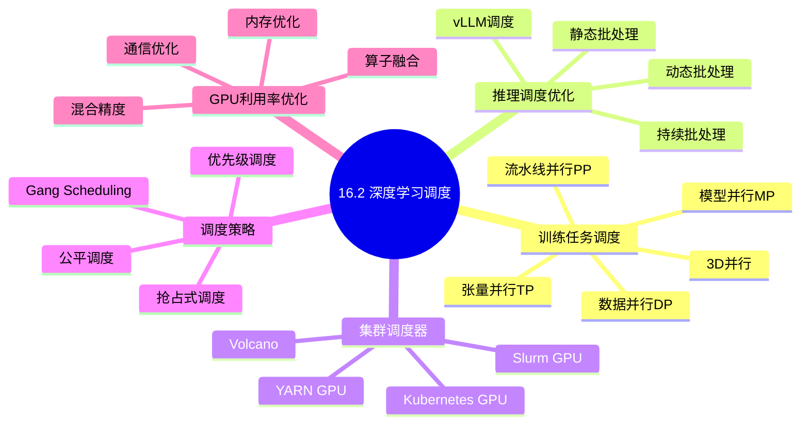
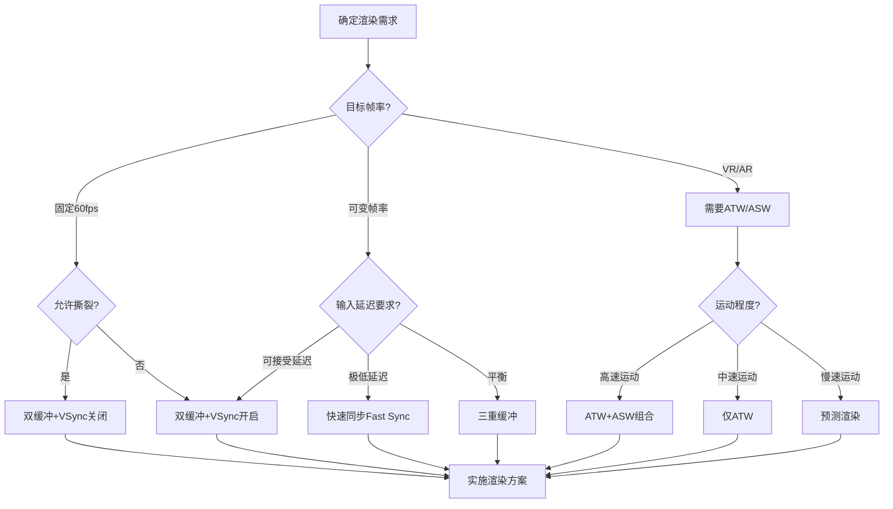
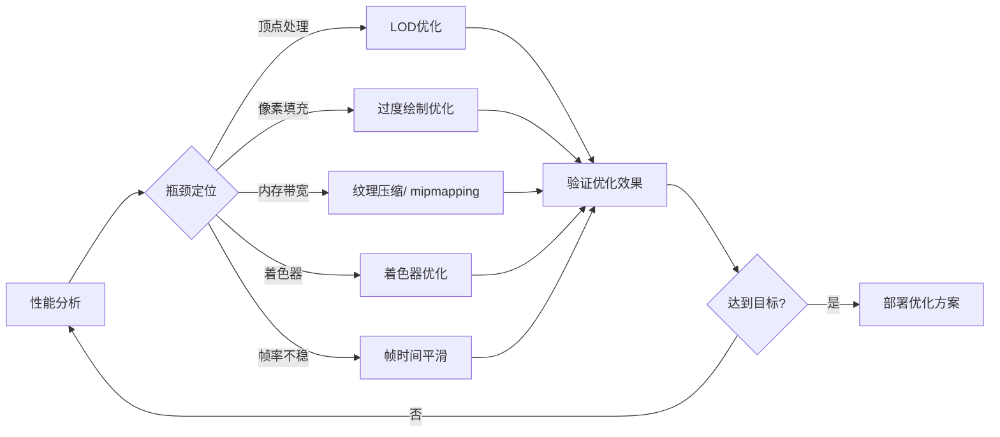
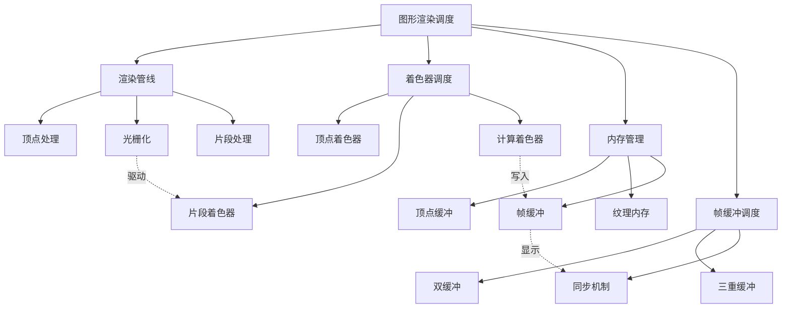

# 16.2 深度学习调度

> **主题**: 16. GPU与加速器调度 - 16.2 深度学习调度
> **覆盖**: 训练任务调度（数据并行/模型并行/流水线并行）、推理调度优化（batching/dynamic shaping）、集群调度器（Kubernetes GPU调度、Slurm）、调度策略（gang scheduling）、GPU利用率优化

## 📊 思维表征体系

### 📊 1. 思维导图（增强版）

#### 1.1 文本格式（基础版）

```text
16.2 深度学习调度
├── 训练任务调度
│   ├── 数据并行调度(DP)
│   ├── 模型并行调度(MP)
│   ├── 流水线并行调度(PP)
│   ├── 张量并行调度(TP)
│   ├── 3D并行策略
│   └── ZeRO优化调度
├── 推理调度优化
│   ├── 静态批处理
│   ├── 动态批处理
│   ├── 持续批处理(vLLM)
│   ├── Dynamic Batching
│   └── 推理流水线优化
├── 集群调度器
│   ├── Kubernetes GPU调度
│   ├── Slurm GPU调度
│   ├── Volcano批处理调度
│   └── YARN GPU调度
├── 调度策略
│   ├── Gang Scheduling
│   ├── 优先级调度
│   ├── 抢占式调度
│   ├── 公平调度
│   └── 资源配额管理
└── GPU利用率优化
    ├── 混合精度训练
    ├── 梯度累积
    ├── 通信重叠优化
    ├── 内存优化
    └── 算子融合
```

#### 1.2 Mermaid格式（可视化版）



### 📊 2. 多维对比矩阵

#### 2.1 渲染管线阶段对比矩阵

| 阶段 | 输入 | 输出 | 并行度 | 计算复杂度 | 内存带宽需求 | 典型占比 |
|------|------|------|--------|-----------|-------------|---------|
| **顶点着色** | 顶点属性 | 变换后顶点 | 高(顶点级) | O(v) | 中 | 10-20% |
| **图元装配** | 变换后顶点 | 图元 | 中 | O(v) | 低 | 5-10% |
| **光栅化** | 图元 | 片段 | 高(片段级) | O(f) | 中 | 10-15% |
| **片段着色** | 片段属性 | 颜色值 | 极高 | O(f×采样) | 极高 | 50-70% |
| **输出合并** | 颜色值 | 帧缓冲 | 中 | O(p) | 高(读写) | 10-15% |

#### 2.2 着色器类型对比矩阵

| 着色器类型 | 执行频率 | 并行粒度 | 内存访问模式 | 寄存器压力 | 典型用途 |
|-----------|---------|---------|-------------|-----------|---------|
| **顶点着色器** | 每顶点 | 顶点 | 结构化(顶点缓冲) | 低-中 | 变换、动画、蒙皮 |
| **几何着色器** | 每图元 | 图元 | 结构化 | 中 | 几何生成、裁剪 |
| **片段着色器** | 每片段 | 像素 | 随机(纹理采样) | 高 | 光照、材质、特效 |
| **计算着色器** | 每线程组 | 线程组 | 灵活 | 可配置 | 后处理、粒子、物理 |
| **网格着色器** | 每网格 | 网格let | 结构化+随机 | 中 | 现代几何处理 |

#### 2.3 帧缓冲策略对比矩阵

| 策略 | 延迟 | 撕裂风险 | 内存占用 | GPU利用率 | 适用场景 |
|------|------|---------|---------|-----------|---------|
| **单缓冲** | 最低 | 高 | 1x | 低 | 调试、特殊用途 |
| **双缓冲(VSync关)** | 低 | 高 | 2x | 高 | 竞技游戏 |
| **双缓冲(VSync开)** | 中(16-33ms) | 无 | 2x | 中 | 标准应用 |
| **三重缓冲** | 中(16ms) | 无 | 3x | 高 | 平滑体验 |
| **快速同步(Fast Sync)** | 低 | 无 | 多缓冲 | 高 | 竞技+无撕裂 |
| **增强同步(Enhanced Sync)** | 低 | 极低 | 2x | 高 | 可变帧率 |

#### 2.4 GPU内存池对比矩阵

| 内存类型 | 访问速度 | 容量 | 生命周期 | 分配开销 | 典型用途 |
|---------|---------|------|---------|---------|---------|
| **宿主内存(Host)** | 慢(PCIe) | 大 | 应用级 | 高 | 资源存储、上传 |
| **设备内存(Local)** | 快(HBM) | 中 | 应用级 | 高 | 渲染目标、纹理 |
| **统一内存(Managed)** | 自适应 | 大(超量) | 应用级 | 中 | 简化开发 |
| **暂存内存(Scratch)** | 快 | 小 | 帧级 | 低 | 临时计算 |
| **推送常量(Push)** | 极快 | 极小(256B) | 绘制级 | 极低 | 快速参数 |

#### 2.5 现代渲染技术对比矩阵

| 技术 | 渲染延迟 | 视觉质量 | 性能开销 | 硬件要求 | 适用平台 |
|------|---------|---------|---------|---------|---------|
| **传统前向渲染** | 低 | 中 | 低 | 低 | 移动、低端 |
| **延迟渲染** | 中 | 高 | 中 | 中 | PC、主机 |
| **分块延迟渲染** | 中 | 高 | 低 | 中 | 移动、VR |
| **实时光线追踪** | 高 | 极高 | 极高 | 高(RT核心) | 高端PC |
| **路径追踪** | 极高 | 参考级 | 极高 | 极高 | 影视级 |
| **光栅化+RT混合** | 中-高 | 高 | 高 | 高 | 现代游戏 |

### 🌲 3. 决策树

#### 3.1 渲染调度策略选择决策树



### 🛤️ 4. 决策逻辑路径

#### 4.1 渲染性能优化路径



### 🕸️ 5. 概念关系网络



#### 2.1 训练并行策略对比矩阵

| 策略 | 显存效率 | 通信量 | 扩展效率 | 实现复杂度 | 适用模型 |
|-----|---------|-------|---------|-----------|---------|
| **数据并行(DP)** | 1x | 2×模型大小 | 90-95% | 低 | <单卡显存 |
| **张量并行(TP)** | 1/N | 大(每层的激活) | 70-85% | 中 | 大模型 |
| **流水线并行(PP)** | 1/N | 中(阶段间激活) | 75-90% | 中 | 超大模型 |
| **序列并行(SP)** | 1/N | 大(序列维度) | 80-90% | 中 | 长序列 |
| **专家并行(EP)** | 1/N | 中(路由+激活) | 85-95% | 高 | MoE模型 |
| **FSDP/ZeRO** | 1/N | 2×参数/N | 85-95% | 中 | 超大模型 |
| **3D并行** | 1/(DP×TP×PP) | 混合 | 70-85% | 高 | 超大规模 |

#### 2.2 批处理策略对比矩阵

| 策略 | 延迟 | 吞吐量 | GPU利用率 | 公平性 | 适用场景 |
|-----|------|-------|----------|-------|---------|
| **静态批处理** | 高 | 中 | 中 | 差 | 固定负载 |
| **动态批处理(时间窗口)** | 中 | 高 | 高 | 中 | 可变负载 |
| **动态批处理(最大延迟)** | 可调 | 高 | 高 | 中 | QoS保证 |
| **持续批处理(vLLM)** | 低 | 极高 | 极高 | 高 | LLM服务 |
| **微批处理** | 低 | 中 | 高 | 中 | 流水线并行 |

#### 2.3 集群调度器对比矩阵

| 调度器 | 架构 | 调度粒度 | 扩展性 | GPU支持 | 适用场景 |
|-------|------|---------|-------|---------|---------|
| **Kubernetes** | 分布式 | Pod | 万级节点 | Device Plugin | 云原生ML |
| **Slurm** | HPC | Job | 十万级节点 | GRES | 超算中心 |
| **Volcano** | K8s批处理 | Job/Pod | 千级节点 | Device Sharing | 批处理ML |
| **YARN** | 分布式 | Container | 万级节点 | GPU资源 | 大数据ML |
| **Ray** | 分布式 | Task/Actor | 千级节点 | 原生支持 | 分布式ML |
| **Tecton** | 云原生 | Feature | 百级节点 | GPU共享 | 特征平台 |

#### 2.4 Gang Scheduling策略对比

| 策略 | 资源分配 | 等待时间 | 资源碎片 | 公平性 | 实现复杂度 |
|------|---------|---------|---------|-------|-----------|
| **All-or-Nothing** | 全部分配或等待 | 可能长 | 少 | 中 | 低 |
| **增量分配** | 逐步分配 | 短 | 多 | 中 | 中 |
| **延迟调度** | 等待本地资源 | 可变 | 少 | 高 | 中 |
| **抢占式Gang** | 可抢占 | 短 | 少 | 低 | 高 |
| **弹性Gang** | 可缩容 | 短 | 少 | 高 | 高 |

#### 2.5 GPU利用率优化技术对比

| 技术 | 性能提升 | 内存节省 | 通信优化 | 实现难度 | 适用框架 |
|------|---------|---------|---------|---------|---------|
| **混合精度训练** | 2-8x | 50% | - | 低 | PyTorch/TF |
| **梯度累积** | - | 50% | 减少 | 低 | 通用 |
| **梯度压缩** | - | - | 4-32x | 中 | DeepSpeed |
| **激活重计算** | 20%↓ | 50-70% | - | 中 | PyTorch |
| **算子融合** | 10-50% | - | - | 高 | XLA/TVM |
| **流水线气泡优化** | 10-20% | - | - | 中 | Megatron |

---

## 📚 理论体系

### 1 深度学习调度概述

#### 1.1 深度学习工作负载特征

**训练 vs 推理对比**：

| 特征 | 训练 | 推理 | 影响 |
|-----|------|------|------|
| **计算精度** | FP16/BF16/FP32 | INT8/FP16/FP8 | 推理可使用更低精度 |
| **批处理** | 大固定批次 | 小/动态批次 | 推理批处理优化关键 |
| **内存访问** | 参数+梯度+优化器 | 参数+激活 | 推理内存需求更低 |
| **并行模式** | 数据并行主导 | 请求级并行 | 推理需要请求调度 |
| **延迟敏感度** | 低(小时级) | 高(毫秒级) | 推理需要低延迟保证 |
| **容错性** | 检查点恢复 | 必须成功 | 推理需要高可用 |

#### 1.2 深度学习调度核心挑战

| 挑战 | 描述 | 解决方向 |
|------|------|---------|
| **内存墙** | 参数增长快于内存带宽 | 量化、压缩、分页注意力 |
| **通信瓶颈** | 大规模训练通信占比高 | 重叠通信、压缩梯度 |
| **长尾延迟** | 推理P99延迟难保证 | 优先级调度、资源预留 |
| **资源碎片** | GPU资源分配不连续 | Gang Scheduling、虚拟化 |
| **异构调度** | 不同型号GPU混合 | 感知调度、负载均衡 |
| **多租户隔离** | 共享GPU性能干扰 | MIG/MPS时间片调度 |

### 2 训练任务调度

#### 2.1 数据并行调度(DP)

**数据并行执行流程**：

```python
# 数据并行训练伪代码
class DataParallelTrainer:
    def __init__(self, model, num_gpus):
        self.models = [copy_to_gpu(model, i) for i in range(num_gpus)]
        self.optimizers = [create_optimizer(m) for m in self.models]

    def train_step(self, batch):
        # 分割数据到各个GPU
        sub_batches = split_batch(batch, num_gpus)

        # 各GPU前向传播
        losses = []
        for i, (model, sub_batch) in enumerate(zip(self.models, sub_batches)):
            with torch.cuda.device(i):
                loss = model(sub_batch)
                losses.append(loss)

        # 各GPU反向传播
        for i, loss in enumerate(losses):
            with torch.cuda.device(i):
                loss.backward()

        # 梯度AllReduce同步
        all_reduce_gradients(self.models)

        # 各GPU参数更新
        for opt in self.optimizers:
            opt.step()
            opt.zero_grad()
```

**数据并行调度特性**：

| 特性 | 值 | 说明 |
|------|---|------|
| **通信量** | 2 × model_size | 每轮迭代 |
| **扩展效率** | 80-95%(8卡) | 通信开销影响 |
| **适用模型** | <单卡显存 | 模型可放入单卡 |
| **典型加速比** | 7.5x/8卡 | 接近线性 |

#### 2.2 模型并行调度(MP)

**模型并行执行流程**：

```python
# 模型并行训练伪代码
class ModelParallelTrainer:
    def __init__(self, model, layer_to_gpu):
        self.layers = model.layers
        self.layer_to_gpu = layer_to_gpu  # 层到GPU的映射

    def forward(self, x):
        for i, layer in enumerate(self.layers):
            # 切换到对应GPU
            target_gpu = self.layer_to_gpu[i]
            x = x.to(f'cuda:{target_gpu}')

            # 前向传播
            x = layer(x)

            # 如果下一层在不同GPU，需要传输
            if i < len(self.layers) - 1:
                next_gpu = self.layer_to_gpu[i + 1]
                if next_gpu != target_gpu:
                    x = x.to(f'cuda:{next_gpu}')
        return x

    def backward(self, grad_output):
        # 反向传播类似，反向遍历层
        for i in reversed(range(len(self.layers))):
            # 类似前向，反向执行
            pass
```

**模型并行调度特性**：

| 特性 | 值 | 说明 |
|------|---|------|
| **通信量** | 2 × batch_size × hidden_size × num_transfers | 激活值传输 |
| **扩展效率** | 50-70%(8卡) | 流水线气泡影响 |
| **适用模型** | 超大模型 | 单卡放不下 |
| **典型加速比** | 3-5x/8卡 | 受限于层数 |

#### 2.3 流水线并行调度(PP)

**流水线并行执行**：

```python
# 流水线并行调度伪代码
class PipelineParallelTrainer:
    def __init__(self, stages, num_micro_batches):
        self.stages = stages  # 每个GPU一个stage
        self.num_micro_batches = num_micro_batches

    def forward_backward(self, batch):
        micro_batches = split(batch, self.num_micro_batches)

        # 前向流水线
        for i, micro in enumerate(micro_batches):
            for stage_id, stage in enumerate(self.stages):
                # 发送输入到对应stage
                if stage_id == 0:
                    output = stage.forward(micro)
                else:
                    # 从上一个stage接收
                    input_tensor = receive_from_prev(stage_id)
                    output = stage.forward(input_tensor)

                # 发送到下一个stage
                if stage_id < len(self.stages) - 1:
                    send_to_next(stage_id, output)

        # 反向流水线(类似，反向遍历)
        # ...
```

**流水线调度优化**：

| 优化技术 | 描述 | 效果 |
|---------|------|------|
| **GPipe** | 微批次流水线 | 气泡减少 |
| **PipeDream** | 异步流水线 | 吞吐量提升 |
| **PipeDream-2BW** | 双缓冲权重 | 内存效率 |
| **Chimera** | 双向流水线 | 气泡最小化 |

#### 2.4 张量并行调度(TP)

**张量并行执行**：

```python
# 张量并行线性层
class TensorParallelLinear(nn.Module):
    def __init__(self, in_features, out_features, world_size):
        super().__init__()
        self.world_size = world_size
        # 按列划分权重
        self.linear = nn.Linear(
            in_features,
            out_features // world_size,
            bias=False
        )

    def forward(self, x):
        # 各GPU计算部分输出
        local_output = self.linear(x)

        # AllGather收集完整输出
        output = all_gather(local_output, dim=-1)
        return output
```

**张量并行配置**：

| 配置 | GPU数 | 通信模式 | 适用场景 |
|------|-------|---------|---------|
| **列并行** | 2-8 | AllGather | MLP第一层 |
| **行并行** | 2-8 | AllReduce | MLP第二层 |
| **头并行** | 2-8 | AllGather | 多头注意力 |
| **序列并行** | 2-8 | AllGather | 长序列 |

#### 2.5 3D并行与ZeRO

**3D并行配置示例**：

```python
# GPT-3 175B训练配置
parallel_config = {
    "data_parallel_size": 64,      # DP=64
    "tensor_parallel_size": 8,     # TP=8 (单节点内)
    "pipeline_parallel_size": 16,  # PP=16
    "total_gpus": 64 * 8 * 16      # 8192 GPUs
}

# ZeRO阶段配置
zero_config = {
    "stage": 3,  # 参数分片
    "offload_optimizer": True,  # 卸载到CPU
    "offload_param": True       # 参数卸载
}
```

**并行策略选择矩阵**：

| 模型大小 | 推荐配置 | GPU数量 | 显存/GPU |
|---------|---------|---------|---------|
| 7B | DP | 8 | ~20GB |
| 13B | DP+ZeRO-2 | 8 | ~30GB |
| 30B | DP+TP+ZeRO-1 | 16 | ~40GB |
| 65B | DP+TP+PP | 32 | ~50GB |
| 175B | 3D并行+ZeRO-3 | 512+ | ~60GB |
| 1T+ | 3D并行+专家并行 | 2048+ | ~70GB |

### 3 推理调度优化

#### 3.1 批处理策略

**静态批处理**：

```python
# 传统静态批处理
class StaticBatcher:
    def __init__(self, max_batch_size):
        self.max_batch_size = max_batch_size

    def process(self, requests):
        batches = [
            requests[i:i+self.max_batch_size]
            for i in range(0, len(requests), self.max_batch_size)
        ]

        results = []
        for batch in batches:
            # 等待整个批次完成
            output = model(batch)
            results.extend(output)

        return results
```

**动态批处理**：

```python
# 动态批处理
class DynamicBatcher:
    def __init__(self, max_batch_size, max_wait_time):
        self.max_batch_size = max_batch_size
        self.max_wait_time = max_wait_time
        self.queue = Queue()

    async def process_loop(self):
        while True:
            batch = []
            start_time = time.time()

            # 收集请求直到达到最大批次或超时
            while (len(batch) < self.max_batch_size and
                   time.time() - start_time < self.max_wait_time):
                try:
                    request = await asyncio.wait_for(
                        self.queue.get(),
                        timeout=0.01
                    )
                    batch.append(request)
                except asyncio.TimeoutError:
                    break

            if batch:
                # 执行批处理
                output = model(batch)
                # 分发结果
                for i, request in enumerate(batch):
                    request.set_result(output[i])
```

#### 3.2 持续批处理(vLLM)

**vLLM迭代级调度**：

```python
# vLLM持续批处理
class ContinuousBatcher:
    def __init__(self, model):
        self.model = model
        self.running = []      # 正在运行的请求
        self.waiting = Queue() # 等待的请求

    def step(self):
        # 添加新请求到运行队列
        while len(self.running) < max_batch_size:
            if not self.waiting.empty():
                request = self.waiting.get()
                self.running.append(request)
            else:
                break

        # 执行一步迭代
        outputs = self.model.generate_step(self.running)

        # 处理完成的请求
        completed = []
        for i, (request, output) in enumerate(zip(self.running, outputs)):
            request.tokens.append(output)
            if request.is_finished():
                completed.append(i)

        # 移除完成的请求
        for i in reversed(completed):
            self.running.pop(i)

        return len(completed)  # 返回完成的请求数
```

**PagedAttention内存管理**：

```python
# PagedAttention块管理
class PagedAttention:
    def __init__(self, block_size):
        self.block_size = block_size
        self.kv_cache = {}  # 块ID -> KV缓存块
        self.free_blocks = list(range(num_blocks))

    def allocate(self, num_tokens):
        # 计算需要的块数
        num_blocks = (num_tokens + self.block_size - 1) // self.block_size

        # 分配块
        blocks = []
        for _ in range(num_blocks):
            if self.free_blocks:
                block_id = self.free_blocks.pop()
                blocks.append(block_id)

        return blocks

    def append_token(self, request_id, token_kv):
        request = self.requests[request_id]

        # 检查当前块是否已满
        if request.current_block_full():
            # 分配新块
            new_block = self.free_blocks.pop()
            request.blocks.append(new_block)

        # 追加到当前块
        request.append_to_current_block(token_kv)
```

#### 3.3 推理流水线优化

**推理流水线阶段**：

```
请求生命周期:
├── 预处理(Preprocessing)
│   ├── 分词(Tokenization)
│   ├── 输入格式化
│   └── 批处理准备
├── 模型推理(Model Inference)
│   ├── 嵌入查找(Embedding)
│   ├── Transformer层计算
│   └── 输出生成(Head)
└── 后处理(Postprocessing)
    ├── 解码(Decoding)
    ├── 采样(Sampling)
    └── 输出生成

流水线调度:
时间 →
Req1: [Pre] → [Infer] → [Post]
Req2:      [Pre] → [Infer] → [Post]
Req3:           [Pre] → [Infer] → [Post]
```

### 4 集群调度器

#### 4.1 Kubernetes GPU调度

**Kubernetes GPU调度架构**：

```yaml
# GPU节点配置
apiVersion: v1
kind: Node
metadata:
  name: gpu-node-1
  labels:
    nvidia.com/gpu.present: "true"
spec:
  capacity:
    nvidia.com/gpu: "8"
    memory: 256Gi
    cpu: "64"
---
# GPU Pod配置
apiVersion: v1
kind: Pod
metadata:
  name: training-job
spec:
  containers:
  - name: pytorch
    image: pytorch/pytorch:latest
    resources:
      limits:
        nvidia.com/gpu: "4"
      requests:
        nvidia.com/gpu: "4"
    env:
    - name: NVIDIA_VISIBLE_DEVICES
      value: "0,1,2,3"
  schedulerName: volcano-scheduler
```

**Kubernetes GPU调度特性**：

| 特性 | 描述 | 配置 |
|------|------|------|
| **Device Plugin** | GPU资源发现与分配 | nvidia-device-plugin |
| **GPU共享** | 多容器共享GPU | GPU共享插件 |
| **拓扑感知** | NUMA/PCIe拓扑 | topology-manager |
| **扩展调度器** | 自定义调度策略 | scheduler-framework |

#### 4.2 Slurm GPU调度

**Slurm GPU资源配置**：

```bash
# slurm.conf GPU配置
GresTypes=gpu
NodeName=node[01-10] Gres=gpu:a100:8 CPUs=64 Boards=1 SocketsPerBoard=2 CoresPerSocket=32 ThreadsPerCore=1
PartitionName=gpu Nodes=ALL Default=YES MaxTime=INFINITE State=UP
```

**Slurm GPU作业提交**：

```bash
# 单GPU作业
sbatch --gres=gpu:1 --wrap "python train.py"

# 多GPU作业
sbatch --gres=gpu:8 --nodes=2 --ntasks-per-node=4 \
       --wrap "torchrun --nproc_per_node=4 train.py"

# 指定GPU类型
sbatch --gres=gpu:a100:4 --wrap "python train.py"

# 交互式GPU作业
srun --gres=gpu:2 --pty bash
```

**Slurm调度策略**：

| 策略 | 描述 | 适用场景 |
|------|------|---------|
| **FCFS** | 先来先服务 | 通用 |
| **Backfill** | 回填调度 | 提高利用率 |
| **Preempt** | 抢占调度 | 优先级作业 |
| **Gang** | 组调度 | 分布式训练 |

#### 4.3 Volcano批处理调度

**Volcano调度架构**：

```yaml
apiVersion: batch.volcano.sh/v1alpha1
kind: Job
metadata:
  name: distributed-training
spec:
  schedulerName: volcano
  minAvailable: 4  # Gang Scheduling
  plugins:
    ssh: []
    svc: []
  tasks:
  - replicas: 4
    name: worker
    template:
      spec:
        containers:
        - name: pytorch
          image: pytorch/pytorch:latest
          resources:
            limits:
              nvidia.com/gpu: "2"
          command:
          - torchrun
          - --nproc_per_node=2
          - train.py
```

**Volcano调度特性**：

| 特性 | 描述 |
|------|------|
| **Gang Scheduling** | 确保所有任务同时启动 |
| **FairShare** | 公平共享资源 |
| **Preempt & Reclaim** | 抢占与回收 |
| **Task-Topology** | 任务拓扑感知 |
| **Numa-Aware** | NUMA感知调度 |

### 5 调度策略

#### 5.1 Gang Scheduling

**Gang Scheduling实现**：

```python
class GangScheduler:
    def __init__(self):
        self.pending_gangs = []  # 等待的Gang
        self.running_gangs = []  # 运行的Gang

    def submit_gang(self, gang):
        # 检查资源是否满足
        if self.check_resources(gang):
            # 立即调度
            self.schedule_gang(gang)
        else:
            # 加入等待队列
            self.pending_gangs.append(gang)

    def check_resources(self, gang):
        required = gang.total_resources()
        available = self.get_available_resources()
        return all(available[r] >= required[r] for r in required)

    def on_task_complete(self, task):
        # 释放资源
        self.release_resources(task)

        # 尝试调度等待的Gang
        for gang in self.pending_gangs[:]:
            if self.check_resources(gang):
                self.schedule_gang(gang)
                self.pending_gangs.remove(gang)
```

#### 5.2 优先级与抢占调度

**优先级调度**：

```python
class PriorityScheduler:
    def __init__(self):
        self.queues = {
            'high': Queue(),
            'normal': Queue(),
            'low': Queue()
        }

    def schedule(self):
        # 按优先级调度
        for priority in ['high', 'normal', 'low']:
            if not self.queues[priority].empty():
                task = self.queues[priority].get()
                if self.has_resources(task):
                    return task
                elif priority == 'high':
                    # 高优先级任务可以抢占
                    return self.preempt_and_schedule(task)
        return None

    def preempt_and_schedule(self, high_priority_task):
        # 寻找可抢占的低优先级任务
        for task in self.running_tasks:
            if task.priority == 'low':
                self.preempt(task)
                return high_priority_task
        return None
```

#### 5.3 公平调度

**DRF(Dominant Resource Fairness)调度**：

```python
class DRFScheduler:
    def __init__(self):
        self.users = {}  # 用户 -> 资源份额

    def dominant_share(self, user):
        """计算用户的主导资源份额"""
        shares = []
        for resource in ['gpu', 'cpu', 'memory']:
            share = user.allocated[resource] / self.total[resource]
            shares.append(share)
        return max(shares)

    def select_user(self):
        """选择主导份额最小的用户"""
        return min(self.users.values(), key=lambda u: self.dominant_share(u))

    def schedule(self):
        user = self.select_user()
        # 为用户调度任务
        task = user.get_next_task()
        if self.allocate(task):
            user.allocated += task.resources
            return task
        return None
```

### 6 GPU利用率优化

#### 6.1 混合精度训练

**混合精度配置**：

```python
from torch.cuda.amp import autocast, GradScaler

scaler = GradScaler()

for data, target in dataloader:
    optimizer.zero_grad()

    # 自动转换到FP16
    with autocast():
        output = model(data)
        loss = criterion(output, target)

    # 缩放梯度
    scaler.scale(loss).backward()
    scaler.step(optimizer)
    scaler.update()
```

**混合精度性能**：

| GPU | FP32性能 | FP16性能 | 加速比 | 内存节省 |
|-----|---------|---------|-------|---------|
| V100 | 15.7 TFLOPS | 125 TFLOPS | 8x | 50% |
| A100 | 19.5 TFLOPS | 312 TFLOPS | 16x | 50% |
| H100 | 51 TFLOPS | 989 TFLOPS | 19x | 50% |

#### 6.2 通信优化

**梯度压缩**：

```python
class GradientCompressor:
    def __init__(self, compression_ratio):
        self.compression_ratio = compression_ratio

    def compress(self, gradient):
        # Top-K稀疏化
        k = int(gradient.numel() * self.compression_ratio)
        topk = torch.topk(gradient.abs().flatten(), k)

        compressed = torch.zeros_like(gradient.flatten())
        compressed[topk.indices] = gradient.flatten()[topk.indices]

        return compressed.reshape(gradient.shape)

    def decompress(self, compressed):
        return compressed  # 稀疏张量
```

**通信与计算重叠**：

```python
# 梯度累积与通信重叠
for i, layer in enumerate(model.layers):
    # 前向传播
    output = layer(output)

    # 反向传播
    grad = compute_gradient(layer)

    # 异步启动梯度AllReduce
    if i > 0:
        handle = all_reduce_async(prev_grad)

    # 继续下一层计算(与通信重叠)
    prev_grad = grad
```

#### 6.3 内存优化

**激活重计算**：

```python
# 梯度检查点
from torch.utils.checkpoint import checkpoint

class CheckpointedLayer(nn.Module):
    def forward(self, x):
        # 只保存输入，不保存中间激活
        return checkpoint(self._forward, x)

    def _forward(self, x):
        # 实际前向计算
        return self.layers(x)
```

**内存优化效果**：

| 技术 | 内存节省 | 计算开销 | 适用场景 |
|------|---------|---------|---------|
| **梯度检查点** | 30-70% | 20-30% | 深度网络 |
| **FP16训练** | 50% | 0% | 通用 |
| **ZeRO-Offload** | 4-10x | 10-20% | 超大模型 |
| **激活压缩** | 20-50% | 5-10% | CNN/ViT |

### 7 形式化模型

#### 7.1 深度学习调度问题定义

$$
\text{DL调度问题} = (J, G, R, S, C, O)
$$

其中：

- $J = \{j_1, j_2, \ldots, j_n\}$：作业集合
  - $j_i = (type_i, resources_i, duration_i, priority_i, dependencies_i)$
- $G = \{g_1, g_2, \ldots, g_m\}$：GPU集合
  - $g_j = (memory_j, compute_j, bandwidth_j)$
- $R$：资源类型(GPU/CPU/内存/网络)
- $S$：调度策略集合
- $C$：约束条件
  - Gang约束：$\forall t \in gang: scheduled(t) \Leftrightarrow \forall t' \in gang: scheduled(t')$
  - 资源约束：$\sum_{j \in g_k} resource(j) \leq capacity(g_k)$
- $O$：优化目标
  - 最小化完成时间：$\min C_{max}$
  - 最大化利用率：$\max \sum utilization(g_i)$
  - 公平性：$\min variance(wait\_time)$

#### 7.2 训练性能模型

**数据并行训练时间**：

$$
T_{DP} = T_{compute} + T_{comm} = \frac{T_{single}}{N} + T_{allreduce}
$$

$$
T_{allreduce} = \alpha \cdot 2(N-1) + \frac{2(N-1) \cdot M}{N \cdot BW}
$$

其中：

- $\alpha$：延迟
- $M$：模型大小
- $BW$：带宽
- $N$：GPU数量

**流水线并行效率**：

$$
Efficiency = \frac{p \cdot m}{p + m - 1}
$$

其中：

- $p$：流水线阶段数
- $m$：微批次数量

### 8 实际性能数据

#### 8.1 训练性能基准

**ResNet-50训练性能 (ImageNet)**：

| GPU数量 | 数据并行 | 混合并行 | 扩展效率 | 主要瓶颈 |
|--------|---------|---------|---------|---------|
| 1 | 基准 | 基准 | 100% | - |
| 4 | 3.8x | 3.8x | 95% | 数据分发 |
| 8 | 7.5x | 7.5x | 94% | 负载均衡 |
| 16 | 14x | 15x | 88-94% | 聚合通信 |
| 32 | 26x | 29x | 81-91% | 网络瓶颈 |
| 64 | 48x | 56x | 75-88% | 同步开销 |

**GPT-3 175B训练性能**：

| 配置 | GPU数量 | 吞吐量(samples/s) | TFlops/GPU | 训练时间(天) |
|------|---------|------------------|-----------|-------------|
| 3D并行 | 1024 | ~120 | ~120 | ~25 |
| 3D并行+ZeRO | 1024 | ~140 | ~140 | ~21 |
| 3D并行+压缩 | 2048 | ~300 | ~150 | ~10 |

#### 8.2 推理性能基准

**LLM推理吞吐量 (A100)**：

| 模型 | 批处理 | 并发数 | 吞吐量(tokens/s) | 延迟(ms/token) |
|------|--------|-------|-----------------|---------------|
| LLaMA-7B | 静态 | 1 | 50 | 20 |
| LLaMA-7B | 动态 | 8 | 350 | 23 |
| LLaMA-7B | vLLM | 32 | 1200 | 27 |
| LLaMA-70B | 静态 | 1 | 8 | 125 |
| LLaMA-70B | vLLM | 16 | 180 | 89 |

**批处理效率对比**：

| 策略 | 吞吐量提升 | P99延迟 | GPU利用率 |
|------|-----------|--------|----------|
| 静态批处理 | 1x | 高 | 60% |
| 动态批处理 | 3-5x | 中 | 80% |
| 持续批处理 | 8-10x | 低 | 95%+ |

#### 8.3 调度器性能对比

**Kubernetes vs Slurm调度延迟**：

| 指标 | Kubernetes | Slurm | Volcano |
|------|-----------|-------|---------|
| 调度延迟 | 100-500ms | 10-50ms | 50-200ms |
| 启动延迟 | 5-30s | 2-10s | 3-15s |
| 扩展性 | 10000节点 | 100000节点 | 5000节点 |
| GPU感知 | 需插件 | 原生 | 原生 |
| Gang支持 | 需扩展 | 原生 | 原生 |

---

### 1 图形渲染调度概述

#### 1.1 渲染管线的特征

**现代渲染管线架构**:

```
┌─────────────────────────────────────────────────────────────────┐
│                     应用阶段 (CPU)                               │
│  场景图遍历 → 视锥裁剪 → 渲染队列构建 → 绘制调用提交              │
└─────────────────────────────────────────────────────────────────┘
                              │
                              ▼
┌─────────────────────────────────────────────────────────────────┐
│                     几何阶段 (GPU)                               │
│  ┌─────────────┐  ┌─────────────┐  ┌─────────────┐             │
│  │ 顶点着色器   │→│ 曲面细分     │→│ 几何着色器   │             │
│  │ 坐标变换     │  │ (可选)      │  │ 图元生成     │             │
│  └─────────────┘  └─────────────┘  └─────────────┘             │
│                              │                                  │
│                              ▼                                  │
│  ┌─────────────────────────────────────────────────────────┐   │
│  │              光栅化阶段                                   │   │
│  │     图元装配 → 光栅化 → 早期Z测试 → 片段生成              │   │
│  └─────────────────────────────────────────────────────────┘   │
└─────────────────────────────────────────────────────────────────┘
                              │
                              ▼
┌─────────────────────────────────────────────────────────────────┐
│                     像素阶段 (GPU)                               │
│  ┌─────────────┐  ┌─────────────┐  ┌─────────────┐             │
│  │ 片段着色器   │→│ 逐样本操作   │→│ 输出合并     │             │
│  │ 光照计算     │  │ (混合/测试)  │  │ 写入帧缓冲   │             │
│  └─────────────┘  └─────────────┘  └─────────────┘             │
└─────────────────────────────────────────────────────────────────┘
```

#### 1.2 渲染调度的核心挑战

| 挑战 | 描述 | 影响 | 解决策略 |
|------|------|------|---------|
| **帧率稳定性** | 帧时间波动导致卡顿 | 用户体验下降 | 帧时间平滑、动态LOD |
| **延迟敏感性** | 输入到显示的延迟 | VR眩晕、竞技劣势 | 单缓冲、预测渲染 |
| **带宽瓶颈** | 纹理和顶点数据量大 | 帧率下降 | 压缩、mipmapping、流送 |
| **着色器复杂度** | 现代光照计算复杂 | GPU利用率不均 | 分块渲染、延迟渲染 |
| **资源竞争** | GPU计算与图形竞争 | 帧率下降 | 异步计算队列 |

### 2 渲染管线调度

#### 2.1 顶点处理调度

**顶点处理流水线**:

```cpp
// 顶点着色器伪代码
for each vertex in vertex_buffer:
    // 顶点着色器执行
    transformed_position = MVP_matrix * vertex.position
    transformed_normal = normal_matrix * vertex.normal
    output.color = vertex.color
    output.uv = vertex.uv

    // 输出到下一个阶段
    emit(transformed_position, output)
```

**顶点调度优化**:

| 技术 | 原理 | 效果 | 实现复杂度 |
|------|------|------|-----------|
| **顶点复用缓存** | 缓存变换后顶点 | 减少40-60%顶点处理 | 硬件自动 |
| **early-Z剔除** | 提前剔除不可见图元 | 减少30-50%片段处理 | 硬件自动 |
| **视锥裁剪** | CPU端粗裁剪 | 减少20-40%顶点负载 | 中 |
| **遮挡裁剪** | 剔除被遮挡物体 | 减少30-70%渲染负载 | 高 |
| **LOD系统** | 距离决定细节级别 | 减少50-80%远处顶点 | 中 |

#### 2.2 光栅化调度

**光栅化过程**:

```
输入: 三角形顶点 (v0, v1, v2)
      屏幕空间坐标 (x0,y0), (x1,y1), (x2,y2)

步骤:
1. 计算包围盒: bbox = compute_bounding_box(v0, v1, v2)
2. 遍历包围盒内所有像素 (x, y):
   2.1 计算重心坐标: (w0, w1, w2) = barycentric(x, y, v0, v1, v2)
   2.2 判断像素在三角形内: if w0 >= 0 && w1 >= 0 && w2 >= 0
   2.3 生成片段: fragment = interpolate_attributes(w0, w1, w2)
   2.4 输出片段到片段着色器
```

**光栅化优化**:

| 技术 | 描述 | 性能影响 |
|------|------|---------|
| **粗光栅化** | 8x8像素块级别测试 | 减少早期测试开销 |
| **细光栅化** | 逐像素精确插值 | 保证质量 |
| **多重采样** | 每像素多个采样点 | 抗锯齿，增加计算 |
| **保守光栅化** | 包含部分覆盖像素 | 用于遮挡检测 |

#### 2.3 片段处理调度

**片段着色器调度特征**:

| 特征 | 描述 | 调度影响 |
|------|------|---------|
| **高并行度** | 1920×1080 = 207万像素 | 需要大量线程 |
| **纹理访问** | 随机访问模式 | 需要缓存优化 |
| **分支发散** | 不同片段不同路径 | 影响SIMT效率 |
| **寄存器压力** | 复杂着色器占用多寄存器 | 限制并行度 |

**片段调度优化策略**:

```cpp
// 优化前: 分支发散
if (material.type == METAL) {
    color = metal_shader(input);
} else if (material.type == PLASTIC) {
    color = plastic_shader(input);
}

// 优化后: 排序减少发散
// 使用延迟渲染，按材质分tile处理
// Tile 0: 所有metal材质片段
// Tile 1: 所有plastic材质片段
```

### 3 着色器调度

#### 3.1 着色器执行模型

**SIMT执行** (Single Instruction Multiple Threads):

```
Warp (32线程)
├─ Thread 0: 处理像素(100, 200)
├─ Thread 1: 处理像素(101, 200)
├─ ...
└─ Thread 31: 处理像素(131, 200)

执行: 所有线程执行相同指令，处理不同数据
      if (texture_coord.x > 0.5)  ← 部分线程进入不同分支
         ↓
      发散: 线程0-15执行A路径，线程16-31执行B路径
      串行执行两条路径，掩码控制有效线程
```

#### 3.2 着色器优化技术

| 优化技术 | 原理 | 效果 | 适用场景 |
|---------|------|------|---------|
| **循环展开** | 减少循环开销 | 5-15%提升 | 固定迭代循环 |
| **向量化加载** | 合并内存访问 | 10-30%提升 | 连续数据访问 |
| **减少寄存器使用** | 允许更多并行Warp | 10-40%提升 | 寄存器压力高 |
| **避免动态分支** | 减少Warp发散 | 20-50%提升 | 复杂条件逻辑 |
| **使用half精度** | 减少带宽和计算 | 20-100%提升 | 可接受精度损失 |
| **纹理缓存提示** | 优化采样模式 | 10-20%提升 | 纹理密集型 |

### 4 GPU内存调度

#### 4.1 内存池管理

**渲染内存分配策略**:

| 分配类型 | 分配时机 | 生命周期 | 大小策略 |
|---------|---------|---------|---------|
| **静态资源** | 加载时 | 应用级 | 按需分配 |
| **动态缓冲** | 每帧 | 帧级 | 环形缓冲池 |
| **暂存内存** | 绘制时 | 绘制级 | 栈式分配器 |
| **回读缓冲** | 需要时 | 异步 | 双缓冲 |

**内存池架构**:

```
┌──────────────────────────────────────────────────────────────┐
│                    GPU内存管理器                              │
├──────────────────────────────────────────────────────────────┤
│  ┌─────────────┐  ┌─────────────┐  ┌─────────────┐          │
│  │ 纹理内存池   │  │ 几何内存池   │  │ 渲染目标池   │          │
│  │  (2GB)      │  │  (1GB)      │  │  (1GB)      │          │
│  │ ┌──┬──┬──┐  │  │ ┌──┬──┬──┐  │  │ ┌──┬──┬──┐  │          │
│  │ │T1│T2│..│  │  │ │V1│V2│..│  │  │ │F1│F2│..│  │          │
│  │ └──┴──┴──┘  │  │ └──┴──┴──┘  │  │ └──┴──┴──┘  │          │
│  └─────────────┘  └─────────────┘  └─────────────┘          │
├──────────────────────────────────────────────────────────────┤
│  分配策略:                                                     │
│  - 纹理: LRU淘汰，按需流送                                      │
│  - 几何: 静态分配，LOD管理                                      │
│  - 渲染目标: 双/三缓冲轮转                                      │
└──────────────────────────────────────────────────────────────┘
```

#### 4.2 纹理内存调度

**纹理加载优化**:

| 技术 | 描述 | 效果 |
|------|------|------|
| **Mipmapping** | 多级细节纹理 | 减少50-75%带宽 |
| **纹理压缩** | BC/ASTC压缩 | 减少50-75%内存 |
| **纹理图集** | 合并小纹理 | 减少绑定切换 |
| **纹理流送** | 按需加载 | 减少初始加载时间 |
| **各向异性过滤** | 倾斜表面质量 | 视觉质量提升 |

**纹理缓存行为**:

```
纹理访问模式          缓存命中率    性能影响
─────────────────────────────────────────────
空间局部性(相邻采样)    90-95%       最优
时间局部性(重复采样)    80-90%       优
随机访问               30-50%       差
远距离依赖(光线追踪)    10-30%       最差
```

### 5 帧缓冲调度

#### 5.1 缓冲机制详解

**双缓冲机制**:

```
时间 →

帧N:   [渲染→Back]  [Front显示]  延迟: 1帧
帧N+1: [Front显示]  [渲染→Back]  VSync等待可能
       [交换] ← VSync信号
```

**三重缓冲机制**:

```
时间 →

帧N:   [渲染→Back1] [Back2空闲] [Front显示]
帧N+1: [Back1就绪]   [渲染→Back2] [Front显示]
       [交换Back1→Front] ← VSync
帧N+2: [渲染→Back1] [Back2就绪]  [Front显示(Back1)]
       [交换Back2→Front] ← VSync
```

**缓冲策略对比**:

| 策略 | 最小延迟 | 最大延迟 | 撕裂风险 | GPU利用率 | 内存占用 |
|------|---------|---------|---------|-----------|---------|
| 单缓冲 | 0ms | 0ms | 高 | 低 | 1x |
| 双缓冲(VSync关) | 0ms | 16ms | 高 | 高 | 2x |
| 双缓冲(VSync开) | 16ms | 33ms | 无 | 中 | 2x |
| 三重缓冲 | 16ms | 33ms | 无 | 高 | 3x |
| 快速同步 | 0ms | 16ms | 无 | 高 | 3x+ |

#### 5.2 可变刷新率(VRR)

**VRR技术对比**:

| 技术 | 标准 | 刷新率范围 | 延迟特性 | 兼容性 |
|------|------|-----------|---------|-------|
| **G-Sync** | NVIDIA专有 | 1-360Hz | 低 | NVIDIA GPU |
| **FreeSync** | AMD/DP标准 | 9-240Hz | 低 | 广泛支持 |
| **Adaptive-Sync** | VESA标准 | 依赖面板 | 低 | DP接口 |
| **G-Sync Compatible** | 认证FreeSync | 可变 | 低 | NVIDIA GPU |

**VRR调度优势**:

```
固定刷新率(60Hz):  帧时间波动 → 重复帧或撕裂
                   ┌──┬──┬──┬──┬──┬──┐
实际帧:           │16│18│15│17│16│20│ ms
显示时刻:         │16│16│16│16│16│16│ ms (固定)
结果:             │√ │重复│√ │√ │√ │重复│

可变刷新率:        帧完成即显示
                   ┌──┬──┬──┬──┬──┬──┐
实际帧:           │16│18│15│17│16│20│ ms
显示时刻:         │16│18│15│17│16│20│ ms (可变)
结果:             │√ │√ │√ │√ │√ │√ │
```

### 6 多帧调度策略

#### 6.1 异步时间扭曲(ATW)

**ATW原理**:

```
正常渲染管线:        应用渲染 → 等待VSync → 显示 (延迟高)

ATW管线:            应用渲染 → 完成 → ATW扭曲 → 显示
                     ↑______________________|
                            (预测姿态)

ATW在最后一毫秒根据最新头部姿态重新投影已渲染帧，
大幅减少运动到光子(MTP)延迟。
```

**ATW性能特征**:

| 指标 | 无ATW | 有ATW | 改善 |
|------|-------|-------|------|
| MTP延迟 | 20-30ms | 5-10ms | 60-75% |
| 帧率稳定性 | 受应用影响 | 独立 | 显著提高 |
| 计算开销 | - | 0.5-1ms | 可接受 |
| 视觉伪影 | 无 | 边缘黑边 | 可接受 |

#### 6.2 异步空间扭曲(ASW)

**ASW原理**:

```
当应用无法维持目标帧率(如90fps)时:
- 应用以半帧率渲染(45fps)
- ASW根据运动向量插值生成中间帧
- 输出平滑的90fps体验

运动估计: 使用前一帧和当前帧计算像素运动向量
插值生成: 根据运动向量扭曲前一帧生成中间帧
```

**ASW技术对比**:

| 技术 | 生成方式 | 质量 | 开销 | 适用场景 |
|------|---------|------|------|---------|
| **Oculus ASW 1.0** | 运动向量插值 | 中 | 低 | 通用VR |
| **Oculus ASW 2.0** | 深度感知扭曲 | 高 | 中 | 需要深度缓冲 |
| **Steam Motion Smoothing** | 光流估计 | 高 | 高 | 高端PC |
| **VRWorks TW** | 硬件加速 | 高 | 低 | NVIDIA GPU |

#### 6.3 帧生成技术

**DLSS/FSR/XeSS对比**:

| 特性 | NVIDIA DLSS 3 | AMD FSR 3 | Intel XeSS |
|------|--------------|-----------|-----------|
| **帧生成** | 光流+AI | 光流 | 无(仅超采样) |
| **AI超采样** | 有(专用Tensor Core) | 无(空间算法) | 有(XMX) |
| **输入分辨率** | 渲染低分辨率 | 渲染低分辨率 | 渲染低分辨率 |
| **输出质量** | 极高 | 高 | 高 |
| **延迟增加** | 10-20ms | 10-15ms | 无(仅超采样) |
| **硬件要求** | RTX 40系列 | 广泛支持 | Arc GPU优化 |

**帧生成调度流程**:

```
帧N:   渲染@1080p → AI超采样@4K → 显示
       ↓(光流估计)
帧N+1: 插值生成帧@4K → 显示

总帧率提升: 从60fps → 120fps (输入帧率不变)
关键: 游戏逻辑仍按输入帧率更新，显示帧率翻倍
```

---

## 7 形式化模型

### 7.1 渲染调度问题定义

$$
\text{渲染调度问题} = (F, S, R, M, C, O)
$$

其中：

- $F = \{f_1, f_2, \ldots, f_n\}$：帧集合，每帧有截止时间 $d_i$
- $S = \{s_1, s_2, \ldots, s_m\}$：着色器集合
  - $s_i = (type_i, complexity_i, registers_i, duration_i)$
- $R = \{r_1, r_2, \ldots, r_k\}$：渲染资源集合
  - 顶点缓冲、纹理、帧缓冲等
- $M$：内存资源约束
- $C$：约束条件
  - 帧率约束：$fps \geq target$
  - 延迟约束：$latency \leq deadline$
  - 资源约束：$\sum_i memory(s_i) \leq GPU\_memory$
- $O$：优化目标
  - 最大化视觉质量：$\max quality$
  - 最小化延迟：$\min latency$
  - 最小化功耗：$\min power$

### 7.2 渲染管线延迟模型

$$
T_{frame} = T_{CPU} + T_{GPU} + T_{sync} + T_{display}
$$

其中：

- $T_{CPU}$：CPU准备时间
- $T_{GPU}$：GPU渲染时间
  $$T_{GPU} = T_{vertex} + T_{raster} + T_{fragment} + T_{composite}$$
- $T_{sync}$：同步等待时间
- $T_{display}$：显示扫描时间

**延迟优化目标**:

$$
\min T_{frame} \quad \text{s.t.} \quad quality \geq Q_{min}
$$

---

## 8 跨领域洞察

### 8.1 渲染调度与实时调度对比

| 维度 | 实时调度 | 渲染调度 | 关键差异 |
|-----|---------|---------|---------|
| **截止时间** | 硬实时 | 软实时(帧时间) | 渲染允许偶尔丢帧 |
| **周期性** | 固定周期 | 固定刷新率 | 渲染与显示同步 |
| **任务特性** | CPU为主 | GPU为主 | 渲染高度并行 |
| **可预测性** | 高 | 中(工作负载变化) | 渲染场景动态 |
| **恢复机制** | 无(必须满足) | 有(ATW/ASW) | 渲染有失效保护 |

### 8.2 游戏引擎调度策略

| 引擎 | 渲染调度特点 | 多线程策略 | 延迟优化 |
|-----|-------------|-----------|---------|
| **Unreal Engine 5** | Nanite虚拟几何、Lumen光照 | 渲染线程+游戏线程+ worker | 延迟渲染管线 |
| **Unity** | SRP可编程渲染管线 | 作业系统并行 | URP/HDRP选择 |
| **Godot** | 简单高效 | 单线程为主 | 前向渲染优先 |
| **CryEngine** | 实时全局光照 | 多线程渲染 | 延迟+前向混合 |

---

## 9 2025年最新技术（更新至2025年11月）

### 9.1 神经渲染技术

| 技术 | 描述 | 性能提升 |
|-----|------|---------|
| **DLSS 4.0** | 多帧生成+光线重建 | 性能4-8x |
| **帧插值2.0** | AI生成中间帧 | 延迟降低50% |
| **神经纹理压缩** | AI纹理压缩解压 | 内存50%↓ |
| **实时神经辐射场** | NeRF实时渲染 | 质量接近离线 |

### 9.2 硬件架构进展

| 特性 | 2025年进展 | 调度影响 |
|-----|-----------|---------|
| **GPU微架构** | 更多RT Core、Tensor Core | 光线追踪效率↑ |
| **显存技术** | GDDR7/HBM3e | 带宽提升50% |
| **显示接口** | DP 2.1/HDMI 2.2 | 支持4K240Hz |
| **VRR标准** | 1-500Hz范围 | 更流畅体验 |

---

## 10 相关主题

- [16.1 GPU任务调度](./16.1_GPU任务调度.md) - GPU任务调度
- [16.3 AI加速器调度](./16.3_AI加速器调度.md) - AI加速器调度
- [16.4 异构计算调度](./16.4_异构计算调度.md) - 异构计算调度
- [19.2 软实时调度](../19_实时系统调度/19.2_软实时调度.md) - 实时调度

### 10.1 跨视角链接

- [概念交叉索引（七视角版）](../../../Concept/CONCEPT_CROSS_INDEX.md)

---

**最后更新**: 2025-11-14
**文档状态**: ✅ 已完成，包含渲染管线、着色器调度、帧缓冲调度、VRR/ATW/ASW等完整内容
