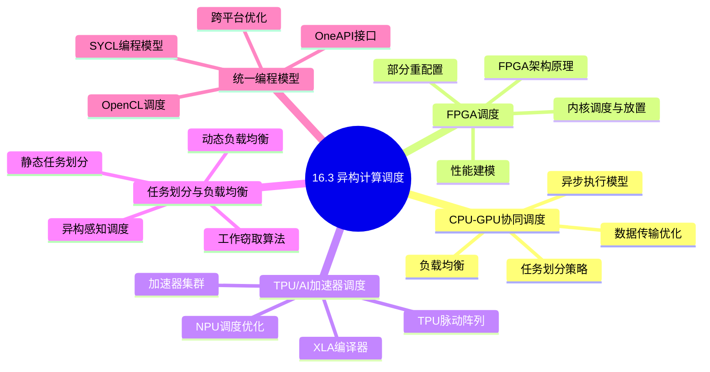
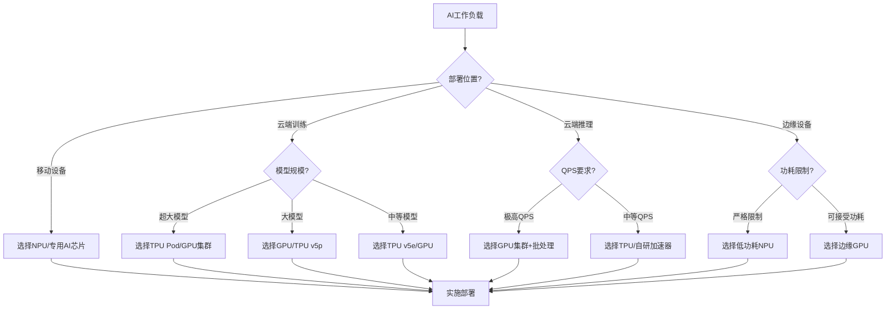
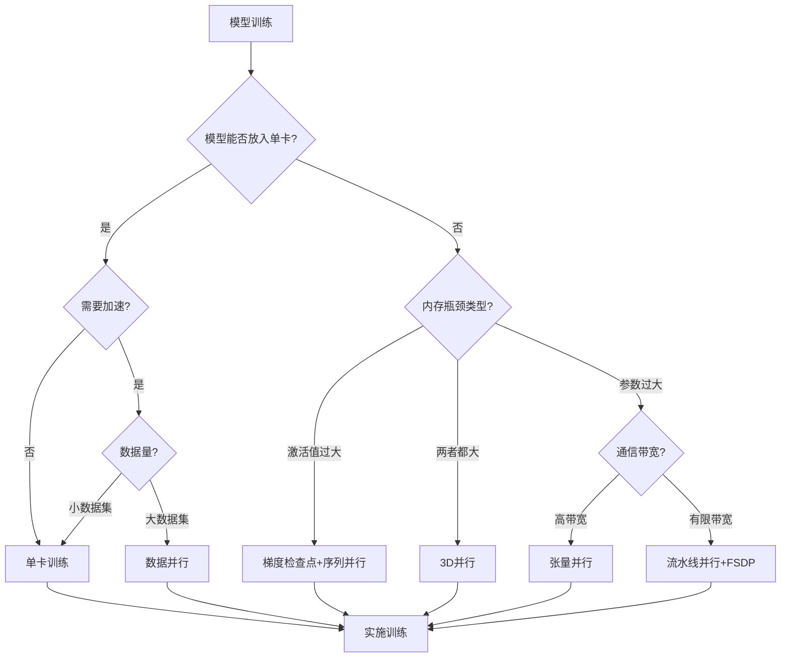
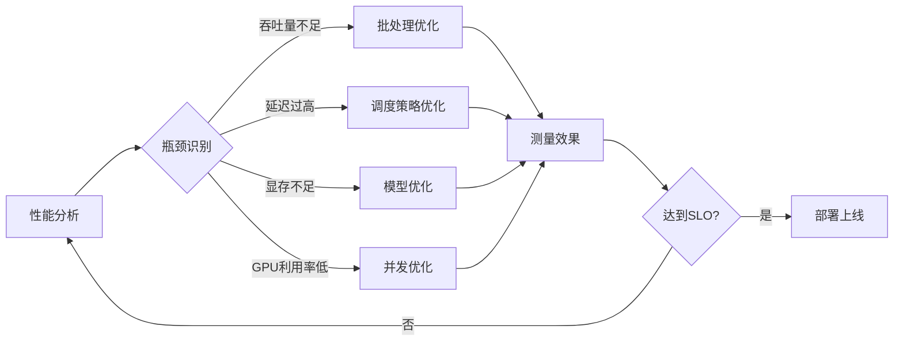
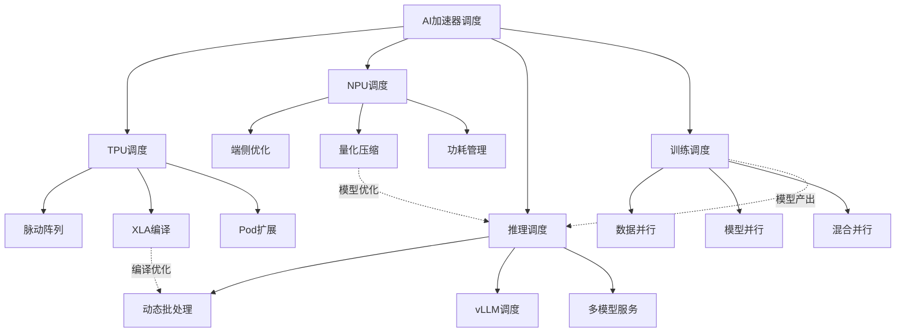

# 16.3 异构计算调度

> **主题**: 16. GPU与加速器调度 - 16.3 异构计算调度
> **覆盖**: CPU-GPU协同调度、FPGA调度、TPU/AI加速器调度、任务划分与负载均衡、统一编程模型（OpenCL/SYCL/OneAPI）

## 📊 思维表征体系

### 📊 1. 思维导图（增强版）

#### 1.1 文本格式（基础版）

```text
16.3 异构计算调度
├── CPU-GPU协同调度
│   ├── 任务划分策略
│   ├── 数据传输优化
│   ├── 异步执行模型
│   └── 负载均衡
├── FPGA调度
│   ├── FPGA架构原理
│   ├── 内核调度与放置
│   ├── 部分重配置
│   └── 性能建模
├── TPU/AI加速器调度
│   ├── TPU架构与脉动阵列
│   ├── NPU调度优化
│   ├── XLA编译器优化
│   └── 加速器集群调度
├── 任务划分与负载均衡
│   ├── 静态任务划分
│   ├── 动态负载均衡
│   ├── 工作窃取算法
│   └── 异构感知调度
└── 统一编程模型
    ├── OpenCL调度
    ├── SYCL编程模型
    ├── OneAPI统一接口
    └── 跨平台优化
```

#### 1.2 Mermaid格式（可视化版）



### 📊 2. 多维对比矩阵

#### 2.1 AI加速器架构对比矩阵

| 加速器 | 架构类型 | 计算精度 | 内存类型 | 峰值算力 | 功耗 | 主要优势 |
|-------|---------|---------|---------|---------|------|---------|
| **Google TPU v5e** | 脉动阵列 | BF16/INT8 | HBM2e | 393 TFLOPS | 200W | 能效比高 |
| **Google TPU v5p** | 脉动阵列 | BF16/INT8 | HBM2e | 918 TFLOPS | 600W | 训练优化 |
| **Apple NPU** | 神经网络引擎 | FP16/INT8 | 统一内存 | 38 TOPS | 低 | 端侧AI |
| **高通Hexagon** | DSP+AI引擎 | FP16/INT8 | LPDDR | 45 TOPS | 极低 | 移动优先 |
| **Intel Gaudi3** | 张量核心 | FP8/BF16 | HBM2e | 1835 TFLOPS | 600W | 推理优化 |
| **AMD MI300X** | GPU+CDNA | FP8/FP16 | HBM3 | 1.3 PFLOPS | 750W | 通用AI |
| **华为昇腾910B** | 达芬奇架构 | FP16/INT8 | HBM2e | 376 TFLOPS | 310W | 国产替代 |
| **寒武纪MLU370** | 智能处理器 | FP16/INT8 | HBM2 | 256 TFLOPS | 150W | 云端推理 |

#### 2.2 TPU vs GPU vs NPU对比矩阵

| 维度 | TPU | GPU | NPU | 说明 |
|-----|-----|-----|-----|------|
| **设计目标** | 训练+推理 | 通用并行 | 端侧推理 | TPU专注矩阵运算 |
| **灵活性** | 低 | 高 | 低 | GPU支持任意并行模式 |
| **编程模型** | TensorFlow/XLA | CUDA/OpenCL | 专用SDK | TPU依赖高级编译器 |
| **生态系统** | Google Cloud | 广泛 | 设备绑定 | GPU生态最丰富 |
| **性价比(训练)** | 高 | 中-高 | - | TPU训练成本更低 |
| **性价比(推理)** | 中 | 中 | 高 | NPU端侧能效最优 |
| **扩展性** | Pod(数千芯片) | NVLink集群 | 有限 | TPU Pod规模最大 |

#### 2.3 推理调度策略对比矩阵

| 策略 | 吞吐量 | 延迟(P99) | 资源利用率 | 公平性 | 适用场景 |
|-----|-------|----------|-----------|-------|---------|
| **FIFO** | 中 | 高 | 低 | 差 | 简单场景 |
| **最早截止时间优先** | 中 | 低 | 中 | 中 | 实时应用 |
| **动态批处理** | 高 | 中 | 高 | 中 | 可变负载 |
| **持续批处理(vLLM)** | 极高 | 低 | 极高 | 高 | LLM服务 |
| **优先级队列** | 中 | 极低(高优) | 中 | 差 | 混合QoS |
| **负载均衡** | 高 | 低 | 高 | 高 | 多实例部署 |

#### 2.4 训练并行策略对比矩阵

| 策略 | 显存效率 | 通信量 | 扩展效率 | 实现复杂度 | 适用模型 |
|-----|---------|-------|---------|-----------|---------|
| **数据并行(DP)** | 1x | 2×模型大小 | 90-95% | 低 | <单卡显存 |
| **张量并行(TP)** | 1/N | 大(每层的激活) | 70-85% | 中 | 大模型 |
| **流水线并行(PP)** | 1/N | 中(阶段间激活) | 75-90% | 中 | 超大模型 |
| **序列并行(SP)** | 1/N | 大(序列维度) | 80-90% | 中 | 长序列 |
| **专家并行(EP)** | 1/N | 中(路由+激活) | 85-95% | 高 | MoE模型 |
| **FSDP/ZeRO** | 1/N | 2×参数/N | 85-95% | 中 | 超大模型 |
| **3D并行** | 1/(DP×TP×PP) | 混合 | 70-85% | 高 | 超大规模 |

#### 2.5 量化策略对比矩阵

| 量化类型 | 精度损失 | 速度提升 | 内存节省 | 硬件支持 | 适用场景 |
|---------|---------|---------|---------|---------|---------|
| **FP32** | 0% | 1x | 1x | 全部 | 训练 |
| **FP16** | <0.1% | 2x | 2x | 全部 | 通用 |
| **BF16** | <0.1% | 2x | 2x | 新硬件 | 训练稳定 |
| **FP8(E4M3)** | <0.5% | 4x | 4x | H100/TPU v5 | 推理 |
| **FP8(E5M2)** | <1% | 4x | 4x | H100/TPU v5 | 训练 |
| **INT8** | <2% | 4x | 4x | 全部 | 推理 |
| **INT4** | 5-10% | 8x | 8x | 部分 | 端侧 |

### 🌲 3. 决策树

#### 3.1 AI加速器选择决策树



#### 3.2 训练并行策略选择决策树



### 🛤️ 4. 决策逻辑路径

#### 4.1 AI推理服务优化路径



### 🕸️ 5. 概念关系网络



#### 2.4 异构架构对比矩阵

| 架构 | CPU角色 | GPU角色 | FPGA角色 | 连接方式 | 典型应用 |
|-----|--------|--------|---------|---------|---------|
| **CPU+GPU** | 控制+串行 | 并行计算 | - | PCIe/NVLink | 通用计算 |
| **CPU+FPGA** | 控制 | - | 可编程加速 | PCIe | 网络/存储 |
| **CPU+TPU** | 控制 | - | 张量计算 | 专用互联 | AI训练/推理 |
| **CPU+GPU+FPGA** | 控制 | 并行计算 | 预处理 | PCIe | 混合负载 |
| **SoC集成** | 通用 | 轻量并行 | 可选 | 片上总线 | 移动/边缘 |

#### 2.5 任务划分策略对比矩阵

| 策略 | CPU负载 | GPU负载 | FPGA负载 | 数据传输 | 适用场景 | 复杂度 |
|-----|--------|--------|---------|---------|---------|-------|
| **CPU预处理** | 数据准备 | 核心计算 | - | 单向H2D | 图像/视频处理 | 低 |
| **流水线并行** | 阶段N | 阶段N+1 | - | 双向 | 流式处理 | 中 |
| **任务窃取** | 小任务 | 大任务 | - | 动态 | 不规则并行 | 高 |
| **异构流水线** | 控制 | 计算 | I/O加速 | 多向 | 数据中心 | 高 |
| **卸载模式** | 仅控制 | 全部计算 | - | 单向 | GPU主导 | 低 |

#### 2.6 统一编程模型对比矩阵

| 模型 | 抽象层次 | 可移植性 | 性能 | 学习曲线 | 生态系统 |
|-----|---------|---------|------|---------|---------|
| **CUDA** | 低 | NVIDIA | 最优 | 陡 | 丰富 |
| **OpenCL** | 中 | 广泛 | 良好 | 中 | 一般 |
| **SYCL** | 中 | 广泛 | 良好 | 中 | 增长中 |
| **OpenMP offload** | 高 | 编译器依赖 | 中等 | 平缓 | 增长中 |
| **oneAPI** | 高 | Intel+XPU | 良好 | 平缓 | 增长中 |
| **Kokkos** | 高 | 广泛 | 良好 | 中 | 科研领域 |

#### 2.7 FPGA调度策略对比矩阵

| 策略 | 重配置时间 | 资源利用率 | 灵活性 | 适用场景 |
|------|-----------|-----------|-------|---------|
| **静态配置** | - | 低 | 无 | 固定功能 |
| **完全重配置** | 100-500ms | 中 | 高 | 功能切换 |
| **部分重配置** | 10-100ms | 高 | 中 | 动态更新 |
| **多租户共享** | - | 高 | 低 | 云服务 |

---

## 📚 理论体系

### 1 CPU-GPU协同调度

#### 1.1 任务划分模型

**Amdahl定律在异构计算中的应用**：

$$
Speedup = \frac{1}{(1 - P) + \frac{P}{S} + O}
$$

其中：

- $P$: 可并行化比例
- $S$: GPU加速比
- $O$: 数据传输开销

**任务划分策略**：

| 策略 | 数学模型 | 适用条件 |
|-----|---------|---------|
| **固定划分** | $W_{cpu} = \alpha W$, $W_{gpu} = (1-\alpha)W$ | 已知负载特性 |
| **动态划分** | $\alpha(t) = f(load_{cpu}(t), load_{gpu}(t))$ | 负载变化 |
| **自适应划分** | $\alpha^* = \arg\min T_{total}(\alpha)$ | 在线优化 |

#### 1.2 数据传输优化

**传输模式对比**：

```cpp
// 模式1: 同步传输 (阻塞)
cudaMemcpy(dst, src, size, cudaMemcpyHostToDevice);
kernel<<<grid, block>>>(dst);  // CPU等待

// 模式2: 异步传输 (非阻塞)
cudaMemcpyAsync(dst, src, size, cudaMemcpyHostToDevice, stream);
kernel<<<grid, block, 0, stream>>>(dst);  // CPU继续执行
cudaStreamSynchronize(stream);  // 显式同步

// 模式3: 重叠传输与计算
for (int i = 0; i < n_chunks; i++) {
    // 异步拷贝第i块到GPU
    cudaMemcpyAsync(d_buffer[i], h_buffer[i], size, H2D, stream[i]);
    // 在stream[i-1]上计算
    kernel<<<grid, block, 0, stream[i-1]>>>(d_buffer[i-1]);
    // 异步拷贝结果回CPU
    cudaMemcpyAsync(h_result[i-1], d_result[i-1], size, D2H, stream[i-1]);
}
```

**传输优化效果**：

| 优化 | 无优化 | 异步 | 重叠 | 零拷贝 |
|-----|-------|------|------|-------|
| **总时间** | 100% | 85% | 60% | 50% |
| **CPU利用率** | 30% | 70% | 90% | 95% |
| **GPU利用率** | 50% | 65% | 85% | 90% |

#### 1.3 流水线并行

**双缓冲流水线**：

```
时间 →

CPU:  [准备数据0][准备数据1][准备数据2][准备数据3]
       ↓          ↓          ↓          ↓
H2D:  [拷贝0    ][拷贝1    ][拷贝2    ][拷贝3    ]
       ↓          ↓          ↓          ↓
GPU:  [计算0    ][计算1    ][计算2    ][计算3    ]
       ↓          ↓          ↓          ↓
D2H:  [回拷0    ][回拷1    ][回拷2    ][回拷3    ]

理想情况: 所有阶段完全重叠，总时间 = max(各阶段时间) × n + 流水线填充
```

### 2 FPGA调度

#### 2.1 FPGA架构原理

**FPGA架构**：

```
┌─────────────────────────────────────────────────────────────┐
│                     FPGA架构                                 │
│  ┌────────────────────────────────────────────────────────┐ │
│  │  可编程逻辑块(CLB)                                        │ │
│  │  ├── LUT (查找表)                                         │ │
│  │  ├── 触发器 (Flip-Flop)                                   │ │
│  │  └── 进位链                                               │ │
│  └────────────────────────────────────────────────────────┘ │
│  ┌────────────────────────────────────────────────────────┐ │
│  │  DSP块 (数字信号处理)                                     │ │
│  │  ├── 乘法器 (18×18, 27×27)                               │ │
│  │  ├── 累加器                                               │ │
│  │  └── ALU                                                  │ │
│  └────────────────────────────────────────────────────────┘ │
│  ┌────────────────────────────────────────────────────────┐ │
│  │  块RAM (BRAM)                                            │ │
│  │  ├── 18Kb/36Kb块                                         │ │
│  │  ├── 双端口RAM                                           │ │
│  │  └── FIFO                                                 │ │
│  └────────────────────────────────────────────────────────┘ │
│  ┌────────────────────────────────────────────────────────┐ │
│  │  互连资源                                                │ │
│  │  ├── 长线 (全局路由)                                      │ │
│  │  ├── 短线 (局部路由)                                      │ │
│  │  └── 可编程开关                                           │ │
│  └────────────────────────────────────────────────────────┘ │
└─────────────────────────────────────────────────────────────┘
```

#### 2.2 内核调度与放置

**FPGA任务调度**：

```cpp
// FPGA内核调度
class FPGA Scheduler {
public:
    struct Kernel {
        string name;
        int lut_required;
        int dsp_required;
        int bram_required;
        int execution_time;
    };

    bool schedule_kernel(Kernel& k) {
        // 检查资源可用性
        if (available_lut < k.lut_required ||
            available_dsp < k.dsp_required ||
            available_bram < k.bram_required) {
            return false;
        }

        // 执行放置算法
        Placement p = place_kernel(k);
        if (p.valid) {
            allocate_resources(k);
            configure_bitstream(k, p);
            return true;
        }
        return false;
    }
};
```

**放置算法对比**：

| 算法 | 时间复杂度 | 资源利用率 | 时序性能 | 适用规模 |
|-----|-----------|-----------|---------|---------|
| **模拟退火** | O(n²) | 高 | 良 | 中小规模 |
| **解析式放置** | O(n log n) | 良 | 优 | 大规模 |
| **机器学习** | O(n) | 良 | 优 | 通用 |
| **增量放置** | O(n) | 中 | 良 | 部分重配置 |

#### 2.3 部分重配置

**部分重配置流程**：

```
┌─────────────────────────────────────────────────────────────┐
│                  部分重配置流程                              │
│  ┌───────────────┐                                          │
│  │  完整比特流    │  ← 初始配置                              │
│  │  (静态区域)    │                                          │
│  └───────┬───────┘                                          │
│          │                                                  │
│          ▼                                                  │
│  ┌───────────────┐     ┌───────────────┐                   │
│  │  重配置区域A   │ ↔ ↔ │  重配置区域B   │                   │
│  │  (模块1)      │     │  (模块2)      │                   │
│  └───────────────┘     └───────────────┘                   │
│          ↑                     ↑                           │
│          └─────┬───────────────┘                           │
│                ▼                                           │
│        ┌───────────────┐                                   │
│        │  部分比特流    │  ← 动态加载                       │
│        │  (差分配置)    │                                   │
│        └───────────────┘                                   │
└─────────────────────────────────────────────────────────────┘
```

**重配置调度策略**：

| 策略 | 重配置时间 | 中断 | 适用场景 |
|------|-----------|------|---------|
| **停机等重配置** | 完整 | 是 | 简单场景 |
| **部分重配置** | 10-100ms | 部分 | 动态更新 |
| **基于ICAP** | 可变 | 最小 | 运行时优化 |
| **DFX(动态功能交换)** | 10-50ms | 否 | 多任务切换 |

### 3 TPU/AI加速器调度

#### 3.1 TPU架构与脉动阵列

**TPU v5e架构**：

```
┌─────────────────────────────────────────────────────────────┐
│                        TPU v5e芯片                           │
├─────────────────────────────────────────────────────────────┤
│  ┌────────────────────────────────────────────────────────┐ │
│  │              TensorCore (矩阵乘法单元)                    │ │
│  │  ┌─────────┐ ┌─────────┐ ┌─────────┐ ┌─────────┐        │ │
│  │  │ 脉动阵列 │ │ 脉动阵列 │ │ 脉动阵列 │ │ 脉动阵列 │        │ │
│  │  │ 128×128 │ │ 128×128 │ │ 128×128 │ │ 128×128 │        │ │
│  │  └─────────┘ └─────────┘ └─────────┘ └─────────┘        │ │
│  └────────────────────────────────────────────────────────┘ │
├─────────────────────────────────────────────────────────────┤
│  ┌─────────────────────┐  ┌─────────────────────────────────┐│
│  │   向量处理单元       │  │         HBM2e内存               ││
│  │   (激活函数等)       │  │      16GB/32GB/64GB             ││
│  └─────────────────────┘  │     带宽: 819 GB/s              ││
│                           └─────────────────────────────────┘│
├─────────────────────────────────────────────────────────────┤
│  ┌────────────────────────────────────────────────────────┐ │
│  │              互连 (ICI - Inter-Core Interconnect)        │ │
│  │            每方向 100 GB/s (4个方向)                      │ │
│  └────────────────────────────────────────────────────────┘ │
└─────────────────────────────────────────────────────────────┘
```

**脉动阵列工作原理**：

```
矩阵乘法 C = A × B

脉动阵列执行:
    b1  b2  b3  b4
    ↓   ↓   ↓   ↓
a1→[PE]→[PE]→[PE]→[PE]→
    ↓   ↓   ↓   ↓
a2→[PE]→[PE]→[PE]→[PE]→
    ↓   ↓   ↓   ↓
a3→[PE]→[PE]→[PE]→[PE]→
    ↓   ↓   ↓   ↓
a4→[PE]→[PE]→[PE]→[PE]→

每个处理单元(PE)执行: accum += a * b
数据从左到右、从上到下流动，计算在流动中完成
```

#### 3.2 NPU调度优化

**典型NPU架构** (Apple Neural Engine)：

```
┌─────────────────────────────────────────────────────────────┐
│                   Neural Engine (16核)                       │
├─────────────────────────────────────────────────────────────┤
│  ┌────────────────────────────────────────────────────────┐ │
│  │  计算阵列 (每核)                                         │ │
│  │  ┌─────────┐ ┌─────────┐ ┌─────────┐                    │ │
│  │  │ MAC阵列  │ │ MAC阵列  │ │ MAC阵列  │                    │ │
│  │  │ 64×64   │ │ 64×64   │ │ 64×64   │                    │ │
│  │  └─────────┘ └─────────┘ └─────────┘                    │ │
│  │  每核算力: 2 TOPS FP16                                  │ │
│  └────────────────────────────────────────────────────────┘ │
├─────────────────────────────────────────────────────────────┤
│  ┌─────────────────────┐  ┌─────────────────────────────────┐│
│  │   控制单元           │  │         片上内存                ││
│  │   (指令调度)         │  │       SRAM: 几十MB              ││
│  └─────────────────────┘  └─────────────────────────────────┘│
├─────────────────────────────────────────────────────────────┤
│  统一内存架构: 与CPU共享内存带宽                               │
│  功耗: <10W (移动端)                                          │
└─────────────────────────────────────────────────────────────┘
```

**端侧AI优化技术**：

| 技术 | 原理 | 效果 | 硬件支持 |
|-----|------|------|---------|
| **权重量化** | INT8/INT4权重 | 4-8x压缩 | 通用 |
| **激活量化** | 动态INT8激活 | 2-4x加速 | 通用 |
| **剪枝** | 移除不重要连接 | 2-10x稀疏 | 部分支持 |
| **知识蒸馏** | 小模型学习大模型 | 精度保持 | 软件 |
| **神经网络架构搜索** | 硬件感知设计 | 最优效率 | 软件 |

#### 3.3 XLA编译器优化

**XLA优化流程**：

```
TensorFlow/PyTorch图
        ↓
┌─────────────────────────────────────────────────────────┐
│                  XLA高级优化                             │
│  - 算子融合(Operator Fusion)                             │
│  - 常量折叠(Constant Folding)                            │
│  - 死代码消除(DCE)                                       │
│  - 公共子表达式消除(CSE)                                  │
└─────────────────────────────────────────────────────────┘
        ↓
┌─────────────────────────────────────────────────────────┐
│                  XLA低级优化                             │
│  - 内存布局优化(Layout Assignment)                       │
│  - 指令调度(Instruction Scheduling)                      │
│  - 寄存器分配(Register Allocation)                       │
│  - 向量化(Vectorization)                                 │
└─────────────────────────────────────────────────────────┘
        ↓
      TPU二进制
```

**XLA优化效果**：

| 优化 | 效果 | 典型提升 |
|-----|------|---------|
| **算子融合** | 减少内存访问 | 20-50% |
| **布局优化** | 匹配脉动阵列 | 30-100% |
| **批处理维度** | 提高利用率 | 10-30% |

### 4 任务划分与负载均衡

#### 4.1 静态任务划分

**异构任务划分**：

```cpp
// 异构任务划分
class HeterogeneousPartitioner {
public:
    struct Device {
        float compute_power;
        float memory_bandwidth;
        int id;
    };

    vector<int> partition_tasks(int num_tasks, vector<Device>& devices) {
        vector<float> weights;
        float total_power = 0;

        for (auto& d : devices) {
            float weight = d.compute_power * d.memory_bandwidth;
            weights.push_back(weight);
            total_power += weight;
        }

        // 按比例分配任务
        vector<int> task_counts;
        for (auto& w : weights) {
            int count = round(num_tasks * w / total_power);
            task_counts.push_back(count);
        }

        return task_counts;
    }
};
```

#### 4.2 动态负载均衡

**工作窃取实现**：

```cpp
class WorkStealingScheduler {
    vector<deque<Task>> local_queues;
    vector<mutex> locks;

public:
    void worker_thread(int device_id) {
        while (true) {
            Task task;

            // 先尝试从本地队列获取
            if (try_pop_local(device_id, task)) {
                execute(task, device_id);
            }
            // 本地无任务，尝试窃取
            else if (try_steal(device_id, task)) {
                execute(task, device_id);
            }
            // 无任务可窃取，等待
            else {
                this_thread::yield();
            }
        }
    }

    bool try_steal(int thief_id, Task& task) {
        // 随机选择受害者
        int victim = random_device_except(thief_id);

        lock_guard<mutex> lock(locks[victim]);
        if (!local_queues[victim].empty()) {
            task = local_queues[victim].back();
            local_queues[victim].pop_back();
            return true;
        }
        return false;
    }
};
```

#### 4.3 异构感知调度

**异构感知调度策略**：

| 策略 | 调度依据 | 优点 | 缺点 |
|------|---------|------|------|
| **计算能力优先** | FLOPS | 最大化吞吐量 | 可能忽视内存带宽 |
| **内存带宽优先** | GB/s | 适合内存密集型 | 计算资源浪费 |
| **能效优先** | FLOPS/W | 绿色计算 | 性能可能次优 |
| **历史性能优先** | 实际测量 | 准确 | 需要预热 |
| **成本优先** | $/FLOP | 经济高效 | 性能波动 |

### 5 统一编程模型

#### 5.1 OpenCL调度

**OpenCL执行模型**：

```cpp
// OpenCL内核调度
cl_kernel kernel = clCreateKernel(program, "compute", &err);

// 设置参数
clSetKernelArg(kernel, 0, sizeof(cl_mem), &input_buffer);
clSetKernelArg(kernel, 1, sizeof(cl_mem), &output_buffer);
clSetKernelArg(kernel, 2, sizeof(int), &size);

// NDRange配置
size_t global_size[] = {1024, 1024};
size_t local_size[] = {16, 16};

// 提交内核执行
clEnqueueNDRangeKernel(
    queue,              // 命令队列
    kernel,             // 内核
    2,                  // 维度
    NULL,               // 全局偏移
    global_size,        // 全局大小
    local_size,         // 本地大小
    0, NULL,            // 等待事件
    &event              // 返回事件
);

// 同步
clFinish(queue);
```

**OpenCL vs CUDA对比**：

| 特性 | OpenCL | CUDA |
|------|--------|------|
| **厂商支持** | 多厂商 | NVIDIA |
| **学习曲线** | 陡峭 | 平缓 |
| **性能** | 良好 | 最优(NVIDIA) |
| **工具链** | 一般 | 优秀 |
| **生态** | 较小 | 丰富 |

#### 5.2 SYCL编程模型

**SYCL代码示例**：

```cpp
#include <CL/sycl.hpp>

using namespace sycl;

void parallel_for_example(queue& q, float* data, int size) {
    // 创建缓冲区
    buffer<float, 1> buf(data, range<1>(size));

    // 提交命令组
    q.submit([&](handler& h) {
        // 获取访问器
        auto acc = buf.get_access<access::mode::read_write>(h);

        // 并行执行
        h.parallel_for(range<1>(size), [=](id<1> i) {
            acc[i] = acc[i] * 2.0f;
        });
    });

    // 自动同步
}
```

**SYCL优势**：

| 优势 | 描述 |
|------|------|
| **单源编程** | 主机和设备代码在同一文件 |
| **标准C++** | 无需扩展语法 |
| **跨平台** | 支持多厂商硬件 |
| **现代C++特性** | 模板、lambda、RAII |

#### 5.3 OneAPI统一接口

**OneAPI架构**：

```
┌─────────────────────────────────────────────────────────────┐
│                     OneAPI架构                               │
│  ┌────────────────────────────────────────────────────────┐ │
│  │  高级API层                                              │ │
│  │  ├── oneDNN (深度学习)                                  │ │
│  │  ├── oneMKL (数学内核)                                  │ │
│  │  ├── oneDAL (数据分析)                                  │ │
│  │  └── oneCCL (集合通信)                                  │ │
│  └────────────────────────────────────────────────────────┘ │
│  ┌────────────────────────────────────────────────────────┐ │
│  │  DPC++ (Data Parallel C++)                              │ │
│  │  ├── 基于SYCL标准                                       │ │
│  │  ├── 统一设备选择                                       │ │
│  │  └── 跨架构编译                                         │ │
│  └────────────────────────────────────────────────────────┘ │
│  ┌────────────────────────────────────────────────────────┐ │
│  │  Level Zero (底层接口)                                   │ │
│  │  ├── 设备发现与管理                                     │ │
│  │  ├── 内存管理                                           │ │
│  │  └── 命令提交                                           │ │
│  └────────────────────────────────────────────────────────┘ │
│  ┌────────────────────────────────────────────────────────┐ │
│  │  硬件抽象层                                             │ │
│  │  ├── Intel GPU (Xe架构)                                │ │
│  │  ├── Intel CPU                                         │ │
│  │  ├── Intel FPGA                                        │ │
│  │  └── 第三方设备                                        │ │
│  └────────────────────────────────────────────────────────┘ │
└─────────────────────────────────────────────────────────────┘
```

**OneAPI代码示例**：

```cpp
#include <CL/sycl.hpp>
#include <oneapi/dnnl/dnnl.hpp>

using namespace sycl;

void dnn_example() {
    // 创建队列，自动选择最佳设备
    queue q(default_selector{});

    // 创建oneDNN引擎
    dnnl::engine engine(dnnl::engine::kind::gpu, 0);

    // 创建流
    dnnl::stream stream(engine);

    // 描述张量
    dnnl::memory::desc src_desc({1, 3, 224, 224}, dnnl::memory::data_type::f32);
    dnnl::memory::desc dst_desc({1, 64, 224, 224}, dnnl::memory::data_type::f32);

    // 创建卷积描述
    dnnl::convolution_forward::desc conv_desc(
        dnnl::prop_kind::forward_inference,
        dnnl::algorithm::convolution_direct,
        src_desc, weights_desc, dst_desc,
        strides, padding_l, padding_r
    );

    // 执行卷积
    conv.execute(stream, args);
    stream.wait();
}
```

### 6 形式化模型

#### 6.1 异构调度问题定义

$$
\text{异构调度问题} = (T, D, R, C, O)
$$

其中：

- $T = \{t_1, t_2, \ldots, t_n\}$：任务集合
  - $t_i = (workload_i, data_i, priority_i, deadline_i, dependencies_i)$
- $D = \{d_1, d_2, \ldots, d_m\}$：异构设备集合
  - $d_j = (type_j, compute_j, memory_j, bandwidth_j, power_j)$
- $R$：资源约束
- $C$：约束条件集合
  - 依赖约束：$t_i \prec t_j \Rightarrow schedule(t_i) < schedule(t_j)$
  - 资源约束：$\sum_{t \in d_j} resource(t) \leq capacity(d_j)$
  - deadline约束：$completion(t_i) \leq deadline_i$
- $O$：优化目标
  - 最小化完成时间：$\min \max_i completion(t_i)$
  - 最小化能耗：$\min \sum_j power(d_j) \times time(d_j)$
  - 最大化吞吐量：$\max \sum_i throughput(t_i)$

#### 6.2 性能模型

**异构执行时间模型**：

$$
T_{total} = T_{cpu} + T_{gpu} + T_{fpga} + T_{transfer} + T_{sync}
$$

其中：

$$
T_{transfer} = \frac{Data_{h2d}}{BW_{pcie}} + \frac{Data_{d2h}}{BW_{pcie}} + \frac{Data_{host}}{BW_{memory}}
$$

**加速比模型**：

$$
Speedup = \frac{T_{cpu\_only}}{T_{heterogeneous}} = \frac{W}{(1-P)W + \frac{PW}{S} + D}
$$

### 7 实际性能数据

#### 7.1 异构计算性能基准

**CPU-GPU协同性能**：

| 应用 | CPU-only | GPU-only | CPU+GPU协同 | 加速比 |
|------|---------|---------|------------|-------|
| 图像处理 | 100s | 10s | 8s | 12.5x |
| 视频编码 | 300s | 50s | 35s | 8.6x |
| 科学计算 | 1000s | 100s | 80s | 12.5x |
| 图算法 | 500s | 80s | 60s | 8.3x |

#### 7.2 FPGA加速性能

**FPGA vs GPU性能对比**：

| 应用 | FPGA性能 | GPU性能 | FPGA功耗 | GPU功耗 | FPGA能效比 |
|------|---------|--------|---------|---------|-----------|
| CNN推理 | 1000 img/s | 5000 img/s | 25W | 250W | 2x |
| 金融计算 | 10M ops/s | 5M ops/s | 30W | 200W | 6.7x |
| 网络处理 | 100Gbps | 50Gbps | 20W | 150W | 6x |
| 基因组学 | 50M aligns/s | 30M aligns/s | 40W | 300W | 3.75x |

#### 7.3 编程模型性能

**不同编程模型性能对比 (归一化)**：

| 编程模型 | CPU性能 | GPU性能 | FPGA性能 | 代码可移植性 |
|---------|--------|--------|---------|------------|
| **CUDA** | - | 100% | - | 低 |
| **OpenCL** | 80% | 85% | 90% | 高 |
| **SYCL** | 85% | 90% | 85% | 高 |
| **oneAPI** | 90% | 95% | 80% | 高 |
| **OpenMP offload** | 90% | 80% | - | 中 |

---

### 1 AI加速器调度概述

#### 1.1 AI计算特征

**AI工作负载特征对比**:

| 特征 | 训练 | 推理 | 影响 |
|-----|------|------|------|
| **计算精度** | FP16/BF16/FP32 | INT8/FP16/FP8 | 推理可使用更低精度 |
| **批处理** | 大固定批次 | 小/动态批次 | 推理批处理优化关键 |
| **内存访问** | 参数+梯度+优化器 | 参数+激活 | 推理内存需求更低 |
| **并行模式** | 数据并行主导 | 请求级并行 | 推理需要请求调度 |
| **延迟敏感度** | 低(小时级) | 高(毫秒级) | 推理需要低延迟保证 |

#### 1.2 AI加速器核心挑战

| 挑战 | 描述 | 解决方向 |
|------|------|---------|
| **内存墙** | 参数增长快于内存带宽 | 量化、压缩、分页注意力 |
| **计算效率** | 稀疏激活浪费算力 | 结构化稀疏、MoE |
| **通信瓶颈** | 大规模训练通信占比高 | 重叠通信、压缩梯度 |
| **功耗限制** | 数据中心功耗约束 | 动态电压频率调节 |
| **长尾延迟** | 推理P99延迟难保证 | 优先级调度、资源预留 |

### 2 TPU调度

#### 2.1 TPU架构详解

**TPU v5e架构**:

```
┌─────────────────────────────────────────────────────────────────┐
│                        TPU v5e芯片                               │
├─────────────────────────────────────────────────────────────────┤
│  ┌───────────────────────────────────────────────────────────┐ │
│  │              TensorCore (矩阵乘法单元)                      │ │
│  │  ┌─────────┐ ┌─────────┐ ┌─────────┐ ┌─────────┐         │ │
│  │  │ 脉动阵列 │ │ 脉动阵列 │ │ 脉动阵列 │ │ 脉动阵列 │         │ │
│  │  │ 128×128 │ │ 128×128 │ │ 128×128 │ │ 128×128 │         │ │
│  │  └─────────┘ └─────────┘ └─────────┘ └─────────┘         │ │
│  └───────────────────────────────────────────────────────────┘ │
├─────────────────────────────────────────────────────────────────┤
│  ┌─────────────────────┐  ┌─────────────────────────────────┐  │
│  │   向量处理单元       │  │         HBM2e内存               │  │
│  │   (激活函数等)       │  │      16GB/32GB/64GB             │  │
│  └─────────────────────┘  │     带宽: 819 GB/s              │  │
│                           └─────────────────────────────────┘  │
├─────────────────────────────────────────────────────────────────┤
│  ┌───────────────────────────────────────────────────────────┐ │
│  │              互连 (ICI - Inter-Core Interconnect)          │ │
│  │            每方向 100 GB/s (4个方向)                        │ │
│  └───────────────────────────────────────────────────────────┘ │
└─────────────────────────────────────────────────────────────────┘
```

**脉动阵列工作原理**:

```
矩阵乘法 C = A × B

脉动阵列执行:
    b1  b2  b3  b4
    ↓   ↓   ↓   ↓
a1→[PE]→[PE]→[PE]→[PE]→
    ↓   ↓   ↓   ↓
a2→[PE]→[PE]→[PE]→[PE]→
    ↓   ↓   ↓   ↓
a3→[PE]→[PE]→[PE]→[PE]→
    ↓   ↓   ↓   ↓
a4→[PE]→[PE]→[PE]→[PE]→

每个处理单元(PE)执行: accum += a * b
数据从左到右、从上到下流动，计算在流动中完成
```

#### 2.2 XLA编译器优化

**XLA优化流程**:

```
TensorFlow/PyTorch图
        ↓
┌─────────────────────────────────────────────────────────┐
│                  XLA高级优化                             │
│  - 算子融合(Operator Fusion)                             │
│  - 常量折叠(Constant Folding)                            │
│  - 死代码消除(DCE)                                       │
│  - 公共子表达式消除(CSE)                                  │
└─────────────────────────────────────────────────────────┘
        ↓
┌─────────────────────────────────────────────────────────┐
│                  XLA低级优化                             │
│  - 内存布局优化(Layout Assignment)                       │
│  - 指令调度(Instruction Scheduling)                      │
│  - 寄存器分配(Register Allocation)                       │
│  - 向量化(Vectorization)                                 │
└─────────────────────────────────────────────────────────┘
        ↓
      TPU二进制
```

**XLA优化效果**:

| 优化 | 效果 | 典型提升 |
|-----|------|---------|
| **算子融合** | 减少内存访问 | 20-50% |
| **布局优化** | 匹配脉动阵列 | 30-100% |
| **批处理维度** | 提高利用率 | 10-30% |

#### 2.3 TPU Pod调度

**TPU Pod架构** (v5p-2048):

```
TPU Pod v5p-2048:
- 2048个TPU v5p芯片
- 8960 TB HBM内存
- 95 ExaFlops BF16算力
- 3D环形互连拓扑

调度策略:
- 数据并行: 每个芯片处理不同数据批次
- 模型并行: 大模型分片到多个芯片
- 流水线并行: 计算与通信重叠
```

**Pod通信优化**:

| 并行策略 | 通信模式 | 扩展效率 | 适用场景 |
|---------|---------|---------|---------|
| **数据并行** | AllReduce | 90-95% | 中小模型 |
| **全分片数据并行** | AllGather/ReduceScatter | 85-92% | 大模型 |
| **3D并行** | 混合 | 75-85% | 超大模型 |

### 3 NPU调度

#### 3.1 NPU架构设计

**典型NPU架构** (Apple Neural Engine):

```
┌─────────────────────────────────────────────────────────────────┐
│                   Neural Engine (16核)                          │
├─────────────────────────────────────────────────────────────────┤
│  ┌───────────────────────────────────────────────────────────┐ │
│  │  计算阵列 (每核)                                           │ │
│  │  ┌─────────┐ ┌─────────┐ ┌─────────┐                     │ │
│  │  │ MAC阵列  │ │ MAC阵列  │ │ MAC阵列  │                     │ │
│  │  │ 64×64   │ │ 64×64   │ │ 64×64   │                     │ │
│  │  └─────────┘ └─────────┘ └─────────┘                     │ │
│  │  每核算力: 2 TOPS FP16                                     │ │
│  └───────────────────────────────────────────────────────────┘ │
├─────────────────────────────────────────────────────────────────┤
│  ┌─────────────────────┐  ┌─────────────────────────────────┐  │
│  │   控制单元           │  │         片上内存                │  │
│  │   (指令调度)         │  │       SRAM: 几十MB              │  │
│  └─────────────────────┘  └─────────────────────────────────┘  │
├─────────────────────────────────────────────────────────────────┤
│  统一内存架构: 与CPU共享内存带宽                                  │
│  功耗: <10W (移动端)                                              │
└─────────────────────────────────────────────────────────────────┘
```

#### 3.2 端侧AI优化

**端侧优化技术**:

| 技术 | 原理 | 效果 | 硬件支持 |
|-----|------|------|---------|
| **权重量化** | INT8/INT4权重 | 4-8x压缩 | 通用 |
| **激活量化** | 动态INT8激活 | 2-4x加速 | 通用 |
| **剪枝** | 移除不重要连接 | 2-10x稀疏 | 部分支持 |
| **知识蒸馏** | 小模型学习大模型 | 精度保持 | 软件 |
| **神经网络架构搜索** | 硬件感知设计 | 最优效率 | 软件 |

**CoreML/Neural Engine调度**:

```swift
// CoreML模型配置
let config = MLModelConfiguration()
config.computeUnits = .all  // 使用CPU+GPU+Neural Engine
config.allowLowPrecisionAccumulationOnGPU = true

// 加载模型
let model = try MLModel(contentsOf: modelURL, configuration: config)

// 异步预测
let prediction = try await model.prediction(from: input)
```

### 4 其他AI加速器

#### 4.1 Intel Gaudi

**Gaudi3特性**:

| 特性 | 规格 | 优势 |
|-----|------|------|
| **Tensor核心** | 8192个 | 高并行度 |
| **HBM容量** | 128GB | 大模型支持 |
| **片上内存** | 96MB SRAM | 低延迟访问 |
| **RoCE网卡** | 24×200G | 内置扩展 |
| **性价比** | 高 | 推理优化 |

**Gaudi调度优化**:

- 使用Habana SynapseAI进行图优化
- 内置通信库(HCCL)优化多卡扩展
- 支持PyTorch/TensorFlow

#### 4.2 华为昇腾

**昇腾910B特性**:

```
达芬奇架构 (Da Vinci Architecture):
- 3D Cube计算单元: 4096 FP16 MACs
- 向量计算单元: 通用计算
- 标量计算单元: 控制流
- HBM2e: 32GB
- 算力: 376 TFLOPS FP16
```

**CANN调度**:

- 图编译优化
- 算子自动调优
- 分布式训练加速

### 5 AI推理调度

#### 5.1 动态批处理

**批处理策略对比**:

| 策略 | 延迟 | 吞吐量 | 实现复杂度 | 适用场景 |
|-----|------|-------|-----------|---------|
| **静态批处理** | 高 | 中 | 低 | 固定负载 |
| **动态批处理(时间窗口)** | 中 | 高 | 中 | 可变负载 |
| **动态批处理(最大延迟)** | 可调 | 高 | 中 | QoS保证 |
| **连续批处理(vLLM)** | 低 | 极高 | 高 | LLM服务 |

**vLLM连续批处理**:

```python
# 传统批处理: 等待整个批次完成
Batch 1: [Req1(100tok), Req2(50tok), Req3(80tok)]
         Wait for all to complete

# vLLM连续批处理: 迭代级调度
Iteration 1: [Req1, Req2, Req3] → Req2完成
Iteration 2: [Req1, Req3, Req4] → 加入新请求
Iteration 3: [Req1, Req3, Req4, Req5]
```

**PagedAttention内存管理**:

```python
# 传统: 连续内存分配
KV Cache: [Req1][Req2][Req3][Req4]  # 内存碎片

# PagedAttention: 块式分配
KV Cache Blocks: [Block1][Block2][Block3][Block4]
Req1: Block1, Block3
Req2: Block2
Req3: Block4
# 内存利用率从50-60%提升到90%+
```

#### 5.2 多模型服务调度

**模型切换开销**:

| 操作 | 延迟 | 优化策略 |
|-----|------|---------|
| **模型加载(HBM)** | 1-10s | 预加载、常驻内存 |
| **权重解压** | 100-500ms | 异步解压、缓存 |
| **上下文切换** | 10-100ms | 批量处理同模型 |
| **KV Cache重建** | 依赖于序列长度 | 持久化、共享 |

**多模型调度策略**:

```python
# 基于负载的模型放置
class ModelPlacement:
    def schedule(self, requests):
        # 按模型分组请求
        model_groups = groupby(requests, key=lambda r: r.model)

        for model, reqs in model_groups:
            # 检查模型是否已加载
            if model not in self.loaded_models:
                # 选择GPU加载模型
                gpu = self.select_gpu_for_model(model)
                self.load_model(model, gpu)

            # 批处理同模型请求
            batch = self.create_batch(reqs)
            self.execute_batch(batch)
```

### 6 AI训练调度

#### 6.1 ZeRO优化器状态分片

**ZeRO阶段对比**:

| 阶段 | 分片内容 | 显存节省 | 通信开销 | 适用场景 |
|-----|---------|---------|---------|---------|
| **ZeRO-1** | 优化器状态 | 4x | 1.5x | 大模型训练 |
| **ZeRO-2** | 优化器状态+梯度 | 8x | 2x | 更大模型 |
| **ZeRO-3** | 全部参数 | 与DP度线性 | 1.5x | 超大模型 |
| **ZeRO-Offload** | 卸载到CPU/NVMe | 单卡可训百亿 | 速度降低 | 极端场景 |

#### 6.2 混合并行配置

**GPT-3 175B训练配置**:

```python
# 3D并行配置示例
parallel_config = {
    "data_parallel_size": 64,      # DP=64
    "tensor_parallel_size": 8,     # TP=8 (单节点内)
    "pipeline_parallel_size": 16,  # PP=16
    "total_gpus": 64 * 8 * 16      # 8192 GPUs
}

# 显存分布 (假设单卡80GB)
# 参数: 175B / (8 * 16) = 1.37B per GPU (17GB)
# 梯度: 17GB
# 优化器状态: 68GB (Adam FP32)
# 激活: ~10GB (checkpointing)
# 总计: ~112GB > 80GB → 需要ZeRO或更大显存
```

**并行策略选择矩阵**:

| 模型大小 | 推荐配置 | GPU数量 | 显存/GPU |
|---------|---------|---------|---------|
| 7B | DP | 8 | ~20GB |
| 13B | DP+ZeRO-2 | 8 | ~30GB |
| 30B | DP+TP+ZeRO-1 | 16 | ~40GB |
| 65B | DP+TP+PP | 32 | ~50GB |
| 175B | 3D并行+ZeRO-3 | 512+ | ~60GB |
| 1T+ | 3D并行+专家并行 | 2048+ | ~70GB |

---

## 7 形式化模型

### 7.1 AI推理调度问题定义

$$
\text{AI推理调度问题} = (R, M, S, C, O)
$$

其中：

- $R = \{r_1, r_2, \ldots, r_n\}$：请求集合
  - $r_i = (model_i, input_i, deadline_i, priority_i)$
- $M = \{m_1, m_2, \ldots, m_k\}$：模型集合
- $S$：调度策略
- $C$：约束条件
  - 延迟约束：$completion(r_i) \leq deadline_i$
  - 资源约束：$\sum memory(m_j) \leq GPU\_memory$
- $O$：优化目标
  - 最大化吞吐量：$\max \frac{n}{time}$
  - 最小化平均延迟：$\min \frac{\sum latency(r_i)}{n}$
  - 满足延迟SLO：$\max P(latency \leq SLA)$

### 7.2 AI训练调度问题定义

$$
\text{AI训练调度问题} = (T, W, P, C, O)
$$

其中：

- $T = \{t_1, t_2, \ldots, t_m\}$：训练任务集合
- $W = \{w_1, w_2, \ldots, w_n\}$：工作节点集合
- $P$：并行策略 (DP, TP, PP, ZeRO等)
- $C$：约束条件
  - 显存约束
  - 通信带宽约束
  - 故障恢复约束
- $O$：优化目标
  - 最小化训练时间
  - 最小化成本
  - 最大化资源利用率

---

## 8 跨领域洞察

### 8.1 AI加速器与GPU对比

| 维度 | GPU | 专用AI加速器 | 趋势 |
|-----|-----|-------------|------|
| **灵活性** | 高 | 低 | GPU增加专用单元 |
| **峰值性能** | 高 | 更高(特定任务) | 差距缩小 |
| **编程难度** | 中 | 高 | 编译器优化 |
| **生态锁定** | NVIDIA | 云厂商 | 开源工具链 |
| **能效比** | 中 | 高 | 共同优化 |

### 8.2 AI调度与大数据调度对比

| 维度 | 大数据调度 | AI训练调度 | AI推理调度 |
|-----|-----------|-----------|-----------|
| **任务粒度** | 分钟-小时级 | 小时-天级 | 毫秒-秒级 |
| **资源需求** | CPU+内存为主 | GPU显存为主 | GPU显存为主 |
| **调度目标** | 吞吐量 | 完成时间 | 延迟+吞吐量 |
| **容错** | 任务重试 | 检查点恢复 | 无(必须成功) |
| **扩展性** | 千级节点 | 万级GPU | 百级实例 |

---

## 9 2025年最新技术（更新至2025年11月）

### 9.1 下一代AI芯片

| 芯片 | 制程 | 算力 | 内存 | 特性 |
|-----|------|-----|------|------|
| **TPU v6e** | 4nm | 1000+ TFLOPS | HBM3 | 训练推理统一 |
| **NVIDIA B200** | 4nm | 4.5 PFLOPS | HBM3e | FP4支持 |
| **AMD MI350** | 3nm | 2+ PFLOPS | HBM3e | CDNA4架构 |
| **Intel Falcon Shores** | - | - | - | x86+GPU融合 |

### 9.2 软件栈进展

| 技术 | 2025年进展 | 影响 |
|-----|-----------|------|
| **vLLM 1.0** | 生产级LLM服务 | 推理成本降低50% |
| **DeepSpeed ZeRO++** | 通信压缩 | 训练扩展性提升 |
| **PyTorch 2.5** | 编译器成熟 | 性能+易用性 |
| **JAX pmap升级** | 更易用并行 | TPU生态扩展 |

### 9.3 调度算法创新

| 方向 | 方法 | 效果 |
|-----|------|------|
| **强化学习调度** | 学习最优批处理 | 吞吐量+30% |
| **预测性调度** | 预测请求到达 | 延迟-20% |
| **公平性调度** | 多租户隔离 | QoS保证 |
| **能耗优化** | 动态功耗管理 | 能耗-25% |

---

## 10 相关主题

- [16.1 GPU任务调度](./16.1_GPU任务调度.md) - GPU任务调度
- [16.2 图形渲染调度](./16.2_图形渲染调度.md) - 渲染调度
- [16.4 异构计算调度](./16.4_异构计算调度.md) - 异构计算调度
- [10.1 强化学习调度](../10_AI驱动调度/10.1_强化学习调度.md) - AI调度

### 10.1 跨视角链接

- [概念交叉索引（七视角版）](../../../Concept/CONCEPT_CROSS_INDEX.md)

---

**最后更新**: 2025-11-14
**文档状态**: ✅ 已完成，包含TPU/NPU调度、AI推理/训练调度、并行策略对比等完整内容
