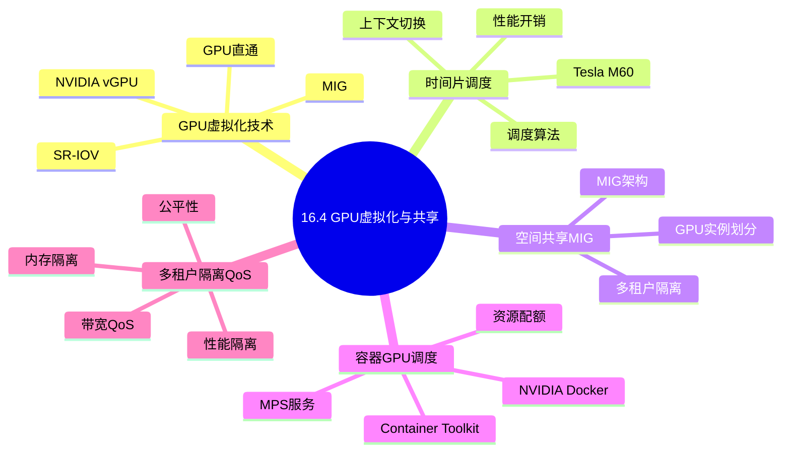
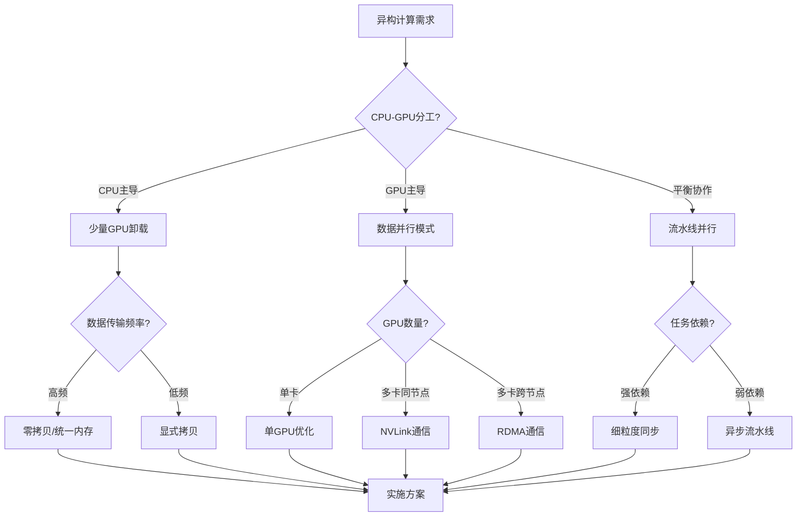
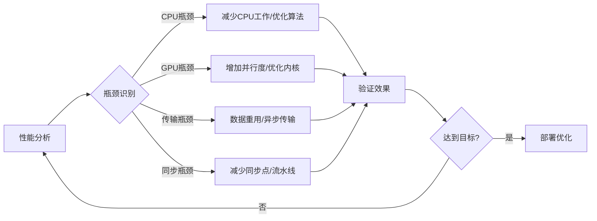
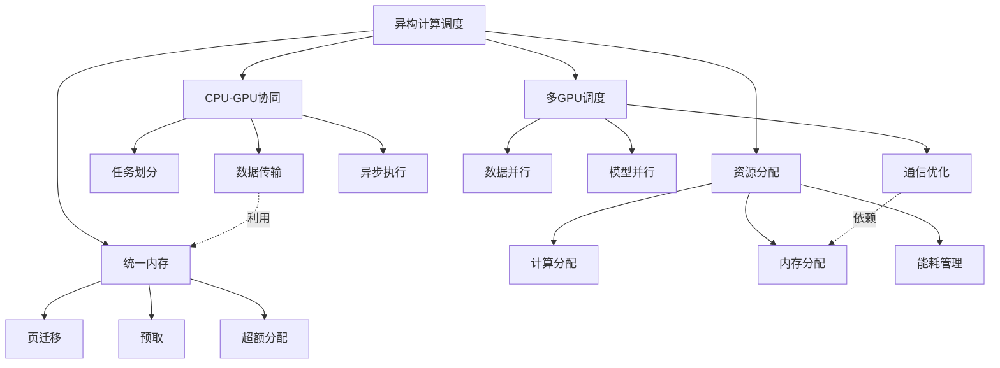

# 16.4 GPU虚拟化与共享

> **主题**: 16. GPU与加速器调度 - 16.4 GPU虚拟化与共享
> **覆盖**: GPU虚拟化技术（vGPU、MIG、SR-IOV）、时间片调度（Tesla M60/时间分片）、空间共享（MIG技术）、容器GPU调度（NVIDIA Docker、MPS）、多租户隔离与QoS

## 📊 思维表征体系

### 📊 1. 思维导图（增强版）

#### 1.1 文本格式（基础版）

```text
16.4 GPU虚拟化与共享
├── GPU虚拟化技术
│   ├── NVIDIA vGPU
│   ├── Multi-Instance GPU (MIG)
│   ├── SR-IOV GPU虚拟化
│   ├── GPU直通(Passthrough)
│   └── 软件虚拟化方案
├── 时间片调度
│   ├── Tesla M60时间分片
│   ├── 上下文切换机制
│   ├── 调度算法(FIFO/优先级)
│   └── 性能开销分析
├── 空间共享(MIG)
│   ├── MIG架构原理
│   ├── GPU实例划分
│   ├── 计算实例配置
│   └── 多租户隔离
├── 容器GPU调度
│   ├── NVIDIA Container Toolkit
│   ├── NVIDIA Docker
│   ├── MPS多进程服务
│   ├── GPU资源配额
│   └── 容器隔离机制
└── 多租户隔离与QoS
    ├── 性能隔离
    ├── 内存隔离
    ├── 带宽QoS
    ├── 优先级调度
    └── 公平性保证
```

#### 1.2 Mermaid格式（可视化版）



### 📊 2. 多维对比矩阵

#### 2.1 异构计算架构对比矩阵

| 架构 | CPU角色 | GPU角色 | 连接方式 | 典型应用 | 扩展性 |
|-----|--------|--------|---------|---------|-------|
| **CPU+独显** | 控制+串行 | 并行计算 | PCIe 4.0/5.0 | 桌面工作站 | 单卡/多卡 |
| **CPU+多GPU** | 协调 | 并行计算 | NVLink/PCIe | 数据中心 | 8-16卡 |
| **SoC集成GPU** | 通用 | 轻量并行 | 片上总线 | 移动端 | 固定 |
| **APU架构** | 通用 | HSA共享 | 统一内存 | 低端桌面 | 固定 |
| **CPU+FPGA** | 控制 | 可编程加速 | PCIe | 网络/存储 | 多卡 |
| **CPU+AI加速器** | 控制 | 专用推理 | PCIe/专用 | 推理服务 | 多卡 |

#### 2.2 任务划分策略对比矩阵

| 策略 | CPU负载 | GPU负载 | 数据传输 | 适用场景 | 复杂度 |
|-----|--------|--------|---------|---------|-------|
| **CPU预处理** | 数据准备 | 核心计算 | 单向H2D | 图像/视频处理 | 低 |
| **流水线并行** | 阶段N | 阶段N+1 | 双向 | 流式处理 | 中 |
| **任务窃取** | 小任务 | 大任务 | 动态 | 不规则并行 | 高 |
| **协同计算** | 部分计算 | 部分计算 | 双向 | 负载均衡 | 高 |
| **卸载模式** | 仅控制 | 全部计算 | 单向 | GPU主导 | 低 |

#### 2.3 数据传输策略对比矩阵

| 策略 | 延迟 | 带宽利用率 | CPU开销 | 同步复杂度 | 适用场景 |
|-----|------|-----------|--------|-----------|---------|
| **同步传输** | 高 | 低 | 高(阻塞) | 低 | 简单场景 |
| **异步传输** | 中 | 高 | 低(非阻塞) | 中 | 通用场景 |
| **零拷贝** | 低 | 高 | 极低 | 中 | 大数据块 |
| **统一内存** | 自适应 | 中 | 低 | 低 | 简化开发 |
| **GPUDirect** | 极低 | 极高 | 极低 | 高 | 多GPU/RDMA |

#### 2.4 多GPU通信方式对比矩阵

| 方式 | 带宽 | 延迟 | 硬件要求 | 软件支持 | 适用场景 |
|-----|------|------|---------|---------|---------|
| **PCIe P2P** | 32-64GB/s | 1-5μs | 支持P2P的GPU | CUDA/ROCm | 小规模 |
| **NVLink** | 200-900GB/s | 0.5-1μs | NVLink GPU | NCCL | 大规模 |
| **NVSwitch** | 全互联 | <1μs | NVSwitch芯片 | NCCL | DGX/HGX |
| **InfiniBand** | 200-800Gbps | 1-2μs | IB网卡 | NCCL/MPI | 跨节点 |
| **RoCE** | 100-400Gbps | 2-5μs | RDMA网卡 | NCCL | 跨节点 |

#### 2.5 统一内存策略对比矩阵

| 策略 | 编程复杂度 | 性能 | 内存超额 | 适用场景 | 硬件要求 |
|-----|-----------|------|---------|---------|---------|
| **显式管理** | 高 | 最优 | 不支持 | 高性能应用 | 通用 |
| **统一内存+预取** | 中 | 优 | 支持 | 大数据集 | Pascal+ |
| **统一内存+按需迁移** | 低 | 良 | 支持 | 简化开发 | Pascal+ |
| **系统分配内存** | 最低 | 一般 | 支持 | 快速原型 | 通用 |

### 🌲 3. 决策树

#### 3.1 异构调度策略选择决策树



### 🛤️ 4. 决策逻辑路径

#### 4.1 异构性能优化路径



### 🕸️ 5. 概念关系网络



#### 2.4 虚拟化技术对比矩阵

| 技术 | 隔离级别 | 性能开销 | 最大实例数 | 动态调整 | 适用场景 |
|------|---------|---------|-----------|---------|---------|
| **vGPU** | 硬件辅助 | 5-15% | 32 | 部分支持 | VDI、云桌面 |
| **MIG** | 硬件分区 | <10% | 7 | 需重置 | AI推理、多租户 |
| **MPS** | 软件级 | <5% | 48 | 支持 | 计算密集、可信租户 |
| **SR-IOV** | 硬件虚拟化 | 1-5% | 16+ | 支持 | 网络/存储加速 |
| **直通** | 无虚拟化 | 0% | 1 | 否 | 高性能独占 |
| **时间分片** | 软件级 | 10-30% | 无限制 | 支持 | 开发测试 |

#### 2.5 时间片调度策略对比

| 策略 | 公平性 | 响应时间 | 上下文开销 | 适用场景 |
|------|-------|---------|-----------|---------|
| **Round Robin** | 优 | 中 | 中 | 通用 |
| **Weighted RR** | 可调 | 可调 | 中 | 优先级任务 |
| **Credit-based** | 优 | 良 | 中 | 公平共享 |
| **Preemptive** | 可调 | 优 | 高 | 实时任务 |
| **Cooperative** | 差 | 差 | 低 | 信任环境 |

#### 2.6 容器GPU方案对比

| 方案 | 隔离级别 | 启动时间 | 资源开销 | 易用性 | 生产就绪 |
|------|---------|---------|---------|-------|---------|
| **NVIDIA Docker** | 进程级 | 秒级 | 低 | 高 | 是 |
| **containerd+nvidia** | 进程级 | 秒级 | 低 | 高 | 是 |
| **Enroot/Pyxis** | 进程级 | 秒级 | 低 | 中 | 是 |
| **Singularity** | 进程级 | 秒级 | 低 | 中 | 是 |
| **gVisor** | 沙箱级 | 秒级 | 中 | 中 | 部分 |
| **Kata Containers** | VM级 | 秒级 | 高 | 中 | 部分 |

#### 2.7 QoS策略对比

| QoS类型 | 实现机制 | 隔离效果 | 开销 | 适用场景 |
|--------|---------|---------|------|---------|
| **硬隔离(MIG)** | 硬件分区 | 100% | 低 | 不可信多租户 |
| **软隔离(MPS)** | 共享调度 | 80-90% | 极低 | 可信多租户 |
| **带宽限制** | 软件限速 | 60-80% | 低 | 网络QoS |
| **优先级调度** | 优先级队列 | 可变 | 极低 | 关键任务 |
| **资源配额** | 硬限制 | 100% | 低 | 资源管理 |

---

## 📚 理论体系

### 1 GPU虚拟化技术概述

#### 1.1 GPU虚拟化需求

**为什么需要GPU虚拟化**：

| 需求 | 问题 | 虚拟化解决方案 |
|------|------|--------------|
| **资源共享** | GPU利用率低 | 多租户共享 |
| **隔离性** | 任务间干扰 | 硬件/软件隔离 |
| **灵活性** | 资源分配不灵活 | 动态划分 |
| **成本** | GPU昂贵 | 提高利用率降低成本 |
| **云原生** | 容器化部署 | GPU容器支持 |

**虚拟化 vs 直通对比**：

| 维度 | 虚拟化 | 直通(Passthrough) |
|------|--------|------------------|
| **性能** | 90-95% | 100% |
| **隔离性** | 高 | 完全独占 |
| **灵活性** | 高 | 无 |
| **密度** | 高 | 1:1 |
| **成本** | 低 | 高 |
| **管理** | 简单 | 复杂 |

#### 1.2 虚拟化技术分类

**GPU虚拟化技术层次**：

```
GPU虚拟化技术层次:
├── 硬件级虚拟化
│   ├── MIG (Multi-Instance GPU)
│   ├── SR-IOV (Single Root I/O Virtualization)
│   └── 时间分片 (Tesla M60)
├── 驱动级虚拟化
│   ├── vGPU (NVIDIA Virtual GPU)
│   ├── GPU直通 (PCIe Passthrough)
│   └──  mediated passthrough
└── 软件级虚拟化
    ├── MPS (Multi-Process Service)
    ├── 时间分片 (软件实现)
    └── API拦截 (如rCUDA)
```

### 2 GPU虚拟化技术详解

#### 2.1 NVIDIA vGPU

**vGPU架构**：

```
┌─────────────────────────────────────────────────────────────┐
│                     vGPU架构                                 │
│  ┌────────────────────────────────────────────────────────┐ │
│  │  虚拟机层                                                │ │
│  │  ┌─────────┐  ┌─────────┐  ┌─────────┐                │ │
│  │  │ VM 1    │  │ VM 2    │  │ VM 3    │                │ │
│  │  │ vGPU驱动 │  │ vGPU驱动 │  │ vGPU驱动 │                │ │
│  │  └───┬─────┘  └────┬────┘  └────┬────┘                │ │
│  └──────┼─────────────┼────────────┼───────────────────────┘ │
│         │             │            │                         │
│  ┌──────┴─────────────┴────────────┴───────────────────────┐ │
│  │                  Hypervisor (KVM/ESXi/Hyper-V)           │ │
│  │                  NVIDIA vGPU Manager                     │ │
│  └──────┬──────────────────────────────────────────────────┘ │
│         │                                                    │
│  ┌──────┴──────────────────────────────────────────────────┐ │
│  │                  物理GPU                                 │ │
│  │  ┌──────────────────────────────────────────────────┐   │ │
│  │  │  时间分片调度器                                    │   │ │
│  │  │  ├── VM1时间片                                    │   │ │
│  │  │  ├── VM2时间片                                    │   │ │
│  │  │  └── VM3时间片                                    │   │ │
│  │  └──────────────────────────────────────────────────┘   │ │
│  └─────────────────────────────────────────────────────────┘ │
└─────────────────────────────────────────────────────────────┘
```

**vGPU配置文件**：

| 配置文件 | 显存 | 虚拟CPU | 最大分辨率 | 适用场景 |
|---------|------|--------|-----------|---------|
| **M60-8Q** | 8GB | 8 | 4096×2160 | 设计师工作站 |
| **M60-4Q** | 4GB | 4 | 4096×2160 | 主流VDI |
| **M60-2Q** | 2GB | 2 | 4096×2160 | 办公VDI |
| **M60-1Q** | 1GB | 1 | 4096×2160 | 轻量VDI |
| **M60-0Q** | 512MB | 1 | 2560×1600 | 基础VDI |

#### 2.2 Multi-Instance GPU (MIG)

**MIG架构原理**：

```
┌─────────────────────────────────────────────────────────────────────┐
│                         A100 40GB                                    │
│  ┌──────────────────────────────────────────────────────────────┐  │
│  │                     GPU实例 (GPU Instance)                    │  │
│  │  ┌─────────┐  ┌─────────┐  ┌─────────┐  ┌─────────┐          │  │
│  │  │  GI 0   │  │  GI 1   │  │  GI 2   │  │  GI 3   │          │  │
│  │  │(3g.20gb)│  │(3g.20gb)│  │(2g.10gb)│  │(1g.5gb) │          │  │
│  │  └───┬─────┘  └────┬────┘  └────┬────┘  └────┬────┘          │  │
│  │      │             │            │            │               │  │
│  │  ┌───┴───┐    ┌───┴───┐   ┌───┴───┐   ┌───┴───┐            │  │
│  │  │ CI 0  │    │ CI 1  │   │ CI 2  │   │ CI 3  │            │  │
│  │  │Compute│    │Compute│   │Compute│   │Compute│            │  │
│  │  │Instance│   │Instance│  │Instance│  │Instance│           │  │
│  │  └───┬───┘    └───┬───┘   └───┬───┘   └───┬───┘            │  │
│  └──────┼────────────┼───────────┼───────────┼────────────────┘  │
└─────────┼────────────┼───────────┼───────────┼─────────────────────┘
          │            │           │           │
    ┌─────┴─────┐ ┌────┴────┐ ┌────┴────┐ ┌────┴────┐
    │  CUDA 0   │ │ CUDA 1  │ │ CUDA 2  │ │ CUDA 3  │
    │  独立上下文│ │独立上下文│ │独立上下文│ │独立上下文│
    └───────────┘ └─────────┘ └─────────┘ └─────────┘
```

**MIG实例配置**：

| 配置文件 | SM数量 | 显存 | 最大实例数 | 适用场景 |
|---------|-------|------|-----------|---------|
| **1g.5gb** | 14 SM | 5GB | 7 | 轻量推理 |
| **2g.10gb** | 28 SM | 10GB | 3 | 中等推理 |
| **3g.20gb** | 42 SM | 20GB | 2 | 大模型推理 |
| **4g.20gb** | 56 SM | 20GB | 1 | 训练 |
| **7g.40gb** | 98 SM | 40GB | 1 | 全功能 |

**MIG配置命令**：

```bash
# 启用MIG模式
sudo nvidia-smi -i 0 -mig 1

# 创建GPU实例
sudo nvidia-smi mig -i 0 -cgi 9,9,19,19  # 创建2个3g.20gb和2个2g.10gb

# 创建计算实例
sudo nvidia-smi mig -i 0 -cci 0,0,0,0 -gi 1,2,3,4

# 查看MIG实例
nvidia-smi mig -lgi
nvidia-smi mig -lci
```

#### 2.3 SR-IOV GPU虚拟化

**SR-IOV架构**：

```
┌─────────────────────────────────────────────────────────────┐
│                   SR-IOV GPU架构                             │
│  ┌────────────────────────────────────────────────────────┐ │
│  │  PF (Physical Function) - 物理功能                      │ │
│  │  ├── 完整PCIe配置空间                                   │ │
│  │  ├── 设备管理                                           │ │
│  │  └── VF创建/管理                                        │ │
│  └────────────────────────────────────────────────────────┘ │
│                              │                              │
│                              ▼                              │
│  ┌────────────────────────────────────────────────────────┐ │
│  │  VFs (Virtual Functions)                                │ │
│  │  ┌─────┐ ┌─────┐ ┌─────┐ ┌─────┐                     │ │
│  │  │ VF0 │ │ VF1 │ │ VF2 │ │ VF3 │  ...                 │ │
│  │  │ 租户A│ │ 租户B│ │ 租户C│ │ 租户D│                     │ │
│  │  └──┬──┘ └──┬──┘ └──┬──┘ └──┬──┘                     │ │
│  │     └───────┴───────┴───────┘                          │ │
│  │              PCIe Switch                                │ │
│  └────────────────────────────────────────────────────────┘ │
└─────────────────────────────────────────────────────────────┘
```

**SR-IOV配置**：

```bash
# 启用SR-IOV
echo 8 > /sys/bus/pci/devices/0000:00:03.0/sriov_numvfs

# 查看VF
lspci | grep NVIDIA

# 直通VF到VM
virsh attach-device vm1 vf.xml
```

### 3 时间片调度

#### 3.1 Tesla M60时间分片

**时间分片原理**：

```
时间 →

┌─────────────────────────────────────────────────────────────┐
│  VM1时间片    │  VM2时间片    │  VM3时间片    │  VM1时间片   │
│  (16ms)      │  (16ms)      │  (16ms)      │  (16ms)      │
└─────────────────────────────────────────────────────────────┘

时间片长度选择:
├── 太短 (<8ms): 上下文切换开销高
├── 适中 (16ms): 平衡响应与开销 ← 推荐
└── 太长 (>33ms): 交互延迟高
```

**上下文切换开销**：

| 操作 | 时间 | 说明 |
|------|------|------|
| **保存上下文** | 10-50μs | 寄存器、状态 |
| **切换地址空间** | 1-5μs | TLB刷新 |
| **恢复上下文** | 10-50μs | 恢复执行状态 |
| **总计** | 20-100μs | 每次切换 |

#### 3.2 调度算法

**时间片调度算法对比**：

| 算法 | 描述 | 优点 | 缺点 |
|------|------|------|------|
| **Round Robin** | 循环分配时间片 | 公平简单 | 不考虑优先级 |
| **Weighted Round Robin** | 加权循环 | 可配置份额 | 复杂度高 |
| **Credit-based** | 积分制 | 动态公平 | 实现复杂 |
| **Borrowed Virtual Time** | 虚拟时间 | 精确公平 | 计算开销 |

**优先级调度实现**：

```python
class PriorityGPUScheduler:
    def __init__(self):
        self.high_priority_queue = []
        self.normal_priority_queue = []
        self.low_priority_queue = []

    def schedule(self):
        # 检查高优先级任务
        if self.high_priority_queue:
            return self.high_priority_queue.pop(0)

        # 检查普通优先级
        if self.normal_priority_queue:
            return self.normal_priority_queue.pop(0)

        # 检查低优先级
        if self.low_priority_queue:
            return self.low_priority_queue.pop(0)

        return None

    def preempt_if_needed(self, current_task, new_task):
        if new_task.priority > current_task.priority:
            self.save_context(current_task)
            return new_task
        return current_task
```

### 4 空间共享(MIG)

#### 4.1 MIG硬件隔离

**MIG隔离保证**：

| 资源类型 | 隔离级别 | 保证 | 说明 |
|---------|---------|------|------|
| **SM计算资源** | 硬件分区 | 100% | 每个GI独占分配的SM |
| **显存带宽** | 硬件分区 | 100% | 每个GI独占内存控制器 |
| **显存容量** | 硬件分区 | 100% | 物理隔离的显存区域 |
| **错误隔离** | 完全隔离 | 100% | 一个GI故障不影响其他 |
| **L2缓存** | 分区共享 | 比例 | 按SM数量比例分配 |

#### 4.2 MIG性能分析

**MIG实例性能** (相对于完整A100)：

| 实例类型 | 理论性能 | 实际性能 | 效率 |
|---------|---------|---------|------|
| 1g.5gb | 14% | 13-14% | 93-100% |
| 2g.10gb | 28% | 26-28% | 93-100% |
| 3g.20gb | 42% | 40-42% | 95-100% |
| 4g.20gb | 56% | 54-56% | 96-100% |

**多租户场景对比**：

| 场景 | 时间共享 | MPS | MIG |
|------|---------|-----|-----|
| **隔离性** | 无 | 软隔离 | 硬隔离 |
| **性能可预测性** | 差 | 中 | 优 |
| **安全性** | 低 | 中 | 高 |
| **GPU利用率** | 中 | 高 | 高 |
| **适用场景** | 开发测试 | 可信多租户 | 不可信多租户 |

### 5 容器GPU调度

#### 5.1 NVIDIA Container Toolkit

**架构**：

```
┌─────────────────────────────────────────────────────────────┐
│               NVIDIA Container Toolkit                       │
│  ┌────────────────────────────────────────────────────────┐ │
│  │  Docker/Podman/Containerd                              │ │
│  │  ├── 容器运行时                                          │ │
│  │  └── OCI Runtime Spec                                    │ │
│  └────────────────────────────────────────────────────────┘ │
│                              │                              │
│                              ▼                              │
│  ┌────────────────────────────────────────────────────────┐ │
│  │  nvidia-container-runtime (nvidia-container-toolkit)   │ │
│  │  ├── 修改OCI Spec注入GPU设备                            │ │
│  │  ├── 挂载NVIDIA驱动库                                   │ │
│  │  └── 设置环境变量                                       │ │
│  └────────────────────────────────────────────────────────┘ │
│                              │                              │
│                              ▼                              │
│  ┌────────────────────────────────────────────────────────┐ │
│  │  nvidia-container-runtime-hook                         │ │
│  │  └── 容器启动前配置                                     │ │
│  └────────────────────────────────────────────────────────┘ │
│                              │                              │
│                              ▼                              │
│  ┌────────────────────────────────────────────────────────┐ │
│  │  libnvidia-container                                   │ │
│  │  └── 底层GPU设备管理                                    │ │
│  └────────────────────────────────────────────────────────┘ │
└─────────────────────────────────────────────────────────────┘
```

**配置示例**：

```dockerfile
# Dockerfile
FROM nvidia/cuda:12.0-base

WORKDIR /app
COPY . .

RUN pip install -r requirements.txt

CMD ["python", "train.py"]
```

```bash
# 运行GPU容器
docker run --gpus all -it --rm \
    -v $(pwd):/app \
    my-gpu-app

# 指定GPU
docker run --gpus '"device=0,1"' -it --rm my-gpu-app

# 指定GPU能力
docker run --gpus all,capabilities=compute,utility -it --rm my-gpu-app
```

#### 5.2 MPS多进程服务

**MPS架构**：

```
┌───────────────────────────────────────────────────────────┐
│                      应用进程层                            │
│  ┌──────────┐  ┌──────────┐  ┌──────────┐                │
│  │ 进程 A   │  │ 进程 B   │  │ 进程 C   │                │
│  └────┬─────┘  └────┬─────┘  └────┬─────┘                │
└───────┼────────────┼────────────┼────────────────────────┘
        │            │            │
        └────────────┴────────────┘
                     │
┌────────────────────┴────────────────────────────────────┐
│                   MPS控制守护进程                         │
│              (nvidia-cuda-mps-control)                   │
└────────────────────┬────────────────────────────────────┘
                     │
┌────────────────────┴────────────────────────────────────┐
│                   MPS服务器进程                           │
│              (nvidia-cuda-mps-server)                    │
│  ┌──────────────────────────────────────────────────┐  │
│  │          共享CUDA上下文                           │  │
│  │  ┌─────────┐ ┌─────────┐ ┌─────────┐            │  │
│  │  │ 客户端A │ │ 客户端B │ │ 客户端C │            │  │
│  │  └────┬────┘ └────┬────┘ └────┬────┘            │  │
│  │       └───────────┴───────────┘                  │  │
│  │                   │                              │  │
│  │            统一调度队列                          │  │
│  └───────────────────┼──────────────────────────────┘  │
└──────────────────────┼──────────────────────────────────┘
                       │
              ┌────────┴────────┐
              │      GPU        │
              └─────────────────┘
```

**MPS配置**：

```bash
# 设置MPS环境变量
export CUDA_MPS_PIPE_DIRECTORY=/tmp/nvidia-mps
export CUDA_MPS_LOG_DIRECTORY=/tmp/nvidia-log

# 启动MPS控制守护进程
nvidia-cuda-mps-control -d

# 设置MPS参数
echo "set_default_active_thread_percentage 50" | nvidia-cuda-mps-control

# 运行多进程应用
python train.py --gpu 0 &
python train.py --gpu 0 &
python train.py --gpu 0 &

# 停止MPS
echo "quit" | nvidia-cuda-mps-control
```

**MPS vs MIG对比**：

| 维度 | NVIDIA MPS | NVIDIA MIG | 适用场景对比 |
|------|-----------|-----------|-------------|
| **隔离级别** | 软件级(进程间) | 硬件级(实例间) | MIG适合严格多租户 |
| **资源划分** | 共享SM/内存 | 独占SM/内存/带宽 | MIG资源保证更严格 |
| **CUDA上下文** | 共享 | 独立 | MIG完全隔离 |
| **故障影响** | 可能影响其他客户端 | 完全隔离 | MIG更安全 |
| **性能开销** | <5% | <10% | MPS开销更低 |
| **支持的GPU** | Volta及更新 | Ampere及更新 | - |
| **最大实例数** | 48客户端 | 7 GPU实例 | - |
| **动态调整** | 支持 | 需重置 | MPS更灵活 |

### 6 多租户隔离与QoS

#### 6.1 性能隔离

**隔离机制**：

| 机制 | 实现方式 | 隔离强度 | 开销 |
|------|---------|---------|------|
| **时间分片** | 调度器控制 | 软隔离 | 低 |
| **空间分区(MIG)** | 硬件分区 | 硬隔离 | 极低 |
| **速率限制** | 软件限速 | 软隔离 | 低 |
| **优先级** | 调度策略 | 软隔离 | 极低 |

**性能干扰分析**：

```
场景: 两个租户共享GPU
├── 计算密集型租户A
└── 内存密集型租户B

干扰表现:
├── L2缓存争用 → 双方性能下降10-20%
├── 内存带宽争用 → 内存密集型租户受益
└── 计算资源争用 → 调度策略决定分配
```

#### 6.2 内存隔离

**显存分配策略**：

| 策略 | 描述 | 隔离性 | 灵活性 |
|------|------|-------|-------|
| **硬限制** | 超出即失败 | 100% | 低 |
| **软限制** | 警告+节流 | 80% | 中 |
| **超额分配** | 按需分配 | 60% | 高 |

**内存QoS配置**：

```bash
# Docker内存限制
docker run --gpus all --memory=8g --memory-swap=8g my-app

# Kubernetes资源配额
resources:
  limits:
    nvidia.com/gpu: 1
    memory: "8Gi"
  requests:
    nvidia.com/gpu: 1
    memory: "4Gi"
```

#### 6.3 QoS策略

**QoS等级定义**：

| QoS等级 | 保证 | 突发能力 | 抢占 | 适用场景 |
|--------|------|---------|------|---------|
| **Guaranteed** | 100% | 无 | 否 | 关键生产 |
| **Burstable** | 基线 | 有 | 可能 | 通用工作负载 |
| **BestEffort** | 无 | 有 | 是 | 批处理/测试 |

**公平性调度**：

```python
class FairGPUScheduler:
    def __init__(self, gpu_capacity):
        self.capacity = gpu_capacity
        self.allocations = {}  # 租户 -> 分配
        self.demands = {}      # 租户 -> 需求

    def dominant_resource_fairness(self):
        """DRF算法"""
        # 计算每个租户的主导资源份额
        shares = {}
        for tenant, alloc in self.allocations.items():
            demand = self.demands[tenant]
            max_share = 0
            for resource in ['compute', 'memory', 'bandwidth']:
                share = alloc[resource] / self.capacity[resource]
                max_share = max(max_share, share)
            shares[tenant] = max_share

        # 选择份额最小的租户分配资源
        return min(shares, key=shares.get)
```

### 7 形式化模型

#### 7.1 GPU虚拟化问题定义

$$
\text{GPU虚拟化问题} = (V, P, G, R, C, O)
$$

其中：

- $V = \{v_1, v_2, \ldots, v_n\}$：虚拟GPU集合
  - $v_i = (compute_i, memory_i, bandwidth_i, priority_i)$
- $P = \{p_1, p_2, \ldots, p_m\}$：物理GPU集合
  - $p_j = (compute_j, memory_j, bandwidth_j)$
- $G$：虚拟化技术 (vGPU, MIG, MPS等)
- $R$：资源约束
- $C$：约束条件
  - 资源约束：$\sum_{v \in p_j} resource(v) \leq capacity(p_j)$
  - 隔离约束：$isolation(v_i, v_j) \geq threshold$
- $O$：优化目标
  - 最大化利用率：$\max \sum utilization(p_j)$
  - 最小化干扰：$\min \sum interference(v_i, v_j)$
  - 公平性：$\min variance(allocation_i / demand_i)$

#### 7.2 隔离性分析

**隔离性度量**：

$$
Isolation(v_i) = 1 - \frac{Perf_{shared}(v_i) - Perf_{isolated}(v_i)}{Perf_{isolated}(v_i)}
$$

其中：

- $Perf_{isolated}$：独占运行时的性能
- $Perf_{shared}$：共享运行时的性能

### 8 实际性能数据

#### 8.1 虚拟化开销

**不同虚拟化技术开销**：

| 技术 | 计算开销 | 内存开销 | 启动延迟 | 上下文切换 |
|------|---------|---------|---------|-----------|
| **直通** | 0% | 0% | 1-2s | N/A |
| **SR-IOV** | 1-5% | 2-5% | 1-3s | <10μs |
| **vGPU** | 5-15% | 5-10% | 5-10s | 20-100μs |
| **MIG** | <10% | <5% | 30-60s | N/A(硬隔离) |
| **MPS** | <5% | <5% | 100ms | 5-50μs |

#### 8.2 多租户性能

**不同场景下的性能保证**：

| 场景 | 技术 | 性能保证 | 实际表现 |
|------|------|---------|---------|
| 2租户计算密集 | MPS | 50%/50% | 48%/48% |
| 2租户计算密集 | MIG(1g) | 14%/14% | 14%/14% |
| 4租户混合负载 | MPS | 25% each | 20-30% varying |
| 4租户混合负载 | MIG | 25% each | 25% each |
| 8租户轻量推理 | MPS | 12.5% each | 10-15% varying |
| 8租户轻量推理 | MIG | 14% each | 14% each |

#### 8.3 容器GPU启动时间

**容器启动延迟**：

| 阶段 | NVIDIA Docker | containerd | 总计 |
|------|--------------|-----------|------|
| 容器创建 | 500ms | 300ms | 300-500ms |
| GPU设备注入 | 100ms | 80ms | 80-100ms |
| 驱动库挂载 | 200ms | 150ms | 150-200ms |
| 应用启动 | 可变 | 可变 | - |
| **总计** | ~800ms+ | ~530ms+ | 530-800ms |

---

### 1 异构计算调度概述

#### 1.1 异构计算架构演进

**架构演进时间线**:

```
2006: 第一代CUDA GPU (G80)
      ├── CPU主导，GPU作为加速器
      └── 显式内存管理，PCIe数据传输

2010: Fermi架构
      ├── 支持统一内存寻址
      └── 双复制引擎(并发H2D/D2H)

2016: Pascal架构
      ├── 统一内存(页迁移)
      └── NVLink高速互连

2020: Ampere架构
      ├── MIG多实例GPU
      ├── 异步拷贝优化
      └── GPUDirect RDMA

2024: Blackwell架构
      ├── NVLink 6.0
      ├── 第二代Transformer引擎
      └── FP4精度支持
```

#### 1.2 异构计算核心挑战

| 挑战 | 描述 | 解决方向 |
|------|------|---------|
| **编程复杂性** | 需要管理多种执行单元 | 统一编程模型(OpenCL/SYCL) |
| **数据传输开销** | CPU-GPU带宽瓶颈 | 数据重用、零拷贝、统一内存 |
| **负载不均衡** | 任务分配不合理 | 动态调度、任务窃取 |
| **内存一致性** | 多设备内存视图 | 显式同步、统一内存 |
| **功耗管理** | 异构设备功耗差异 | 动态电压频率调节 |
| **可移植性** | 不同厂商硬件差异 | 抽象层、跨平台编译器 |

### 2 CPU-GPU协同调度

#### 2.1 任务划分模型

**Amdahl定律在异构计算中的应用**:

$$
Speedup = \frac{1}{(1 - P) + \frac{P}{S} + O}
$$

其中：

- $P$: 可并行化比例
- $S$: GPU加速比
- $O$: 数据传输开销

**任务划分策略**:

| 策略 | 数学模型 | 适用条件 |
|-----|---------|---------|
| **固定划分** | $W_{cpu} = \alpha W$, $W_{gpu} = (1-\alpha)W$ | 已知负载特性 |
| **动态划分** | $\alpha(t) = f(load_{cpu}(t), load_{gpu}(t))$ | 负载变化 |
| **自适应划分** | $\alpha^* = \arg\min T_{total}(\alpha)$ | 在线优化 |

#### 2.2 数据传输优化

**传输模式对比**:

```cpp
// 模式1: 同步传输 (阻塞)
cudaMemcpy(dst, src, size, cudaMemcpyHostToDevice);
kernel<<<grid, block>>>(dst);  // CPU等待

// 模式2: 异步传输 (非阻塞)
cudaMemcpyAsync(dst, src, size, cudaMemcpyHostToDevice, stream);
kernel<<<grid, block, 0, stream>>>(dst);  // CPU继续执行

cudaStreamSynchronize(stream);  // 显式同步

// 模式3: 重叠传输与计算
for (int i = 0; i < n_chunks; i++) {
    // 异步拷贝第i块到GPU
    cudaMemcpyAsync(d_buffer[i], h_buffer[i], size, H2D, stream[i]);
    // 在stream[i-1]上计算
    kernel<<<grid, block, 0, stream[i-1]>>>(d_buffer[i-1]);
    // 异步拷贝结果回CPU
    cudaMemcpyAsync(h_result[i-1], d_result[i-1], size, D2H, stream[i-1]);
}
```

**传输优化效果**:

| 优化 | 无优化 | 异步 | 重叠 | 零拷贝 |
|-----|-------|------|------|-------|
| **总时间** | 100% | 85% | 60% | 50% |
| **CPU利用率** | 30% | 70% | 90% | 95% |
| **GPU利用率** | 50% | 65% | 85% | 90% |

#### 2.3 流水线并行

**双缓冲流水线**:

```
时间 →

CPU:  [准备数据0][准备数据1][准备数据2][准备数据3]
       ↓          ↓          ↓          ↓
H2D:  [拷贝0    ][拷贝1    ][拷贝2    ][拷贝3    ]
       ↓          ↓          ↓          ↓
GPU:  [计算0    ][计算1    ][计算2    ][计算3    ]
       ↓          ↓          ↓          ↓
D2H:  [回拷0    ][回拷1    ][回拷2    ][回拷3    ]

理想情况: 所有阶段完全重叠，总时间 = max(各阶段时间) × n + 流水线填充
```

**流水线深度选择**:

| 深度 | 内存占用 | 并行度 | 调度开销 | 适用场景 |
|-----|---------|-------|---------|---------|
| 2 (双缓冲) | 2x | 中 | 低 | 通用 |
| 3 (三重缓冲) | 3x | 高 | 中 | 高吞吐 |
| N (动态) | Nx | 极高 | 高 | 流式处理 |

### 3 多GPU调度策略

#### 3.1 数据并行调度

**数据并行执行模型**:

```cpp
// 数据并行: 每个GPU处理部分数据
#pragma omp parallel for num_threads(num_gpus)
for (int i = 0; i < num_gpus; i++) {
    cudaSetDevice(i);

    // 计算当前GPU的数据范围
    int offset = i * data_per_gpu;

    // 异步拷贝数据
    cudaMemcpyAsync(d_data[i], h_data + offset,
                    data_per_gpu * sizeof(float),
                    cudaMemcpyHostToDevice, streams[i]);

    // 执行内核
    kernel<<<grid, block, 0, streams[i]>>>(
        d_data[i], d_result[i], data_per_gpu
    );

    // 异步拷贝结果
    cudaMemcpyAsync(h_result + offset, d_result[i],
                    data_per_gpu * sizeof(float),
                    cudaMemcpyDeviceToHost, streams[i]);
}

// 同步所有GPU
for (int i = 0; i < num_gpus; i++) {
    cudaStreamSynchronize(streams[i]);
}
```

**数据并行扩展效率**:

| GPU数量 | 理想加速 | 实际加速 | 效率 | 主要瓶颈 |
|--------|---------|---------|------|---------|
| 2 | 2x | 1.9x | 95% | 数据分发 |
| 4 | 4x | 3.6x | 90% | 负载均衡 |
| 8 | 8x | 6.8x | 85% | 通信开销 |
| 16 | 16x | 12x | 75% | 聚合通信 |
| 32 | 32x | 22x | 69% | 网络瓶颈 |

#### 3.2 模型并行调度

**模型并行执行**:

```cpp
// 模型并行: 不同层在不同GPU
class ModelParallelNet {
    std::vector<Layer*> layers;
    std::vector<int> layer_to_gpu;

public:
    Tensor forward(Tensor input) {
        Tensor x = input;
        for (int i = 0; i < layers.size(); i++) {
            cudaSetDevice(layer_to_gpu[i]);

            // 如果跨GPU，需要传输数据
            if (i > 0 && layer_to_gpu[i] != layer_to_gpu[i-1]) {
                x = transfer_between_gpus(x,
                    layer_to_gpu[i-1], layer_to_gpu[i]);
            }

            x = layers[i]->forward(x);
        }
        return x;
    }
};
```

**模型并行通信模式**:

| 模式 | 通信内容 | 通信频率 | 优化策略 |
|-----|---------|---------|---------|
| **层间并行** | 激活值 | 每层前向+反向 | 流水线重叠 |
| **张量并行** | 部分结果 | 每层内 | 通信压缩 |
| **专家并行** | 路由信息 | 每层前向 | 门控优化 |

#### 3.3 通信优化

**NCCL通信原语**:

| 操作 | 算法 | 时间复杂度 | 带宽效率 |
|-----|-----|-----------|---------|
| **AllReduce** | Ring/Tree | $O(N)$ | $rac{2(N-1)}{N}$ |
| **AllGather** | Ring | $O(N)$ | $rac{N-1}{N}$ |
| **ReduceScatter** | Ring | $O(N)$ | $rac{N-1}{N}$ |
| **Broadcast** | Tree | $O(\log N)$ | 1 |

**通信与计算重叠**:

```cpp
// 梯度累积与通信重叠
for (int i = 0; i < num_layers; i++) {
    // 计算梯度
    compute_gradient(layers[i]);

    // 梯度就绪后，启动AllReduce(非阻塞)
    if (i > 0) {
        ncclGroupStart();
        for (int j = 0; j < num_tensors; j++) {
            ncclAllReduce(gradients[j], ..., comm, stream);
        }
        ncclGroupEnd();
    }

    // 继续计算下一层(与通信重叠)
}
```

### 4 异构资源分配

#### 4.1 计算资源分配

**动态资源分配策略**:

```cpp
class HeterogeneousScheduler {
    struct Device {
        int id;
        float compute_power;  // 相对计算能力
        float memory_size;
        float current_load;
    };

    std::vector<Device> devices;

public:
    int schedule_task(Task& task) {
        // 计算每个设备的得分
        std::vector<float> scores;
        for (auto& dev : devices) {
            float score = dev.compute_power / (dev.current_load + 1);
            if (task.memory_requirement > dev.memory_size) {
                score = 0;  // 内存不足
            }
            scores.push_back(score);
        }

        // 选择得分最高的设备
        int best_device = argmax(scores);
        devices[best_device].current_load += task.expected_duration;
        return best_device;
    }
};
```

#### 4.2 内存资源分配

**分层内存管理**:

```
┌──────────────────────────────────────────────────────────────┐
│                    异构内存层次                               │
├──────────────────────────────────────────────────────────────┤
│  Layer 1: GPU HBM (高带宽)                                    │
│  ├── 容量: 40-80GB (A100/H100)                               │
│  ├── 带宽: 1-3TB/s                                           │
│  └── 用途: 活跃数据、计算中间结果                              │
├──────────────────────────────────────────────────────────────┤
│  Layer 2: GPU显存 + 统一内存                                  │
│  ├── 容量: 可超量分配至CPU内存                                │
│  ├── 带宽: 受PCIe限制 (32-64GB/s)                            │
│  └── 用途: 大数据集、溢出数据                                  │
├──────────────────────────────────────────────────────────────┤
│  Layer 3: CPU内存 (DRAM)                                      │
│  ├── 容量: 512GB-2TB                                         │
│  ├── 带宽: 100-400GB/s                                       │
│  └── 用途: 主机数据、缓存                                      │
├──────────────────────────────────────────────────────────────┤
│  Layer 4: 存储 (NVMe SSD)                                     │
│  ├── 容量: 数TB                                              │
│  ├── 带宽: 5-10GB/s                                          │
│  └── 用途: 持久化数据、数据集                                  │
└──────────────────────────────────────────────────────────────┘
```

#### 4.3 能耗管理

**动态电压频率调节(DVFS)**:

| 策略 | GPU频率 | 功耗 | 性能 | 能效 |
|-----|--------|------|------|------|
| **性能优先** | 100% | 100% | 100% | 基准 |
| **平衡模式** | 80% | 65% | 90% | 最优 |
| **节能模式** | 60% | 40% | 75% | 良好 |
| **最大节能** | 30% | 15% | 40% | 低 |

### 5 统一内存调度

#### 5.1 页迁移机制

**统一内存页迁移流程**:

```
CPU访问统一内存页:
┌─────────────┐     ┌─────────────┐     ┌─────────────┐
│  CPU尝试访问 │ --> │ 页在GPU?    │ --> │ 是: GPU缺页  │
│  统一内存页  │     │             │     │ 迁移到CPU   │
└─────────────┘     └─────────────┘     └──────┬──────┘
       │                                       │
       │ 否                                    │
       ▼                                       ▼
┌─────────────┐                        ┌─────────────┐
│ 直接访问CPU  │                        │ DMA传输     │
│ 内存中的页  │                        │ 页到CPU内存 │
└─────────────┘                        └─────────────┘

迁移开销: 4KB页 ~50-100μs
         2MB页 ~1-5ms
```

**页迁移策略**:

| 策略 | 触发条件 | 优点 | 缺点 |
|-----|---------|------|------|
| **按需迁移** | 访问缺页 | 精确、省内存 | 首次访问慢 |
| **预取迁移** | 预测访问 | 隐藏延迟 | 可能浪费带宽 |
| **建议迁移** | 显式提示 | 程序员控制 | 需要额外代码 |
| **自动迁移** | 访问统计 | 自适应 | 难以优化 |

#### 5.2 预取优化

**预取API**:

```cpp
// 数据预取到GPU
cudaMemPrefetchAsync(ptr, size, device_id, stream);

// 设置访问建议
cudaMemAdvise(ptr, size, cudaMemAdviseSetReadMostly, device);
cudaMemAdvise(ptr, size, cudaMemAdviseSetPreferredLocation, device);
cudaMemAdvise(ptr, size, cudaMemAdviseSetAccessedBy, device);
```

**预取策略效果**:

| 策略 | 缺页率 | 加速比 | 额外带宽 |
|-----|-------|-------|---------|
| 无预取 | 10-30% | 1x | 0% |
| 顺序预取 | 2-5% | 3-5x | 10-20% |
| 基于历史预取 | 1-3% | 4-8x | 15-30% |
| 编译器引导预取 | <1% | 5-10x | 5-15% |

#### 5.3 内存过量分配

**oversubscription处理**:

```
GPU物理内存: 40GB
统一内存分配: 100GB

活跃数据: 30GB (驻留HBM)
非活跃数据: 70GB (驱逐到CPU内存)

当GPU访问被驱逐的页:
1. 选择牺牲页 (LRU/LFU)
2. 将被驱逐页从CPU内存传输到GPU
3. 更新页表
4. 恢复GPU执行

如果CPU内存也不足:
- 页被交换到磁盘
- 访问延迟显著增加
```

### 6 任务迁移与负载均衡

#### 6.1 动态任务迁移

**任务迁移策略**:

| 策略 | 触发条件 | 迁移开销 | 适用场景 |
|-----|---------|---------|---------|
| **工作窃取** | 空闲设备 | 中 | 不规则并行 |
| **负载均衡** | 负载差异>阈值 | 高 | 长期运行任务 |
| **故障恢复** | 设备故障 | 高 | 高可用性 |
| **能耗优化** | 功耗约束 | 中 | 绿色计算 |

**工作窃取实现**:

```cpp
class WorkStealingScheduler {
    std::vector<std::deque<Task>> local_queues;
    std::vector<std::mutex> locks;

public:
    void worker_thread(int device_id) {
        while (true) {
            Task task;

            // 先尝试从本地队列获取
            if (try_pop_local(device_id, task)) {
                execute(task, device_id);
            }
            // 本地无任务，尝试窃取
            else if (try_steal(device_id, task)) {
                execute(task, device_id);
            }
            // 无任务可窃取，等待
            else {
                std::this_thread::yield();
            }
        }
    }

    bool try_steal(int thief_id, Task& task) {
        // 随机选择受害者
        int victim = random_device_except(thief_id);

        std::lock_guard<std::mutex> lock(locks[victim]);
        if (!local_queues[victim].empty()) {
            task = local_queues[victim].back();
            local_queues[victim].pop_back();
            return true;
        }
        return false;
    }
};
```

#### 6.2 弹性扩展

**自动扩展策略**:

```
监控指标:
├── GPU利用率 < 50%持续5分钟 → 缩容
├── GPU利用率 > 80%持续2分钟 → 扩容
├── 队列深度 > 阈值 → 扩容
└── 任务等待时间 > SLA → 扩容

扩展决策:
├── 垂直扩展: 增加单GPU资源(MIG)
├── 水平扩展: 增加GPU数量
└── 异构扩展: 添加不同型号GPU
```

---

## 7 形式化模型

### 7.1 异构调度问题定义

$$
\text{异构调度问题} = (T, D, R, C, O)
$$

其中：

- $T = \{t_1, t_2, \ldots, t_n\}$：任务集合
  - $t_i = (workload_i, data_i, priority_i, deadline_i)$
- $D = \{d_1, d_2, \ldots, d_m\}$：异构设备集合
  - $d_j = (type_j, compute_j, memory_j, bandwidth_j)$
- $R$：资源约束
- $C$：约束条件
  - 依赖约束：$t_i \prec t_j \Rightarrow schedule(t_i) < schedule(t_j)$
  - 资源约束：$\sum_{t \in d_j} resource(t) \leq capacity(d_j)$
  - deadline约束：$completion(t_i) \leq deadline_i$
- $O$：优化目标
  - 最小化完成时间：$\min \max_i completion(t_i)$
  - 最小化能耗：$\min \sum_j power(d_j) \times time(d_j)$
  - 最大化吞吐量：$\max \sum_i throughput(t_i)$

### 7.2 性能模型

**异构执行时间模型**:

$$
T_{total} = T_{cpu} + T_{gpu} + T_{transfer} + T_{sync}
$$

其中：

$$
T_{transfer} = \frac{Data_{h2d}}{BW_{pcie}} + \frac{Data_{d2h}}{BW_{pcie}}
$$

**加速比模型**:

$$
Speedup = \frac{T_{cpu\_only}}{T_{heterogeneous}} = \frac{W}{(1-P)W + \frac{PW}{S} + D}
$$

---

## 8 跨领域洞察

### 8.1 异构调度与分布式调度对比

| 维度 | 异构调度 | 分布式调度 | 关键差异 |
|-----|---------|-----------|---------|
| **节点类型** | 不同计算单元 | 同构/异构节点 | 异构更关注硬件差异 |
| **通信模式** | PCIe/NVLink | 网络 | 异构通信更快 |
| **数据位置** | 多内存层次 | 分布式存储 | 异构需管理数据移动 |
| **调度粒度** | 细粒度(内核) | 粗粒度(任务) | 异构需要更细控制 |
| **容错** | 设备故障 | 节点故障 | 异构容错更复杂 |

### 8.2 异构编程模型对比

| 模型 | 抽象层次 | 可移植性 | 性能 | 学习曲线 | 生态系统 |
|-----|---------|---------|------|---------|---------|
| **CUDA** | 低 | NVIDIA | 最优 | 陡 | 丰富 |
| **OpenCL** | 中 | 广泛 | 良好 | 中 | 一般 |
| **SYCL** | 中 | 广泛 | 良好 | 中 | 增长中 |
| **OpenMP offload** | 高 | 编译器依赖 | 中等 | 平缓 | 增长中 |
| **Kokkos** | 高 | 广泛 | 良好 | 中 | 科研领域 |
| **TBB** | 高 | CPU为主 | 良好 | 平缓 | 成熟 |

---

## 9 2025年最新技术（更新至2025年11月）

### 9.1 CXL内存扩展

**CXL 3.0特性**:

| 特性 | 规格 | 调度影响 |
|-----|------|---------|
| **内存池化** | 多主机共享 | 打破单节点内存墙 |
| **缓存一致性** | 硬件级 | 简化编程 |
| **带宽** | 64GT/s | 接近本地内存 |
| **延迟** | <100ns | 可接受范围 |

### 9.2 Chiplet架构调度

**AMD MI300X Chiplet调度**:

```
MI300X:
- 4个XCD (GPU Chiplet)
- 8个HBM3堆栈
- 统一内存控制器

调度优化:
- 数据本地化: 尽量使用本地HBM
- Chiplet间通信: 通过Infinity Fabric
- 负载均衡: 跨XCD均衡分配
```

### 9.3 软件生态进展

| 技术 | 2025年进展 | 影响 |
|-----|-----------|------|
| **CUDA 12.8** | 异构统一编程 | 简化开发 |
| **oneAPI 2025** | SYCL成熟 | 跨平台性能 |
| **PyTorch 2.5** | 编译器优化 | 自动异构优化 |
| **JAX** | 自动并行 | 简化分布式训练 |

---

## 10 相关主题

- [16.1 GPU任务调度](./16.1_GPU任务调度.md) - GPU调度
- [16.2 图形渲染调度](./16.2_图形渲染调度.md) - 渲染调度
- [16.3 AI加速器调度](./16.3_AI加速器调度.md) - AI加速器调度
- [11.4 技术架构层调度](../11_企业架构调度/11.4_技术架构层调度.md) - 异构计算

### 10.1 跨视角链接

- [概念交叉索引（七视角版）](../../../Concept/CONCEPT_CROSS_INDEX.md)

---

**最后更新**: 2025-11-14
**文档状态**: ✅ 已完成，包含CPU-GPU协同、多GPU调度、统一内存、任务迁移等完整内容
