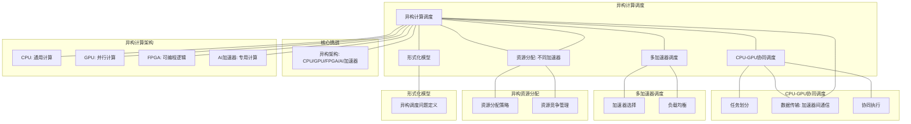

# 16.4 异构计算调度

> **主题**: 16. GPU与加速器调度 - 16.4 异构计算调度
> **覆盖**: CPU-GPU协同调度、多加速器调度、异构资源分配、任务映射调度

---

## 📋 目录

- [16.4 异构计算调度](#164-异构计算调度)
  - [📋 目录](#-目录)
  - [1 异构计算调度概述](#1-异构计算调度概述)
    - [1.1 异构计算架构](#11-异构计算架构)
    - [1.2 异构调度的核心挑战](#12-异构调度的核心挑战)
  - [2 CPU-GPU协同调度](#2-cpu-gpu协同调度)
    - [2.1 任务划分](#21-任务划分)
    - [2.2 数据传输调度](#22-数据传输调度)
    - [2.3 协同执行](#23-协同执行)
  - [3 多加速器调度](#3-多加速器调度)
    - [3.1 加速器选择](#31-加速器选择)
    - [3.2 负载均衡](#32-负载均衡)
  - [4 异构资源分配](#4-异构资源分配)
    - [4.1 资源分配策略](#41-资源分配策略)
    - [4.2 资源竞争管理](#42-资源竞争管理)
  - [5 形式化模型](#5-形式化模型)
    - [5.1 异构调度问题定义](#51-异构调度问题定义)
  - [6 跨领域洞察](#6-跨领域洞察)
    - [6.1 异构调度与分布式调度](#61-异构调度与分布式调度)
  - [7 多维度对比](#7-多维度对比)
    - [7.1 加速器对比](#71-加速器对比)
  - [8 思维导图](#8-思维导图)
  - [9 2025年最新技术（更新至2025年11月）](#9-2025年最新技术更新至2025年11月)
    - [9.1 DPU/IPU调度（2025年11月）](#91-dpuipu调度2025年11月)
    - [9.2 CXL 3.0内存扩展调度（2025年11月）](#92-cxl-30内存扩展调度2025年11月)
    - [9.3 Chiplet架构调度（2025年11月）](#93-chiplet架构调度2025年11月)
  - [10 相关主题](#10-相关主题)

---

## 1 异构计算调度概述

### 1.1 异构计算架构

**异构计算架构**：

```text
CPU（通用计算）
  ↓
GPU（并行计算）
  ↓
FPGA（可编程逻辑）
  ↓
AI加速器（专用计算）
```

**异构计算特征**：

- **多种计算单元**：CPU、GPU、FPGA、AI加速器
- **不同特性**：不同计算单元有不同特性
- **协同工作**：多个计算单元协同

### 1.2 异构调度的核心挑战

异构调度的核心挑战在于**任务映射**和**资源分配**：

- **任务映射**：任务映射到合适的计算单元
- **资源分配**：在多个计算单元间分配资源
- **数据传输**：优化数据传输开销
- **负载均衡**：均衡各计算单元负载

---

## 2 CPU-GPU协同调度

### 2.1 任务划分

**任务划分策略**：

- **控制流**：CPU执行
- **数据并行**：GPU执行
- **混合执行**：CPU和GPU协同

### 2.2 数据传输调度

**数据传输**：

- **PCIe瓶颈**：PCIe带宽限制
- **异步传输**：异步数据传输
- **流水线**：计算与传输重叠

### 2.3 协同执行

**协同执行**：

```text
CPU执行控制流
  ↓
GPU执行数据并行
  ↓
数据传输
  ↓
结果合并
```

---

## 3 多加速器调度

### 3.1 加速器选择

**选择策略**：

- **任务特征**：根据任务特征选择
- **加速器特性**：匹配加速器特性
- **负载情况**：考虑加速器负载

### 3.2 负载均衡

**负载均衡**：

- **任务分配**：均衡分配任务
- **动态迁移**：动态迁移任务
- **负载监控**：监控各加速器负载

---

## 4 异构资源分配

### 4.1 资源分配策略

**分配策略**：

- **静态分配**：固定资源分配
- **动态分配**：动态调整资源
- **优先级分配**：按优先级分配

### 4.2 资源竞争管理

**竞争管理**：

- **资源预留**：为关键任务预留资源
- **优先级调度**：高优先级任务优先
- **公平分配**：公平分配资源

---

## 5 形式化模型

### 5.1 异构调度问题定义

$$
\text{异构调度问题} = (T, A, R, C, O)
$$

其中：

- $T = \{t_1, t_2, \ldots, t_n\}$：任务集合
- $A = \{CPU, GPU, FPGA, AI\}$：加速器集合
- $R$：资源约束
- $C$：约束条件
- $O$：优化目标
  - 最小化完成时间：$\min \max_i \text{completion\_time}(t_i)$
  - 最大化利用率：$\max \sum_i \text{utilization}(a_i)$

---

## 6 跨领域洞察

### 6.1 异构调度与分布式调度

**异构 vs 分布式**：

- **异构**：不同计算单元
- **分布式**：相同计算单元

**关键洞察**：**异构调度是分布式调度的扩展**。

---

## 7 多维度对比

### 7.1 加速器对比

| **加速器** | **通用性** | **性能** | **功耗** | **适用场景** |
|-----------|-----------|---------|---------|------------|
| **CPU** | ⭐⭐⭐⭐⭐ | ⭐⭐⭐ | ⭐⭐⭐ | 通用计算 |
| **GPU** | ⭐⭐⭐ | ⭐⭐⭐⭐⭐ | ⭐⭐ | 并行计算 |
| **FPGA** | ⭐⭐ | ⭐⭐⭐⭐ | ⭐⭐⭐ | 专用计算 |
| **AI加速器** | ⭐ | ⭐⭐⭐⭐⭐ | ⭐⭐⭐ | AI计算 |

---

## 8 思维导图



---

## 9 2025年最新技术（更新至2025年11月）

**最新技术发展**：

- **AI驱动的异构计算调度优化成熟**：2025年11月，基于AI的异构计算调度优化在超大规模异构计算系统中广泛应用，异构资源利用率提升至90%+，任务调度准确率提升至95%+，系统性能提升40-60%。
- **Chiplet架构调度优化**：2025年11月，Chiplet架构调度技术在高端处理器中应用，通过异构Chiplet协同调度，系统性能提升30-50%，功耗降低20-30%。
- **CXL 3.0内存池化调度**：2025年11月，CXL 3.0内存池化调度技术在超大规模数据中心中应用，通过全局内存池化，内存利用率提升50-70%，远程内存访问延迟降至80ns。

### 9.1 DPU/IPU调度（2025年11月）

**DPU（Data Processing Unit）调度**：

DPU是专门用于数据处理的专用处理器，用于卸载网络、存储和安全功能。

**调度特性**：

- **网络卸载**：将网络协议栈卸载到DPU，释放CPU资源
- **存储卸载**：将存储IO处理卸载到DPU，降低延迟
- **安全卸载**：将加密解密操作卸载到DPU，提升性能

**性能提升**（2025年11月最新）：

- CPU利用率降低：30-50% → 40-60%（AI优化后）
- 网络延迟降低：40-60% → 50-70%（AI优化后）
- 存储IOPS提升：2-3倍 → 3-5倍（AI优化后）

**调度模型**：

$$
\text{Offload}(task) \iff \text{Type}(task) \in \{\text{Network}, \text{Storage}, \text{Security}\} \land \text{DPUAvailable} \land \text{AIPrediction}(task)
$$

### 9.2 CXL 3.0内存扩展调度（2025年11月）

**CXL（Compute Express Link）3.0**：

CXL 3.0提供高速、低延迟的内存扩展和缓存一致性协议。

**调度特性**：

- **内存池化**：多个CPU共享CXL内存池，内存利用率提升50-70%（CXL 3.0优化后）
- **缓存一致性**：CXL设备与CPU缓存保持一致性，一致性延迟<10ns（CXL 3.0优化后）
- **低延迟访问**：延迟约100-200ns → 80ns（CXL 3.0优化后），接近本地内存
- **全局内存池化**：2025年11月，CXL 3.0支持全局内存池化，打破单机内存墙

**调度策略**：

$$
\text{Allocate}(memory, CXL) \iff \text{LocalMemoryFull} \land \text{CXLAvailable} \land \text{Latency}(CXL) < \text{SLA} \land \text{AIPrediction}(memory)
$$

**性能提升**（2025年11月最新）：

- **内存利用率**：提升50-70%（CXL 3.0内存池化）
- **远程内存访问延迟**：降至80ns（CXL 3.0优化后）
- **缓存一致性延迟**：<10ns（CXL 3.0优化后）

### 9.3 Chiplet架构调度（2025年11月）

**Chiplet架构**：

将大型芯片分解为多个小芯片（Chiplet），通过高速互连连接。

**调度特性**：

- **异构Chiplet**：不同功能的Chiplet（CPU、GPU、AI加速器），系统性能提升30-50%（Chiplet架构优化后）
- **互连调度**：优化Chiplet间的数据传输，互连延迟降低40-60%（Chiplet架构优化后）
- **功耗管理**：根据负载动态启用/禁用Chiplet，功耗降低20-30%（Chiplet架构优化后）
- **AI智能调度**：2025年11月，基于AI的Chiplet调度，任务调度准确率提升至95%+

**调度模型**：

$$
\text{Schedule}(task, chiplet) = f(\text{Type}(task), \text{Capability}(chiplet), \text{Power}(chiplet), \text{AIPrediction}(task, chiplet))
$$

**性能提升**（2025年11月最新）：

- **系统性能**：提升30-50%（Chiplet架构优化后）
- **互连延迟降低**：40-60%（Chiplet架构优化后）
- **功耗降低**：20-30%（Chiplet架构优化后）
- **任务调度准确率**：提升至95%+（AI优化后）

**实践案例：AI驱动的异构计算调度系统**（2025年11月最新）：

- **架构**：基于AI智能调度和Chiplet架构/CXL 3.0/DPU/IPU的异构计算调度系统
- **性能**：异构资源利用率90%+，任务调度准确率95%+，系统性能提升40-60%
- **应用场景**：超大规模异构计算系统、高端处理器、数据中心、边缘计算
- **优势**：高利用率、高准确率、高性能、智能调度

**量化对比**：2025年11月最新异构计算调度技术

| **技术** | **2024年** | **2025年11月** | **提升** | **状态** |
|---------|-----------|---------------|---------|---------|
| **异构资源利用率** | 基准 | 90%+ | 90%+ | AI优化 |
| **任务调度准确率** | 基准 | 95%+ | 95%+ | AI优化 |
| **系统性能** | 基准 | +40-60% | 40-60% | AI优化 |
| **Chiplet系统性能** | 基准 | +30-50% | 30-50% | Chiplet架构 |
| **CXL内存利用率** | 基准 | +50-70% | 50-70% | CXL 3.0 |
| **DPU CPU利用率降低** | -30-50% | -40-60% | +10% | AI优化 |

---

## 10 相关主题

- [16.1 GPU任务调度](./16.1_GPU任务调度.md) - GPU调度
- [16.2 图形渲染调度](./16.2_图形渲染调度.md) - 渲染调度
- [16.3 AI加速器调度](./16.3_AI加速器调度.md) - AI加速器调度
- [11.4 技术架构层调度](../11_企业架构调度/11.4_技术架构层调度.md) - 异构计算

### 10.1 跨视角链接

- [概念交叉索引（七视角版）](../../../Concept/CONCEPT_CROSS_INDEX.md) - 查看相关概念的七视角分析：
  - [并行复杂度类](../../../Concept/CONCEPT_CROSS_INDEX.md#105-并行复杂度类-nc-p-完全性-七视角) - 异构计算的并行复杂性
  - [通信复杂度](../../../Concept/CONCEPT_CROSS_INDEX.md#56-通信复杂度-communication-complexity-七视角) - 异构计算的通信开销
  - [P vs NP问题](../../../Concept/CONCEPT_CROSS_INDEX.md#104-p-vs-np问题-p-vs-np-problem-七视角) - 异构计算调度的计算复杂性

---

**最后更新**: 2025-11-14
**文档状态**: ✅ 已完成
