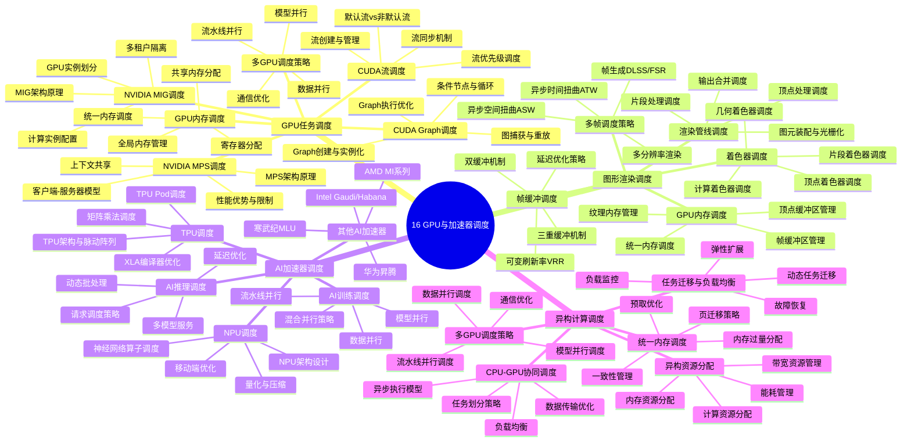

# 16. GPU与加速器调度

> **主题**: GPU任务调度、图形渲染调度、AI加速器调度、异构计算调度
> **覆盖范围**: 从GPU调度到异构计算调度的完整体系

---

## 📋 目录

- [16. GPU与加速器调度](#16-gpu与加速器调度)
  - [📋 目录](#-目录)
  - [1 子主题索引](#1-子主题索引)
    - [1.0 GPU与加速器调度思维导图](#10-gpu与加速器调度思维导图)
  - [2 相关主题](#2-相关主题)
  - [3 核心概念矩阵](#3-核心概念矩阵)
  - [4 调度延迟层级](#4-调度延迟层级)
  - [5 形式化模型](#5-形式化模型)
    - [5.1 GPU调度问题定义](#51-gpu调度问题定义)
    - [5.2 调度算法复杂度](#52-调度算法复杂度)
  - [6 文档更新记录](#6-文档更新记录)

---

## 1 子主题索引

### 1.0 GPU与加速器调度思维导图



**可视化文档**: 查看 [思维导图与知识矩阵](../思维导图与知识矩阵.md#310-10-24-扩展主题) 获取更详细的思维导图。


- [16.1 GPU计算调度](./16.1_GPU计算调度.md) - CUDA执行模型、GPU调度器架构、任务划分策略、内存调度（HBM/GDDR管理）、形式化执行模型、实际性能数据
- [16.2 深度学习调度](./16.2_深度学习调度.md) - 训练任务调度（数据并行/模型并行/流水线并行）、推理调度优化（batching/dynamic shaping）、集群调度器（Kubernetes GPU调度、Slurm）、调度策略（gang scheduling）、GPU利用率优化
- [16.3 异构计算调度](./16.3_异构计算调度.md) - CPU-GPU协同调度、FPGA调度、TPU/AI加速器调度、任务划分与负载均衡、统一编程模型（OpenCL/SYCL/OneAPI）
- [16.4 GPU虚拟化与共享](./16.4_GPU虚拟化与共享.md) - GPU虚拟化技术（vGPU、MIG、SR-IOV）、时间片调度（Tesla M60/时间分片）、空间共享（MIG技术）、容器GPU调度（NVIDIA Docker、MPS）、多租户隔离与QoS

---

## 2 相关主题

- [11.4 技术架构层调度](../11_企业架构调度/11.4_技术架构层调度.md) - 异构计算调度
- [08.4 最新技术趋势](../08_技术演进与对标/08.4_最新技术趋势.md) - AI加速器
- [10.1 强化学习调度](../10_AI驱动调度/10.1_强化学习调度.md) - AI任务调度
- [01.1 CPU微架构](../01_CPU硬件层/01.1_CPU微架构.md) - 并行计算基础

---

## 3 核心概念矩阵

| **调度类型** | **调度单元** | **延迟范围** | **优化目标** | **主要约束** | **关键技术** |
|------------|------------|------------|------------|------------|------------|
| **GPU任务调度** | CUDA内核/CUDA Graph | 1-100μs | 最大化利用率 | SM资源 | CUDA流、Graph、MPS/MIG |
| **图形渲染调度** | 渲染命令/帧 | 16ms(60fps) | 帧率稳定 | 渲染管线 | 双/三重缓冲、VRR、ATW |
| **AI加速器调度** | 张量操作/请求 | 微秒-毫秒 | 最大化吞吐量 | 内存带宽 | 批处理、流水线、并行 |
| **异构计算调度** | 计算任务 | 微秒-秒 | 负载均衡 | 数据传输 | 统一内存、任务迁移 |

---

## 4 调度延迟层级

```text
CPU任务提交
  ↓ [驱动调用] ~1μs
GPU驱动/运行时
  ↓ [命令缓冲区] ~5μs
GPU硬件调度器
  ↓ [SM分配] ~10μs
GPU执行
  ├─ 计算: 微秒-毫秒级
  ├─ 渲染: 16ms（60fps）
  └─ AI推理: 1-100ms
```

**关键洞察**：GPU调度延迟受内存传输影响最大，PCIe带宽（64GB/s）和GPU内存带宽（1-3TB/s）是主要瓶颈。

---

## 5 形式化模型

### 5.1 GPU调度问题定义

$$
\text{GPU调度问题} = (SM, K, M, C, O)
$$

其中：

- $SM = \{sm_1, sm_2, \ldots, sm_n\}$：流多处理器集合
- $K = \{k_1, k_2, \ldots, k_m\}$：CUDA内核集合
- $M$：内存资源（全局内存、共享内存、寄存器）
- $C$：约束条件（资源限制、依赖关系）
- $O$：优化目标（最大化利用率、最小化延迟）

### 5.2 调度算法复杂度

| **算法** | **时间复杂度** | **资源利用率** | **公平性** | **适用场景** |
|---------|--------------|--------------|-----------|------------|
| **FIFO** | $O(1)$ | 60-70% | 无 | 简单场景 |
| **轮询** | $O(1)$ | 70-80% | 公平 | 通用场景 |
| **工作窃取** | $O(\log n)$ | 85-95% | 公平 | 负载不均衡 |
| **优先级调度** | $O(\log n)$ | 75-85% | 不公平 | 实时任务 |

---

## 6 文档更新记录

| 日期 | 更新内容 | 状态 |
|------|---------|------|
| 2025-11-14 | 初始版本 | ✅ |
| 2025-11-14 | 完善16.1 GPU任务调度：补充CUDA流、CUDA Graph、MPS/MIG、多GPU调度策略 | ✅ |
| 2025-11-14 | 完善16.2 图形渲染调度：补充渲染管线、着色器调度、帧缓冲、VRR/ATW/ASW | ✅ |
| 2025-11-14 | 完善16.3 AI加速器调度：补充TPU/NPU调度、AI推理/训练调度、并行策略 | ✅ |
| 2025-11-14 | 完善16.4 异构计算调度：补充CPU-GPU协同、统一内存、任务迁移 | ✅ |

---

**最后更新**: 2025-11-14
**文档状态**: ✅ 已完成，包含完整的GPU与加速器调度体系
