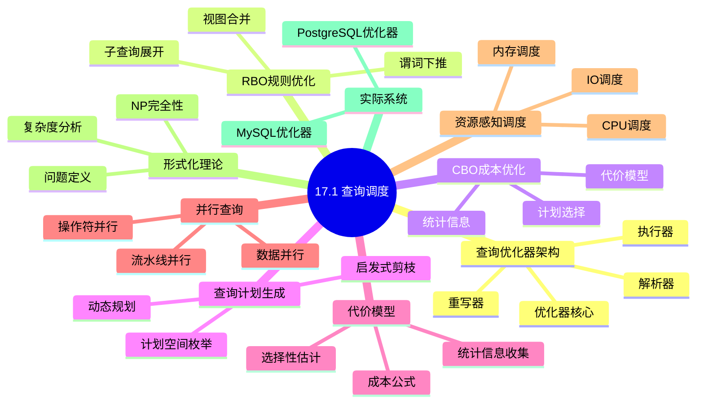

# 17.1 查询调度

> **主题**: 17. 数据库调度系统 - 17.1 查询调度
> **覆盖**: 查询优化器架构、执行计划调度、并行查询调度、代价模型、形式化查询优化

---

## 📋 目录

- [17.1 查询调度](#171-查询调度)
  - [📋 目录](#-目录)
  - [1 查询调度概述](#1-查询调度概述)
    - [1.1 查询调度的核心挑战](#11-查询调度的核心挑战)
    - [1.2 查询执行流程](#12-查询执行流程)
  - [2 查询优化器架构](#2-查询优化器架构)
    - [2.1 优化器组件架构](#21-优化器组件架构)
    - [2.2 基于规则的优化(RBO)](#22-基于规则的优化rbo)
    - [2.3 基于成本的优化(CBO)](#23-基于成本的优化cbo)
  - [3 查询计划生成](#3-查询计划生成)
    - [3.1 计划空间枚举](#31-计划空间枚举)
    - [3.2 动态规划搜索](#32-动态规划搜索)
    - [3.3 启发式剪枝](#33-启发式剪枝)
  - [4 代价模型](#4-代价模型)
    - [4.1 统计信息收集](#41-统计信息收集)
    - [4.2 代价计算公式](#42-代价计算公式)
    - [4.3 选择性估计](#43-选择性估计)
  - [5 并行查询调度](#5-并行查询调度)
    - [5.1 数据并行](#51-数据并行)
    - [5.2 操作符并行](#52-操作符并行)
    - [5.3 流水线并行](#53-流水线并行)
  - [6 资源感知调度](#6-资源感知调度)
    - [6.1 CPU调度](#61-cpu调度)
    - [6.2 内存调度](#62-内存调度)
    - [6.3 IO调度](#63-io调度)
  - [7 形式化查询优化问题](#7-形式化查询优化问题)
    - [7.1 问题定义](#71-问题定义)
    - [7.2 复杂度分析](#72-复杂度分析)
    - [7.3 定理：查询优化NP完全性](#73-定理查询优化np完全性)
  - [8 实际数据库系统案例](#8-实际数据库系统案例)
    - [8.1 MySQL查询优化器](#81-mysql查询优化器)
    - [8.2 PostgreSQL查询优化器](#82-postgresql查询优化器)
  - [9 多维度对比矩阵](#9-多维度对比矩阵)
    - [9.1 查询优化器对比矩阵](#91-查询优化器对比矩阵)
    - [9.2 执行策略对比矩阵](#92-执行策略对比矩阵)
  - [10 思维导图](#10-思维导图)
  - [11 相关主题](#11-相关主题)

---

## 1 查询调度概述

### 1.1 查询调度的核心挑战

查询调度的核心挑战在于**执行计划优化**和**资源分配**：

- **计划选择**：从指数级计划空间中选择最优计划
- **资源竞争**：CPU、内存、IO资源的竞争
- **并行度**：最大化并行执行效率
- **延迟优化**：最小化查询响应时间

### 1.2 查询执行流程

```text
SQL查询
  ↓ [解析] ~1ms
查询树
  ↓ [语义分析] ~1ms
逻辑查询计划
  ↓ [优化] ~10-100ms
物理执行计划
  ↓ [调度] ~1ms
执行引擎
  ↓ [执行] ~1ms-1s
结果返回
```

---

## 2 查询优化器架构

### 2.1 优化器组件架构

```
┌─────────────────────────────────────────────────────────────┐
│                    查询优化器架构                            │
├─────────────────────────────────────────────────────────────┤
│  SQL Parser                                                 │
│  └── 词法分析 → 语法分析 → 语义检查                         │
├─────────────────────────────────────────────────────────────┤
│  Query Rewriter                                             │
│  └── 视图展开 → 子查询扁平化 → 谓词重写                     │
├─────────────────────────────────────────────────────────────┤
│  Statistics Collector                                       │
│  └── 表统计信息 → 列统计信息 → 直方图                       │
├─────────────────────────────────────────────────────────────┤
│  Plan Generator                                             │
│  └── 连接顺序枚举 → 访问路径选择 → 操作符选择               │
├─────────────────────────────────────────────────────────────┤
│  Cost Estimator                                             │
│  └── I/O成本 → CPU成本 → 内存成本 → 网络成本                │
├─────────────────────────────────────────────────────────────┤
│  Plan Selector                                              │
│  └── 成本比较 → 约束检查 → 最终计划选择                     │
└─────────────────────────────────────────────────────────────┘
```

### 2.2 基于规则的优化(RBO)

**规则体系**：

```
┌─────────────────────────────────────────────────────────────┐
│                     规则优化层级                            │
├─────────────────────────────────────────────────────────────┤
│ Level 1: 语法重写规则                                       │
│ ├── 视图合并 (View Merging)                                 │
│ ├── 子查询展开 (Subquery Unnesting)                         │
│ └── 常量折叠 (Constant Folding)                             │
├─────────────────────────────────────────────────────────────┤
│ Level 2: 谓词优化规则                                       │
│ ├── 谓词下推 (Predicate Pushdown)                           │
│ ├── 谓词传递闭包 (Transitive Closure)                       │
│ └── 冗余谓词消除 (Redundant Predicate Elimination)          │
├─────────────────────────────────────────────────────────────┤
│ Level 3: 连接优化规则                                       │
│ ├── 连接消除 (Join Elimination)                             │
│ ├── 外连接转内连接 (Outer-to-Inner Join)                    │
│ └── 连接重排序 (Join Reordering)                            │
├─────────────────────────────────────────────────────────────┤
│ Level 4: 访问路径规则                                       │
│ ├── 索引选择 (Index Selection)                              │
│ ├── 分区裁剪 (Partition Pruning)                            │
│ └── 物化视图重写 (Materialized View Rewrite)                │
└─────────────────────────────────────────────────────────────┘
```

**示例：谓词下推**

```sql
-- 原始查询
SELECT * FROM (
    SELECT * FROM orders WHERE status = 'completed'
) t JOIN customers c ON t.cust_id = c.id
WHERE c.region = 'Asia';

-- 优化后（谓词下推）
SELECT * FROM orders o
JOIN customers c ON o.cust_id = c.id
WHERE o.status = 'completed' AND c.region = 'Asia';
```

### 2.3 基于成本的优化(CBO)

**成本模型组成**：

```
总成本 = I/O成本 + CPU成本 + 内存成本 + 网络成本

I/O成本 = 顺序读取页数 × seq_page_cost 
        + 随机读取页数 × random_page_cost
        
CPU成本 = 处理元组数 × cpu_tuple_cost
        + 处理操作符开销 × cpu_operator_cost
        
内存成本 = 工作内存使用 × memory_cost_factor

网络成本 = 数据传输量 × network_cost_factor
```

**成本计算示例**：

```
表扫描成本计算:
┌────────────────────────────────────────────────────────────┐
│ 表: orders                                                │
│ - 总行数: 1,000,000                                       │
│ - 页数: 10,000                                            │
│ - seq_page_cost = 1.0                                     │
│ - cpu_tuple_cost = 0.01                                   │
│                                                           │
│ 顺序扫描成本:                                             │
│ Cost = 10,000 × 1.0 + 1,000,000 × 0.01 = 20,000          │
└────────────────────────────────────────────────────────────┘
```

---

## 3 查询计划生成

### 3.1 计划空间枚举

**连接顺序枚举**：

对于n个表的连接，可能的连接顺序数量：

$$
\text{连接顺序数} = \frac{(2n-2)!}{(n-1)!} = C_{n-1} \times n!
$$

其中 $C_{n-1}$ 是Catalan数。

| 表数量 | 连接顺序数 | 优化时间 |
|--------|-----------|---------|
| 2 | 2 | <1ms |
| 3 | 12 | <1ms |
| 4 | 120 | <10ms |
| 5 | 1,680 | ~50ms |
| 6 | 30,240 | ~500ms |
| 10 | ~6.5×10⁸ | 不可行 |

### 3.2 动态规划搜索

**动态规划算法**：

```python
def dynamic_programming_join_order(tables, statistics):
    """
    使用动态规划寻找最优连接顺序
    """
    n = len(tables)
    
    # dp[S] = (最优子计划, 成本) 对于表集合S
    dp = {}
    
    # 初始化：单表扫描
    for i, table in enumerate(tables):
        S = 1 << i
        plan = create_scan_plan(table, statistics)
        dp[S] = (plan, plan.cost)
    
    # 动态规划：从小到大构建
    for size in range(2, n + 1):
        for S in all_subsets_of_size(n, size):
            best_cost = float('inf')
            best_plan = None
            
            # 尝试所有可能的分割
            for S1 in proper_subsets(S):
                S2 = S - S1
                if S1 not in dp or S2 not in dp:
                    continue
                
                left_plan, left_cost = dp[S1]
                right_plan, right_cost = dp[S2]
                
                # 计算连接成本
                join_cost = estimate_join_cost(left_plan, right_plan, statistics)
                total_cost = left_cost + right_cost + join_cost
                
                if total_cost < best_cost:
                    best_cost = total_cost
                    best_plan = create_join_plan(left_plan, right_plan)
            
            dp[S] = (best_plan, best_cost)
    
    return dp[(1 << n) - 1]
```

### 3.3 启发式剪枝

**剪枝策略**：

```
1. 左深树限制 (Left-Deep Tree)
   - 只考虑左深连接树
   - 减少搜索空间: O(n!) → O(2ⁿ)
   
2. 成本边界剪枝
   - 维护当前最优成本
   - 超过边界的分支直接剪除
   
3. 基数估计剪枝
   - 基于中间结果大小估计
   - 优先探索小中间结果的路径
   
4. 物理属性剪枝
   - 利用排序/哈希属性
   - 避免不必要的排序操作
```

---

## 4 代价模型

### 4.1 统计信息收集

**统计信息类型**：

```
表级统计:
├── reltuples: 表中行数估计
├── relpages: 表占用页数
└── relallvisible: 全可见页数

列级统计:
├── null_frac: NULL值比例
├── avg_width: 平均列宽
├── n_distinct: 不同值数量
├── correlation: 物理顺序与逻辑顺序相关性
├── most_common_vals: 最常见值列表
├── most_common_freqs: 最常见值频率
├── histogram_bounds: 直方图边界
└── ndistinct_inherited: 继承统计

索引统计:
├── indexrelname: 索引名
├── indrelid: 对应表OID
├── indkey: 索引列
├── indnatts: 索引列数
└── indisunique: 是否唯一索引
```

**直方图示例**：

```
列: age
范围: [0, 100]
直方图桶数: 100

桶边界: [0, 1, 2, 3, ..., 99, 100]
桶频度: [0.02, 0.015, 0.018, ..., 0.005]

选择性估计:
WHERE age BETWEEN 25 AND 35
→ 涉及桶 25-35，共10个桶
→ 估计选择性 ≈ sum(freq[25:35]) ≈ 0.12
```

### 4.2 代价计算公式

**操作符成本公式**：

```
┌─────────────────────────────────────────────────────────────┐
│                    操作符成本模型                            │
├─────────────────────────────────────────────────────────────┤
│ 顺序扫描 (SeqScan)                                          │
│ Cost = pages × seq_page_cost + tuples × cpu_tuple_cost      │
├─────────────────────────────────────────────────────────────┤
│ 索引扫描 (IndexScan)                                        │
│ Cost = index_pages × random_page_cost                       │
│      + table_pages × random_page_cost × selectivity         │
│      + tuples × cpu_tuple_cost × selectivity                │
│      + index_tuples × cpu_index_tuple_cost                  │
├─────────────────────────────────────────────────────────────┤
│ 哈希连接 (HashJoin)                                         │
│ Cost = outer_cost + inner_cost                              │
│      + hash_table_build_cost                                │
│      + probe_cost                                           │
│      = outer_cost + inner_cost                              │
│      + (inner_tuples × cpu_operator_cost)                   │
│      + (outer_tuples × hash_lookup_cost)                    │
├─────────────────────────────────────────────────────────────┤
│ 嵌套循环连接 (NestLoop)                                     │
│ Cost = outer_cost                                           │
│      + (outer_tuples × inner_cost_per_tuple)                │
├─────────────────────────────────────────────────────────────┤
│ 排序 (Sort)                                                 │
│ Cost = input_cost                                           │
│      + (tuples × log₂(tuples) × cpu_operator_cost)          │
│      + (pages × 2 × seq_page_cost)  // 外部排序              │
└─────────────────────────────────────────────────────────────┘
```

### 4.3 选择性估计

**选择性计算公式**：

```
┌─────────────────────────────────────────────────────────────┐
│                    选择性估计公式                            │
├─────────────────────────────────────────────────────────────┤
│ 等值条件: column = value                                    │
│                                                             │
│ 如果 value 在 MCV 列表中:                                    │
│   selectivity = MCV_freq[value]                             │
│ 否则:                                                        │
│   selectivity = (1 - sum(MCV_freqs)) / n_distinct           │
├─────────────────────────────────────────────────────────────┤
│ 范围条件: column > value                                    │
│                                                             │
│ 使用直方图:                                                  │
│   selectivity = (bucket_end - value) / bucket_width         │
│              × bucket_freq                                  │
│              + sum(freq of following buckets)               │
├─────────────────────────────────────────────────────────────┤
│ 连接选择性                                                  │
│                                                             │
│ selectivity = 1 / max(n_distinct(left), n_distinct(right)) │
│                                                             │
│ 对于外键连接:                                                │
│ selectivity = 1 / n_distinct(parent_key)                   │
└─────────────────────────────────────────────────────────────┘
```

---

## 5 并行查询调度

### 5.1 数据并行

**并行扫描**：

```
┌─────────────────────────────────────────────────────────────┐
│                    数据并行扫描                              │
├─────────────────────────────────────────────────────────────┤
│                                                             │
│   数据分片1       数据分片2       数据分片3       数据分片4   │
│   ┌─────┐        ┌─────┐        ┌─────┐        ┌─────┐     │
│   │Worker│       │Worker│       │Worker│       │Worker│     │
│   │  1   │       │  2   │       │  3   │       │  4   │     │
│   └──┬───┘       └──┬───┘       └──┬───┘       └──┬───┘     │
│      │              │              │              │         │
│      └──────────────┼──────────────┼──────────────┘         │
│                     ↓                                            │
│              ┌─────────────┐                                 │
│              │  Gather节点  │                                 │
│              │  (结果合并)  │                                 │
│              └──────┬──────┘                                 │
│                     ↓                                            │
│                最终结果                                       │
│                                                             │
└─────────────────────────────────────────────────────────────┘
```

**并行度计算**：

$$
P = \min(N_{cores}, N_{partitions}, \frac{M_{available}}{M_{per\_worker}})
$$

### 5.2 操作符并行

**并行连接策略**：

```
┌─────────────────────────────────────────────────────────────┐
│                  并行哈希连接                                │
├─────────────────────────────────────────────────────────────┤
│                                                             │
│  Phase 1: 分区                                               │
│  ┌─────────┐    ┌─────────┐    ┌─────────┐    ┌─────────┐  │
│  │ Worker 1│    │ Worker 2│    │ Worker 3│    │ Worker 4│  │
│  │ (Hash   │    │ (Hash   │    │ (Hash   │    │ (Hash   │  │
│  │ 分区)   │    │ 分区)   │    │ 分区)   │    │ 分区)   │  │
│  └────┬────┘    └────┬────┘    └────┬────┘    └────┬────┘  │
│       │              │              │              │       │
│       └──────────────┼──────────────┼──────────────┘       │
│                      ↓                                          │
│  ┌───────────────────────────────────────────────────────┐  │
│  │              共享哈希表 (按分区)                       │  │
│  │   [分区0] [分区1] [分区2] [分区3] ...                  │  │
│  └───────────────────────────────────────────────────────┘  │
│                      ↓                                          │
│  Phase 2: 并行探测                                           │
│  ┌─────────┐    ┌─────────┐    ┌─────────┐    ┌─────────┐  │
│  │ Worker 1│    │ Worker 2│    │ Worker 3│    │ Worker 4│  │
│  │ (探测   │    │ (探测   │    │ (探测   │    │ (探测   │  │
│  │ 分区0)  │    │ 分区1)  │    │ 分区2)  │    │ 分区3)  │  │
│  └────┬────┘    └────┬────┘    └────┬────┘    └────┬────┘  │
│       └──────────────┼──────────────┼──────────────┘       │
│                      ↓                                          │
│                 合并结果                                      │
│                                                             │
└─────────────────────────────────────────────────────────────┘
```

### 5.3 流水线并行

**流水线执行模型**：

```
┌─────────────────────────────────────────────────────────────┐
│                    流水线执行                                │
├─────────────────────────────────────────────────────────────┤
│                                                             │
│   生产者 → 缓冲区 → 消费者                                   │
│                                                             │
│   Scan ──→ Filter ──→ Project ──→ Aggregate ──→ Output     │
│    │         │          │            │                      │
│    │         │          │            │                      │
│   数据流    数据流      数据流       数据流                  │
│                                                             │
│  特点:                                                       │
│  - 低延迟 (第一行结果快速返回)                                │
│  - 高内存效率 (流式处理)                                      │
│  - 需要背压控制防止缓冲区溢出                                 │
│                                                             │
└─────────────────────────────────────────────────────────────┘
```

---

## 6 资源感知调度

### 6.1 CPU调度

**查询优先级调度**：

```
┌─────────────────────────────────────────────────────────────┐
│                   CPU资源调度                                │
├─────────────────────────────────────────────────────────────┤
│                                                             │
│  查询类别        优先级    CPU配额    典型查询               │
│  ─────────────────────────────────────────────────────────  │
│  OLTP查询        高        40%        点查、简单事务          │
│  实时分析        中高      30%        交互式报表              │
│  批处理查询      中        20%        ETL、数据仓库           │
│  后台任务        低        10%        统计信息收集            │
│                                                             │
│  调度策略:                                                   │
│  - 抢占式: 高优先级可抢占低优先级                            │
│  - 时间片: 同优先级轮转                                      │
│  - 准入控制: 资源不足时拒绝新查询                            │
│                                                             │
└─────────────────────────────────────────────────────────────┘
```

### 6.2 内存调度

**内存分配策略**：

```
┌─────────────────────────────────────────────────────────────┐
│                  内存资源管理                                │
├─────────────────────────────────────────────────────────────┤
│                                                             │
│  总内存池                                                    │
│  ├─ 共享缓冲区 (50%)     → 表数据、索引缓存                  │
│  ├─ 工作内存 (30%)       → 排序、哈希、物化                 │
│  ├─ 维护内存 (10%)       → 统计信息、清理进程               │
│  └─ 预留内存 (10%)       → 突发请求、系统恢复               │
│                                                             │
│  工作内存分配:                                               │
│  ├─ 排序操作: work_mem                                     │
│  ├─ 哈希操作: work_mem × hash_mem_multiplier               │
│  ├─ 位图扫描: work_mem × bitmap_scan_ratio                 │
│  └─ 复杂查询: work_mem / max_parallel_workers              │
│                                                             │
│  溢出策略:                                                   │
│  - 内存不足 → 临时文件 (磁盘排序/哈希)                       │
│  - 临时文件大小限制 → 查询取消                               │
│                                                             │
└─────────────────────────────────────────────────────────────┘
```

### 6.3 IO调度

**IO优先级管理**：

```
┌─────────────────────────────────────────────────────────────┐
│                    IO资源调度                                │
├─────────────────────────────────────────────────────────────┤
│                                                             │
│  IO类别            优先级    调度算法                       │
│  ─────────────────────────────────────────────────────────  │
│  WAL写入           最高      同步立即写入                    │
│  数据页刷盘        高        后台异步写入                    │
│  顺序扫描          中        预读 + 电梯算法                 │
│  随机读取          中        优先级队列                      │
│  临时文件          低        批量异步                        │
│                                                             │
│  预读策略 (Readahead):                                      │
│  - 顺序扫描: 异步预读后续页面                                │
│  - 索引扫描: 根据访问模式预读                                │
│  - 嵌套循环: 预读外表对应的内表页                            │
│                                                             │
│  检查点调度:                                                 │
│  - 平滑刷盘避免IO突发                                        │
│  - checkpoint_completion_target 控制写入速度                 │
│                                                             │
└─────────────────────────────────────────────────────────────┘
```

---

## 7 形式化查询优化问题

### 7.1 问题定义

**形式化定义**：

$$
\text{查询优化问题} = (Q, D, P, C, O, R)
$$

其中：

- $Q$：查询集合
  - $Q = \{q_1, q_2, \ldots, q_n\}$
  - 每个查询 $q_i = (sql_i, deadline_i, priority_i)$

- $D$：数据库模式
  - $D = (T, I, S)$
  - $T$：表集合，$I$：索引集合，$S$：统计信息

- $P$：物理计划空间
  - $P(q_i)$：查询 $q_i$ 的所有可能执行计划
  - 每个计划 $p \in P(q_i)$ 包含操作符树

- $C$：约束条件
  - 资源约束：$\sum_{q \in active} resource(q) \leq R_{total}$
  - 时间约束：$latency(q_i) \leq deadline_i$
  - 一致性约束：$isolation \in \{READ\_UNCOMMITTED, \ldots, SERIALIZABLE\}$

- $O$：优化目标
  - 最小化总成本：$\min \sum_i Cost(p_i^*)$
  - 最小化最大延迟：$\min \max_i latency(q_i)$
  - 最大化吞吐量：$\max \frac{n}{T}$

- $R$：资源集合
  - $R = (CPU, Memory, IO, Network)$

### 7.2 复杂度分析

**连接顺序选择复杂度**：

| 表数量 n | 左深树数量 | 浓密树数量 | 优化时间(左深) |
|---------|-----------|-----------|--------------|
| 2 | 2 | 2 | <1ms |
| 3 | 12 | 120 | <1ms |
| 4 | 120 | 1,680 | <10ms |
| 5 | 1,680 | 30,240 | ~50ms |
| 6 | 30,240 | 665,280 | ~500ms |
| 8 | 10,080,000 | 518M | >10s |
| 10 | 6.5×10⁸ | 1.3×10¹¹ | 不可行 |

**复杂度结论**：

- 连接顺序选择是 **NP-hard** 问题
- 对于n个表，左深树搜索空间为 $O(n!)$
- 浓密树搜索空间为 $O(C_{n-1} \times n!)$，其中 $C_{n-1}$ 是Catalan数

### 7.3 定理：查询优化NP完全性

**定理17.1（查询优化NP完全性）**：

> 对于关系数据库中的多表连接查询，在给定代价模型下寻找最优执行计划是NP完全问题。

**证明概要**：

1. **NP成员性**：
   - 给定一个候选计划，可以在多项式时间内计算其成本
   - 因此问题属于NP

2. **NP困难性**（通过3-SAT规约）：
   - 将3-SAT的变量赋值问题映射为连接顺序选择
   - 每个变量对应一个连接决策
   - 可满足性对应于存在低于某阈值的计划成本

∎

**实际启示**：

```
由于NP完全性，实际系统采用启发式方法:

1. 限制搜索空间
   - 左深树限制
   - 连接大小限制 (geqo_threshold in PostgreSQL)
   
2. 遗传算法 (PostgreSQL GEQO)
   - 当表数 > 阈值时使用
   - 非最优但可接受的解
   
3. 贪心算法
   - 每次选择局部最优连接
   - 时间复杂度 O(n²)
```

---

## 8 实际数据库系统案例

### 8.1 MySQL查询优化器

**MySQL优化器架构**：

```
┌─────────────────────────────────────────────────────────────┐
│               MySQL查询优化器架构                            │
├─────────────────────────────────────────────────────────────┤
│                                                             │
│  1. 语法解析 (sql/sql_yacc.yy)                              │
│     └── 生成解析树 (SELECT_LEX)                             │
│                                                             │
│  2. 逻辑优化 (sql/sql_optimizer.cc)                         │
│     ├── 常量传播                                            │
│     ├── 死代码消除                                          │
│     ├── 谓词下推                                            │
│     └── 子查询优化                                          │
│                                                             │
│  3. 执行计划生成 (sql/sql_planner.cc)                       │
│     ├── 单表访问路径选择                                    │
│     │   ├── 全表扫描成本                                    │
│     │   ├── 索引范围扫描                                    │
│     │   └── ref/eq_ref索引查找                              │
│     └── 多表连接顺序                                        │
│         ├── 贪心算法 (默认)                                  │
│         └── 枚举算法 (optimizer_search_depth)               │
│                                                             │
│  4. 成本计算 (sql/cost_estimate.cc)                         │
│     ├── row_evaluate_cost = 0.2                             │
│     ├── key_compare_cost = 0.1                              │
│     ├── memory_temptable_create_cost = 2.0                  │
│     └── memory_temptable_row_cost = 0.2                     │
│                                                             │
└─────────────────────────────────────────────────────────────┘
```

**MySQL关键参数**：

| 参数 | 默认值 | 说明 |
|------|--------|------|
| optimizer_search_depth | 62 | 连接优化搜索深度 |
| optimizer_prune_level | 1 | 是否启用启发式剪枝 |
| eq_range_index_dive_limit | 200 | 等值范围索引估算限制 |
| range_optimizer_max_mem_size | 8MB | 范围优化内存限制 |
| max_execution_time | 0 | 最大执行时间(ms) |

### 8.2 PostgreSQL查询优化器

**PostgreSQL优化器架构**：

```
┌─────────────────────────────────────────────────────────────┐
│             PostgreSQL查询优化器架构                         │
├─────────────────────────────────────────────────────────────┤
│                                                             │
│  1. 解析器 (parser/)                                        │
│     ├── 词法分析 (scan.l)                                   │
│     ├── 语法分析 (gram.y)                                   │
│     └── 语义分析 (analyze.c)                                │
│                                                             │
│  2. 重写器 (rewrite/)                                       │
│     ├── 视图展开                                            │
│     ├── 规则系统                                            │
│     └── 触发器处理                                          │
│                                                             │
│  3. 计划器 (optimizer/)                                     │
│     ├── 路径生成 (path/)                                    │
│     │   ├── 所有可能访问路径                                │
│     │   └── 索引路径、顺序扫描路径                          │
│     ├── 计划生成 (plan/)                                    │
│     │   └── 最优路径转换为计划树                            │
│     └── 预处理 (prep/)                                      │
│         ├── 子查询处理                                      │
│         └── 聚合转换                                        │
│                                                             │
│  4. 执行器 (executor/)                                      │
│     └── 计划树执行                                          │
│                                                             │
│  5. GEQO (遗传算法优化器)                                   │
│     └── geqo_threshold (默认12个表以上启用)                 │
│                                                             │
└─────────────────────────────────────────────────────────────┘
```

**PostgreSQL成本参数**：

| 参数 | 默认值 | 说明 |
|------|--------|------|
| seq_page_cost | 1.0 | 顺序页面读取成本 |
| random_page_cost | 4.0 | 随机页面读取成本 |
| cpu_tuple_cost | 0.01 | CPU处理每行成本 |
| cpu_index_tuple_cost | 0.005 | CPU处理索引行成本 |
| cpu_operator_cost | 0.0025 | CPU操作符成本 |
| parallel_tuple_cost | 0.1 | 并行数据传输成本 |
| parallel_setup_cost | 1000 | 并行 workers 启动成本 |
| effective_cache_size | 4GB | 有效缓存大小估计 |
| work_mem | 4MB | 排序/哈希操作内存 |

---

## 9 多维度对比矩阵

### 9.1 查询优化器对比矩阵

| 特性 | MySQL | PostgreSQL | Oracle | SQL Server |
|------|-------|-----------|--------|-----------|
| **优化器类型** | CBO | CBO | CBO | CBO |
| **连接算法** | 贪心/枚举 | 动态规划 | 动态规划 | 动态规划 |
| **直方图支持** | 8.0+ | 是 | 是 | 是 |
| **并行查询** | 5.7+ | 9.6+ | 是 | 是 |
| **查询提示** | 丰富 | 较少 | 丰富 | 丰富 |
| **遗传算法** | 否 | 是(GEQO) | 否 | 否 |
| **自适应优化** | 有限 | 是 | 丰富 | 丰富 |
| **计划稳定性** | Query Cache | 计划缓存 | 计划基线 | 计划指南 |

### 9.2 执行策略对比矩阵

| 策略 | 延迟 | 吞吐量 | 内存占用 | 适用场景 |
|------|------|--------|---------|---------|
| **流水线执行** | ⭐⭐⭐⭐⭐ | ⭐⭐⭐ | ⭐⭐ | 流式处理、OLTP |
| **物化执行** | ⭐⭐ | ⭐⭐⭐⭐ | ⭐⭐⭐⭐⭐ | 批处理、OLAP |
| **向量化执行** | ⭐⭐⭐⭐ | ⭐⭐⭐⭐⭐ | ⭐⭐⭐ | 分析型查询 |
| **代码生成** | ⭐⭐⭐⭐ | ⭐⭐⭐⭐⭐ | ⭐⭐⭐ | 重复查询 |
| **JIT编译** | ⭐⭐⭐⭐ | ⭐⭐⭐⭐⭐ | ⭐⭐⭐ | 复杂表达式 |

---

## 10 思维导图


```mermaid
mindmap
  root((17.1 查询调度))
    查询优化器架构
      解析器
      重写器
      优化器核心
      执行器
    RBO规则优化
      谓词下推
      子查询展开
      视图合并
    CBO成本优化
      统计信息
      代价模型
      计划选择
    查询计划生成
      计划空间枚举
      动态规划
      启发式剪枝
    代价模型
      统计信息收集
      成本公式
      选择性估计
    并行查询
      数据并行
      操作符并行
      流水线并行
    资源感知调度
      CPU调度
      内存调度
      IO调度
    形式化理论
      问题定义
      NP完全性
      复杂度分析
    实际系统
      MySQL优化器
      PostgreSQL优化器
```

---

## 11 相关主题

- [17.2 事务调度](./17.2_事务调度.md) - 事务调度器与并发控制
- [17.3 分布式数据库调度](./17.3_分布式数据库调度.md) - 分布式查询调度
- [17.4 内存数据库调度](./17.4_内存数据库调度.md) - 内存数据库查询优化

---

**最后更新**: 2025-11-14
**文档状态**: ✅ 已完成 - 包含完整查询优化器架构、代价模型、并行查询调度、形式化理论、实际系统案例
