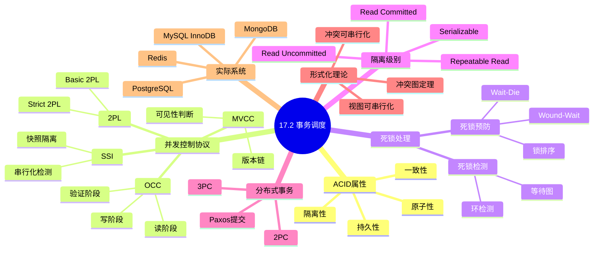

# 17.2 事务调度

> **主题**: 17. 数据库调度系统 - 17.2 事务调度
> **覆盖**: 并发控制协议（2PL、MVCC、OCC）、死锁检测与预防、事务隔离级别、分布式事务调度、形式化可串行化理论

---

## 📋 目录

- [17.2 事务调度](#172-事务调度)
  - [📋 目录](#-目录)
  - [1 事务调度概述](#1-事务调度概述)
    - [1.1 事务ACID属性](#11-事务acid属性)
    - [1.2 调度核心挑战](#12-调度核心挑战)
  - [2 并发控制协议](#2-并发控制协议)
    - [2.1 两阶段锁定(2PL)](#21-两阶段锁定2pl)
    - [2.2 多版本并发控制(MVCC)](#22-多版本并发控制mvcc)
    - [2.3 乐观并发控制(OCC)](#23-乐观并发控制occ)
    - [2.4 时间戳排序(T/O)](#24-时间戳排序to)
    - [2.5 可串行化快照隔离(SSI)](#25-可串行化快照隔离ssi)
  - [3 死锁检测与预防](#3-死锁检测与预防)
    - [3.1 死锁检测算法](#31-死锁检测算法)
    - [3.2 死锁预防策略](#32-死锁预防策略)
    - [3.3 死锁处理策略](#33-死锁处理策略)
  - [4 事务隔离级别实现](#4-事务隔离级别实现)
    - [4.1 SQL标准隔离级别](#41-sql标准隔离级别)
    - [4.2 隔离级别实现对比](#42-隔离级别实现对比)
    - [4.3 幻读与间隙锁](#43-幻读与间隙锁)
  - [5 分布式事务调度](#5-分布式事务调度)
    - [5.1 两阶段提交(2PC)](#51-两阶段提交2pc)
    - [5.2 三阶段提交(3PC)](#52-三阶段提交3pc)
    - [5.3 Paxos提交协议](#53-paxos提交协议)
  - [6 形式化可串行化理论](#6-形式化可串行化理论)
    - [6.1 冲突可串行化](#61-冲突可串行化)
    - [6.2 视图可串行化](#62-视图可串行化)
    - [6.3 冲突图与判定定理](#63-冲突图与判定定理)
    - [6.4 事务调度问题形式化定义](#64-事务调度问题形式化定义)
  - [7 实际数据库系统案例](#7-实际数据库系统案例)
    - [7.1 MySQL InnoDB并发控制](#71-mysql-innodb并发控制)
    - [7.2 PostgreSQL并发控制](#72-postgresql并发控制)
    - [7.3 Redis事务机制](#73-redis事务机制)
    - [7.4 MongoDB事务机制](#74-mongodb事务机制)
  - [8 多维度对比矩阵](#8-多维度对比矩阵)
    - [8.1 并发控制协议对比](#81-并发控制协议对比)
    - [8.2 数据库系统对比](#82-数据库系统对比)
  - [9 思维导图](#9-思维导图)
  - [10 相关主题](#10-相关主题)

---

## 1 事务调度概述

### 1.1 事务ACID属性

```
┌─────────────────────────────────────────────────────────────┐
│                    ACID属性                                 │
├─────────────────────────────────────────────────────────────┤
│                                                             │
│  A - Atomicity (原子性)                                     │
│     事务是不可分割的工作单位                                │
│     要么全部执行成功，要么全部回滚                          │
│     实现: WAL(Write-Ahead Logging)、Undo Log               │
│                                                             │
│  C - Consistency (一致性)                                   │
│     事务执行前后数据库处于一致状态                          │
│     满足所有完整性约束                                      │
│     实现: 约束检查、触发器、级联操作                        │
│                                                             │
│  I - Isolation (隔离性)                                     │
│     并发事务互不干扰                                        │
│     实现: 锁、MVCC、时间戳                                  │
│                                                             │
│  D - Durability (持久性)                                    │
│     已提交事务的结果永久保存                                │
│     即使系统崩溃也不丢失                                    │
│     实现: WAL、Checkpoint、备份                             │
│                                                             │
└─────────────────────────────────────────────────────────────┘
```

### 1.2 调度核心挑战

事务调度的核心挑战在于**一致性保证**和**性能优化**：

- **隔离性**：保证事务间的隔离级别
- **一致性**：保证数据库状态的一致性
- **性能**：最小化锁竞争和死锁
- **可串行化**：保证调度结果等价于某个串行调度

---

## 2 并发控制协议

### 2.1 两阶段锁定(2PL)

**基本协议**：

```
┌─────────────────────────────────────────────────────────────┐
│                  两阶段锁定(2PL)协议                         │
├─────────────────────────────────────────────────────────────┤
│                                                             │
│  Phase 1: 扩展阶段 (Growing Phase)                          │
│  ─────────────────────────────────────                      │
│  • 事务可以获取锁                                           │
│  • 不能释放任何锁                                           │
│  • 锁集合单调增长                                           │
│                                                             │
│       T1          T2          T3                            │
│       │           │           │                             │
│       ● Lock(A)   │           │                             │
│       │           ● Lock(B)   │                             │
│       ● Lock(C)   │           ● Lock(A)                    │
│       │           ● Lock(C)   │                             │
│       ◄── 扩展阶段结束点 ──►                                │
│                                                             │
│  Phase 2: 收缩阶段 (Shrinking Phase)                        │
│  ─────────────────────────────────────                      │
│  • 事务可以释放锁                                           │
│  • 不能获取新锁                                             │
│  • 锁集合单调减少                                           │
│                                                             │
│       ● Unlock(C) ● Unlock(B) ● Unlock(A)                  │
│       ● Unlock(A)           ● Unlock(A)                    │
│                                                             │
└─────────────────────────────────────────────────────────────┘
```

**2PL变体**：

| 变体 | 特点 | 一致性保证 |
|------|------|-----------|
| **Basic 2PL** | 基本两阶段锁定 | 可串行化 |
| **Strict 2PL** | 提交后才释放写锁 | 严格可串行化 |
| **Rigorous 2PL** | 提交后才释放所有锁 | 严格可串行化 |
| **Conservative 2PL** | 预先获取所有需要的锁 | 无死锁 |

**定理17.2（2PL可串行化定理）**：

> 如果所有事务遵循2PL协议，则任何并发调度都是可串行化的。

**证明**：

- 2PL保证事务的封锁点（最后获取锁的时刻）形成全序
- 按封锁点排序的串行调度与并发调度等价
∎

### 2.2 多版本并发控制(MVCC)

**MVCC核心机制**：

```
┌─────────────────────────────────────────────────────────────┐
│                  MVCC多版本机制                              │
├─────────────────────────────────────────────────────────────┤
│                                                             │
│  数据版本链:                                                │
│                                                             │
│  Row X                                                      │
│  ┌───────────────────────────────────────────────────────┐ │
│  │  Version 3: value='C', tx_id=103, ts=300              │ │
│  │     ↑ (被版本2指向)                                    │ │
│  │  Version 2: value='B', tx_id=102, ts=200              │ │
│  │     ↑ (被版本1指向)                                    │ │
│  │  Version 1: value='A', tx_id=101, ts=100              │ │
│  └───────────────────────────────────────────────────────┘ │
│                                                             │
│  事务可见性判断:                                            │
│  ┌───────────────────────────────────────────────────────┐ │
│  │ 对于事务 T (start_ts=150):                            │ │
│  │ • 版本3 (ts=300): 300 > 150 → 不可见                  │ │
│  │ • 版本2 (ts=200): 200 > 150 → 不可见                  │ │
│  │ • 版本1 (ts=100): 100 ≤ 150 → 可见 ✓                  │ │
│  └───────────────────────────────────────────────────────┘ │
│                                                             │
│  写操作:                                                    │
│  • 创建新版本，设置 tx_id = 当前事务ID                      │
│  • 设置 begin_ts = 事务提交时间戳                           │
│                                                             │
└─────────────────────────────────────────────────────────────┘
```

**版本管理公式**：

$$
\text{visible}(V, T) = (V.begin\_ts \leq T.start\_ts) \land (V.end\_ts = \infty \lor V.end\_ts > T.start\_ts)
$$

**MVCC实现对比**：

| 数据库 | 版本存储 | 事务ID | 垃圾回收 |
|--------|---------|--------|---------|
| PostgreSQL | 堆元组中 | 32-bit XID | 自动清理进程 |
| MySQL InnoDB | Undo日志 | 6-byte TRX_ID | Purge线程 |
| Oracle | Undo表空间 | SCN | 自动管理 |
| SQL Server | TempDB | 8-byte XSN | 版本存储清理 |

### 2.3 乐观并发控制(OCC)

**OCC三阶段协议**：

```
┌─────────────────────────────────────────────────────────────┐
│                乐观并发控制(OCC)                             │
├─────────────────────────────────────────────────────────────┤
│                                                             │
│  Phase 1: 读阶段 (Read Phase)                               │
│  ─────────────────────────────────────                      │
│  • 读取数据到私有工作区                                     │
│  • 记录读集合 (Read Set)                                    │
│  • 在私有副本上进行修改                                     │
│  • 记录写集合 (Write Set)                                   │
│                                                             │
│       ReadSet = {A: ver=100, B: ver=105}                   │
│       WriteSet = {B: new_value, C: new_value}              │
│                                                             │
│  Phase 2: 验证阶段 (Validation Phase)                       │
│  ─────────────────────────────────────                      │
│  • 检查读集合中的数据版本是否变化                           │
│  • 向后验证: 检查其他已提交事务是否修改了读集合             │
│  • 向前验证: 检查活跃事务的写集合是否与当前读集合冲突       │
│                                                             │
│       Validation Rules:                                     │
│       ∀ T' committed after start(T):                        │
│         WriteSet(T') ∩ ReadSet(T) = ∅                      │
│                                                             │
│  Phase 3: 写阶段 (Write Phase)                              │
│  ─────────────────────────────────────                      │
│  • 验证成功: 提交，将写集合应用到数据库                     │
│  • 验证失败: 回滚，中止事务                                 │
│                                                             │
└─────────────────────────────────────────────────────────────┘
```

**OCC vs 2PL对比**：

| 特性 | OCC | 2PL |
|------|-----|-----|
| 冲突检测时机 | 提交时 | 执行时 |
| 锁开销 | 无 | 有 |
| 回滚概率 | 高（冲突时） | 低 |
| 适合场景 | 读多写少 | 冲突频繁 |
| 性能（低冲突） | 极好 | 好 |
| 性能（高冲突） | 差（频繁回滚） | 中等 |

### 2.4 时间戳排序(T/O)

**基本时间戳协议**：

```
┌─────────────────────────────────────────────────────────────┐
│                  时间戳排序协议                              │
├─────────────────────────────────────────────────────────────┤
│                                                             │
│  每个事务 T 分配唯一时间戳 TS(T)                            │
│  每个数据项 X 维护:                                         │
│    • W-timestamp(X): 最后成功写入的时间戳                   │
│    • R-timestamp(X): 最后成功读取的时间戳                   │
│                                                             │
│  读规则 (Read X):                                           │
│  ─────────────────                                          │
│  IF TS(T) < W-timestamp(X) THEN                             │
│      拒绝读 (读取已覆写的数据)                              │
│      回滚事务 T                                             │
│  ELSE                                                       │
│      允许读                                                 │
│      R-timestamp(X) = max(R-timestamp(X), TS(T))           │
│  END IF                                                     │
│                                                             │
│  写规则 (Write X):                                          │
│  ─────────────────                                          │
│  IF TS(T) < R-timestamp(X) THEN                             │
│      拒绝写 (已读取的值应被写入)                            │
│      回滚事务 T                                             │
│  ELSE IF TS(T) < W-timestamp(X) THEN                        │
│      忽略写 (Thomas写规则)                                  │
│  ELSE                                                       │
│      允许写                                                 │
│      W-timestamp(X) = TS(T)                                 │
│  END IF                                                     │
│                                                             │
└─────────────────────────────────────────────────────────────┘
```

### 2.5 可串行化快照隔离(SSI)

**SSI原理**：

```
┌─────────────────────────────────────────────────────────────┐
│              可串行化快照隔离(SSI)                           │
├─────────────────────────────────────────────────────────────┤
│                                                             │
│  SSI在快照隔离(SI)基础上增加串行化异常检测                  │
│                                                             │
│  两种串行化异常:                                            │
│                                                             │
│  1. rw-依赖 (读写依赖)                                      │
│     T1 读取 X, T2 写入 X, T1 再写入 Y                       │
│     → 形成 rw-依赖                                          │
│                                                             │
│  2. ww-冲突 (写写冲突)                                      │
│     T1 和 T2 同时写入同一数据项                             │
│     → SI 已检测 (First-Committer-Wins)                      │
│                                                             │
│  危险结构 (Serializable Anomaly):                           │
│                                                             │
│      T1 ──rw──→ T2                                          │
│      ↑          │                                           │
│      └────rw────┘                                           │
│                                                             │
│  当检测到危险结构时，选择其中一个事务中止                   │
│                                                             │
│  实现优化:                                                  │
│  • 跟踪每个事务的入边和出边                                 │
│  • 使用SIREAD锁检测潜在冲突                                 │
│                                                             │
└─────────────────────────────────────────────────────────────┘
```

---

## 3 死锁检测与预防

### 3.1 死锁检测算法

**等待图(WFG)算法**：

```
┌─────────────────────────────────────────────────────────────┐
│                  死锁检测 - 等待图                           │
├─────────────────────────────────────────────────────────────┤
│                                                             │
│  等待图构建:                                                │
│  • 节点: 活跃事务                                           │
│  • 边 Ti → Tj: Ti 等待 Tj 持有的锁                          │
│                                                             │
│  示例:                                                      │
│                                                             │
│      T1 ──→ T2                                              │
│      ↑      │                                               │
│      └──T3←─┘                                               │
│                                                             │
│  死锁检测:                                                  │
│  • 定期检测或每次加锁等待时检测                             │
│  • 使用DFS或拓扑排序检测环                                  │
│  • 时间复杂度: O(V + E)                                     │
│                                                             │
│  死锁示例检测:                                              │
│  ┌─────────────────────────────────────────────────────┐   │
│  │  T1: Lock(A), Request(B) ────────────────→ 等待T2  │   │
│  │  T2: Lock(B), Request(C) ────────────────→ 等待T3  │   │
│  │  T3: Lock(C), Request(A) ────────────────→ 等待T1  │   │
│  │                                                     │   │
│  │  检测: T1→T2→T3→T1 (环存在 → 死锁!)                │   │
│  └─────────────────────────────────────────────────────┘   │
│                                                             │
└─────────────────────────────────────────────────────────────┘
```

**死锁检测算法实现**：

```python
class DeadlockDetector:
    def detect_cycle(self, wait_for_graph):
        """
        使用DFS检测等待图中的环
        """
        WHITE, GRAY, BLACK = 0, 1, 2
        color = {node: WHITE for node in wait_for_graph}

        def dfs(node, path):
            color[node] = GRAY
            path.append(node)

            for neighbor in wait_for_graph.get(node, []):
                if color[neighbor] == GRAY:
                    # 发现回边，存在环
                    cycle_start = path.index(neighbor)
                    cycle = path[cycle_start:]
                    return cycle
                elif color[neighbor] == WHITE:
                    result = dfs(neighbor, path)
                    if result:
                        return result

            path.pop()
            color[node] = BLACK
            return None

        for node in wait_for_graph:
            if color[node] == WHITE:
                cycle = dfs(node, [])
                if cycle:
                    return cycle

        return None
```

### 3.2 死锁预防策略

**等待-死亡(Wound-Wait) vs 等待-死亡(Wait-Die)**：

```
┌─────────────────────────────────────────────────────────────┐
│                 死锁预防策略                                 │
├─────────────────────────────────────────────────────────────┤
│                                                             │
│  基于时间戳的死锁预防:                                      │
│                                                             │
│  Wait-Die (非抢占):                                         │
│  ─────────────────                                          │
│   older 请求 younger 持有的锁: older 等待 (Wait)           │
│  younger 请求 older 持有的锁: younger 死亡 (Die/回滚)      │
│                                                             │
│  Wound-Wait (抢占):                                         │
│  ─────────────────                                          │
│  older 请求 younger 持有的锁: younger 受伤 (Wound/回滚)    │
│  younger 请求 older 持有的锁: younger 等待 (Wait)          │
│                                                             │
│  策略对比:                                                  │
│  ┌─────────────┬─────────────┬─────────────┐               │
│  │   特性      │  Wait-Die   │  Wound-Wait │               │
│  ├─────────────┼─────────────┼─────────────┤               │
│  │ 抢占        │  否         │  是         │               │
│  │ 回滚事务    │  年轻者     │  年轻者     │               │
│  │ 等待方向    │  老等幼     │  幼等老     │               │
│  │ 典型使用    │  保守系统   │  积极系统   │               │
│  └─────────────┴─────────────┴─────────────┘               │
│                                                             │
│  锁排序 (Lock Ordering):                                    │
│  ─────────────────────────                                  │
│  全局定义资源获取顺序，强制所有事务按序获取锁               │
│  • 例如: 按表ID、行ID排序                                   │
│  • 保证无环，绝对无死锁                                     │
│  • 限制灵活性，可能影响并发度                               │
│                                                             │
│  超时机制:                                                  │
│  ─────────                                                  │
│  • 设置锁等待超时 (innodb_lock_wait_timeout)               │
│  • 超时后回滚事务                                           │
│  • 简单但可能误判                                           │
│                                                             │
└─────────────────────────────────────────────────────────────┘
```

### 3.3 死锁处理策略

**牺牲者选择策略**：

| 策略 | 描述 | 优点 | 缺点 |
|------|------|------|------|
| **最少工作** | 选择执行时间最短的事务 | 回滚成本低 | 可能频繁回滚短事务 |
| **最多工作** | 选择执行时间最长的事务 | 长事务更可能完成 | 回滚成本高 |
| **最少锁** | 选择持有锁最少的事务 | 释放资源少 | 可能不公平 |
| **最多锁** | 选择持有锁最多的的事务 | 释放资源多 | 回滚成本高 |
| **youngest** | 选择开始最晚的事务 | 简单 | 可能不公平 |
| **oldest** | 选择开始最早的事务 | 简单 | 可能不公平 |
| **优先级** | 选择优先级最低的事务 | 符合业务需求 | 需要优先级定义 |

---

## 4 事务隔离级别实现

### 4.1 SQL标准隔离级别

```
┌─────────────────────────────────────────────────────────────┐
│              SQL标准隔离级别与异常                           │
├─────────────────────────────────────────────────────────────┤
│                                                             │
│  隔离级别          脏读    不可重复读    幻读               │
│  ─────────────────────────────────────────────────────      │
│  READ UNCOMMITTED   ✓         ✓          ✓                  │
│  READ COMMITTED     ✗         ✓          ✓                  │
│  REPEATABLE READ    ✗         ✗          ✓                  │
│  SERIALIZABLE       ✗         ✗          ✗                  │
│                                                             │
│  异常定义:                                                  │
│  ─────────                                                  │
│  • 脏读 (Dirty Read): 读取未提交的数据                      │
│  • 不可重复读 (Non-repeatable Read):                        │
│    同一事务内两次读取同一数据结果不同                       │
│  • 幻读 (Phantom Read):                                     │
│    同一事务内两次相同条件查询结果集不同                     │
│                                                             │
│  隔离级别实现机制:                                          │
│  ─────────────────                                          │
│  READ UNCOMMITTED:                                          │
│    • 不加锁或短时间加锁                                     │
│    • 可读取未提交数据                                       │
│                                                             │
│  READ COMMITTED:                                            │
│    • 每次读取获取最新已提交版本                             │
│    • MVCC: 读取时获取当前系统版本号                         │
│                                                             │
│  REPEATABLE READ:                                           │
│    • 事务开始时获取快照                                     │
│    • 整个事务使用同一快照版本                               │
│    • 间隙锁防止幻读(MySQL)                                  │
│                                                             │
│  SERIALIZABLE:                                              │
│    • 所有操作加锁                                           │
│    • 或SSI检测异常                                          │
│                                                             │
└─────────────────────────────────────────────────────────────┘
```

### 4.2 隔离级别实现对比

| 数据库 | RU | RC | RR | Serializable | 默认 |
|--------|----|----|----|-------------|------|
| MySQL | 是 | 是 | 是(带GAP锁) | 是 | REPEATABLE READ |
| PostgreSQL | 是(实际是RC) | 是 | 是 | 是(SSI) | READ COMMITTED |
| Oracle | 否 | 是 | 是(SI) | 是 | READ COMMITTED |
| SQL Server | 是 | 是 | 是 | 是 | READ COMMITTED |
| DB2 | 是 | 是 | 是 | 是 | READ COMMITTED |

### 4.3 幻读与间隙锁

**间隙锁(Gap Lock)机制**：

```
┌─────────────────────────────────────────────────────────────┐
│                   间隙锁与幻读防止                           │
├─────────────────────────────────────────────────────────────┤
│                                                             │
│  数据分布:                                                  │
│  ─────────                                                  │
│  索引键值: [10] --- [20] --- [30] --- [40]                  │
│                                                             │
│  间隙锁范围:                                                │
│  (-∞, 10), [10, 20), [20, 30), [30, 40), [40, +∞)          │
│                                                             │
│  示例: SELECT * FROM t WHERE id > 15 AND id < 35 FOR UPDATE │
│                                                             │
│  加锁范围:                                                  │
│  • 记录锁: [20], [30]                                       │
│  • 间隙锁: (15,20), (20,30), (30,35)                        │
│                                                             │
│  防止幻读:                                                  │
│  • 其他事务无法插入 id=25 的记录                            │
│  • 因为 (20,30) 间隙被锁定                                  │
│                                                             │
│  锁类型矩阵:                                                │
│  ┌─────────────────┬───────────┬───────────┐               │
│  │      类型       │  阻止插入  │  阻止更新  │               │
│  ├─────────────────┼───────────┼───────────┤               │
│  │  记录锁(Record) │    否     │    是     │               │
│  │  间隙锁(Gap)    │    是     │    否     │               │
│  │  临键锁(Next-Key)│   是     │    是     │               │
│  └─────────────────┴───────────┴───────────┘               │
│                                                             │
└─────────────────────────────────────────────────────────────┘
```

---

## 5 分布式事务调度

### 5.1 两阶段提交(2PC)

**2PC协议详解**：

```
┌─────────────────────────────────────────────────────────────┐
│                  两阶段提交(2PC)                             │
├─────────────────────────────────────────────────────────────┤
│                                                             │
│  参与者状态机:                                              │
│                                                             │
│           START                                             │
│             │                                               │
│             ▼                                               │
│      ┌─────────────┐                                        │
│      │   READY     │ ◄── 收到PREPARE                        │
│      │  (准备就绪)  │     执行本地操作                        │
│      └──────┬──────┘     写REDO/UNDO                         │
│             │         投票YES/NO                             │
│             ▼                                               │
│    ┌─────────────────┐                                      │
│    │  PREPARED       │ ◄── 等待协调者决定                     │
│    │ (已准备，阻塞)   │                                      │
│    └────────┬────────┘                                      │
│             │                                               │
│      ┌──────┴──────┐                                        │
│      ▼             ▼                                        │
│ ┌─────────┐   ┌─────────┐                                   │
│ │COMMITTED│   │ ABORTED │                                   │
│ │ (已提交) │   │ (已中止) │                                   │
│ └─────────┘   └─────────┘                                   │
│                                                             │
│  消息流程:                                                  │
│  ─────────                                                  │
│                                                             │
│  协调者                参与者A              参与者B          │
│     │                    │                    │              │
│     ├──── PREPARE ──────►│                    │              │
│     ├────────────────────┼──── PREPARE ─────►│              │
│     │                    │                    │              │
│     │◄────── YES ────────┤                    │              │
│     │◄───────────────────┼─────── YES ────────┤              │
│     │                    │                    │              │
│     ├──── COMMIT ───────►│                    │              │
│     ├────────────────────┼──── COMMIT ──────►│              │
│     │                    │                    │              │
│     │◄───── ACK ─────────┤                    │              │
│     │◄───────────────────┼──────── ACK ───────┤              │
│                                                             │
│  问题:                                                      │
│  • 协调者单点故障                                           │
│  • 参与者阻塞 (Prepared状态)                                │
│                                                             │
└─────────────────────────────────────────────────────────────┘
```

### 5.2 三阶段提交(3PC)

**3PC协议详解**：

```
┌─────────────────────────────────────────────────────────────┐
│                  三阶段提交(3PC)                             │
├─────────────────────────────────────────────────────────────┤
│                                                             │
│  3PC在2PC基础上增加CanCommit阶段，减少阻塞                  │
│                                                             │
│  阶段1: CanCommit                                           │
│  ───────────────                                            │
│  协调者询问参与者是否可以执行                               │
│  参与者检查资源(不锁定)，返回Yes/No                         │
│                                                             │
│  阶段2: PreCommit                                           │
│  ───────────────                                            │
│  如果全部Yes，协调者发送PreCommit                           │
│  参与者预执行并锁定资源                                     │
│  参与者记录PreCommit状态(可恢复)                            │
│                                                             │
│  阶段3: DoCommit / Abort                                    │
│  ────────────────────────                                   │
│  协调者发送Commit或Abort                                    │
│  参与者完成或回滚                                           │
│                                                             │
│  超时处理:                                                  │
│  ─────────                                                  │
│  • CanCommit超时: 参与者直接中止                            │
│  • PreCommit超时: 参与者可以提交(假设协调者已决定)          │
│  • DoCommit超时: 参与者查询协调者或其他参与者               │
│                                                             │
│  优势:                                                      │
│  • 协调者故障时可通过超时继续                               │
│  • 非阻塞协议(特定条件下)                                   │
│                                                             │
│  劣势:                                                      │
│  • 增加一轮消息，延迟更高                                   │
│  • 网络分区时仍可能不一致                                   │
│                                                             │
└─────────────────────────────────────────────────────────────┘
```

### 5.3 Paxos提交协议

**Paxos提交**：

```
┌─────────────────────────────────────────────────────────────┐
│              Paxos提交协议                                   │
├─────────────────────────────────────────────────────────────┤
│                                                             │
│  将2PC的协调者替换为Paxos组，消除单点故障                   │
│                                                             │
│  架构:                                                      │
│  ─────                                                      │
│                                                             │
│       ┌─────────────────────────────────────┐               │
│       │         Paxos协调者组               │               │
│       │  ┌─────┐  ┌─────┐  ┌─────┐        │               │
│       │  │ P1  │  │ P2  │  │ P3  │ ...    │               │
│       │  └──┬──┘  └──┬──┘  └──┬──┘        │               │
│       │     └─────────┴─────────┘          │               │
│       │           Paxos共识                │               │
│       └─────────────────────────────────────┘               │
│                    │                                        │
│        ┌───────────┼───────────┐                            │
│        ▼           ▼           ▼                            │
│    ┌────────┐ ┌────────┐ ┌────────┐                        │
│    │参与者A │ │参与者B │ │参与者C │                        │
│    └────────┘ └────────┘ └────────┘                        │
│                                                             │
│  流程:                                                      │
│  ─────                                                      │
│  1. 客户端向Paxos组提交事务                                 │
│  2. Paxos组就"提交/中止"达成共识                            │
│  3. 协调者组向参与者发送决定                                │
│  4. 参与者执行并确认                                        │
│                                                             │
│  容错:                                                      │
│  • 最多 (N-1)/2 个协调者故障仍可工作                        │
│  • 参与者故障可通过持久化日志恢复                           │
│                                                             │
│  代表系统: Spanner, CockroachDB, TiDB                       │
│                                                             │
└─────────────────────────────────────────────────────────────┘
```

---

## 6 形式化可串行化理论

### 6.1 冲突可串行化

**冲突操作定义**：

```
┌─────────────────────────────────────────────────────────────┐
│                  冲突操作定义                                │
├─────────────────────────────────────────────────────────────┤
│                                                             │
│  两个操作冲突当且仅当:                                      │
│  1. 来自不同事务                                            │
│  2. 访问同一数据项                                          │
│  3. 至少一个是写操作                                        │
│                                                             │
│  冲突矩阵:                                                  │
│  ┌─────────────────────────────────────────┐               │
│  │           │   Read    │   Write        │               │
│  ├─────────────────────────────────────────┤               │
│  │   Read    │   不冲突   │    冲突        │               │
│  │   Write   │   冲突    │    冲突        │               │
│  └─────────────────────────────────────────┘               │
│                                                             │
│  冲突类型:                                                  │
│  • read-write (rw) 冲突: 读后写                             │
│  • write-read (wr) 冲突: 写后读                             │
│  • write-write (ww) 冲突: 写后写                            │
│                                                             │
│  冲突等价:                                                  │
│  两个调度冲突等价，如果它们包含相同的冲突操作对             │
│  且每对冲突操作的相对顺序相同                               │
│                                                             │
└─────────────────────────────────────────────────────────────┘
```

### 6.2 视图可串行化

**视图等价定义**：

```
两个调度 S1 和 S2 视图等价当且仅当:

1. 初始读取等价:
   对于每个数据项 X，在 S1 中首先读取 X 的事务
   与在 S2 中首先读取 X 的事务相同

2. 读取来源等价:
   对于每个 read(X)，读取的 X 值来自同一个 write(X)

3. 最终写入等价:
   最后写入每个数据项 X 的事务相同

视图可串行化: 一个调度视图等价于某个串行调度

冲突可串行化 ⊆ 视图可串行化
(冲突可串行化是视图可串行化的子集)
```

### 6.3 冲突图与判定定理

**冲突图(串行化图)定理**：

**定理17.3（冲突可串行化判定）**：

> 调度S是冲突可串行化的当且仅当其冲突图G(S)是无环的。

```
┌─────────────────────────────────────────────────────────────┐
│              冲突图构建与判定                                │
├─────────────────────────────────────────────────────────────┤
│                                                             │
│  冲突图构建:                                                │
│  ───────────                                                │
│  • 节点: 事务 T1, T2, T3, ...                               │
│  • 边 Ti → Tj: Ti 和 Tj 有冲突，且 Ti 的操作先执行          │
│                                                             │
│  示例调度:                                                  │
│  ─────────                                                  │
│  T1: R(A) W(B)                                              │
│  T2: R(A) W(A) W(B)                                         │
│  T3: R(B) W(A)                                              │
│                                                             │
│  并发调度: T1.R(A) T2.R(A) T2.W(A) T3.R(B) T1.W(B) ...     │
│                                                             │
│  冲突:                                                      │
│  • T1.R(A) < T2.W(A)  →  T1 ──rw──→ T2                     │
│  • T1.W(B) < T3.R(B)  →  T1 ──wr──→ T3                     │
│  • T2.W(B) < T3.R(B)  →  T2 ──wr──→ T3                     │
│  • T2.W(A) < T3.W(A)  →  T2 ──ww──→ T3                     │
│                                                             │
│  冲突图:                                                    │
│                                                             │
│      T1 ──→ T2                                              │
│       ↓      ↓                                              │
│       └────→ T3                                             │
│                                                             │
│  检测: 图中无环 → 冲突可串行化                              │
│  等价的串行顺序: T1 → T2 → T3 (拓扑排序)                    │
│                                                             │
│  反例(有环):                                                │
│                                                             │
│      T1 ──rw──→ T2                                          │
│      ↑          │                                           │
│      └────ww────┘                                           │
│                                                             │
│  存在环 → 不可串行化                                        │
│                                                             │
└─────────────────────────────────────────────────────────────┘
```

### 6.4 事务调度问题形式化定义

**形式化定义**：

$$
\text{事务调度问题} = (T, D, L, I, C, O)
$$

其中：

- $T = \{T_1, T_2, \ldots, T_n\}$：事务集合
  - 每个事务 $T_i = (ops_i, priority_i, deadline_i)$
  - $ops_i = \{op_1, op_2, \ldots, op_m\}$，$op \in \{read(x), write(x), commit, abort\}$

- $D = \{d_1, d_2, \ldots, d_m\}$：数据项集合

- $L$：锁集合
  - $L = \{S(d), X(d), IS(d), IX(d)\}$
  - S: 共享锁, X: 排他锁, IS: 意向共享, IX: 意向排他

- $I$：隔离级别
  - $I \in \{RU, RC, RR, SI, Serializable\}$

- $C$：约束条件
  - ACID约束
  - 死锁避免: 等待图无环
  - 优先级约束: $priority(T_i) > priority(T_j) \Rightarrow T_i$ 优先调度

- $O$：优化目标
  - 最大化吞吐量: $\max \frac{\sum committed}{time}$
  - 最小化延迟: $\min \sum completion\_time$
  - 最小化回滚率: $\min \frac{aborted}{total}$

**定理17.4（可串行化最优调度）**：

> 在冲突可串行化约束下，寻找最小化完成时间的调度是NP-hard问题。

---

## 7 实际数据库系统案例

### 7.1 MySQL InnoDB并发控制

```
┌─────────────────────────────────────────────────────────────┐
│               MySQL InnoDB并发控制                           │
├─────────────────────────────────────────────────────────────┤
│                                                             │
│  并发控制机制:                                              │
│  ───────────────                                            │
│  • MVCC + 2PL 混合                                          │
│  • 默认隔离级别: REPEATABLE READ                            │
│  • 使用Undo Log实现多版本                                   │
│                                                             │
│  锁系统:                                                    │
│  ───────                                                    │
│  锁类型:                                                    │
│  • 共享锁 (S Lock): SELECT ... LOCK IN SHARE MODE          │
│  • 排他锁 (X Lock): SELECT ... FOR UPDATE / DML            │
│  • 意向锁 (IS/IX): 表级锁，用于锁冲突快速检测               │
│  • 记录锁 (Record Lock): 锁定索引记录                       │
│  • 间隙锁 (Gap Lock): 锁定记录间隙                          │
│  • 临键锁 (Next-Key Lock): 记录锁 + 间隙锁                  │
│  • 插入意向锁: 插入时的特殊间隙锁                           │
│                                                             │
│  锁兼容性矩阵:                                              │
│  ┌─────┬────┬────┬────┬────┐                               │
│  │     │ IS │ IX │ S  │ X  │                               │
│  ├─────┼────┼────┼────┼────┤                               │
│  │ IS  │ ✓  │ ✓  │ ✓  │ ✗  │                               │
│  │ IX  │ ✓  │ ✓  │ ✗  │ ✗  │                               │
│  │ S   │ ✓  │ ✗  │ ✓  │ ✗  │                               │
│  │ X   │ ✗  │ ✗  │ ✗  │ ✗  │                               │
│  └─────┴────┴────┴────┴────┘                               │
│                                                             │
│  MVCC实现:                                                  │
│  ─────────                                                  │
│  • 每行记录包含: DB_TRX_ID, DB_ROLL_PTR                    │
│  • Undo Log存储历史版本                                     │
│  • Read View决定可见版本                                    │
│                                                             │
│  事务ID分配:                                                │
│  • 事务开始时分配唯一递增ID                                 │
│  • Purge线程清理过期版本                                    │
│                                                             │
└─────────────────────────────────────────────────────────────┘
```

### 7.2 PostgreSQL并发控制

```
┌─────────────────────────────────────────────────────────────┐
│              PostgreSQL并发控制                              │
├─────────────────────────────────────────────────────────────┤
│                                                             │
│  并发控制机制:                                              │
│  ───────────────                                            │
│  • 纯MVCC (无读锁)                                          │
│  • 默认隔离级别: READ COMMITTED                             │
│  • 支持SERIALIZABLE (SSI实现)                               │
│                                                             │
│  MVCC实现:                                                  │
│  ─────────                                                  │
│  • 每行包含: xmin, xmax, cmin, cmax                        │
│    - xmin: 插入事务ID                                       │
│    - xmax: 删除事务ID (0表示未删除)                         │
│  • 使用32-bit Transaction ID                                │
│  • 使用Frozen XID处理回卷                                   │
│                                                             │
│  快照 (Snapshot) 实现:                                      │
│  ─────────────────                                          │
│  SnapshotData {                                             │
│    xmin: 活跃事务中最小XID                                  │
│    xmax: 最大已分配XID + 1                                  │
│    xip:  活跃事务ID列表                                     │
│  }                                                          │
│                                                             │
│  可见性判断:                                                │
│  ───────────                                                │
│  对于行版本 (xmin, xmax):                                   │
│  • xmin已提交 && xmin < snapshot.xmin                      │
│  • xmin不在snapshot.xip中                                   │
│  • xmax = 0 或 xmax未提交或 xmax >= snapshot.xmax          │
│                                                             │
│  锁系统:                                                    │
│  ───────                                                    │
│  • 表级锁: 8种模式 (ACCESS SHARE → ACCESS EXCLUSIVE)       │
│  • 行级锁: FOR UPDATE, FOR NO KEY UPDATE,                   │
│           FOR SHARE, FOR KEY SHARE                          │
│  • 死锁检测: 等待图检测，自动选择牺牲者                     │
│                                                             │
│  垃圾回收 (VACUUM):                                         │
│  ───────────────────                                        │
│  • 清理Dead Tuples                                          │
│  • 冻结旧XID                                                │
│  • 更新统计信息                                             │
│  • 自动VACUUM后台进程                                       │
│                                                             │
└─────────────────────────────────────────────────────────────┘
```

### 7.3 Redis事务机制

```
┌─────────────────────────────────────────────────────────────┐
│                  Redis事务机制                               │
├─────────────────────────────────────────────────────────────┤
│                                                             │
│  事务模型:                                                  │
│  ─────────                                                  │
│  • MULTI/EXEC 命令序列                                      │
│  • 单线程执行，无并发冲突                                   │
│  • 不支持回滚(仅语法错误会拒绝)                             │
│                                                             │
│  事务流程:                                                  │
│  ─────────                                                  │
│  Client1: MULTI → SET A 1 → SET B 2 → EXEC                  │
│                                                             │
│  执行时:                                                    │
│  • 命令排队(不执行)                                         │
│  • EXEC时原子执行所有命令                                   │
│                                                             │
│  乐观锁 (WATCH):                                            │
│  ───────────────                                            │
│  WATCH key1 key2                                            │
│  MULTI                                                      │
│  ... 命令序列 ...                                           │
│  EXEC                                                       │
│                                                             │
│  • WATCH监控键的变化                                        │
│  • 如果EXEC前键被修改，事务失败                             │
│  • 客户端需重试                                             │
│                                                             │
│  事务特性:                                                  │
│  • 原子性: EXEC中命令原子执行                               │
│  • 一致性: 单线程保证                                       │
│  • 隔离性: 单线程保证                                       │
│  • 持久性: 依赖RDB/AOF配置                                  │
│                                                             │
└─────────────────────────────────────────────────────────────┘
```

### 7.4 MongoDB事务机制

```
┌─────────────────────────────────────────────────────────────┐
│                  MongoDB事务机制                             │
├─────────────────────────────────────────────────────────────┤
│                                                             │
│  事务演进:                                                  │
│  ─────────                                                  │
│  • 3.6: 多文档ACID (副本集)                                 │
│  • 4.0: 副本集多文档事务                                    │
│  • 4.2: 分片集群多文档事务                                  │
│                                                             │
│  事务实现:                                                  │
│  ─────────                                                  │
│  • 基于WiredTiger存储引擎的MVCC                             │
│  • 使用snapshot隔离级别                                     │
│  • 两阶段提交实现分布式事务                                 │
│                                                             │
│  事务API (4.0+):                                            │
│  ───────────────                                            │
│  session.start_transaction()                                │
│  db.collection.insert_one(doc, session=session)            │
│  db.collection.update_one(filter, update, session=session) │
│  session.commit_transaction()                               │
│  # 或 session.abort_transaction()                           │
│                                                             │
│  事务限制:                                                  │
│  • 事务最大运行时间: 默认60秒                               │
│  • 事务中修改的最大文档数: 无硬性限制                       │
│  • 事务中不能创建/删除集合                                  │
│  • 分片事务中不能创建/删除索引                              │
│                                                             │
│  锁机制:                                                    │
│  ───────                                                    │
│  • WiredTiger文档级锁                                       │
│  • MVCC实现读写分离                                         │
│  • Intent锁用于集合/数据库级操作                            │
│                                                             │
└─────────────────────────────────────────────────────────────┘
```

---

## 8 多维度对比矩阵

### 8.1 并发控制协议对比

| 协议 | 一致性 | 性能 | 复杂度 | 死锁 | 适用场景 |
|------|--------|------|--------|------|---------|
| **2PL** | ⭐⭐⭐⭐⭐ | ⭐⭐⭐ | ⭐⭐⭐ | 可能 | 强一致性需求 |
| **Strict 2PL** | ⭐⭐⭐⭐⭐ | ⭐⭐⭐ | ⭐⭐⭐ | 可能 | 恢复简单 |
| **MVCC** | ⭐⭐⭐⭐ | ⭐⭐⭐⭐⭐ | ⭐⭐⭐⭐ | 无 | 读多写少 |
| **OCC** | ⭐⭐⭐⭐⭐ | ⭐⭐⭐⭐⭐ | ⭐⭐⭐ | 无 | 低冲突场景 |
| **T/O** | ⭐⭐⭐⭐⭐ | ⭐⭐⭐ | ⭐⭐⭐⭐ | 无 | 分布式系统 |
| **SSI** | ⭐⭐⭐⭐⭐ | ⭐⭐⭐⭐ | ⭐⭐⭐⭐⭐ | 无 | 可串行化需求 |

### 8.2 数据库系统对比

| 系统 | 并发控制 | 隔离级别 | 分布式事务 | 特点 |
|------|---------|---------|-----------|------|
| **MySQL InnoDB** | MVCC+2PL | 全级别 | XA(2PC) | 成熟稳定 |
| **PostgreSQL** | MVCC | 全级别 | 2PC | 标准兼容 |
| **Oracle** | MVCC+2PL | 全级别 | 2PC | 企业级 |
| **SQL Server** | MVCC+2PL | 全级别 | 2PC | 集成生态 |
| **Redis** | 单线程 | 无 | Lua脚本 | 高性能缓存 |
| **MongoDB** | MVCC | Snapshot+ | 2PC(4.2+) | 灵活文档 |
| **TiDB** | MVCC | SI | Percolator | 云原生 |
| **CockroachDB** | MVCC | SSI | Parallel Commit | 弹性扩展 |

---

## 9 思维导图


```mermaid
mindmap
  root((17.2 事务调度))
    ACID属性
      原子性
      一致性
      隔离性
      持久性
    并发控制协议
      2PL
        Basic 2PL
        Strict 2PL
      MVCC
        版本链
        可见性判断
      OCC
        读阶段
        验证阶段
        写阶段
      SSI
        快照隔离
        串行化检测
    死锁处理
      死锁检测
        等待图
        环检测
      死锁预防
        Wait-Die
        Wound-Wait
        锁排序
    隔离级别
      Read Uncommitted
      Read Committed
      Repeatable Read
      Serializable
    分布式事务
      2PC
      3PC
      Paxos提交
    形式化理论
      冲突可串行化
      视图可串行化
      冲突图定理
    实际系统
      MySQL InnoDB
      PostgreSQL
      Redis
      MongoDB
```

---

## 10 相关主题

- [17.1 查询调度](./17.1_查询调度.md) - 查询调度器
- [17.3 分布式数据库调度](./17.3_分布式数据库调度.md) - 分布式事务调度
- [17.4 内存数据库调度](./17.4_内存数据库调度.md) - 内存数据库并发控制

---

**最后更新**: 2025-11-14
**文档状态**: ✅ 已完成 - 包含完整并发控制协议、死锁处理、隔离级别、分布式事务、形式化可串行化理论、实际系统案例
