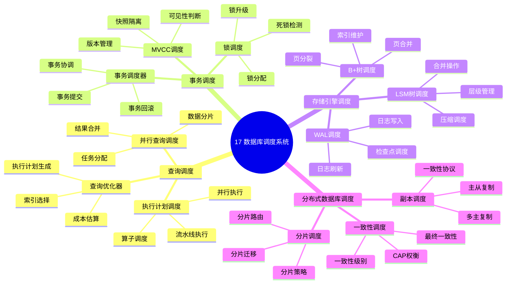

# 17. 数据库调度系统

> **主题**: 查询调度、事务调度、存储引擎调度、分布式数据库调度
> **覆盖范围**: 从单机数据库到分布式数据库调度的完整体系

---

## 📋 目录

- [17. 数据库调度系统](#17-数据库调度系统)
  - [📋 目录](#-目录)
  - [1 子主题索引](#1-子主题索引)
    - [1.0 数据库调度系统思维导图](#10-数据库调度系统思维导图)
  - [2 相关主题](#2-相关主题)
  - [3 核心概念矩阵](#3-核心概念矩阵)
  - [4 调度延迟层级](#4-调度延迟层级)
  - [5 形式化模型](#5-形式化模型)
    - [5.1 数据库调度问题定义](#51-数据库调度问题定义)
    - [5.2 调度算法复杂度](#52-调度算法复杂度)

---

## 1 子主题索引

### 1.0 数据库调度系统思维导图



**可视化文档**: 查看 [思维导图与知识矩阵](../思维导图与知识矩阵.md#310-10-24-扩展主题) 获取更详细的思维导图。


- [17.1 查询调度](./17.1_查询调度.md) - 查询优化器、执行计划调度、并行查询调度
- [17.2 事务调度](./17.2_事务调度.md) - 事务调度器、锁调度、死锁检测、MVCC调度
- [17.3 存储引擎调度](./17.3_存储引擎调度.md) - B+树调度、LSM树调度、WAL调度、检查点调度
- [17.4 分布式数据库调度](./17.4_分布式数据库调度.md) - 分片调度、副本调度、一致性调度、CAP权衡

---

## 2 相关主题

- [11.2 数据架构层调度](../11_企业架构调度/11.2_数据架构层调度.md) - 数据流水线
- [06.4 分布式系统调度](../06_调度模型/06.4_分布式系统调度.md) - 分布式调度
- [04.2 软件同步机制](../04_同步通信机制/04.2_软件同步机制.md) - 锁机制
- [12.2 资源分配博弈论](../12_跨层次调度协同/12.2_资源分配博弈论.md) - 资源分配

---

## 3 核心概念矩阵

| **调度类型** | **调度单元** | **延迟范围** | **优化目标** | **主要约束** |
|------------|------------|------------|------------|------------|
| **查询调度** | SQL查询 | 1ms-1s | 最小化延迟 | 资源限制 |
| **事务调度** | 事务 | 10-100ms | 一致性+性能 | ACID约束 |
| **存储引擎调度** | 页/块 | 微秒-毫秒 | 最大化吞吐量 | IO限制 |
| **分布式调度** | 分片/副本 | 毫秒-秒 | 一致性+可用性 | 网络延迟 |

---

## 4 调度延迟层级

```text
SQL查询
  ↓ [解析优化] ~100μs
执行计划
  ↓ [调度器选择] ~10μs
执行引擎
  ↓ [数据访问] ~1ms-100ms
存储引擎
  ├─ B+树: 索引查找 ~100μs
  └─ LSM树: 合并操作 ~10ms
```

**关键洞察**：数据库调度延迟跨度大（微秒到秒），查询优化和事务调度的权衡是核心挑战。

---

## 5 形式化模型

### 5.1 数据库调度问题定义

$$
\text{数据库调度问题} = (R, Q, T, C, O)
$$

其中：

- $R = \{r_1, r_2, \ldots, r_n\}$：资源集合（CPU、内存、IO）
- $Q = \{q_1, q_2, \ldots, q_m\}$：查询集合
- $T = \{t_1, t_2, \ldots, t_k\}$：事务集合
- $C$：约束条件（ACID、依赖关系、资源限制）
- $O$：优化目标（最小化延迟、最大化吞吐量、一致性）

### 5.2 调度算法复杂度

| **算法** | **时间复杂度** | **一致性** | **性能** |
|---------|--------------|-----------|---------|
| **FIFO** | $O(1)$ | 弱 | 高 |
| **2PL** | $O(n^2)$ | 强 | 中 |
| **MVCC** | $O(n)$ | 快照隔离 | 高 |
| **OCC** | $O(n)$ | 乐观 | 高（无冲突） |

---

**最后更新**: 2025-11-14
**文档状态**: ✅ 已完成，包含思维导图和2025年最新技术章节
