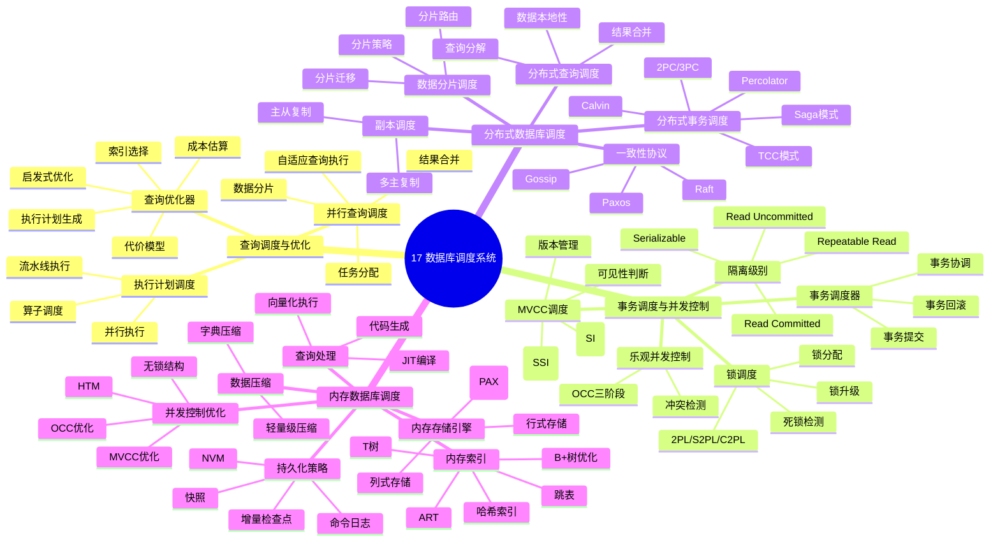

# 17. 数据库调度系统

> **主题**: 查询调度与优化、事务调度与并发控制、分布式数据库调度、内存数据库调度
> **覆盖范围**: 从单机数据库到分布式数据库、从磁盘到内存的完整体系

---

## 📋 目录

- [17. 数据库调度系统](#17-数据库调度系统)
  - [📋 目录](#-目录)
  - [1 子主题索引](#1-子主题索引)
    - [1.0 数据库调度系统思维导图](#10-数据库调度系统思维导图)
  - [2 相关主题](#2-相关主题)
  - [3 核心概念矩阵](#3-核心概念矩阵)
  - [4 调度延迟层级](#4-调度延迟层级)
  - [5 形式化模型](#5-形式化模型)
    - [5.1 数据库调度问题定义](#51-数据库调度问题定义)
    - [5.2 调度算法复杂度](#52-调度算法复杂度)

---

## 1 子主题索引

### 1.0 数据库调度系统思维导图


```mermaid
mindmap
  root((17 数据库调度系统))
    查询调度与优化
      查询优化器
        执行计划生成
        成本估算
        索引选择
        代价模型
        启发式优化
      执行计划调度
        算子调度
        并行执行
        流水线执行
      并行查询调度
        数据分片
        任务分配
        结果合并
        自适应查询执行
    事务调度与并发控制
      事务调度器
        事务提交
        事务回滚
        事务协调
      锁调度
        2PL/S2PL/C2PL
        锁分配
        死锁检测
        锁升级
      MVCC调度
        版本管理
        快照隔离(SI)
        可串行化快照隔离(SSI)
        可见性判断
      乐观并发控制
        OCC三阶段
        冲突检测
      隔离级别
        Read Uncommitted
        Read Committed
        Repeatable Read
        Serializable
    分布式数据库调度
      分布式查询调度
        查询分解
        数据本地性
        结果合并
      分布式事务调度
        2PC/3PC
        Saga模式
        TCC模式
        Percolator
        Calvin
      数据分片调度
        分片策略
        分片路由
        分片迁移
      一致性协议
        Paxos
        Raft
        Gossip
      副本调度
        主从复制
        多主复制
    内存数据库调度
      内存存储引擎
        行式存储
        列式存储
        混合存储(PAX)
      内存索引
        B+树优化
        T树
        哈希索引
        跳表
        ART
      并发控制优化
        无锁结构
        OCC优化
        MVCC优化
        HTM
      持久化策略
        命令日志
        快照
        增量检查点
        NVM
      数据压缩
        字典压缩
        轻量级压缩
      查询处理
        向量化执行
        JIT编译
        代码生成
```

**可视化文档**: 查看 [思维导图与知识矩阵](../思维导图与知识矩阵.md#310-10-24-扩展主题) 获取更详细的思维导图。


- [17.1 查询调度与优化](./17.1_查询调度与优化.md) - 查询优化器、执行计划调度、并行查询调度、代价模型、启发式优化
- [17.2 事务调度与并发控制](./17.2_事务调度与并发控制.md) - 事务调度器、锁调度(2PL/S2PL)、死锁检测、MVCC调度、OCC、隔离级别
- [17.3 分布式数据库调度](./17.3_分布式数据库调度.md) - 分布式查询调度、分布式事务调度(2PC/Saga/TCC/Calvin)、数据分片、一致性协议、副本调度
- [17.4 内存数据库调度](./17.4_内存数据库调度.md) - 内存存储引擎、内存索引(B+树/T树/哈希/跳表/ART)、持久化策略、并发控制优化、数据压缩

---

## 2 相关主题

- [11.2 数据架构层调度](../11_企业架构调度/11.2_数据架构层调度.md) - 数据流水线
- [06.4 分布式系统调度](../06_调度模型/06.4_分布式系统调度.md) - 分布式调度
- [04.2 软件同步机制](../04_同步通信机制/04.2_软件同步机制.md) - 锁机制
- [12.2 资源分配博弈论](../12_跨层次调度协同/12.2_资源分配博弈论.md) - 资源分配
- [14.1 内存调度](../14_存储调度系统/14.1_内存调度.md) - 内存管理

---

## 3 核心概念矩阵

| **调度类型** | **调度单元** | **延迟范围** | **优化目标** | **主要约束** |
|------------|------------|------------|------------|------------|
| **查询调度与优化** | SQL查询 | 1ms-1s | 最小化延迟 | 资源限制、代价模型 |
| **事务调度与并发控制** | 事务 | 10-100μs(内存) / 10-100ms(磁盘) | 一致性+性能 | ACID约束、隔离级别 |
| **分布式数据库调度** | 分片/查询/事务 | 毫秒-秒 | 一致性+可用性 | 网络延迟、CAP权衡 |
| **内存数据库调度** | 操作/事务 | 100ns-10μs | 最大化吞吐量 | 内存容量、持久化 |

---

## 4 调度延迟层级

```text
SQL查询
  ↓ [解析优化] ~100μs
执行计划
  ↓ [调度器选择] ~10μs
执行引擎
  ↓ [数据访问] ~1ms-100ms (磁盘) / ~100ns-1μs (内存)
存储引擎
  ├─ B+树: 索引查找 ~100μs (磁盘) / ~100ns (内存)
  ├─ LSM树: 合并操作 ~10ms (磁盘)
  └─ 内存索引: ~10-100ns
```

**关键洞察**：数据库调度延迟跨度极大（纳秒到秒），不同存储介质和调度层级需要不同的优化策略。

---

## 5 形式化模型

### 5.1 数据库调度问题定义

$$
\text{数据库调度问题} = (R, Q, T, C, O)
$$

其中：

- $R = \{r_1, r_2, \ldots, r_n\}$：资源集合（CPU、内存、IO、网络）
- $Q = \{q_1, q_2, \ldots, q_m\}$：查询集合
- $T = \{t_1, t_2, \ldots, t_k\}$：事务集合
- $C$：约束条件（ACID、依赖关系、资源限制、一致性级别）
- $O$：优化目标（最小化延迟、最大化吞吐量、一致性保证）

### 5.2 调度算法复杂度

| **算法** | **时间复杂度** | **一致性** | **性能** | **适用场景** |
|---------|--------------|-----------|---------|------------|
| **FIFO** | $O(1)$ | 弱 | 高 | 简单场景 |
| **2PL** | $O(n^2)$ | 强 | 中 | 冲突频繁 |
| **MVCC** | $O(n)$ | 快照隔离 | 高 | 读多写少 |
| **OCC** | $O(n)$ | 乐观 | 高（无冲突） | 冲突稀少 |
| **2PC** | $O(n)$ | 强 | 低 | 分布式事务 |
| **Paxos/Raft** | $O(\log n)$ | 强 | 中 | 一致性协议 |

---

**最后更新**: 2025-11-14
**文档状态**: ✅ 已完成，包含4个完整的子主题文档和2025年最新技术章节
