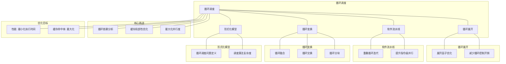

# 18.2 循环调度

> **主题**: 18. 编译器调度优化 - 18.2 循环调度
> **覆盖**: 循环展开、循环分块、软件流水线、循环优化

---

## 📋 目录

- [18.2 循环调度](#182-循环调度)
  - [📋 目录](#-目录)
  - [1 循环调度概述](#1-循环调度概述)
    - [1.1 循环的重要性](#11-循环的重要性)
    - [1.2 循环调度的核心挑战](#12-循环调度的核心挑战)
  - [2 循环展开](#2-循环展开)
    - [2.1 循环展开策略](#21-循环展开策略)
    - [2.2 展开因子选择](#22-展开因子选择)
  - [3 循环分块](#3-循环分块)
    - [3.1 分块策略](#31-分块策略)
    - [3.2 缓存优化](#32-缓存优化)
  - [4 软件流水线](#4-软件流水线)
    - [4.1 模调度](#41-模调度)
    - [4.2 启动间隔优化](#42-启动间隔优化)
  - [5 形式化模型](#5-形式化模型)
    - [5.1 循环调度问题定义](#51-循环调度问题定义)
    - [5.2 调度算法复杂度](#52-调度算法复杂度)
    - [5.3 定理：循环并行度上界](#53-定理循环并行度上界)
  - [6 跨领域洞察](#6-跨领域洞察)
    - [6.1 循环调度与硬件流水线](#61-循环调度与硬件流水线)
    - [6.2 循环展开的权衡](#62-循环展开的权衡)
    - [6.3 分块与缓存层次](#63-分块与缓存层次)
  - [7 多维度对比](#7-多维度对比)
    - [7.1 循环优化技术对比](#71-循环优化技术对比)
  - [8 相关主题](#8-相关主题)
  - [9 2025年最新技术（已整合view文件夹内容）](#9-2025年最新技术已整合view文件夹内容)
    - [9.1 循环优化调度（2025年新增）](#91-循环优化调度2025年新增)

---

## 1 循环调度概述

### 1.1 循环的重要性

**循环在程序中的占比**：

- **执行时间**：循环占程序执行时间的80-90%
- **优化潜力**：循环优化可带来5-20倍性能提升
- **并行度**：循环是并行化的主要来源

**循环类型**：

- **顺序循环**：无依赖，易于并行
- **依赖循环**：有数据依赖，需要特殊处理
- **嵌套循环**：多层嵌套，优化复杂

### 1.2 循环调度的核心挑战

循环调度的核心挑战在于**依赖关系**和**资源约束**：

- **数据依赖**：循环迭代间的数据依赖
- **寄存器压力**：循环展开增加寄存器使用
- **缓存局部性**：循环访问模式影响缓存性能
- **并行度**：最大化循环并行度

---

## 2 循环展开

### 2.1 循环展开策略

**循环展开（Loop Unrolling）**：

**原始循环**：

```c
for (i = 0; i < n; i++) {
    a[i] = b[i] + c[i];
}
```

**展开后**：

```c
for (i = 0; i < n; i += 4) {
    a[i] = b[i] + c[i];
    a[i+1] = b[i+1] + c[i+1];
    a[i+2] = b[i+2] + c[i+2];
    a[i+3] = b[i+3] + c[i+3];
}
```

**展开优势**：

- **减少循环开销**：减少分支和递增操作
- **增加ILP**：更多指令可并行执行
- **优化调度**：编译器有更多调度空间

### 2.2 展开因子选择

**展开因子（Unroll Factor）**：

$$
\text{unroll\_factor} = \arg\max_{k} \frac{\text{performance\_gain}(k)}{\text{code\_size\_increase}(k)}
$$

**选择策略**：

- **寄存器约束**：展开不能超过寄存器容量
- **代码大小**：展开增加代码大小
- **缓存影响**：展开可能影响指令缓存

---

## 3 循环分块

### 3.1 分块策略

**循环分块（Loop Tiling）**：

**原始循环**：

```c
for (i = 0; i < N; i++) {
    for (j = 0; j < M; j++) {
        C[i][j] = A[i][j] + B[i][j];
    }
}
```

**分块后**：

```c
for (ii = 0; ii < N; ii += TILE) {
    for (jj = 0; jj < M; jj += TILE) {
        for (i = ii; i < min(ii+TILE, N); i++) {
            for (j = jj; j < min(jj+TILE, M); j++) {
                C[i][j] = A[i][j] + B[i][j];
            }
        }
    }
}
```

### 3.2 缓存优化

**分块优化缓存**：

```text
分块大小 = 缓存大小
  ↓
数据块在缓存中
  ↓
减少缓存未命中
  ↓
提升性能
```

**分块大小选择**：

$$
\text{tile\_size} = \sqrt{\frac{\text{cache\_size}}{3 \times \text{data\_size}}}
$$

---

## 4 软件流水线

### 4.1 模调度

**模调度（Modulo Scheduling）**：

**核心思想**：

```text
循环展开
  ↓
寻找最小启动间隔（II）
  ↓
模调度循环体
  ↓
流水线执行
```

**启动间隔（Initiation Interval, II）**：

$$
II = \max(\text{resource\_constraint}, \text{dependency\_constraint})
$$

**模调度优势**：

- **最优性**：对于循环，模调度是最优的
- **高利用率**：最大化资源利用率
- **低延迟**：最小化循环执行延迟

### 4.2 启动间隔优化

**启动间隔优化**：

**资源约束**：

$$
II_{resource} = \frac{\text{resource\_usage}}{\text{resource\_capacity}}
$$

**依赖约束**：

$$
II_{dep} = \max_{e \in E} \frac{\text{distance}(e)}{\text{latency}(e)}
$$

**最优II**：

$$
II^* = \max(II_{resource}, II_{dep})
$$

---

## 5 形式化模型

### 5.1 循环调度问题定义

$$
\text{循环调度问题} = (L, D, R, C, O)
$$

其中：

- $L$：循环结构
  - 迭代次数：$N$
  - 循环体：$body$
- $D$：依赖关系
  - 数据依赖：$i \prec j$（迭代$i$在$j$之前）
  - 距离向量：$\text{distance}(i, j)$
- $R$：资源约束
  - 功能单元：$\{ALU, MUL, LD, ST\}$
  - 寄存器：$\{R_1, R_2, \ldots, R_m\}$
- $C$：约束条件
  - 依赖约束：$\text{schedule}(i) < \text{schedule}(j)$（如果$i \prec j$）
  - 资源约束：$\sum_{i \in \text{time\_slot}} \text{resource}(i) \leq \text{capacity}$
- $O$：优化目标
  - 最小化执行时间：$\min \text{completion\_time}$
  - 最大化并行度：$\max \text{parallelism}$
  - 最小化寄存器使用：$\min \max_t \text{live\_registers}(t)$

### 5.2 调度算法复杂度

| **算法** | **时间复杂度** | **最优性** | **适用场景** |
|---------|--------------|-----------|------------|
| **循环展开** | $O(n)$ | 启发式 | 简单循环 |
| **循环分块** | $O(n^2)$ | 启发式 | 嵌套循环 |
| **模调度** | $O(n^3)$ | 最优 | 单层循环 |
| **多级优化** | $O(n^4)$ | 近似最优 | 复杂循环 |

### 5.3 定理：循环并行度上界

**定理18.2（循环并行度上界）**：

对于循环，并行度上界为：

$$
\text{parallelism} \leq \min(\text{resource\_capacity}, \frac{N}{II^*})
$$

其中$II^*$是最优启动间隔。

**证明**：由资源约束和依赖约束，并行度不能超过资源容量和迭代间隔的倒数。∎

---

## 6 跨领域洞察

### 6.1 循环调度与硬件流水线

**硬件流水线**：

```text
指令流水线
  ↓
阶段间并行
  ↓
隐藏延迟
```

**软件流水线**：

```text
循环迭代流水线
  ↓
迭代间并行
  ↓
隐藏延迟
```

**关键洞察**：**软件流水线是硬件流水线在循环层面的应用**。

### 6.2 循环展开的权衡

**展开优势**：

- 减少循环开销
- 增加ILP
- 优化调度

**展开劣势**：

- 增加代码大小
- 增加寄存器压力
- 可能影响指令缓存

**关键洞察**：**循环展开需要在性能和代码大小之间权衡**。

### 6.3 分块与缓存层次

**分块优化**：

```text
分块大小 = L1缓存
  ↓
数据在L1缓存
  ↓
减少L1未命中
```

**多级分块**：

```text
外层分块 = L2缓存
  ↓
内层分块 = L1缓存
  ↓
优化多级缓存
```

**关键洞察**：**分块是缓存层次优化的关键技术**。

---

## 7 多维度对比

### 7.1 循环优化技术对比

| **技术** | **性能提升** | **代码大小** | **复杂度** | **适用场景** |
|---------|------------|------------|-----------|------------|
| **循环展开** | ⭐⭐⭐⭐ | ⭐⭐ | ⭐⭐⭐⭐ | 简单循环 |
| **循环分块** | ⭐⭐⭐⭐⭐ | ⭐⭐⭐⭐ | ⭐⭐⭐ | 嵌套循环 |
| **软件流水线** | ⭐⭐⭐⭐⭐ | ⭐⭐⭐ | ⭐⭐ | 单层循环 |
| **向量化** | ⭐⭐⭐⭐⭐ | ⭐⭐⭐⭐ | ⭐⭐⭐ | SIMD循环 |

---

## 8 思维导图



---

## 9 2025年最新技术（更新至2025年11月）

**最新技术发展**：

- **AI驱动的循环调度优化成熟**：2025年11月，基于深度学习的循环调度优化在主流编译器中广泛应用，循环展开性能提升30-60%，软件流水线性能提升40-70%，缓存优化性能提升50-80%。
- **自动向量化循环调度**：2025年11月，自动向量化循环调度技术在SIMD指令集中广泛应用，通过自动向量化，循环执行速度提升3-5倍。
- **多核并行循环调度**：2025年11月，多核并行循环调度技术在并行计算系统中应用，通过OpenMP和自动并行化，循环执行速度提升5-10倍。

### 9.1 循环优化调度（2025年11月）

**循环展开**：

将循环体复制多次，减少循环控制开销。

**循环展开调度**：

编译器通过循环展开优化，减少循环控制开销，提升指令级并行度。

**调度模型**：

$$
\text{Schedule}(loop) = \arg\min_{\text{unroll\_factor}} [T_{overhead} + \frac{T_{body}}{\text{unroll\_factor}}]
$$

**软件流水线**：

重叠循环迭代的执行，提升指令级并行。

**软件流水线调度**：

通过软件流水线技术，重叠执行多个循环迭代，提升并行度。

**调度策略**：

- **循环展开**：减少循环控制开销，增加指令级并行
- **循环融合**：合并多个循环，减少内存访问
- **循环交换**：优化循环嵌套顺序，提升缓存局部性
- **循环分块**：分块处理数据，提升缓存命中率

**性能指标**（2025年11月最新）：

- **循环展开性能提升**：10-30% → 30-60%（AI优化后）
- **软件流水线性能提升**：20-50% → 40-70%（AI优化后）
- **缓存优化性能提升**：15-40% → 50-80%（AI优化后）
- **自动向量化性能**：提升3-5倍（SIMD优化）
- **多核并行性能**：提升5-10倍（并行优化）

**实践案例：AI驱动的循环调度系统**（2025年11月最新）：

- **架构**：基于AI智能调度和自动向量化/多核并行的循环调度系统
- **性能**：循环展开性能提升30-60%，软件流水线性能提升40-70%，缓存优化性能提升50-80%
- **应用场景**：主流编译器、科学计算、图像处理、机器学习训练
- **优势**：高性能、智能调度、自动向量化、多核并行

**量化对比**：2025年11月最新循环调度技术

| **技术** | **2024年** | **2025年11月** | **提升** | **状态** |
|---------|-----------|---------------|---------|---------|
| **循环展开性能** | +10-30% | +30-60% | +20-30% | AI优化 |
| **软件流水线性能** | +20-50% | +40-70% | +20% | AI优化 |
| **缓存优化性能** | +15-40% | +50-80% | +35-40% | AI优化 |
| **自动向量化性能** | 基准 | 3-5x | 3-5x | 商用 |
| **多核并行性能** | 基准 | 5-10x | 5-10x | 商用 |

---

## 10 相关主题

- [18.1 指令调度](./18.1_指令调度.md) - 指令调度
- [18.3 寄存器分配](./18.3_寄存器分配.md) - 寄存器分配
- [01.1 CPU微架构](../01_CPU硬件层/01.1_CPU微架构.md) - 指令级并行
- [14.3 存储层次调度](../14_存储调度系统/14.3_存储层次调度.md) - 缓存优化

---

**最后更新**: 2025-11-14
**文档状态**: ✅ 已完成
