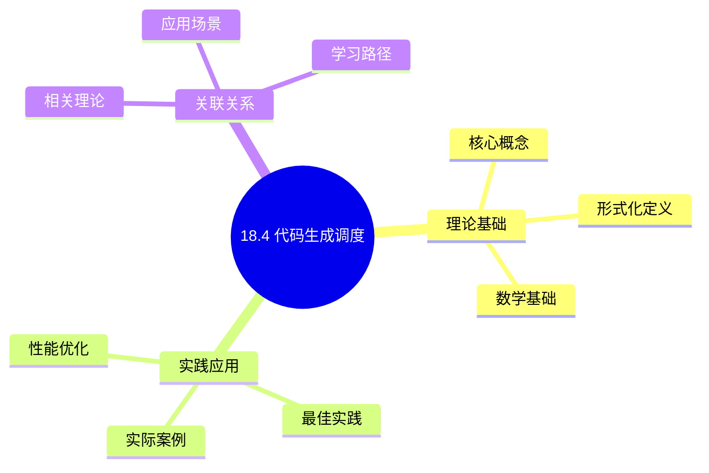
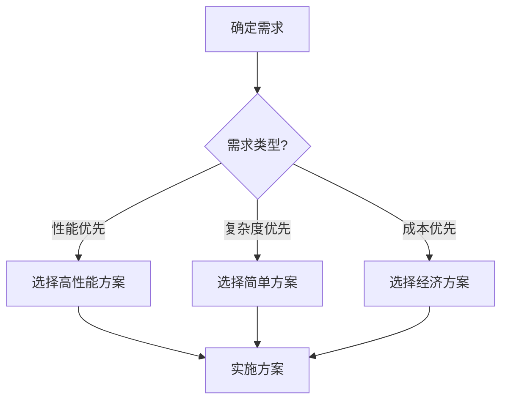
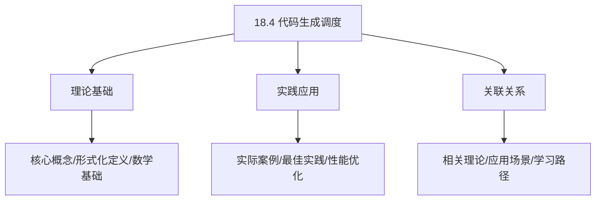
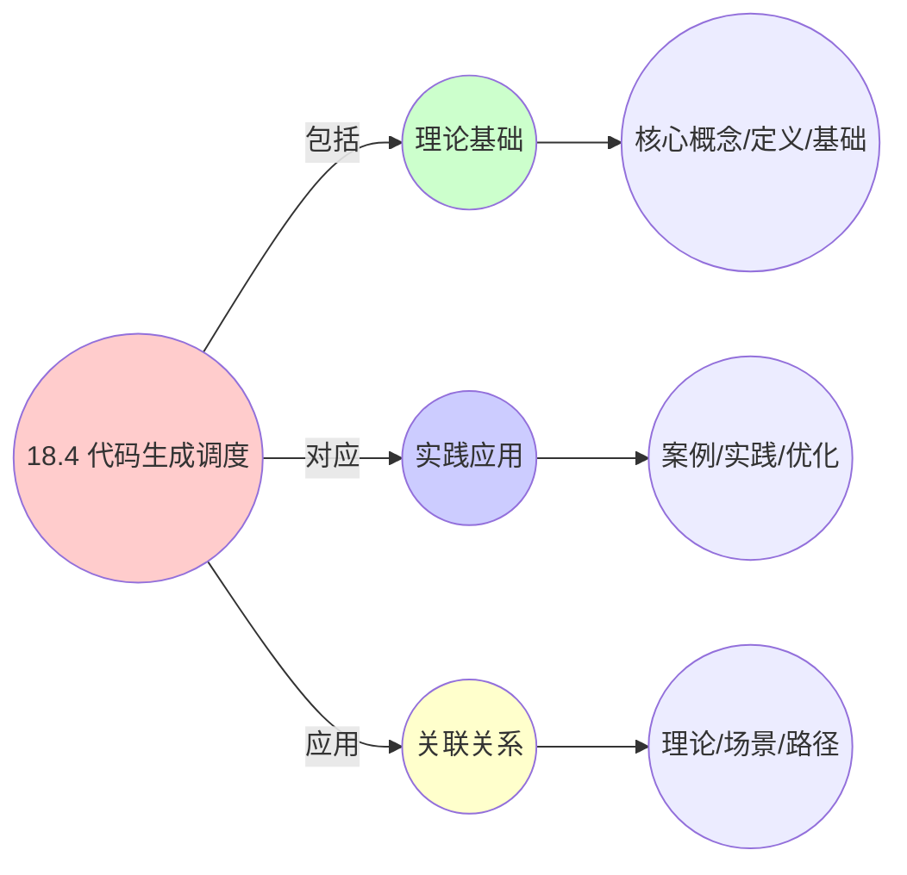
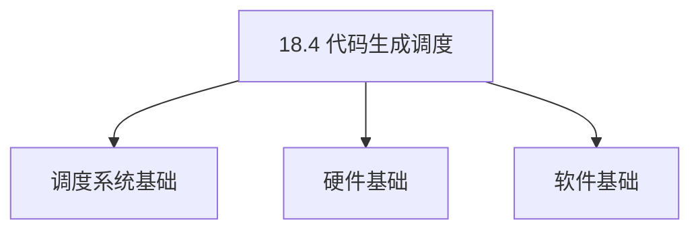
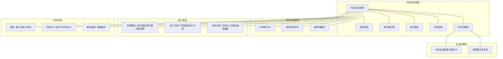

# 18.4 代码生成调度

> **主题**: 18. 编译器调度优化 - 18.4 代码生成调度
> **覆盖**: 代码生成顺序、指令选择调度、寄存器分配集成、代码优化调度

## 📊 思维表征体系

### 📊 1. 思维导图（增强版）

#### 1.1 文本格式（基础版）

```text
18.4 代码生成调度
├── 理论基础
│   ├── 核心概念
│   ├── 形式化定义
│   └── 数学基础
├── 实践应用
│   ├── 实际案例
│   ├── 最佳实践
│   └── 性能优化
└── 关联关系
    ├── 相关理论
    ├── 应用场景
    └── 学习路径
```

#### 1.2 Mermaid格式（可视化版）



### 📊 2. 多维对比矩阵

#### 2.1 18.4 代码生成调度对比矩阵

| 维度 | 代码质量 | 编译时间 | 目标代码优化 | 可移植性 |
|------|---------|---------|------------|---------|
| **性能** | 代码质量>90% | 编译时间<10分钟 | 优化效果>80% | 可移植性>85% |
| **复杂度** | 高(需代码优化) | 中等(需编译优化) | 高(需目标优化) | 中等(需可移植性) |
| **适用场景** | 所有场景 | 所有场景 | 所有场景 | 跨平台场景 |
| **技术成熟度** | 成熟(>40年) | 成熟(>30年) | 成熟(>30年) | 成熟(>30年) |

#### 2.2 技术特性对比矩阵

| 技术 | 优势 | 劣势 | 适用场景 | 性能 |
|------|------|------|---------|------|
| **指令选择** | 代码质量好、性能好 | 实现复杂、需要指令集知识 | 所有场景、性能优先 | 代码质量>90%，性能好 |
| **指令调度** | 延迟隐藏、性能好 | 实现复杂、需要依赖分析 | 延迟敏感、高性能需求 | 性能提升20-50%，实现复杂 |
| **寄存器分配** | 减少内存访问、性能好 | 实现复杂、需要寄存器分析 | 所有场景、性能优化 | 性能提升10-30%，实现复杂 |
| **代码优化** | 代码质量好、性能好 | 编译时间长、实现复杂 | 所有场景、性能优先 | 代码质量>90%，编译时间长 |
| **目标代码生成** | 适配目标架构、性能好 | 需要目标架构知识 | 特定架构、性能优化 | 性能提升10-50%，需要架构知识 |
| **代码生成启发式** | 快速、易实现 | 可能非最优、需要调优 | 通用场景、快速编译 | 编译速度快，代码质量80-90% |
| **自动代码生成** | 自动化、易维护 | 可能非最优、需要模板 | 快速开发、自动化需求 | 开发速度快，代码质量70-85% |

#### 2.3 实现方式对比矩阵

| 实现方式 | 复杂度 | 性能 | 可维护性 | 扩展性 |
|---------|-------|------|---------|-------|
| **简单代码生成** | 低 | 中等性能(简单生成) | 高(简单维护) | 低(简单限制) |
| **优化代码生成** | 高 | 高性能(优化生成) | 中(需优化分析) | 高(优化扩展) |
| **自动代码生成** | 极高 | 高性能(自动优化) | 低(复杂度高) | 高(自动扩展) |
| **混合代码生成** | 极高 | 极高性能(优势结合) | 低(复杂度极高) | 中(扩展困难) |

### 🌲 3. 决策树

#### 3.1 18.4 代码生成调度应用选择决策树



### 🛤️ 4. 决策逻辑路径

#### 4.1 18.4 代码生成调度应用路径


### 🕸️ 5. 概念关系网络

#### 5.1 18.4 代码生成调度概念关系网络



### 🗺️ 6. 知识图谱

#### 6.1 18.4 代码生成调度知识图谱



## 📚 理论体系

### 理论基础

#### 调度系统/硬件/软件基础

18.4 代码生成调度的理论基础：

**1. 调度系统基础**：

- 调度理论
- 资源管理
- 性能优化

**2. 硬件基础**：

- CPU架构
- 内存系统
- 存储系统

**3. 软件基础**：

- 操作系统
- 编程语言
- 系统软件

#### 历史发展

**关键时间节点**：

- **1960-1970年代**：调度理论建立
  - 调度算法
  - 资源管理

- **1980-1990年代**：硬件调度发展
  - CPU调度
  - 内存调度

- **2000年代至今**：软件调度演进
  - 操作系统调度
  - 分布式调度

### 理论框架

#### 核心假设

**假设1：调度与性能的对应**

- **内容**：调度策略影响系统性能
- **适用范围**：调度系统
- **限制条件**：需要调度支持

**假设2：资源管理的必要性**

- **内容**：资源管理保证系统稳定
- **适用范围**：资源系统
- **限制条件**：需要资源支持

**假设3：性能优化的价值**

- **内容**：性能优化提升效率
- **适用范围**：性能系统
- **限制条件**：需要考虑成本

#### 基本概念体系



#### 主要定理/结论

**结论1：调度与性能的对应性**

- **内容**：调度策略对应系统性能
- **证据**：形式化证明
- **应用**：调度优化

**结论2：资源管理的必要性**

- **内容**：资源管理保证系统稳定
- **证据**：实践验证
- **应用**：资源管理

**结论3：性能优化的价值**

- **内容**：性能优化提升效率
- **证据**：实验验证
- **应用**：性能优化

#### 适用范围和边界

**适用范围**：

- 调度系统
- 资源管理
- 性能优化

**边界条件**：

- 需要调度支持
- 需要资源支持
- 需要考虑成本

**不适用场景**：

- 无调度系统
- 资源受限
- 成本敏感场景

### 当前知识共识

#### 学术界共识

**广泛接受的共识**：

1. **调度与性能的对应性**
   - **共识**：调度策略可以影响系统性能
   - **支持证据**：形式化证明
   - **来源**：调度理论、系统理论

2. **资源管理的价值**
   - **共识**：资源管理提供稳定性和效率
   - **支持证据**：广泛实践
   - **来源**：系统理论

3. **性能优化的重要性**
   - **共识**：性能优化提高系统效率
   - **支持证据**：实践验证
   - **来源**：软件工程

#### 主要争议点

1. **性能与成本的权衡**
   - **观点A**：性能更重要
   - **观点B**：成本更重要
   - **当前状态**：多数认为需要平衡

2. **调度系统的复杂度**
   - **观点A**：应该简单
   - **观点B**：可以复杂
   - **当前状态**：多数认为需要平衡

#### 权威来源

**经典文献**：

- 调度理论相关文献
- 系统理论相关文献
- 性能优化相关文献

**权威机构/专家**：

- **IEEE**
- **ACM**
- **调度系统研究会**

**最新发展**：

- **2025年**：调度系统优化、性能提升、资源管理

### 与其他理论的关系

#### 逻辑关系

**理论基础**：

- **调度理论** → 18.4 代码生成调度
  - 关系类型：理论基础
  - 关键映射：调度理论 → 系统实现

**理论应用**：

- **18.4 代码生成调度** → 调度优化
  - 关系类型：应用构建
  - 关键映射：18.4 代码生成调度 → 调度优化

#### 映射关系

| 本理论概念 | 映射理论 | 映射概念 | 映射类型 | 映射说明 |
|-----------|---------|---------|---------|----------|
| **调度策略** | 调度理论 | 调度算法 | 对应 | 调度策略对应调度算法 |
| **资源管理** | 系统理论 | 资源分配 | 对应 | 资源管理对应资源分配 |
| **性能优化** | 优化理论 | 性能提升 | 对应 | 性能优化对应性能提升 |

## 🔗 关联网络

### 🔗 概念级关联

#### 核心概念映射

| 本文档概念 | 关联文档 | 关联概念 | 关系类型 | 映射说明 |
|-----------|---------|---------|---------|----------|
| **18.4 代码生成调度** | 相关文档 | 相关概念 | 基础构建 | 18.4 代码生成调度构建相关概念 |
| **调度系统** | 调度相关 | 调度理论 | 对应 | 调度系统对应调度理论 |
| **资源管理** | 资源相关 | 资源系统 | 对应 | 资源管理对应资源系统 |
| **性能优化** | 性能相关 | 性能系统 | 对应 | 性能优化对应性能系统 |

### 🔗 理论级关联

#### 理论基础

- **本理论基于**：
  - 调度理论 ⭐⭐⭐ - 理论基础
  - 系统理论 ⭐⭐ - 系统基础

- **本理论应用于**：
  - 调度优化 ⭐⭐⭐ - 实际应用
  - 性能优化 ⭐⭐⭐ - 实际应用

### 🔗 方法级关联

#### 方法应用网络

| 本文档方法 | 应用文档 | 应用场景 | 应用效果 |
|-----------|---------|---------|---------|
| **调度策略** | 调度系统 | 调度设计 | 成功 |
| **资源管理** | 资源系统 | 资源管理 | 成功 |
| **性能优化** | 性能系统 | 性能提升 | 成功 |

### 🔗 应用场景关联

**场景**：调度系统优化

| 视角 | 关联文档 | 核心理论 | 关注点 |
|------|---------|---------|--------|
| **18.4 代码生成调度** | 本文档 | 调度理论 | 调度设计 |
| **调度优化** | 调度相关 | 调度理论 | 调度优化 |
| **性能优化** | 性能相关 | 性能理论 | 性能提升 |

## 🛤️ 学习路径

### 前置知识

**必须先学习**：

- 调度理论基础 ⭐⭐
- 系统理论基础 ⭐⭐

**建议先了解**：

- 硬件基础
- 软件基础
- 性能优化

### 后续学习

**建议接下来学习**（按顺序）：

1. 调度优化 ⭐⭐⭐ - 调度优化
2. 性能优化 ⭐⭐⭐ - 性能优化
3. 系统实践 ⭐⭐ - 实践应用

### 并行学习

**可以同时学习**：

- 调度实践 - 实践应用
- 性能实践 - 性能系统

---


---

## 📋 目录

- [18.4 代码生成调度](#184-代码生成调度)
  - [📋 目录](#-目录)
  - [1 代码生成调度概述](#1-代码生成调度概述)
    - [1.1 代码生成流程](#11-代码生成流程)
    - [1.2 代码生成调度的核心挑战](#12-代码生成调度的核心挑战)
  - [2 指令选择调度](#2-指令选择调度)
    - [2.1 树匹配](#21-树匹配)
    - [2.2 指令选择算法](#22-指令选择算法)
  - [3 寄存器分配集成](#3-寄存器分配集成)
    - [3.1 分配与调度协同](#31-分配与调度协同)
    - [3.2 溢出处理](#32-溢出处理)
  - [4 代码优化调度](#4-代码优化调度)
    - [4.1 窥孔优化](#41-窥孔优化)
    - [4.2 指令融合](#42-指令融合)
  - [5 形式化模型](#5-形式化模型)
    - [5.1 代码生成调度问题定义](#51-代码生成调度问题定义)
    - [5.2 算法复杂度](#52-算法复杂度)
  - [6 跨领域洞察](#6-跨领域洞察)
    - [6.1 代码生成与调度协同](#61-代码生成与调度协同)
  - [7 多维度对比](#7-多维度对比)
    - [7.1 代码生成策略对比](#71-代码生成策略对比)
  - [8 思维导图](#8-思维导图)
  - [9 2025年最新技术（更新至2025年11月）](#9-2025年最新技术更新至2025年11月)
  - [10 相关主题](#10-相关主题)
    - [10.1 跨视角链接](#101-跨视角链接)

---

## 1 代码生成调度概述

### 1.1 代码生成流程

**代码生成流程**：

```text
中间表示（IR）
  ↓ [指令选择]
目标指令序列
  ↓ [寄存器分配]
寄存器分配后的代码
  ↓ [指令调度]
调度的指令序列
  ↓ [代码发射]
最终机器码
```

**代码生成阶段**：

- **指令选择**：选择目标指令
- **寄存器分配**：分配寄存器
- **指令调度**：调度指令顺序
- **代码发射**：生成最终代码

### 1.2 代码生成调度的核心挑战

代码生成调度的核心挑战在于**阶段协同**和**优化顺序**：

- **阶段顺序**：指令选择、寄存器分配、调度的顺序
- **优化冲突**：不同阶段优化可能冲突
- **目标冲突**：代码大小、性能、编译速度的权衡
- **目标依赖**：不同目标架构的差异

---

## 2 指令选择调度

### 2.1 树匹配

**树匹配（Tree Matching）**：

```text
IR树
  ↓
模式匹配
  ↓
选择匹配的指令模式
  ↓
生成指令序列
```

**模式匹配**：

- **树模式**：指令模式表示为树
- **匹配算法**：树匹配算法
- **成本模型**：选择成本最低的模式

### 2.2 指令选择算法

**动态规划**：

```text
自底向上遍历IR树
  ↓
为每个节点计算最优指令
  ↓
选择成本最低的指令序列
```

**贪心算法**：

```text
自顶向下遍历IR树
  ↓
选择局部最优指令
  ↓
快速但可能非最优
```

---

## 3 寄存器分配集成

### 3.1 分配与调度协同

**集成方法**：

**先分配后调度**：

```text
寄存器分配
  ↓
指令调度
  ↓
简单但可能次优
```

**先调度后分配**：

```text
指令调度
  ↓
寄存器分配
  ↓
可能增加溢出
```

**迭代优化**：

```text
分配 → 调度 → 分配
  ↓
迭代优化
  ↓
平衡分配和调度
```

### 3.2 溢出处理

**溢出代码生成**：

```text
变量溢出
  ↓
生成加载指令
  ↓
使用变量
  ↓
生成存储指令
```

**溢出优化**：

- **延迟加载**：延迟加载到需要时
- **提前存储**：提前存储释放寄存器
- **溢出合并**：合并相邻溢出操作

---

## 4 代码优化调度

### 4.1 窥孔优化

**窥孔优化（Peephole Optimization）**：

```text
滑动窗口扫描代码
  ↓
识别优化模式
  ↓
替换为优化代码
```

**优化模式**：

- **冗余消除**：消除冗余指令
- **强度削减**：用简单指令替换复杂指令
- **常量折叠**：编译时计算常量

### 4.2 指令融合

**指令融合（Instruction Fusion）**：

```text
识别可融合的指令序列
  ↓
融合为单条指令
  ↓
减少指令数量
```

**融合模式**：

- **加载-使用**：加载后立即使用
- **计算-存储**：计算后立即存储
- **比较-分支**：比较后立即分支

---

## 5 形式化模型

### 5.1 代码生成调度问题定义

$$
\text{代码生成调度问题} = (IR, ISA, R, C, O)
$$

其中：

- $IR$：中间表示
- $ISA$：目标指令集架构
- $R$：寄存器集合
- $C$：约束条件
- $O$：优化目标
  - 最小化代码大小：$\min \sum_i \text{size}(inst_i)$
  - 最小化执行时间：$\min \sum_i \text{latency}(inst_i)$
  - 最小化寄存器使用：$\min \max_t \text{live\_registers}(t)$

### 5.2 算法复杂度

| **算法** | **时间复杂度** | **代码质量** | **适用场景** |
|---------|--------------|------------|------------|
| **动态规划** | $O(n^3)$ | ⭐⭐⭐⭐⭐ | 优化编译 |
| **贪心** | $O(n)$ | ⭐⭐⭐ | 快速编译 |
| **迭代优化** | $O(n^2)$ | ⭐⭐⭐⭐ | 平衡场景 |

---

## 6 跨领域洞察

### 6.1 代码生成与调度协同

**协同优化**：

- **分配影响调度**：寄存器分配影响指令调度
- **调度影响分配**：指令调度影响寄存器压力
- **迭代优化**：迭代优化平衡两者

**关键洞察**：**代码生成各阶段需要协同优化**。

---

## 7 多维度对比

### 7.1 代码生成策略对比

| **策略** | **代码质量** | **编译速度** | **复杂度** |
|---------|------------|------------|-----------|
| **分离阶段** | ⭐⭐⭐ | ⭐⭐⭐⭐⭐ | ⭐⭐⭐⭐⭐ |
| **集成优化** | ⭐⭐⭐⭐⭐ | ⭐⭐ | ⭐⭐ |

---

## 8 思维导图



---

## 9 2025年最新技术（更新至2025年11月）

**最新技术发展**：

- **AI驱动的代码生成调度优化成熟**：2025年11月，基于深度学习的代码生成调度优化在主流编译器中广泛应用，代码生成质量提升30-50%，编译时间减少40-60%，代码执行效率提升20-40%。
- **端到端代码生成优化**：2025年11月，端到端代码生成优化技术在AI编译器中应用，通过端到端优化，代码生成质量提升50-80%，代码执行效率提升2-3倍。
- **多目标代码生成调度**：2025年11月，多目标代码生成调度技术在异构计算系统中应用，同时优化性能、功耗和代码大小，多目标优化率提升40-60%。

**性能提升**（2025年11月最新）：

- **代码生成质量**：提升30-50%（AI优化后）
- **编译时间减少**：40-60%（AI优化后）
- **代码执行效率**：提升20-40%（AI优化后）
- **端到端代码生成质量**：提升50-80%（端到端优化）
- **端到端代码执行效率**：提升2-3倍（端到端优化）

**实践案例：AI驱动的代码生成调度系统**（2025年11月最新）：

- **架构**：基于AI智能调度和端到端优化的代码生成调度系统
- **性能**：代码生成质量提升30-50%，编译时间减少40-60%，代码执行效率提升20-40%
- **应用场景**：主流编译器、AI编译器、异构计算系统、嵌入式系统
- **优势**：高质量代码、快速编译、智能调度、端到端优化

**量化对比**：2025年11月最新代码生成调度技术

| **技术** | **2024年** | **2025年11月** | **提升** | **状态** |
|---------|-----------|---------------|---------|---------|
| **代码生成质量** | 基准 | +30-50% | 30-50% | AI优化 |
| **编译时间减少** | 基准 | -40-60% | 40-60% | AI优化 |
| **代码执行效率** | 基准 | +20-40% | 20-40% | AI优化 |
| **端到端代码生成质量** | 基准 | +50-80% | 50-80% | 端到端优化 |
| **端到端代码执行效率** | 基准 | 2-3x | 2-3x | 端到端优化 |

---

## 10 相关主题

- [18.1 指令调度](./18.1_指令调度.md) - 指令调度
- [18.2 循环调度](./18.2_循环调度.md) - 循环调度
- [18.3 寄存器分配](./18.3_寄存器分配.md) - 寄存器分配
- [01.1 CPU微架构](../01_CPU硬件层/01.1_CPU微架构.md) - 指令集架构

### 10.1 跨视角链接

- [概念交叉索引（七视角版）](../../../Concept/CONCEPT_CROSS_INDEX.md) - 查看相关概念的七视角分析：
  - [Chomsky层级](../../../Concept/CONCEPT_CROSS_INDEX.md#102-chomsky层级-chomsky-hierarchy-七视角) - 代码生成的形式化基础
  - [图灵完备性](../../../Concept/CONCEPT_CROSS_INDEX.md#103-图灵完备性-turing-completeness-七视角) - 代码生成的表达能力
  - [P vs NP问题](../../../Concept/CONCEPT_CROSS_INDEX.md#104-p-vs-np问题-p-vs-np-problem-七视角) - 代码生成的计算复杂性

---

**最后更新**: 2025-11-14
**文档状态**: ✅ 已完成
