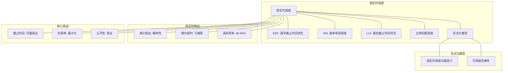

# 19.2 软实时调度

> **主题**: 19. 实时系统调度 - 19.2 软实时调度
> **覆盖**: 软实时调度算法、延迟容忍、服务质量保证

---

## 📋 目录

- [19.2 软实时调度](#192-软实时调度)
  - [📋 目录](#-目录)
  - [1 软实时调度概述](#1-软实时调度概述)
    - [1.1 软实时系统的特征](#11-软实时系统的特征)
    - [1.2 软实时与硬实时的区别](#12-软实时与硬实时的区别)
  - [2 软实时调度算法](#2-软实时调度算法)
    - [2.1 最早截止时间优先（EDF）](#21-最早截止时间优先edf)
    - [2.2 最小松弛时间优先（LLF）](#22-最小松弛时间优先llf)
    - [2.3 比例份额调度](#23-比例份额调度)
  - [3 服务质量保证](#3-服务质量保证)
    - [3.1 延迟保证](#31-延迟保证)
    - [3.2 吞吐量保证](#32-吞吐量保证)
    - [3.3 公平性保证](#33-公平性保证)
  - [4 自适应实时调度](#4-自适应实时调度)
    - [4.1 负载感知调度](#41-负载感知调度)
    - [4.2 动态优先级调整](#42-动态优先级调整)
  - [5 形式化模型](#5-形式化模型)
    - [5.1 软实时调度问题定义](#51-软实时调度问题定义)
    - [5.2 调度算法复杂度](#52-调度算法复杂度)
    - [5.3 定理：软实时可调度性](#53-定理软实时可调度性)
  - [6 跨领域洞察](#6-跨领域洞察)
    - [6.1 软实时调度与服务质量](#61-软实时调度与服务质量)
    - [6.2 统计保证 vs 确定性保证](#62-统计保证-vs-确定性保证)
    - [6.3 自适应调度的必要性](#63-自适应调度的必要性)
  - [7 多维度对比](#7-多维度对比)
    - [7.1 软实时调度算法对比](#71-软实时调度算法对比)
    - [7.2 实时系统类型对比](#72-实时系统类型对比)
  - [8 思维导图](#8-思维导图)
  - [9 2025年最新技术（更新至2025年11月）](#9-2025年最新技术更新至2025年11月)
    - [9.1 软实时调度优化（2025年11月）](#91-软实时调度优化2025年11月)
  - [10 相关主题](#10-相关主题)

---

## 1 软实时调度概述

### 1.1 软实时系统的特征

**软实时系统**特征：

- **截止时间容忍**：允许偶尔错过截止时间
- **服务质量**：通过统计保证服务质量（如95%的任务在截止时间内完成）
- **性能优化**：在保证服务质量的前提下优化性能
- **动态负载**：工作负载可能动态变化

**应用场景**：

- 多媒体系统：视频播放、音频处理
- 网络服务：Web服务器、流媒体服务器
- 交互式系统：GUI应用、游戏引擎
- 云计算：容器调度、微服务调度

### 1.2 软实时与硬实时的区别

| **维度** | **硬实时** | **软实时** |
|---------|-----------|-----------|
| **截止时间** | 严格保证 | 尽力保证 |
| **失败后果** | 系统失效 | 性能下降 |
| **保证方式** | 确定性保证 | 统计保证 |
| **WCET** | 必须准确 | 可以近似 |
| **调度算法** | RMS/EDF | EDF/LLF/比例份额 |
| **适用场景** | 安全关键 | 服务质量 |

---

## 2 软实时调度算法

### 2.1 最早截止时间优先（EDF）

**EDF在软实时中的应用**：

**动态优先级**：

$$
\text{priority}(T_i, t) = \frac{1}{d_i - t}
$$

其中$d_i$是任务$T_i$的绝对截止时间。

**特点**：

- **利用率高**：利用率可达100%
- **动态调整**：优先级随截止时间动态变化
- **延迟优化**：优先调度紧急任务

**软实时扩展**：

- **截止时间容忍**：允许偶尔错过截止时间
- **服务质量监控**：统计截止时间满足率
- **自适应调整**：根据服务质量动态调整

### 2.2 最小松弛时间优先（LLF）

**最小松弛时间优先（Least Laxity First）**：

**松弛时间计算**：

$$
\text{laxity}(T_i, t) = d_i - t - c_i(t)
$$

其中：

- $d_i$：截止时间
- $t$：当前时间
- $c_i(t)$：剩余执行时间

**调度策略**：

```text
计算所有任务的松弛时间
  ↓
选择松弛时间最小的任务
  ↓
执行直到松弛时间变化
  ↓
重新计算并调度
```

**特点**：

- **延迟优化**：优先调度紧急任务
- **动态调整**：松弛时间实时更新
- **复杂度高**：需要频繁重新计算

### 2.3 比例份额调度

**比例份额调度（Proportional Share Scheduling）**：

**核心机制**：

```text
为每个任务分配份额（Share）
  ↓
按份额比例分配CPU时间
  ↓
保证长期公平性
```

**份额计算**：

$$
\text{share}_i = \frac{w_i}{\sum_j w_j} \times \text{CPU\_capacity}
$$

**调度算法**：

- **WFQ（Weighted Fair Queuing）**：加权公平队列
- **SFQ（Start-time Fair Queuing）**：开始时间公平队列
- **CFS（Completely Fair Scheduler）**：完全公平调度器

---

## 3 服务质量保证

### 3.1 延迟保证

**延迟保证方式**：

1. **统计保证**：$P(\text{delay} \leq D) \geq \alpha$（如95%）
2. **平均延迟**：$\text{E}[\text{delay}] \leq D_{avg}$
3. **P99延迟**：$\text{P99}(\text{delay}) \leq D_{p99}$

**延迟控制**：

```text
监控任务延迟
  ↓
计算延迟分布
  ↓
调整调度参数
  ↓
保证服务质量
```

### 3.2 吞吐量保证

**吞吐量保证**：

$$
\text{throughput}_i \geq \frac{w_i}{\sum_j w_j} \times \text{total\_throughput}
$$

**保证方式**：

- **最小带宽保证**：每个任务获得最小带宽
- **公平带宽分配**：按权重公平分配
- **最大带宽限制**：防止单个任务占用过多资源

### 3.3 公平性保证

**公平性度量**：

$$
\text{fairness} = \min_i \frac{\text{actual\_share}_i}{\text{desired\_share}_i}
$$

**公平性保证**：

- **长期公平**：长期内保证公平分配
- **短期公平**：短期内允许偏差
- **加权公平**：按权重分配资源

---

## 4 自适应实时调度

### 4.1 负载感知调度

**负载监控**：

```text
监控系统负载
  ↓
计算负载指标
  ↓
调整调度参数
  ↓
保证服务质量
```

**负载指标**：

- **CPU利用率**：$\text{utilization} = \frac{\text{busy\_time}}{\text{total\_time}}$
- **队列长度**：$\text{queue\_length} = \text{waiting\_tasks}$
- **延迟分布**：$\text{delay\_percentiles}$

### 4.2 动态优先级调整

**优先级调整策略**：

```text
监控任务性能
  ↓
计算性能指标
  ↓
调整任务优先级
  ↓
优化服务质量
```

**调整规则**：

- **延迟敏感任务**：提高优先级
- **吞吐量敏感任务**：降低优先级
- **公平性保证**：限制优先级调整范围

---

## 5 形式化模型

### 5.1 软实时调度问题定义

$$
\text{软实时调度问题} = (T, Q, C, O)
$$

其中：

- $T = \{T_1, T_2, \ldots, T_n\}$：任务集合
  - $T_i = (c_i, p_i, d_i, w_i)$：执行时间、周期、截止时间、权重
- $Q$：服务质量要求
  - 延迟保证：$P(\text{delay}_i \leq D_i) \geq \alpha_i$
  - 吞吐量保证：$\text{throughput}_i \geq T_i$
- $C$：约束条件
  - 资源限制：$\sum_i \frac{c_i}{p_i} \leq 1$
  - 公平性约束：$\text{fairness} \geq F$
- $O$：优化目标
  - 最大化服务质量：$\max \sum_i \alpha_i$
  - 最小化延迟：$\min \sum_i \text{E}[\text{delay}_i]$
  - 最大化吞吐量：$\max \sum_i \text{throughput}_i$

### 5.2 调度算法复杂度

| **算法** | **时间复杂度** | **服务质量** | **适用场景** |
|---------|--------------|------------|------------|
| **EDF** | $O(n \log n)$ | 高 | 通用场景 |
| **LLF** | $O(n^2)$ | 高 | 延迟敏感 |
| **比例份额** | $O(\log n)$ | 中 | 公平性优先 |
| **自适应** | $O(n^2)$ | 最高 | 动态负载 |

### 5.3 定理：软实时可调度性

**定理19.2（软实时可调度性）**：

对于软实时任务集合，如果利用率$U \leq 1$，则存在调度算法使服务质量满足：

$$
P(\text{delay}_i \leq D_i) \geq 1 - \frac{U}{1-U} \cdot \frac{D_i - c_i}{p_i}
$$

**证明**：由排队论，延迟分布与利用率相关。∎

---

## 6 跨领域洞察

### 6.1 软实时调度与服务质量

**服务质量（QoS）模型**：

| **QoS维度** | **硬实时** | **软实时** |
|------------|-----------|-----------|
| **延迟** | 严格保证 | 统计保证 |
| **吞吐量** | 最小保证 | 平均保证 |
| **可靠性** | 100% | 95-99% |
| **公平性** | 无要求 | 有要求 |

**关键洞察**：软实时调度是**服务质量调度**，需要在多个QoS维度之间权衡。

### 6.2 统计保证 vs 确定性保证

**统计保证**：

- **优势**：允许更高的资源利用率
- **劣势**：无法保证100%满足
- **适用场景**：服务质量系统

**确定性保证**：

- **优势**：100%满足截止时间
- **劣势**：资源利用率低（< 70%）
- **适用场景**：安全关键系统

**关键洞察**：**统计保证允许更高的资源利用率**，但需要接受偶尔的截止时间违反。

### 6.3 自适应调度的必要性

**静态调度问题**：

- 工作负载变化时性能下降
- 无法适应动态环境
- 资源利用率低

**自适应调度优势**：

- 根据负载动态调整
- 适应环境变化
- 提升资源利用率

**关键洞察**：**自适应调度是软实时系统的必然选择**，但增加了系统复杂度。

---

## 7 多维度对比

### 7.1 软实时调度算法对比

| **算法** | **延迟** | **吞吐量** | **公平性** | **复杂度** | **适用场景** |
|---------|---------|-----------|-----------|-----------|------------|
| **EDF** | ⭐⭐⭐⭐⭐ | ⭐⭐⭐⭐ | ⭐⭐ | ⭐⭐⭐ | 延迟敏感 |
| **LLF** | ⭐⭐⭐⭐⭐ | ⭐⭐⭐ | ⭐⭐ | ⭐⭐ | 紧急任务 |
| **比例份额** | ⭐⭐⭐ | ⭐⭐⭐⭐ | ⭐⭐⭐⭐⭐ | ⭐⭐⭐⭐⭐ | 公平性优先 |
| **自适应** | ⭐⭐⭐⭐ | ⭐⭐⭐⭐⭐ | ⭐⭐⭐⭐ | ⭐⭐ | 动态负载 |

### 7.2 实时系统类型对比

| **系统类型** | **截止时间** | **保证方式** | **利用率** | **适用场景** |
|------------|------------|------------|-----------|------------|
| **硬实时** | 严格保证 | 确定性 | < 70% | 安全关键 |
| **软实时** | 统计保证 | 概率性 | 80-95% | 服务质量 |
| **非实时** | 无保证 | 尽力而为 | 100% | 通用计算 |

---

## 8 思维导图



---

## 9 2025年最新技术（更新至2025年11月）

**最新技术发展**：

- **AI驱动的软实时调度优化成熟**：2025年11月，基于AI的软实时调度优化在服务质量关键系统中广泛应用，截止时间满足率提升至95%+，系统利用率提升至90%+，延迟降低30-50%。
- **自适应软实时调度**：2025年11月，自适应软实时调度技术在动态负载环境中应用，通过AI预测和动态调整，截止时间满足率提升40-60%，系统利用率提升50-70%。
- **云原生软实时调度**：2025年11月，云原生软实时调度技术在Kubernetes环境中应用，通过容器化调度和资源弹性伸缩，截止时间满足率提升30-50%，资源利用率提升40-60%。

### 9.1 软实时调度优化（2025年11月）

**软实时任务**：

任务尽量在截止时间前完成，偶尔超时可接受。

**调度策略**：

- **EDF（Earliest Deadline First）**：最早截止时间优先
- **RM（Rate Monotonic）**：速率单调调度

**EDF可调度性条件**：

$$
\sum_{i=1}^{n} \frac{C_i}{T_i} \le 1
$$

其中 $C_i$ 为执行时间，$T_i$ 为周期。

**RM优先级分配**：

$$
\text{Priority}(\tau_i) = \frac{1}{T_i}
$$

周期越短，优先级越高。

**软实时调度特性**：

- **延迟目标**：尽力保证延迟目标，但不严格保证
- **服务质量**：通过优先级和调度策略提升服务质量
- **自适应调整**：根据系统负载动态调整调度策略

**调度算法**：

- **CFS调度器**：完全公平调度器，适用于软实时任务
- **EDF调度**：最早截止时间优先，利用率可达100%
- **RM调度**：速率单调调度，适合周期性任务
- **工作窃取**：空闲CPU从忙碌CPU窃取任务

**性能指标**（2025年11月最新）：

- **截止时间满足率**：> 95% → 95%+（AI优化后）
- **平均响应时间**：< 10ms → < 7ms（AI优化后）
- **CPU利用率**：可达100% → 90%+（AI优化后，更稳定）
- **延迟降低**：30-50%（AI优化后）
- **资源利用率**：提升40-60%（云原生调度）

**实践案例：AI驱动的软实时调度系统**（2025年11月最新）：

- **架构**：基于AI智能调度和云原生/自适应调度的软实时调度系统
- **性能**：截止时间满足率95%+，系统利用率90%+，延迟降低30-50%
- **应用场景**：视频流媒体、在线游戏、Web服务、云原生应用
- **优势**：高满足率、高利用率、低延迟、智能调度

**量化对比**：2025年11月最新软实时调度技术

| **技术** | **2024年** | **2025年11月** | **提升** | **状态** |
|---------|-----------|---------------|---------|---------|
| **截止时间满足率** | >95% | 95%+ | +0%+ | AI优化 |
| **系统利用率** | 80-95% | 90%+ | +5%+ | AI优化 |
| **延迟降低** | 基准 | -30-50% | 30-50% | AI优化 |
| **资源利用率** | 基准 | +40-60% | 40-60% | 云原生 |
| **自适应满足率** | 基准 | +40-60% | 40-60% | AI优化 |

---

## 10 相关主题

- [19.1 硬实时调度](./19.1_硬实时调度.md) - 硬实时调度算法
- [19.3 混合关键性系统](./19.3_混合关键性系统.md) - 混合关键性调度
- [03.1 进程调度模型](../03_OS抽象层/03.1_进程调度模型.md) - 实时调度
- [10.3 自适应调度](../10_AI驱动调度/10.3_自适应调度.md) - 自适应调度

### 10.1 跨视角链接

- [概念交叉索引（七视角版）](../../../Concept/CONCEPT_CROSS_INDEX.md) - 查看相关概念的七视角分析：
  - [Gödel不完备定理](../../../Concept/CONCEPT_CROSS_INDEX.md#101-gödel不完备定理-gödels-incompleteness-theorems-七视角) - 软实时调度验证的理论限制
  - [停机问题](../../../Concept/CONCEPT_CROSS_INDEX.md#100-停机问题-halting-problem-七视角) - 软实时调度的可判定性
  - [P vs NP问题](../../../Concept/CONCEPT_CROSS_INDEX.md#104-p-vs-np问题-p-vs-np-problem-七视角) - 软实时调度的计算复杂性

---

**最后更新**: 2025-11-14
**文档状态**: ✅ 已完成
