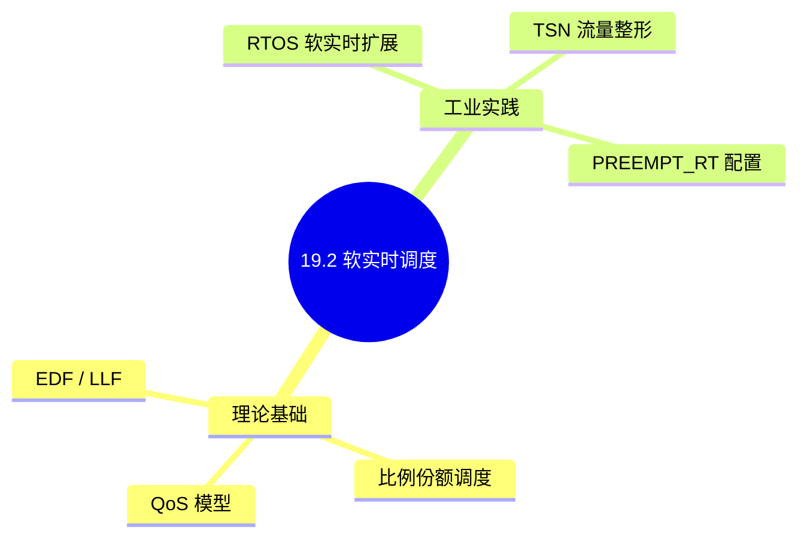
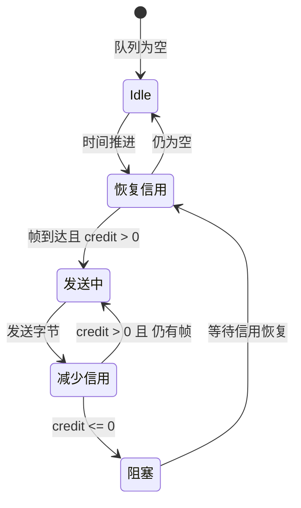

# 19.2 软实时调度

> **主题**: 19. 实时系统调度 - 19.2 软实时调度
> **覆盖**: 软实时调度算法、服务质量保证、工业 RTOS 软实时能力、TSN  QoS、Linux PREEMPT_RT 实践

## 📊 思维表征体系


```mermaid
mindmap
  root((19.2 软实时调度))
    理论基础
      EDF / LLF
      比例份额调度
      QoS 模型
    工业实践
      RTOS 软实时扩展
      TSN 流量整形
      PREEMPT_RT 配置
```

| 维度 | 截止时间满足率 | 吞吐量 | 资源利用率 | 灵活性 |
|------|------------|--------|-----------|--------|
| **性能** | >90% | >80% | >85% | >80% |
| **适用场景** | 多媒体、游戏 | 所有场景 | 所有场景 | 动态负载 |

---

## 1 软实时调度概述

### 1.1 软实时系统的特征

**软实时系统**特征：

- **截止时间容忍**：允许偶尔错过截止时间
- **服务质量**：通过统计保证服务质量（如 95% 的任务在截止时间内完成）
- **性能优化**：在保证服务质量的前提下优化性能
- **动态负载**：工作负载可能动态变化

**应用场景**：

- 多媒体系统：视频播放（H.264/H.265 解码）、音频处理（DAW 插件）
- 网络服务：Web 服务器（Nginx）、流媒体服务器（RTMP/WebRTC）
- 交互式系统：GUI 应用、游戏引擎（Unity/Unreal 渲染线程）
- 云计算：容器调度、微服务 QoS 保证

### 1.2 软实时与硬实时的区别

| 维度 | 硬实时 | 软实时 |
|------|--------|--------|
| 截止时间 | 严格保证 | 尽力保证 |
| 失败后果 | 系统失效 | 性能下降 |
| 保证方式 | 确定性保证 | 统计保证 |
| WCET | 必须准确 | 可以近似 |
| 调度算法 | RMS / EDF | EDF / LLF / 比例份额 |
| 适用场景 | 安全关键 | 服务质量 |

---

## 2 工业 RTOS 的软实时能力

虽然 VxWorks、QNX 与 PREEMPT_RT 以硬实时著称，但它们在软实时场景中也提供了丰富的 QoS 与自适应调度机制。

### 2.1 VxWorks 的软实时扩展

- **Wind River Workbench**：提供运行时性能分析器，可监控任务的 CPU 使用率、上下文切换率、截止时间错过率（Miss Rate）。
- **Round-Robin Scheduling**：在相同优先级的任务间提供时间片轮转，防止单个软实时任务饿死其他同优先级任务。
- **Memory Partitioning**：通过内存保护域隔离不同软实时服务（如视频解码与网络协议栈），避免一个服务的内存泄漏影响整体 QoS。

### 2.2 QNX Neutrino 的自适应分区调度（APS）

QNX 的 **Adaptive Partition Scheduling (APS)** 是软实时系统中的典型 QoS 机制：

- **预算保证（Budget Guarantee）**：为每个分区（Partition）分配最低 CPU 预算（如 30%）。
- **自适应借用（Adaptive Borrowing）**：若某分区未用完预算，其他分区可动态借用剩余时间，提高整体吞吐量。
- **关键线程（Critical Threads）**：允许在分区预算耗尽后，关键线程仍可运行（需显式标记），避免硬实时任务受软实时分区预算限制。

这对多媒体信息娱乐系统（IVI）与 ADAS 共存的汽车电子架构至关重要。

### 2.3 PREEMPT_RT Linux 的软实时实践

Linux 主线的 **CFS（Completely Fair Scheduler）** 本身就是为软实时/通用吞吐量设计的。PREEMPT_RT 补丁在此基础上增强了实时能力：

- **`SCHED_FIFO` / `SCHED_RR`**：适用于需要严格优先级区分的软实时线程。
- **`SCHED_OTHER`（CFS）+ `sched_rt_runtime_us`**：通过 `/proc/sys/kernel/sched_rt_runtime_us` 限制实时任务的总 CPU 时间，防止实时任务耗尽系统资源，保证非实时后台服务（如日志、SSH）的最低响应。
- **cgroups v2 CPU 控制器**：为容器化的软实时微服务提供 CPU 份额（`cpu.weight`）、带宽上限（`cpu.max`）与实时预留（`cpu.uclamp.min/max`）。

### 2.4 AUTOSAR OS 的软实时支持

虽然 AUTOSAR OS 主打硬实时，但其 **扩展任务（Extended Task）** 与 **事件（Event）** 机制可用于实现轻量级的软实时协作：

- 扩展任务在等待事件时进入等待态（Waiting），不占用 CPU，适合实现生产者-消费者模式的软实时数据流。
- 通过软件定时器（Software Timer / OS Alarm）触发周期性软实时处理。

---

## 3 软实时调度算法

### 3.1 最早截止时间优先（EDF）

**动态优先级**：

$$
\text{priority}(T_i, t) = \frac{1}{d_i - t}
$$

**特点**：

- 利用率可达 100%
- 优先调度紧急任务
- 软实时扩展：允许偶尔错过截止时间，通过监控统计满足率

### 3.2 最小松弛时间优先（LLF）

$$
\text{laxity}(T_i, t) = d_i - t - c_i(t)
$$

其中 $c_i(t)$ 为剩余执行时间。

**特点**：优先调度松弛时间最小的任务，动态调整，复杂度高 $O(n^2)$。

### 3.3 比例份额调度

**份额计算**：

$$
\text{share}_i = \frac{w_i}{\sum_j w_j} \times \text{CPU\_capacity}
$$

**典型算法**：

- **WFQ（Weighted Fair Queuing）**：加权公平队列
- **SFQ（Start-time Fair Queuing）**：开始时间公平队列
- **CFS（Completely Fair Scheduler）**：Linux 完全公平调度器

---

## 4 服务质量保证（QoS）

### 4.1 延迟保证

1. **统计保证**：$P(\text{delay} \leq D) \geq \alpha$（如 95%）
2. **平均延迟**：$\text{E}[\text{delay}] \leq D_{avg}$
3. **P99 延迟**：$\text{P99}(\text{delay}) \leq D_{p99}$

### 4.2 吞吐量与公平性保证

$$
\text{throughput}_i \geq \frac{w_i}{\sum_j w_j} \times \text{total\_throughput}
$$

$$
\text{fairness} = \min_i \frac{\text{actual\_share}_i}{\text{desired\_share}_i}
$$

---

## 5 TSN 的软实时与 QoS 机制

TSN 不仅服务于硬实时，也通过 **IEEE 802.1Qav**（现已并入 802.1Q 的 QoS 章节）与 **IEEE 802.1Qci** 为软实时流量提供带宽保证与整形能力。

### 5.1 信用整形器（Credit-Based Shaper, CBS）

CBS（IEEE 802.1Qav 核心）为音视频桥接（AVB）流量提供平滑的带宽限制：

- 每个 CBS 队列维护一个信用值（Credit）。
- 当队列有数据且信用值为正时可以发送；发送时信用值按 `idleSlope` 减少。
- 当队列空闲时，信用值按 `sendSlope` 恢复。
- 保证 AVB 类流量（如车载摄像头视频流）获得稳定的带宽份额，同时不突发冲击网络。

**Mermaid 状态图**：


```mermaid
stateDiagram-v2
    [*] --> Idle : 队列为空
    Idle --> 恢复信用 : 时间推进
    恢复信用 --> Idle : 仍为空
    恢复信用 --> 发送中 : 帧到达且 credit > 0
    发送中 --> 减少信用 : 发送字节
    减少信用 --> 发送中 : credit > 0 且 仍有帧
    减少信用 --> 阻塞 : credit <= 0
    阻塞 --> 恢复信用 : 等待信用恢复
```

### 5.2 逐流过滤与 policing（IEEE 802.1Qci）

802.1Qci 允许交换机对每个流量流（Stream）进行逐流过滤与监管：

- **带宽监管（Bandwidth Policing）**：丢弃超过承诺带宽的帧。
- **帧门控（Frame Gate）**：与 802.1Qbv GCL 配合，只允许特定流在特定时间窗口通过。
- 这为软实时流量提供了可预期的 QoS 边界，防止恶意或故障节点淹没网络。

---

## 6 Linux PREEMPT_RT 软实时配置示例

以下示例展示如何在 PREEMPT_RT Linux 上配置一个带有 QoS 监控的软实时线程。该线程使用 `SCHED_FIFO` 运行，同时通过 `cpu.uclamp.max` 限制其最大 CPU 频率需求，避免过度消耗系统资源。

```c
#define _GNU_SOURCE
#include <pthread.h>
#include <sched.h>
#include <stdio.h>
#include <stdlib.h>
#include <unistd.h>
#include <sys/resource.h>

// 配置线程为 SCHED_FIFO，优先级 50（范围 1-99）
static void set_rt_policy(pthread_t tid, int prio)
{
    struct sched_param param;
    param.sched_priority = prio;
    if (pthread_setschedparam(tid, SCHED_FIFO, &param) != 0) {
        perror("pthread_setschedparam failed");
        exit(EXIT_FAILURE);
    }
}

// 将当前进程加入指定 cgroup 的 cpu 控制器（需预先创建 cgroup）
static void move_to_cgroup(const char *cgroup_path)
{
    char cmd[256];
    snprintf(cmd, sizeof(cmd), "echo %d > %s/cgroup.procs", getpid(), cgroup_path);
    if (system(cmd) != 0) {
        fprintf(stderr, "Warning: failed to move to cgroup %s\n", cgroup_path);
    }
}

static void *soft_rt_worker(void *arg)
{
    (void)arg;
    struct timespec start, end;
    long miss_count = 0;
    long total_count = 0;
    const long target_period_ns = 16 * 1000 * 1000; // 16 ms (约 60 FPS)

    clock_gettime(CLOCK_MONOTONIC, &start);

    for (int i = 0; i < 1000; i++) {
        // 模拟软实时工作负载（如视频帧处理）
        usleep(5000); // 5 ms 处理时间

        // 计算实际周期
        clock_gettime(CLOCK_MONOTONIC, &end);
        long actual_ns = (end.tv_sec - start.tv_sec) * 1000000000L
                       + (end.tv_nsec - start.tv_nsec);
        start = end;

        total_count++;
        if (actual_ns > target_period_ns) {
            miss_count++;
        }

        // 控制周期
        long sleep_ns = target_period_ns - actual_ns;
        if (sleep_ns > 0) {
            usleep(sleep_ns / 1000);
        }
    }

    printf("Soft-RT worker finished: miss_rate=%.2f%% (%ld/%ld)\n",
           100.0 * miss_count / total_count, miss_count, total_count);
    return NULL;
}

int main(void)
{
    pthread_t tid;

    // 可选：将进程移入预配置的 cgroup 以限制资源
    // move_to_cgroup("/sys/fs/cgroup/rt-soft");

    pthread_create(&tid, NULL, soft_rt_worker, NULL);
    set_rt_policy(tid, 50);
    pthread_join(tid, NULL);

    return 0;
}
```

**编译与运行**：

```bash
gcc -o soft_rt soft_rt.c -lpthread
sudo ./soft_rt
```

**cgroups v2 配置（可选）**：

```bash
# 创建 cgroup 并限制最大运行带宽为 50%
mkdir -p /sys/fs/cgroup/rt-soft
echo "50000 100000" > /sys/fs/cgroup/rt-soft/cpu.max
echo "0" > /sys/fs/cgroup/rt-soft/cpu.uclamp.max  # 允许使用最高性能域
```

---

## 7 自适应实时调度

### 7.1 负载感知调度

**负载指标**：

- CPU 利用率：$\text{utilization} = \frac{\text{busy\_time}}{\text{total\_time}}$
- 队列长度：$\text{queue\_length} = \text{waiting\_tasks}$
- 延迟分布：$\text{delay\_percentiles}$

### 7.2 动态优先级调整

- 延迟敏感任务：提高优先级
- 吞吐量敏感任务：降低优先级
- 公平性保证：限制优先级调整范围

---

## 8 形式化模型

### 8.1 软实时调度问题定义

$$
\text{软实时调度问题} = (T, Q, C, O)
$$

- $T = \{T_1, T_2, \ldots, T_n\}$，其中 $T_i = (c_i, p_i, d_i, w_i)$
- $Q$：服务质量要求
  - 延迟保证：$P(\text{delay}_i \leq D_i) \geq \alpha_i$
  - 吞吐量保证：$\text{throughput}_i \geq T_i$
- $O$：优化目标
  - 最大化服务质量：$\max \sum_i \alpha_i$
  - 最小化延迟：$\min \sum_i \text{E}[\text{delay}_i]$

### 8.2 调度算法复杂度

| 算法 | 时间复杂度 | 服务质量 | 适用场景 |
|------|-----------|----------|---------|
| EDF | $O(n \log n)$ | 高 | 通用场景 |
| LLF | $O(n^2)$ | 高 | 延迟敏感 |
| 比例份额 | $O(\log n)$ | 中 | 公平性优先 |
| 自适应 | $O(n^2)$ | 最高 | 动态负载 |

---

## 9 相关主题

- [19.1 硬实时调度](./19.1_硬实时调度.md)
- [19.3 混合关键性系统](./19.3_混合关键性系统.md)
- [19.4 实时调度验证](./19.4_实时调度验证.md)

---

**最后更新**: 2025-12-02
**文档状态**: ✅ 已扩展（工业 RTOS 软实时 + TSN QoS + PREEMPT_RT 示例）
