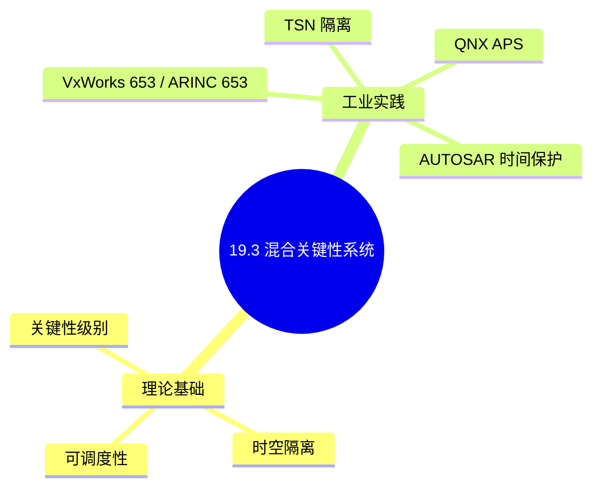

# 19.3 混合关键性系统

> **主题**: 19. 实时系统调度 - 19.3 混合关键性系统
> **覆盖**: 关键性分离、资源隔离、工业混合关键性 RTOS、ARINC 653、认证标准、TSN 时间隔离

## 📊 思维表征体系

```mermaid
mindmap
  root((19.3 混合关键性系统))
    理论基础
      关键性级别
      时空隔离
      可调度性
    工业实践
      VxWorks 653 / ARINC 653
      QNX APS
      AUTOSAR 时间保护
      TSN 隔离
```

| 维度 | 关键性隔离 | 资源利用率 | 可调度性保证 | 系统集成 |
|------|-----------|-----------|------------|---------|
| **性能** | 隔离度>95% | 利用率>80% | 可调度性>90% | 集成度>85% |
| **适用场景** | 混合关键性系统 | 所有场景 | 所有场景 | 混合关键性系统 |

---

## 1 混合关键性系统概述

### 1.1 关键性级别

**关键性级别（Criticality Levels）**：

- **L0：非关键**：普通应用，无实时要求
- **L1：低关键**：软实时，允许偶尔错过截止时间
- **L2：中关键**：硬实时，必须满足截止时间
- **L3：高关键**：安全关键，必须保证正确性
- **L4：最高关键**：生命安全关键，零容忍失败

**关键性特征**：

| 关键性 | 截止时间 | 失败后果 | 验证要求 |
|-----------|------------|------------|------------|
| L0 | 无 | 性能下降 | 无 |
| L1 | 软 | 服务质量下降 | 统计验证 |
| L2 | 硬 | 功能失效 | 形式化验证 |
| L3 | 硬 | 安全风险 | 严格验证 |
| L4 | 硬 | 生命危险 | 最高验证 |

### 1.2 混合关键性的挑战

- **隔离保证**：低关键任务不能影响高关键任务
- **资源共享**：在保证隔离的前提下共享资源
- **验证复杂性**：混合关键性增加验证复杂度
- **成本优化**：在保证安全的前提下优化成本

---

## 2 工业混合关键性 RTOS 架构

### 2.1 VxWorks 653 与 ARINC 653

**ARINC 653**（Avionics Application Standard Software Interface）是航空电子混合关键性系统的核心标准。VxWorks 653 是其主流商业实现。

**核心概念**：

- **分区（Partition）**：每个分区相当于一个独立的虚拟计算机，运行自己的操作系统映像（如 VxWorks、Linux、裸机程序）。
- **时间分区（Major Time Frame / Minor Time Frame）**：Major Frame 被划分为多个固定长度的 Partition Window。每个分区只在属于自己的 Window 内获得 CPU 时间。
- **空间分区**：每个分区拥有独立的物理/虚拟内存空间，MMU/MPU 保证内存隔离。
- **健康监控（Health Monitoring, HM）**：当分区内发生故障时，由 HM 层接管，防止故障扩散到其他分区。

**Mermaid 时间分区示意图**：

```mermaid
gantt
    title ARINC 653 Major Time Frame (10 ms)
    dateFormat X
    axisFormat %s ms
    section Partition A (Flight Ctrl, DAL-A)
    Window A1        :crit, 0, 3
    Window A2        :crit, 7, 10
    section Partition B (Nav, DAL-B)
    Window B         :active, 3, 6
    section Partition C (Diag, DAL-C)
    Window C         :done, 6, 7
```

> 上图示意：Flight Control（DAL-A）独占 0-3 ms 与 7-10 ms；Navigation（DAL-B）独占 3-6 ms；Diagnostics（DAL-C）仅分配 6-7 ms 的剩余时间。

### 2.2 QNX Neutrino 的自适应分区调度（APS）

QNX 的 APS 在汽车电子中广泛用于实现混合关键性：

- **关键分区（Critical Partition）**：为 ADAS 功能（如 AEB 紧急制动）分配固定 CPU 预算，即使其他分区负载激增也不会被抢占。
- **非关键分区（Non-Critical Partition）**：为信息娱乐系统（IVI）分配较低预算，允许其借用未使用的关键分区剩余时间。
- **线程级别的关键性覆盖**：即使分区预算耗尽，标记为 **Critical Thread** 的线程仍可运行，保证最高关键性任务的截止时间。

### 2.3 AUTOSAR OS 的时间保护（Timing Protection）

AUTOSAR OS 不采用严格的分区模型，而是通过 **时间保护** 机制实现混合关键性隔离：

- **执行时间预算（Execution Budget）**：为每个任务/二类中断（Category 2 ISR）设定最大连续执行时间。超预算则触发保护性错误（Protection Hook）。
- **锁定时间预算（Locking Time Budget）**：限制任务持有资源（如互斥量）的最长时间，防止因优先级反转或死锁导致的时间故障传播。
- **到达时间间隔限制（Inter-arrival Time Protection）**：限制任务的激活频率，防止因外部事件突发（Event Burst）导致的系统过载。

### 2.4 PREEMPT_RT Linux 的混合关键性探索

通过 **KVM + Jailhouse** 或 **Xen** 虚拟化，PREEMPT_RT Linux 正在被探索用于混合关键性系统：

- **Jailhouse**：一种轻量级分区 hypervisor，可将多核 CPU 的某些核心静态分配给 RTOS（如 FreeRTOS、RT-Linux），其他核心运行通用 Linux。
- **CPU 隔离（`isolcpus`）**：通过启动参数将特定 CPU 核心从 Linux 调度器中隔离，专门用于关键实时任务。
- **IRQ Affinity**：将高关键性任务相关的中断绑定到隔离核心，减少中断延迟抖动。

---

## 3 关键性分离策略

### 3.1 空间分离

高关键任务运行于专用硬件或虚拟化分区，低关键任务共享剩余资源。

- **优势**：完全隔离、简单验证、高可靠性
- **劣势**：成本高、资源利用率低

### 3.2 时间分离

通过时间分区或时间保护，使不同关键性级别的任务在时间上互不重叠或受预算限制。

- **优势**：资源共享、成本低
- **劣势**：严格的时间隔离验证复杂

### 3.3 混合分离

关键资源采用空间分离，非关键资源采用时间分离。

- **优势**：平衡隔离和成本
- **劣势**：设计复杂度高

---

## 4 资源隔离

### 4.1 CPU 隔离

- **时间分区**：CPU 时间划分为分区，每个分区分配给一个关键性级别
- **优先级调度**：高关键任务高优先级，低关键任务低优先级

### 4.2 内存隔离

- **内存保护**：内存地址空间划分，MMU/MPU 隔离
- **内存加密**：高关键数据加密，防止低关键任务访问

### 4.3 I/O 隔离

- **关键 I/O 设备专用**：如飞行控制总线（ARINC 429 / AFDX）仅由高关键分区访问
- **I/O 带宽保证**：通过 TSN 门控列表为高关键流量预留带宽

---

## 5 TSN 在混合关键性网络中的应用

在航空电子与汽车 E/E 架构中，TSN 用于在同一物理以太网上同时传输安全关键流量（如刹车指令）与非关键流量（如信息娱乐视频流）。

### 5.1 时间窗口隔离与关键性映射

TSN 的 802.1Qbv 可以将不同的优先级队列映射到不同的时间窗口，从而实现类似于 ARINC 653 时间分区的网络版本：

| TSN 优先级 | 对应关键性级别 | 时间窗口策略 |
|-----------|---------------|-------------|
| 7 (Highest) | DAL-A / ASIL D | 严格预留窗口，绝对不可抢占（除非 802.1Qbu Express 帧） |
| 5-6 | DAL-B / ASIL C | 预留窗口，允许被 7 级抢占 |
| 2-4 | DAL-C / ASIL B/A | CBS 整形，保证平均带宽 |
| 0-1 | QM / Non-critical | 尽力而为，使用剩余带宽 |

### 5.2 TSN 与 ARINC 664（AFDX）的共存

在新一代航空电子（如波音 777X、空客 A350 升级包）中，TSN 正在逐步替代或补充 AFDX：

- **AFDX 虚拟链路（VL）** 的概念被映射到 TSN 的 **流（Stream）** 与 **门控列表（GCL）**。
- 通过 **IEEE 802.1CB 帧复制和消除**（FRER）实现与 AFDX 双冗余网络同等的安全关键通信可靠性。

---

## 6 认证标准在混合关键性系统中的应用

### 6.1 DO-178C 与 ARINC 653

在航空电子 IMA（Integrated Modular Avionics）架构中：

- **分区操作系统（如 VxWorks 653）本身** 需要通过 DO-178C A 级认证。
- **每个分区内的应用软件** 根据其分配的 DAL 等级分别认证。高 DAL 分区不能使用低 DAL 分区的共享库，除非经过严格的隔离分析（如时间/空间分区论证）。

### 6.2 ISO 26262 与 AUTOSAR OS

在汽车 ECU 中，单一微控制器上可能共存 ASIL D（如制动）与 QM（如诊断）软件：

- **Freedom From Interference（FFI）**：ISO 26262 Part 6 明确要求证明 ASIL 软件与 QM 软件之间存在足够的独立性。AUTOSAR OS 的时间保护、内存保护、MPU 是实现 FFI 的主要技术措施。
- **Dependent Failure Analysis（DFA）**：分析共享资源（如 CPU、总线、外设）是否可能因 QM 软件的故障导致 ASIL 软件失效。

---

## 7 形式化模型

### 7.1 混合关键性调度问题定义

$$
\text{混合关键性调度问题} = (T, C, R, I, O)
$$

其中：

- $T = \{T_1, T_2, \ldots, T_n\}$，其中 $T_i = (c_i, p_i, d_i, L_i)$
- $C = \{L_0, L_1, L_2, L_3, L_4\}$：关键性级别集合
- $R$：资源集合（CPU、内存、IO）
- $I$：隔离要求
  - 隔离约束：$\text{isolate}(L_i, L_j)$（如果 $L_i > L_j$）
- $O$：优化目标
  - 最大化隔离：$\max \sum_i \text{isolation}(L_i)$
  - 最小化资源使用：$\min \sum_i \text{resource}(L_i)$

### 7.2 定理：混合关键性可调度性

**定理 19.3**：对于混合关键性任务集合，如果满足：

$$
\sum_{T_i \in L_j} \frac{c_i}{p_i} \leq \text{partition\_time}(L_j)
$$

且

$$
\text{isolate}(L_i, L_j) = \text{true} \quad (\text{if } L_i > L_j)
$$

则系统是可调度的。

---

## 8 相关主题

- [19.1 硬实时调度](./19.1_硬实时调度.md)
- [19.2 软实时调度](./19.2_软实时调度.md)
- [19.4 实时调度验证](./19.4_实时调度验证.md)

---

**最后更新**: 2025-12-02
**文档状态**: ✅ 已扩展（ARINC 653 + APS + AUTOSAR 时间保护 + TSN 混合关键性）
