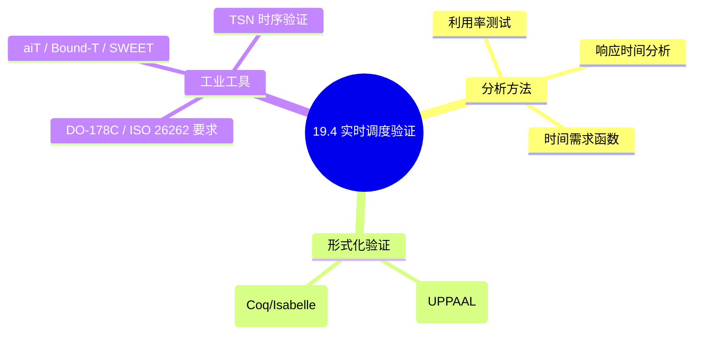
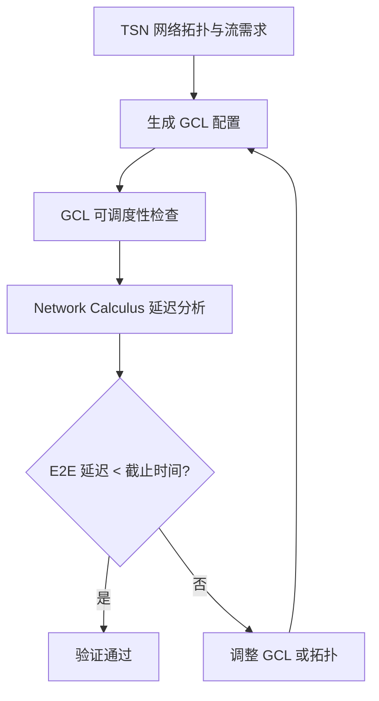

# 19.4 实时调度验证

> **主题**: 19. 实时系统调度 - 19.4 实时调度验证
> **覆盖**: 可调度性分析、响应时间分析、形式化验证、WCET 工具链、认证标准的验证要求、TSN 时序验证

## 📊 思维表征体系


```mermaid
mindmap
  root((19.4 实时调度验证))
    分析方法
      利用率测试
      响应时间分析
      时间需求函数
    形式化验证
      模型检测 (UPPAAL)
      定理证明 (Coq/Isabelle)
    工业工具
      aiT / Bound-T / SWEET
      DO-178C / ISO 26262 要求
      TSN 时序验证
```

| 维度 | 验证准确性 | 验证效率 | 可扩展性 | 自动化程度 |
|------|-----------|---------|---------|-----------|
| **性能** | 准确率>95% | <1小时 | >100任务 | >80% |
| **适用场景** | 所有实时系统 | 所有实时系统 | 大规模系统 | 所有实时系统 |

---

## 1 实时调度验证概述

### 1.1 验证的重要性

**实时系统验证**：

- **安全性**：验证系统满足实时要求
- **可靠性**：保证关键任务按时完成
- **合规性**：满足安全标准（如 DO-178C、ISO 26262）

**验证目标**：

- **可调度性**：证明任务集合可调度
- **响应时间**：计算任务响应时间上界
- **截止时间**：保证任务在截止时间内完成

### 1.2 验证方法类型

- **可调度性测试**：利用率测试、响应时间分析
- **形式化验证**：模型检测、定理证明
- **WCET 分析**：最坏情况执行时间分析
- **仿真验证**：基于仿真的验证

---

## 2 可调度性分析

### 2.1 利用率测试

**RMS 可调度性**：

$$
U = \sum_{i=1}^{n} \frac{c_i}{p_i} \leq n(2^{1/n} - 1)
$$

**EDF 可调度性**：

$$
U = \sum_{i=1}^{n} \frac{c_i}{p_i} \leq 1
$$

### 2.2 响应时间分析（RTA）

**固定优先级响应时间**：

$$
R_i = c_i + \sum_{j \in hp(i)} \left\lceil \frac{R_i}{p_j} \right\rceil \cdot c_j
$$

**迭代求解**：

$$
R_i^{(k+1)} = c_i + \sum_{j \in hp(i)} \left\lceil \frac{R_i^{(k)}}{p_j} \right\rceil \cdot c_j
$$

### 2.3 时间需求函数（TDF）

$$
\text{tdf}_i(t) = c_i + \sum_{j \in hp(i)} \left\lceil \frac{t}{p_j} \right\rceil \cdot c_j
$$

**可调度性条件**：

$$
\exists t \in [0, d_i]: \text{tdf}_i(t) \leq t
$$

---

## 3 形式化验证

### 3.1 模型检测（Model Checking）

**工具**：

- **UPPAAL**：基于时间自动机（Timed Automata）的模型检测器，广泛用于实时系统可调度性验证。
  - 支持时钟变量、同步通道、紧急/承诺位置。
  - 可验证属性如 `A[] not deadlock`（无死锁）或 `A[] Task1.DeadlineMissed == false`（无截止时间违反）。
- **SPIN**：并发系统模型检测，通过 Promela 语言建模。
- **TLA+**：时序逻辑验证，适合分布式协议。

**UPPAAL 建模示例（概念）**：

```uppaal
// 简化的周期性任务模板
process Task(int period, int wcet, int deadline) {
  clock x;
  state
    Idle,
    Running,
    Done;
  init Idle;
  trans
    Idle -> Running { guard x >= period; assign x = 0; },
    Running -> Done { guard x <= wcet; },
    Done -> Idle { guard x <= deadline; };
}
```

### 3.2 定理证明

**工具**：

- **Coq**：交互式定理证明器，已用于证明调度算法的可调度性条件（如 Prosa 项目对 EDF、RMS 的形式化证明）。
- **Isabelle/HOL**：用于验证复杂系统属性，如 seL4 微内核的形式化验证。
- **PVS**：原型验证系统，NASA 广泛用于航空电子协议验证。

### 3.3 抽象解释

抽象解释是静态程序分析（尤其是 WCET 分析）的数学基础。它通过在抽象域（如区间、多面体、八边形）上执行程序，计算变量值的上界，从而推断循环边界、路径可行性。

---

## 4 WCET 分析工具详解

WCET 上界是可调度性分析最关键的输入参数之一。任何低估都可能导致实际运行时发生截止时间违反。以下是三款工具的深入技术说明。

### 4.1 aiT（AbsInt）

**工作流程**：

1. **二进制导入**：读取 ELF 可执行文件，重构控制流图（CFG）。
2. **值分析（Value Analysis）**：基于抽象解释推断寄存器与内存变量的值域。
3. **缓存与流水线分析**：使用处理器的微架构模型（如 ARM Cortex-R52 的 2 级缓存、乱序执行窗口）分析最坏情况下的缓存命中/未命中模式与流水线停顿。
4. **路径分析（Path Analysis）**：使用 ILP 求解器计算最长执行路径，输出每个函数的 WCET。

**输出格式示例**：

```
Function: control_loop
  WCET: 2456 cycles
  Cache misses (worst-case): L1I=12, L1D=8, L2=3
  Pipeline stalls: Load-Use=45, Branch-Mispredict=2
```

**认证资质**：aiT 已通过多家航空与汽车认证机构的 **工具鉴定（Tool Qualification）**，可直接用于 DO-178C A 级与 ISO 26262 ASIL D 项目的验证证据生成。

### 4.2 Bound-T

**特点**：

- 专注于栈高度与 WCET 的联合分析。
- 对 **结构化循环** 和 **无递归代码** 的分析非常高效。
- 支持从二进制直接分析，无需源代码。

**局限性**：

- 对复杂处理器（带动态分支预测、多级缓存的现代 CPU）的建模能力有限。
- 主要面向 8/16/32 位嵌入式处理器。

### 4.3 SWEET

**特点**：

- 开源/学术研究工具，基于 ALF 中间语言。
- 支持 **模块化 WCET 分析**：先分析子程序/基本块的局部 WCET，再通过调用图组合为全局 WCET。
- 抽象域可配置，支持 **Polyhedra** 等高精度域。

**适用场景**：

- 学术研究、算法原型验证、教学演示。
- 在工业认证项目中使用较少，因其缺乏广泛的处理器模型库和官方工具鉴定包。

### 4.4 工具对比总表

| 工具 | 分析精度 | 自动化程度 | 处理器覆盖 | 认证支持 | 最佳应用 |
|------|---------|-----------|-----------|---------|---------|
| **aiT** | ⭐⭐⭐⭐⭐ | ⭐⭐⭐⭐⭐ | ⭐⭐⭐⭐⭐ | DO-178C A, ASIL D | 航空、汽车、工业控制 |
| **Bound-T** | ⭐⭐⭐ | ⭐⭐⭐⭐ | ⭐⭐ | ESA 历史项目 | 航天嵌入式、小内核 |
| **SWEET** | ⭐⭐⭐⭐ | ⭐⭐⭐ | ⭐⭐ | 学术研究 | 算法研究、原型验证 |

---

## 5 认证标准的验证要求

### 5.1 DO-178C 的验证要求

DO-178C 对不同软件等级（DAL A~E）提出了逐级递增的验证要求：

| DAL | 可调度性分析要求 | WCET 要求 | 形式化验证要求 |
|-----|-----------------|-----------|---------------|
| **A** | 必须进行严格的响应时间分析或模型检测；所有任务的截止时间满足性必须有数学证据 | 必须使用经过鉴定的静态 WCET 工具；结果需经同行评审 | 强烈推荐；至少需使用高度自动化的分析工具 |
| **B** | 必须进行响应时间分析；允许结合测试与分析 | 推荐使用静态 WCET 工具；允许使用测量法 + 安全裕量 | 推荐 |
| **C** | 需要可调度性分析；测试可作为主要验证手段 | 可以使用测量法 | 可选 |
| **D** | 基本的调度验证 | 无强制要求 | 无要求 |
| **E** | 无要求 | 无要求 | 无要求 |

**补充标准 DO-330（工具鉴定）**：

- 用于生成认证证据的工具（如 aiT、UPPAAL）本身必须通过工具鉴定。
- 鉴定等级分为 TQL-1（最严格，对应 DAL A）到 TQL-5（对应 DAL E）。

### 5.2 ISO 26262 的验证要求

ISO 26262 Part 6（产品开发：软件层面）对 ASIL 等级的验证方法有明确推荐：

| ASIL | 调度分析方法 | WCET 分析方法 | 形式化验证 |
|------|-------------|--------------|-----------|
| **ASIL D** | **强烈推荐** 基于数学的调度分析（RMS/EDF RTA）；必须考虑共享资源与优先级反转 | **强烈推荐** 静态分析；**不推荐** 纯测量法 | 推荐 |
| **ASIL C** | 推荐数学分析；允许高覆盖率的测试 | 推荐静态分析；允许测量 + 裕量 | 可选 |
| **ASIL B** | 可以使用测试或分析 | 可以使用测量法 | 可选 |
| **ASIL A** | 测试为主 | 无强制要求 | 无要求 |
| **QM** | 无功能安全要求 | 无要求 | 无要求 |

**关键验证活动**：

1. **资源使用验证**：证明任务的最坏情况 CPU 使用率（WCET/Period）之和在目标 ASIL 的允许范围内。
2. **时间行为验证**：证明没有无界优先级反转；共享资源的锁定时间有上界。
3. **故障注入测试**：对于 ASIL D/C，需要进行故障注入以验证时间保护机制（如 AUTOSAR OS 的 Budget Monitoring）的有效性。

---

## 6 TSN 时序验证

TSN 网络的时序验证需要同时考虑端节点任务调度与网络门控调度表的协同。

### 6.1 GCL 可调度性分析

IEEE 802.1Qbv 的 GCL 配置本质上是一个周期性的时分多路复用（TDM）调度器。验证目标是：

- 对于每条关键流 $S_i$（周期 $P_i$，帧大小 $L_i$，链路速率 $R$），必须存在至少一个 GCL 窗口，使得：
  $$\text{WindowLength} \geq \frac{L_i}{R} + \text{GuardBand}$$
- 且该窗口在每个周期 $P_i$ 内至少出现一次。

### 6.2 端到端延迟上界

TSN 流的端到端延迟由以下部分组成：

$$
D_{e2e} = D_{src} + D_{queue} + D_{tx} + D_{prop} + D_{dst}
$$

其中：

- $D_{src}$：源节点任务完成数据准备到网络接口的延迟
- $D_{queue}$：在交换机端口排队等待门开启的延迟（由 GCL 决定）
- $D_{tx}$：帧在链路上的传输时间 $L/R$
- $D_{prop}$：物理传播延迟（通常 < 1 µs/100m）
- $D_{dst}$：目的节点接收中断到消费任务调度的延迟

**Network Calculus** 是分析 $D_{queue}$ 上界的标准数学工具。通过为每个 TSN 流定义到达曲线（Arrival Curve）与服务曲线（Service Curve），可以计算出确定性的延迟上界。

### 6.3 TSN 验证 Mermaid 流程


```mermaid
graph TD
    A[TSN 网络拓扑与流需求] --> B[生成 GCL 配置]
    B --> C[GCL 可调度性检查]
    C --> D[Network Calculus 延迟分析]
    D --> E{E2E 延迟 < 截止时间?}
    E -->|是| F[验证通过]
    E -->|否| G[调整 GCL 或拓扑]
    G --> B
```

---

## 7 验证方法复杂度

| 方法 | 时间复杂度 | 准确性 | 适用场景 |
|------|-----------|--------|---------|
| 利用率测试 | $O(n)$ | 充分条件 | 快速验证 |
| 响应时间分析 | $O(n^2)$ | 充要条件 | 精确验证 |
| 模型检测 | $O(2^n)$ | 完全验证 | 小规模系统 |
| 定理证明 | 不可判定 | 完全验证 | 关键系统 |

---

## 8 相关主题

- [19.1 硬实时调度](./19.1_硬实时调度.md)
- [19.2 软实时调度](./19.2_软实时调度.md)
- [19.3 混合关键性系统](./19.3_混合关键性系统.md)

---

**最后更新**: 2025-12-02
**文档状态**: ✅ 已扩展（WCET 工具链 + 认证验证要求 + UPPAAL + TSN 时序验证）
