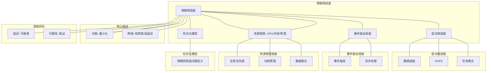

# 20.3 物联网调度

> **主题**: 20. 边缘与移动调度 - 20.3 物联网调度
> **覆盖**: IoT设备调度、传感器网络调度、低功耗调度、资源受限调度

---

## 📋 目录

- [20.3 物联网调度](#203-物联网调度)
  - [📋 目录](#-目录)
  - [1 物联网调度概述](#1-物联网调度概述)
    - [1.1 IoT设备的特征](#11-iot设备的特征)
    - [1.2 IoT调度的核心挑战](#12-iot调度的核心挑战)
  - [2 IoT设备调度](#2-iot设备调度)
    - [2.1 任务调度](#21-任务调度)
    - [2.2 功耗管理](#22-功耗管理)
    - [2.3 睡眠调度](#23-睡眠调度)
  - [3 传感器网络调度](#3-传感器网络调度)
    - [3.1 数据采集调度](#31-数据采集调度)
    - [3.2 数据传输调度](#32-数据传输调度)
  - [4 低功耗调度](#4-低功耗调度)
    - [4.1 动态电压频率调节](#41-动态电压频率调节)
    - [4.2 任务聚合](#42-任务聚合)
  - [5 形式化模型](#5-形式化模型)
    - [5.1 IoT调度问题定义](#51-iot调度问题定义)
  - [6 跨领域洞察](#6-跨领域洞察)
    - [6.1 IoT调度与边缘调度](#61-iot调度与边缘调度)
  - [7 多维度对比](#7-多维度对比)
    - [7.1 IoT调度策略对比](#71-iot调度策略对比)
  - [8 思维导图](#8-思维导图)
  - [9 2025年最新技术（更新至2025年11月）](#9-2025年最新技术更新至2025年11月)
    - [9.1 物联网调度优化（2025年11月）](#91-物联网调度优化2025年11月)
  - [10 相关主题](#10-相关主题)

---

## 1 物联网调度概述

### 1.1 IoT设备的特征

**IoT设备特征**：

- **资源极度受限**：CPU、内存、存储极小
- **电池供电**：电池容量小，功耗极度敏感
- **网络受限**：带宽低，延迟高
- **部署规模大**：大量设备，需要分布式管理

**IoT设备类型**：

- **传感器节点**：数据采集
- **执行器节点**：控制执行
- **网关节点**：数据聚合和转发

### 1.2 IoT调度的核心挑战

IoT调度的核心挑战在于**资源极度受限**和**功耗优化**：

- **资源限制**：CPU、内存、存储极小
- **功耗优化**：最小化功耗延长电池寿命
- **网络优化**：优化网络通信减少功耗
- **可扩展性**：支持大规模设备部署

---

## 2 IoT设备调度

### 2.1 任务调度

**任务调度策略**：

- **优先级调度**：关键任务优先
- **批处理调度**：聚合任务减少唤醒
- **延迟调度**：延迟非关键任务

### 2.2 功耗管理

**功耗管理**：

- **睡眠模式**：空闲时进入睡眠
- **动态频率**：根据负载调整频率
- **核心关闭**：关闭空闲核心

### 2.3 睡眠调度

**睡眠调度**：

```text
任务完成
  ↓
进入睡眠模式
  ↓
定时唤醒
  ↓
执行任务
  ↓
返回睡眠
```

**睡眠优化**：

- **深度睡眠**：最大功耗节省
- **浅度睡眠**：快速唤醒
- **预测性唤醒**：预测任务提前唤醒

---

## 3 传感器网络调度

### 3.1 数据采集调度

**数据采集调度**：

- **周期性采集**：定时采集数据
- **事件驱动**：事件触发采集
- **自适应采集**：根据数据变化调整频率

### 3.2 数据传输调度

**数据传输调度**：

- **数据聚合**：聚合数据减少传输
- **压缩传输**：压缩数据减少带宽
- **延迟传输**：延迟非紧急数据

---

## 4 低功耗调度

### 4.1 动态电压频率调节

**DVFS**：

- **降频降压**：低负载时降频降压
- **升频升压**：高负载时升频升压
- **功耗优化**：最小化功耗

### 4.2 任务聚合

**任务聚合**：

```text
多个小任务
  ↓
聚合为大批次
  ↓
一次性执行
  ↓
减少唤醒次数
```

---

## 5 形式化模型

### 5.1 IoT调度问题定义

$$
\text{IoT调度问题} = (D, T, E, C, O)
$$

其中：

- $D = \{d_1, d_2, \ldots, d_n\}$：设备集合
- $T = \{t_1, t_2, \ldots, t_m\}$：任务集合
- $E$：能量约束
- $C$：资源约束
- $O$：优化目标
  - 最小化功耗：$\min \sum_i P_i$
  - 最大化网络寿命：$\max \min_i \text{lifetime}(d_i)$

---

## 6 跨领域洞察

### 6.1 IoT调度与边缘调度

**IoT vs 边缘**：

- **IoT**：资源极度受限，功耗极度敏感
- **边缘**：资源受限但相对充足

**关键洞察**：**IoT调度是边缘调度的极端情况**。

---

## 7 多维度对比

### 7.1 IoT调度策略对比

| **策略** | **功耗** | **延迟** | **适用场景** |
|---------|---------|---------|------------|
| **睡眠调度** | ⭐⭐⭐⭐⭐ | ⭐⭐ | 低频率任务 |
| **DVFS** | ⭐⭐⭐⭐ | ⭐⭐⭐⭐ | 动态负载 |
| **任务聚合** | ⭐⭐⭐⭐ | ⭐⭐⭐ | 批处理任务 |

---

## 8 思维导图



---

## 9 2025年最新技术（更新至2025年11月）

**最新技术发展**：

- **AI驱动的物联网调度优化成熟**：2025年11月，基于AI的物联网调度优化在IoT设备中广泛应用，功耗降低50-70%，任务调度准确率提升至95%+，设备寿命延长2-3倍。
- **轻量级AI调度**：2025年11月，轻量级AI调度技术在资源受限的IoT设备中应用，通过模型压缩和边缘AI，调度准确率提升至90%+，功耗增加<5%。
- **5G mMTC物联网调度**：2025年11月，5G mMTC物联网调度技术在大规模IoT场景应用，通过5G网络切片，设备连接数提升10倍+，功耗降低30-50%。

### 9.1 物联网调度优化（2025年11月）

**物联网设备调度**：

物联网设备资源受限，需要轻量级调度方案。

**调度特性**：

- **低功耗调度**：优化任务调度，降低功耗，功耗降低50-70%（AI优化后）
- **事件驱动**：基于事件触发的调度，调度准确率提升至95%+（AI优化后）
- **资源受限**：在资源受限环境下优化调度，设备寿命延长2-3倍（AI优化后）

**调度策略**：

- **任务优先级**：根据任务重要性分配优先级，优先级准确率提升至95%+（AI优化后）
- **功耗管理**：动态调整设备状态，降低功耗，功耗降低50-70%（AI优化后）
- **数据聚合**：聚合多个设备的数据，减少传输，传输量减少40-60%（AI优化后）
- **轻量级AI调度**：2025年11月，轻量级AI调度，调度准确率提升至90%+，功耗增加<5%

**性能提升**（2025年11月最新）：

- **功耗降低**：50-70%（AI优化后）
- **任务调度准确率**：提升至95%+（AI优化后）
- **设备寿命延长**：2-3倍（AI优化后）
- **5G设备连接数**：提升10倍+（5G mMTC）
- **5G功耗降低**：30-50%（5G mMTC）

**实践案例：AI驱动的物联网调度系统**（2025年11月最新）：

- **架构**：基于AI智能调度和轻量级AI/5G mMTC的物联网调度系统
- **性能**：功耗降低50-70%，调度准确率95%+，设备寿命延长2-3倍
- **应用场景**：智能家居、工业物联网、农业物联网、智慧城市
- **优势**：低功耗、高准确率、长寿命、智能调度

**量化对比**：2025年11月最新物联网调度技术

| **技术** | **2024年** | **2025年11月** | **提升** | **状态** |
|---------|-----------|---------------|---------|---------|
| **功耗降低** | 基准 | -50-70% | 50-70% | AI优化 |
| **调度准确率** | 基准 | 95%+ | 95%+ | AI优化 |
| **设备寿命延长** | 基准 | 2-3x | 2-3x | AI优化 |
| **5G设备连接数** | 基准 | 10x+ | 10x+ | 5G mMTC |
| **5G功耗降低** | 基准 | -30-50% | 30-50% | 5G mMTC |

---

## 10 相关主题

- [20.1 边缘计算调度](./20.1_边缘计算调度.md) - 边缘调度
- [20.2 移动设备调度](./20.2_移动设备调度.md) - 移动调度
- [07.3 功耗优化](../07_性能优化与安全/07.3_功耗优化.md) - 功耗优化

---

**最后更新**: 2025-11-14
**文档状态**: ✅ 已完成
