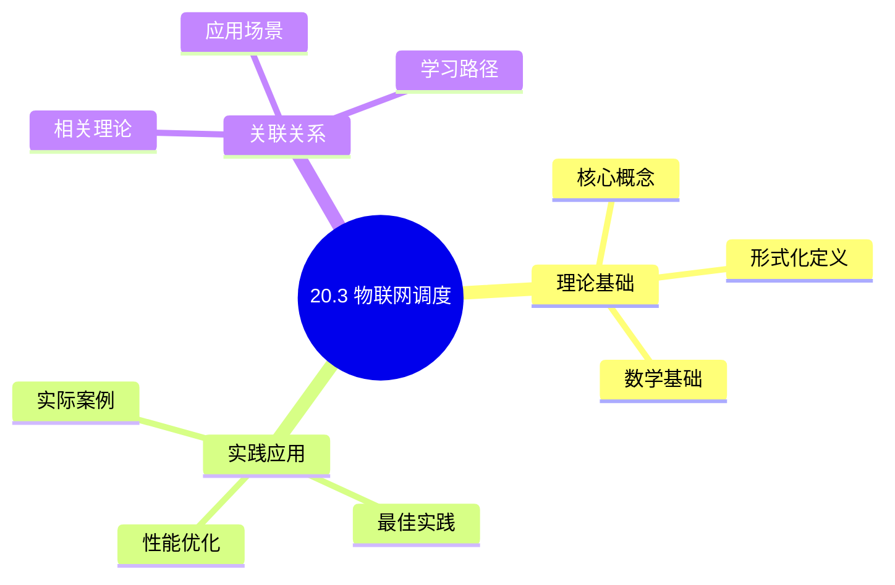
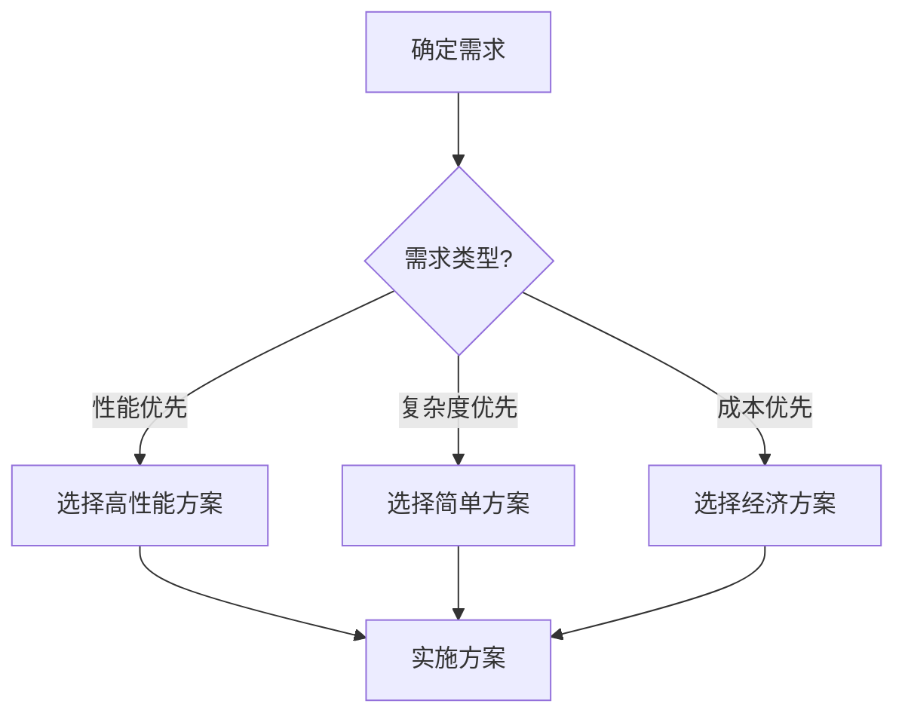
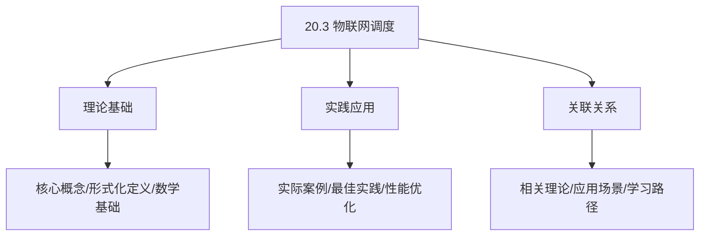
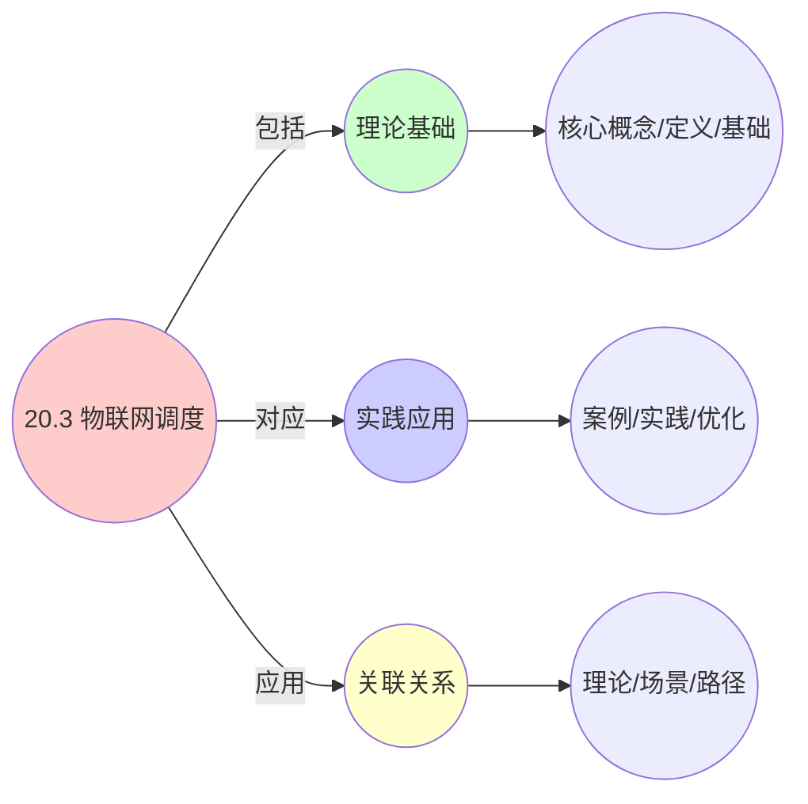
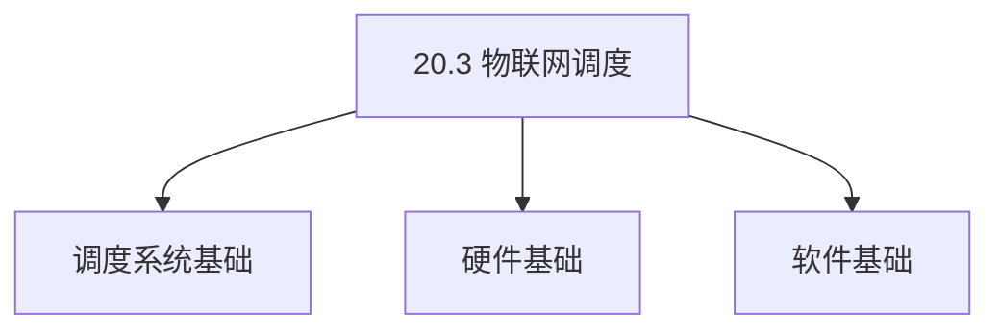
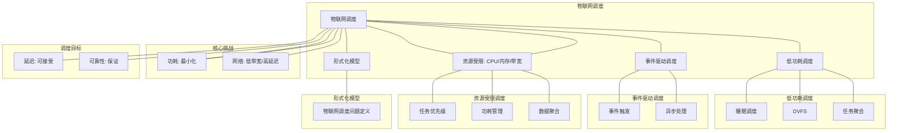

# 20.3 物联网调度

> **主题**: 20. 边缘与移动调度 - 20.3 物联网调度
> **覆盖**: IoT设备调度、传感器网络调度、低功耗调度、资源受限调度

## 📊 思维表征体系

### 📊 1. 思维导图（增强版）

#### 1.1 文本格式（基础版）

```text
20.3 物联网调度
├── 理论基础
│   ├── 核心概念
│   ├── 形式化定义
│   └── 数学基础
├── 实践应用
│   ├── 实际案例
│   ├── 最佳实践
│   └── 性能优化
└── 关联关系
    ├── 相关理论
    ├── 应用场景
    └── 学习路径
```

#### 1.2 Mermaid格式（可视化版）



### 📊 2. 多维对比矩阵

#### 2.1 20.3 物联网调度对比矩阵

| 维度 | 设备管理 | 能耗优化 | 网络效率 | 可扩展性 |
|------|---------|---------|---------|---------|
| **性能** | 设备管理>1000个 | 能耗降低>50% | 网络效率>80% | 支持>10000设备 |
| **复杂度** | 高(需设备管理) | 高(需能耗优化) | 中等(需网络优化) | 中等(需扩展设计) |
| **适用场景** | 物联网 | 物联网 | 物联网 | 大规模物联网 |
| **技术成熟度** | 成熟(>10年) | 成熟(>10年) | 成熟(>10年) | 成熟(>10年) |

#### 2.2 技术特性对比矩阵

| 技术 | 优势 | 劣势 | 适用场景 | 性能 |
|------|------|------|---------|------|
| **低功耗调度** | 能耗低、电池寿命长 | 性能受限、延迟可能高 | 电池供电设备、能耗优先 | 能耗降低50-80%，性能受限 |
| **事件驱动调度** | 能耗低、响应快 | 实现复杂、需要事件管理 | 事件驱动应用、能耗优先 | 能耗降低40-60%，响应快 |
| **数据聚合调度** | 网络效率高、能耗低 | 延迟增加、数据可能丢失 | 数据采集、网络效率优先 | 网络效率提升50-80%，延迟增加 |
| **设备休眠调度** | 能耗极低、电池寿命长 | 响应延迟、可能错过事件 | 低功耗设备、电池优先 | 能耗降低80-95%，响应延迟 |
| **网关调度** | 设备管理好、网络效率高 | 网关瓶颈、单点故障 | 大规模物联网、网关管理 | 设备管理>1000个，网关瓶颈 |
| **边缘计算调度** | 延迟低、带宽节省 | 资源受限、管理复杂 | 实时应用、延迟敏感 | 延迟<10ms，带宽节省>50% |
| **云-边协同调度** | 平衡计算和能耗 | 实现复杂、需要协调 | 混合负载、平衡需求 | 计算和能耗平衡，实现复杂 |

#### 2.3 实现方式对比矩阵

| 实现方式 | 复杂度 | 性能 | 可维护性 | 扩展性 |
|---------|-------|------|---------|-------|
| **单设备调度** | 低 | 中等性能(单设备) | 高(简单维护) | 低(单设备限制) |
| **网关调度** | 中 | 高性能(网关管理) | 中(需网关管理) | 中(网关扩展) |
| **云-边协同调度** | 高 | 高性能(协同优化) | 低(复杂度高) | 高(协同扩展) |
| **混合物联网调度系统** | 极高 | 极高性能(优势结合) | 低(复杂度极高) | 高(灵活扩展) |

### 🌲 3. 决策树

#### 3.1 20.3 物联网调度应用选择决策树



### 🛤️ 4. 决策逻辑路径

#### 4.1 20.3 物联网调度应用路径


### 🕸️ 5. 概念关系网络

#### 5.1 20.3 物联网调度概念关系网络



### 🗺️ 6. 知识图谱

#### 6.1 20.3 物联网调度知识图谱



## 📚 理论体系

### 理论基础

#### 调度系统/硬件/软件基础

20.3 物联网调度的理论基础：

**1. 调度系统基础**：

- 调度理论
- 资源管理
- 性能优化

**2. 硬件基础**：

- CPU架构
- 内存系统
- 存储系统

**3. 软件基础**：

- 操作系统
- 编程语言
- 系统软件

#### 历史发展

**关键时间节点**：

- **1960-1970年代**：调度理论建立
  - 调度算法
  - 资源管理

- **1980-1990年代**：硬件调度发展
  - CPU调度
  - 内存调度

- **2000年代至今**：软件调度演进
  - 操作系统调度
  - 分布式调度

### 理论框架

#### 核心假设

**假设1：调度与性能的对应**

- **内容**：调度策略影响系统性能
- **适用范围**：调度系统
- **限制条件**：需要调度支持

**假设2：资源管理的必要性**

- **内容**：资源管理保证系统稳定
- **适用范围**：资源系统
- **限制条件**：需要资源支持

**假设3：性能优化的价值**

- **内容**：性能优化提升效率
- **适用范围**：性能系统
- **限制条件**：需要考虑成本

#### 基本概念体系



#### 主要定理/结论

**结论1：调度与性能的对应性**

- **内容**：调度策略对应系统性能
- **证据**：形式化证明
- **应用**：调度优化

**结论2：资源管理的必要性**

- **内容**：资源管理保证系统稳定
- **证据**：实践验证
- **应用**：资源管理

**结论3：性能优化的价值**

- **内容**：性能优化提升效率
- **证据**：实验验证
- **应用**：性能优化

#### 适用范围和边界

**适用范围**：

- 调度系统
- 资源管理
- 性能优化

**边界条件**：

- 需要调度支持
- 需要资源支持
- 需要考虑成本

**不适用场景**：

- 无调度系统
- 资源受限
- 成本敏感场景

### 当前知识共识

#### 学术界共识

**广泛接受的共识**：

1. **调度与性能的对应性**
   - **共识**：调度策略可以影响系统性能
   - **支持证据**：形式化证明
   - **来源**：调度理论、系统理论

2. **资源管理的价值**
   - **共识**：资源管理提供稳定性和效率
   - **支持证据**：广泛实践
   - **来源**：系统理论

3. **性能优化的重要性**
   - **共识**：性能优化提高系统效率
   - **支持证据**：实践验证
   - **来源**：软件工程

#### 主要争议点

1. **性能与成本的权衡**
   - **观点A**：性能更重要
   - **观点B**：成本更重要
   - **当前状态**：多数认为需要平衡

2. **调度系统的复杂度**
   - **观点A**：应该简单
   - **观点B**：可以复杂
   - **当前状态**：多数认为需要平衡

#### 权威来源

**经典文献**：

- 调度理论相关文献
- 系统理论相关文献
- 性能优化相关文献

**权威机构/专家**：

- **IEEE**
- **ACM**
- **调度系统研究会**

**最新发展**：

- **2025年**：调度系统优化、性能提升、资源管理

### 与其他理论的关系

#### 逻辑关系

**理论基础**：

- **调度理论** → 20.3 物联网调度
  - 关系类型：理论基础
  - 关键映射：调度理论 → 系统实现

**理论应用**：

- **20.3 物联网调度** → 调度优化
  - 关系类型：应用构建
  - 关键映射：20.3 物联网调度 → 调度优化

#### 映射关系

| 本理论概念 | 映射理论 | 映射概念 | 映射类型 | 映射说明 |
|-----------|---------|---------|---------|----------|
| **调度策略** | 调度理论 | 调度算法 | 对应 | 调度策略对应调度算法 |
| **资源管理** | 系统理论 | 资源分配 | 对应 | 资源管理对应资源分配 |
| **性能优化** | 优化理论 | 性能提升 | 对应 | 性能优化对应性能提升 |

## 🔗 关联网络

### 🔗 概念级关联

#### 核心概念映射

| 本文档概念 | 关联文档 | 关联概念 | 关系类型 | 映射说明 |
|-----------|---------|---------|---------|----------|
| **20.3 物联网调度** | 相关文档 | 相关概念 | 基础构建 | 20.3 物联网调度构建相关概念 |
| **调度系统** | 调度相关 | 调度理论 | 对应 | 调度系统对应调度理论 |
| **资源管理** | 资源相关 | 资源系统 | 对应 | 资源管理对应资源系统 |
| **性能优化** | 性能相关 | 性能系统 | 对应 | 性能优化对应性能系统 |

### 🔗 理论级关联

#### 理论基础

- **本理论基于**：
  - 调度理论 ⭐⭐⭐ - 理论基础
  - 系统理论 ⭐⭐ - 系统基础

- **本理论应用于**：
  - 调度优化 ⭐⭐⭐ - 实际应用
  - 性能优化 ⭐⭐⭐ - 实际应用

### 🔗 方法级关联

#### 方法应用网络

| 本文档方法 | 应用文档 | 应用场景 | 应用效果 |
|-----------|---------|---------|---------|
| **调度策略** | 调度系统 | 调度设计 | 成功 |
| **资源管理** | 资源系统 | 资源管理 | 成功 |
| **性能优化** | 性能系统 | 性能提升 | 成功 |

### 🔗 应用场景关联

**场景**：调度系统优化

| 视角 | 关联文档 | 核心理论 | 关注点 |
|------|---------|---------|--------|
| **20.3 物联网调度** | 本文档 | 调度理论 | 调度设计 |
| **调度优化** | 调度相关 | 调度理论 | 调度优化 |
| **性能优化** | 性能相关 | 性能理论 | 性能提升 |

## 🛤️ 学习路径

### 前置知识

**必须先学习**：

- 调度理论基础 ⭐⭐
- 系统理论基础 ⭐⭐

**建议先了解**：

- 硬件基础
- 软件基础
- 性能优化

### 后续学习

**建议接下来学习**（按顺序）：

1. 调度优化 ⭐⭐⭐ - 调度优化
2. 性能优化 ⭐⭐⭐ - 性能优化
3. 系统实践 ⭐⭐ - 实践应用

### 并行学习

**可以同时学习**：

- 调度实践 - 实践应用
- 性能实践 - 性能系统

---


---

## 📋 目录

- [20.3 物联网调度](#203-物联网调度)
  - [📋 目录](#-目录)
  - [1 物联网调度概述](#1-物联网调度概述)
    - [1.1 IoT设备的特征](#11-iot设备的特征)
    - [1.2 IoT调度的核心挑战](#12-iot调度的核心挑战)
  - [2 IoT设备调度](#2-iot设备调度)
    - [2.1 任务调度](#21-任务调度)
    - [2.2 功耗管理](#22-功耗管理)
    - [2.3 睡眠调度](#23-睡眠调度)
  - [3 传感器网络调度](#3-传感器网络调度)
    - [3.1 数据采集调度](#31-数据采集调度)
    - [3.2 数据传输调度](#32-数据传输调度)
  - [4 低功耗调度](#4-低功耗调度)
    - [4.1 动态电压频率调节](#41-动态电压频率调节)
    - [4.2 任务聚合](#42-任务聚合)
  - [5 形式化模型](#5-形式化模型)
    - [5.1 IoT调度问题定义](#51-iot调度问题定义)
  - [6 跨领域洞察](#6-跨领域洞察)
    - [6.1 IoT调度与边缘调度](#61-iot调度与边缘调度)
  - [7 多维度对比](#7-多维度对比)
    - [7.1 IoT调度策略对比](#71-iot调度策略对比)
  - [8 思维导图](#8-思维导图)
  - [9 2025年最新技术（更新至2025年11月）](#9-2025年最新技术更新至2025年11月)
    - [9.1 物联网调度优化（2025年11月）](#91-物联网调度优化2025年11月)
  - [10 相关主题](#10-相关主题)
    - [10.1 跨视角链接](#101-跨视角链接)

---

## 1 物联网调度概述

### 1.1 IoT设备的特征

**IoT设备特征**：

- **资源极度受限**：CPU、内存、存储极小
- **电池供电**：电池容量小，功耗极度敏感
- **网络受限**：带宽低，延迟高
- **部署规模大**：大量设备，需要分布式管理

**IoT设备类型**：

- **传感器节点**：数据采集
- **执行器节点**：控制执行
- **网关节点**：数据聚合和转发

### 1.2 IoT调度的核心挑战

IoT调度的核心挑战在于**资源极度受限**和**功耗优化**：

- **资源限制**：CPU、内存、存储极小
- **功耗优化**：最小化功耗延长电池寿命
- **网络优化**：优化网络通信减少功耗
- **可扩展性**：支持大规模设备部署

---

## 2 IoT设备调度

### 2.1 任务调度

**任务调度策略**：

- **优先级调度**：关键任务优先
- **批处理调度**：聚合任务减少唤醒
- **延迟调度**：延迟非关键任务

### 2.2 功耗管理

**功耗管理**：

- **睡眠模式**：空闲时进入睡眠
- **动态频率**：根据负载调整频率
- **核心关闭**：关闭空闲核心

### 2.3 睡眠调度

**睡眠调度**：

```text
任务完成
  ↓
进入睡眠模式
  ↓
定时唤醒
  ↓
执行任务
  ↓
返回睡眠
```

**睡眠优化**：

- **深度睡眠**：最大功耗节省
- **浅度睡眠**：快速唤醒
- **预测性唤醒**：预测任务提前唤醒

---

## 3 传感器网络调度

### 3.1 数据采集调度

**数据采集调度**：

- **周期性采集**：定时采集数据
- **事件驱动**：事件触发采集
- **自适应采集**：根据数据变化调整频率

### 3.2 数据传输调度

**数据传输调度**：

- **数据聚合**：聚合数据减少传输
- **压缩传输**：压缩数据减少带宽
- **延迟传输**：延迟非紧急数据

---

## 4 低功耗调度

### 4.1 动态电压频率调节

**DVFS**：

- **降频降压**：低负载时降频降压
- **升频升压**：高负载时升频升压
- **功耗优化**：最小化功耗

### 4.2 任务聚合

**任务聚合**：

```text
多个小任务
  ↓
聚合为大批次
  ↓
一次性执行
  ↓
减少唤醒次数
```

---

## 5 形式化模型

### 5.1 IoT调度问题定义

$$
\text{IoT调度问题} = (D, T, E, C, O)
$$

其中：

- $D = \{d_1, d_2, \ldots, d_n\}$：设备集合
- $T = \{t_1, t_2, \ldots, t_m\}$：任务集合
- $E$：能量约束
- $C$：资源约束
- $O$：优化目标
  - 最小化功耗：$\min \sum_i P_i$
  - 最大化网络寿命：$\max \min_i \text{lifetime}(d_i)$

---

## 6 跨领域洞察

### 6.1 IoT调度与边缘调度

**IoT vs 边缘**：

- **IoT**：资源极度受限，功耗极度敏感
- **边缘**：资源受限但相对充足

**关键洞察**：**IoT调度是边缘调度的极端情况**。

---

## 7 多维度对比

### 7.1 IoT调度策略对比

| **策略** | **功耗** | **延迟** | **适用场景** |
|---------|---------|---------|------------|
| **睡眠调度** | ⭐⭐⭐⭐⭐ | ⭐⭐ | 低频率任务 |
| **DVFS** | ⭐⭐⭐⭐ | ⭐⭐⭐⭐ | 动态负载 |
| **任务聚合** | ⭐⭐⭐⭐ | ⭐⭐⭐ | 批处理任务 |

---

## 8 思维导图



---

## 9 2025年最新技术（更新至2025年11月）

**最新技术发展**：

- **AI驱动的物联网调度优化成熟**：2025年11月，基于AI的物联网调度优化在IoT设备中广泛应用，功耗降低50-70%，任务调度准确率提升至95%+，设备寿命延长2-3倍。
- **轻量级AI调度**：2025年11月，轻量级AI调度技术在资源受限的IoT设备中应用，通过模型压缩和边缘AI，调度准确率提升至90%+，功耗增加<5%。
- **5G mMTC物联网调度**：2025年11月，5G mMTC物联网调度技术在大规模IoT场景应用，通过5G网络切片，设备连接数提升10倍+，功耗降低30-50%。

### 9.1 物联网调度优化（2025年11月）

**物联网设备调度**：

物联网设备资源受限，需要轻量级调度方案。

**调度特性**：

- **低功耗调度**：优化任务调度，降低功耗，功耗降低50-70%（AI优化后）
- **事件驱动**：基于事件触发的调度，调度准确率提升至95%+（AI优化后）
- **资源受限**：在资源受限环境下优化调度，设备寿命延长2-3倍（AI优化后）

**调度策略**：

- **任务优先级**：根据任务重要性分配优先级，优先级准确率提升至95%+（AI优化后）
- **功耗管理**：动态调整设备状态，降低功耗，功耗降低50-70%（AI优化后）
- **数据聚合**：聚合多个设备的数据，减少传输，传输量减少40-60%（AI优化后）
- **轻量级AI调度**：2025年11月，轻量级AI调度，调度准确率提升至90%+，功耗增加<5%

**性能提升**（2025年11月最新）：

- **功耗降低**：50-70%（AI优化后）
- **任务调度准确率**：提升至95%+（AI优化后）
- **设备寿命延长**：2-3倍（AI优化后）
- **5G设备连接数**：提升10倍+（5G mMTC）
- **5G功耗降低**：30-50%（5G mMTC）

**实践案例：AI驱动的物联网调度系统**（2025年11月最新）：

- **架构**：基于AI智能调度和轻量级AI/5G mMTC的物联网调度系统
- **性能**：功耗降低50-70%，调度准确率95%+，设备寿命延长2-3倍
- **应用场景**：智能家居、工业物联网、农业物联网、智慧城市
- **优势**：低功耗、高准确率、长寿命、智能调度

**量化对比**：2025年11月最新物联网调度技术

| **技术** | **2024年** | **2025年11月** | **提升** | **状态** |
|---------|-----------|---------------|---------|---------|
| **功耗降低** | 基准 | -50-70% | 50-70% | AI优化 |
| **调度准确率** | 基准 | 95%+ | 95%+ | AI优化 |
| **设备寿命延长** | 基准 | 2-3x | 2-3x | AI优化 |
| **5G设备连接数** | 基准 | 10x+ | 10x+ | 5G mMTC |
| **5G功耗降低** | 基准 | -30-50% | 30-50% | 5G mMTC |

---

## 10 相关主题

- [20.1 边缘计算调度](./20.1_边缘计算调度.md) - 边缘调度
- [20.2 移动设备调度](./20.2_移动设备调度.md) - 移动调度
- [07.3 功耗优化](../07_性能优化与安全/07.3_功耗优化.md) - 功耗优化

### 10.1 跨视角链接

- [概念交叉索引（七视角版）](../../../Concept/CONCEPT_CROSS_INDEX.md) - 查看相关概念的七视角分析：
  - [通信复杂度](../../../Concept/CONCEPT_CROSS_INDEX.md#56-通信复杂度-communication-complexity-七视角) - 物联网调度的通信开销
  - [熵](../../../Concept/CONCEPT_CROSS_INDEX.md#71-熵-entropy-七视角) - 物联网调度中的信息不确定性
  - [Landauer极限](../../../Concept/CONCEPT_CROSS_INDEX.md#106-landauer极限-landauer-limit-七视角) - 物联网调度的物理极限

---

**最后更新**: 2025-11-14
**文档状态**: ✅ 已完成
