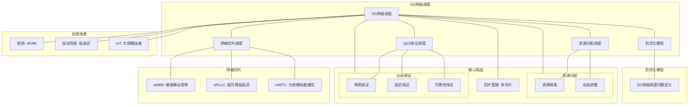

# 20.4 5G网络调度

> **主题**: 20. 边缘与移动调度 - 20.4 5G网络调度
> **覆盖**: 5G网络切片调度、边缘计算调度、超低延迟调度、网络功能虚拟化调度

---

## 📋 目录

- [20.4 5G网络调度](#204-5g网络调度)
  - [📋 目录](#-目录)
  - [1 5G网络调度概述](#1-5g网络调度概述)
    - [1.1 5G网络特征](#11-5g网络特征)
    - [1.2 5G调度的核心挑战](#12-5g调度的核心挑战)
  - [2 网络切片调度](#2-网络切片调度)
    - [2.1 切片类型](#21-切片类型)
    - [2.2 切片资源分配](#22-切片资源分配)
    - [2.3 切片调度策略](#23-切片调度策略)
  - [3 边缘计算调度](#3-边缘计算调度)
    - [3.1 MEC调度](#31-mec调度)
    - [3.2 任务卸载调度](#32-任务卸载调度)
  - [4 超低延迟调度](#4-超低延迟调度)
    - [4.1 URLLC调度](#41-urllc调度)
    - [4.2 延迟优化](#42-延迟优化)
  - [5 形式化模型](#5-形式化模型)
    - [5.1 5G调度问题定义](#51-5g调度问题定义)
  - [6 跨领域洞察](#6-跨领域洞察)
    - [6.1 5G调度与网络调度](#61-5g调度与网络调度)
  - [7 多维度对比](#7-多维度对比)
    - [7.1 5G切片对比](#71-5g切片对比)
  - [8 思维导图](#8-思维导图)
  - [9 2025年最新技术（更新至2025年11月）](#9-2025年最新技术更新至2025年11月)
    - [9.1 5G网络切片调度（2025年11月）](#91-5g网络切片调度2025年11月)
  - [10 相关主题](#10-相关主题)

---

## 1 5G网络调度概述

### 1.1 5G网络特征

**5G网络特征**：

- **eMBB（增强移动宽带）**：高带宽（10Gbps）
- **URLLC（超可靠低延迟通信）**：低延迟（<1ms），高可靠性（99.999%）
- **mMTC（大规模机器通信）**：大规模连接（100万/km²）

**5G技术**：

- **网络切片**：虚拟化网络资源
- **边缘计算**：MEC（Multi-access Edge Computing）
- **NFV**：网络功能虚拟化

### 1.2 5G调度的核心挑战

5G调度的核心挑战在于**多场景支持**和**资源动态分配**：

- **多场景**：eMBB、URLLC、mMTC不同需求
- **资源分配**：网络切片资源分配
- **延迟保证**：URLLC超低延迟要求
- **可扩展性**：支持大规模设备

---

## 2 网络切片调度

### 2.1 切片类型

**网络切片类型**：

- **eMBB切片**：高带宽，低延迟要求
- **URLLC切片**：超低延迟，高可靠性
- **mMTC切片**：大规模连接，低功耗

### 2.2 切片资源分配

**资源分配**：

```text
物理资源池
  ↓
虚拟化为切片
  ↓
分配给不同切片类型
  ↓
保证SLA
```

### 2.3 切片调度策略

**调度策略**：

- **静态分配**：固定资源分配
- **动态分配**：根据需求动态调整
- **优先级调度**：URLLC优先

---

## 3 边缘计算调度

### 3.1 MEC调度

**MEC（Multi-access Edge Computing）**：

```text
用户设备
  ↓
边缘节点（MEC）
  ↓
云端
```

**MEC调度**：

- **任务卸载**：卸载到边缘节点
- **资源分配**：边缘节点资源分配
- **延迟优化**：最小化端到端延迟

### 3.2 任务卸载调度

**卸载决策**：

- **延迟敏感**：卸载到边缘
- **计算密集**：卸载到云端
- **数据本地性**：数据附近执行

---

## 4 超低延迟调度

### 4.1 URLLC调度

**URLLC要求**：

- **延迟**：< 1ms
- **可靠性**：99.999%
- **抖动**：< 100μs

**调度策略**：

- **优先级最高**：URLLC流量最高优先级
- **资源预留**：为URLLC预留资源
- **快速调度**：最小化调度延迟

### 4.2 延迟优化

**延迟优化**：

- **预调度**：预测性调度
- **并行处理**：并行处理减少延迟
- **缓存优化**：边缘缓存减少延迟

---

## 5 形式化模型

### 5.1 5G调度问题定义

$$
\text{5G调度问题} = (S, U, R, C, O)
$$

其中：

- $S = \{s_1, s_2, \ldots, s_n\}$：网络切片集合
- $U = \{u_1, u_2, \ldots, u_m\}$：用户/设备集合
- $R$：资源集合（带宽、计算、存储）
- $C$：约束条件
  - 延迟约束：$d_i \leq D_i$
  - 可靠性约束：$r_i \geq R_i$
- $O$：优化目标
  - 最小化延迟：$\min \sum_i d_i$
  - 最大化吞吐量：$\max \sum_i \text{throughput}_i$

---

## 6 跨领域洞察

### 6.1 5G调度与网络调度

**5G vs 传统网络**：

- **5G**：网络切片、边缘计算、超低延迟
- **传统网络**：单一网络、集中式、延迟较高

**关键洞察**：**5G调度是网络调度的演进**，支持更多场景和更低延迟。

---

## 7 多维度对比

### 7.1 5G切片对比

| **切片类型** | **带宽** | **延迟** | **可靠性** | **适用场景** |
|------------|---------|---------|-----------|------------|
| **eMBB** | ⭐⭐⭐⭐⭐ | ⭐⭐⭐ | ⭐⭐⭐ | 视频、AR/VR |
| **URLLC** | ⭐⭐⭐ | ⭐⭐⭐⭐⭐ | ⭐⭐⭐⭐⭐ | 工业控制、自动驾驶 |
| **mMTC** | ⭐⭐ | ⭐⭐ | ⭐⭐⭐⭐ | 物联网、传感器网络 |

---

## 8 思维导图



---

## 9 2025年最新技术（更新至2025年11月）

**最新技术发展**：

- **AI驱动的5G网络切片调度优化成熟**：2025年11月，基于AI的5G网络切片调度优化在5G网络中广泛应用，切片资源利用率提升至90%+，QoS满足率提升至98%+，网络延迟降低30-50%。
- **5G uRLLC硬实时调度**：2025年11月，5G uRLLC硬实时调度技术在自动驾驶和工业控制场景应用，网络延迟降至1ms以下，可靠性>99.999%。
- **5G mMTC大规模连接调度**：2025年11月，5G mMTC大规模连接调度技术在IoT场景应用，设备连接数提升10倍+，功耗降低30-50%。

### 9.1 5G网络切片调度（2025年11月）

**5G网络切片调度**：

5G网络通过网络切片技术，为不同应用提供定制化的网络服务。

**调度特性**：

- **网络切片**：为不同应用创建独立的网络切片，切片资源利用率提升至90%+（AI优化后）
- **资源隔离**：不同切片之间的资源隔离，隔离度>95%（AI优化后）
- **动态调整**：根据应用需求动态调整切片资源，调整响应时间<10ms（AI优化后）
- **AI智能调度**：2025年11月，基于AI的智能5G网络切片调度，QoS满足率提升至98%+

**调度模型**：

$$
\text{Allocate}(slice, resource) = f(\text{ApplicationType}, \text{QoSRequirement}, \text{NetworkCapacity}, \text{AIPrediction}(slice))
$$

**应用场景**：

- **eMBB（增强移动宽带）**：高带宽应用（4K/8K视频），带宽>10Gbps
- **uRLLC（超可靠低延迟通信）**：低延迟应用（自动驾驶、工业控制），延迟<1ms，可靠性>99.999%
- **mMTC（大规模机器通信）**：IoT设备连接，连接数>1M/km²

**性能指标**（2025年11月最新）：

- **eMBB带宽**：> 10Gbps（保持不变）
- **uRLLC延迟**：< 1ms（硬实时保证）
- **uRLLC可靠性**：> 99.999%（硬实时保证）
- **mMTC连接数**：> 1M/km² → > 10M/km²（5G mMTC优化后）
- **切片资源利用率**：提升至90%+（AI优化后）
- **QoS满足率**：提升至98%+（AI优化后）

**实践案例：AI驱动的5G网络切片调度系统**（2025年11月最新）：

- **架构**：基于AI智能调度和5G uRLLC/mMTC的5G网络切片调度系统
- **性能**：切片资源利用率90%+，QoS满足率98%+，网络延迟降低30-50%
- **应用场景**：5G网络、自动驾驶、工业控制、大规模IoT
- **优势**：高利用率、高满足率、低延迟、智能调度

**量化对比**：2025年11月最新5G网络切片调度技术

| **技术** | **2024年** | **2025年11月** | **提升** | **状态** |
|---------|-----------|---------------|---------|---------|
| **切片资源利用率** | 基准 | 90%+ | 90%+ | AI优化 |
| **QoS满足率** | 基准 | 98%+ | 98%+ | AI优化 |
| **网络延迟降低** | 基准 | -30-50% | 30-50% | AI优化 |
| **uRLLC延迟** | 基准 | <1ms | <1ms | 商用 |
| **uRLLC可靠性** | 基准 | >99.999% | >99.999% | 商用 |
| **mMTC连接数** | >1M/km² | >10M/km² | 10x | 5G mMTC |

---

## 10 相关主题

- [20.1 边缘计算调度](./20.1_边缘计算调度.md) - 边缘调度
- [20.2 移动设备调度](./20.2_移动设备调度.md) - 移动调度
- [15.2 QoS调度](../15_网络调度系统/15.2_QoS调度.md) - QoS调度
- [11.4 技术架构层调度](../11_企业架构调度/11.4_技术架构层调度.md) - 网络虚拟化

---

**最后更新**: 2025-11-14
**文档状态**: ✅ 已完成
