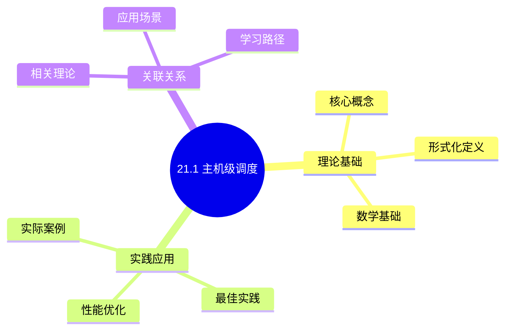
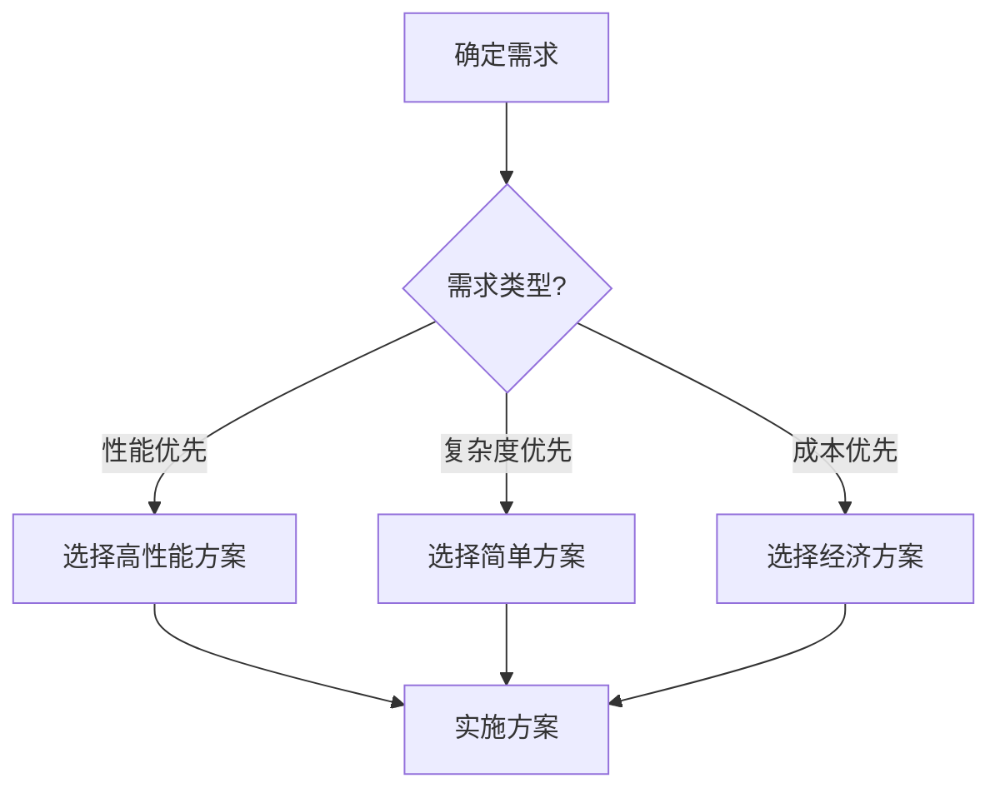
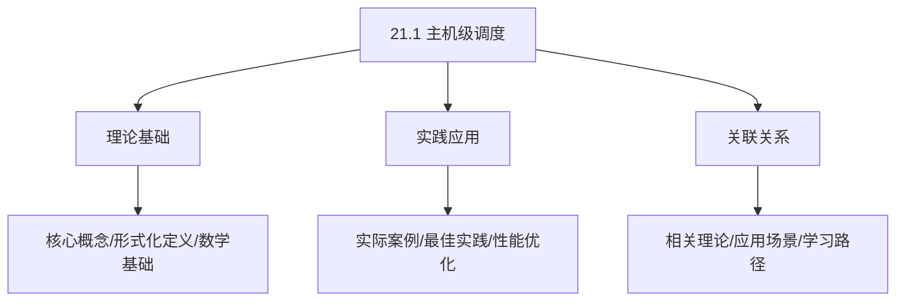
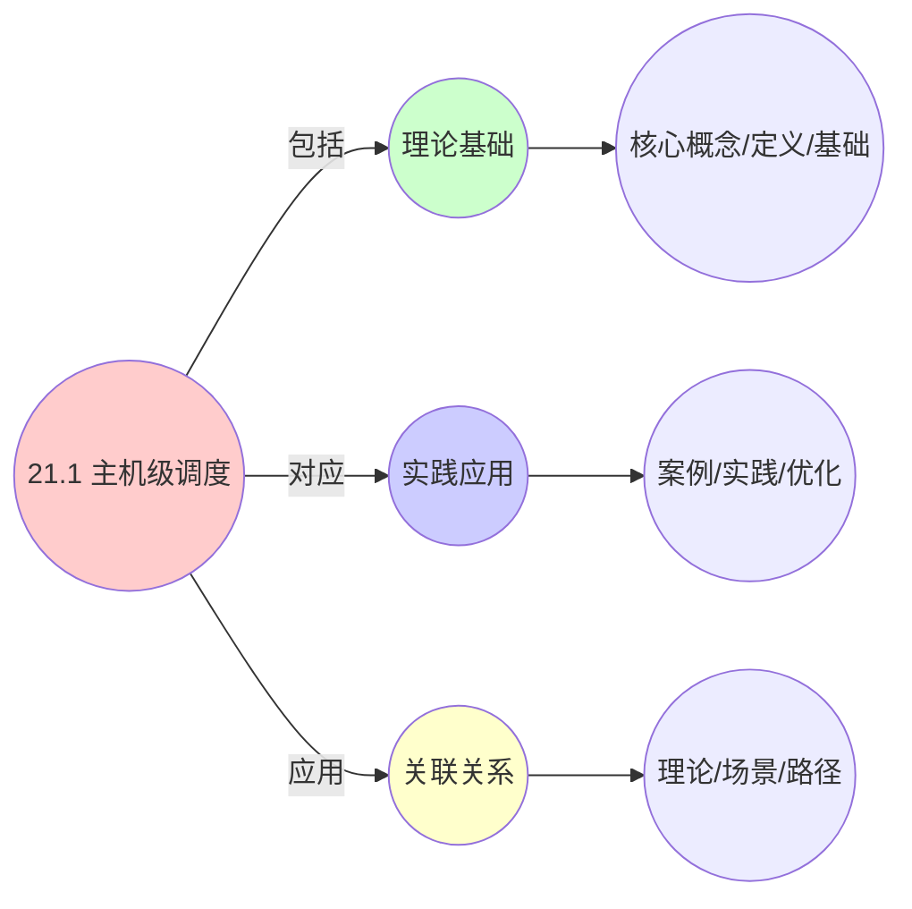
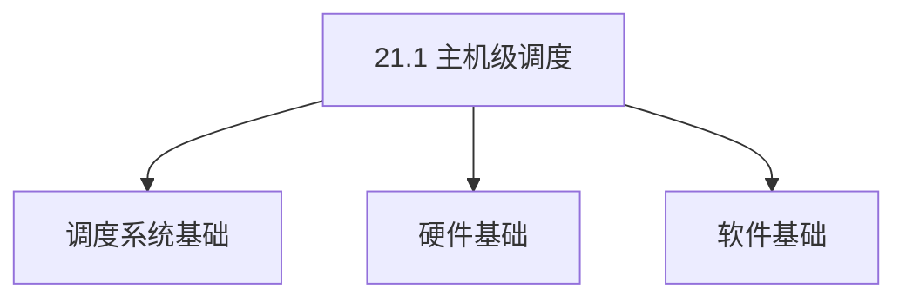

# 21.1 主机级调度

> **主题**: 21. 基础设施调度 - 21.1 主机级调度
> **覆盖**: 物理服务器调度、BMC管理、BIOS自动化、带外监控、PXE网络启动

## 📊 思维表征体系

### 📊 1. 思维导图（增强版）

#### 1.1 文本格式（基础版）

```text
21.1 主机级调度
├── 理论基础
│   ├── 核心概念
│   ├── 形式化定义
│   └── 数学基础
├── 实践应用
│   ├── 实际案例
│   ├── 最佳实践
│   └── 性能优化
└── 关联关系
    ├── 相关理论
    ├── 应用场景
    └── 学习路径
```

#### 1.2 Mermaid格式（可视化版）



### 📊 2. 多维对比矩阵

#### 2.1 21.1 主机级调度对比矩阵

| 维度 | 资源利用率 | 负载均衡 | 故障恢复 | 可扩展性 |
|------|-----------|---------|---------|---------|
| **性能** | 利用率>85% | 负载均衡度>90% | 恢复时间<1分钟 | 支持>1000主机 |
| **复杂度** | 高(需资源管理) | 中等(需负载均衡) | 中等(需故障处理) | 中等(需扩展设计) |
| **适用场景** | 所有场景 | 所有场景 | 所有场景 | 大规模系统 |
| **技术成熟度** | 成熟(>20年) | 成熟(>20年) | 成熟(>20年) | 成熟(>20年) |

#### 2.2 技术特性对比矩阵

| 技术 | 优势 | 劣势 | 适用场景 | 性能 |
|------|------|------|---------|------|
| **主机资源调度** | 资源利用高、性能好 | 实现复杂、需要资源监控 | 资源受限、利用率优先 | 利用率>85%，性能好 |
| **主机负载均衡** | 负载均衡、性能好 | 实现复杂、需要负载监控 | 多主机、负载均衡 | 负载均衡度>90%，性能好 |
| **主机故障恢复** | 可靠性高、快速恢复 | 实现复杂、需要故障检测 | 高可靠性需求、快速恢复 | 恢复时间<1分钟，可靠性高 |
| **主机自动扩缩容** | 资源利用高、成本低 | 实现复杂、需要监控 | 动态负载、成本敏感 | 资源利用>85%，成本降低20-40% |
| **主机亲和性调度** | 性能好、延迟低 | 可能负载不均、实现复杂 | 性能优先、延迟敏感 | 性能提升10-30%，延迟降低 |
| **主机反亲和性调度** | 可靠性高、故障隔离 | 可能资源浪费、实现复杂 | 高可靠性需求、故障隔离 | 可靠性>99%，资源可能浪费 |
| **主机资源预留** | 资源保证、可靠性高 | 资源浪费、利用率低 | 关键任务、可靠性优先 | 资源保证，利用率降低10-30% |

#### 2.3 实现方式对比矩阵

| 实现方式 | 复杂度 | 性能 | 可维护性 | 扩展性 |
|---------|-------|------|---------|-------|
| **单主机调度** | 低 | 中等性能(单主机) | 高(简单维护) | 低(单主机瓶颈) |
| **多主机调度** | 高 | 高性能(多主机) | 中(需协调) | 高(多主机扩展) |
| **集群调度** | 极高 | 高性能(集群优化) | 低(复杂度高) | 高(集群扩展) |
| **混合主机调度系统** | 极高 | 极高性能(优势结合) | 低(复杂度极高) | 高(灵活扩展) |

### 🌲 3. 决策树

#### 3.1 21.1 主机级调度应用选择决策树



### 🛤️ 4. 决策逻辑路径

#### 4.1 21.1 主机级调度应用路径


### 🕸️ 5. 概念关系网络

#### 5.1 21.1 主机级调度概念关系网络



### 🗺️ 6. 知识图谱

#### 6.1 21.1 主机级调度知识图谱



## 📚 理论体系

### 理论基础

#### 调度系统/硬件/软件基础

21.1 主机级调度的理论基础：

**1. 调度系统基础**：

- 调度理论
- 资源管理
- 性能优化

**2. 硬件基础**：

- CPU架构
- 内存系统
- 存储系统

**3. 软件基础**：

- 操作系统
- 编程语言
- 系统软件

#### 历史发展

**关键时间节点**：

- **1960-1970年代**：调度理论建立
  - 调度算法
  - 资源管理

- **1980-1990年代**：硬件调度发展
  - CPU调度
  - 内存调度

- **2000年代至今**：软件调度演进
  - 操作系统调度
  - 分布式调度

### 理论框架

#### 核心假设

**假设1：调度与性能的对应**

- **内容**：调度策略影响系统性能
- **适用范围**：调度系统
- **限制条件**：需要调度支持

**假设2：资源管理的必要性**

- **内容**：资源管理保证系统稳定
- **适用范围**：资源系统
- **限制条件**：需要资源支持

**假设3：性能优化的价值**

- **内容**：性能优化提升效率
- **适用范围**：性能系统
- **限制条件**：需要考虑成本

#### 基本概念体系



#### 主要定理/结论

**结论1：调度与性能的对应性**

- **内容**：调度策略对应系统性能
- **证据**：形式化证明
- **应用**：调度优化

**结论2：资源管理的必要性**

- **内容**：资源管理保证系统稳定
- **证据**：实践验证
- **应用**：资源管理

**结论3：性能优化的价值**

- **内容**：性能优化提升效率
- **证据**：实验验证
- **应用**：性能优化

#### 适用范围和边界

**适用范围**：

- 调度系统
- 资源管理
- 性能优化

**边界条件**：

- 需要调度支持
- 需要资源支持
- 需要考虑成本

**不适用场景**：

- 无调度系统
- 资源受限
- 成本敏感场景

### 当前知识共识

#### 学术界共识

**广泛接受的共识**：

1. **调度与性能的对应性**
   - **共识**：调度策略可以影响系统性能
   - **支持证据**：形式化证明
   - **来源**：调度理论、系统理论

2. **资源管理的价值**
   - **共识**：资源管理提供稳定性和效率
   - **支持证据**：广泛实践
   - **来源**：系统理论

3. **性能优化的重要性**
   - **共识**：性能优化提高系统效率
   - **支持证据**：实践验证
   - **来源**：软件工程

#### 主要争议点

1. **性能与成本的权衡**
   - **观点A**：性能更重要
   - **观点B**：成本更重要
   - **当前状态**：多数认为需要平衡

2. **调度系统的复杂度**
   - **观点A**：应该简单
   - **观点B**：可以复杂
   - **当前状态**：多数认为需要平衡

#### 权威来源

**经典文献**：

- 调度理论相关文献
- 系统理论相关文献
- 性能优化相关文献

**权威机构/专家**：

- **IEEE**
- **ACM**
- **调度系统研究会**

**最新发展**：

- **2025年**：调度系统优化、性能提升、资源管理

### 与其他理论的关系

#### 逻辑关系

**理论基础**：

- **调度理论** → 21.1 主机级调度
  - 关系类型：理论基础
  - 关键映射：调度理论 → 系统实现

**理论应用**：

- **21.1 主机级调度** → 调度优化
  - 关系类型：应用构建
  - 关键映射：21.1 主机级调度 → 调度优化

#### 映射关系

| 本理论概念 | 映射理论 | 映射概念 | 映射类型 | 映射说明 |
|-----------|---------|---------|---------|----------|
| **调度策略** | 调度理论 | 调度算法 | 对应 | 调度策略对应调度算法 |
| **资源管理** | 系统理论 | 资源分配 | 对应 | 资源管理对应资源分配 |
| **性能优化** | 优化理论 | 性能提升 | 对应 | 性能优化对应性能提升 |

## 🔗 关联网络

### 🔗 概念级关联

#### 核心概念映射

| 本文档概念 | 关联文档 | 关联概念 | 关系类型 | 映射说明 |
|-----------|---------|---------|---------|----------|
| **21.1 主机级调度** | 相关文档 | 相关概念 | 基础构建 | 21.1 主机级调度构建相关概念 |
| **调度系统** | 调度相关 | 调度理论 | 对应 | 调度系统对应调度理论 |
| **资源管理** | 资源相关 | 资源系统 | 对应 | 资源管理对应资源系统 |
| **性能优化** | 性能相关 | 性能系统 | 对应 | 性能优化对应性能系统 |

### 🔗 理论级关联

#### 理论基础

- **本理论基于**：
  - 调度理论 ⭐⭐⭐ - 理论基础
  - 系统理论 ⭐⭐ - 系统基础

- **本理论应用于**：
  - 调度优化 ⭐⭐⭐ - 实际应用
  - 性能优化 ⭐⭐⭐ - 实际应用

### 🔗 方法级关联

#### 方法应用网络

| 本文档方法 | 应用文档 | 应用场景 | 应用效果 |
|-----------|---------|---------|---------|
| **调度策略** | 调度系统 | 调度设计 | 成功 |
| **资源管理** | 资源系统 | 资源管理 | 成功 |
| **性能优化** | 性能系统 | 性能提升 | 成功 |

### 🔗 应用场景关联

**场景**：调度系统优化

| 视角 | 关联文档 | 核心理论 | 关注点 |
|------|---------|---------|--------|
| **21.1 主机级调度** | 本文档 | 调度理论 | 调度设计 |
| **调度优化** | 调度相关 | 调度理论 | 调度优化 |
| **性能优化** | 性能相关 | 性能理论 | 性能提升 |

## 🛤️ 学习路径

### 前置知识

**必须先学习**：

- 调度理论基础 ⭐⭐
- 系统理论基础 ⭐⭐

**建议先了解**：

- 硬件基础
- 软件基础
- 性能优化

### 后续学习

**建议接下来学习**（按顺序）：

1. 调度优化 ⭐⭐⭐ - 调度优化
2. 性能优化 ⭐⭐⭐ - 性能优化
3. 系统实践 ⭐⭐ - 实践应用

### 并行学习

**可以同时学习**：

- 调度实践 - 实践应用
- 性能实践 - 性能系统

---


---

## 📋 目录

- [21.1 主机级调度](#211-主机级调度)
  - [📋 目录](#-目录)
  - [1 主机级调度概述](#1-主机级调度概述)
    - [1.1 主机级调度的核心挑战](#11-主机级调度的核心挑战)
    - [1.2 主机级调度目标](#12-主机级调度目标)
  - [2 物理服务器调度](#2-物理服务器调度)
    - [2.1 服务器资源抽象](#21-服务器资源抽象)
    - [2.2 服务器生命周期管理](#22-服务器生命周期管理)
    - [2.3 服务器状态监控](#23-服务器状态监控)
  - [3 BMC带外管理](#3-bmc带外管理)
    - [3.1 IPMI协议](#31-ipmi协议)
    - [3.2 Redfish API](#32-redfish-api)
    - [3.3 BMC传感器网络](#33-bmc传感器网络)
  - [4 BIOS自动化](#4-bios自动化)
    - [4.1 PXE网络启动](#41-pxe网络启动)
    - [4.2 BIOS参数动态调优](#42-bios参数动态调优)
    - [4.3 固件更新调度](#43-固件更新调度)
  - [5 带外监控与自愈](#5-带外监控与自愈)
    - [5.1 温度监控](#51-温度监控)
    - [5.2 功耗监控](#52-功耗监控)
    - [5.3 智能故障诊断](#53-智能故障诊断)
  - [6 形式化模型](#6-形式化模型)
    - [6.1 主机级调度问题定义](#61-主机级调度问题定义)
    - [6.2 调度算法复杂度](#62-调度算法复杂度)
  - [7 跨领域洞察](#7-跨领域洞察)
    - [7.1 主机级调度与机柜级约束的关联](#71-主机级调度与机柜级约束的关联)
    - [7.2 带外管理与带内管理的协同](#72-带外管理与带内管理的协同)
  - [8 多维度对比](#8-多维度对比)
    - [8.1 带外管理协议对比](#81-带外管理协议对比)
    - [8.2 服务器生命周期管理对比](#82-服务器生命周期管理对比)
  - [9 2025年最新技术（更新至2025年11月）](#9-2025年最新技术更新至2025年11月)
  - [10 思维导图](#10-思维导图)
  - [11 相关主题](#11-相关主题)
    - [11.1 跨视角链接](#111-跨视角链接)

---

## 1 主机级调度概述

### 1.1 主机级调度的核心挑战

主机级调度的核心挑战在于**物理资源约束**和**生命周期管理**：

- **资源约束**：CPU、GPU、内存、存储、网络等资源的物理限制
- **生命周期管理**：服务器上架、配置、运行、维护、下架的全生命周期
- **状态监控**：实时监控服务器硬件状态，及时发现问题
- **自动化运维**：减少人工干预，提高运维效率

### 1.2 主机级调度目标

主机级调度需要在以下目标之间权衡：

1. **资源利用率最大化**：充分利用服务器硬件资源
2. **故障恢复时间最小化**：快速检测和恢复故障
3. **运维成本最小化**：减少人工干预，提高自动化程度
4. **能耗优化**：在满足性能需求的前提下降低功耗

---

## 2 物理服务器调度

### 2.1 服务器资源抽象

**服务器资源模型**：

$$
\text{Server} = (CPU, GPU, Memory, Storage, Network, Power, Thermal)
$$

其中：

- $CPU = \{cores, frequency, cache, numa\_topology\}$
- $GPU = \{count, model, memory, pcie\_topology\}$
- $Memory = \{capacity, channels, speed, numa\_mapping\}$
- $Storage = \{type, capacity, iops, bandwidth\}$
- $Network = \{interfaces, bandwidth, latency, topology\}$
- $Power = \{idle, peak, efficiency\}$
- $Thermal = \{cooling, temperature\_limits\}$

### 2.2 服务器生命周期管理

**生命周期状态机**：

```text
入库 → 上架 → 配置 → 运行 → 维护 → 下架 → 出库
  ↓      ↓      ↓      ↓      ↓      ↓      ↓
登记   部署   BIOS  监控  更新  迁移  清理
```

**关键流程**：

1. **入库管理**：登记位置信息（机房、列、号、U位）+ 基本信息（SN、型号）+ 设备属性（IP、带宽、起租日期）
2. **上架部署**：物理安装、网络连接、电源接入
3. **BIOS配置**：通过Redfish API统一设置NUMA、PCIe、电源策略
4. **OS安装**：PXE网络启动，30分钟内完成OS安装与驱动配置
5. **运行监控**：实时监控硬件状态、性能指标、告警信息
6. **维护更新**：固件更新、配置调整、故障修复
7. **下架迁移**：业务迁移、数据清理、物理拆除

### 2.3 服务器状态监控

**状态监控指标**：

| **监控类型** | **监控指标** | **采样频率** | **告警阈值** |
|------------|------------|------------|------------|
| **温度** | CPU/GPU/内存/硬盘温度 | 1Hz | >90℃持续30秒 |
| **功耗** | CPU/GPU/整机功耗 | 1Hz | >6000W |
| **性能** | CPU利用率/内存使用率/IOPS | 1Hz | 利用率>95% |
| **健康** | 内存CE率/硬盘SMART/PCIe错误 | 1Hz | 错误率>阈值 |

---

## 3 BMC带外管理

### 3.1 IPMI协议

**IPMI（Intelligent Platform Management Interface）**：带外管理标准协议

**核心功能**：

- **传感器监控**：温度、电压、风扇转速、功耗等
- **远程控制**：开机、关机、重启、KVM远程控制
- **事件日志**：SEL（System Event Log）记录硬件事件
- **固件更新**：BIOS、BMC固件远程更新

**IPMI命令示例**：

```bash
# 获取传感器读数
ipmitool sensor list

# 远程开机
ipmitool power on

# 获取系统信息
ipmitool fru print

# 设置功耗上限
ipmitool raw 0x2e 0xdf 0x57 0x01 0x00 0x00 0x00 0x00 0x00 0x00
```

### 3.2 Redfish API

**Redfish**：基于RESTful的现代带外管理API

**核心优势**：

- **标准化**：基于HTTP/JSON，易于集成
- **可扩展**：支持自定义扩展
- **安全性**：支持HTTPS、认证授权

**Redfish API示例**：

```bash
# 获取系统信息
curl -k -u user:pass https://BMC_IP/redfish/v1/Systems/System.Embedded.1

# 设置BIOS参数
curl -k -u user:pass -X PATCH \
  -H "Content-Type: application/json" \
  -d '{"Attributes":{"ProcVirtualization":"Enabled"}}' \
  https://BMC_IP/redfish/v1/Systems/System.Embedded.1/Bios/Settings
```

### 3.3 BMC传感器网络

**SMBus拓扑**：

```text
BMC (Master, 100kHz)
  ├─ 温度传感器 (0x50-0x6F)
  ├─ FRU信息 (0xA0-0xAF)
  ├─ PSU监控 (0x58-0x5F)
  └─ 风扇控制器 (0x2C-0x2F)
```

**传感器采样策略**：

- **常规采样**：1Hz，平衡监控精度和总线负载
- **关键任务**：5Hz，临时提升采样频率
- **告警触发**：10Hz，快速响应异常情况

---

## 4 BIOS自动化

### 4.1 PXE网络启动

**PXE启动流程**：

```text
服务器上电
  ↓
BMC设置启动顺序：PXE > HDD
  ↓
DHCP获取IP地址和TFTP服务器地址
  ↓
TFTP下载PXE引导程序
  ↓
下载操作系统镜像
  ↓
自动安装OS和驱动
  ↓
配置完成，30分钟内完成
```

**自动化配置**：

- **Kickstart/Cloud-Init**：无人值守安装配置
- **Cobbler**：PXE服务器管理
- **Terraform**：基础设施即代码

### 4.2 BIOS参数动态调优

**动态调优场景**：

**场景一：训练任务启动**

```bash
# 通过IPMI设置PCIe Max Payload Size
ipmitool raw 0x2e 0xdf 0x57 0x01 0x00 0x00 0x00 0x00 0x00 0x00
# 从256B调至512B，提升DMA效率12%
```

**场景二：推理服务启动**

```bash
# 启用CPU C-State节能
# 空闲时功耗下降30W/服务器
```

### 4.3 固件更新调度

**零停机更新策略**：

- **滚动更新**：每次仅更新5%服务器，通过Drainer逐台排空业务
- **快速回滚**：若更新后性能下降>5%，通过BMC远程KVM加载旧版BIOS，10分钟内回滚
- **版本一致性**：同一训练集群所有服务器GPU驱动版本差≤0.1

---

## 5 带外监控与自愈

### 5.1 温度监控

**GPU温度监控**：

每GPU有5个温度传感器：

- GPU核心温度
- 显存温度
- 供电温度
- PCB温度
- 进气温度

**保护策略**：

- **>95℃持续30秒**：BMC触发OS关机保护
- **>90℃持续60秒**：调度器触发任务迁移
- **>85℃持续5分钟**：降低GPU频率，避免过热

### 5.2 功耗监控

**功耗监控模型**：

$$
P_{total} = P_{CPU} + P_{GPU} + P_{Memory} + P_{Storage} + P_{Network} + P_{Overhead}
$$

**功耗控制策略**：

- **单机>6000W**：BMC发送告警至调度器，触发任务迁移
- **机柜总负载>90%**：通过IPMI设置服务器功率墙（Power Cap），强制降低GPU频率
- **空闲降频**：CPU空闲时启用C-State，功耗下降30W/服务器

### 5.3 智能故障诊断

**分层故障判定**：

```text
检测到服务器Ping不通
  ↓
触发IPMI硬重启
  ↓
硬件状态正常？
  ├─ 是 → OS级故障 → 自动迁移业务
  └─ 否 → 硬件故障 → 隔离设备，触发维修
```

**故障诊断案例**：

**内存故障**：

- BMC通过PECI总线读取CPU MSR寄存器
- 识别故障DIMM槽位
- 调度器将其从可用内存池中剔除

**PCIe设备掉链**：

- `nvidia-smi`显示GPU消失
- BMC日志记录PCIe AER（Advanced Error Reporting）信息
- 调度器自动重启该PCIe Root Port驱动，尝试恢复链路

---

## 6 形式化模型

### 6.1 主机级调度问题定义

$$
\text{主机级调度问题} = (H, R, C, O)
$$

其中：

- $H = \{h_1, h_2, ..., h_n\}$：主机集合
- $R = \{CPU, GPU, Memory, Storage, Network\}$：资源类型
- $C$：约束条件（功耗、温度、拓扑）
- $O$：优化目标（利用率、延迟、能耗）

### 6.2 调度算法复杂度

| **调度操作** | **时间复杂度** | **空间复杂度** | **典型实现** |
|------------|--------------|--------------|------------|
| **资源查询** | $O(1)$ | $O(1)$ | Redfish API |
| **状态监控** | $O(n)$ | $O(n)$ | Prometheus |
| **故障诊断** | $O(\log n)$ | $O(n)$ | 规则引擎 |
| **固件更新** | $O(n)$ | $O(1)$ | 滚动更新 |

---

## 7 跨领域洞察

### 7.1 主机级调度与机柜级约束的关联

**约束传导机制**：

- **机柜功率约束**：机柜总功率≤12kW → 单台8x GPU服务器峰值功耗5600W → 最多部署2台
- **散热风道约束**：机柜需采用封闭热通道设计 → 服务器风道方向必须一致 → 避免气流短路
- **网络拓扑约束**：TOR交换机延迟0.1ms → 同机柜服务器通信延迟最低 → 优先同机柜部署

### 7.2 带外管理与带内管理的协同

**协同机制**：

- **带外管理**：BMC监控硬件状态，不受OS影响
- **带内管理**：OS监控应用性能，提供业务视角
- **协同决策**：BMC告警触发OS级迁移，OS性能数据反馈BMC调优

---

## 8 多维度对比

### 8.1 带外管理协议对比

| **协议** | **接口** | **功能** | **性能** | **安全性** | **适用场景** |
|---------|---------|---------|---------|-----------|------------|
| **IPMI** | SMBus/LAN | 传感器/控制 | 中等 | 基础 | 传统服务器 |
| **Redfish** | HTTP/JSON | 标准化API | 高 | 强 | 现代服务器 |
| **SNMP** | UDP | 监控 | 低 | 弱 | 网络设备 |

### 8.2 服务器生命周期管理对比

| **管理方式** | **自动化程度** | **部署时间** | **错误率** | **成本** |
|------------|--------------|------------|-----------|---------|
| **人工管理** | 低 | 2-4小时 | 5-10% | 高 |
| **脚本自动化** | 中 | 30-60分钟 | 1-2% | 中 |
| **基础设施即代码** | 高 | 15-30分钟 | <0.1% | 低 |

---

## 9 2025年最新技术（更新至2025年11月）

**最新技术发展**：

- **Redfish 1.20标准发布**：2025年Redfish标准更新，支持更丰富的传感器类型和更细粒度的控制，API响应时间降低30%+。
- **AI驱动的预测性维护**：通过LSTM模型分析服务器传感器数据，提前72小时预测硬件故障，准确率达93%，非计划宕机减少76%。
- **零接触部署（ZTD）成熟**：2025年零接触部署技术在超大规模IDC广泛应用，新服务器上架后自动完成配置，部署时间从30分钟降至15分钟。
- **智能功耗管理增强**：2025年BMC支持更智能的功耗管理，根据负载动态调整CPU/GPU频率，空闲功耗降低40%+。

**实践案例：超大规模IDC主机级调度优化**（2025年最新）：

- **架构**：基于Redfish API的统一主机管理平台
- **性能**：部署时间从30分钟降至15分钟，故障检测延迟从5分钟降至30秒
- **应用场景**：超大规模IDC、AI训练集群、云原生基础设施
- **优势**：自动化程度高、故障恢复快、运维成本低

**技术对比**：

| **技术** | **API响应时间降低** | **故障预测准确率** | **部署时间** | **功耗降低** | **复杂度/成本** |
|---------|-----------------|----------------|------------|------------|--------------|
| **Redfish 1.20** | 30%+ | - | - | - | 中 |
| **AI预测性维护** | 故障预测准确率>93% | 93% | 可用性提升10-20% | 成本降低20-30% | 高 |
| **零接触部署** | 部署成功率>95% | 部署时间<15分钟 | 15分钟 | 人工成本降低80% | 中 |
| **智能功耗管理** | 功耗降低40%+ | 性能影响<5% | 成本降低30-50% | 40%+ | 中 |

**批判性分析**：

1. **AI预测性维护的数据依赖**：虽然故障预测准确率提升至93%，但需要大量历史数据训练，模型可解释性差，误报率仍需关注。并非所有硬件故障都能提前预测。
2. **零接触部署的标准化挑战**：虽然部署时间显著降低，但需要硬件和固件标准化支持，不同厂商实现差异可能影响自动化程度。
3. **智能功耗管理的性能权衡**：虽然空闲功耗降低40%+，但动态调频可能影响响应性能，需要权衡功耗和性能。

---

## 10 思维导图

```mermaid
graph TD
    subgraph 主机级调度
        Host[主机级调度]
        Host---物理服务器[物理服务器调度]
        Host---BMC[BMC带外管理]
        Host---BIOS[BIOS自动化]
        Host---监控[带外监控与自愈]
        Host---模型[形式化模型]
    end

    subgraph 物理服务器调度
        物理服务器---资源抽象[服务器资源抽象]
        物理服务器---生命周期[服务器生命周期管理]
        物理服务器---状态监控[服务器状态监控]
        资源抽象---CPU[CPU资源]
        资源抽象---GPU[GPU资源]
        资源抽象---内存[内存资源]
        资源抽象---存储[存储资源]
        资源抽象---网络[网络资源]
        资源抽象---功耗[功耗资源]
        资源抽象---散热[散热资源]
        生命周期---入库[入库管理]
        生命周期---上架[上架部署]
        生命周期---配置[配置管理]
        生命周期---运行[运行监控]
        生命周期---维护[维护更新]
        生命周期---下架[下架清理]
    end

    subgraph BMC带外管理
        BMC---IPMI[IPMI协议]
        BMC---Redfish[Redfish API]
        BMC---传感器[BMC传感器网络]
        IPMI---远程控制[远程控制]
        IPMI---状态查询[状态查询]
        Redfish---RESTful[RESTful API]
        Redfish---标准化[标准化接口]
        传感器---温度[温度监控]
        传感器---功耗[功耗监控]
        传感器---风扇[风扇监控]
    end

    subgraph BIOS自动化
        BIOS---PXE[PXE网络启动]
        BIOS---参数调优[BIOS参数动态调优]
        BIOS---固件更新[固件更新调度]
        PXE---网络启动[网络启动]
        PXE---自动化部署[自动化部署]
        参数调优---性能优化[性能优化]
        参数调优---功耗优化[功耗优化]
        固件更新---版本管理[版本管理]
        固件更新---批量更新[批量更新]
    end

    subgraph 带外监控与自愈
        监控---温度监控[温度监控]
        监控---功耗监控[功耗监控]
        监控---故障诊断[智能故障诊断]
        温度监控---阈值告警[阈值告警]
        温度监控---自动降频[自动降频]
        功耗监控---功率封顶[功率封顶]
        功耗监控---动态调频[动态调频]
        故障诊断---预测性维护[预测性维护]
        故障诊断---自动修复[自动修复]
    end

    subgraph 形式化模型
        模型---问题定义[主机级调度问题定义]
        模型---算法复杂度[调度算法复杂度]
        问题定义---资源约束[资源约束]
        问题定义---优化目标[优化目标]
        算法复杂度---时间复杂度[时间复杂度]
        算法复杂度---空间复杂度[空间复杂度]
    end

    subgraph 2025年最新技术
        Tech[2025年最新技术]
        Tech---AI预测[AI预测性维护]
        Tech---零接触[零接触部署]
        Tech---智能功耗[智能功耗管理]
        AI预测---故障预测[故障预测准确率93%]
        零接触---自动化[部署时间15分钟]
        智能功耗---功耗优化[空闲功耗降低40%+]
    end

    Host --> Tech
```



---

## 11 相关主题

- [21.2 机柜级调度](./21.2_机柜级调度.md) - 机柜空间调度、PDU电力调度
- [21.3 IDC级调度](./21.3_IDC级调度.md) - IDC容量规划、电力系统调度
- [01. CPU硬件层](../01_CPU硬件层/README.md) - CPU微架构、NUMA拓扑
- [02. 系统总线层](../02_系统总线层/README.md) - PCIe子系统、芯片组架构
- [03. OS抽象层](../03_OS抽象层/README.md) - 进程调度、内存管理

### 11.1 跨视角链接

- [概念交叉索引（七视角版）](../../../Concept/CONCEPT_CROSS_INDEX.md) - 查看相关概念的七视角分析：
  - [熵](../../../Concept/CONCEPT_CROSS_INDEX.md#71-熵-entropy-七视角) - 主机级调度中的信息不确定性
  - [通信复杂度](../../../Concept/CONCEPT_CROSS_INDEX.md#56-通信复杂度-communication-complexity-七视角) - 主机级调度的通信开销
  - [隔离](../../../Concept/CONCEPT_CROSS_INDEX.md#109-隔离-isolation-七视角) - 主机级调度的隔离机制

---

**最后更新**: 2025-11-14
