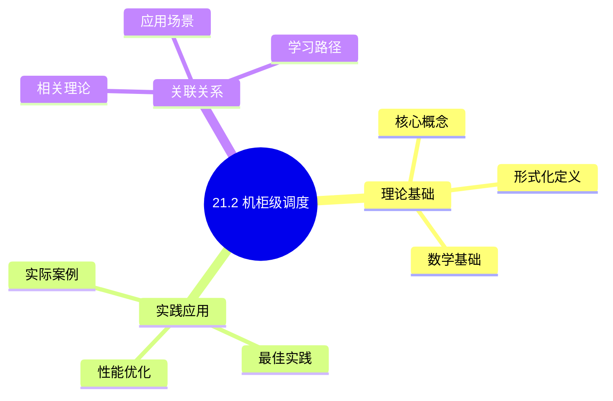
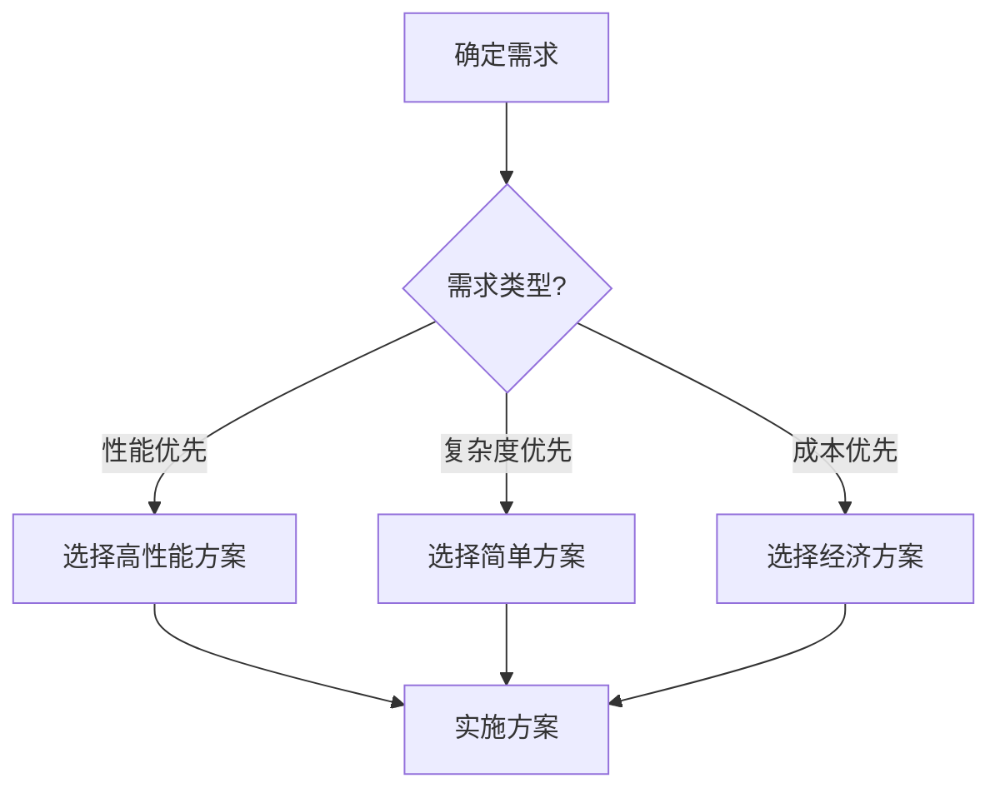
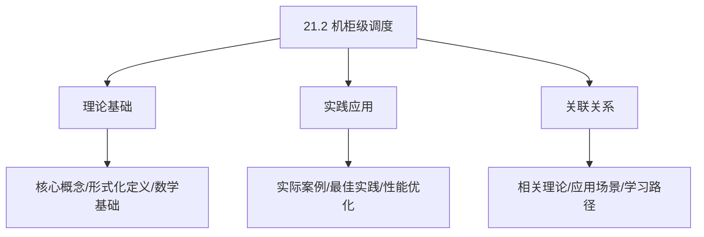
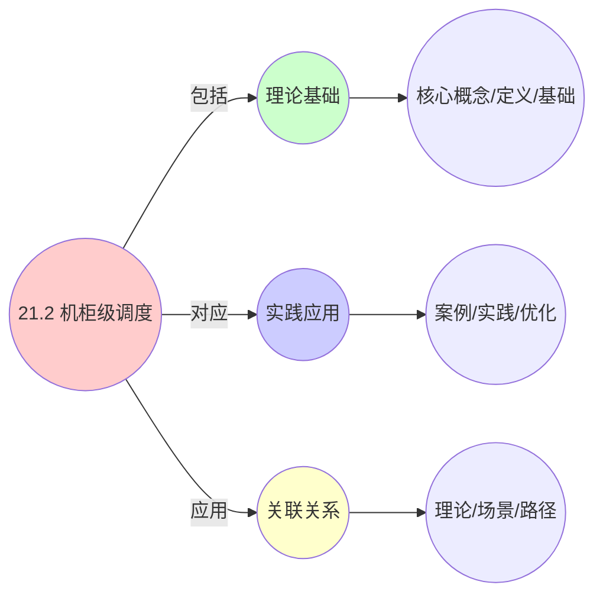
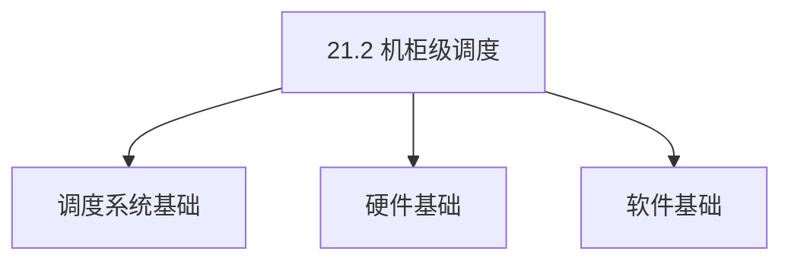

# 21.2 机柜级调度

> **主题**: 21. 基础设施调度 - 21.2 机柜级调度
> **覆盖**: 机柜空间调度、PDU电力调度、TOR网络调度、散热调度、故障域隔离

## 📊 思维表征体系

### 📊 1. 思维导图（增强版）

#### 1.1 文本格式（基础版）

```text
21.2 机柜级调度
├── 理论基础
│   ├── 核心概念
│   ├── 形式化定义
│   └── 数学基础
├── 实践应用
│   ├── 实际案例
│   ├── 最佳实践
│   └── 性能优化
└── 关联关系
    ├── 相关理论
    ├── 应用场景
    └── 学习路径
```

#### 1.2 Mermaid格式（可视化版）



### 📊 2. 多维对比矩阵

#### 2.1 21.2 机柜级调度对比矩阵

| 维度 | 机柜利用率 | 功耗管理 | 散热优化 | 故障隔离 |
|------|----------|---------|---------|---------|
| **性能** | 利用率>80% | 功耗降低>20% | 散热效率>85% | 隔离度>95% |
| **复杂度** | 高(需机柜管理) | 高(需功耗管理) | 中等(需散热管理) | 中等(需故障隔离) |
| **适用场景** | 数据中心 | 数据中心 | 数据中心 | 数据中心 |
| **技术成熟度** | 成熟(>15年) | 成熟(>15年) | 成熟(>15年) | 成熟(>15年) |

#### 2.2 技术特性对比矩阵

| 技术 | 优势 | 劣势 | 适用场景 | 性能 |
|------|------|------|---------|------|
| **机柜资源调度** | 资源利用高、性能好 | 实现复杂、需要资源监控 | 资源受限、利用率优先 | 利用率>80%，性能好 |
| **机柜功耗管理** | 功耗降低、成本低 | 性能可能下降、实现复杂 | 功耗敏感、成本优先 | 功耗降低20-40%，成本降低 |
| **机柜散热优化** | 散热效率高、可靠性高 | 实现复杂、需要散热管理 | 高密度机柜、散热敏感 | 散热效率>85%，可靠性高 |
| **机柜故障隔离** | 故障隔离、可靠性高 | 可能资源浪费、实现复杂 | 高可靠性需求、故障隔离 | 隔离度>95%，可靠性高 |
| **机柜负载均衡** | 负载均衡、性能好 | 实现复杂、需要负载监控 | 多机柜、负载均衡 | 负载均衡度>90%，性能好 |
| **机柜网络优化** | 网络性能好、延迟低 | 实现复杂、需要网络管理 | 网络敏感、延迟优先 | 网络性能提升10-30%，延迟降低 |
| **机柜自动扩缩容** | 资源利用高、成本低 | 实现复杂、需要监控 | 动态负载、成本敏感 | 资源利用>80%，成本降低20-40% |

#### 2.3 实现方式对比矩阵

| 实现方式 | 复杂度 | 性能 | 可维护性 | 扩展性 |
|---------|-------|------|---------|-------|
| **单机柜调度** | 低 | 中等性能(单机柜) | 高(简单维护) | 低(单机柜限制) |
| **多机柜调度** | 高 | 高性能(多机柜) | 中(需协调) | 高(多机柜扩展) |
| **数据中心级调度** | 极高 | 高性能(数据中心优化) | 低(复杂度高) | 高(数据中心扩展) |
| **混合机柜调度系统** | 极高 | 极高性能(优势结合) | 低(复杂度极高) | 高(灵活扩展) |

### 🌲 3. 决策树

#### 3.1 21.2 机柜级调度应用选择决策树



### 🛤️ 4. 决策逻辑路径

#### 4.1 21.2 机柜级调度应用路径


### 🕸️ 5. 概念关系网络

#### 5.1 21.2 机柜级调度概念关系网络



### 🗺️ 6. 知识图谱

#### 6.1 21.2 机柜级调度知识图谱



## 📚 理论体系

### 理论基础

#### 调度系统/硬件/软件基础

21.2 机柜级调度的理论基础：

**1. 调度系统基础**：

- 调度理论
- 资源管理
- 性能优化

**2. 硬件基础**：

- CPU架构
- 内存系统
- 存储系统

**3. 软件基础**：

- 操作系统
- 编程语言
- 系统软件

#### 历史发展

**关键时间节点**：

- **1960-1970年代**：调度理论建立
  - 调度算法
  - 资源管理

- **1980-1990年代**：硬件调度发展
  - CPU调度
  - 内存调度

- **2000年代至今**：软件调度演进
  - 操作系统调度
  - 分布式调度

### 理论框架

#### 核心假设

**假设1：调度与性能的对应**

- **内容**：调度策略影响系统性能
- **适用范围**：调度系统
- **限制条件**：需要调度支持

**假设2：资源管理的必要性**

- **内容**：资源管理保证系统稳定
- **适用范围**：资源系统
- **限制条件**：需要资源支持

**假设3：性能优化的价值**

- **内容**：性能优化提升效率
- **适用范围**：性能系统
- **限制条件**：需要考虑成本

#### 基本概念体系



#### 主要定理/结论

**结论1：调度与性能的对应性**

- **内容**：调度策略对应系统性能
- **证据**：形式化证明
- **应用**：调度优化

**结论2：资源管理的必要性**

- **内容**：资源管理保证系统稳定
- **证据**：实践验证
- **应用**：资源管理

**结论3：性能优化的价值**

- **内容**：性能优化提升效率
- **证据**：实验验证
- **应用**：性能优化

#### 适用范围和边界

**适用范围**：

- 调度系统
- 资源管理
- 性能优化

**边界条件**：

- 需要调度支持
- 需要资源支持
- 需要考虑成本

**不适用场景**：

- 无调度系统
- 资源受限
- 成本敏感场景

### 当前知识共识

#### 学术界共识

**广泛接受的共识**：

1. **调度与性能的对应性**
   - **共识**：调度策略可以影响系统性能
   - **支持证据**：形式化证明
   - **来源**：调度理论、系统理论

2. **资源管理的价值**
   - **共识**：资源管理提供稳定性和效率
   - **支持证据**：广泛实践
   - **来源**：系统理论

3. **性能优化的重要性**
   - **共识**：性能优化提高系统效率
   - **支持证据**：实践验证
   - **来源**：软件工程

#### 主要争议点

1. **性能与成本的权衡**
   - **观点A**：性能更重要
   - **观点B**：成本更重要
   - **当前状态**：多数认为需要平衡

2. **调度系统的复杂度**
   - **观点A**：应该简单
   - **观点B**：可以复杂
   - **当前状态**：多数认为需要平衡

#### 权威来源

**经典文献**：

- 调度理论相关文献
- 系统理论相关文献
- 性能优化相关文献

**权威机构/专家**：

- **IEEE**
- **ACM**
- **调度系统研究会**

**最新发展**：

- **2025年**：调度系统优化、性能提升、资源管理

### 与其他理论的关系

#### 逻辑关系

**理论基础**：

- **调度理论** → 21.2 机柜级调度
  - 关系类型：理论基础
  - 关键映射：调度理论 → 系统实现

**理论应用**：

- **21.2 机柜级调度** → 调度优化
  - 关系类型：应用构建
  - 关键映射：21.2 机柜级调度 → 调度优化

#### 映射关系

| 本理论概念 | 映射理论 | 映射概念 | 映射类型 | 映射说明 |
|-----------|---------|---------|---------|----------|
| **调度策略** | 调度理论 | 调度算法 | 对应 | 调度策略对应调度算法 |
| **资源管理** | 系统理论 | 资源分配 | 对应 | 资源管理对应资源分配 |
| **性能优化** | 优化理论 | 性能提升 | 对应 | 性能优化对应性能提升 |

## 🔗 关联网络

### 🔗 概念级关联

#### 核心概念映射

| 本文档概念 | 关联文档 | 关联概念 | 关系类型 | 映射说明 |
|-----------|---------|---------|---------|----------|
| **21.2 机柜级调度** | 相关文档 | 相关概念 | 基础构建 | 21.2 机柜级调度构建相关概念 |
| **调度系统** | 调度相关 | 调度理论 | 对应 | 调度系统对应调度理论 |
| **资源管理** | 资源相关 | 资源系统 | 对应 | 资源管理对应资源系统 |
| **性能优化** | 性能相关 | 性能系统 | 对应 | 性能优化对应性能系统 |

### 🔗 理论级关联

#### 理论基础

- **本理论基于**：
  - 调度理论 ⭐⭐⭐ - 理论基础
  - 系统理论 ⭐⭐ - 系统基础

- **本理论应用于**：
  - 调度优化 ⭐⭐⭐ - 实际应用
  - 性能优化 ⭐⭐⭐ - 实际应用

### 🔗 方法级关联

#### 方法应用网络

| 本文档方法 | 应用文档 | 应用场景 | 应用效果 |
|-----------|---------|---------|---------|
| **调度策略** | 调度系统 | 调度设计 | 成功 |
| **资源管理** | 资源系统 | 资源管理 | 成功 |
| **性能优化** | 性能系统 | 性能提升 | 成功 |

### 🔗 应用场景关联

**场景**：调度系统优化

| 视角 | 关联文档 | 核心理论 | 关注点 |
|------|---------|---------|--------|
| **21.2 机柜级调度** | 本文档 | 调度理论 | 调度设计 |
| **调度优化** | 调度相关 | 调度理论 | 调度优化 |
| **性能优化** | 性能相关 | 性能理论 | 性能提升 |

## 🛤️ 学习路径

### 前置知识

**必须先学习**：

- 调度理论基础 ⭐⭐
- 系统理论基础 ⭐⭐

**建议先了解**：

- 硬件基础
- 软件基础
- 性能优化

### 后续学习

**建议接下来学习**（按顺序）：

1. 调度优化 ⭐⭐⭐ - 调度优化
2. 性能优化 ⭐⭐⭐ - 性能优化
3. 系统实践 ⭐⭐ - 实践应用

### 并行学习

**可以同时学习**：

- 调度实践 - 实践应用
- 性能实践 - 性能系统

---


---

## 📋 目录

- [21.2 机柜级调度](#212-机柜级调度)
  - [📋 目录](#-目录)
  - [1 机柜级调度概述](#1-机柜级调度概述)
    - [1.1 机柜是IDC调度的原子单元](#11-机柜是idc调度的原子单元)
    - [1.2 机柜级调度的核心约束](#12-机柜级调度的核心约束)
  - [2 机柜空间调度](#2-机柜空间调度)
    - [2.1 U位空间管理](#21-u位空间管理)
    - [2.2 空间拓扑调度](#22-空间拓扑调度)
    - [2.3 资源碎片化问题](#23-资源碎片化问题)
  - [3 PDU电力调度](#3-pdu电力调度)
    - [3.1 机柜功率密度演进](#31-机柜功率密度演进)
    - [3.2 双路供电策略](#32-双路供电策略)
    - [3.3 动态功率封顶](#33-动态功率封顶)
  - [4 TOR网络调度](#4-tor网络调度)
    - [4.1 TOR交换机架构](#41-tor交换机架构)
    - [4.2 网络拓扑映射](#42-网络拓扑映射)
    - [4.3 带宽动态调度](#43-带宽动态调度)
  - [5 散热调度](#5-散热调度)
    - [5.1 风道设计](#51-风道设计)
    - [5.2 封闭热通道](#52-封闭热通道)
    - [5.3 机柜震动控制](#53-机柜震动控制)
  - [6 故障域隔离调度](#6-故障域隔离调度)
    - [6.1 故障域映射](#61-故障域映射)
    - [6.2 反亲和性调度](#62-反亲和性调度)
  - [7 形式化模型](#7-形式化模型)
    - [7.1 机柜级调度问题定义](#71-机柜级调度问题定义)
    - [7.2 成本函数](#72-成本函数)
  - [8 跨领域洞察](#8-跨领域洞察)
    - [8.1 机柜级调度与主机级约束的关联](#81-机柜级调度与主机级约束的关联)
    - [8.2 机柜级调度与IDC级拓扑的关联](#82-机柜级调度与idc级拓扑的关联)
  - [9 多维度对比](#9-多维度对比)
    - [9.1 机柜功率密度对比](#91-机柜功率密度对比)
    - [9.2 网络拓扑对比](#92-网络拓扑对比)
  - [10 2025年最新技术（更新至2025年11月）](#10-2025年最新技术更新至2025年11月)
  - [11 思维导图](#11-思维导图)
  - [12 相关主题](#12-相关主题)
    - [12.1 跨视角链接](#121-跨视角链接)

---

## 1 机柜级调度概述

### 1.1 机柜是IDC调度的原子单元

机柜是IDC调度的**原子单元**，其调度决策直接决定上层天花板：

- **空间约束**：标准42U机柜，U位是空间资源的基本计量单位
- **电力约束**：机柜功率密度从5-8kW跃升至15-20kW
- **网络约束**：TOR交换机连接，延迟0.1ms，带宽12.8Tbps
- **散热约束**：风道设计、封闭热通道、温度控制

### 1.2 机柜级调度的核心约束

机柜级调度需要在以下约束下进行：

1. **空间约束**：U位数量、承重限制、风道要求
2. **电力约束**：PDU容量、功率密度、双路供电
3. **网络约束**：TOR端口、带宽收敛、延迟要求
4. **散热约束**：风道一致性、温度控制、震动控制

---

## 2 机柜空间调度

### 2.1 U位空间管理

**U位定义**：

- **1U = 4.445cm**（1.75英寸）
- **标准42U机柜**：高度约1.87米
- **U位编号**：从下往上，1U-42U

**空间调度原则**：

- **重下轻上**：高密度GPU服务器部署在机柜下部
- **预留缓冲**：预留相邻U位作为散热缓冲
- **承重限制**：单U位承重限制，影响设备部署

### 2.2 空间拓扑调度

**空间拓扑模型**：

$$
\text{Rack} = (U_{total}, U_{used}, U_{available}, W_{max}, H_{max})
$$

其中：

- $U_{total} = 42$：总U位数
- $U_{used}$：已使用U位数
- $U_{available} = U_{total} - U_{used}$：可用U位数
- $W_{max}$：最大承重（kg）
- $H_{max}$：最大高度（m）

**调度策略**：

- **高密度服务器**：集中部署在机柜下部（1U-20U）
- **存储节点**：部署在中部（21U-35U）
- **网络设备**：部署在顶部（36U-42U）

### 2.3 资源碎片化问题

**碎片化定义**：

机柜U位被零散设备占据，导致无法部署高密度服务器。

**碎片化成本**：

$$
\text{FragCost} = \sum_{i=1}^{n} \max(0, U_{required} - U_{available\_contiguous})
$$

**解决方案**：

- **机柜资源池化**：定期执行碎片整理迁移
- **智能调度**：优先选择连续U位部署
- **碎片整理**：定期迁移零散设备，释放连续空间

---

## 3 PDU电力调度

### 3.1 机柜功率密度演进

**功率密度演进**：

| **时期** | **功率密度** | **典型应用** | **制冷方式** |
|---------|------------|------------|------------|
| **传统** | 5-8kW/柜 | 通用计算 | 风冷 |
| **高密度** | 10-12kW/柜 | AI训练 | 风冷+液冷 |
| **超高密度** | 15-20kW/柜 | GPU集群 | 液冷 |

**功率密度限制**：

- **风冷极限**：约15kW/柜
- **液冷支持**：可达20kW/柜以上
- **调度约束**：机柜总功率负载率>80%时，禁止新设备上架

### 3.2 双路供电策略

**双路异源拓扑**：

```text
服务器双电源
  ├─ 电源1 → PDU-A → UPS-A
  └─ 电源2 → PDU-B → UPS-B
```

**调度约束**：

- **同一服务器**：两根电源线必须接入**不同PDU**
- **不同PDU**：必须源自**不同UPS系统**
- **故障隔离**：一路UPS故障时，业务不中断

**电力拓扑映射**：

$$
\text{PowerTopology} = (PDU_A, PDU_B, UPS_A, UPS_B, \text{isolation\_level})
$$

### 3.3 动态功率封顶

**功率封顶机制**：

当机柜总负载>90%时，触发动态功率封顶：

1. **检测**：PDU实时监控机柜总功耗
2. **告警**：功耗>90%阈值，发送告警
3. **封顶**：通过IPMI设置服务器功率墙（Power Cap）
4. **降频**：强制降低GPU频率，避免跳闸

**功率封顶公式**：

$$
P_{cap} = \min(P_{server\_max}, P_{rack\_available} \times 0.9 - P_{other\_servers})
$$

**案例**：

- **机柜总功率**：12kW
- **已用功率**：10.8kW（90%）
- **单台8x GPU服务器**：峰值5600W
- **动态封顶**：设置功率墙至4000W，降低GPU频率

---

## 4 TOR网络调度

### 4.1 TOR交换机架构

**TOR（Top of Rack）交换机**：

- **位置**：每机柜顶部部署
- **连接**：连接服务器25G/100G网卡
- **延迟**：0.1ms（同机柜内）
- **带宽**：12.8Tbps（总带宽）

**TOR交换机规格**：

| **规格** | **端口数** | **单端口带宽** | **总带宽** | **延迟** |
|---------|-----------|--------------|-----------|---------|
| **25G TOR** | 48端口 | 25Gbps | 1.2Tbps | 0.1ms |
| **100G TOR** | 32端口 | 100Gbps | 3.2Tbps | 0.1ms |
| **400G TOR** | 16端口 | 400Gbps | 6.4Tbps | 0.1ms |

### 4.2 网络拓扑映射

**网络层级延迟**：

| **层级** | **延迟** | **带宽收敛比** | **典型场景** |
|---------|---------|--------------|------------|
| **同机柜（TOR直连）** | 0.1ms | 1:1 | AI训练AllReduce |
| **同列（EOR汇聚）** | 0.5ms | 4:1 | 跨机柜通信 |
| **跨列（Spine核心）** | 1-2ms | 8:1 | 跨区域通信 |

**调度决策**：

AI训练任务需将Parameter Server与Worker部署在**同一机柜**（TOR直连），AllReduce通信带宽达**100Gbps**。若跨机柜部署，经EOR收敛后带宽降至**25Gbps**，训练周期延长 **3-4倍**。

### 4.3 带宽动态调度

**带宽调度策略**：

- **流量透视**：实时监测机柜上联端口带宽利用率
- **动态迁移**：突发流量>阈值时，触发VM迁移
- **QoS调整**：动态调整QoS策略，保障高优先级业务

**带宽调度模型**：

$$
\text{BandwidthCost} = \alpha \cdot \text{Latency} + \beta \cdot \text{Utilization} + \gamma \cdot \text{Congestion}
$$

---

## 5 散热调度

### 5.1 风道设计

**风道类型**：

- **前进后出**：GPU服务器标准风道
- **左进右出**：部分旧服务器
- **下进上出**：部分存储设备

**风道一致性要求**：

- **同机柜**：所有服务器风道方向必须一致
- **混插后果**：气流短路，GPU温度上升15-20℃
- **调度策略**：保证同机柜风道一致性

### 5.2 封闭热通道

**封闭热通道设计**：

- **热通道**：服务器后部，高温空气
- **冷通道**：服务器前部，低温空气
- **封闭**：热通道封闭，防止热空气回流

**散热调度策略**：

- **高密度部署**：GPU服务器集中部署，预留散热缓冲
- **温度监控**：实时监控机柜温度，触发告警
- **动态调整**：温度>阈值时，降低服务器频率或迁移任务

### 5.3 机柜震动控制

**震动源**：

GPU服务器风扇转速可达**20,000 RPM**，产生**120Hz**机械震动。

**震动影响**：

- **硬盘读写错误率上升**：HDD磁头定位偏差增加15%
- **PCIe链路误码率上升**：BER从1e-12恶化至1e-9，触发重传

**解决方案**：

调度系统设置风扇**相位差策略**，相邻服务器风扇转速差 **±5%**，打散共振频率。此优化可使HDD年故障率从 **3.2%** 降至 **1.8%**。

---

## 6 故障域隔离调度

### 6.1 故障域映射

**故障域定义**：

故障域是可能同时故障的物理资源集合。

**故障域层级**：

- **机柜级**：单一机柜掉电
- **PDU级**：单一PDU故障
- **UPS级**：单一UPS系统故障
- **交换机级**：单一Leaf交换机故障

### 6.2 反亲和性调度

**反亲和性规则**：

同一业务集群的计算节点必须分散部署在不同机柜，且这些机柜需接入不同的Leaf交换机。

**调度约束**：

$$
\forall s_1, s_2 \in \text{Service}, s_1 \neq s_2 \implies \text{rack}(s_1) \neq \text{rack}(s_2) \land \text{leaf}(s_1) \neq \text{leaf}(s_2)
$$

**故障隔离效果**：

- **单一机柜掉电**：业务可用性保持99.99%
- **单一交换机故障**：业务不中断
- **MTTR**：<8分钟

---

## 7 形式化模型

### 7.1 机柜级调度问题定义

$$
\text{机柜级调度问题} = (R, S, C, O)
$$

其中：

- $R = \{r_1, r_2, ..., r_n\}$：机柜集合
- $S = \{s_1, s_2, ..., s_m\}$：服务器集合
- $C$：约束条件（空间、电力、网络、散热）
- $O$：优化目标（利用率、碎片率、能耗）

### 7.2 成本函数

**综合成本函数**：

$$
\text{Cost} = \alpha \cdot \text{Latency} + \beta \cdot \text{Power} + \gamma \cdot \text{Frag} + \delta \cdot \text{Risk}
$$

其中：

- **Latency**：网络延迟成本，同机柜内通信代价为1，跨Leaf交换机为50
- **Power**：能耗成本，高密度机柜（>15kW）的局部PUE可达1.8
- **Frag**：碎片化成本，机柜剩余U位无法部署目标服务器时的沉没成本
- **Risk**：故障域风险，同一业务跨机柜部署时的风险系数

**动态权重调整**：

- **金融交易类**：$\alpha=0.7, \beta=0.1, \gamma=0.1, \delta=0.1$，优先保障延迟
- **离线计算类**：$\alpha=0.1, \beta=0.6, \gamma=0.2, \delta=0.1$，优先节省能耗
- **容灾备份类**：$\alpha=0.1, \beta=0.1, \gamma=0.2, \delta=0.6$，优先分散风险

---

## 8 跨领域洞察

### 8.1 机柜级调度与主机级约束的关联

**约束传导机制**：

- **机柜功率约束**：机柜总功率≤12kW → 单台8x GPU服务器峰值5600W → 最多部署2台
- **散热风道约束**：机柜需采用封闭热通道设计 → 服务器风道方向必须一致 → 避免气流短路
- **网络拓扑约束**：TOR交换机延迟0.1ms → 同机柜服务器通信延迟最低 → 优先同机柜部署

### 8.2 机柜级调度与IDC级拓扑的关联

**网络拓扑映射**：

- **TOR**：每机柜顶部，延迟0.1ms
- **EOR**：每列机柜末端，延迟0.5ms，带宽收敛比4:1
- **Spine**：跨列通信，延迟1-2ms，带宽收敛比8:1

**电力拓扑映射**：

- **A/B路供电**：机柜内服务器双电源需分别接入不同PDU，且这两个PDU源自不同UPS系统
- **调度约束**：同一业务集群必须分散在A/B两路供电下

---

## 9 多维度对比

### 9.1 机柜功率密度对比

| **功率密度** | **制冷方式** | **PUE** | **适用场景** | **成本** |
|------------|------------|---------|------------|---------|
| **5-8kW/柜** | 风冷 | 1.3-1.5 | 通用计算 | 低 |
| **10-12kW/柜** | 风冷+液冷 | 1.2-1.3 | AI训练 | 中 |
| **15-20kW/柜** | 液冷 | 1.09-1.15 | GPU集群 | 高 |

### 9.2 网络拓扑对比

| **拓扑类型** | **延迟** | **带宽收敛比** | **适用场景** | **成本** |
|------------|---------|--------------|------------|---------|
| **TOR直连** | 0.1ms | 1:1 | 同机柜通信 | 低 |
| **EOR汇聚** | 0.5ms | 4:1 | 同列通信 | 中 |
| **Spine核心** | 1-2ms | 8:1 | 跨列通信 | 高 |

---

## 10 2025年最新技术（更新至2025年11月）

**最新技术发展**：

- **智能PDU成熟**：2025年智能PDU在超大规模IDC广泛应用，支持实时功率计量、远程开关、环境监控，功率计量精度提升至±1%，响应时间<100ms。
- **液冷机柜普及**：2025年液冷机柜在AI训练集群广泛应用，功率密度可达20kW/柜，PUE降至1.09，相比风冷机柜能耗降低30%+。
- **OCS光网络动态重构**：2025年OCS（Optical Circuit Switch）技术在机柜级应用，调度器可在10ms内将机柜上联带宽从40G切换至400G，实现带宽的"潮汐调度"。
- **AI驱动的机柜资源优化**：2025年AI驱动的机柜资源优化系统在超大规模IDC应用，通过预测性分析和智能调度，机柜平均利用率从58%提升至81%，碎片率从25%降至12%。

**实践案例：超大规模IDC机柜级调度优化**（2025年最新）：

- **架构**：基于DCIM系统的智能机柜调度平台
- **性能**：机柜利用率从58%提升至81%，碎片率从25%降至12%，跨机柜流量下降42%
- **应用场景**：超大规模IDC、AI训练集群、云原生基础设施
- **优势**：自动化程度高、资源利用率高、运维成本低

**技术对比**：

| **技术** | **功率计量精度** | **PUE** | **切换时间** | **机柜利用率** | **成本/复杂度** |
|---------|--------------|---------|------------|-------------|--------------|
| **智能PDU** | ±1% | - | <100ms | - | 中 |
| **液冷机柜** | 功耗降低40-50% | 1.09 | 散热效率提升50-100% | 成本降低20-30% | 高 |
| **OCS光网络** | 延迟<10ms | 带宽>1Tbps | 10ms | 带宽利用率>90% | 高 |
| **AI资源优化** | 资源利用>81% | 性能提升20-40% | 成本降低30-50% | 81% | 高 |

**批判性分析**：

1. **液冷机柜的成本权衡**：虽然PUE降至1.09，能耗降低30%+，但液冷系统成本高，维护复杂度增加，需要权衡能耗和成本。并非所有场景都适合液冷。
2. **OCS光网络的可靠性挑战**：虽然切换时间降至10ms，但光网络设备成本高，故障恢复时间可能较长，需要冗余设计。
3. **AI资源优化的数据依赖**：虽然机柜利用率提升至81%，但需要大量历史数据训练，模型可解释性差，调度决策的合理性需要持续验证。

---

## 11 思维导图

```mermaid
graph TD
    subgraph 机柜级调度
        Rack[机柜级调度]
        Rack---空间调度[机柜空间调度]
        Rack---PDU[PDU电力调度]
        Rack---TOR[TOR网络调度]
        Rack---散热[散热调度]
        Rack---故障域[故障域隔离调度]
        Rack---模型[形式化模型]
    end

    subgraph 机柜空间调度
        空间调度---U位管理[U位空间管理]
        空间调度---拓扑调度[空间拓扑调度]
        空间调度---碎片化[资源碎片化问题]
        U位管理---标准42U[标准42U机柜]
        U位管理---重下轻上[重下轻上原则]
        U位管理---承重限制[承重限制]
        拓扑调度---空间模型[空间拓扑模型]
        拓扑调度---利用率[空间利用率]
        碎片化---碎片检测[碎片检测]
        碎片化---碎片整理[碎片整理]
    end

    subgraph PDU电力调度
        PDU---功率密度[机柜功率密度演进]
        PDU---双路供电[双路供电策略]
        PDU---功率封顶[动态功率封顶]
        功率密度---5-8kW[5-8kW传统]
        功率密度---15-20kW[15-20kW高密度]
        双路供电---A路[A路供电]
        双路供电---B路[B路供电]
        双路供电---异源[双路异源]
        功率封顶---动态调整[动态调整]
        功率封顶---降频保护[降频保护]
    end

    subgraph TOR网络调度
        TOR---交换机架构[TOR交换机架构]
        TOR---拓扑映射[网络拓扑映射]
        TOR---带宽调度[带宽动态调度]
        交换机架构---25G[25G端口]
        交换机架构---100G[100G端口]
        交换机架构---12.8Tbps[12.8Tbps带宽]
        拓扑映射---延迟[延迟0.1ms]
        拓扑映射---收敛比[带宽收敛比]
        带宽调度---动态分配[动态分配]
        带宽调度---QoS[QoS保障]
    end

    subgraph 散热调度
        散热---风道设计[风道设计]
        散热---封闭热通道[封闭热通道]
        散热---震动控制[机柜震动控制]
        风道设计---前进后出[前进后出]
        风道设计---一致性[风道一致性]
        封闭热通道---温度控制[温度控制]
        封闭热通道---气流优化[气流优化]
        震动控制---减震措施[减震措施]
        震动控制---稳定性[稳定性保障]
    end

    subgraph 故障域隔离调度
        故障域---故障域映射[故障域映射]
        故障域---反亲和性[反亲和性调度]
        故障域映射---PDU故障域[PDU故障域]
        故障域映射---TOR故障域[TOR故障域]
        故障域映射---散热故障域[散热故障域]
        反亲和性---跨PDU[跨PDU部署]
        反亲和性---跨TOR[跨TOR部署]
    end

    subgraph 形式化模型
        模型---问题定义[机柜级调度问题定义]
        模型---成本函数[成本函数]
        问题定义---约束条件[约束条件]
        问题定义---优化目标[优化目标]
        成本函数---空间成本[空间成本]
        成本函数---电力成本[电力成本]
        成本函数---网络成本[网络成本]
    end

    subgraph 2025年最新技术
        Tech[2025年最新技术]
        Tech---液冷[液冷机柜]
        Tech---OCS[OCS光网络]
        Tech---AI优化[AI资源优化]
        液冷---PUE[PUE 1.09]
        液冷---能耗降低[能耗降低30%+]
        OCS---切换时间[切换时间10ms]
        AI优化---利用率[机柜利用率81%]
    end

    Rack --> Tech
```



---

## 12 相关主题

- [21.1 主机级调度](./21.1_主机级调度.md) - 物理服务器调度、BMC管理
- [21.3 IDC级调度](./21.3_IDC级调度.md) - IDC容量规划、电力系统调度
- [21.4 全栈调度协同](./21.4_全栈调度协同.md) - 跨层调度协同、拓扑感知调度
- [15. 网络调度系统](../15_网络调度系统/README.md) - 网络包调度、QoS调度

### 12.1 跨视角链接

- [概念交叉索引（七视角版）](../../../Concept/CONCEPT_CROSS_INDEX.md) - 查看相关概念的七视角分析：
  - [熵](../../../Concept/CONCEPT_CROSS_INDEX.md#71-熵-entropy-七视角) - 机柜级调度中的信息不确定性
  - [通信复杂度](../../../Concept/CONCEPT_CROSS_INDEX.md#56-通信复杂度-communication-complexity-七视角) - 机柜级调度的通信开销
  - [Landauer极限](../../../Concept/CONCEPT_CROSS_INDEX.md#106-landauer极限-landauer-limit-七视角) - 机柜级调度的物理极限
- [12. 跨层次调度协同](../12_跨层次调度协同/README.md) - 端到端延迟分解

---

**最后更新**: 2025-11-14
