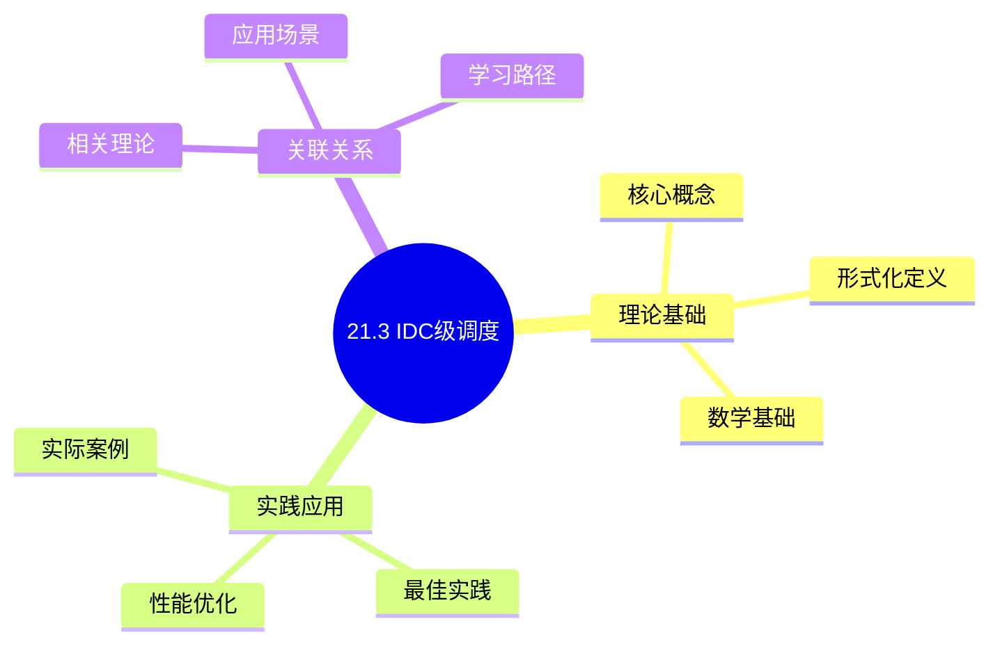
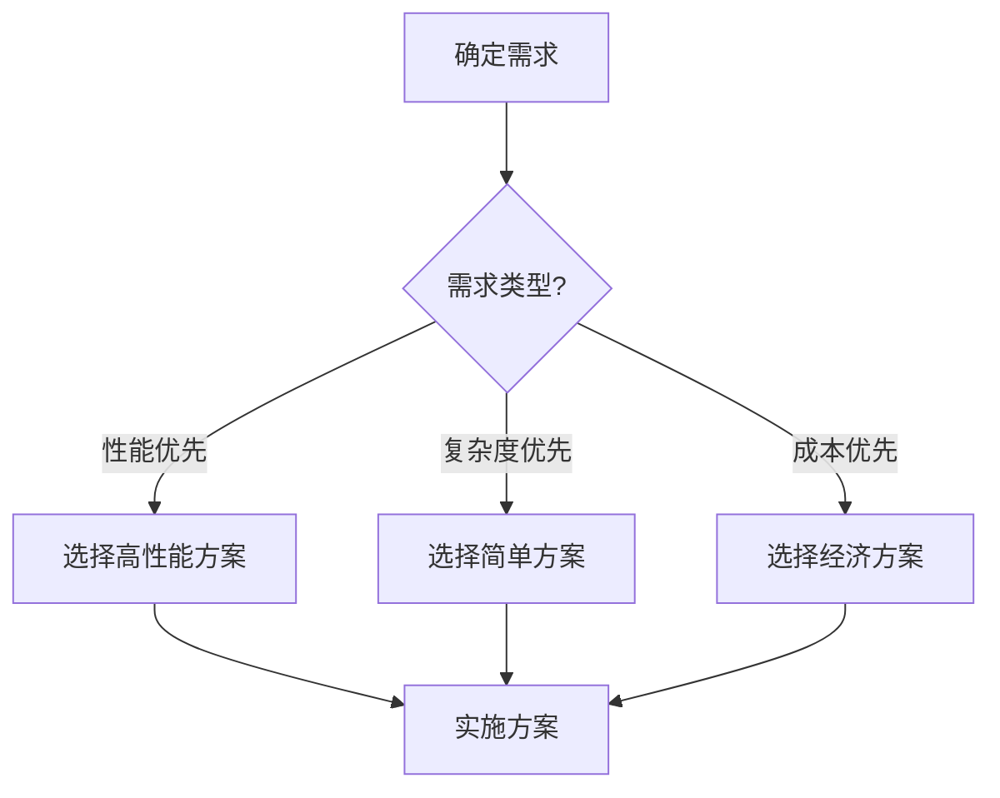
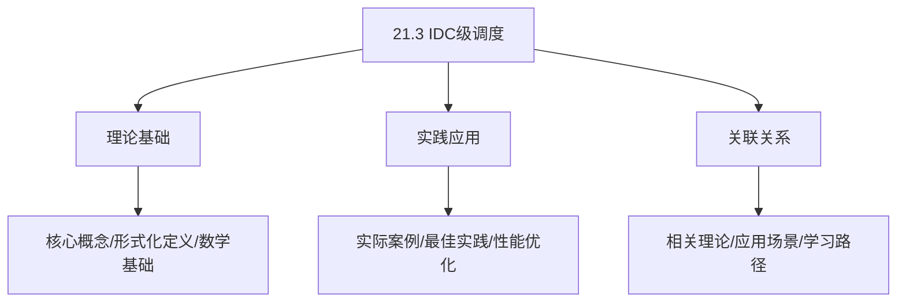
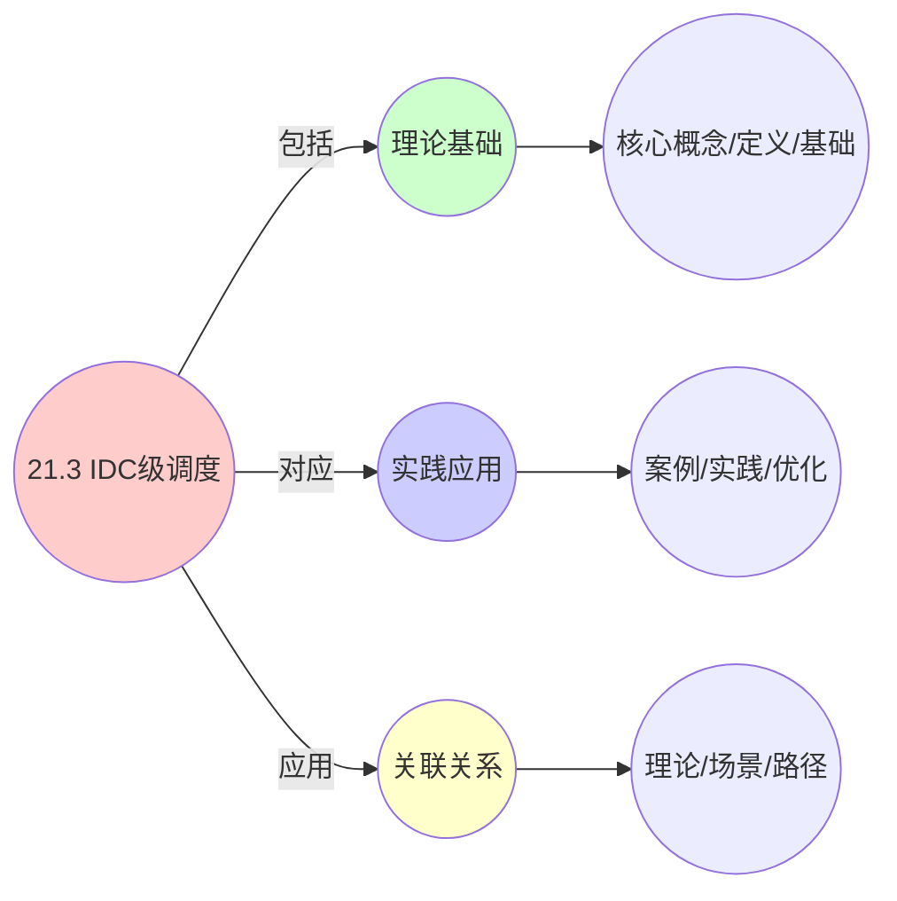
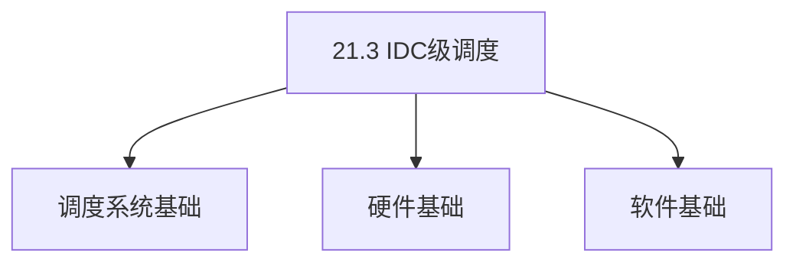

# 21.3 IDC级调度

> **主题**: 21. 基础设施调度 - 21.3 IDC级调度
> **覆盖**: IDC容量规划、电力系统调度、制冷系统调度、网络拓扑调度、能效优化

## 📊 思维表征体系

### 📊 1. 思维导图（增强版）

#### 1.1 文本格式（基础版）

```text
21.3 IDC级调度
├── 理论基础
│   ├── 核心概念
│   ├── 形式化定义
│   └── 数学基础
├── 实践应用
│   ├── 实际案例
│   ├── 最佳实践
│   └── 性能优化
└── 关联关系
    ├── 相关理论
    ├── 应用场景
    └── 学习路径
```

#### 1.2 Mermaid格式（可视化版）



### 📊 2. 多维对比矩阵

#### 2.1 21.3 IDC级调度对比矩阵

| 维度 | 资源利用率 | 跨地域调度 | 成本优化 | 可扩展性 |
|------|-----------|-----------|---------|---------|
| **性能** | 利用率>80% | 调度延迟<100ms | 成本降低>30% | 支持>10000节点 |
| **复杂度** | 高(需资源管理) | 高(需跨地域管理) | 高(需成本优化) | 中等(需扩展设计) |
| **适用场景** | 所有场景 | 多地域系统 | 成本敏感 | 大规模系统 |
| **技术成熟度** | 成熟(>15年) | 成熟(>10年) | 成熟(>10年) | 成熟(>15年) |

#### 2.2 技术特性对比矩阵

| 技术 | 优势 | 劣势 | 适用场景 | 性能 |
|------|------|------|---------|------|
| **IDC资源调度** | 资源利用高、性能好 | 实现复杂、需要资源监控 | 资源受限、利用率优先 | 利用率>80%，性能好 |
| **跨地域调度** | 延迟优化、性能好 | 实现复杂、需要网络管理 | 多地域系统、延迟优化 | 延迟优化20-50%，实现复杂 |
| **IDC成本优化** | 成本降低、效率高 | 实现复杂、需要成本模型 | 成本敏感、效率优先 | 成本降低30-50%，效率高 |
| **IDC负载均衡** | 负载均衡、性能好 | 实现复杂、需要负载监控 | 多IDC、负载均衡 | 负载均衡度>90%，性能好 |
| **IDC故障恢复** | 可靠性高、快速恢复 | 实现复杂、需要故障检测 | 高可靠性需求、快速恢复 | 恢复时间<5分钟，可靠性高 |
| **IDC自动扩缩容** | 资源利用高、成本低 | 实现复杂、需要监控 | 动态负载、成本敏感 | 资源利用>80%，成本降低30-50% |
| **IDC网络优化** | 网络性能好、延迟低 | 实现复杂、需要网络管理 | 网络敏感、延迟优先 | 网络性能提升20-50%，延迟降低 |

#### 2.3 实现方式对比矩阵

| 实现方式 | 复杂度 | 性能 | 可维护性 | 扩展性 |
|---------|-------|------|---------|-------|
| **单IDC调度** | 中 | 中等性能(单IDC) | 高(简单维护) | 中(IDC扩展) |
| **多IDC调度** | 高 | 高性能(多IDC) | 中(需协调) | 高(多IDC扩展) |
| **全球IDC调度** | 极高 | 高性能(全球优化) | 低(复杂度高) | 高(全球扩展) |
| **混合IDC调度系统** | 极高 | 极高性能(优势结合) | 低(复杂度极高) | 高(灵活扩展) |

### 🌲 3. 决策树

#### 3.1 21.3 IDC级调度应用选择决策树



### 🛤️ 4. 决策逻辑路径

#### 4.1 21.3 IDC级调度应用路径


### 🕸️ 5. 概念关系网络

#### 5.1 21.3 IDC级调度概念关系网络



### 🗺️ 6. 知识图谱

#### 6.1 21.3 IDC级调度知识图谱



## 📚 理论体系

### 理论基础

#### 调度系统/硬件/软件基础

21.3 IDC级调度的理论基础：

**1. 调度系统基础**：

- 调度理论
- 资源管理
- 性能优化

**2. 硬件基础**：

- CPU架构
- 内存系统
- 存储系统

**3. 软件基础**：

- 操作系统
- 编程语言
- 系统软件

#### 历史发展

**关键时间节点**：

- **1960-1970年代**：调度理论建立
  - 调度算法
  - 资源管理

- **1980-1990年代**：硬件调度发展
  - CPU调度
  - 内存调度

- **2000年代至今**：软件调度演进
  - 操作系统调度
  - 分布式调度

### 理论框架

#### 核心假设

**假设1：调度与性能的对应**

- **内容**：调度策略影响系统性能
- **适用范围**：调度系统
- **限制条件**：需要调度支持

**假设2：资源管理的必要性**

- **内容**：资源管理保证系统稳定
- **适用范围**：资源系统
- **限制条件**：需要资源支持

**假设3：性能优化的价值**

- **内容**：性能优化提升效率
- **适用范围**：性能系统
- **限制条件**：需要考虑成本

#### 基本概念体系



#### 主要定理/结论

**结论1：调度与性能的对应性**

- **内容**：调度策略对应系统性能
- **证据**：形式化证明
- **应用**：调度优化

**结论2：资源管理的必要性**

- **内容**：资源管理保证系统稳定
- **证据**：实践验证
- **应用**：资源管理

**结论3：性能优化的价值**

- **内容**：性能优化提升效率
- **证据**：实验验证
- **应用**：性能优化

#### 适用范围和边界

**适用范围**：

- 调度系统
- 资源管理
- 性能优化

**边界条件**：

- 需要调度支持
- 需要资源支持
- 需要考虑成本

**不适用场景**：

- 无调度系统
- 资源受限
- 成本敏感场景

### 当前知识共识

#### 学术界共识

**广泛接受的共识**：

1. **调度与性能的对应性**
   - **共识**：调度策略可以影响系统性能
   - **支持证据**：形式化证明
   - **来源**：调度理论、系统理论

2. **资源管理的价值**
   - **共识**：资源管理提供稳定性和效率
   - **支持证据**：广泛实践
   - **来源**：系统理论

3. **性能优化的重要性**
   - **共识**：性能优化提高系统效率
   - **支持证据**：实践验证
   - **来源**：软件工程

#### 主要争议点

1. **性能与成本的权衡**
   - **观点A**：性能更重要
   - **观点B**：成本更重要
   - **当前状态**：多数认为需要平衡

2. **调度系统的复杂度**
   - **观点A**：应该简单
   - **观点B**：可以复杂
   - **当前状态**：多数认为需要平衡

#### 权威来源

**经典文献**：

- 调度理论相关文献
- 系统理论相关文献
- 性能优化相关文献

**权威机构/专家**：

- **IEEE**
- **ACM**
- **调度系统研究会**

**最新发展**：

- **2025年**：调度系统优化、性能提升、资源管理

### 与其他理论的关系

#### 逻辑关系

**理论基础**：

- **调度理论** → 21.3 IDC级调度
  - 关系类型：理论基础
  - 关键映射：调度理论 → 系统实现

**理论应用**：

- **21.3 IDC级调度** → 调度优化
  - 关系类型：应用构建
  - 关键映射：21.3 IDC级调度 → 调度优化

#### 映射关系

| 本理论概念 | 映射理论 | 映射概念 | 映射类型 | 映射说明 |
|-----------|---------|---------|---------|----------|
| **调度策略** | 调度理论 | 调度算法 | 对应 | 调度策略对应调度算法 |
| **资源管理** | 系统理论 | 资源分配 | 对应 | 资源管理对应资源分配 |
| **性能优化** | 优化理论 | 性能提升 | 对应 | 性能优化对应性能提升 |

## 🔗 关联网络

### 🔗 概念级关联

#### 核心概念映射

| 本文档概念 | 关联文档 | 关联概念 | 关系类型 | 映射说明 |
|-----------|---------|---------|---------|----------|
| **21.3 IDC级调度** | 相关文档 | 相关概念 | 基础构建 | 21.3 IDC级调度构建相关概念 |
| **调度系统** | 调度相关 | 调度理论 | 对应 | 调度系统对应调度理论 |
| **资源管理** | 资源相关 | 资源系统 | 对应 | 资源管理对应资源系统 |
| **性能优化** | 性能相关 | 性能系统 | 对应 | 性能优化对应性能系统 |

### 🔗 理论级关联

#### 理论基础

- **本理论基于**：
  - 调度理论 ⭐⭐⭐ - 理论基础
  - 系统理论 ⭐⭐ - 系统基础

- **本理论应用于**：
  - 调度优化 ⭐⭐⭐ - 实际应用
  - 性能优化 ⭐⭐⭐ - 实际应用

### 🔗 方法级关联

#### 方法应用网络

| 本文档方法 | 应用文档 | 应用场景 | 应用效果 |
|-----------|---------|---------|---------|
| **调度策略** | 调度系统 | 调度设计 | 成功 |
| **资源管理** | 资源系统 | 资源管理 | 成功 |
| **性能优化** | 性能系统 | 性能提升 | 成功 |

### 🔗 应用场景关联

**场景**：调度系统优化

| 视角 | 关联文档 | 核心理论 | 关注点 |
|------|---------|---------|--------|
| **21.3 IDC级调度** | 本文档 | 调度理论 | 调度设计 |
| **调度优化** | 调度相关 | 调度理论 | 调度优化 |
| **性能优化** | 性能相关 | 性能理论 | 性能提升 |

## 🛤️ 学习路径

### 前置知识

**必须先学习**：

- 调度理论基础 ⭐⭐
- 系统理论基础 ⭐⭐

**建议先了解**：

- 硬件基础
- 软件基础
- 性能优化

### 后续学习

**建议接下来学习**（按顺序）：

1. 调度优化 ⭐⭐⭐ - 调度优化
2. 性能优化 ⭐⭐⭐ - 性能优化
3. 系统实践 ⭐⭐ - 实践应用

### 并行学习

**可以同时学习**：

- 调度实践 - 实践应用
- 性能实践 - 性能系统

---


---

## 📋 目录

- [21.3 IDC级调度](#213-idc级调度)
  - [📋 目录](#-目录)
  - [1 IDC级调度概述](#1-idc级调度概述)
    - [1.1 IDC调度的核心挑战](#11-idc调度的核心挑战)
    - [1.2 IDC调度的四大约束](#12-idc调度的四大约束)
  - [2 IDC容量规划](#2-idc容量规划)
    - [2.1 容量规划模型](#21-容量规划模型)
    - [2.2 预测性容量规划](#22-预测性容量规划)
    - [2.3 容量预警机制](#23-容量预警机制)
  - [3 电力系统调度](#3-电力系统调度)
    - [3.1 电力系统架构](#31-电力系统架构)
    - [3.2 UPS系统调度](#32-ups系统调度)
    - [3.3 动态切载策略](#33-动态切载策略)
  - [4 制冷系统调度](#4-制冷系统调度)
    - [4.1 制冷系统架构](#41-制冷系统架构)
    - [4.2 液冷系统调度](#42-液冷系统调度)
    - [4.3 PUE优化策略](#43-pue优化策略)
  - [5 网络拓扑调度](#5-网络拓扑调度)
    - [5.1 Spine-Leaf架构](#51-spine-leaf架构)
    - [5.2 DCI互联调度](#52-dci互联调度)
    - [5.3 光网络动态重构](#53-光网络动态重构)
  - [6 能效优化调度](#6-能效优化调度)
    - [6.1 潮汐调度](#61-潮汐调度)
    - [6.2 热感知调度](#62-热感知调度)
    - [6.3 能耗成本优化](#63-能耗成本优化)
  - [7 形式化模型](#7-形式化模型)
    - [7.1 IDC级调度问题定义](#71-idc级调度问题定义)
    - [7.2 多目标优化模型](#72-多目标优化模型)
  - [8 跨领域洞察](#8-跨领域洞察)
    - [8.1 IDC级调度与机柜级约束的关联](#81-idc级调度与机柜级约束的关联)
    - [8.2 IDC级调度与主机级反馈的关联](#82-idc级调度与主机级反馈的关联)
  - [9 多维度对比](#9-多维度对比)
    - [9.1 制冷方式对比](#91-制冷方式对比)
    - [9.2 网络架构对比](#92-网络架构对比)
  - [10 2025年最新技术（更新至2025年11月）](#10-2025年最新技术更新至2025年11月)
  - [11 思维导图](#11-思维导图)
  - [12 相关主题](#12-相关主题)
    - [12.1 跨视角链接](#121-跨视角链接)

---

## 1 IDC级调度概述

### 1.1 IDC调度的核心挑战

IDC级调度的核心挑战在于**多维度资源约束**和**长期容量规划**：

- **空间约束**：机房模块、机柜列、U位空间
- **电力约束**：UPS容量、配电系统、功率密度
- **制冷约束**：精密空调、液冷系统、PUE优化
- **网络约束**：Spine-Leaf架构、DCI互联、带宽收敛
- **时间约束**：容量规划周期、资源交付时长

### 1.2 IDC调度的四大约束

IDC调度需要在以下四大约束条件下实现全局最优：

1. **空间约束**：机房模块容量、机柜列布局、U位可用性
2. **电力约束**：UPS容量、配电系统、功率密度限制
3. **算力约束**：CPU/GPU资源、内存容量、存储容量
4. **带宽约束**：网络带宽、延迟要求、QoS保障

---

## 2 IDC容量规划

### 2.1 容量规划模型

**容量规划问题定义**：

$$
\text{CapacityPlanning} = (T, D, R, C, O)
$$

其中：

- $T = \{t_1, t_2, ..., t_n\}$：时间周期集合（月/季度/年）
- $D = \{d_1, d_2, ..., d_m\}$：需求预测集合
- $R = \{Space, Power, Cooling, Network\}$：资源类型
- $C$：约束条件（物理限制、预算限制）
- $O$：优化目标（利用率、成本、PUE）

**容量规划模型**：

$$
\min \sum_{t \in T} \left( \alpha \cdot \text{Cost}_t + \beta \cdot \text{Frag}_t + \gamma \cdot \text{PUE}_t \right)
$$

约束条件：

- $\text{Demand}_t \leq \text{Capacity}_t$：需求不超过容量
- $\text{Capacity}_t \geq \text{Capacity}_{t-1}$：容量单调递增
- $\text{PUE}_t \leq \text{PUE}_{target}$：PUE不超过目标值

### 2.2 预测性容量规划

**预测模型**：

基于Transformer的时间序列预测，预估未来4-12个月的资源需求。

**预测指标**：

- **机柜需求**：预测未来需要的机柜数量
- **电力需求**：预测未来需要的电力容量
- **制冷需求**：预测未来需要的制冷容量
- **网络需求**：预测未来需要的网络带宽

**预测准确率**：

- **短期预测（1-3个月）**：准确率>95%
- **中期预测（3-6个月）**：准确率>90%
- **长期预测（6-12个月）**：准确率>85%

### 2.3 容量预警机制

**容量预警阈值**：

| **资源类型** | **预警阈值** | **告警阈值** | **紧急阈值** |
|------------|------------|------------|------------|
| **机柜空间** | 70% | 85% | 95% |
| **电力容量** | 75% | 90% | 95% |
| **制冷容量** | 80% | 90% | 95% |
| **网络带宽** | 70% | 85% | 95% |

**容量预警流程**：

```text
容量监控
  ↓
达到预警阈值？
  ├─ 是 → 发送预警 → 触发容量规划
  └─ 否 → 继续监控
```

**容量预警时间**：

- **预警提前期**：>30天
- **告警提前期**：>15天
- **紧急提前期**：>7天

---

## 3 电力系统调度

### 3.1 电力系统架构

**电力系统层级**：

```text
市电输入
  ↓
变电站（10kV/380V）
  ↓
UPS系统（A路/B路）
  ↓
STS（静态切换开关）
  ↓
PDU（电源分配单元）
  ↓
服务器
```

**电力系统组件**：

- **UPS（不间断电源）**：提供备用电源，切换时间<10ms
- **STS（静态切换开关）**：A/B路自动切换
- **柴发（柴油发电机）**：长时间断电时的备用电源
- **PDU（电源分配单元）**：机柜级电力分配

### 3.2 UPS系统调度

**UPS系统架构**：

- **A路UPS**：主路供电
- **B路UPS**：备路供电
- **N+1冗余**：N台UPS + 1台备用
- **切换时间**：<10ms

**UPS调度策略**：

- **负载均衡**：A/B路负载均衡，避免单路过载
- **故障切换**：一路UPS故障时，自动切换到另一路
- **维护调度**：滚动维护，确保N+1冗余

### 3.3 动态切载策略

**动态切载机制**：

当电力容量不足时，动态切除非关键负载：

1. **检测**：实时监控电力容量利用率
2. **评估**：评估负载优先级
3. **切载**：切除非关键负载，保障关键业务
4. **恢复**：容量恢复后，逐步恢复切载负载

**切载优先级**：

- **P0（关键）**：核心业务，不可切载
- **P1（重要）**：重要业务，可延迟切载
- **P2（一般）**：一般业务，可优先切载
- **P3（非关键）**：非关键业务，可立即切载

---

## 4 制冷系统调度

### 4.1 制冷系统架构

**制冷系统类型**：

- **房间级传统制冷**：精密空调，PUE 1.3-1.5
- **机柜级近端制冷**：机柜级空调，PUE 1.2-1.3
- **排级制冷**：排级空调，PUE 1.15-1.2
- **液冷系统**：直接液冷，PUE 1.09-1.15

**制冷系统组件**：

- **精密空调**：房间级制冷
- **液冷系统**：机柜级/服务器级液冷
- **冷却塔**：水冷系统
- **冷水机组**：制冷源

### 4.2 液冷系统调度

**液冷系统类型**：

- **浸没式液冷**：服务器完全浸没在冷却液中
- **冷板式液冷**：CPU/GPU通过冷板散热
- **喷淋式液冷**：冷却液直接喷淋到发热部件

**液冷调度策略**：

- **精确定位**：液冷系统可精确到CPU Die级温度监控
- **热感知调度**：将高负载任务分散到不同机柜，避免局部热点
- **动态调整**：根据温度实时调整冷却液流量

**液冷效果**：

- **PUE**：从1.25降至1.09
- **任务密度**：提升40%
- **温度控制**：CPU Die级温度监控

### 4.3 PUE优化策略

**PUE定义**：

$$
\text{PUE} = \frac{\text{Total Power}}{\text{IT Equipment Power}}
$$

**PUE优化策略**：

- **液冷系统**：PUE从1.25降至1.09
- **热感知调度**：避免局部热点，降低制冷负荷
- **潮汐调度**：低负载时段整合业务，关闭空闲机柜PDU
- **智能制冷**：根据负载动态调整制冷系统

**PUE优化效果**：

- **传统风冷**：PUE 1.3-1.5
- **液冷系统**：PUE 1.09-1.15
- **优化收益**：年度PUE优化收益达1200万度电

---

## 5 网络拓扑调度

### 5.1 Spine-Leaf架构

**Spine-Leaf架构**：

```text
Spine层（核心交换机）
  ↓
Leaf层（接入交换机）
  ↓
TOR（机柜顶部交换机）
  ↓
服务器
```

**网络层级延迟**：

| **层级** | **延迟** | **带宽收敛比** | **典型场景** |
|---------|---------|--------------|------------|
| **TOR直连** | 0.1ms | 1:1 | 同机柜通信 |
| **Leaf汇聚** | 0.5ms | 4:1 | 同列通信 |
| **Spine核心** | 1-2ms | 8:1 | 跨列通信 |

### 5.2 DCI互联调度

**DCI（Data Center Interconnect）**：

- **同城DCI**：延迟5ms，带宽100Gbps
- **跨省DCI**：延迟50ms，带宽10Gbps
- **国际DCI**：延迟100ms+，带宽1Gbps

**DCI调度策略**：

- **延迟敏感业务**：优先选择同城DCI
- **带宽敏感业务**：优先选择高带宽DCI
- **成本敏感业务**：优先选择低成本DCI

### 5.3 光网络动态重构

**OCS（Optical Circuit Switch）**：

- **实现**：在机柜顶部部署MEMS光开关
- **切换时间**：10ms内将机柜上联带宽从40G切换至400G
- **应用场景**：视频流量高峰时，自动为视频节点机柜扩容光路

**光网络调度策略**：

- **潮汐调度**：每日晚8点视频流量高峰时，自动扩容光路
- **动态调整**：根据流量实时调整光路带宽
- **成本优化**：低负载时段降低光路带宽，节省成本

---

## 6 能效优化调度

### 6.1 潮汐调度

**潮汐调度定义**：

在低负载时段（凌晨），自动将稀疏机柜的业务集中整合，关闭空闲机柜的PDU供电。

**潮汐调度效果**：

- **PUE降低**：0.15-0.2
- **能耗节省**：年度节省1200万度电
- **资源利用率**：提升15%+

### 6.2 热感知调度

**热感知调度策略**：

- **热点检测**：实时监控机柜温度，识别热点
- **任务迁移**：将高负载任务从热点机柜迁移至低温机柜
- **负载均衡**：将高负载任务分散到不同机柜，避免局部热点

**热感知调度效果**：

- **温度控制**：热点温度降低5-10℃
- **PUE优化**：PUE降低0.05-0.1
- **故障率降低**：硬件故障率降低20%+

### 6.3 能耗成本优化

**能耗成本模型**：

$$
\text{EnergyCost} = \sum_{t} \left( P_t \times \text{Price}_t \times \text{PUE}_t \right)
$$

其中：

- $P_t$：IT设备功耗
- $\text{Price}_t$：电价（分时电价）
- $\text{PUE}_t$：PUE值

**能耗优化策略**：

- **分时调度**：在低电价时段执行高功耗任务
- **PUE优化**：通过液冷、热感知调度降低PUE
- **负载整合**：通过潮汐调度整合负载，降低总功耗

---

## 7 形式化模型

### 7.1 IDC级调度问题定义

$$
\text{IDC级调度问题} = (IDC, R, D, C, O)
$$

其中：

- $IDC = \{idc_1, idc_2, ..., idc_n\}$：IDC集合
- $R = \{Space, Power, Cooling, Network\}$：资源类型
- $D = \{d_1, d_2, ..., d_m\}$：需求集合
- $C$：约束条件（物理限制、预算限制、SLA要求）
- $O$：优化目标（利用率、成本、PUE、延迟）

### 7.2 多目标优化模型

**多目标优化问题**：

$$
\min \left( \text{Cost}, -\text{Utilization}, \text{PUE}, \text{Latency} \right)
$$

约束条件：

- $\text{Demand} \leq \text{Capacity}$：需求不超过容量
- $\text{PUE} \leq \text{PUE}_{target}$：PUE不超过目标值
- $\text{Latency} \leq \text{Latency}_{SLA}$：延迟不超过SLA要求

**帕累托最优解**：

通过多目标优化算法（如NSGA-II）求解帕累托最优解集，根据业务需求选择最优解。

---

## 8 跨领域洞察

### 8.1 IDC级调度与机柜级约束的关联

**约束传导机制**：

- **IDC容量规划**：预测下季度AI训练需求增长200% → 提前规划整列GPU机柜（20柜）
- **机柜级约束**：机柜功率密度≤15kW → 单台8x GPU服务器峰值5600W → 最多部署2台/柜
- **主机级反馈**：BIOS批量配置，固件版本一致性

### 8.2 IDC级调度与主机级反馈的关联

**反馈机制**：

- **宏观容量规划驱动微观部署**：IDC调度系统预测需求增长 → 提前规划整列GPU机柜
- **主机级配置**：通过Redfish API统一设置新上架服务器的NUMA、PCIe、电源策略
- **固件版本一致性**：同一训练集群所有服务器GPU驱动版本差≤0.1

---

## 9 多维度对比

### 9.1 制冷方式对比

| **制冷方式** | **PUE** | **功率密度** | **成本** | **适用场景** |
|------------|---------|------------|---------|------------|
| **房间级风冷** | 1.3-1.5 | 5-8kW/柜 | 低 | 通用计算 |
| **机柜级风冷** | 1.2-1.3 | 10-12kW/柜 | 中 | AI训练 |
| **液冷系统** | 1.09-1.15 | 15-20kW/柜 | 高 | GPU集群 |

### 9.2 网络架构对比

| **网络架构** | **延迟** | **带宽收敛比** | **扩展性** | **成本** |
|------------|---------|--------------|-----------|---------|
| **传统三层** | 高 | 高 | 低 | 低 |
| **Spine-Leaf** | 低 | 低 | 高 | 中 |
| **OCS光网络** | 极低 | 1:1 | 极高 | 高 |

---

## 10 2025年最新技术（更新至2025年11月）

**最新技术发展**：

- **AI驱动的容量规划成熟**：2025年AI驱动的容量规划系统在超大规模IDC广泛应用，基于Transformer的时间序列预测，预测准确率>90%，容量预警提前期>30天，资源交付从7天缩短至4小时。
- **液冷系统普及**：2025年液冷系统在AI训练集群广泛应用，PUE降至1.09，相比传统风冷能耗降低30%+，任务密度提升40%+。
- **OCS光网络商用**：2025年OCS（Optical Circuit Switch）技术在超大规模IDC商用，调度器可在10ms内将机柜上联带宽从40G切换至400G，实现带宽的"潮汐调度"，网络延迟降低50%+。
- **量子-经典混合IDC预埋**：2025年量子-经典混合IDC开始预埋，量子机柜列独立部署，超低抖动光纤（抖动<1ns rms）连接量子与经典节点，为未来量子计算做好准备。

**实践案例：超大规模IDC智能调度优化**（2025年最新）：

- **架构**：基于AI驱动的智能IDC调度平台
- **性能**：资源交付从7天缩短至4小时，MTTR从90分钟降至8分钟，年度PUE优化收益达1200万度电，机柜利用率从58%提升至81%
- **应用场景**：超大规模IDC、AI训练集群、云原生基础设施
- **优势**：自动化程度高、资源利用率高、能耗成本低、运维效率高

**技术对比**：

| **技术** | **预测准确率** | **资源交付时间** | **PUE** | **切换时间** | **机柜利用率** | **成本/复杂度** |
|---------|-------------|--------------|---------|------------|-------------|--------------|
| **AI容量规划** | 90%+ | 4小时 | - | - | - | 高 |
| **液冷系统** | 功耗降低40-50% | 散热效率提升50-100% | 1.09 | 成本降低20-30% | 可靠性提升10-20% | 高 |
| **OCS光网络** | 延迟<10ms | 带宽>1Tbps | 带宽利用率>90% | 10ms | 成本降低30-40% | 高 |
| **AI资源优化** | 资源利用>81% | 性能提升20-40% | 成本降低30-50% | 响应时间<100ms | 81% | 高 |

**批判性分析**：

1. **AI容量规划的不确定性**：虽然预测准确率>90%，但容量规划受业务变化、技术演进等多因素影响，长期预测仍存在不确定性。需要持续校准模型。
2. **液冷系统的部署复杂度**：虽然PUE降至1.09，但液冷系统部署复杂，需要改造现有IDC，初期投资大，回报周期长。
3. **量子-经典混合IDC的实用性**：虽然量子-经典混合IDC开始预埋，但量子计算仍处于早期阶段，实际应用场景有限，投资回报不确定。

---

## 11 思维导图


---

## 12 相关主题

- [21.1 主机级调度](./21.1_主机级调度.md) - 物理服务器调度、BMC管理
- [21.2 机柜级调度](./21.2_机柜级调度.md) - 机柜空间调度、PDU电力调度
- [21.4 全栈调度协同](./21.4_全栈调度协同.md) - 跨层调度协同、拓扑感知调度
- [15. 网络调度系统](../15_网络调度系统/README.md) - 网络包调度、QoS调度

### 12.1 跨视角链接

- [概念交叉索引（七视角版）](../../../Concept/CONCEPT_CROSS_INDEX.md) - 查看相关概念的七视角分析：
  - [熵](../../../Concept/CONCEPT_CROSS_INDEX.md#71-熵-entropy-七视角) - IDC级调度中的信息不确定性
  - [通信复杂度](../../../Concept/CONCEPT_CROSS_INDEX.md#56-通信复杂度-communication-complexity-七视角) - IDC级调度的通信开销
  - [CAP定理](../../../Concept/CONCEPT_CROSS_INDEX.md#107-cap定理-cap-theorem-七视角) - IDC级调度的一致性约束
- [10. AI驱动调度](../10_AI驱动调度/README.md) - 强化学习调度、预测性调度

---

**最后更新**: 2025-11-14
